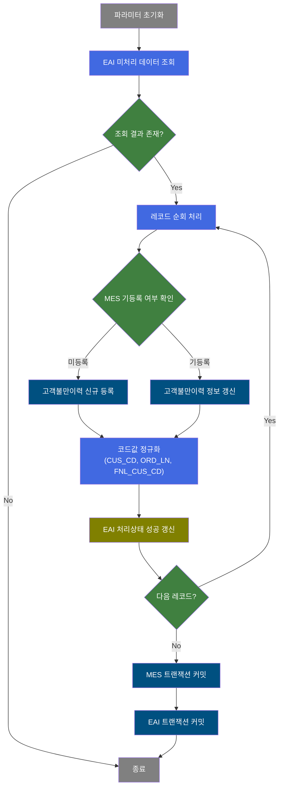
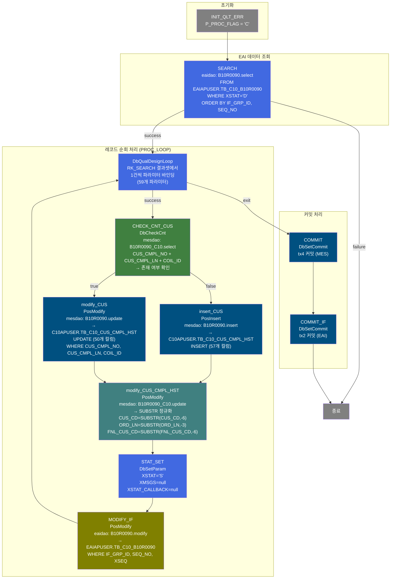
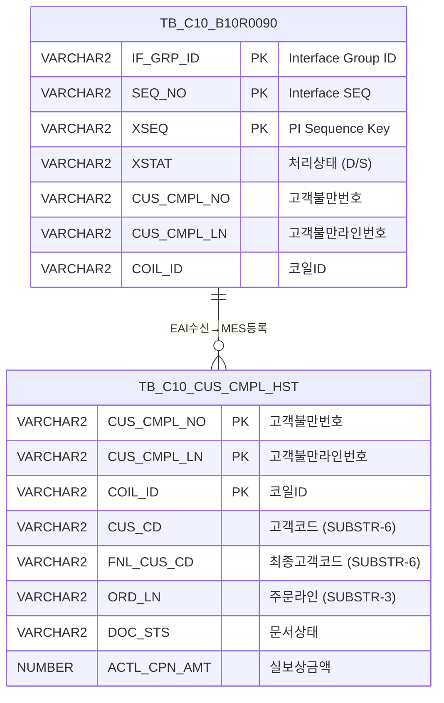

<h1 style="font-size: 40px; text-align: center; font-weight:
   bold; margin: 30px 0;">
  B10R0090 레거시 시스템 분석 종합 보고서
</h1>


# 1. 시스템 개요
- **서비스 ID**: B10R0090
- **업무명**: 고객불만이력 EAI 수신 배치
- **분석 일시**: 2026-03-17 11:03 KST
- **분석 시간**: ~3분
- **전체 Activity 수**: 11개 (Built-in 5, Common 4, Custom 2)
- **분석자**: Claude Opus 4.6
- **분석 도구**: /analyze-service B10R0090
- **문서 버전**: 1.0

# 📊 비즈니스 프로세스 분석

## 시스템 목적

B10R0090은 EAI(Enterprise Application Integration) 시스템으로부터 수신된 **고객불만이력 데이터를 MES 시스템에 동기화하는 NUI(배치) 서비스**이다. 외부 품질관리 시스템(SAP 등)에서 등록된 고객불만 정보가 EAI 인터페이스 테이블(`EAIAPUSER.TB_C10_B10R0090`)에 적재되면, 본 서비스가 미처리 상태(`XSTAT='D'`)인 레코드를 조회하여 MES 고객불만이력 테이블(`C10APUSER.TB_C10_CUS_CMPL_HST`)에 신규 등록 또는 기존 데이터 갱신을 수행한다.

처리 과정에서 고객코드(`CUS_CD`), 주문라인번호(`ORD_LN`), 최종고객코드(`FNL_CUS_CD`)에 대한 SUBSTR 정규화를 수행하며, 각 레코드 처리 완료 후 EAI 인터페이스 테이블의 상태를 성공(`XSTAT='S'`)으로 변경한다. 전체 레코드 처리 후 MES 트랜잭션(tx4)과 EAI 트랜잭션(tx2)을 순차 커밋하여 데이터 정합성을 보장한다.

## 핵심 워크플로우 다이어그램



### 상세 워크플로우 다이어그램



## 주요 유즈케이스

### UC-01: 고객불만이력 EAI 수신 및 신규 등록
- **Actor**: 배치 스케줄러 (자동 실행)
- **목적**: 외부 시스템에서 EAI를 통해 수신된 고객불만 정보를 MES DB에 신규 등록

- **전제조건**:
  - EAI 인터페이스 테이블(`TB_C10_B10R0090`)에 `XSTAT='D'` 상태의 미처리 레코드 존재
  - MES DB에 해당 고객불만번호+라인+코일ID 조합이 미등록 상태

- **주요 흐름**:
  1. 서비스 시작 시 `P_PROC_FLAG='C'` 파라미터 초기화 (INIT_QLT_ERR)
  2. EAI 인터페이스 테이블에서 미처리(`XSTAT='D'`) 레코드 전체 조회 (SEARCH → B10R0090.select)
  3. 조회된 레코드셋을 1건씩 순회 (PROC_LOOP → DbQualDesignLoop, 59개 파라미터 바인딩)
  4. MES 고객불만이력 테이블에 해당 레코드 존재 여부 확인 (CHECK_CNT_CUS → B10R0090_C10.select)
  5. 미존재 시 신규 INSERT 수행 (insert_CUS → B10R0090.insert, 57개 컬럼)
  6. 코드값 정규화 UPDATE 수행 (modify_CUS_CMPL_HST → B10R0090_C10.update)
  7. EAI 인터페이스 처리상태를 'S'(성공)로 갱신 (STAT_SET → MODIFY_IF → B10R0090.modify)
  8. 다음 레코드로 루프 반복

- **대체 흐름**:
  - EAI 조회 결과 0건: SEARCH failure → 서비스 즉시 종료
  - 처리 중 오류 발생: P_ERR_KEY 설정 → 커밋 시 에러 체크

- **후행조건**:
  - MES 고객불만이력 테이블에 신규 레코드 등록 완료
  - EAI 인터페이스 레코드 상태가 'S'로 변경
  - MES(tx4), EAI(tx2) 트랜잭션 순차 커밋 완료

### UC-02: 고객불만이력 EAI 수신 및 기존 데이터 갱신
- **Actor**: 배치 스케줄러 (자동 실행)
- **목적**: 외부 시스템에서 수정된 고객불만 정보를 MES DB에 반영하여 데이터 동기화

- **전제조건**:
  - EAI 인터페이스 테이블에 `XSTAT='D'` 상태의 미처리 레코드 존재
  - MES DB에 해당 고객불만번호+라인+코일ID 조합이 이미 등록됨

- **주요 흐름**:
  1. 서비스 시작 및 EAI 미처리 데이터 조회 (UC-01 1~4단계와 동일)
  2. MES 고객불만이력 테이블에 해당 레코드가 존재하므로 UPDATE 수행 (modify_CUS → B10R0090.update, 50개 SET 컬럼 + 3개 WHERE 조건)
  3. 코드값 정규화 처리 (modify_CUS_CMPL_HST → SUBSTR 적용)
  4. EAI 인터페이스 처리상태 성공 갱신 (STAT_SET → MODIFY_IF)
  5. 다음 레코드로 루프 반복

- **대체 흐름**:
  - 동일 배치 실행에서 신규/갱신 레코드가 혼재: CHECK_CNT_CUS가 레코드별로 분기 결정

- **후행조건**:
  - MES 고객불만이력 테이블의 기존 레코드가 최신 정보로 갱신
  - 코드값 정규화 완료 (CUS_CD 6자리, ORD_LN 3자리, FNL_CUS_CD 6자리)

### UC-03: 코드값 정규화 처리
- **Actor**: 시스템 (insert/update 후 자동 수행)
- **목적**: EAI로부터 수신된 고객코드, 주문라인번호, 최종고객코드의 자릿수를 MES 표준에 맞게 정규화

- **전제조건**:
  - insert_CUS 또는 modify_CUS 완료 후 후속 처리로 자동 실행

- **주요 흐름**:
  1. insert_CUS 또는 modify_CUS 성공 후 modify_CUS_CMPL_HST 전이
  2. B10R0090_C10.update 실행:
     - `CUS_CD = SUBSTR(CUS_CD, -6)` — 고객코드를 뒤 6자리로 정규화
     - `ORD_LN = SUBSTR(ORD_LN, -3)` — 주문라인번호를 뒤 3자리로 정규화
     - `FNL_CUS_CD = SUBSTR(FNL_CUS_CD, -6)` — 최종고객코드를 뒤 6자리로 정규화
  3. 감사 필드(LAST_UPDATED_*) 자동 갱신

- **대체 흐름**:
  - 코드값이 이미 정규 길이인 경우: SUBSTR 결과 변경 없음 (무해)

- **후행조건**:
  - CUS_CD, FNL_CUS_CD는 6자리, ORD_LN은 3자리로 통일

---
## 비즈니스 로직 상세

### 1. EAI 인터페이스 레코드 순회 및 분기 처리 (DbQualDesignLoop)

- **목적**: EAI 수신 데이터를 1건씩 순회하며 PosContext에 파라미터를 바인딩하여 후속 Activity가 처리할 수 있도록 데이터를 준비
- **처리 케이스**:

  **[케이스 1: 레코드 처리 계속]**
  ```
    조건: RK_SEARCH 결과셋에 처리할 레코드 남아있음
    처리:
      1. 현재 행(row)에서 59개 파라미터를 PosContext에 바인딩
         (IF_GRP_ID, SEQ_NO, XSEQ, XCRUD, XSTAT, XMSGS, XDATE, XTIME,
          XSTAT_CALLBACK, CUS_CMPL_NO, FNL_CUS_CD, ... ACNT_DOC)
      2. countName(QLT_DSN_STS_CD_COUNT) 기반 카운트 관리
      3. success 전이 → CHECK_CNT_CUS로 이동
  ```

  **[케이스 2: 모든 레코드 처리 완료]**
  ```
    조건: RK_SEARCH 결과셋의 모든 행 처리 완료
    처리:
      1. exit 전이 → COMMIT로 이동
      2. MES(tx4) 및 EAI(tx2) 순차 커밋 수행
  ```

### 2. 고객불만이력 존재 여부 확인 및 분기 (DbCheckCnt)

- **목적**: 동일한 고객불만번호+라인+코일ID 조합의 기존 데이터 존재 여부를 확인하여 INSERT/UPDATE 분기 결정
- **처리 케이스**:

  **[케이스 1: 기존 데이터 존재 (true)]**
  ```
    조건: B10R0090_C10.select 결과 건수 > 0
    처리:
      1. modify_CUS Activity로 전이
      2. 기존 레코드 전체 필드 UPDATE 수행
  ```

  **[케이스 2: 기존 데이터 미존재 (false)]**
  ```
    조건: B10R0090_C10.select 결과 건수 = 0
    처리:
      1. insert_CUS Activity로 전이
      2. 신규 레코드 INSERT 수행
  ```

### 3. 코드값 SUBSTR 정규화 로직

- **목적**: 외부 시스템과 MES 간 코드 체계 차이를 해소하기 위해 수신된 코드값의 자릿수를 통일
- **처리 케이스**:

  **[케이스 1: 코드값이 기준 자릿수보다 긴 경우]**
  ```
    조건: CUS_CD 길이 > 6자리 (예: '0012345678')
    처리:
      1. SUBSTR(CUS_CD, -6) → '345678' (뒤 6자리 추출)
      2. SUBSTR(ORD_LN, -3) → 뒤 3자리 추출
      3. SUBSTR(FNL_CUS_CD, -6) → 뒤 6자리 추출
  ```

  **[케이스 2: 코드값이 기준 자릿수 이하인 경우]**
  ```
    조건: CUS_CD 길이 ≤ 6자리
    처리:
      1. SUBSTR 적용 결과 원본값 유지 (변경 없음)
  ```

- **계산 공식**:
  ```
  정규화_고객코드 = SUBSTR(CUS_CD, -6)     -- 뒤 6자리
  정규화_주문라인 = SUBSTR(ORD_LN, -3)      -- 뒤 3자리
  정규화_최종고객코드 = SUBSTR(FNL_CUS_CD, -6) -- 뒤 6자리
  ```

- **예외 처리**:
  - 코드값이 NULL인 경우: SUBSTR(NULL, -N) = NULL (Oracle 동작, 에러 없음)
  - 코드값이 빈 문자열인 경우: SUBSTR 결과도 빈 문자열

---

# ⚙️ Java 컴포넌트 분석

## Custom Activity 상세 분석

### 2개 Custom Activity 발견

### 1. DbQualDesignLoop (PROC_LOOP)
- **클래스명**: com.unionsteel.mes.c10.activity.nui.DbQualDesignLoop
- **액티비티명**: PROC_LOOP
- **파일 경로**: src/com/unionsteel/mes/c10/activity/nui/DbQualDesignLoop.java
- **주요 기능**: GLUE Framework 기반 NUI(배치) 서비스에서 이전 액티비티가 조회한 ResultSet을 1건씩 순회 처리하기 위한 루프 제어 액티비티

#### 메소드 구조
- **주요 메소드**: runActivity
  - **반환 타입**: String (transition name: "success" 또는 "exit")
  - **파라미터**: PosContext (서비스 컨텍스트)

#### SQL 매핑 (총 0개)
| SQL 이름 | 쿼리 ID | 타입 | 테이블 |
|---------|---------|-----|-------|
| (없음 - 루프 제어 전용) | - | - | - |

#### 핵심 비즈니스 로직
- **ResultSet 순회**: bind-result(RK_SEARCH)로 지정된 PosRowSet을 1건씩 순회
- **파라미터 바인딩**: 59개의 `paramN|KEY` 형식 프로퍼티에서 현재 행의 컬럼값을 PosContext에 설정
- **루프 종료 판단**: 모든 행 처리 완료 시 "exit" 전이 반환
- **countName**: QLT_DSN_STS_CD_COUNT 기반 처리 건수 카운팅

#### Java 상수 및 의존성
- **주요 상수**: C10NuiConstantsIF 인터페이스 구현
- **핵심 의존성**: PosContext, PosRowSet, PosRow

---

### 2. DbCheckCnt (CHECK_CNT_CUS)
- **클래스명**: com.unionsteel.mes.c10.activity.nui.DbCheckCnt
- **액티비티명**: CHECK_CNT_CUS
- **파일 경로**: src/com/unionsteel/mes/c10/activity/nui/DbCheckCnt.java
- **주요 기능**: 특정 테이블에 데이터 존재 유무를 확인하는 범용 카운트 조회 Activity. SQL Key, 파라미터를 Service XML 프로퍼티로 동적 구성하여 `dao.find()` 조회 후 결과 건수에 따라 true/false 전이 반환

#### 메소드 구조
- **주요 메소드**: runActivity
  - **반환 타입**: String (transition name: "true" 또는 "false")
  - **파라미터**: PosContext (서비스 컨텍스트)

#### SQL 매핑 (총 1개)
| SQL 이름 | 쿼리 ID | 타입 | 테이블 |
|---------|---------|-----|-------|
| 고객불만이력 존재 확인 | B10R0090_C10.select | SELECT | TB_C10_CUS_CMPL_HST |

#### 핵심 비즈니스 로직
- **동적 SQL 실행**: Service XML의 sqlkey 프로퍼티에서 쿼리 ID 획득
- **동적 파라미터 구성**: param-count, param0~paramN으로 PosParameter 동적 생성
- **건수 판단**: 조회 결과 ≥ 1건 → "true" 전이 (UPDATE 분기), 0건 → "false" 전이 (INSERT 분기)

#### Java 상수 및 의존성
- **주요 상수**: C10NuiConstantsIF 인터페이스 구현
- **핵심 의존성**: PosActivity, PosJdbcDao, PosParameter, PosRowSet

---

# 💾 데이터 요구사항

## 핵심 테이블

### 1. TB_C10_CUS_CMPL_HST - (고객불만이력 메인 테이블)
| 컬럼명 | 타입 | PK | 설명 |
|--------|------|----|-----|
| CUS_CMPL_NO | VARCHAR2 | ✅ | 고객불만번호 |
| CUS_CMPL_LN | VARCHAR2 | ✅ | 고객불만라인번호 |
| COIL_ID | VARCHAR2 | ✅ | 코일ID |
| FNL_CUS_CD | VARCHAR2 | | 최종고객코드 (SUBSTR -6 정규화) |
| FNL_CUS_NM | VARCHAR2 | | 최종고객명 |
| SAL_END_DD | VARCHAR2 | | 판매종료일 |
| PRD_NM | VARCHAR2 | | 제품명 |
| CCL_BOM_NO | VARCHAR2 | | CCL BOM번호 |
| ORD_USG_NM | VARCHAR2 | | 주문용도명 |
| CMPL_CFM_COIL_WGT | NUMBER | | 불만확인코일중량 |
| RET_COIL_WGT | NUMBER | | 반품코일중량 |
| CMPL_SIT_QLT | VARCHAR2 | | 불만상황(품질) |
| ACTL_CPN_AMT | NUMBER | | 실보상금액 |
| CUR_UNT | VARCHAR2 | | 통화단위 |
| CMPL_DATE | VARCHAR2 | | 불만일자 |
| TRN_DD_CNT | NUMBER | | 이송일수 |
| DOC_STS | VARCHAR2 | | 문서상태 |
| CUS_CD | VARCHAR2 | | 고객코드 (SUBSTR -6 정규화) |
| CUS_NM | VARCHAR2 | | 고객명 |
| PRD_GRP | VARCHAR2 | | 제품그룹 |
| FLOW_CHL | VARCHAR2 | | 유통경로 |
| SAL_TEM | VARCHAR2 | | 영업팀 |
| SAL_CHR | VARCHAR2 | | 영업담당 |
| QLT_CHR | VARCHAR2 | | 품질담당 |
| MTL_CD | VARCHAR2 | | 소재코드 |
| ORD_NO | VARCHAR2 | | 주문번호 |
| ORD_LN | VARCHAR2 | | 주문라인 (SUBSTR -3 정규화) |
| PROC_NM | VARCHAR2 | | 공정명 |
| PRD_DD | VARCHAR2 | | 생산일 |
| DLV_DD | VARCHAR2 | | 납품일 |
| PRD_SIZE | VARCHAR2 | | 생산규격 |
| REC_WGT | NUMBER | | 수입중량 |
| CMPL_CFM_WGT_UNT | VARCHAR2 | | 불만확인중량단위 |
| CMPL_CTT | VARCHAR2 | | 불만내용 |
| CMPL_TP | VARCHAR2 | | 불만유형 |
| CMPL_SIT_CUS | VARCHAR2 | | 불만상황(고객) |
| OCC_CAU | VARCHAR2 | | 발생원인 |
| PRD_STS | VARCHAR2 | | 생산상태 |
| REQ_CPN_PLN | VARCHAR2 | | 보상방안요청 |
| CPN_PLN_QLT | VARCHAR2 | | 보상방안(품질) |
| FNL_CPN_PLN_SAL | VARCHAR2 | | 최종보상방안(영업) |
| CPN_YN | VARCHAR2 | | 보상여부 |
| CPN_AMT_QLT | NUMBER | | 보상금액(품질) |
| CPN_AMT_SAL | NUMBER | | 보상금액(영업) |
| CSH_CPN_WGT | NUMBER | | 현금보상중량 |
| QLT_END_DD | VARCHAR2 | | 품질종료일 |
| RET_PRD_ORD_NO | VARCHAR2 | | 반품생산주문번호 |
| CSH_CPN_ORD | VARCHAR2 | | 현금보상주문 |
| ACNT_YR | VARCHAR2 | | 회계연도 |
| ACNT_DOC | VARCHAR2 | | 회계전표 |
| CREATED_OBJECT_TYPE | VARCHAR2 | | 생성OBJECT유형 |
| CREATED_OBJECT_ID | VARCHAR2 | | 생성OBJECTID |
| CREATED_PROGRAM_ID | VARCHAR2 | | 생성프로그램ID |
| CREATION_TIMESTAMP | DATE | | 등록일시 |
| LAST_UPDATED_OBJECT_TYPE | VARCHAR2 | | 최종변경OBJECT유형 |
| LAST_UPDATED_OBJECT_ID | VARCHAR2 | | 최종변경OBJECTID |
| LAST_UPDATE_PROGRAM_ID | VARCHAR2 | | 최종변경프로그램ID |
| LAST_UPDATE_TIMESTAMP | DATE | | 최종변경일시 |

### 2. TB_C10_B10R0090 - (EAI 인터페이스 수신 테이블)
| 컬럼명 | 타입 | PK | 설명 |
|--------|------|----|-----|
| IF_GRP_ID | VARCHAR2 | ✅ | Interface Group ID |
| SEQ_NO | VARCHAR2 | ✅ | Interface SEQ |
| XSEQ | VARCHAR2 | ✅ | PI Sequence Key Value |
| XCRUD | VARCHAR2 | | CRUD 구분 |
| XSTAT | VARCHAR2 | | PI 처리 상태 (D=미처리, S=성공) |
| XMSGS | VARCHAR2 | | PI 에러 메시지 |
| XDATE | VARCHAR2 | | 처리 일자 |
| XTIME | VARCHAR2 | | 처리 시간 |
| XSTAT_CALLBACK | VARCHAR2 | | PI 콜백 상태 |
| CUS_CMPL_NO | VARCHAR2 | | 고객불만번호 |
| FNL_CUS_CD | VARCHAR2 | | 최종고객코드 |
| FNL_CUS_NM | VARCHAR2 | | 최종고객명 |
| LAST_UPDATED_OBJECT_TYPE | VARCHAR2 | | 최종변경OBJECT유형 |
| LAST_UPDATED_OBJECT_ID | VARCHAR2 | | 최종변경OBJECTID |
| LAST_UPDATE_PROGRAM_ID | VARCHAR2 | | 최종변경프로그램ID |
| LAST_UPDATE_TIMESTAMP | DATE | | 최종변경일시 |

## 데이터 플로우

### 1. EAI 수신 데이터 조회
```
[EAI 미처리 데이터 조회]
배치 실행
→ B10R0090.select
  FROM EAIAPUSER.TB_C10_B10R0090
  WHERE XSTAT = 'D'
  ORDER BY IF_GRP_ID, SEQ_NO
→ RK_SEARCH 결과셋에 미처리 레코드 목록 저장
```

### 2. MES 존재 확인 및 데이터 동기화
```
[레코드별 존재 확인]
PROC_LOOP에서 1건 바인딩
→ B10R0090_C10.select
  FROM C10APUSER.TB_C10_CUS_CMPL_HST
  WHERE CUS_CMPL_NO = :CUS_CMPL_NO
    AND CUS_CMPL_LN = :CUS_CMPL_LN
    AND COIL_ID = :COIL_ID
→ 결과 건수에 따라 INSERT/UPDATE 분기

[신규 등록 (미존재 시)]
→ B10R0090.insert
  INTO C10APUSER.TB_C10_CUS_CMPL_HST
  57개 컬럼 INSERT (위치 기반 파라미터)

[기존 갱신 (존재 시)]
→ B10R0090.update
  SET 50개 컬럼 UPDATE
  WHERE CUS_CMPL_NO, CUS_CMPL_LN, COIL_ID
```

### 3. 코드 정규화 및 EAI 상태 갱신
```
[코드값 정규화]
→ B10R0090_C10.update
  SET CUS_CD = SUBSTR(CUS_CD, -6)
     ,ORD_LN = SUBSTR(ORD_LN, -3)
     ,FNL_CUS_CD = SUBSTR(FNL_CUS_CD, -6)
  WHERE CUS_CMPL_NO, CUS_CMPL_LN, COIL_ID

[EAI 처리상태 성공 갱신]
→ B10R0090.modify
  UPDATE EAIAPUSER.TB_C10_B10R0090
  SET XSTAT = 'S', XMSGS = NULL, XSTAT_CALLBACK = NULL
  WHERE IF_GRP_ID, SEQ_NO, XSEQ
```

## SQL 일람표
| SQL 이름 | 쿼리 ID | 타입 | 출처 | 테이블 |
|---------|---------|-----|------|-------|
| 고객불만이력 신규 등록 | B10R0090.insert | INSERT | Service | C10APUSER.TB_C10_CUS_CMPL_HST |
| 고객불만이력 전체 갱신 | B10R0090.update | UPDATE | Service | C10APUSER.TB_C10_CUS_CMPL_HST |
| EAI 미처리 데이터 조회 | B10R0090.select | SELECT | Service | EAIAPUSER.TB_C10_B10R0090 |
| EAI 처리상태 갱신 | B10R0090.modify | UPDATE | Service | EAIAPUSER.TB_C10_B10R0090 |
| 고객불만이력 존재 확인 | B10R0090_C10.select | SELECT | Service | C10APUSER.TB_C10_CUS_CMPL_HST |
| 코드값 정규화 | B10R0090_C10.update | UPDATE | Service | C10APUSER.TB_C10_CUS_CMPL_HST |

## ER 다이어그램 (핵심 관계)



관계 설명:
- **TB_C10_B10R0090** (EAIAPUSER)이 EAI 수신 원본 데이터를 보관하는 인터페이스 테이블
- **TB_C10_CUS_CMPL_HST** (C10APUSER)가 MES 시스템의 고객불만이력 메인 테이블
- EAI 1건의 수신 레코드가 MES 1건의 고객불만이력으로 매핑 (1:1 논리 관계, 물리적 FK 없음)
- CUS_CMPL_NO + CUS_CMPL_LN + COIL_ID가 양쪽 테이블의 비즈니스 키 역할

---

# 📌 특이사항 및 주의사항

## 1. 이중 스키마 접근 구조
- **EAI 스키마**(EAIAPUSER): 인터페이스 데이터 조회/상태 갱신에 `eaidao` 사용
- **MES 스키마**(C10APUSER): 고객불만이력 INSERT/UPDATE에 `mesdao` 사용
- 동일 서비스에서 2개 스키마를 교차 접근하며, 별도 트랜잭션 매니저(tx4=MES, tx2=EAI)로 관리

## 2. 코드값 SUBSTR 정규화의 잠재적 데이터 절삭
- `SUBSTR(CUS_CD, -6)`, `SUBSTR(ORD_LN, -3)`, `SUBSTR(FNL_CUS_CD, -6)` 적용 시 원본 데이터가 의도치 않게 절삭될 수 있음
- 예: CUS_CD가 'A12345678'(9자리)인 경우 → '345678'로 변환되어 앞 3자리 정보 유실
- INSERT 후 별도 UPDATE로 정규화하는 방식이므로, INSERT 시점에는 원본값이 저장되었다가 즉시 덮어쓰는 2단계 처리

## 3. 위치 기반 파라미터(isNamed="false") 사용
- B10R0090.insert(57개 `?`), B10R0090.update(53개 `?`), B10R0090.modify(10개 `?`) 등 모든 쿼리가 위치 기반 파라미터 사용
- Service XML의 param0~paramN 순서가 SQL의 `?` 순서와 정확히 일치해야 하며, 파라미터 순서 오류 시 데이터 정합성 문제 발생 가능
- 유지보수 시 컬럼 추가/삭제 시 XML과 SQL의 파라미터 순서를 동기화해야 하는 높은 결합도

## 4. Service XML의 이중 transition 패턴
- `insert_CUS`와 `modify_CUS` 모두 `success` transition이 2개 정의됨:
  - 첫 번째: `success → PROC_LOOP`
  - 두 번째: `success → modify_CUS_CMPL_HST`
- GLUE Framework에서 동일 이름의 transition이 중복 시 두 번째(후자)가 적용되어 `modify_CUS_CMPL_HST`로 전이
- 이는 비표준 패턴으로, 코드 가독성을 저해하며 유지보수 시 혼란을 유발할 수 있음

## 5. 트랜잭션 커밋 순서 의존성
- MES 트랜잭션(tx4) 커밋 → EAI 트랜잭션(tx2) 커밋 순서로 수행
- MES 커밋 성공 후 EAI 커밋 실패 시 데이터 불일치 발생 가능: MES에는 데이터가 반영되었으나 EAI 상태는 여전히 'D'(미처리)
- 이 경우 재실행 시 CHECK_CNT_CUS에서 "true"(기존재)로 판단되어 UPDATE로 처리되므로 데이터 중복은 방지되나, 불필요한 UPDATE가 반복 수행됨

## 6. 대량 데이터 처리 시 메모리 사용
- SEARCH Activity가 `XSTAT='D'`인 전체 레코드를 한번에 조회하여 RK_SEARCH에 저장
- 미처리 건수가 대량인 경우 PosRowSet 메모리 사용량 증가 가능
- fetchSize="10"으로 설정되어 있으나, 전체 결과를 메모리에 보관하는 구조

# 📚 참고 문서

- **Query SQL**: `src/query/B10R0090-query.glue_sql`
- **Service XML**: `src/service/B10R0090-service.xml`
- **Custom Java 클래스**:
  - `src/com/unionsteel/mes/c10/activity/nui/DbQualDesignLoop.java`
  - `src/com/unionsteel/mes/c10/activity/nui/DbCheckCnt.java`
