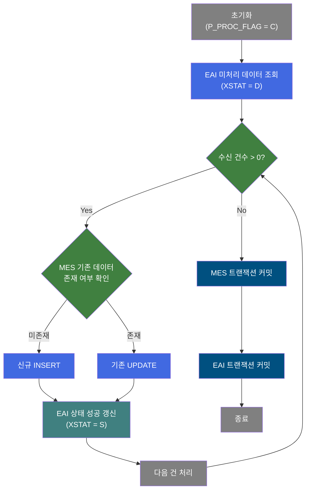
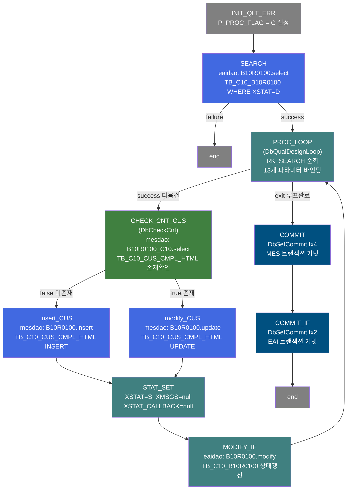
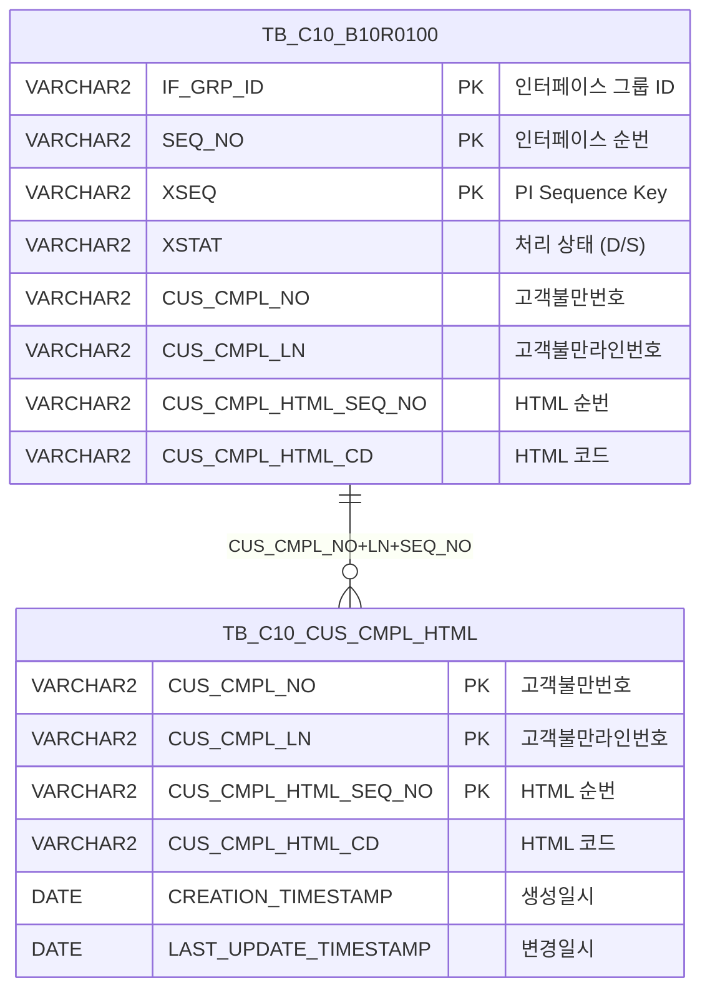

<h1 style="font-size: 40px; text-align: center; font-weight:
   bold; margin: 30px 0;">
  B10R0100 레거시 시스템 분석 종합 보고서
</h1>


# 1. 시스템 개요
- **서비스 ID**: B10R0100
- **업무명**: 고객불만 HTML 첨부파일 EAI 수신
- **분석 일시**: 2026-03-17 10:29 KST
- **분석 시간**: ~3분
- **전체 Activity 수**: 10개 (Built-in 4, Common 4, Custom 2)
- **분석자**: Claude Opus 4.6
- **분석 도구**: /analyze-service B10R0100
- **문서 버전**: 1.0

# 📊 비즈니스 프로세스 분석

## 시스템 목적

B10R0100은 EAI(Enterprise Application Integration) 시스템을 통해 외부에서 수신된 **고객불만 HTML 첨부파일 정보**를 MES 시스템의 고객불만 테이블에 동기화하는 NUI 배치 서비스이다.

EAI 인터페이스 테이블(`EAIAPUSER.TB_C10_B10R0100`)에서 미처리 상태(`XSTAT='D'`)인 레코드를 일괄 조회한 후, 각 건마다 MES 고객불만 HTML 테이블(`C10APUSER.TB_C10_CUS_CMPL_HTML`)에 데이터 존재 여부를 확인하여 **신규면 INSERT, 기존이면 UPDATE**하는 UPSERT 패턴으로 처리한다. 처리 완료 후 EAI 인터페이스 테이블의 상태를 성공(`S`)으로 갱신하고 트랜잭션을 커밋한다.

이 서비스는 `PosBatchJobInvoker` 등 배치 스케줄러에 의해 주기적으로 호출되며, 고객불만 접수 시 첨부된 HTML 이미지/문서 정보를 외부 시스템(ERP 등)에서 MES로 자동 연동하는 역할을 담당한다.


## 핵심 워크플로우 다이어그램



### 상세 워크플로우 다이어그램




## 주요 유즈케이스

### UC-01: EAI 고객불만 HTML 수신 및 동기화
- **Actor**: 배치 스케줄러 (PosBatchJobInvoker)
- **목적**: 외부 시스템(ERP)에서 전송된 고객불만 HTML 첨부파일 정보를 MES 고객불만 테이블에 자동 동기화

- **전제조건**:
  - EAI 인터페이스 테이블(TB_C10_B10R0100)에 미처리 데이터(XSTAT='D')가 존재
  - EAIAPUSER, C10APUSER DB 접속 가능
  - 배치 스케줄러가 정상 동작 중

- **주요 흐름**:
  1. 배치 스케줄러가 B10R0100 서비스 호출
  2. P_PROC_FLAG='C' 초기화 (INIT_QLT_ERR)
  3. EAI 테이블에서 XSTAT='D' 미처리 레코드 전체 조회 (SEARCH → B10R0100.select)
  4. PROC_LOOP에서 조회 결과를 1건씩 순회, 13개 파라미터(IF_GRP_ID, SEQ_NO, CUS_CMPL_NO 등) 바인딩
  5. CHECK_CNT_CUS에서 MES 테이블 기존 데이터 존재 확인 (B10R0100_C10.select)
  6. 미존재 시 INSERT, 존재 시 UPDATE 수행
  7. STAT_SET에서 처리 상태를 성공(S)으로 설정
  8. MODIFY_IF에서 EAI 테이블 상태 갱신 (B10R0100.modify)
  9. 다음 건 처리 (PROC_LOOP 복귀)
  10. 전체 처리 완료 후 MES 커밋(tx4) → EAI 커밋(tx2)

- **대체 흐름**:
  - 미처리 데이터 없음: SEARCH 후 PROC_LOOP exit → 즉시 커밋 후 종료
  - EAI 조회 실패: SEARCH failure → 즉시 end 전이
  - DB 오류 발생: P_ERR_KEY 플래그에 의해 DbSetCommit에서 에러 감지

- **후행조건**:
  - TB_C10_CUS_CMPL_HTML에 고객불만 HTML 데이터 동기화 완료
  - TB_C10_B10R0100의 처리된 레코드 XSTAT='S'로 갱신

### UC-02: 신규 고객불만 HTML 등록
- **Actor**: 시스템 (배치 처리 내부)
- **목적**: MES에 존재하지 않는 고객불만 HTML 첨부파일 정보를 신규 등록

- **전제조건**:
  - CHECK_CNT_CUS에서 false 반환 (기존 데이터 없음)

- **주요 흐름**:
  1. CUS_CMPL_NO, CUS_CMPL_LN, CUS_CMPL_HTML_SEQ_NO, CUS_CMPL_HTML_CD 4개 파라미터 + 감사 8개 컬럼 INSERT
  2. C10APUSER.TB_C10_CUS_CMPL_HTML 테이블에 12개 컬럼 삽입
  3. 성공 후 STAT_SET → MODIFY_IF → PROC_LOOP 복귀

- **대체 흐름**:
  - INSERT 실패: P_ERR_KEY에 에러 기록

- **후행조건**:
  - TB_C10_CUS_CMPL_HTML에 신규 레코드 생성
  - 감사 컬럼(CREATED_OBJECT_TYPE, CREATION_TIMESTAMP 등) 자동 설정

### UC-03: 기존 고객불만 HTML 갱신
- **Actor**: 시스템 (배치 처리 내부)
- **목적**: MES에 이미 존재하는 고객불만 HTML 정보를 EAI 수신 내용으로 갱신

- **전제조건**:
  - CHECK_CNT_CUS에서 true 반환 (기존 데이터 존재)

- **주요 흐름**:
  1. CUS_CMPL_NO, CUS_CMPL_LN, CUS_CMPL_HTML_SEQ_NO 3개 키로 대상 레코드 특정
  2. CUS_CMPL_HTML_CD 및 감사 컬럼 4개 갱신
  3. WHERE 조건: CUS_CMPL_NO + CUS_CMPL_LN + CUS_CMPL_HTML_SEQ_NO 복합키

- **대체 흐름**:
  - UPDATE 대상 없음: 쿼리 정상 실행되나 affected rows = 0

- **후행조건**:
  - TB_C10_CUS_CMPL_HTML 기존 레코드의 HTML_CD 및 변경일시 갱신

---
## 비즈니스 로직 상세

### 1. UPSERT 패턴 (존재 확인 후 INSERT/UPDATE 분기)

- **목적**: EAI로 수신된 고객불만 HTML 데이터를 MES 테이블에 동기화. 기존 데이터 유무에 따라 INSERT 또는 UPDATE 수행

- **처리 케이스**:

  **[케이스 1: 신규 등록 (INSERT)]**
  ```
    조건: CHECK_CNT_CUS에서 B10R0100_C10.select 조회 결과 0건 (false 반환)
    처리:
      1. CUS_CMPL_NO, CUS_CMPL_LN, CUS_CMPL_HTML_SEQ_NO, CUS_CMPL_HTML_CD 값 설정
      2. 감사 컬럼 8개 (CREATED_*, LAST_UPDATED_*) 자동 설정 (isAudit=true)
      3. C10APUSER.TB_C10_CUS_CMPL_HTML에 INSERT
      4. STAT_SET에서 XSTAT='S' 설정 후 EAI 상태 갱신
  ```

  **[케이스 2: 갱신 (UPDATE)]**
  ```
    조건: CHECK_CNT_CUS에서 B10R0100_C10.select 조회 결과 1건 이상 (true 반환)
    처리:
      1. WHERE: CUS_CMPL_NO + CUS_CMPL_LN + CUS_CMPL_HTML_SEQ_NO 복합키
      2. SET: CUS_CMPL_HTML_CD + 감사 컬럼 4개 갱신
      3. STAT_SET에서 XSTAT='S' 설정 후 EAI 상태 갱신
  ```

### 2. 루프 제어 및 EAI 상태 관리

- **목적**: 미처리 인터페이스 데이터를 건별 순회하며 처리 상태를 추적

- **처리 케이스**:

  **[케이스 1: 정상 처리]**
  ```
    조건: PROC_LOOP에서 처리 건수 > 0
    처리:
      1. RK_SEARCH ResultSet에서 1건 추출, 13개 파라미터 PosContext에 바인딩
      2. 건별 UPSERT 처리 후 STAT_SET에서 XSTAT='S', XMSGS=null 설정
      3. MODIFY_IF에서 EAI 테이블 상태 갱신 (IF_GRP_ID + SEQ_NO + XSEQ 키)
      4. PROC_LOOP 복귀하여 다음 건 처리
  ```

  **[케이스 2: 전체 처리 완료]**
  ```
    조건: PROC_LOOP에서 처리 건수 = 0 (exit 전이)
    처리:
      1. COMMIT (tx4): MES 스키마(C10APUSER) 트랜잭션 커밋
      2. COMMIT_IF (tx2): EAI 스키마(EAIAPUSER) 트랜잭션 커밋
      3. 서비스 종료
  ```

- **예외 처리**:
  - EAI 조회 실패: SEARCH failure → 즉시 종료 (커밋 없음)
  - DB 에러: P_ERR_KEY 플래그로 DbSetCommit에서 롤백 여부 결정

---

# ⚙️ Java 컴포넌트 분석

## Custom Activity 상세 분석

### 2개 Custom Activity 발견

### 1. DbQualDesignLoop (PROC_LOOP)
- **클래스명**: com.unionsteel.mes.c10.activity.nui.DbQualDesignLoop
- **액티비티명**: PROC_LOOP
- **파일 경로**: src/com/unionsteel/mes/c10/activity/nui/DbQualDesignLoop.java
- **주요 기능**: 이전 액티비티가 조회한 ResultSet을 1건씩 순회 처리하기 위한 루프 제어 액티비티
- **라인 수**: 171 | **메소드 수**: 1

> `DbQualDesignLoop`는 GLUE Framework 기반 NUI(배치) 서비스에서 이전 서비스(주로 `PosSearch`)가 조회한 `PosRowSet`을 순차적으로 읽으며, 한 건씩 `PosContext`에 세팅한 뒤 후속 액티비티 체인이 단건 기준으로 동작할 수 있도록 연결한다. 처리 건수가 0이 되면 `"exit"` 전이를 반환하여 루프를 종료한다.

📎 **[상세 분석 보고서](../customClass/com.unionsteel.mes.c10.activity.nui.DbQualDesignLoop_class_analysis.md)**

---

### 2. DbCheckCnt (CHECK_CNT_CUS)
- **클래스명**: com.unionsteel.mes.c10.activity.nui.DbCheckCnt
- **액티비티명**: CHECK_CNT_CUS
- **파일 경로**: src/com/unionsteel/mes/c10/activity/nui/DbCheckCnt.java
- **주요 기능**: 특정 테이블에 데이터 존재 유무를 확인하는 범용 카운트 조회 Activity
- **라인 수**: 105 | **메소드 수**: 1

> Service XML의 Property로 SQL Key, 파라미터 수, 파라미터 값을 동적으로 구성하여 `dao.find(sqlkey, param)` 조회 후 결과 건수에 따라 `true`(1건 이상) 또는 `false`(0건) transition을 반환한다. 특정 비즈니스 로직 없이 범용으로 재사용 가능하도록 설계되어 있다.

📎 **[상세 분석 보고서](../customClass/com.unionsteel.mes.c10.activity.nui.DbCheckCnt_class_analysis.md)**

---

# 💾 데이터 요구사항

## 핵심 테이블

### 1. TB_C10_B10R0100 - (EAI 인터페이스 수신 테이블)
| 컬럼명 | 타입 | PK | 설명 |
|--------|------|----|------|
| IF_GRP_ID | VARCHAR2 | ✅ | 인터페이스 그룹 ID |
| SEQ_NO | VARCHAR2 | ✅ | 인터페이스 순번 |
| XSEQ | VARCHAR2 | ✅ | PI Sequence Key Value |
| XCRUD | VARCHAR2 | | CRUD 구분 |
| XSTAT | VARCHAR2 | | PI 처리 상태 (D=미처리, S=성공) |
| XMSGS | VARCHAR2 | | PI 에러 메시지 |
| XDATE | VARCHAR2 | | 인터페이스 일자 |
| XTIME | VARCHAR2 | | 인터페이스 시각 |
| XSTAT_CALLBACK | VARCHAR2 | | PI 콜백 상태 |
| CUS_CMPL_NO | VARCHAR2 | | 고객불만번호 |
| CUS_CMPL_LN | VARCHAR2 | | 고객불만라인번호 |
| CUS_CMPL_HTML_SEQ_NO | VARCHAR2 | | 고객불만 HTML 순번 |
| CUS_CMPL_HTML_CD | VARCHAR2 | | 고객불만 HTML 코드 |
| LAST_UPDATED_OBJECT_TYPE | VARCHAR2 | | 최종변경 OBJECT 유형 |
| LAST_UPDATED_OBJECT_ID | VARCHAR2 | | 최종변경 OBJECT ID |
| LAST_UPDATE_PROGRAM_ID | VARCHAR2 | | 최종변경 프로그램 ID |
| LAST_UPDATE_TIMESTAMP | DATE | | 최종변경 일시 |

### 2. TB_C10_CUS_CMPL_HTML - (고객불만 HTML 첨부파일)
| 컬럼명 | 타입 | PK | 설명 |
|--------|------|----|------|
| CUS_CMPL_NO | VARCHAR2 | ✅ | 고객불만번호 |
| CUS_CMPL_LN | VARCHAR2 | ✅ | 고객불만라인번호 |
| CUS_CMPL_HTML_SEQ_NO | VARCHAR2 | ✅ | 고객불만 HTML 순번 |
| CUS_CMPL_HTML_CD | VARCHAR2 | | 고객불만 HTML 코드 |
| CREATED_OBJECT_TYPE | VARCHAR2 | | 생성 OBJECT 유형 |
| CREATED_OBJECT_ID | VARCHAR2 | | 생성 OBJECT ID |
| CREATED_PROGRAM_ID | VARCHAR2 | | 생성 프로그램 ID |
| CREATION_TIMESTAMP | DATE | | 생성 일시 |
| LAST_UPDATED_OBJECT_TYPE | VARCHAR2 | | 최종변경 OBJECT 유형 |
| LAST_UPDATED_OBJECT_ID | VARCHAR2 | | 최종변경 OBJECT ID |
| LAST_UPDATE_PROGRAM_ID | VARCHAR2 | | 최종변경 프로그램 ID |
| LAST_UPDATE_TIMESTAMP | DATE | | 최종변경 일시 |

## 데이터 플로우

### 1. EAI 수신 데이터 조회
```
[배치 시작 시 EAI 미처리 데이터 조회]
배치 호출
→ B10R0100.select
  FROM EAIAPUSER.TB_C10_B10R0100
  WHERE XSTAT = 'D'
  ORDER BY IF_GRP_ID, SEQ_NO
→ RK_SEARCH ResultSet에 전체 미처리 건 로드
```

### 2. MES 데이터 UPSERT (건별)
```
[기존 데이터 존재 확인]
PROC_LOOP에서 1건 추출
→ B10R0100_C10.select
  FROM C10APUSER.TB_C10_CUS_CMPL_HTML
  WHERE CUS_CMPL_NO = ?
    AND CUS_CMPL_LN = ?
    AND CUS_CMPL_HTML_SEQ_NO = ?

[미존재 시 - INSERT]
→ B10R0100.insert
  INSERT INTO C10APUSER.TB_C10_CUS_CMPL_HTML
  (CUS_CMPL_NO, CUS_CMPL_LN, CUS_CMPL_HTML_SEQ_NO, CUS_CMPL_HTML_CD, 감사컬럼 8개)
  VALUES (?, ?, ?, ?, ?, ?, ?, ?, ?, ?, ?, ?)

[존재 시 - UPDATE]
→ B10R0100.update
  UPDATE C10APUSER.TB_C10_CUS_CMPL_HTML
  SET CUS_CMPL_HTML_CD = ?, 감사컬럼 4개
  WHERE CUS_CMPL_NO = ? AND CUS_CMPL_LN = ? AND CUS_CMPL_HTML_SEQ_NO = ?
```

### 3. EAI 상태 갱신 (건별)
```
[처리 성공 후 EAI 상태 갱신]
UPSERT 완료
→ B10R0100.modify
  UPDATE EAIAPUSER.TB_C10_B10R0100
  SET XSTAT = 'S', XMSGS = null, XSTAT_CALLBACK = null, 감사컬럼 4개
  WHERE IF_GRP_ID = ? AND SEQ_NO = ? AND XSEQ = ?
```

## SQL 일람표

| SQL 이름 | 쿼리 ID | 타입 | 출처 | 테이블 |
|---------|---------|------|------|-------|
| EAI 미처리 데이터 조회 | B10R0100.select | SELECT | Service | EAIAPUSER.TB_C10_B10R0100 |
| 고객불만 HTML 존재 확인 | B10R0100_C10.select | SELECT | Service | C10APUSER.TB_C10_CUS_CMPL_HTML |
| 고객불만 HTML 신규 등록 | B10R0100.insert | INSERT | Service | C10APUSER.TB_C10_CUS_CMPL_HTML |
| 고객불만 HTML 갱신 | B10R0100.update | UPDATE | Service | C10APUSER.TB_C10_CUS_CMPL_HTML |
| EAI 처리 상태 갱신 | B10R0100.modify | UPDATE | Service | EAIAPUSER.TB_C10_B10R0100 |

## ER 다이어그램 (핵심 관계)



관계 설명:
- **TB_C10_B10R0100**이 EAI 수신 허브 테이블로, 외부 시스템에서 수신된 고객불만 HTML 데이터를 임시 저장
- **TB_C10_CUS_CMPL_HTML**이 MES 최종 저장 테이블로, EAI 데이터를 UPSERT하여 동기화
- 두 테이블은 CUS_CMPL_NO + CUS_CMPL_LN + CUS_CMPL_HTML_SEQ_NO 복합키로 연결
- **스키마 분리**: EAI 테이블은 EAIAPUSER, MES 테이블은 C10APUSER 스키마에 위치

---

# 📌 특이사항 및 주의사항

## 1. 이중 트랜잭션 관리
- **tx4** (MES 스키마): C10APUSER.TB_C10_CUS_CMPL_HTML의 INSERT/UPDATE 커밋
- **tx2** (EAI 스키마): EAIAPUSER.TB_C10_B10R0100의 상태 UPDATE 커밋
- 두 트랜잭션이 순차 커밋되므로, tx4 커밋 후 tx2 커밋 전에 장애 발생 시 MES에는 데이터가 반영되었으나 EAI 상태는 미처리(D)로 남아 **중복 처리 가능성** 존재. 단, UPSERT 패턴으로 멱등성이 보장되므로 데이터 정합성 문제는 발생하지 않음.

## 2. insert_CUS/modify_CUS의 이중 success 전이
- 서비스 XML에서 `insert_CUS`와 `modify_CUS` 모두 `success` 전이가 **2개씩** 정의되어 있음:
  - `success → PROC_LOOP`
  - `success → STAT_SET`
- GLUE Framework에서 동일 이름 전이가 여러 개일 때 **마지막 정의된 값이 우선** 적용되므로, 실제로는 `success → STAT_SET`으로 전이됨
- 이는 코드 수정 이력에서 전이 대상을 변경하면서 이전 정의를 삭제하지 않은 것으로 추정됨

## 3. EAI 인터페이스 표준 패턴
- EAI 수신 표준 파라미터 구조 사용: IF_GRP_ID, SEQ_NO, XSEQ, XCRUD, XSTAT, XMSGS, XDATE, XTIME, XSTAT_CALLBACK
- XSTAT 상태 코드: 'D'(수신/미처리) → 'S'(처리 성공), 에러 시 XMSGS에 메시지 기록
- B10R 시리즈(B10R0020, B10R0030 등)와 동일한 EAI 수신 패턴을 따름

## 4. 스키마 직접 지정 패턴
- SQL에서 테이블명에 스키마를 직접 명시함 (`C10APUSER.TB_C10_CUS_CMPL_HTML`, `EAIAPUSER.TB_C10_B10R0100`)
- DAO 빈과 스키마가 교차 사용됨: `mesdao`(MESAPUSER 스키마)에서 C10APUSER 스키마 테이블에 접근하고, `eaidao`(EAIAPUSER 스키마)에서 EAIAPUSER 테이블에 접근
- 이는 DAO 빈의 기본 스키마가 아닌 다른 스키마의 테이블을 사용할 때 스키마명을 SQL에 하드코딩하는 레거시 패턴

## 5. 위치 기반 파라미터(?) 사용
- 모든 SQL이 명명 파라미터(:paramName)가 아닌 위치 기반 파라미터(?)를 사용
- Service XML의 param0~paramN 순서와 SQL의 ? 순서가 정확히 일치해야 하므로, 파라미터 순서 변경 시 장애 위험이 있음

---

# 📚 참고 문서

- **Service XML**: `src/service/B10R0100-service.xml`
- **Query SQL**: `src/query/B10R0100-query.glue_sql`
- **Custom Java 클래스**:
  - `src/com/unionsteel/mes/c10/activity/nui/DbQualDesignLoop.java`
  - `src/com/unionsteel/mes/c10/activity/nui/DbCheckCnt.java`
