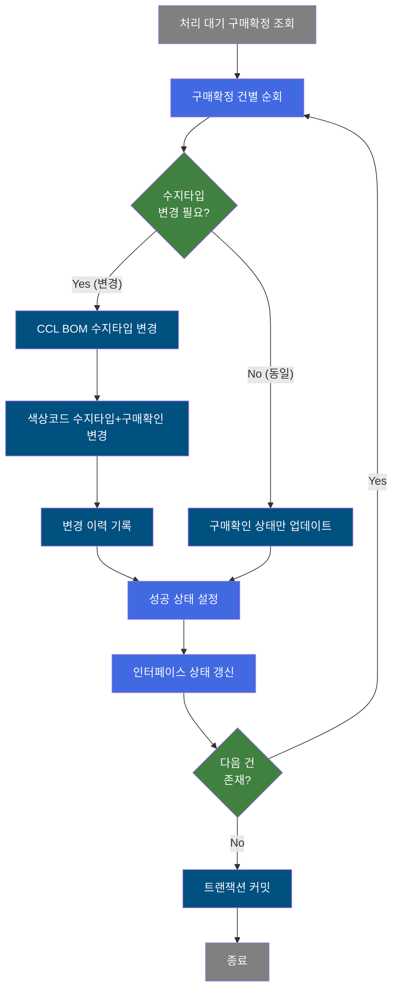
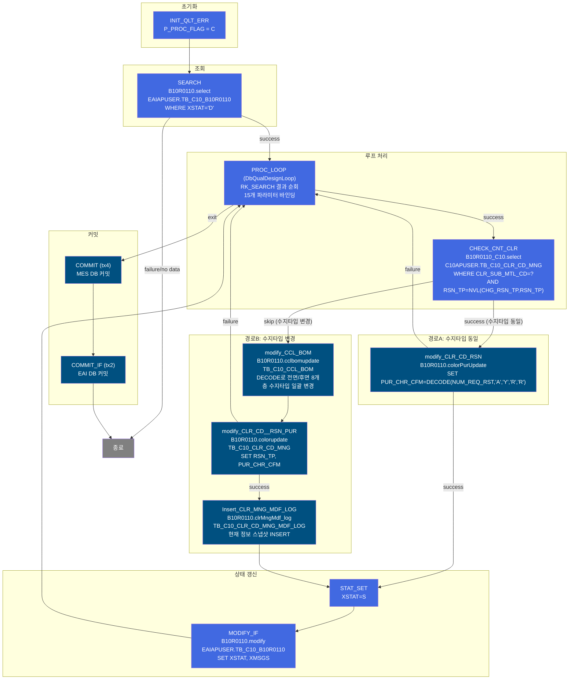
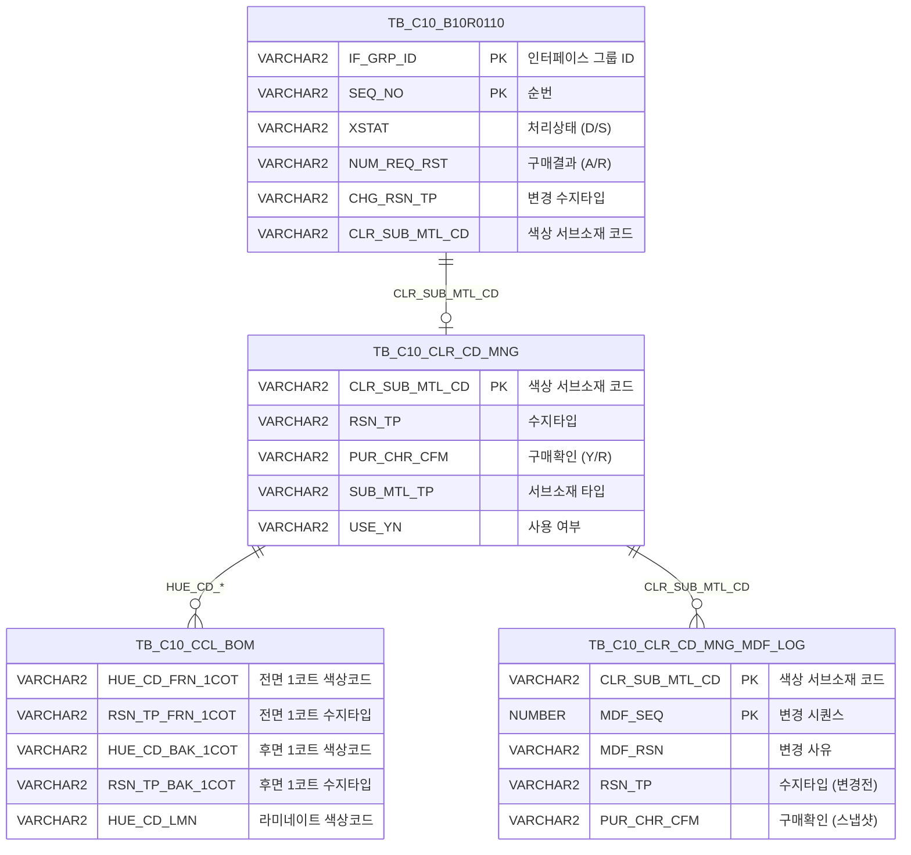

<h1 style="font-size: 40px; text-align: center; font-weight:
   bold; margin: 30px 0;">
  B10R0110 레거시 시스템 분석 종합 보고서
</h1>


# 1. 시스템 개요
- **서비스 ID**: B10R0110
- **업무명**: 구매담당자 확정수신 (색상코드 수지타입 변경 및 구매확인)
- **분석 일시**: 2026-03-17 (KST)
- **전체 Activity 수**: 12개 (Custom 1, Built-in 7, Common 4)
- **분석자**: Claude Opus 4.6
- **분석 도구**: /analyze-service B10R0110
- **문서 버전**: 1.0

# 📊 비즈니스 프로세스 분석

## 시스템 목적

B10R0110은 EAI를 통해 수신된 **구매담당자 확정/반려 정보**를 MES 색상코드 관리 시스템에 반영하는 배치(NUI) 서비스이다. 구매담당자가 색상 소재의 수지타입(RSN_TP) 변경을 승인(A) 또는 반려(R)하면, EAI 인터페이스 테이블(`EAIAPUSER.TB_C10_B10R0110`)에 처리 대기(XSTAT='D') 상태로 적재되고, 이 서비스가 해당 데이터를 순회 처리한다.

핵심 로직은 수지타입 변경 필요 여부에 따라 두 가지 경로로 분기한다:
- **수지타입이 동일한 경우**: 구매확인 상태(PUR_CHR_CFM)만 업데이트
- **수지타입이 변경된 경우**: CCL BOM의 수지타입을 일괄 변경하고, 색상코드 관리 테이블의 수지타입과 구매확인을 갱신하며, 변경 이력을 로그 테이블에 기록

3개의 트랜잭션 매니저(tx1, tx2: EAI DB, tx4: MES DB)를 사용하여 각각 별도로 커밋하는 구조이다.

## 핵심 워크플로우 다이어그램



### 상세 워크플로우 다이어그램



## 주요 유즈케이스

### UC-01: 구매담당자 승인 시 수지타입 변경 처리
- **Actor**: 배치 스케줄러 (자동 실행)
- **목적**: 구매담당자가 승인(NUM_REQ_RST='A')한 색상 소재의 수지타입을 변경하고, CCL BOM에 반영하며, 변경 이력을 기록

- **전제조건**:
  - EAI 인터페이스 테이블에 XSTAT='D'인 처리 대기 데이터 존재
  - 해당 색상코드(CLR_SUB_MTL_CD)가 TB_C10_CLR_CD_MNG에 등록되어 있음
  - CHG_RSN_TP(변경할 수지타입)이 현재 수지타입과 다름

- **주요 흐름**:
  1. EAI 인터페이스 테이블에서 XSTAT='D'인 전체 데이터 조회 (B10R0110.select)
  2. 각 건을 순회하며 CHECK_CNT_CLR로 수지타입 변경 필요 여부 확인
  3. 수지타입이 다른 경우 (결과 0건 → skip transition):
     - CCL BOM 테이블의 전면/후면 8개 코팅층 수지타입을 DECODE로 일괄 변경 (modify_CCL_BOM)
     - 색상코드 관리 테이블의 RSN_TP, PUR_CHR_CFM 갱신 (modify_CLR_CD__RSN_PUR)
     - 현재 색상코드 전체 정보를 스냅샷하여 변경이력 로그 INSERT (Insert_CLR_MNG_MDF_LOG)
  4. 성공 상태(XSTAT=S) 설정 후 인터페이스 테이블 갱신

- **대체 흐름**:
  - modify_CLR_CD__RSN_PUR 실패: failure transition으로 PROC_LOOP 복귀, 다음 건 처리
  - 조회 결과 없음: 즉시 종료

- **후행조건**:
  - TB_C10_CLR_CD_MNG: RSN_TP 변경, PUR_CHR_CFM='Y'
  - TB_C10_CCL_BOM: 해당 색상코드를 사용하는 모든 BOM의 수지타입 변경
  - TB_C10_CLR_CD_MNG_MDF_LOG: 변경 전 스냅샷 기록
  - 인터페이스 XSTAT='S'

### UC-02: 구매담당자 승인 시 수지타입 동일 처리
- **Actor**: 배치 스케줄러 (자동 실행)
- **목적**: 수지타입 변경 없이 구매확인 상태만 업데이트 (승인/반려 결과 반영)

- **전제조건**:
  - CHG_RSN_TP이 현재 RSN_TP과 동일하거나 NULL

- **주요 흐름**:
  1. CHECK_CNT_CLR 조회 결과 > 0건 (수지타입 동일 → success transition)
  2. modify_CLR_CD_RSN: PUR_CHR_CFM만 DECODE로 업데이트 (A→Y, R→R)
  3. 성공 상태 설정 후 인터페이스 갱신

- **대체 흐름**:
  - modify_CLR_CD_RSN 실패: failure transition으로 PROC_LOOP 복귀

- **후행조건**:
  - TB_C10_CLR_CD_MNG: PUR_CHR_CFM만 갱신 (Y 또는 R)
  - CCL BOM 변경 없음, 변경이력 기록 없음

### UC-03: 구매담당자 반려 처리
- **Actor**: 배치 스케줄러 (자동 실행)
- **목적**: 구매담당자가 반려(NUM_REQ_RST='R')한 경우 구매확인 상태를 반려(R)로 기록

- **전제조건**:
  - NUM_REQ_RST = 'R'

- **주요 흐름**:
  1. 수지타입 변경 여부와 무관하게 PUR_CHR_CFM = DECODE('R','A','Y','R','R') = 'R'로 설정
  2. 수지타입이 다른 경우에도 CCL BOM과 색상코드의 RSN_TP은 변경됨 (CHG_RSN_TP 값으로)
  3. 반려이지만 수지타입 자체는 변경 처리되는 점에 주의

- **대체 흐름**:
  - 없음

- **후행조건**:
  - PUR_CHR_CFM = 'R' (반려 상태)

---
## 비즈니스 로직 상세

### 1. 수지타입 변경 필요 여부 판단 (CHECK_CNT_CLR)

- **목적**: 색상코드의 현재 수지타입과 변경 요청된 수지타입을 비교하여 실제 변경이 필요한지 판단

- **처리 케이스**:

  **[케이스 1: 수지타입 동일 → 구매확인만 업데이트]**
  ```
    조건: B10R0110_C10.select 결과 > 0건
          (RSN_TP = NVL(:CHG_RSN_TP, RSN_TP) → 현재값과 변경값 동일)
    처리:
      1. success transition → modify_CLR_CD_RSN
      2. PUR_CHR_CFM만 업데이트 (CCL BOM, 이력 기록 생략)
  ```

  **[케이스 2: 수지타입 변경 → 전체 업데이트]**
  ```
    조건: B10R0110_C10.select 결과 = 0건
          (RSN_TP ≠ CHG_RSN_TP → 수지타입 변경 필요)
    처리:
      1. skip transition → modify_CCL_BOM
      2. CCL BOM 수지타입 변경 → 색상코드 변경 → 이력 기록
  ```

  **[케이스 3: CHG_RSN_TP이 NULL → 수지타입 동일 간주]**
  ```
    조건: CHG_RSN_TP IS NULL
          NVL(NULL, RSN_TP) = RSN_TP → 항상 결과 반환
    처리:
      1. success transition → 구매확인만 업데이트
  ```

### 2. CCL BOM 수지타입 일괄 변경 (modify_CCL_BOM)

- **목적**: 특정 색상 소재(CLR_SUB_MTL_CD)가 사용되는 모든 CCL BOM 레코드의 해당 코팅층 수지타입을 일괄 변경

- **처리 케이스**:

  **[DECODE 기반 조건부 업데이트]**
  ```
    대상: TB_C10_CCL_BOM 테이블의 전면/후면 각 4개 코팅층 (총 8개)
    로직:
      RSN_TP_FRN_1COT = DECODE(HUE_CD_FRN_1COT, :CLR_SUB_MTL_CD,
                                NVL(:CHG_RSN_TP, RSN_TP_FRN_1COT),
                                RSN_TP_FRN_1COT)
    의미:
      - 해당 코팅층의 색상코드(HUE_CD)가 변경 대상(CLR_SUB_MTL_CD)과 일치하면
        → 새 수지타입(CHG_RSN_TP)으로 변경 (NULL이면 기존값 유지)
      - 일치하지 않으면 → 기존값 유지
    WHERE:
      CLR_SUB_MTL_CD IN (전면 1~4코트 색상코드, 후면 1~4코트 색상코드, 라미네이트 색상코드)
  ```

- **영향 범위**: 해당 색상코드를 사용하는 **모든** CCL BOM 레코드에 영향

### 3. 색상코드 변경이력 기록 (Insert_CLR_MNG_MDF_LOG)

- **목적**: 색상코드 관리 정보 변경 전 현재 상태를 스냅샷으로 기록하여 변경 추적 보장

- **처리 케이스**:

  **[INSERT ... SELECT 패턴]**
  ```
    처리:
      1. TB_C10_CLR_CD_MNG에서 현재 색상코드 전체 정보 조회
      2. MDF_SEQ = 기존 최대 시퀀스 + 1 (서브쿼리로 산출)
      3. MDF_RSN = :SPC_TXT (변경 사유 텍스트)
      4. 50개 이상 컬럼의 현재 값을 그대로 복사하여 로그 테이블에 INSERT
  ```

- **계산 공식**:
  ```
  MDF_SEQ = NVL((SELECT MAX(MDF_SEQ) + 1
                  FROM TB_C10_CLR_CD_MNG_MDF_LOG
                  WHERE CLR_SUB_MTL_CD = :CLR_SUB_MTL_CD), 0)
  ```

### 4. 구매확인 상태 코드 변환

- **목적**: 구매담당자의 승인/반려 결과를 MES 내부 코드로 변환

- **처리 케이스**:

  **[DECODE 변환 규칙]**
  ```
    PUR_CHR_CFM = DECODE(:NUM_REQ_RST, 'A', 'Y', 'R', 'R')
    의미:
      - NUM_REQ_RST = 'A' (Approve) → PUR_CHR_CFM = 'Y' (확인완료)
      - NUM_REQ_RST = 'R' (Reject)  → PUR_CHR_CFM = 'R' (반려)
      - 기타값                       → PUR_CHR_CFM = NULL
  ```

---

# ⚙️ Java 컴포넌트 분석

## Custom Activity 상세 분석

### 1개 Custom Activity 발견

### 1. DbQualDesignLoop (PROC_LOOP)
- **클래스명**: com.unionsteel.mes.c10.activity.nui.DbQualDesignLoop
- **액티비티명**: PROC_LOOP
- **파일 경로**: src/com/unionsteel/mes/c10/activity/nui/DbQualDesignLoop.java
- **주요 기능**: 이전 액티비티(SEARCH)가 조회한 ResultSet(RK_SEARCH)을 1건씩 순회 처리하기 위한 루프 제어 액티비티. 각 행의 데이터를 PosContext에 바인딩하여 후속 Activity 체인에서 사용할 수 있도록 한다.

#### 메소드 구조
- **주요 메소드**: runActivity
  - **반환 타입**: String (transition name: "success" / "exit")
  - **파라미터**: PosContext

#### 핵심 비즈니스 로직
- **ResultSet 순회**: bind-result(RK_SEARCH)로 지정된 PosRowSet에서 1건씩 읽어 처리
- **파라미터 바인딩**: param0~param14로 정의된 15개 파라미터를 `소스컬럼|타겟키` 형태로 PosContext에 설정
  - IF_GRP_ID, SEQ_NO, XSEQ, XCRUD, XSTAT, XMSGS, XDATE, XTIME, XSTAT_CALLBACK
  - NUM_REQ_RST (구매요청결과), SPC_TXT (변경사유), CHG_RSN_TP (변경수지타입)
  - CLR_SUB_MTL_CD (색상소재코드), RGS_PRS_ID (등록자ID), END_DH (종료일시)
- **루프 제어**: 다음 행 존재 시 "success" (후속 체인 실행), 완료 시 "exit" (커밋 단계로 이동)
- **카운터 관리**: countName(QLT_DSN_STS_CD_COUNT)으로 처리 건수 추적

#### Java 상수 및 의존성
- **주요 상수**: C10NuiConstantsIF 인터페이스 구현
- **핵심 의존성**: PosContext (데이터 컨테이너), PosRowSet (결과셋)

---

# 💾 데이터 요구사항

## 핵심 테이블

### 1. EAIAPUSER.TB_C10_B10R0110 - (구매담당자 확정수신 EAI 인터페이스 테이블)
| 컬럼명 | 타입 | PK | 설명 |
|--------|------|----|-----|
| IF_GRP_ID | VARCHAR2 | ✅ | 인터페이스 그룹 ID |
| SEQ_NO | VARCHAR2 | ✅ | 순번 |
| XSEQ | VARCHAR2 | | 시퀀스 |
| XCRUD | VARCHAR2 | | CRUD 구분 |
| XSTAT | VARCHAR2 | | 처리 상태 (D:대기, S:성공) |
| XMSGS | VARCHAR2 | | 처리 메시지 |
| XDATE | VARCHAR2 | | 처리 일자 |
| XTIME | VARCHAR2 | | 처리 시각 |
| XSTAT_CALLBACK | VARCHAR2 | | 콜백 상태 |
| NUM_REQ_RST | VARCHAR2 | | 구매요청결과 (A:승인, R:반려) |
| SPC_TXT | VARCHAR2 | | 변경 사유 텍스트 |
| CHG_RSN_TP | VARCHAR2 | | 변경 수지타입 |
| CLR_SUB_MTL_CD | VARCHAR2 | | 색상 서브소재 코드 |
| RGS_PRS_ID | VARCHAR2 | | 등록자 ID |
| END_DD | VARCHAR2 | | 종료 일자 |
| END_DH | VARCHAR2 | | 종료 시각 |

### 2. C10APUSER.TB_C10_CLR_CD_MNG - (색상코드 관리 테이블)
| 컬럼명 | 타입 | PK | 설명 |
|--------|------|----|-----|
| CLR_SUB_MTL_CD | VARCHAR2 | ✅ | 색상 서브소재 코드 |
| SUB_MTL_TP | VARCHAR2 | | 서브소재 타입 |
| RSN_TP | VARCHAR2 | | 수지타입 |
| LUS_RT_CD | VARCHAR2 | | 광택율 코드 |
| PUR_CHR_CFM | VARCHAR2 | | 구매확인 상태 (Y:확인, R:반려) |
| USE_YN | VARCHAR2 | | 사용 여부 |
| MDF_PRS_ID | VARCHAR2 | | 수정자 ID |
| CLR_MDF_DH | DATE | | 색상 수정 일시 |
| RGS_PRS_ID | VARCHAR2 | | 등록자 ID |
| RGS_DH | DATE | | 등록 일시 |

### 3. C10APUSER.TB_C10_CCL_BOM - (CCL BOM 테이블)
| 컬럼명 | 타입 | PK | 설명 |
|--------|------|----|-----|
| HUE_CD_FRN_1COT | VARCHAR2 | | 전면 1코트 색상코드 |
| HUE_CD_FRN_2COT | VARCHAR2 | | 전면 2코트 색상코드 |
| HUE_CD_FRN_3COT | VARCHAR2 | | 전면 3코트 색상코드 |
| HUE_CD_FRN_4COT | VARCHAR2 | | 전면 4코트 색상코드 |
| HUE_CD_BAK_1COT | VARCHAR2 | | 후면 1코트 색상코드 |
| HUE_CD_BAK_2COT | VARCHAR2 | | 후면 2코트 색상코드 |
| HUE_CD_BAK_3COT | VARCHAR2 | | 후면 3코트 색상코드 |
| HUE_CD_BAK_4COT | VARCHAR2 | | 후면 4코트 색상코드 |
| HUE_CD_LMN | VARCHAR2 | | 라미네이트 색상코드 |
| RSN_TP_FRN_1COT | VARCHAR2 | | 전면 1코트 수지타입 |
| RSN_TP_FRN_2COT | VARCHAR2 | | 전면 2코트 수지타입 |
| RSN_TP_FRN_3COT | VARCHAR2 | | 전면 3코트 수지타입 |
| RSN_TP_BAK_1COT | VARCHAR2 | | 후면 1코트 수지타입 |
| RSN_TP_BAK_2COT | VARCHAR2 | | 후면 2코트 수지타입 |
| RSN_TP_BAK_3COT | VARCHAR2 | | 후면 3코트 수지타입 |

### 4. C10APUSER.TB_C10_CLR_CD_MNG_MDF_LOG - (색상코드 관리 변경이력 로그)
| 컬럼명 | 타입 | PK | 설명 |
|--------|------|----|-----|
| CLR_SUB_MTL_CD | VARCHAR2 | ✅ | 색상 서브소재 코드 |
| MDF_SEQ | NUMBER | ✅ | 변경 시퀀스 (MAX+1) |
| MDF_RSN | VARCHAR2 | | 변경 사유 |
| SUB_MTL_TP | VARCHAR2 | | 서브소재 타입 (스냅샷) |
| RSN_TP | VARCHAR2 | | 수지타입 (변경 전 값) |
| LUS_RT_CD | VARCHAR2 | | 광택율 코드 (스냅샷) |
| USE_YN | VARCHAR2 | | 사용 여부 (스냅샷) |
| PUR_CHR_CFM | VARCHAR2 | | 구매확인 상태 (스냅샷) |

## 데이터 플로우

### 1. 구매확정 데이터 수신 조회
```
[EAI 인터페이스에서 처리 대기 데이터 전체 조회]
배치 실행
→ B10R0110.select
  FROM EAIAPUSER.TB_C10_B10R0110
  WHERE XSTAT = 'D'
  ORDER BY IF_GRP_ID, SEQ_NO
→ RK_SEARCH에 결과셋 저장
  (END_DD||END_DH AS END_DH로 일시 결합)
```

### 2. 수지타입 변경 필요 여부 확인
```
[색상코드의 수지타입 비교]
PROC_LOOP에서 1건 추출
→ B10R0110_C10.select
  FROM C10APUSER.TB_C10_CLR_CD_MNG
  WHERE CLR_SUB_MTL_CD = :CLR_SUB_MTL_CD
  AND   RSN_TP = NVL(:CHG_RSN_TP, RSN_TP)
→ 결과 > 0건: success (동일) / 결과 = 0건: skip (변경 필요)
```

### 3-A. 수지타입 변경 경로
```
[CCL BOM 수지타입 일괄 변경]
→ B10R0110.cclbomupdate
  UPDATE C10APUSER.TB_C10_CCL_BOM
  SET RSN_TP_FRN_1~4COT = DECODE(HUE_CD, CLR_SUB_MTL_CD, CHG_RSN_TP, 기존값)
      RSN_TP_BAK_1~4COT = DECODE(HUE_CD, CLR_SUB_MTL_CD, CHG_RSN_TP, 기존값)
  WHERE CLR_SUB_MTL_CD IN (전면/후면/라미네이트 색상코드)

[색상코드 수지타입+구매확인 변경]
→ B10R0110.colorupdate
  UPDATE C10APUSER.TB_C10_CLR_CD_MNG
  SET RSN_TP = :CHG_RSN_TP,
      PUR_CHR_CFM = DECODE(:NUM_REQ_RST, 'A', 'Y', 'R', 'R')
  WHERE CLR_SUB_MTL_CD = :CLR_SUB_MTL_CD

[변경이력 기록]
→ B10R0110.clrMngMdf_log
  INSERT INTO C10APUSER.TB_C10_CLR_CD_MNG_MDF_LOG
  SELECT (현재 색상코드 전체 정보 스냅샷, MDF_SEQ=MAX+1)
  FROM C10APUSER.TB_C10_CLR_CD_MNG
  WHERE CLR_SUB_MTL_CD = :CLR_SUB_MTL_CD
```

### 3-B. 수지타입 동일 경로
```
[구매확인 상태만 업데이트]
→ B10R0110.colorPurUpdate
  UPDATE C10APUSER.TB_C10_CLR_CD_MNG
  SET PUR_CHR_CFM = DECODE(:NUM_REQ_RST, 'A', 'Y', 'R', 'R')
  WHERE CLR_SUB_MTL_CD = :CLR_SUB_MTL_CD
```

### 4. 인터페이스 상태 갱신
```
[처리 결과를 EAI 인터페이스 테이블에 기록]
→ B10R0110.modify
  UPDATE EAIAPUSER.TB_C10_B10R0110
  SET XSTAT = ?, XMSGS = ?, XSTAT_CALLBACK = ?
  WHERE IF_GRP_ID = ? AND SEQ_NO = ?
```

## SQL 일람표
| SQL 이름 | 쿼리 ID | 타입 | 출처 | 테이블 |
|---------|---------|-----|-------|-------|
| 구매확정 수신 조회 | B10R0110.select | SELECT | Service | EAIAPUSER.TB_C10_B10R0110 |
| 수지타입 변경 확인 | B10R0110_C10.select | SELECT | Service | C10APUSER.TB_C10_CLR_CD_MNG |
| 구매확인 상태 업데이트 | B10R0110.colorPurUpdate | UPDATE | Service | C10APUSER.TB_C10_CLR_CD_MNG |
| CCL BOM 수지타입 변경 | B10R0110.cclbomupdate | UPDATE | Service | C10APUSER.TB_C10_CCL_BOM |
| 색상코드 수지타입+구매확인 변경 | B10R0110.colorupdate | UPDATE | Service | C10APUSER.TB_C10_CLR_CD_MNG |
| 변경이력 로그 기록 | B10R0110.clrMngMdf_log | INSERT | Service | C10APUSER.TB_C10_CLR_CD_MNG_MDF_LOG |
| 인터페이스 상태 갱신 | B10R0110.modify | UPDATE | Service | EAIAPUSER.TB_C10_B10R0110 |

## ER 다이어그램 (핵심 관계)



관계 설명:
- **EAIAPUSER.TB_C10_B10R0110**: EAI 인터페이스 테이블, CLR_SUB_MTL_CD로 색상코드 관리 테이블과 연결
- **C10APUSER.TB_C10_CLR_CD_MNG**: 색상코드 관리 마스터 테이블, 중심 엔티티
- **C10APUSER.TB_C10_CCL_BOM**: CCL BOM 테이블, 전면/후면 각 4개 코팅층 + 라미네이트의 색상코드(HUE_CD_*)를 통해 색상코드 관리 테이블과 다대다 관계
- **C10APUSER.TB_C10_CLR_CD_MNG_MDF_LOG**: 변경이력 로그, CLR_SUB_MTL_CD + MDF_SEQ로 색상코드별 변경 이력 추적

---

# 📌 특이사항 및 주의사항

## 1. CCL BOM 전면/후면 8개층 + 라미네이트 일괄 변경의 영향 범위
- **DECODE 기반 조건부 일괄 UPDATE**: 특정 색상코드를 사용하는 모든 CCL BOM 레코드의 해당 코팅층 수지타입이 일괄 변경된다. WHERE 조건이 `CLR_SUB_MTL_CD IN (HUE_CD_FRN_1~4COT, HUE_CD_BAK_1~4COT, HUE_CD_LMN)`으로 매우 광범위하여, 다수의 BOM 레코드에 동시 영향을 미칠 수 있다.
- **전면 4개 + 후면 4개 = 8개 코팅층**: 각 코팅층별로 DECODE 비교 후 조건부 변경하는 구조로, 하나의 BOM에서 동일 색상코드가 여러 층에 사용되면 모두 일괄 변경된다.

## 2. 반려(R) 시에도 수지타입이 변경되는 로직
- **비즈니스 의도 불명확**: NUM_REQ_RST='R'(반려)인 경우에도 CHG_RSN_TP이 기존과 다르면 수지타입 변경 경로로 진행되어 CCL BOM과 색상코드의 RSN_TP이 실제로 변경된다. PUR_CHR_CFM만 'R'로 설정될 뿐이다. 반려 시 수지타입 변경을 원래 의도했는지 또는 로직 버그인지 확인이 필요하다.

## 3. 이중 트랜잭션 관리 (tx4/tx2)
- **3개 트랜잭션 매니저 선언, 2개 사용**: tx1, tx2, tx4가 선언되어 있으나 실제 커밋은 tx4(MES DB)와 tx2(EAI DB)만 수행한다. tx1은 미사용 상태이다.
- **tx4 → tx2 순서 커밋**: MES DB 커밋 후 EAI DB 커밋 순서로, tx4 성공 후 tx2 실패 시 데이터 불일치 가능성이 있다.

## 4. C10APUSER 스키마 사용 (mesdao 경유)
- **스키마 불일치**: 쿼리에서 `C10APUSER.TB_C10_CLR_CD_MNG`을 직접 참조하지만, DAO는 `mesdao`(MESAPUSER 스키마)를 사용한다. 이는 MESAPUSER 계정에서 C10APUSER 테이블에 대한 접근 권한(SYNONYM 또는 직접 스키마 지정)이 설정되어 있음을 의미한다.

## 5. 변경이력 로그의 MDF_SEQ 동시성 이슈
- **MAX+1 채번 방식**: `NVL((SELECT MAX(MDF_SEQ)+1 FROM TB_C10_CLR_CD_MNG_MDF_LOG WHERE CLR_SUB_MTL_CD = :CLR_SUB_MTL_CD), 0)` 패턴으로 시퀀스를 채번한다. 배치 서비스이므로 동시 실행 가능성은 낮으나, 동일 색상코드에 대해 동시 접근 시 PK 충돌이 발생할 수 있다.

## 6. FormSearch의 if-size-zero 패턴
- **CHECK_CNT_CLR**: `if-size-zero="skip"` 속성으로 조회 결과가 0건이면 "skip" transition으로 분기한다. 이는 일반적인 true/false 분기가 아닌 FormSearch 고유 패턴으로, 결과 유무에 따라 다른 처리 경로를 선택하는 유연한 분기 메커니즘이다.

---

# 📚 참고 문서

- **Query SQL**: `src/query/B10R0110-query.glue_sql` (B10R0110.select, B10R0110_C10.select, B10R0110.modify, B10R0110.cclbomupdate, B10R0110.colorupdate, B10R0110.colorPurUpdate, B10R0110.clrMngMdf_log)
- **Service XML**: `src/service/B10R0110-service.xml`
- **Custom Java 클래스**:
  - `src/com/unionsteel/mes/c10/activity/nui/DbQualDesignLoop.java`
