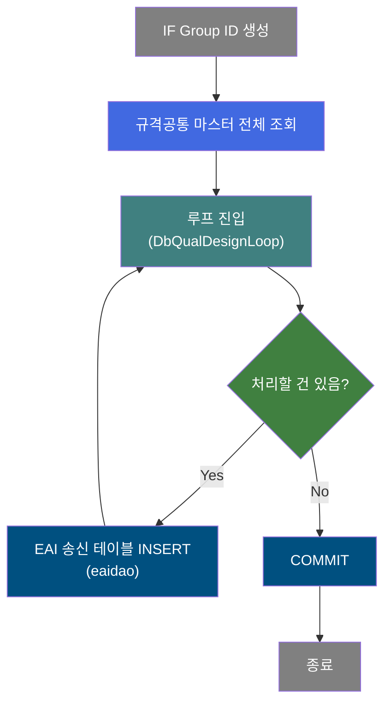
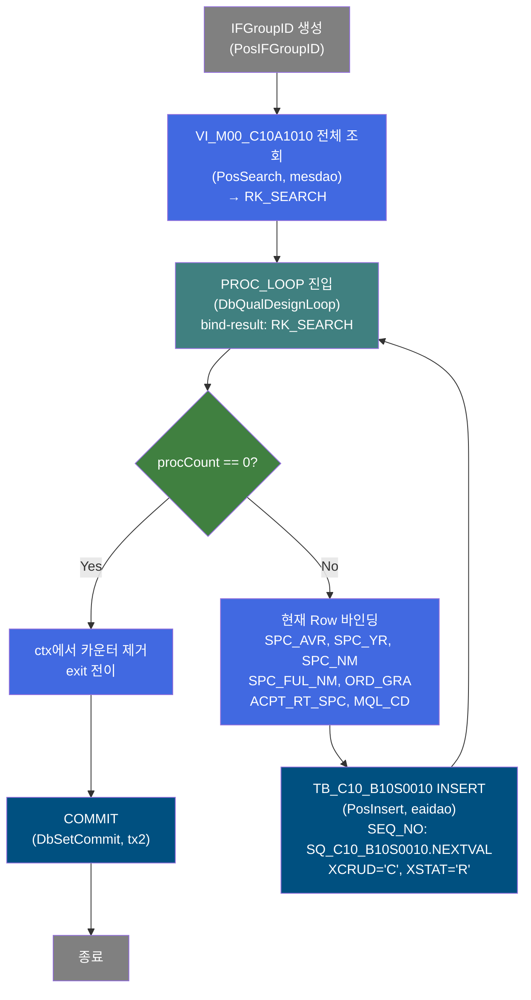
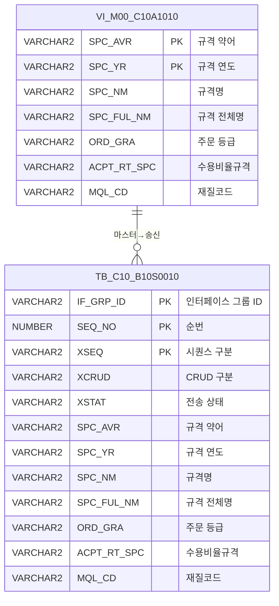

<h1 style="font-size: 40px; text-align: center; font-weight:
   bold; margin: 30px 0;">
  B10S0010 레거시 시스템 분석 종합 보고서
</h1>


# 1. 시스템 개요
- **서비스 ID**: B10S0010
- **업무명**: 규격공통 마스터 데이터 EAI 송신
- **분석 일시**: 2026-03-17 10:02 (KST)
- **전체 Activity 수**: 5개
- **분석자**: Claude Opus 4.6 + Sonnet (Phase 2/3)
- **분석 도구**: /analyze-service B10S0010
- **문서 버전**: 1.0

# 📊 비즈니스 프로세스 분석

## 시스템 목적

B10S0010은 MES 시스템에서 관리하는 **규격공통(Specification Common) 마스터 데이터를 EAI를 통해 외부 시스템(ERP 등)으로 송신**하기 위한 NUI 배치 서비스이다.

마스터 데이터 뷰(`VI_M00_C10A1010`)에서 규격 약어, 규격 연도, 규격명, 규격 전체명, 주문등급, 수용비율규격, 재질코드 등의 정보를 전량 조회한 후, 조회된 각 건을 루프로 순회하며 EAI 송신 테이블(`TB_C10_B10S0010`, DAO: `eaidao`)에 INSERT한다. 이를 통해 MES에서 관리하는 규격공통 마스터 정보가 ERP 등 외부 시스템과 동기화된다.

서비스 구조는 단순한 **전량 조회 → 루프 → INSERT** 패턴으로, IFGroupID 생성 → 전체 규격 데이터 조회 → DbQualDesignLoop 루프 제어 → EAI 테이블 INSERT → COMMIT 순서로 실행된다.

## 핵심 워크플로우 다이어그램



### 상세 워크플로우 다이어그램



## 주요 유즈케이스

### UC-01: 규격공통 마스터 데이터 EAI 송신
- **Actor**: 배치 스케줄러 (자동 실행)
- **목적**: MES의 규격공통 마스터 데이터를 EAI 송신 테이블에 적재하여 외부 시스템(ERP)과 동기화

- **전제조건**:
  - VI_M00_C10A1010 뷰에 규격공통 마스터 데이터가 존재
  - EAI 데이터베이스(eaidao) 연결이 정상
  - 배치 스케줄러가 B10S0010 서비스를 호출

- **주요 흐름**:
  1. PosIFGroupID가 인터페이스 그룹 ID를 생성하여 PosContext에 등록
  2. PosSearch가 VI_M00_C10A1010 뷰에서 규격공통 전체 데이터를 조회 (조건 없이 전량)
  3. DbQualDesignLoop가 조회 ResultSet을 1건씩 순회하며 7개 컬럼(SPC_AVR, SPC_YR, SPC_NM, SPC_FUL_NM, ORD_GRA, ACPT_RT_SPC, MQL_CD)을 PosContext에 바인딩
  4. PosInsert가 바인딩된 값으로 TB_C10_B10S0010 EAI 송신 테이블에 INSERT (시퀀스로 SEQ_NO 생성, XCRUD='C', XSTAT='R')
  5. 모든 건 처리 완료 후 DbSetCommit이 트랜잭션(tx2) 커밋

- **대체 흐름**:
  - 조회 결과 0건: DbQualDesignLoop가 즉시 exit 전이 → COMMIT 실행 (빈 트랜잭션)
  - INSERT 실패: PosInsert에서 예외 발생 시 failure 전이 (서비스 중단)

- **후행조건**:
  - TB_C10_B10S0010 테이블에 규격공통 마스터 데이터가 적재됨
  - EAI 미들웨어가 XSTAT='R' 건을 감지하여 외부 시스템으로 전송

### UC-02: EAI 인터페이스 그룹 관리
- **Actor**: EAI 미들웨어
- **목적**: 동일 배치 실행의 데이터를 IF_GRP_ID로 그룹화하여 일괄 송수신 관리

- **전제조건**:
  - PosIFGroupID 컴포넌트가 정상 동작

- **주요 흐름**:
  1. PosIFGroupID가 고유한 IF_GRP_ID 생성
  2. 루프 내 모든 INSERT에 동일 IF_GRP_ID 적용
  3. EAI 미들웨어가 IF_GRP_ID 단위로 송신 데이터 관리

- **대체 흐름**:
  - IF_GRP_ID 생성 실패: 서비스 전체 실패

- **후행조건**:
  - 동일 IF_GRP_ID로 그룹화된 N건의 송신 데이터 생성

### UC-03: 규격공통 데이터 변경 동기화
- **Actor**: 마스터 데이터 관리자
- **목적**: MES에서 규격공통 마스터(규격 약어, 연도, 명칭, 등급 등) 변경 시 외부 시스템에 반영

- **전제조건**:
  - VI_M00_C10A1010 뷰가 최신 마스터 데이터를 반영
  - 이전 송신 데이터가 처리 완료됨

- **주요 흐름**:
  1. 배치 스케줄러가 B10S0010 서비스 호출
  2. 현재 시점 규격공통 전량을 조회하여 EAI 테이블에 전량 INSERT
  3. XCRUD='C'(Create) 모드로 전량 재전송

- **대체 흐름**:
  - 대량 데이터 처리 시: DbQualDesignLoop의 O(n²) 탐색 특성으로 처리 시간 증가 가능

- **후행조건**:
  - 외부 시스템의 규격공통 마스터가 MES와 동기화됨

---
## 비즈니스 로직 상세

### 1. EAI 송신 데이터 생성 로직

- **목적**: 규격공통 마스터 데이터를 EAI 표준 송신 포맷으로 변환하여 송신 테이블에 적재

- **처리 케이스**:

  **[케이스 1: 전량 조회 후 순차 INSERT]**
  ```
    조건: 배치 스케줄러에 의한 서비스 실행
    처리:
      1. VI_M00_C10A1010 뷰에서 조건 없이 전량 조회 (FULL SCAN)
      2. DbQualDesignLoop가 조회 ResultSet을 역방향 카운터로 순회
      3. 매 건마다 7개 컬럼을 PosContext에 바인딩
      4. TB_C10_B10S0010에 INSERT (eaidao 사용)
         - IF_GRP_ID: 배치 실행 단위 그룹 ID
         - SEQ_NO: SQ_C10_B10S0010.NEXTVAL (시퀀스 자동 채번)
         - XSEQ: '1' (고정)
         - XCRUD: 'C' (Create 모드)
         - XSTAT: 'R' (Ready 상태 - 미전송)
      5. 전체 건 완료 후 tx2 트랜잭션 COMMIT
  ```

  **[케이스 2: 조회 결과 0건]**
  ```
    조건: VI_M00_C10A1010에 데이터 없음
    처리:
      1. DbQualDesignLoop 최초 진입 시 procCount = 0
      2. 즉시 exit 전이 반환
      3. COMMIT 실행 (빈 트랜잭션)
  ```

- **예외 처리**:
  - param-count 미설정: DbQualDesignLoop에서 failure 반환 → 서비스 중단
  - bind-result 키 미존재: NullPointerException → failure 반환
  - INSERT 실패 (제약조건 위반 등): PosInsert에서 예외 발생 → 서비스 중단

---

# ⚙️ Java 컴포넌트 분석

## Custom Activity 상세 분석

### 1개 Custom Activity 발견

### 1. DbQualDesignLoop (PROC_LOOP)
- **클래스명**: com.unionsteel.mes.c10.activity.nui.DbQualDesignLoop
- **액티비티명**: PROC_LOOP
- **파일 경로**: src/com/unionsteel/mes/c10/activity/nui/DbQualDesignLoop.java
- **주요 기능**: ResultSet 순회 루프 제어 액티비티
- **라인 수**: 171 | **메소드 수**: 1

> `DbQualDesignLoop`는 GLUE Framework 기반 NUI(배치) 서비스에서 **이전 액티비티가 조회한 ResultSet을 1건씩 순회 처리하기 위한 루프 제어 액티비티**이다. 40개 이상의 서비스에서 공유 사용되는 공통 컴포넌트로, 역방향 카운터 기반 순방향 인덱싱 방식으로 Row를 탐색한다.

📎 **[상세 분석 보고서](../customClass/com.unionsteel.mes.c10.activity.nui.DbQualDesignLoop_class_analysis.md)**

---

# 💾 데이터 요구사항

## 핵심 테이블

### 1. TB_C10_B10S0010 - (EAI 규격공통 송신 테이블)
| 컬럼명 | 타입 | PK | 설명 |
|--------|------|----|-----|
| IF_GRP_ID | VARCHAR2 | ✅ | 인터페이스 그룹 ID |
| SEQ_NO | NUMBER | ✅ | 순번 (SQ_C10_B10S0010.NEXTVAL) |
| XSEQ | VARCHAR2 | ✅ | 시퀀스 구분 ('1' 고정) |
| XCRUD | VARCHAR2 | | CRUD 구분 ('C'=Create) |
| XSTAT | VARCHAR2 | | 전송 상태 ('R'=Ready) |
| SPC_AVR | VARCHAR2 | | 규격 약어 |
| SPC_YR | VARCHAR2 | | 규격 연도 |
| SPC_NM | VARCHAR2 | | 규격명 |
| SPC_FUL_NM | VARCHAR2 | | 규격 전체명 |
| ORD_GRA | VARCHAR2 | | 주문 등급 |
| ACPT_RT_SPC | VARCHAR2 | | 수용비율규격 |
| MQL_CD | VARCHAR2 | | 재질코드 |

### 2. VI_M00_C10A1010 - (규격공통 마스터 뷰, M00APUSER)
| 컬럼명 | 타입 | PK | 설명 |
|--------|------|----|-----|
| SPC_AVR | VARCHAR2 | ✅ | 규격 약어 |
| SPC_YR | VARCHAR2 | ✅ | 규격 연도 |
| SPC_NM | VARCHAR2 | | 규격명 |
| SPC_FUL_NM | VARCHAR2 | | 규격 전체명 |
| ORD_GRA | VARCHAR2 | | 주문 등급 |
| ACPT_RT_SPC | VARCHAR2 | | 수용비율규격 |
| MQL_CD | VARCHAR2 | | 재질코드 |

## 데이터 플로우

### 1. 규격공통 마스터 조회 → EAI 송신 테이블 적재

```
[규격공통 마스터 전량 조회]
배치 실행
→ C10A1010_IF.select (mesdao)
  FROM VI_M00_C10A1010
  (조건 없음 - 전량 FULL SCAN)
→ RK_SEARCH에 전체 규격공통 데이터 저장

[EAI 송신 테이블 INSERT - 건별 루프]
PROC_LOOP (DbQualDesignLoop) 루프 진입
→ 현재 Row에서 7개 컬럼 바인딩
→ B10S0010.insert (eaidao)
  INSERT INTO TB_C10_B10S0010
    (IF_GRP_ID, SEQ_NO, XSEQ, XCRUD, XSTAT,
     SPC_AVR, SPC_YR, SPC_NM, SPC_FUL_NM,
     ORD_GRA, ACPT_RT_SPC, MQL_CD)
  VALUES
    (:IF_GRP_ID, SQ_C10_B10S0010.NEXTVAL, '1', 'C', 'R',
     :SPC_AVR, :SPC_YR, :SPC_NM, :SPC_FUL_NM,
     :ORD_GRA, :ACPT_RT_SPC, :MQL_CD)
→ 전체 건 완료 후 COMMIT (tx2)
```

## SQL 일람표
| SQL 이름 | 쿼리 ID | 타입 | 출처 | 테이블 |
|---------|---------|-----|-------|-------|
| 규격공통 마스터 전량 조회 | C10A1010_IF | SELECT | Service | VI_M00_C10A1010 |
| EAI 송신 테이블 INSERT | B10S0010.insert | INSERT | Service | TB_C10_B10S0010 |

## ER 다이어그램 (핵심 관계)



관계 설명:
- VI_M00_C10A1010(마스터 뷰)에서 전량 조회한 데이터가 TB_C10_B10S0010(EAI 송신 테이블)에 1:N으로 적재됨
- 동일 규격 데이터가 배치 실행마다 새로운 IF_GRP_ID로 중복 생성 가능

---

# 📌 특이사항 및 주의사항

## 1. 전량 재전송 방식
- **FULL SCAN 조회**: VI_M00_C10A1010 뷰를 조건 없이 전량 조회하여 매 배치 실행마다 모든 규격공통 데이터를 재전송한다. 변경분만 전송하는 CDC(Change Data Capture) 방식이 아닌 전량 재전송 방식이므로, 데이터 량 증가 시 처리 시간이 비례적으로 증가한다.

## 2. DbQualDesignLoop O(n²) 성능 특성
- **매회 reset() 후 재탐색**: DbQualDesignLoop는 매 루프마다 `bindSet.reset()` 후 처음부터 순회하여 대상 Row를 찾는다. 전체 건수가 N일 때 총 탐색 횟수는 N*(N+1)/2로 O(n²) 특성을 보인다. 규격공통 데이터가 수천 건 이상이면 성능 이슈 가능성이 있다.

## 3. 이중 스키마 사용 패턴
- **조회는 mesdao(MESAPUSER), INSERT는 eaidao(EAIAPUSER)**: 조회 쿼리는 mesdao를 사용하여 MESAPUSER 스키마의 VI_M00_C10A1010 뷰를 읽고, INSERT는 eaidao를 사용하여 EAIAPUSER 스키마의 TB_C10_B10S0010 테이블에 기록한다. 트랜잭션(tx2)은 eaidao 기준이므로 조회-적재 간 데이터 정합성에 유의해야 한다.

## 4. EAI 인터페이스 상태값 고정
- **XCRUD='C', XSTAT='R' 고정**: 모든 건을 Create 모드(XCRUD='C'), Ready 상태(XSTAT='R')로 INSERT한다. EAI 미들웨어가 XSTAT='R' 건을 감지하여 외부 전송 후 상태를 변경하는 것으로 추정된다.

## 5. XSEQ='1' 하드코딩
- **XSEQ 컬럼에 '1' 고정값**: PK 3개(IF_GRP_ID, SEQ_NO, XSEQ) 중 XSEQ가 항상 '1'로 하드코딩되어 있어, 실질적으로 IF_GRP_ID + SEQ_NO 2개가 유일키 역할을 한다.

---

# 📚 참고 문서

- **Query SQL**: `src/query/B10S0010-query.glue_sql`, `src/query/C10A1010-query.glue_sql`
- **Custom Java 클래스**:
  - `src/com/unionsteel/mes/c10/activity/nui/DbQualDesignLoop.java`
