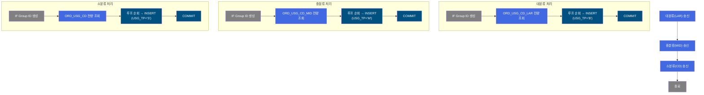
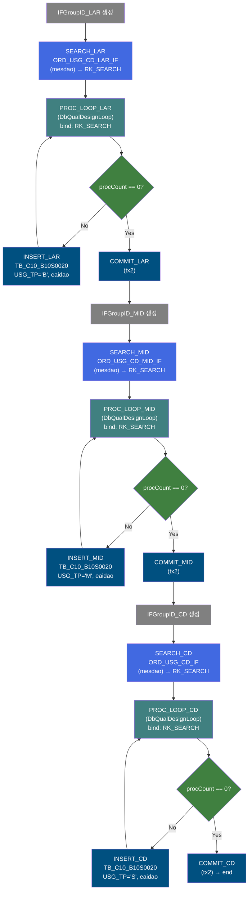
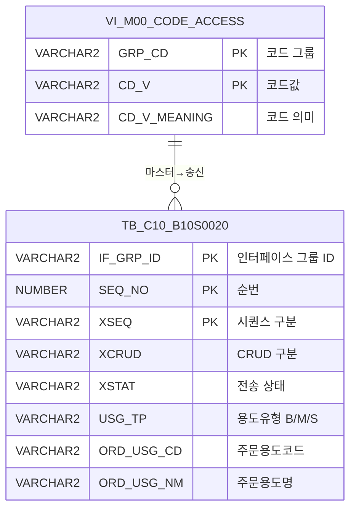

<h1 style="font-size: 40px; text-align: center; font-weight:
   bold; margin: 30px 0;">
  B10S0020 레거시 시스템 분석 종합 보고서
</h1>


# 1. 시스템 개요
- **서비스 ID**: B10S0020
- **업무명**: 주문용도코드 마스터 데이터 EAI 송신 (대/중/소분류)
- **분석 일시**: 2026-03-17 10:06 (KST)
- **전체 Activity 수**: 15개
- **분석자**: Claude Opus 4.6 + Sonnet (Phase 2/3)
- **분석 도구**: /analyze-service B10S0020
- **문서 버전**: 1.0

# 📊 비즈니스 프로세스 분석

## 시스템 목적

B10S0020은 MES 시스템에서 관리하는 **주문용도코드(ORD_USG_CD) 마스터 데이터를 대분류/중분류/소분류 3단계로 분리하여 EAI를 통해 외부 시스템(ERP 등)으로 송신**하기 위한 NUI 배치 서비스이다.

공통코드 뷰(`VI_M00_CODE_ACCESS`)에서 코드유형별(ORD_USG_CD_LAR, ORD_USG_CD_MID, ORD_USG_CD)로 주문용도 코드와 코드명을 전량 조회한 후, 각 분류별로 별도의 IF_GRP_ID를 생성하고 EAI 송신 테이블(`TB_C10_B10S0020`, DAO: `eaidao`)에 USG_TP 구분값과 함께 INSERT한다.

서비스 구조는 3개의 독립적인 **IFGroupID → 전량 조회 → 루프 → INSERT → COMMIT** 파이프라인이 직렬 연결된 형태로, 대분류(LAR, USG_TP='B') → 중분류(MID, USG_TP='M') → 소분류(CD, USG_TP='S') 순서로 실행된다.

## 핵심 워크플로우 다이어그램



### 상세 워크플로우 다이어그램



## 주요 유즈케이스

### UC-01: 주문용도 대분류 코드 EAI 송신
- **Actor**: 배치 스케줄러 (자동 실행)
- **목적**: 주문용도 대분류(ORD_USG_CD_LAR) 코드 마스터를 EAI 송신 테이블에 적재

- **전제조건**:
  - VI_M00_CODE_ACCESS 뷰에 GRP_CD='ORD_USG_CD_LAR' 데이터 존재
  - EAI 데이터베이스(eaidao) 연결 정상

- **주요 흐름**:
  1. IFGroupID_LAR이 인터페이스 그룹 ID 생성
  2. SEARCH_LAR이 VI_M00_CODE_ACCESS에서 ORD_USG_CD_LAR 유형 전량 조회
  3. PROC_LOOP_LAR이 조회 ResultSet을 1건씩 순회 (ORD_USG_CD, ORD_USG_NM 바인딩)
  4. INSERT_LAR이 TB_C10_B10S0020에 USG_TP='B'(Big/대분류)로 INSERT
  5. 전체 건 완료 후 COMMIT_LAR이 tx2 트랜잭션 커밋

- **대체 흐름**:
  - 조회 결과 0건: 루프 즉시 exit → COMMIT (빈 트랜잭션) → 중분류 단계로 진행

- **후행조건**:
  - TB_C10_B10S0020에 USG_TP='B' 대분류 코드 데이터 적재 완료
  - 중분류 송신 단계로 자동 진행

### UC-02: 주문용도 중분류 코드 EAI 송신
- **Actor**: 배치 스케줄러 (자동 실행, 대분류 완료 후)
- **목적**: 주문용도 중분류(ORD_USG_CD_MID) 코드 마스터를 EAI 송신 테이블에 적재

- **전제조건**:
  - 대분류(LAR) 단계 COMMIT 완료
  - VI_M00_CODE_ACCESS 뷰에 GRP_CD='ORD_USG_CD_MID' 데이터 존재

- **주요 흐름**:
  1. IFGroupID_MID가 새로운 인터페이스 그룹 ID 생성 (대분류와 별도 그룹)
  2. SEARCH_MID가 ORD_USG_CD_MID 유형 전량 조회
  3. PROC_LOOP_MID가 순회하며 INSERT_MID로 USG_TP='M'(Middle/중분류) INSERT
  4. COMMIT_MID 후 소분류 단계로 진행

- **대체 흐름**:
  - 조회 결과 0건: 빈 트랜잭션 커밋 후 소분류 단계로 진행

- **후행조건**:
  - TB_C10_B10S0020에 USG_TP='M' 중분류 코드 데이터 적재 완료

### UC-03: 주문용도 소분류 코드 EAI 송신
- **Actor**: 배치 스케줄러 (자동 실행, 중분류 완료 후)
- **목적**: 주문용도 소분류(ORD_USG_CD) 코드 마스터를 EAI 송신 테이블에 적재

- **전제조건**:
  - 중분류(MID) 단계 COMMIT 완료
  - VI_M00_CODE_ACCESS 뷰에 GRP_CD='ORD_USG_CD' 데이터 존재

- **주요 흐름**:
  1. IFGroupID_CD가 새로운 인터페이스 그룹 ID 생성
  2. SEARCH_CD가 ORD_USG_CD 유형 전량 조회
  3. PROC_LOOP_CD가 순회하며 INSERT_CD로 USG_TP='S'(Small/소분류) INSERT
  4. COMMIT_CD로 최종 커밋, 서비스 종료

- **대체 흐름**:
  - 조회 결과 0건: 빈 트랜잭션 커밋 후 서비스 종료

- **후행조건**:
  - TB_C10_B10S0020에 USG_TP='S' 소분류 코드 데이터 적재 완료
  - EAI 미들웨어가 XSTAT='R' 건을 감지하여 외부 전송

---
## 비즈니스 로직 상세

### 1. 3단계 분류별 순차 송신 로직

- **목적**: 주문용도코드를 대/중/소분류별로 분리하여 각각 독립적인 IF_GRP_ID로 EAI 송신 테이블에 적재

- **처리 케이스**:

  **[케이스 1: 대분류(LAR) 송신]**
  ```
    조건: 서비스 시작 (IFGroupID_LAR이 초기 Activity)
    처리:
      1. IF_GRP_ID 생성 (대분류 전용)
      2. VI_M00_CODE_ACCESS에서 GRP_CD='ORD_USG_CD_LAR' 전량 조회
      3. DbQualDesignLoop로 1건씩 순회 (ORD_USG_CD, ORD_USG_NM)
      4. TB_C10_B10S0020에 INSERT:
         - USG_TP = 'B' (Big/대분류)
         - XCRUD = 'C', XSTAT = 'R'
      5. COMMIT_LAR → 중분류 단계로 전이
  ```

  **[케이스 2: 중분류(MID) 송신]**
  ```
    조건: COMMIT_LAR 완료 후 자동 진행
    처리:
      1. 새로운 IF_GRP_ID 생성 (중분류 전용)
      2. VI_M00_CODE_ACCESS에서 GRP_CD='ORD_USG_CD_MID' 전량 조회
      3. DbQualDesignLoop로 1건씩 순회
      4. TB_C10_B10S0020에 INSERT:
         - USG_TP = 'M' (Middle/중분류)
      5. COMMIT_MID → 소분류 단계로 전이
  ```

  **[케이스 3: 소분류(CD) 송신]**
  ```
    조건: COMMIT_MID 완료 후 자동 진행
    처리:
      1. 새로운 IF_GRP_ID 생성 (소분류 전용)
      2. VI_M00_CODE_ACCESS에서 GRP_CD='ORD_USG_CD' 전량 조회
      3. DbQualDesignLoop로 1건씩 순회
      4. TB_C10_B10S0020에 INSERT:
         - USG_TP = 'S' (Small/소분류)
      5. COMMIT_CD → 서비스 종료
  ```

- **예외 처리**:
  - 특정 분류 단계 실패 시: 해당 단계의 트랜잭션 롤백, 이전 분류의 커밋은 유지됨
  - 각 분류별 독립 IF_GRP_ID로 관리되므로 부분 실패 시 재처리 가능

---

# ⚙️ Java 컴포넌트 분석

## Custom Activity 상세 분석

### 1개 Custom Activity 발견 (3개 인스턴스)

### 1. DbQualDesignLoop (PROC_LOOP_LAR, PROC_LOOP_MID, PROC_LOOP_CD)
- **클래스명**: com.unionsteel.mes.c10.activity.nui.DbQualDesignLoop
- **액티비티명**: PROC_LOOP_LAR, PROC_LOOP_MID, PROC_LOOP_CD
- **파일 경로**: src/com/unionsteel/mes/c10/activity/nui/DbQualDesignLoop.java
- **주요 기능**: ResultSet 순회 루프 제어 액티비티
- **라인 수**: 171 | **메소드 수**: 1

> `DbQualDesignLoop`는 GLUE Framework 기반 NUI(배치) 서비스에서 **이전 액티비티가 조회한 ResultSet을 1건씩 순회 처리하기 위한 루프 제어 액티비티**이다. 본 서비스에서는 대/중/소분류별로 3개 인스턴스가 사용되며, 각각 독립적인 카운터(SD0090_LAR_COUNT, SD0090_MID_COUNT, SD0090_COUNT)로 루프를 관리한다.

📎 **[상세 분석 보고서](../customClass/com.unionsteel.mes.c10.activity.nui.DbQualDesignLoop_class_analysis.md)**

---

# 💾 데이터 요구사항

## 핵심 테이블

### 1. TB_C10_B10S0020 - (EAI 주문용도코드 송신 테이블)
| 컬럼명 | 타입 | PK | 설명 |
|--------|------|----|-----|
| IF_GRP_ID | VARCHAR2 | ✅ | 인터페이스 그룹 ID |
| SEQ_NO | NUMBER | ✅ | 순번 (SQ_C10_B10S0020.NEXTVAL) |
| XSEQ | VARCHAR2 | ✅ | 시퀀스 구분 ('1' 고정) |
| XCRUD | VARCHAR2 | | CRUD 구분 ('C'=Create) |
| XSTAT | VARCHAR2 | | 전송 상태 ('R'=Ready) |
| USG_TP | VARCHAR2 | | 용도유형 ('B'=대분류, 'M'=중분류, 'S'=소분류) |
| ORD_USG_CD | VARCHAR2 | | 주문용도코드 |
| ORD_USG_NM | VARCHAR2 | | 주문용도명 |

### 2. VI_M00_CODE_ACCESS - (공통코드 마스터 뷰, M00APUSER)
| 컬럼명 | 타입 | PK | 설명 |
|--------|------|----|-----|
| GRP_CD | VARCHAR2 | ✅ | 코드 그룹 (ORD_USG_CD_LAR/ORD_USG_CD_MID/ORD_USG_CD) |
| CD_V | VARCHAR2 | ✅ | 코드값 → ORD_USG_CD로 매핑 |
| CD_V_MEANING | VARCHAR2 | | 코드 의미 → ORD_USG_NM으로 매핑 |

## 데이터 플로우

### 1. 대분류 코드 조회 → EAI 송신

```
[대분류 주문용도코드 전량 조회]
배치 실행 (1단계)
→ ORD_USG_CD_LAR_IF.select (mesdao)
  FROM VI_M00_CODE_ACCESS
  WHERE GRP_CD = 'ORD_USG_CD_LAR'
→ RK_SEARCH에 대분류 코드 데이터 저장

[EAI 송신 테이블 INSERT - 대분류]
PROC_LOOP_LAR 루프 진입
→ B10S0020.insert lar (eaidao)
  INSERT INTO TB_C10_B10S0020
    (IF_GRP_ID, SEQ_NO, XSEQ, XCRUD, XSTAT, USG_TP, ORD_USG_CD, ORD_USG_NM)
  VALUES (:IF_GRP_ID, SQ_C10_B10S0020.NEXTVAL, '1', 'C', 'R', 'B', :ORD_USG_CD, :ORD_USG_NM)
→ COMMIT (tx2)
```

### 2. 중분류 코드 조회 → EAI 송신

```
[중분류 주문용도코드 전량 조회]
2단계 자동 진행
→ ORD_USG_CD_MID_IF.select (mesdao)
  FROM VI_M00_CODE_ACCESS
  WHERE GRP_CD = 'ORD_USG_CD_MID'
→ RK_SEARCH에 중분류 코드 데이터 저장

[EAI 송신 테이블 INSERT - 중분류]
PROC_LOOP_MID 루프 진입
→ B10S0020.insert mid (eaidao)
  INSERT INTO TB_C10_B10S0020 ... USG_TP = 'M' ...
→ COMMIT (tx2)
```

### 3. 소분류 코드 조회 → EAI 송신

```
[소분류 주문용도코드 전량 조회]
3단계 자동 진행
→ ORD_USG_CD_IF.select (mesdao)
  FROM VI_M00_CODE_ACCESS
  WHERE GRP_CD = 'ORD_USG_CD'
→ RK_SEARCH에 소분류 코드 데이터 저장

[EAI 송신 테이블 INSERT - 소분류]
PROC_LOOP_CD 루프 진입
→ B10S0020.insert (eaidao)
  INSERT INTO TB_C10_B10S0020 ... USG_TP = 'S' ...
→ COMMIT (tx2)
```

## SQL 일람표
| SQL 이름 | 쿼리 ID | 타입 | 출처 | 테이블 |
|---------|---------|-----|-------|-------|
| 대분류 코드 조회 | ORD_USG_CD_LAR_IF | SELECT | Service | VI_M00_CODE_ACCESS |
| 중분류 코드 조회 | ORD_USG_CD_MID_IF | SELECT | Service | VI_M00_CODE_ACCESS |
| 소분류 코드 조회 | ORD_USG_CD_IF | SELECT | Service | VI_M00_CODE_ACCESS |
| 대분류 송신 INSERT | B10S0020.insert lar | INSERT | Service | TB_C10_B10S0020 |
| 중분류 송신 INSERT | B10S0020.insert mid | INSERT | Service | TB_C10_B10S0020 |
| 소분류 송신 INSERT | B10S0020.insert | INSERT | Service | TB_C10_B10S0020 |

## ER 다이어그램 (핵심 관계)



관계 설명:
- VI_M00_CODE_ACCESS(공통코드 뷰)에서 3가지 GRP_CD로 조회한 데이터가 TB_C10_B10S0020에 USG_TP 구분값과 함께 적재됨
- 각 분류별 독립 IF_GRP_ID로 그룹화, 동일 송신 테이블에 USG_TP로 구분하여 저장

---

# 📌 특이사항 및 주의사항

## 1. 3단계 분류별 독립 트랜잭션
- **각 분류별 독립 COMMIT**: 대분류 → COMMIT → 중분류 → COMMIT → 소분류 → COMMIT 순서로 각 단계가 독립적으로 커밋된다. 중분류 실패 시 대분류는 이미 커밋되어 부분 적재 상태가 될 수 있다. EAI 수신 측에서 IF_GRP_ID 단위로 처리하므로, 대분류 데이터는 정상 전송되고 중/소분류만 재전송해야 하는 상황이 발생할 수 있다.

## 2. 동일 테이블에 3가지 분류 데이터 혼재
- **USG_TP 컬럼으로 구분**: TB_C10_B10S0020 단일 테이블에 'B'(대분류), 'M'(중분류), 'S'(소분류) 데이터가 모두 적재된다. EAI 수신 측에서 USG_TP 값으로 분류별 처리를 수행해야 한다.

## 3. RK_SEARCH 키 재사용
- **동일 ResultSet 키 공유**: 3개 단계 모두 `RK_SEARCH`를 ResultSet 키로 사용한다. 각 SEARCH Activity가 실행될 때마다 이전 ResultSet을 덮어쓰므로 문제는 없으나, 코드 가독성 측면에서 혼동 가능성이 있다.

## 4. 전량 재전송 방식 (변경분 추적 없음)
- **FULL SCAN 조회**: 3가지 분류 모두 조건 없이 전량 조회하여 매 배치 실행마다 모든 코드를 재전송한다. XCRUD='C'(Create) 고정이므로 변경분 추적(Update/Delete) 없이 전량 재적재한다.

## 5. DbQualDesignLoop 3중 사용의 O(n²) 누적
- **3개 루프 인스턴스**: 대/중/소분류별로 각각 DbQualDesignLoop를 사용하므로, 각 분류의 코드 수가 N_B, N_M, N_S일 때 총 탐색 횟수는 O(N_B²) + O(N_M²) + O(N_S²)이다. 코드 수가 적은 경우(수십~수백 건) 성능 이슈는 없으나, 대규모 코드 체계에서는 주의가 필요하다.

---

# 📚 참고 문서

- **Query SQL**: `src/query/B10S0020-query.glue_sql`, `src/query/ORD_USG_CD-query.glue_sql`
- **Custom Java 클래스**:
  - `src/com/unionsteel/mes/c10/activity/nui/DbQualDesignLoop.java`
