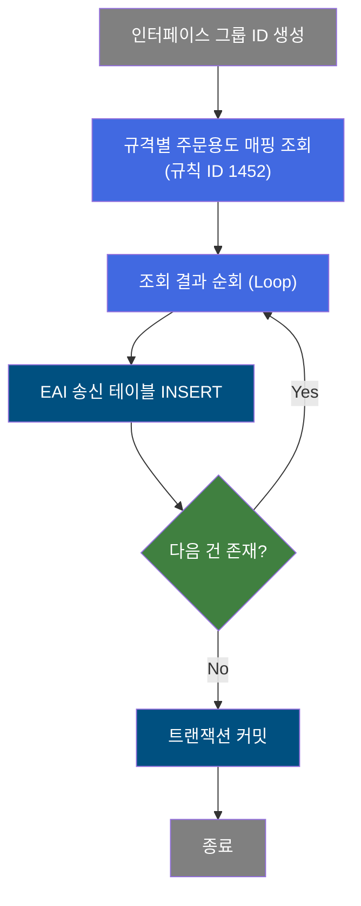
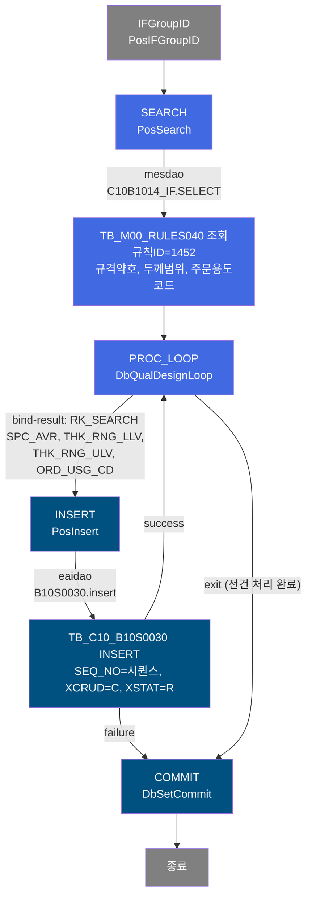
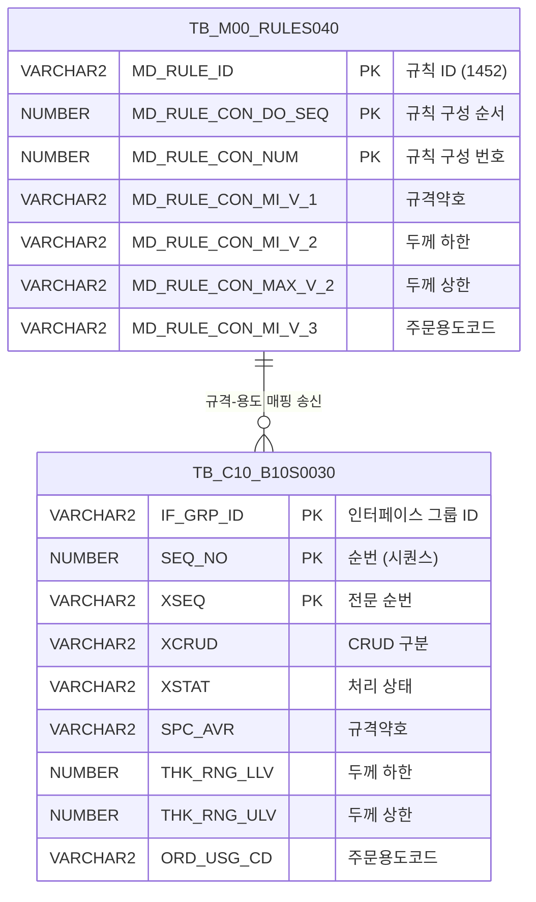

<h1 style="font-size: 40px; text-align: center; font-weight:
   bold; margin: 30px 0;">
  B10S0030 레거시 시스템 분석 종합 보고서
</h1>


# 1. 시스템 개요
- **서비스 ID**: B10S0030
- **업무명**: 규격별 주문용도정보 EAI 송신
- **분석 일시**: 2026-03-17 10:16 (KST)
- **전체 Activity 수**: 5개 (Built-in 3, Common 1, Custom 1)
- **분석자**: Claude Opus 4.6
- **분석 도구**: /analyze-service B10S0030
- **문서 버전**: 1.0

# 비즈니스 프로세스 분석

## 시스템 목적

B10S0030은 MES에서 ERP(외부 시스템)로 **규격별 주문용도 정보를 EAI 인터페이스를 통해 송신**하는 NUI 배치 서비스이다. 마스터 데이터 규칙 테이블(TB_M00_RULES040)에서 규칙 ID '1452'에 해당하는 규격약호(SPC_AVR)별 두께 범위(THK_RNG_LLV~THK_RNG_ULV)와 주문용도코드(ORD_USG_CD) 매핑 정보를 조회한 후, 각 건을 순회하면서 EAI 송신용 인터페이스 테이블(TB_C10_B10S0030)에 INSERT한다.

이 서비스는 B10S 시리즈(송신 서비스)의 일부로, B10S0010(규격공통 마스터), B10S0020(주문용도코드 대/중/소분류)과 함께 MES의 품질설계 기준 데이터를 ERP에 동기화하는 역할을 수행한다. 인터페이스 그룹 ID(IF_GRP_ID) 기반으로 송신 건을 그룹핑하며, EAIAPUSER 스키마의 인터페이스 테이블에 직접 INSERT하는 방식으로 EAI 미들웨어와 연동한다.

## 핵심 워크플로우 다이어그램



### 상세 워크플로우 다이어그램



## 주요 유즈케이스

### UC-01: 규격별 주문용도 정보 EAI 일괄 송신
- **Actor**: 배치 스케줄러 (PosBatchJobInvoker)
- **목적**: MES 마스터 데이터의 규격별 주문용도 매핑 정보를 ERP에 전량 송신하여 시스템 간 데이터 일관성 유지

- **전제조건**:
  - EAI 연결이 정상 동작 중
  - TB_M00_RULES040 테이블에 규칙 ID '1452' 데이터가 존재
  - EAIAPUSER 스키마에 TB_C10_B10S0030 테이블이 존재

- **주요 흐름**:
  1. PosIFGroupID가 인터페이스 그룹 ID를 생성 (송신 건 그룹핑용)
  2. PosSearch가 M00APUSER.TB_M00_RULES040에서 규칙 ID '1452'의 전체 매핑 데이터를 조회 (C10B1014_IF 쿼리)
  3. DbQualDesignLoop가 조회 결과의 첫 번째 행부터 순회 시작, 각 행의 SPC_AVR/THK_RNG_LLV/THK_RNG_ULV/ORD_USG_CD를 파라미터로 바인딩
  4. PosInsert가 eaidao를 통해 TB_C10_B10S0030에 INSERT (시퀀스 SEQ_NO 자동 채번, XCRUD='C', XSTAT='R')
  5. INSERT 성공 시 PROC_LOOP로 복귀하여 다음 행 처리
  6. 전체 행 처리 완료 시 PROC_LOOP에서 exit 전이 → DbSetCommit으로 트랜잭션 커밋

- **대체 흐름**:
  - INSERT 실패 시: failure 전이로 즉시 COMMIT Activity로 이동, 에러 키(P_ERR_KEY)에 오류 정보 기록
  - 조회 결과 0건: PROC_LOOP에서 즉시 exit → COMMIT (빈 트랜잭션 커밋)

- **후행조건**:
  - TB_C10_B10S0030 테이블에 송신 대상 데이터가 INSERT됨
  - EAI 미들웨어가 XSTAT='R'(Ready) 상태의 건을 감지하여 ERP로 전송

### UC-02: 규격 마스터 변경 시 재송신
- **Actor**: 마스터 데이터 관리자
- **목적**: 규격별 주문용도 매핑 규칙이 변경된 후 ERP에 최신 데이터를 재동기화

- **전제조건**:
  - TB_M00_RULES040의 규칙 ID '1452' 데이터가 업데이트됨
  - 이전 송신 건이 처리 완료됨

- **주요 흐름**:
  1. 배치 스케줄러가 B10S0030 서비스를 재호출
  2. UC-01과 동일한 흐름으로 전체 매핑 데이터를 새로 INSERT
  3. 새 IF_GRP_ID로 그룹핑되어 이전 송신 건과 구분

- **대체 흐름**:
  - EAI 테이블 중복 시: 시퀀스(SQ_C10_B10S0030)로 고유성 보장되므로 중복 불가

- **후행조건**:
  - 최신 규격-주문용도 매핑이 ERP에 반영됨

### UC-03: 송신 실패 후 재처리
- **Actor**: 시스템 운영자
- **목적**: INSERT 실패 건 확인 및 원인 조치 후 재실행

- **전제조건**:
  - 이전 실행에서 INSERT failure가 발생함
  - P_ERR_KEY에 에러 정보가 기록됨

- **주요 흐름**:
  1. 에러 로그에서 실패 원인 확인 (P_ERR_KEY)
  2. 원인 조치 (테이블 공간 확보, 권한 확인 등)
  3. B10S0030 서비스 재호출
  4. 전체 데이터가 새 IF_GRP_ID로 재송신

- **대체 흐름**:
  - 부분 성공 건이 있는 경우: 기존 건은 EAI에서 처리, 새 실행으로 전체 재송신

- **후행조건**:
  - 모든 매핑 데이터가 정상 송신됨

---
## 비즈니스 로직 상세

### 1. 규칙 테이블 기반 규격-주문용도 매핑 조회

- **목적**: 마스터 데이터 규칙 테이블에서 규격별 주문용도 매핑 정보를 추출
- **처리 케이스**:

  **[케이스 1: 규칙 ID 1452 전체 조회]**
  ```
    조건: MD_RULE_ID = '1452' (규격별 주문용도 매핑 규칙)
    처리:
      1. M00APUSER.TB_M00_RULES040 테이블에서 규칙 ID '1452' 필터
      2. MD_RULE_CON_MI_V_1 → SPC_AVR (규격약호)
      3. MD_RULE_CON_MI_V_2 → THK_RNG_LLV (두께 범위 하한)
      4. MD_RULE_CON_MAX_V_2 → THK_RNG_ULV (두께 범위 상한)
      5. MD_RULE_CON_MI_V_3 → ORD_USG_CD (주문용도코드)
      6. MD_RULE_CON_DO_SEQ, MD_RULE_CON_NUM 순으로 정렬
  ```

- **컬럼 매핑 규칙**:
  ```
  규칙 테이블 물리 컬럼 → 업무 의미
  MD_RULE_CON_MI_V_1  → 규격약호 (SPC_AVR)
  MD_RULE_CON_MI_V_2  → 두께 범위 하한값 (THK_RNG_LLV)
  MD_RULE_CON_MAX_V_2 → 두께 범위 상한값 (THK_RNG_ULV)
  MD_RULE_CON_MI_V_3  → 주문용도코드 (ORD_USG_CD)
  ```

### 2. 루프 기반 EAI 인터페이스 테이블 INSERT

- **목적**: 조회된 전체 매핑 건을 건별 순회하며 EAI 송신 테이블에 적재
- **처리 케이스**:

  **[케이스 1: 정상 INSERT]**
  ```
    조건: 조회 결과가 1건 이상 존재
    처리:
      1. DbQualDesignLoop가 RK_SEARCH 결과셋에서 현재 행의 4개 컬럼을 PosContext에 바인딩
         - SPC_AVR|SPC_AVR, THK_RNG_LLV|THK_RNG_LLV, THK_RNG_ULV|THK_RNG_ULV, ORD_USG_CD|ORD_USG_CD
      2. PosInsert가 eaidao를 통해 TB_C10_B10S0030에 INSERT
         - IF_GRP_ID: IFGroupID에서 생성된 그룹 ID
         - SEQ_NO: SQ_C10_B10S0030.NEXTVAL (시퀀스 자동 채번)
         - XSEQ: '1' (고정)
         - XCRUD: 'C' (Create 모드)
         - XSTAT: 'R' (Ready - 미처리 대기)
      3. isAudit=true → 감사 정보(CREATED_*, LAST_UPDATED_*) 자동 기록
      4. INSERT 성공 → PROC_LOOP로 복귀, 다음 행 처리
  ```

  **[케이스 2: 조회 결과 0건]**
  ```
    조건: TB_M00_RULES040에 규칙 ID 1452 데이터 없음
    처리:
      1. PROC_LOOP 진입 즉시 exit 전이
      2. COMMIT Activity 실행 (빈 트랜잭션)
      3. 정상 종료
  ```

  **[케이스 3: INSERT 실패]**
  ```
    조건: PosInsert에서 예외 발생
    처리:
      1. failure 전이로 COMMIT Activity 이동
      2. P_ERR_KEY에 에러 정보 설정
      3. tx2 트랜잭션 커밋 (부분 성공 건은 커밋됨)
      4. 서비스 종료
  ```

---

# Java 컴포넌트 분석

## Custom Activity 상세 분석

### 1개 Custom Activity 발견

### 1. DbQualDesignLoop (PROC_LOOP)
- **클래스명**: com.unionsteel.mes.c10.activity.nui.DbQualDesignLoop
- **액티비티명**: PROC_LOOP
- **파일 경로**: src/com/unionsteel/mes/c10/activity/nui/DbQualDesignLoop.java
- **주요 기능**: 이전 액티비티가 조회한 ResultSet을 1건씩 순회 처리하기 위한 루프 제어 액티비티
- **구현 인터페이스**: C10NuiConstantsIF

#### 메소드 구조
- **주요 메소드**: runActivity
  - **반환 타입**: void
  - **파라미터**: GlueContext

#### 핵심 비즈니스 로직
- **루프 제어**: bind-result로 지정된 결과셋(RK_SEARCH)에서 현재 인덱스의 행을 읽어 param0~param3으로 지정된 컬럼값을 PosContext에 바인딩
- **카운터 관리**: countName(SD0420_COUNT)으로 현재 처리 인덱스를 추적하며, 전체 행 소진 시 exit 전이
- **파라미터 바인딩**: `SPC_AVR|SPC_AVR` 형태로 소스컬럼|타겟키 매핑 (동일 이름이므로 1:1 전달)

#### Java 상수 및 의존성
- **주요 상수**: C10NuiConstantsIF에서 상속
- **핵심 의존성**: PosRowSet(결과셋 래퍼), PosContext(데이터 컨테이너)

---

# 데이터 요구사항

## 핵심 테이블

### 1. TB_M00_RULES040 - (마스터 데이터 규칙 구성 테이블)
| 컬럼명 | 타입 | PK | 설명 |
|--------|------|----|-----|
| MD_RULE_ID | VARCHAR2 | ✅ | 규칙 ID (본 서비스에서 '1452' 사용) |
| MD_RULE_CON_DO_SEQ | NUMBER | ✅ | 규칙 구성 순서 |
| MD_RULE_CON_NUM | NUMBER | ✅ | 규칙 구성 번호 |
| MD_RULE_CON_MI_V_1 | VARCHAR2 | | 규칙 조건 최소값 1 → 규격약호(SPC_AVR) |
| MD_RULE_CON_MI_V_2 | VARCHAR2 | | 규칙 조건 최소값 2 → 두께 하한(THK_RNG_LLV) |
| MD_RULE_CON_MAX_V_2 | VARCHAR2 | | 규칙 조건 최대값 2 → 두께 상한(THK_RNG_ULV) |
| MD_RULE_CON_MI_V_3 | VARCHAR2 | | 규칙 조건 최소값 3 → 주문용도코드(ORD_USG_CD) |

### 2. TB_C10_B10S0030 - (규격주문용도정보 EAI 송신 인터페이스 테이블)
| 컬럼명 | 타입 | PK | 설명 |
|--------|------|----|-----|
| IF_GRP_ID | VARCHAR2 | ✅ | 인터페이스 그룹 ID |
| SEQ_NO | NUMBER | ✅ | 순번 (SQ_C10_B10S0030 시퀀스) |
| XSEQ | VARCHAR2 | ✅ | 전문 순번 (고정값 '1') |
| XCRUD | VARCHAR2 | | CRUD 구분 ('C'=Create) |
| XSTAT | VARCHAR2 | | 처리 상태 ('R'=Ready 미처리 대기) |
| SPC_AVR | VARCHAR2 | | 규격약호 |
| THK_RNG_LLV | NUMBER | | 두께 범위 하한값 |
| THK_RNG_ULV | NUMBER | | 두께 범위 상한값 |
| ORD_USG_CD | VARCHAR2 | | 주문용도코드 |
| CREATED_OBJECT_TYPE | VARCHAR2 | | 생성 OBJECT 유형 (감사) |
| CREATED_OBJECT_ID | VARCHAR2 | | 생성 OBJECT ID (감사) |
| CREATED_PROGRAM_ID | VARCHAR2 | | 생성 프로그램 ID (감사) |
| CREATION_TIMESTAMP | DATE | | 생성 일시 (감사) |
| LAST_UPDATED_OBJECT_TYPE | VARCHAR2 | | 최종변경 OBJECT 유형 (감사) |
| LAST_UPDATED_OBJECT_ID | VARCHAR2 | | 최종변경 OBJECT ID (감사) |
| LAST_UPDATE_PROGRAM_ID | VARCHAR2 | | 최종변경 프로그램 ID (감사) |
| LAST_UPDATE_TIMESTAMP | DATE | | 최종변경 일시 (감사) |

## 데이터 플로우

### 1. 조회 (마스터 규칙 데이터)

```
[규격별 주문용도 매핑 정보 조회]
서비스 시작
→ C10B1014_IF.SELECT (mesdao)
  FROM M00APUSER.TB_M00_RULES040
  WHERE MD_RULE_ID = '1452'
  ORDER BY MD_RULE_CON_DO_SEQ ASC, MD_RULE_CON_NUM ASC
→ RK_SEARCH에 전체 매핑 데이터 적재
```

### 2. 송신 (EAI 인터페이스 INSERT)

```
[EAI 송신 테이블 적재 - 건별 반복]
PROC_LOOP에서 행 순회
→ B10S0030.insert (eaidao)
  INSERT INTO TB_C10_B10S0030
  (IF_GRP_ID, SEQ_NO, XSEQ, XCRUD, XSTAT,
   SPC_AVR, THK_RNG_LLV, THK_RNG_ULV, ORD_USG_CD,
   감사 컬럼 8개)
  VALUES
  (?, SQ_C10_B10S0030.NEXTVAL, '1', 'C', 'R',
   ?, ?, ?, ?,
   감사 정보 자동 기록)
→ 전체 행 처리 완료 시 tx2 커밋
```

## SQL 일람표

| SQL 이름 | 쿼리 ID | 타입 | 출처 | 테이블 |
|---------|---------|-----|-------|-------|
| 규격별 주문용도정보 조회 | C10B1014_IF | SELECT | Service | M00APUSER.TB_M00_RULES040 |
| 규격주문용도정보 송신 INSERT | B10S0030.insert | INSERT | Service | TB_C10_B10S0030 |

## ER 다이어그램 (핵심 관계)



관계 설명:
- TB_M00_RULES040이 소스 테이블로, 규칙 ID '1452'의 규격-주문용도 매핑 데이터를 보유
- TB_C10_B10S0030이 타겟(EAI 송신) 테이블로, 조회된 각 매핑 건이 1:1로 INSERT됨
- 두 테이블 간 FK 관계는 없으나, SPC_AVR/THK_RNG_LLV/THK_RNG_ULV/ORD_USG_CD 4개 컬럼의 값이 동일하게 복사됨

---

# 특이사항 및 주의사항

## 1. 전량 재송신 방식 (증분 아닌 Full Replace)
- **전량 조회 후 전량 INSERT**: 조회 쿼리에 날짜/변경 조건 없이 규칙 ID '1452' 전체 데이터를 매번 조회하여 INSERT한다. 증분(Delta) 방식이 아닌 전량(Full) 송신이므로, 매 실행마다 동일한 데이터가 중복 INSERT될 수 있다.
- **IF_GRP_ID와 시퀀스**: 매 실행마다 새로운 IF_GRP_ID가 생성되고 시퀀스로 SEQ_NO가 채번되므로 물리적 중복은 발생하지 않으나, EAI 수신 측에서 전량 교체(MERGE/DELETE+INSERT) 처리를 해야 한다.

## 2. 부분 커밋 위험
- **INSERT failure 시 COMMIT 전이**: INSERT 실패 시 PROC_LOOP가 아닌 COMMIT으로 직접 전이한다. 이는 실패 시점까지 INSERT된 건은 커밋되고, 나머지 건은 누락되는 **부분 커밋** 상황이 발생할 수 있다.
- **트랜잭션 구조**: tx1, tx2 두 개의 트랜잭션 매니저가 정의되어 있으나, COMMIT Activity는 tx2만 커밋한다. INSERT가 eaidao(EAIAPUSER)를 사용하므로 tx2가 EAI 트랜잭션을 담당하는 것으로 추정된다.

## 3. 규칙 테이블의 범용 컬럼 사용
- **비직관적 컬럼 매핑**: TB_M00_RULES040은 범용 규칙 테이블로, `MD_RULE_CON_MI_V_1`, `MD_RULE_CON_MI_V_2` 등 범용 컬럼명을 사용한다. 규격약호, 두께 범위, 주문용도코드라는 업무적 의미는 규칙 ID '1452'의 정의에 의해서만 해석 가능하다.
- **규칙 변경 영향**: 규칙 ID '1452'의 컬럼 매핑 의미가 변경되면 이 서비스의 동작이 완전히 달라지므로, 규칙 테이블 관리 시 주의가 필요하다.

## 4. DAO 교차 사용
- **조회는 mesdao(MESAPUSER), INSERT는 eaidao(EAIAPUSER)**: 한 서비스 내에서 두 개의 서로 다른 DAO를 사용한다. 조회 대상은 M00APUSER 스키마(마스터)이고, INSERT 대상은 EAIAPUSER 스키마(EAI)이다. 이 교차 DAO 사용은 MES→EAI 데이터 이관의 표준 패턴이다.

## 5. 감사(Audit) 정보 자동 기록
- **isAudit=true**: INSERT Activity에 감사 플래그가 설정되어 있어, CREATED_OBJECT_TYPE/ID, CREATED_PROGRAM_ID, CREATION_TIMESTAMP 등 8개 감사 컬럼이 프레임워크에 의해 자동 기록된다. 이는 송신 이력 추적에 활용된다.

---

# 참고 문서

- **Service XML**: `src/service/B10S0030-service.xml`
- **Query SQL**:
  - `src/query/C10_ERPOMS-query.glue_sql` (B10S0030.insert)
  - `src/query/C10_VI_M00-query.glue_sql` (C10B1014_IF)
- **Custom Java 클래스**:
  - `src/com/unionsteel/mes/c10/activity/nui/DbQualDesignLoop.java`
