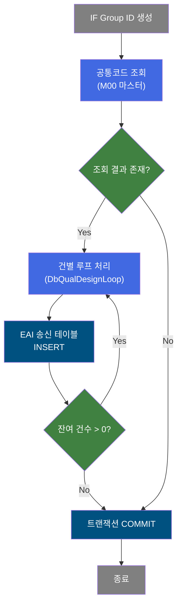
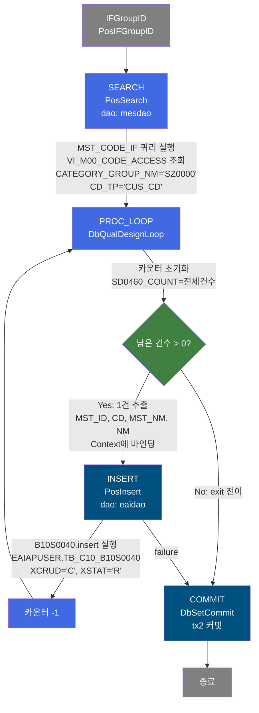
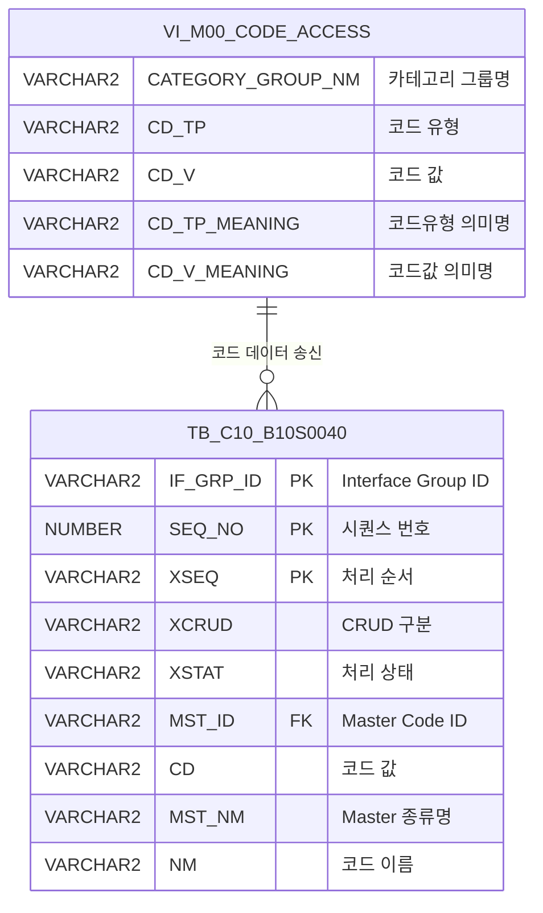

<h1 style="font-size: 40px; text-align: center; font-weight:
   bold; margin: 30px 0;">
  B10S0040 레거시 시스템 분석 종합 보고서
</h1>


# 1. 시스템 개요
- **서비스 ID**: B10S0040
- **업무명**: Master Code(공통코드) EAI 송신
- **분석 일시**: 2026-03-17 10:23 KST
- **분석 시간**: 약 3분
- **전체 Activity 수**: 5개 (Built-in 3, Common 1, Custom 1)
- **분석자**: Claude Opus 4.6
- **분석 도구**: /analyze-service B10S0040
- **문서 버전**: 1.0

# 📊 비즈니스 프로세스 분석

## 시스템 목적

B10S0040은 MES 시스템의 **Master Code(공통코드) 정보를 ERP 시스템으로 송신하기 위한 NUI 배치 서비스**이다. M00APUSER 마스터 스키마의 공통코드 뷰(VI_M00_CODE_ACCESS)에서 카테고리그룹 'SZ0000'에 속하는 고객코드(CUS_CD) 정보를 조회하여, EAIAPUSER 스키마의 EAI 송신 테이블(TB_C10_B10S0040)에 건별로 삽입한다.

이 서비스는 EAI(Enterprise Application Integration) 연동 배치로, MES에서 관리하는 공통코드 마스터 데이터의 변경사항을 ERP 시스템에 동기화하는 역할을 수행한다. 조회된 코드 목록을 DbQualDesignLoop 루프 액티비티를 통해 1건씩 순회하면서 EAI 송신 테이블에 INSERT하며, 모든 건 처리 완료 후 COMMIT으로 트랜잭션을 확정한다.

## 핵심 워크플로우 다이어그램



### 상세 워크플로우 다이어그램



## 주요 유즈케이스

### UC-01: 공통코드 EAI 일괄 송신

- **Actor**: 배치 스케줄러 (자동 실행)
- **목적**: MES 마스터 공통코드(고객코드) 정보를 ERP 시스템에 EAI를 통해 일괄 송신

- **전제조건**:
  - EAI 시스템이 정상 가동 중
  - M00APUSER.VI_M00_CODE_ACCESS 뷰에 'SZ0000' 카테고리그룹 데이터 존재
  - EAIAPUSER 스키마의 TB_C10_B10S0040 테이블 접근 권한

- **주요 흐름**:
  1. PosIFGroupID가 인터페이스 그룹 ID 생성
  2. mesdao를 통해 VI_M00_CODE_ACCESS에서 CATEGORY_GROUP_NM='SZ0000', CD_TP='CUS_CD' 조건으로 공통코드 목록 조회
  3. DbQualDesignLoop가 조회 결과를 1건씩 순회하며 MST_ID, CD, MST_NM, NM을 Context에 바인딩
  4. PosInsert가 eaidao를 통해 EAIAPUSER.TB_C10_B10S0040에 각 건을 INSERT (XCRUD='C', XSTAT='R')
  5. 시퀀스 SQ_C10_B10S0040으로 SEQ_NO 자동 채번
  6. 모든 건 처리 완료 후 DbSetCommit이 tx2 트랜잭션 COMMIT

- **대체 흐름**:
  - 조회 결과 0건: 루프 즉시 종료 → COMMIT (빈 트랜잭션)
  - INSERT 실패: failure 전이 → COMMIT 액티비티로 이동 (에러 체크 후 처리)

- **후행조건**:
  - TB_C10_B10S0040에 송신 대상 코드 데이터가 XSTAT='R'(Ready) 상태로 적재됨
  - EAI 미들웨어가 해당 테이블을 폴링하여 ERP로 전송

### UC-02: 인터페이스 그룹 ID 관리

- **Actor**: 배치 스케줄러 (자동)
- **목적**: 동일 배치 실행 건을 하나의 그룹으로 묶어 EAI 처리 추적

- **전제조건**:
  - 배치 서비스 정상 시작

- **주요 흐름**:
  1. PosIFGroupID 액티비티가 고유한 IF_GRP_ID 생성
  2. 해당 배치 실행의 모든 INSERT 건에 동일한 IF_GRP_ID 적용
  3. EAI 시스템에서 IF_GRP_ID 단위로 송신 상태 관리

- **대체 흐름**:
  - ID 생성 실패: 서비스 전체 중단

- **후행조건**:
  - 동일 IF_GRP_ID로 묶인 레코드가 TB_C10_B10S0040에 존재

### UC-03: INSERT 실패 시 에러 처리

- **Actor**: 시스템 (자동)
- **목적**: 개별 건 INSERT 실패 시 트랜잭션 정리

- **전제조건**:
  - INSERT 액티비티 실행 중 오류 발생

- **주요 흐름**:
  1. INSERT 실패 시 failure 전이로 COMMIT 액티비티 호출
  2. DbSetCommit이 P_ERR_KEY 값 확인
  3. exitFlag='N' 설정에 따라 서비스 종료 없이 트랜잭션 커밋/롤백 결정

- **대체 흐름**:
  - P_ERR_KEY가 오류 상태: 롤백 후 종료

- **후행조건**:
  - 실패 건은 미송신 상태로 남음

---
## 비즈니스 로직 상세

### 1. 루프 제어 로직 (DbQualDesignLoop)

- **목적**: 조회된 공통코드 ResultSet을 1건씩 순회하며 후속 INSERT 액티비티에 데이터를 전달
- **처리 케이스**:

  **[케이스 1: 최초 진입 - 카운터 초기화]**
  ```
    조건: SD0460_COUNT 변수가 null (최초 루프 진입)
    처리:
      1. RK_SEARCH ResultSet의 전체 건수 조회
      2. SD0460_COUNT = 전체 건수로 초기화
      3. P_ERR_KEY = "N", BATCH_JOB = "true", QLT_DSN_ERR_YN = "" 초기화
      4. 첫 번째 Row의 MST_ID, CD, MST_NM, NM을 Context에 바인딩
      5. 카운터 -1 후 "success" 전이 반환
  ```

  **[케이스 2: 루프 계속 - 다음 건 처리]**
  ```
    조건: SD0460_COUNT > 0
    처리:
      1. ResultSet에서 다음 Row 추출
      2. param0~param3 매핑에 따라 MST_ID, CD, MST_NM, NM을 Context에 바인딩
      3. 카운터 -1 후 "success" 전이 반환
  ```

  **[케이스 3: 루프 종료]**
  ```
    조건: SD0460_COUNT = 0 (모든 건 처리 완료)
    처리:
      1. "exit" 전이 반환 → COMMIT 액티비티로 이동
  ```

- **예외 처리**:
  - param-count 미설정: "failure" 전이 반환
  - ResultSet 접근 오류: 예외 로그 출력 후 "failure" 전이

### 2. 코드 조회 로직 (MST_CODE_IF 쿼리)

- **목적**: M00 마스터 스키마의 공통코드 뷰에서 EAI 송신 대상 코드를 조회
- **처리 케이스**:

  **[케이스 1: 정상 조회]**
  ```
    조건: 항상 (파라미터 없는 고정 조건)
    처리:
      1. VI_M00_CODE_ACCESS 뷰에서 CATEGORY_GROUP_NM = 'SZ0000' 필터
      2. CD_TP = 'CUS_CD' (고객코드 유형만) 필터
      3. CD_TP를 MST_ID로, CD_V를 CD로, CD_TP_MEANING을 MST_NM으로, CD_V_MEANING을 NM으로 별칭 매핑
      4. CD_TP, CD_V 순으로 정렬하여 반환
  ```

- **예외 처리**:
  - 조회 결과 0건: 빈 ResultSet → 루프 즉시 종료

---

# ⚙️ Java 컴포넌트 분석

## Custom Activity 상세 분석

### 1개 Custom Activity 발견

### 1. DbQualDesignLoop (PROC_LOOP)
- **클래스명**: com.unionsteel.mes.c10.activity.nui.DbQualDesignLoop
- **액티비티명**: PROC_LOOP
- **파일 경로**: src/com/unionsteel/mes/c10/activity/nui/DbQualDesignLoop.java
- **주요 기능**: 이전 액티비티가 조회한 ResultSet을 1건씩 순회 처리하기 위한 루프 제어 액티비티
- **라인 수**: 171 | **메소드 수**: 1개 (runActivity)

> `DbQualDesignLoop`는 GLUE Framework 기반 NUI(배치) 서비스에서 이전 서비스(주로 PosSearch)에서 쿼리 결과로 얻은 PosRowSet을 순차적으로 읽으며, 한 건씩 PosContext에 세팅한 뒤 후속 액티비티 체인이 단건 기준으로 동작할 수 있도록 연결한다. 처리 건수가 0이 되면 "exit" 전이를 반환하여 루프를 종료한다. 사용 빈도가 매우 높아 40개 이상의 서비스 XML에서 참조된다.

📎 **[상세 분석 보고서](../customClass/com.unionsteel.mes.c10.activity.nui.DbQualDesignLoop_class_analysis.md)**

---

# 💾 데이터 요구사항

## 핵심 테이블

### 1. EAIAPUSER.TB_C10_B10S0040 - (Master Code EAI 송신 테이블)
| 컬럼명 | 타입 | PK | 설명 |
|--------|------|----|-----|
| IF_GRP_ID | VARCHAR2 | ✅ | Interface Group ID |
| SEQ_NO | NUMBER | ✅ | 시퀀스 번호 (SQ_C10_B10S0040.NEXTVAL) |
| XSEQ | VARCHAR2 | ✅ | 처리 순서 (고정값 '1') |
| XCRUD | VARCHAR2 | | CRUD 구분 (고정값 'C' = Create) |
| XSTAT | VARCHAR2 | | PI 처리 상태 ('R' = Ready) |
| MST_ID | VARCHAR2 | | Master Code ID (코드유형) |
| CD | VARCHAR2 | | 코드 값 |
| MST_NM | VARCHAR2 | | Master 종류명 |
| NM | VARCHAR2 | | 코드 이름 |
| CREATED_OBJECT_TYPE | VARCHAR2 | | 생성 OBJECT 유형 |
| CREATED_OBJECT_ID | VARCHAR2 | | 생성 OBJECT ID |
| CREATED_PROGRAM_ID | VARCHAR2 | | 생성 프로그램 ID |
| CREATION_TIMESTAMP | DATE | | 생성 일시 |
| LAST_UPDATED_OBJECT_TYPE | VARCHAR2 | | 최종변경 OBJECT 유형 |
| LAST_UPDATED_OBJECT_ID | VARCHAR2 | | 최종변경 OBJECT ID |
| LAST_UPDATE_PROGRAM_ID | VARCHAR2 | | 최종변경 프로그램 ID |
| LAST_UPDATE_TIMESTAMP | DATE | | 최종변경 일시 |

### 2. M00APUSER.VI_M00_CODE_ACCESS - (공통코드 마스터 뷰, 조회 전용)
| 컬럼명 | 타입 | PK | 설명 |
|--------|------|----|-----|
| CATEGORY_GROUP_NM | VARCHAR2 | | 카테고리 그룹명 (필터: 'SZ0000') |
| CD_TP | VARCHAR2 | | 코드 유형 (필터: 'CUS_CD') |
| CD_V | VARCHAR2 | | 코드 값 |
| CD_TP_MEANING | VARCHAR2 | | 코드 유형 의미명 |
| CD_V_MEANING | VARCHAR2 | | 코드 값 의미명 |

## 데이터 플로우

### 1. 공통코드 조회 → EAI 송신 테이블 적재

```
[배치 실행 - 공통코드 EAI 송신]
배치 스케줄러 트리거
→ IFGroupID 액티비티: IF_GRP_ID 생성
→ MST_CODE_IF.select (dao: mesdao)
  FROM M00APUSER.VI_M00_CODE_ACCESS
  WHERE CATEGORY_GROUP_NM = 'SZ0000'
    AND CD_TP = 'CUS_CD'
  ORDER BY CD_TP, CD_V
→ ResultSet(RK_SEARCH)에 코드 목록 저장

[건별 루프 INSERT]
DbQualDesignLoop: RK_SEARCH에서 1건씩 추출
→ MST_ID(=CD_TP), CD(=CD_V), MST_NM(=CD_TP_MEANING), NM(=CD_V_MEANING) Context 바인딩
→ B10S0040.insert (dao: eaidao)
  INSERT INTO EAIAPUSER.TB_C10_B10S0040
  (IF_GRP_ID, SEQ_NO=시퀀스, XSEQ='1', XCRUD='C', XSTAT='R',
   MST_ID, CD, MST_NM, NM, 감사컬럼...)
→ 루프 반복 (잔여 건수 > 0)

[트랜잭션 확정]
DbSetCommit: tx2 COMMIT
```

## SQL 일람표

| SQL 이름 | 쿼리 ID | 타입 | 출처 | 테이블 |
|---------|---------|-----|-------|-------|
| 공통코드 송신 조회 | MST_CODE_IF | SELECT | Service | M00APUSER.VI_M00_CODE_ACCESS |
| Master Code 송신 INSERT | B10S0040.insert | INSERT | Service | EAIAPUSER.TB_C10_B10S0040 |

## ER 다이어그램 (핵심 관계)



관계 설명:
- VI_M00_CODE_ACCESS(M00 마스터 뷰)가 원본 데이터 소스
- TB_C10_B10S0040(EAI 송신 테이블)이 대상 테이블로, 조회된 코드 데이터를 1:N으로 적재
- MST_ID(CD_TP)와 CD(CD_V) 컬럼이 원본-대상 간 데이터 매핑 기준

---

# 📌 특이사항 및 주의사항

## 1. 하드코딩된 조회 조건
- **카테고리 그룹**: MST_CODE_IF 쿼리에서 `CATEGORY_GROUP_NM = 'SZ0000'`이 하드코딩됨
- **코드 유형**: `CD_TP = 'CUS_CD'`가 하드코딩됨. 쿼리 주석에 "차후 협의된 코드 목록 추가" 메모가 있어 향후 확장 가능성 있음
- 현대화 시 이 조건을 파라미터화하거나 설정 테이블로 분리 검토 필요

## 2. 교차 스키마 DAO 접근 패턴
- **조회**: mesdao (MESAPUSER 스키마) → M00APUSER.VI_M00_CODE_ACCESS 뷰 조회
- **저장**: eaidao (EAIAPUSER 스키마) → EAIAPUSER.TB_C10_B10S0040 테이블 INSERT
- 하나의 서비스에서 두 개의 다른 DAO(mesdao, eaidao)를 사용하며, 두 개의 트랜잭션 매니저(tx1, tx2)가 정의됨
- INSERT는 tx2로 커밋되며, tx1은 서비스에서 직접 사용되지 않음 (프레임워크 기본 트랜잭션)

## 3. EAI 송신 상태 관리
- XCRUD='C' (Create)와 XSTAT='R' (Ready)가 고정값으로 삽입됨
- EAI 미들웨어가 XSTAT='R' 건을 폴링하여 ERP로 전송 후 상태를 갱신하는 패턴
- INSERT 실패 시 failure 전이로 COMMIT에 도달하지만, exitFlag='N'이므로 서비스가 즉시 종료되지 않음

## 4. 공유 루프 액티비티 사용
- DbQualDesignLoop는 40개 이상의 서비스에서 공용으로 사용되는 범용 루프 제어 클래스
- 카운터 변수명(SD0460_COUNT)이 서비스별로 다르게 지정 가능하나, 이 서비스에서는 'SD0460_COUNT' 사용
- bind-result 키(RK_SEARCH)로 SEARCH 액티비티의 결과를 연결

## 5. 감사(Audit) 컬럼 자동 처리
- INSERT 액티비티에 `isAudit="true"` 설정으로 CREATED_OBJECT_TYPE, CREATED_OBJECT_ID, CREATED_PROGRAM_ID, CREATION_TIMESTAMP 등 8개 감사 컬럼이 프레임워크에 의해 자동 바인딩됨
- param-count는 5개(IF_GRP_ID, MST_ID, CD, MST_NM, NM)이지만, 감사 컬럼이 추가로 바인딩되어 실제 INSERT 파라미터는 13개

---

# 📚 참고 문서

- **Query SQL**: `src/query/C10_ERPOMS-query.glue_sql` (B10S0040.insert), `src/query/C10_VI_M00-query.glue_sql` (MST_CODE_IF)
- **Service XML**: `src/service/B10S0040-service.xml`
- **Custom Java 클래스**:
  - `src/com/unionsteel/mes/c10/activity/nui/DbQualDesignLoop.java`
