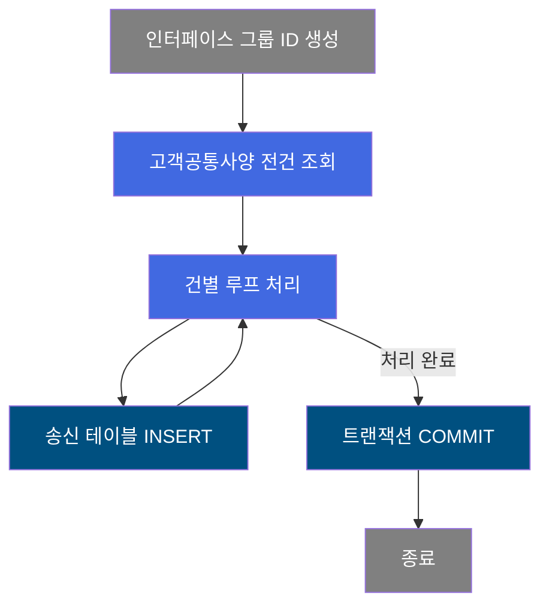
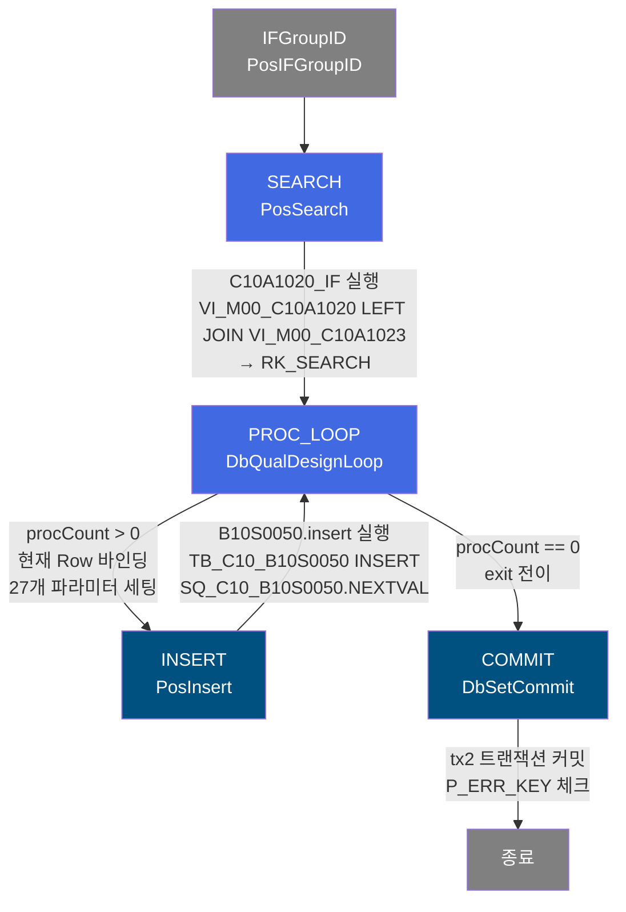
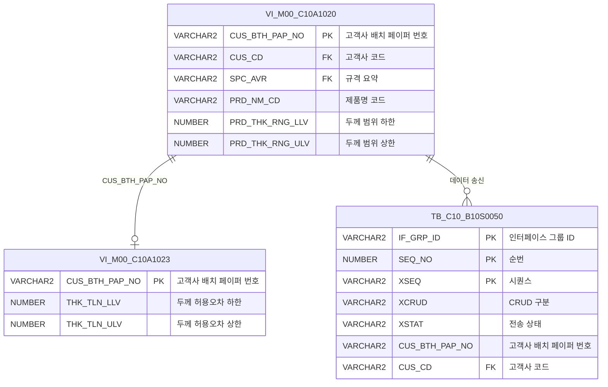

<h1 style="font-size: 40px; text-align: center; font-weight:
   bold; margin: 30px 0;">
  B10S0050 레거시 시스템 분석 종합 보고서
</h1>


# 1. 시스템 개요
- **서비스 ID**: B10S0050
- **업무명**: 고객공통정보송신
- **분석 일시**: 2026-03-17 (KST)
- **전체 Activity 수**: 5개
- **분석자**: Claude Opus 4.6
- **분석 도구**: /analyze-service B10S0050
- **문서 버전**: 1.0

# 📊 비즈니스 프로세스 분석

## 시스템 목적

B10S0050 서비스는 MES 시스템에서 ERP/외부 시스템으로 **고객공통정보(고객별 제품 규격 Master Data)**를 송신하기 위한 NUI(배치) 서비스이다. 마스터 뷰(`VI_M00_C10A1020`, `VI_M00_C10A1023`)에서 고객공통사양과 고객인수도사양 정보를 전건 조회한 뒤, 각 건을 루프로 순회하며 EAI 인터페이스 송신 테이블(`TB_C10_B10S0050`)에 INSERT한다.

이 서비스는 상위 서비스(C106000070 등)에서 `PosSubBizControlActivity`를 통해 호출되며, 인터페이스 그룹 ID 기반으로 일괄 송신 처리를 수행한다. 고객사 코드, 규격 정보, 제품 치수 범위(두께/폭/길이), 허용오차, 표면처리 코드, CCL BOM 번호 등 고객별 제품 사양 Master를 EAI로 전달하여 외부 시스템과 동기화한다.

## 핵심 워크플로우 다이어그램



### 상세 워크플로우 다이어그램



## 주요 유즈케이스

### UC-01: 고객공통정보 일괄 송신
- **Actor**: 시스템 (배치/NUI 서비스로 자동 실행)
- **목적**: MES 마스터 데이터에서 고객공통사양 및 인수도사양 정보를 조회하여 EAI 인터페이스 송신 테이블에 일괄 적재
- **전제조건**:
  - 상위 서비스(C106000070 등)에서 PosSubBizControlActivity로 호출됨
  - VI_M00_C10A1020, VI_M00_C10A1023 뷰에 데이터가 존재함
  - EAI 인터페이스 DB(eaidao) 접속 가능

- **주요 흐름**:
  1. PosIFGroupID가 인터페이스 그룹 ID(IF_GRP_ID) 생성
  2. PosSearch로 `C10A1020_IF` 쿼리 실행 → VI_M00_C10A1020 LEFT JOIN VI_M00_C10A1023 전건 조회 (mesdao)
  3. DbQualDesignLoop가 조회 결과(RK_SEARCH)를 1건씩 순회
  4. 각 건마다 27개 파라미터를 PosContext에 바인딩
  5. PosInsert로 `B10S0050.insert` 실행 → TB_C10_B10S0050에 INSERT (eaidao)
  6. 시퀀스(SQ_C10_B10S0050.NEXTVAL)로 SEQ_NO 자동 채번
  7. XCRUD='C'(Create), XSTAT='R'(Ready) 상태로 생성
  8. 전건 처리 완료 시 DbSetCommit으로 tx2 트랜잭션 커밋

- **대체 흐름**:
  - 조회 결과 0건: DbQualDesignLoop에서 즉시 exit 전이 → COMMIT 수행 (빈 트랜잭션)
  - param-count 미설정: failure 전이 반환
  - INSERT 실패: 트랜잭션 롤백

- **후행조건**:
  - TB_C10_B10S0050에 고객공통정보 레코드 적재 완료
  - EAI 시스템이 해당 테이블을 폴링하여 외부 시스템으로 전송

### UC-02: 인수도사양 정보 연계
- **Actor**: 시스템
- **목적**: 고객공통사양과 인수도사양(허용오차)을 조인하여 통합 정보로 송신
- **전제조건**:
  - VI_M00_C10A1023에 인수도사양 데이터가 존재함

- **주요 흐름**:
  1. C10A1020_IF 쿼리에서 LEFT JOIN으로 VI_M00_C10A1023의 허용오차 정보 조회
  2. 두께/폭/길이 허용오차(THK_TLN_LLV/ULV, WTH_TLN_LLV/ULV, LTH_TLN_LLV/ULV)를 함께 바인딩
  3. 인수도사양이 없는 고객사도 LEFT JOIN이므로 NULL로 처리됨

- **대체 흐름**:
  - VI_M00_C10A1023에 해당 CUS_BTH_PAP_NO 없음: 허용오차 컬럼이 NULL로 INSERT

- **후행조건**:
  - 고객사별 인수도사양 포함/미포함 레코드가 모두 송신 테이블에 적재

### UC-03: 인터페이스 그룹 관리
- **Actor**: 시스템
- **목적**: 동일 배치 실행 건을 하나의 그룹으로 묶어 EAI 추적 가능하도록 관리
- **전제조건**:
  - PosIFGroupID가 유니크한 그룹 ID를 생성 가능

- **주요 흐름**:
  1. PosIFGroupID에서 IF_GRP_ID 생성
  2. 루프 내 모든 INSERT에 동일 IF_GRP_ID 부여
  3. EAI 시스템에서 IF_GRP_ID 기준으로 일괄 처리 가능

- **대체 흐름**:
  - 그룹 ID 생성 실패: 서비스 전체 실패

- **후행조건**:
  - 하나의 배치 실행에서 생성된 모든 레코드가 동일 IF_GRP_ID로 그룹화

---
## 비즈니스 로직 상세

### 1. 루프 처리 및 파라미터 바인딩 (DbQualDesignLoop)

- **목적**: 조회된 고객공통사양 ResultSet을 1건씩 순회하며 27개 컬럼을 PosContext에 바인딩하여 후속 INSERT가 단건 처리할 수 있도록 함

- **처리 케이스**:

  **[케이스 1: 정상 루프 처리]**
  ```
  조건: procCount > 0 (처리할 건 남아있음)
  처리:
    1. P_ERR_KEY = "N", BATCH_JOB = "true" 초기화
    2. procCount -= 1, this_row = total_row - procCount (순방향 인덱스)
    3. bindSet.reset() 후 this_row번째 Row 탐색
    4. param0~param25 파싱 ("|" 구분자 → 저장변수명|대상항목명)
    5. 현재 Row의 각 컬럼값을 지정 변수명으로 ctx에 저장
    6. 감소된 procCount 저장 후 "success" 반환
  ```

  **[케이스 2: 루프 종료]**
  ```
  조건: procCount == 0 (모든 건 처리 완료)
  처리:
    1. ctx에서 카운터 변수 제거
    2. "exit" 전이 반환 → COMMIT 액티비티로 이동
  ```

  **[케이스 3: 파라미터 미설정 오류]**
  ```
  조건: param-count == null
  처리:
    1. "failure" 반환
  ```

- **계산 공식**:
  ```
  this_row = total_row - procCount

  예시:
  전체 6건 → 1회차: this_row = 6 - 5 = 1
                2회차: this_row = 6 - 4 = 2
                ...
                6회차: this_row = 6 - 0 = 6 → procCount=0 → exit
  ```

- **예외 처리**:
  - param-count null: "failure" 전이 반환
  - bind-result 키 미존재: NullPointerException → "failure" 반환
  - 일반 예외: 에러 로그 출력 후 "failure" 반환

### 2. 송신 데이터 INSERT 패턴

- **목적**: 고객공통정보를 EAI 인터페이스 송신 테이블에 CREATE 모드로 삽입
- **처리 케이스**:

  **[케이스 1: 정상 INSERT]**
  ```
  조건: DbQualDesignLoop에서 success 전이 수신
  처리:
    1. IF_GRP_ID: 배치 그룹 식별자 (PosIFGroupID 생성)
    2. SEQ_NO: SQ_C10_B10S0050.NEXTVAL 시퀀스 채번
    3. XSEQ = '1' (고정), XCRUD = 'C' (Create), XSTAT = 'R' (Ready)
    4. 고객사 정보: CUS_BTH_PAP_NO, CUS_CD, CUS_BTH_NM
    5. 규격 정보: SPC_AVR, SPC_YR, ORD_USG_CD, PRD_NM_CD
    6. 치수 범위: PRD_THK/WTH/LTH_RNG_LLV/ULV (두께/폭/길이 상하한)
    7. 허용오차: THK/WTH/LTH_TLN_LLV/ULV
    8. 추가 사양: CUS_REQ_ROL_THK, CUS_REQ_ROL_THK_UNT, ORD_THK_TP, PRD_THK_CAL_APL_CD
    9. 도금/표면: GW_ASG_CD, ORD_SUR_HND_CD, CCL_BOM_NO
    10. 감사 정보: isAudit=true → 생성자/변경자 정보 자동 기록
  ```

---

# ⚙️ Java 컴포넌트 분석

## Custom Activity 상세 분석

### 1개 Custom Activity 발견

### 1. DbQualDesignLoop (PROC_LOOP)
- **클래스명**: com.unionsteel.mes.c10.activity.nui.DbQualDesignLoop
- **액티비티명**: PROC_LOOP
- **파일 경로**: src/com/unionsteel/mes/c10/activity/nui/DbQualDesignLoop.java
- **주요 기능**: 이전 액티비티가 조회한 ResultSet을 1건씩 순회 처리하기 위한 루프 제어 액티비티
- **라인 수**: 171 | **메소드 수**: 1

> `DbQualDesignLoop`는 GLUE Framework 기반 NUI(배치) 서비스에서 이전 액티비티가 조회한 ResultSet을 1건씩 순회 처리하기 위한 루프 제어 액티비티이다. 역방향 카운터 기반 순방향 인덱싱으로 Row를 탐색하며, 40개 이상 서비스에서 공유 사용되는 공통 컴포넌트이다.

📎 **[상세 분석 보고서](../customClass/com.unionsteel.mes.c10.activity.nui.DbQualDesignLoop_class_analysis.md)**

---

# 💾 데이터 요구사항

## 핵심 테이블

### 1. TB_C10_B10S0050 - (EAI 고객공통정보 송신 테이블)
| 컬럼명 | 타입 | PK | 설명 |
|--------|------|----|-----|
| IF_GRP_ID | VARCHAR2 | ✅ | 인터페이스 그룹 ID |
| SEQ_NO | NUMBER | ✅ | 순번 (SQ_C10_B10S0050.NEXTVAL) |
| XSEQ | VARCHAR2 | ✅ | 시퀀스 ('1' 고정) |
| XCRUD | VARCHAR2 | | CRUD 구분 ('C': Create) |
| XSTAT | VARCHAR2 | | 전송 상태 ('R': Ready) |
| CUS_BTH_PAP_NO | VARCHAR2 | | 고객사 배치 페이퍼 번호 |
| SPC_AVR | VARCHAR2 | | 규격 요약 |
| SPC_YR | VARCHAR2 | | 규격 연도 |
| ORD_USG_CD | VARCHAR2 | | 주문용도 코드 |
| CUS_CD | VARCHAR2 | | 고객사 코드 (FK) |
| PRD_NM_CD | VARCHAR2 | | 제품명 코드 |
| PRD_THK_RNG_LLV | NUMBER | | 제품 두께 범위 하한값 |
| PRD_THK_RNG_ULV | NUMBER | | 제품 두께 범위 상한값 |
| PRD_WTH_RNG_LLV | NUMBER | | 제품 폭 범위 하한값 |
| PRD_WTH_RNG_ULV | NUMBER | | 제품 폭 범위 상한값 |
| PRD_LTH_RNG_LLV | NUMBER | | 제품 길이 범위 하한값 |
| PRD_LTH_RNG_ULV | NUMBER | | 제품 길이 범위 상한값 |
| CUS_REQ_ROL_THK | NUMBER | | 고객사 요청 롤 두께 |
| THK_TLN_LLV | NUMBER | | 두께 허용오차 하한값 |
| THK_TLN_ULV | NUMBER | | 두께 허용오차 상한값 |
| WTH_TLN_LLV | NUMBER | | 폭 허용오차 하한값 |
| WTH_TLN_ULV | NUMBER | | 폭 허용오차 상한값 |
| LTH_TLN_LLV | NUMBER | | 길이 허용오차 하한값 |
| LTH_TLN_ULV | NUMBER | | 길이 허용오차 상한값 |
| CUS_REQ_ROL_THK_UNT | VARCHAR2 | | 고객사 요청 롤 두께 단위 |
| ORD_THK_TP | VARCHAR2 | | 주문 두께 타입 |
| PRD_THK_CAL_APL_CD | VARCHAR2 | | 제품 두께 계산 적용 코드 |
| GW_ASG_CD | VARCHAR2 | | 갈바닉 도금 지정 코드 |
| ORD_SUR_HND_CD | VARCHAR2 | | 주문 표면 처리 코드 |
| CCL_BOM_NO | VARCHAR2 | | CCL BOM 번호 |
| CUS_BTH_NM | VARCHAR2 | | 고객사 배치 이름 |

### 2. VI_M00_C10A1020 - (고객공통사양 뷰, 조회 전용)
| 컬럼명 | 타입 | PK | 설명 |
|--------|------|----|-----|
| CUS_BTH_PAP_NO | VARCHAR2 | ✅ | 고객사 배치 페이퍼 번호 |
| SPC_AVR | VARCHAR2 | | 규격 요약 (FK) |
| SPC_YR | VARCHAR2 | | 규격 연도 (FK) |
| ORD_USG_CD | VARCHAR2 | | 주문용도 코드 (FK) |
| CUS_CD | VARCHAR2 | | 고객사 코드 (FK) |
| PRD_NM_CD | VARCHAR2 | | 제품명 코드 |
| PRD_THK_RNG_LLV | NUMBER | | 제품 두께 범위 하한값 |
| PRD_THK_RNG_ULV | NUMBER | | 제품 두께 범위 상한값 |
| PRD_WTH_RNG_LLV | NUMBER | | 제품 폭 범위 하한값 |
| PRD_WTH_RNG_ULV | NUMBER | | 제품 폭 범위 상한값 |
| PRD_LTH_RNG_LLV | NUMBER | | 제품 길이 범위 하한값 |
| PRD_LTH_RNG_ULV | NUMBER | | 제품 길이 범위 상한값 |
| CUS_REQ_ROL_THK | NUMBER | | 고객사 요청 롤 두께 |
| CUS_REQ_ROL_THK_UNT | VARCHAR2 | | 고객사 요청 롤 두께 단위 |
| ORD_THK_TP | VARCHAR2 | | 주문 두께 타입 |
| PRD_THK_CAL_APL_CD | VARCHAR2 | | 제품 두께 계산 적용 코드 |
| GW_ASG_CD | VARCHAR2 | | 갈바닉 도금 지정 코드 |
| ORD_SUR_HND_CD | VARCHAR2 | | 주문 표면 처리 코드 |
| CCL_BOM_NO | VARCHAR2 | | CCL BOM 번호 |
| CUS_BTH_NM | VARCHAR2 | | 고객사 배치 이름 |

### 3. VI_M00_C10A1023 - (고객인수도사양 뷰, 조회 전용)
| 컬럼명 | 타입 | PK | 설명 |
|--------|------|----|-----|
| CUS_BTH_PAP_NO | VARCHAR2 | ✅ | 고객사 배치 페이퍼 번호 (FK → VI_M00_C10A1020) |
| THK_TLN_LLV | NUMBER | | 두께 허용오차 하한값 |
| THK_TLN_ULV | NUMBER | | 두께 허용오차 상한값 |
| WTH_TLN_LLV | NUMBER | | 폭 허용오차 하한값 |
| WTH_TLN_ULV | NUMBER | | 폭 허용오차 상한값 |
| LTH_TLN_LLV | NUMBER | | 길이 허용오차 하한값 |
| LTH_TLN_ULV | NUMBER | | 길이 허용오차 상한값 |

## 데이터 플로우

### 1. 조회 (고객공통사양 + 인수도사양 통합 조회)

```
[고객공통정보 전건 조회]
서비스 시작 → IFGroupID 생성
→ C10A1020_IF (SEARCH)
  FROM VI_M00_C10A1020 A
  LEFT OUTER JOIN VI_M00_C10A1023 B ON A.CUS_BTH_PAP_NO = B.CUS_BTH_PAP_NO
  WHERE (조건 없음 - 전건 조회)
→ RK_SEARCH ResultSet에 저장 (mesdao)
```

### 2. 송신 데이터 적재 (루프 INSERT)

```
[건별 송신 테이블 INSERT]
PROC_LOOP에서 RK_SEARCH 1건씩 순회
→ B10S0050.insert (INSERT)
  INTO TB_C10_B10S0050
  VALUES (IF_GRP_ID, SQ_C10_B10S0050.NEXTVAL, '1', 'C', 'R',
          CUS_BTH_PAP_NO, SPC_AVR, SPC_YR, ORD_USG_CD, CUS_CD,
          PRD_NM_CD, PRD_THK/WTH/LTH_RNG_LLV/ULV,
          CUS_REQ_ROL_THK, THK/WTH/LTH_TLN_LLV/ULV,
          CUS_REQ_ROL_THK_UNT, ORD_THK_TP, PRD_THK_CAL_APL_CD,
          GW_ASG_CD, ORD_SUR_HND_CD, CCL_BOM_NO, CUS_BTH_NM,
          감사정보)
→ 전건 완료 후 COMMIT (eaidao)
```

## SQL 일람표

| SQL 이름 | 쿼리 ID | 타입 | 출처 | 테이블 |
|---------|---------|-----|-------|-------|
| 고객공통사양 조회 | C10A1020_IF | SELECT | Service | VI_M00_C10A1020, VI_M00_C10A1023 |
| 송신 테이블 삽입 | B10S0050.insert | INSERT | Service | TB_C10_B10S0050 |

## ER 다이어그램 (핵심 관계)



관계 설명:
- VI_M00_C10A1020이 중심 뷰로 고객공통사양 마스터 역할
- VI_M00_C10A1023: CUS_BTH_PAP_NO를 통한 1:0..1 관계 (인수도사양 선택적 존재)
- TB_C10_B10S0050: VI_M00_C10A1020의 데이터를 1:N으로 인터페이스 송신 (배치 실행마다 생성)

---

# 📌 특이사항 및 주의사항

## 1. 교차 DAO 사용 패턴
- **조회(SEARCH)**는 `mesdao` (MESAPUSER 스키마)를 사용하고, **INSERT**는 `eaidao` (EAIAPUSER 스키마)를 사용한다. 서로 다른 데이터소스를 사용하므로 분산 트랜잭션 관리에 주의가 필요하다.
- SEARCH 결과는 MESAPUSER 소유 뷰에서 조회하고, INSERT는 EAIAPUSER 소유 송신 테이블에 수행한다.

## 2. DbQualDesignLoop의 O(n²) 탐색 특성
- `bindSet.reset()` 후 while 전체 순회로 매 루프마다 처음부터 재탐색하므로, 처리 건수가 많을수록 탐색 횟수가 누적 증가한다.
- 100건 처리 시 최대 5,050회 탐색이 발생할 수 있어, 대량 데이터 처리 시 성능 주의가 필요하다.
- 순차 커서 방식이 아닌 재탐색 방식을 사용하는 이유는 GLUE Framework의 PosRowSet이 커서 위치를 보존하지 않기 때문이다.

## 3. EAI 인터페이스 상태 관리
- XCRUD='C'(Create), XSTAT='R'(Ready) 고정값으로 INSERT하며, 이후 EAI 시스템이 XSTAT를 'S'(Sent) 등으로 업데이트하는 것으로 추정된다.
- IF_GRP_ID로 동일 배치 실행 건을 그룹화하여 추적 가능하다.

## 4. 전건 조회 무조건 실행
- C10A1020_IF 쿼리는 WHERE 조건 없이 전건 조회를 수행한다. 마스터 데이터 전체를 매번 송신하는 설계이므로, 데이터 건수가 증가하면 처리 시간이 선형적으로 증가한다.

## 5. LEFT JOIN으로 인한 NULL 허용
- VI_M00_C10A1023과 LEFT JOIN하므로 인수도사양이 없는 고객사의 허용오차 컬럼(THK/WTH/LTH_TLN_LLV/ULV)이 NULL로 INSERT된다. 수신 측 시스템에서 NULL 처리 로직이 필요하다.

---

# 📚 참고 문서

- **Query SQL**: `src/query/B10S0050-query.glue_sql`, `src/query/C10A1020_IF-query.glue_sql`
- **Custom Java 클래스**:
  - `src/com/unionsteel/mes/c10/activity/nui/DbQualDesignLoop.java`
- **Service XML**: `src/service/B10S0050-service.xml`
