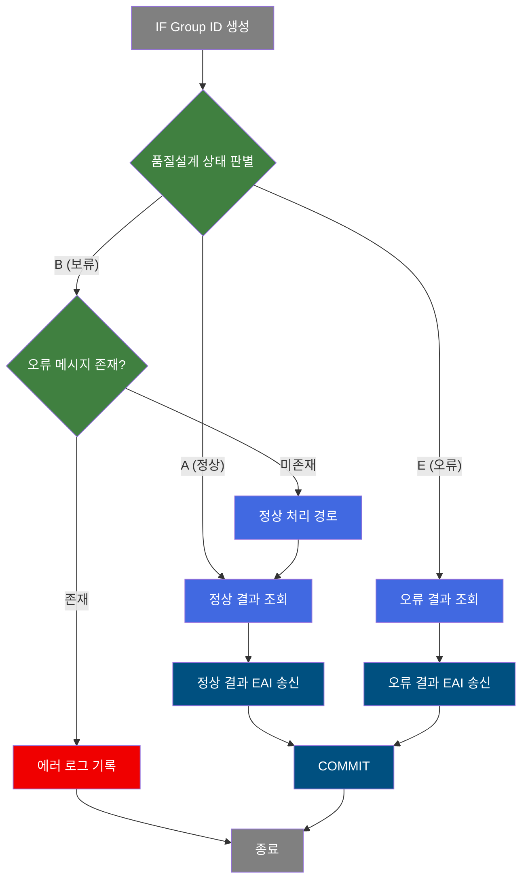
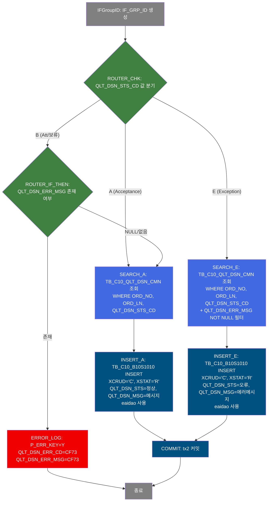
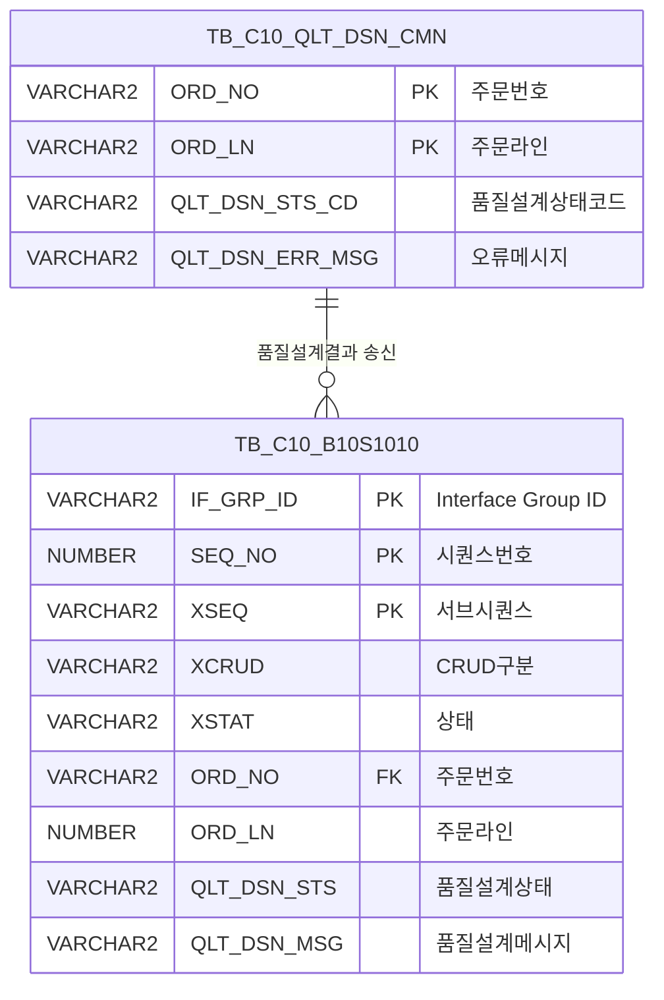

<h1 style="font-size: 40px; text-align: center; font-weight:
   bold; margin: 30px 0;">
  B10S1010 레거시 시스템 분석 종합 보고서
</h1>


# 1. 시스템 개요
- **서비스 ID**: B10S1010
- **업무명**: 품질설계 결과 ERP Interface 송신
- **분석 일시**: 2026-03-16 15:37 KST
- **전체 Activity 수**: 9개 (Built-in 6, Common 3)
- **분석자**: Claude Opus 4.6
- **분석 도구**: /analyze-service B10S1010
- **문서 버전**: 1.0

# 📊 비즈니스 프로세스 분석

## 시스템 목적

B10S1010은 MES 품질설계 결과를 ERP 시스템으로 Interface 송신하기 위한 배치(NUI) 서비스이다. 품질설계 상태코드(QLT_DSN_STS_CD)에 따라 정상(A: Acceptance), 오류(E: Exception), 보류(B: Att) 3가지 경로로 분기하여 처리한다.

정상 경로에서는 품질설계 공통 테이블(TB_C10_QLT_DSN_CMN)에서 주문정보를 조회한 후, EAI 송신 테이블(TB_C10_B10S1010)에 결과를 INSERT한다. 오류 경로에서는 오류 메시지가 존재하는 건만 필터링하여 동일 송신 테이블에 예외 정보를 INSERT한다. 보류 경로에서는 오류 메시지 존재 여부에 따라 추가 분기 처리된다.

## 핵심 워크플로우 다이어그램



### 상세 워크플로우 다이어그램



## 주요 유즈케이스

### UC-01: 정상 품질설계 결과 ERP 송신 (A)
- **Actor**: 배치 프로세스 (품질설계 서비스에서 호출)
- **목적**: 품질설계 정상 완료 건을 ERP로 Interface 송신하여 후속 생산 프로세스 진행 가능하게 함

- **전제조건**:
  - 품질설계 프로세스가 정상 완료되어 QLT_DSN_STS_CD = 'A'
  - TB_C10_QLT_DSN_CMN에 해당 주문 데이터 존재
  - EAI DB 연결(eaidao) 정상

- **주요 흐름**:
  1. IF Group ID 자동 생성 (PosIFGroupID)
  2. QLT_DSN_STS_CD = 'A' 확인 후 정상 경로 진입
  3. C102100CMN_AIF 쿼리로 TB_C10_QLT_DSN_CMN에서 주문번호, 주문라인, 상태코드 조회
  4. B10S1010A.insert로 TB_C10_B10S1010에 정상 결과 INSERT (XCRUD='C', XSTAT='R')
  5. tx2 트랜잭션 COMMIT

- **대체 흐름**:
  - 조회 결과 없음: INSERT 대상 데이터 없이 COMMIT 처리

- **후행조건**:
  - TB_C10_B10S1010에 정상 결과 레코드 생성
  - EAI를 통해 ERP로 데이터 전달 대기 상태

### UC-02: 오류 품질설계 결과 ERP 송신 (E)
- **Actor**: 배치 프로세스
- **목적**: 품질설계 오류 발생 건의 에러 정보를 ERP로 Interface 송신

- **전제조건**:
  - 품질설계 오류 발생하여 QLT_DSN_STS_CD = 'E'
  - 오류 메시지(QLT_DSN_ERR_MSG)가 NOT NULL

- **주요 흐름**:
  1. IF Group ID 자동 생성
  2. QLT_DSN_STS_CD = 'E' 확인 후 오류 경로 진입
  3. C102100CMN_EIF 쿼리로 TB_C10_QLT_DSN_CMN에서 조회 (서브쿼리로 오류메시지 NOT NULL 건만 필터)
  4. B10S1010E.insert로 TB_C10_B10S1010에 예외 결과 INSERT
  5. tx2 트랜잭션 COMMIT

- **대체 흐름**:
  - 오류 메시지가 NULL인 건: C102100CMN_EIF 서브쿼리에서 제외되어 송신 안 됨

- **후행조건**:
  - TB_C10_B10S1010에 오류 결과 레코드 생성
  - ERP에서 오류 건 확인 가능

### UC-03: 보류 상태 처리 (B)
- **Actor**: 배치 프로세스
- **목적**: 보류 상태의 품질설계 건을 오류 메시지 존재 여부에 따라 분기 처리

- **전제조건**:
  - 품질설계 상태가 QLT_DSN_STS_CD = 'B' (보류)

- **주요 흐름**:
  1. IF Group ID 자동 생성
  2. QLT_DSN_STS_CD = 'B' 확인 후 보류 경로 진입
  3. ROUTER_IF_THEN에서 QLT_DSN_ERR_MSG 값 확인
  4. 오류 메시지 없음(NULL) → 정상 경로(A)와 동일하게 처리
  5. 오류 메시지 존재 → ERROR_LOG로 에러코드 CF73 기록 후 종료

- **대체 흐름**:
  - 오류 메시지 존재 시: P_ERR_KEY='Y' 설정, QLT_DSN_ERR_CD/MSG='CF73' 기록

- **후행조건**:
  - 오류 미존재 시: 정상 결과로 ERP 송신
  - 오류 존재 시: 에러 로그 기록되고 상위 서비스에서 오류 감지 가능

---
## 비즈니스 로직 상세

### 1. 품질설계 상태 기반 라우팅 (ROUTER_CHK)

- **목적**: 품질설계 상태코드에 따라 3개 처리 경로로 분기
- **처리 케이스**:

  **[케이스 1: 정상 (A)]**
  ```
    조건: QLT_DSN_STS_CD = 'A'
    처리:
      1. TB_C10_QLT_DSN_CMN에서 주문정보 조회 (C102100CMN_AIF)
      2. TB_C10_B10S1010에 정상 결과 INSERT (B10S1010A.insert)
      3. EAI 트랜잭션(tx2) COMMIT
  ```

  **[케이스 2: 오류 (E)]**
  ```
    조건: QLT_DSN_STS_CD = 'E'
    처리:
      1. TB_C10_QLT_DSN_CMN에서 오류 건 조회 - 서브쿼리로 QLT_DSN_ERR_MSG NOT NULL 필터 (C102100CMN_EIF)
      2. TB_C10_B10S1010에 예외 결과 INSERT (B10S1010E.insert)
      3. EAI 트랜잭션(tx2) COMMIT
  ```

  **[케이스 3: 보류 (B)]**
  ```
    조건: QLT_DSN_STS_CD = 'B'
    처리:
      1. QLT_DSN_ERR_MSG 존재 여부 확인 (ROUTER_IF_THEN)
      2. NULL → 정상 경로(A)로 합류
      3. 존재 → 에러코드 CF73 기록 후 종료
  ```

### 2. EAI Interface 데이터 구성

- **목적**: ERP 연동을 위한 표준 Interface 레코드 생성
- **처리 케이스**:

  **[INSERT 시 고정값 설정]**
  ```
    XCRUD = 'C' (Create 모드)
    XSTAT = 'R' (Ready 상태)
    XSEQ = '1' (시퀀스 1)
    SEQ_NO = SQ_C10_B10S1010.NEXTVAL (시퀀스 자동 채번)
  ```

- **예외 처리**:
  - 보류 상태에서 오류 메시지 존재 시: P_ERR_KEY='Y', 에러코드 CF73 설정으로 상위 서비스에 오류 전파

---

# 💾 데이터 요구사항

## 핵심 테이블

### 1. TB_C10_B10S1010 - (품질설계 결과 EAI 송신 테이블)
| 컬럼명 | 타입 | PK | 설명 |
|--------|------|----|------|
| IF_GRP_ID | VARCHAR2 | ✅ | Interface Group ID |
| SEQ_NO | NUMBER | ✅ | 시퀀스번호 (SQ_C10_B10S1010.NEXTVAL) |
| XSEQ | VARCHAR2 | ✅ | 서브시퀀스 (고정값 '1') |
| XCRUD | VARCHAR2 | | CRUD 구분 ('C'=Create) |
| XSTAT | VARCHAR2 | | 상태 ('R'=Ready) |
| ORD_NO | VARCHAR2 | | 주문번호 (FK) |
| ORD_LN | NUMBER | | 주문라인 |
| QLT_DSN_STS | VARCHAR2 | | 품질설계 상태 |
| QLT_DSN_MSG | VARCHAR2 | | 품질설계 메시지 |

### 2. TB_C10_QLT_DSN_CMN - (품질설계 공통 테이블)
| 컬럼명 | 타입 | PK | 설명 |
|--------|------|----|------|
| ORD_NO | VARCHAR2 | ✅ | 주문번호 |
| ORD_LN | VARCHAR2 | ✅ | 주문라인 |
| QLT_DSN_STS_CD | VARCHAR2 | | 품질설계 상태코드 (A/E/B) |
| QLT_DSN_ERR_MSG | VARCHAR2 | | 품질설계 오류 메시지 |

## 데이터 플로우

### 1. 정상 결과 송신 (A)
```
품질설계 정상 완료
→ C102100CMN_AIF.select
  FROM TB_C10_QLT_DSN_CMN
  WHERE ORD_NO = :ORD_NO
    AND ORD_LN = :ORD_LN
    AND QLT_DSN_STS_CD = :QLT_DSN_STS_CD
→ 주문정보 조회 결과

→ B10S1010A.insert
  INTO TB_C10_B10S1010
  (IF_GRP_ID, SEQ_NO, XSEQ, XCRUD, XSTAT, ORD_NO, ORD_LN, QLT_DSN_STS, QLT_DSN_MSG)
→ EAI 송신 테이블에 정상 결과 INSERT
→ tx2 COMMIT
```

### 2. 오류 결과 송신 (E)
```
품질설계 오류 발생
→ C102100CMN_EIF.select
  FROM (SELECT ORD_NO, ORD_LN, QLT_DSN_STS_CD, :QLT_DSN_ERR_MSG AS QLT_DSN_ERR_MSG
        FROM TB_C10_QLT_DSN_CMN
        WHERE ORD_NO = :ORD_NO AND ORD_LN = :ORD_LN AND QLT_DSN_STS_CD = :QLT_DSN_STS_CD)
  WHERE QLT_DSN_ERR_MSG IS NOT NULL
→ 오류 메시지 존재 건만 필터링

→ B10S1010E.insert
  INTO TB_C10_B10S1010
  (IF_GRP_ID, SEQ_NO, XSEQ, XCRUD, XSTAT, ORD_NO, ORD_LN, QLT_DSN_STS, QLT_DSN_MSG)
→ EAI 송신 테이블에 오류 결과 INSERT
→ tx2 COMMIT
```

### 3. 보류 상태 분기 (B)
```
품질설계 보류 상태
→ ROUTER_IF_THEN: QLT_DSN_ERR_MSG 확인
  - NULL → 정상 경로(A)로 합류하여 송신
  - NOT NULL → ERROR_LOG: P_ERR_KEY='Y', ERR_CD='CF73' 설정 후 종료
```

## SQL 일람표
| SQL 이름 | 쿼리 ID | 타입 | 출처 | 테이블 |
|---------|---------|-----|-------|-------|
| 정상 결과 송신 INSERT | B10S1010A.insert | INSERT | Service | TB_C10_B10S1010 |
| 오류 결과 송신 INSERT | B10S1010E.insert | INSERT | Service | TB_C10_B10S1010 |
| 오류 건 필터 조회 | C102100CMN_EIF | SELECT | Service | TB_C10_QLT_DSN_CMN |
| 정상 건 조회 | C102100CMN_AIF | SELECT | Service | TB_C10_QLT_DSN_CMN |

## ER 다이어그램 (핵심 관계)



관계 설명:
- TB_C10_QLT_DSN_CMN이 원본 테이블로, 품질설계 결과의 소스 역할
- TB_C10_B10S1010은 EAI 송신용 테이블로, ORD_NO를 통해 원본 데이터 추적 가능
- 1:N 관계: 하나의 주문에 대해 여러 건의 Interface 송신 레코드 생성 가능 (시퀀스로 구분)

---

# ⚙️ Java 컴포넌트 분석

## Custom Activity 분석

### Custom Activity: 없음

본 서비스는 **Built-in Activity 6개**(`PosIFGroupID`, `PosDefaultRouter`, `FormSearch` x2, `FormSave` x2)와 **Common Activity 3개**(`DbSetParam`, `DbCommit`, `PosDefaultRouter`)만으로 구성되어 있으며, **Custom Activity는 존재하지 않습니다**.

모든 비즈니스 로직은 서비스 XML의 Activity 설정(라우팅 조건, SQL 쿼리, 트랜잭션 커밋)과 쿼리 파일(.glue_sql)의 SQL로 구현되어 있습니다.

---

# 📌 특이사항 및 주의사항

## 1. EAI 송신 테이블 사용 패턴
- **eaidao 사용**: INSERT 시 `eaidao` (EAIAPUSER 스키마) 사용, SELECT 시 `mesdao` (MESAPUSER 스키마) 사용
- 조회와 저장이 서로 다른 DB 스키마를 사용하므로, 트랜잭션 범위(tx2) 관리에 주의 필요
- XCRUD='C', XSTAT='R' 고정값은 EAI 프레임워크의 표준 Interface 프로토콜

## 2. 오류 메시지 필터링 패턴 (C102100CMN_EIF)
- 서브쿼리로 파라미터값(:QLT_DSN_ERR_MSG)을 AS 컬럼으로 주입한 후, 외부 쿼리에서 IS NOT NULL로 필터링하는 비표준적 패턴 사용
- 이는 파라미터 값 자체의 NULL 여부로 INSERT 실행 여부를 제어하는 방식

## 3. 보류(B) 상태의 이중 분기 처리
- QLT_DSN_STS_CD = 'B'인 경우 ROUTER_IF_THEN에서 QLT_DSN_ERR_MSG 존재 여부로 2차 분기
- 오류 메시지 없으면 정상(A) 경로로 합류하여 처리
- 오류 메시지 존재 시 에러코드 CF73 하드코딩으로 기록 — CF73 코드의 의미를 별도 관리 필요

## 4. 시퀀스 채번
- SQ_C10_B10S1010 시퀀스를 사용하여 SEQ_NO 자동 채번
- XSEQ는 항상 '1'로 고정되어 서브시퀀스 확장이 현재 사용되지 않음

---

# 📚 참고 문서

- **Query SQL**: `src/query/B10S1010A-query.glue_sql`, `src/query/B10S1010E-query.glue_sql`, `src/query/C102100CMN_AIF-query.glue_sql`, `src/query/C102100CMN_EIF-query.glue_sql`
- **Service XML**: `src/service/B10S1010-service.xml`
