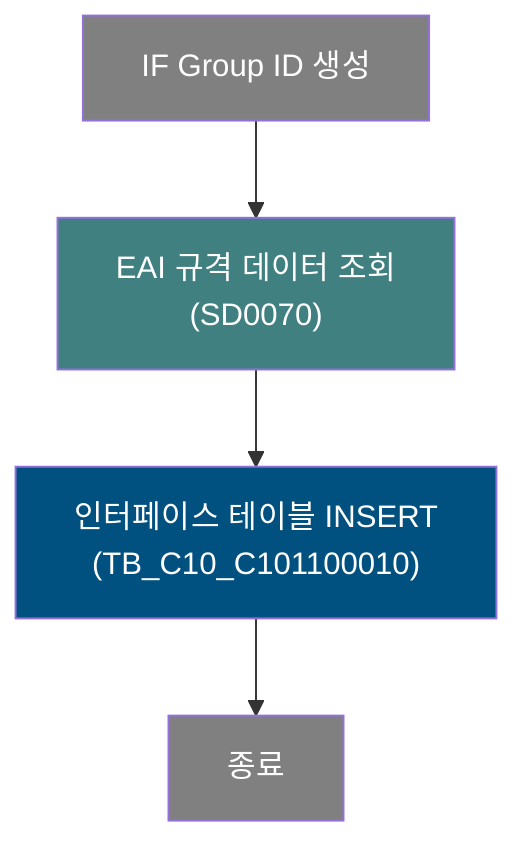
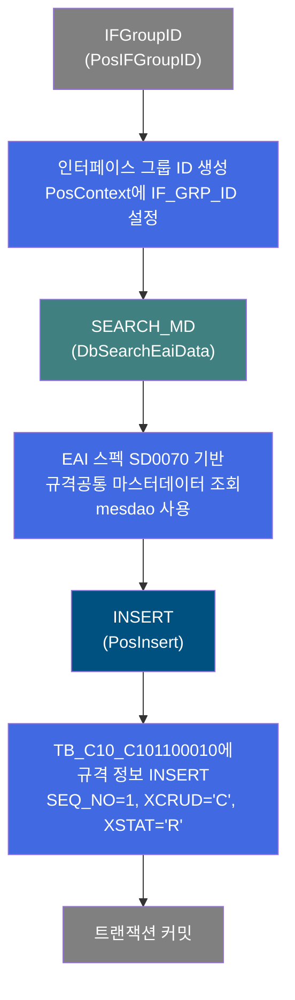
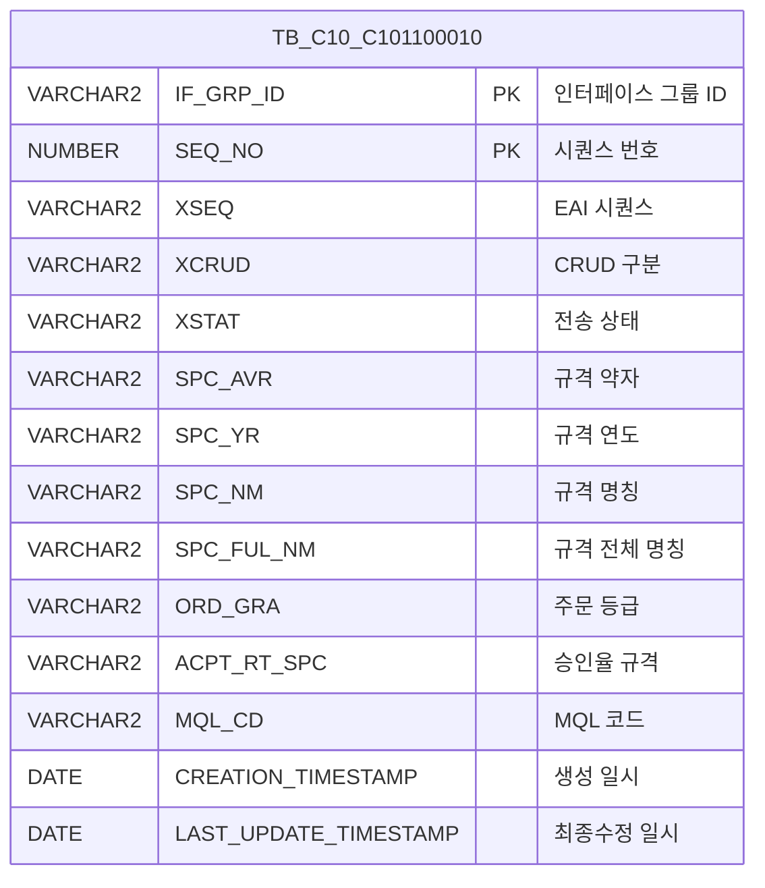

<h1 style="font-size: 40px; text-align: center; font-weight:
   bold; margin: 30px 0;">
  C101100010 레거시 시스템 분석 종합 보고서
</h1>


# 1. 시스템 개요
- **서비스 ID**: C101100010
- **업무명**: 규격공통 마스터데이터(MD) EAI 송신
- **분석 일시**: 2026-03-16 18:44 (KST)
- **분석 시간**: 약 1분 (재실행, Phase 1~4 캐시 히트)
- **전체 Activity 수**: 3개 (Built-in 2개, Custom 1개)
- **분석자**: Claude Opus 4.6
- **분석 도구**: /analyze-service C101100010
- **문서 버전**: 1.0

# 📊 비즈니스 프로세스 분석

## 시스템 목적

C101100010 서비스는 규격공통 마스터데이터(MD)를 EAI(Enterprise Application Integration) 인터페이스 테이블에 송신하기 위한 NUI(배치) 서비스입니다.

EAI 인터페이스 스펙 `SD0070`에 해당하는 규격 정보(규격약자, 규격연도, 규격명칭, 주문등급, 승인율규격, MQL코드 등)를 외부 시스템에서 조회한 후, MES 인터페이스 테이블 `TB_C10_C101100010`에 INSERT하여 EAI를 통한 데이터 연동을 수행합니다. 트랜잭션 커밋이 활성화되어 있어 INSERT 성공 시 자동 커밋됩니다.

## 핵심 워크플로우 다이어그램



### 상세 워크플로우 다이어그램



## 주요 유즈케이스

### UC-01: 규격공통 마스터데이터 EAI 송신
- **Actor**: 배치 스케줄러 / 시스템
- **목적**: 규격공통 정보를 EAI 인터페이스 테이블에 등록하여 외부 시스템과 데이터 연동

- **전제조건**:
  - EAI 인터페이스 스펙 SD0070이 정의되어 있음
  - mesdao (MESAPUSER 스키마) 접근 가능
  - 규격공통 마스터데이터 원본 데이터가 존재함

- **주요 흐름**:
  1. PosIFGroupID 액티비티에서 인터페이스 그룹 ID(IF_GRP_ID) 생성
  2. DbSearchEaiData 액티비티에서 EAI 스펙 SD0070 기반으로 규격공통 데이터 조회
  3. PosInsert 액티비티에서 조회된 데이터를 TB_C10_C101100010 테이블에 INSERT
  4. 트랜잭션 자동 커밋

- **대체 흐름**:
  - EAI 데이터 조회 실패: DbSearchEaiData에서 예외 발생 시 서비스 중단
  - INSERT 실패: 중복 키 또는 데이터 무결성 위반 시 트랜잭션 롤백

- **후행조건**:
  - TB_C10_C101100010 테이블에 규격공통 데이터가 등록됨
  - EAI를 통해 외부 시스템으로 데이터 전달 가능 상태

### UC-02: 규격 정보 초기 등록 (XCRUD='C')
- **Actor**: 배치 스케줄러 / 시스템
- **목적**: 신규 규격공통 정보를 생성(Create) 모드로 EAI 테이블에 등록

- **전제조건**:
  - 해당 IF_GRP_ID로 기존 데이터가 없음
  - 규격 약자(SPC_AVR), 규격 연도(SPC_YR), 규격 명칭(SPC_NM) 등 필수 항목이 존재

- **주요 흐름**:
  1. IF_GRP_ID 자동 생성
  2. SEQ_NO = 1, XSEQ = '1' 고정값 설정
  3. XCRUD = 'C' (Create), XSTAT = 'R' (Ready) 상태로 설정
  4. 규격 정보(SPC_AVR, SPC_YR, SPC_NM, SPC_FUL_NM, ORD_GRA, ACPT_RT_SPC, MQL_CD) INSERT
  5. 감사 정보(CREATED_*, LAST_UPDATED_*) 자동 기록

- **대체 흐름**:
  - 필수 파라미터 누락: INSERT 실패, 트랜잭션 롤백

- **후행조건**:
  - 인터페이스 테이블에 XSTAT='R' 상태의 레코드 생성
  - EAI 미들웨어가 해당 레코드를 픽업하여 외부 시스템으로 전송

### UC-03: EAI 데이터 재송신
- **Actor**: 배치 스케줄러 / 운영자
- **목적**: 규격공통 데이터 변경 시 EAI 테이블에 재등록하여 외부 시스템 동기화

- **전제조건**:
  - 규격공통 마스터데이터가 변경되었음
  - 배치 스케줄 또는 수동 트리거가 발생

- **주요 흐름**:
  1. 변경된 규격 데이터에 대해 새로운 IF_GRP_ID 생성
  2. DbSearchEaiData에서 최신 규격 데이터 조회
  3. 새로운 레코드로 TB_C10_C101100010에 INSERT
  4. 트랜잭션 커밋

- **대체 흐름**:
  - 동일 데이터 중복 송신: IF_GRP_ID가 유니크하므로 중복 INSERT 없음

- **후행조건**:
  - 최신 규격 정보가 EAI 테이블에 등록됨

---
## 비즈니스 로직 상세

### 1. EAI 인터페이스 데이터 조회 (DbSearchEaiData)

- **목적**: EAI 스펙 코드(SD0070)에 해당하는 규격공통 마스터데이터를 외부 데이터소스에서 조회하여 PosContext에 적재
- **처리 케이스**:

  **[케이스 1: 정상 조회]**
  ```
    조건: ifSpecKind = 'SD0070' (규격공통 EAI 스펙)
    처리:
      1. DbSearchEaiData 액티비티가 mesdao를 통해 EAI 데이터 조회
      2. 조회된 규격 정보를 PosContext에 설정
      3. 후속 INSERT 액티비티로 전이 (success → INSERT)
  ```

  **[케이스 2: 조회 실패]**
  ```
    조건: EAI 스펙에 해당하는 데이터 없음 또는 DB 연결 오류
    처리:
      1. 예외 발생
      2. 서비스 중단
  ```

- **참고**: DbSearchEaiData.java 소스 파일이 저장소에 존재하지 않아 내부 로직 상세 분석 불가

### 2. 인터페이스 테이블 INSERT 로직

- **목적**: 조회된 규격공통 데이터를 EAI 인터페이스 테이블에 저장
- **처리 케이스**:

  **[케이스 1: 정상 INSERT]**
  ```
    조건: 모든 필수 파라미터가 PosContext에 존재
    처리:
      1. IF_GRP_ID: PosIFGroupID에서 생성된 그룹 ID 사용
      2. SEQ_NO = 1 (고정값)
      3. XSEQ = '1' (고정값)
      4. XCRUD = 'C' (Create 모드 고정)
      5. XSTAT = 'R' (Ready 상태 고정)
      6. 규격 정보 12개 파라미터 바인딩
      7. 감사 컬럼 자동 설정 (isAudit=true)
      8. TB_C10_C101100010 테이블에 INSERT 실행
  ```

- **고정값 설정**:
  ```
  SEQ_NO = 1 (시퀀스 번호 고정)
  XSEQ = '1' (문자열 시퀀스 고정)
  XCRUD = 'C' (Create)
  XSTAT = 'R' (Ready)
  ```

- **감사 컬럼 자동 기록** (isAudit=true):
  ```
  CREATED_OBJECT_TYPE = :ObjectType
  CREATED_OBJECT_ID = :ObjectId
  CREATED_PROGRAM_ID = :ProgramId
  CREATION_TIMESTAMP = :Timestamp
  LAST_UPDATED_OBJECT_TYPE = :ObjectType (생성 시 동일값)
  LAST_UPDATED_OBJECT_ID = :ObjectId (생성 시 동일값)
  LAST_UPDATE_PROGRAM_ID = :ProgramId (생성 시 동일값)
  LAST_UPDATE_TIMESTAMP = :Timestamp (생성 시 동일값)
  ```

---

# ⚙️ Java 컴포넌트 분석

## Custom Activity 상세 분석

### 1개 Custom Activity 발견

### 1. DbSearchEaiData (SEARCH_MD)
- **클래스명**: com.unionsteel.mes.c10.activity.nui.DbSearchEaiData
- **액티비티명**: SEARCH_MD
- **파일 경로**: src/com/unionsteel/mes/c10/activity/nui/DbSearchEaiData.java (미존재)
- **주요 기능**: EAI 인터페이스 스펙(SD0070) 기반 규격공통 마스터데이터 조회

> ⚠️ **소스 파일 미존재**: 해당 Java 클래스의 소스 파일이 저장소에 존재하지 않습니다. service XML에서 참조만 확인되며, 상세 내부 로직 분석이 불가합니다. 컴파일된 클래스 파일이 별도 경로에 존재할 수 있습니다.

#### 서비스 XML 기반 확인 정보
- **EAI 스펙**: ifSpecKind = SD0070 (규격공통)
- **DAO**: mesdao (MESAPUSER 스키마)
- **전이**: success → INSERT

---

# 💾 데이터 요구사항

## 핵심 테이블

### 1. TB_C10_C101100010 - (규격공통 EAI 송신 인터페이스 테이블)
| 컬럼명 | 타입 | PK | 설명 |
|--------|------|----|-----|
| IF_GRP_ID | VARCHAR2 | ✅ | 인터페이스 그룹 ID (PK) |
| SEQ_NO | NUMBER | ✅ | 시퀀스 번호 (고정값 1) |
| XSEQ | VARCHAR2 | | EAI 시퀀스 (고정값 '1') |
| XCRUD | VARCHAR2 | | CRUD 구분 (고정값 'C' = Create) |
| XSTAT | VARCHAR2 | | 전송 상태 (고정값 'R' = Ready) |
| SPC_AVR | VARCHAR2 | | 규격 약자 |
| SPC_YR | VARCHAR2 | | 규격 연도 |
| SPC_NM | VARCHAR2 | | 규격 명칭 |
| SPC_FUL_NM | VARCHAR2 | | 규격 전체 명칭 |
| ORD_GRA | VARCHAR2 | | 주문 등급 |
| ACPT_RT_SPC | VARCHAR2 | | 승인율 규격 |
| MQL_CD | VARCHAR2 | | MQL 코드 |
| CREATED_OBJECT_TYPE | VARCHAR2 | | 생성 객체 유형 |
| CREATED_OBJECT_ID | VARCHAR2 | | 생성 객체 ID |
| CREATED_PROGRAM_ID | VARCHAR2 | | 생성 프로그램 ID |
| CREATION_TIMESTAMP | DATE | | 생성 일시 |
| LAST_UPDATED_OBJECT_TYPE | VARCHAR2 | | 최종수정 객체 유형 |
| LAST_UPDATED_OBJECT_ID | VARCHAR2 | | 최종수정 객체 ID |
| LAST_UPDATE_PROGRAM_ID | VARCHAR2 | | 최종수정 프로그램 ID |
| LAST_UPDATE_TIMESTAMP | DATE | | 최종수정 일시 |

## 데이터 플로우

### 1. EAI 규격공통 데이터 송신

```
[규격공통 마스터데이터 EAI 송신]
배치 스케줄 트리거
→ PosIFGroupID: IF_GRP_ID 자동 생성
→ DbSearchEaiData: EAI 스펙 SD0070 기반 규격 데이터 조회
  FROM 외부 데이터소스 (mesdao 경유)
  WHERE ifSpecKind = 'SD0070'
→ PosInsert: C101100010.insert
  INSERT INTO TB_C10_C101100010
  (IF_GRP_ID, SEQ_NO=1, XSEQ='1', XCRUD='C', XSTAT='R',
   SPC_AVR, SPC_YR, SPC_NM, SPC_FUL_NM, ORD_GRA,
   ACPT_RT_SPC, MQL_CD, 감사컬럼 8개)
→ 트랜잭션 커밋
→ EAI 미들웨어가 XSTAT='R' 레코드 픽업 후 외부 시스템 전송
```

## SQL 일람표

| SQL 이름 | 쿼리 ID | 타입 | 출처 | 테이블 |
|---------|---------|-----|-------|-------|
| 규격공통MD송신 INSERT | C101100010.insert | INSERT | Service | TB_C10_C101100010 |

## ER 다이어그램 (핵심 관계)



관계 설명:
- TB_C10_C101100010은 EAI 인터페이스 전용 독립 테이블로, 다른 테이블과의 FK 관계 없음
- IF_GRP_ID + SEQ_NO가 복합 PK로 각 송신 건을 식별
- EAI 미들웨어가 XSTAT 컬럼 상태값을 기준으로 미전송 레코드를 픽업

---

# 📌 특이사항 및 주의사항

## 1. 소스 파일 미존재 (DbSearchEaiData)
- **핵심 Custom Activity 소스 누락**: `com.unionsteel.mes.c10.activity.nui.DbSearchEaiData.java` 파일이 저장소에 존재하지 않습니다. service XML에서만 참조되며, 컴파일된 .class 파일이 별도 배포 경로에 있을 수 있습니다.
- **영향**: EAI 데이터 조회의 상세 로직(조회 쿼리, 데이터 변환, 에러 처리)을 분석할 수 없어, 현대화 시 해당 로직 재구현에 추가 조사가 필요합니다.

## 2. XCRUD/XSTAT 고정값 패턴
- **생성 전용 서비스**: XCRUD가 'C'(Create)로 고정되어 있어 이 서비스는 신규 데이터 등록만 수행합니다. 수정(U), 삭제(D) 시에는 별도 서비스가 존재할 가능성이 높습니다.
- **XSTAT='R' 의미**: Ready 상태로 INSERT되며, EAI 미들웨어가 이 상태의 레코드를 픽업하여 처리 후 상태를 변경하는 패턴입니다.

## 3. SEQ_NO 고정값 (=1) 제약
- **단일 레코드 송신**: SEQ_NO가 1로 고정되어 하나의 IF_GRP_ID당 1건의 규격 정보만 등록 가능합니다. 복수 규격을 한 번에 송신하려면 별도 IF_GRP_ID를 생성해야 합니다.

## 4. EAI 인터페이스 스펙 의존성
- **SD0070 스펙**: DbSearchEaiData의 ifSpecKind 속성이 'SD0070'으로 하드코딩되어 있어, 이 서비스는 규격공통 데이터 전용입니다. 다른 EAI 스펙에는 별도 서비스(C10110002x 등)가 필요합니다.

## 5. 감사 컬럼 이중 설정
- **생성/수정 감사 동일값**: INSERT 시 CREATED_* 컬럼과 LAST_UPDATED_* 컬럼에 동일한 값(ObjectType, ObjectId, ProgramId, Timestamp)이 설정됩니다. 이는 신규 생성 시 표준 패턴이나, isAudit=true에 의해 프레임워크가 자동으로 처리합니다.

---

# 📚 참고 문서

- **Service XML**: `src/service/C101100010-service.xml`
- **Query SQL**: `src/query/C101100010-query.glue_sql`
- **Custom Java 클래스**:
  - `src/com/unionsteel/mes/c10/activity/nui/DbSearchEaiData.java` (미존재)
