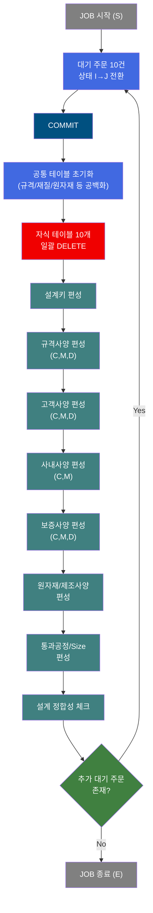

<h1 style="font-size: 40px; text-align: center; font-weight:
   bold; margin: 30px 0;">
  C102100000 레거시 시스템 분석 종합 보고서
</h1>


# 1. 시스템 개요
- **서비스 ID**: C102100000
- **업무명**: 품질설계 배치 메인 오케스트레이터
- **분석 일시**: 2026-03-16 19:35 KST
- **분석 시간**: 약 10분 (서브서비스 재귀 분석 제외)
- **전체 Activity 수**: 33개 (Custom 1, Built-in 31, Common 1)
- **분석자**: Claude Opus 4.6
- **분석 도구**: /analyze-service C102100000
- **문서 버전**: 1.0

# 📊 비즈니스 프로세스 분석

## 시스템 목적

C102100000 서비스는 **품질설계 배치 처리의 최상위 오케스트레이터**로, 주문 접수 시 품질설계 작업을 자동 수행하는 NUI(배치) 서비스이다. 품질설계 의뢰 상태('I')인 주문을 10건 단위로 가져와, 기존 설계 데이터를 전면 삭제(10개 자식 테이블)한 후, 18개 서브서비스를 순차 호출하여 설계키 → 규격사양 → 고객사양 → 사내사양 → 보증사양 → 원자재 → 제조사양 → 도금량 → CCL제조 → 통과공정 → Size → 정합성체크까지 전체 품질설계를 재생성한다.

서비스는 **외부 루프 구조**를 가진다. JOB 상태를 'S'(시작)로 설정한 후, 10건씩 상태를 'I'→'J'(진행중)로 전환하고 설계를 수행한다. 완료 후 `DbCheckCnt`(품질설계의뢰조회)가 추가 'I' 상태 주문 존재 여부를 확인하여, 존재하면 다시 상태 전환 → DELETE → 설계 서브서비스 체인을 반복한다. 모든 주문 처리 완료 시 JOB 상태를 'E'(종료)로 설정하고 끝난다.

핵심적으로 이 서비스는 **"전면 삭제 후 재생성(Delete-then-Recreate)" 패턴**을 사용한다. 기존 설계 데이터를 수정하는 것이 아니라, 모든 자식 테이블 데이터를 삭제하고 처음부터 다시 편성함으로써 데이터 정합성을 보장한다.

## 핵심 워크플로우 다이어그램



### 상세 워크플로우 다이어그램

```mermaid
flowchart TD
    subgraph Phase1["Phase 1: JOB 관리 및 상태 전환"]
        A["JOB시작 UPDATE<br/>C10_QLT_JOB.Supdate<br/>JOB_STS='S', STR_DH=SYSDATE"]:::proc
        B["상태UPDATE<br/>C102100000.LmtJmodify<br/>상위 10건 I→J 전환"]:::proc
        C["COMMIT<br/>DbSetCommit (tx1)"]:::save
    end

    subgraph Phase2["Phase 2: 기존 데이터 전면 삭제"]
        D["공통 UPDATE<br/>규격/재질/원자재 공백화"]:::proc
        E1["CHM DELETE<br/>성분"]:::error
        E2["MQL DELETE<br/>재질"]:::error
        E3["DLV DELETE<br/>인수도"]:::error
        E4["MNF DELETE<br/>제조사양"]:::error
        E5["RMT DELETE<br/>원자재"]:::error
        E6["CCL_BOM DELETE"]:::error
        E7["PROC DELETE<br/>통과공정"]:::error
        E8["MSG DELETE<br/>메시지"]:::error
        E9["MSG1 DELETE<br/>메시지1"]:::error
        E10["ERR DELETE<br/>에러"]:::error
    end

    subgraph Phase3["Phase 3: 사양 편성 (규격/고객/사내/보증)"]
        F["설계Key<br/>C102100020"]:::proc_call
        G["규격사양(C,M,D)<br/>C102100070"]:::proc_call
        H["고객사양(C,M,D)<br/>C102100030"]:::proc_call
        I["사내사양(C,M)<br/>C102100110"]:::proc_call
        J1["보증사양(C)<br/>C102100130"]:::proc_call
        J2["보증사양(M)<br/>C102100140"]:::proc_call
        J3["보증사양(D)<br/>C102100150"]:::proc_call
    end

    subgraph Phase4["Phase 4: 제조/공정 편성"]
        K1["원자재Insert<br/>C103100010"]:::proc_call
        K2["제조사양<br/>C103100020"]:::proc_call
        K3["도금량(MQL,MNF)<br/>C103100040"]:::proc_call
        K4["CGL수지/TM조도<br/>C103100050"]:::proc_call
        K5["CCL제조사양<br/>C102100160"]:::proc_call
        K6["통과공정<br/>C103100030"]:::proc_call
        K7["두께/소둔<br/>C103100070"]:::proc_call
        K8["폭<br/>C103100080"]:::proc_call
        K9["공정별Size<br/>C103100090"]:::proc_call
        K10["원자재Size<br/>C103100100"]:::proc_call
    end

    subgraph Phase5["Phase 5: 검증 및 반복"]
        L["설계정합성체크<br/>C103100130"]:::proc_call
        M["품질설계의뢰조회<br/>DbCheckCnt<br/>C102100000.Iselect"]:::decision
    end

    A --> B --> C
    C --> D --> E1 --> E2 --> E3 --> E4 --> E5 --> E6 --> E7 --> E8 --> E9 --> E10
    E10 --> F --> G --> H --> I --> J1 --> J2 --> J3
    J3 --> K1 --> K2 --> K3 --> K4 --> K5 --> K6 --> K7 --> K8 --> K9 --> K10
    K10 --> L --> M
    M -->|"true (추가 주문 있음)"| B
    M -->|"false (완료)"| N["JOB종료 UPDATE<br/>JOB_STS='E', END_DH=SYSDATE"]:::save
    N --> O["종료"]:::start

    classDef start fill:#808080,color:#fff
    classDef proc fill:#4169E1,color:#fff
    classDef proc_call fill:#408080,color:#fff
    classDef decision fill:#408040,color:#fff
    classDef save fill:#005080,color:#fff
    classDef error fill:#F00000,color:#fff
```



## 주요 유즈케이스

### UC-01: 품질설계 배치 실행
- **Actor**: 품질설계 배치 스케줄러 (NUI)
- **목적**: 주문 접수 후 품질설계 의뢰 상태인 주문에 대해 규격/고객/사내/보증 4가지 사양유형의 성분/재질/인수도를 자동 편성하고, 제조사양/통과공정/Size까지 일괄 생성

- **전제조건**:
  - TB_C10_QLT_DSN_CMN에 QLT_DSN_STS_CD='I'(초기) 상태 주문이 존재
  - TB_C10_QLT_DSN_JOB 레코드가 존재

- **주요 흐름**:
  1. JOB 상태를 'S'(시작)로 UPDATE, 시작일시 기록
  2. 상태 'I'인 주문 중 10건을 'J'(진행중)로 전환 (LmtJmodify)
  3. COMMIT으로 상태 전환 확정
  4. 공통 테이블(CMN)의 규격/재질/원자재 필드를 공백으로 초기화 (AUPDATE)
  5. 10개 자식 테이블 일괄 DELETE (CHM, MQL, DLV, MNF, RMT, CCL_BOM, PROC, MSG, MSG1, ERR)
  6. 18개 서브서비스 순차 호출로 품질설계 재생성
  7. 설계정합성체크(C103100130) 수행
  8. DbCheckCnt로 추가 'I' 상태 주문 확인
  9. 추가 주문 있으면 Step 2부터 반복, 없으면 JOB 종료

- **대체 흐름**:
  - 'I' 상태 주문이 10건 미만: 있는 만큼만 처리
  - 개별 서브서비스 에러: 각 서브서비스 내부에서 에러 등록 후 다음 서브서비스 계속 진행
  - DbCheckCnt false: 추가 주문 없음 → JOB 종료

- **후행조건**:
  - 모든 처리 주문의 품질설계 데이터 생성 완료
  - JOB_STS='E', END_DH 기록

### UC-02: 기존 설계 데이터 초기화 (Delete-then-Recreate)
- **Actor**: 품질설계 배치 시스템
- **목적**: 품질설계 재실행 시 기존 데이터를 완전 삭제하여 데이터 정합성 보장

- **전제조건**:
  - QLT_DSN_STS_CD='J' 상태 주문이 존재 (상태 전환 완료)

- **주요 흐름**:
  1. CMN 테이블의 규격명(SPC_NM), 재질코드(MQL_CD), 원자재코드(RMTL_CD) 등 공백화
  2. 성분(CHM) → 재질(MQL) → 인수도(DLV) → 제조사양(MNF) → 원자재(RMT) 순서로 DELETE
  3. CCL_BOM → 통과공정(PROC) → 메시지(MSG, MSG1) → 에러(ERR) DELETE
  4. 총 10개 자식 테이블의 모든 'J' 상태 주문 데이터 삭제

- **대체 흐름**:
  - 자식 테이블에 데이터 없음: DELETE 0건 처리 (오류 아님)

- **후행조건**:
  - CMN 테이블의 설계 관련 필드 초기화
  - 10개 자식 테이블에서 해당 주문 데이터 완전 삭제

### UC-03: 10건 단위 배치 처리
- **Actor**: 품질설계 배치 시스템
- **목적**: 대량 주문 처리 시 10건씩 나누어 처리함으로써 트랜잭션 부하 분산

- **전제조건**:
  - 'I' 상태 주문이 10건 이상 존재

- **주요 흐름**:
  1. LmtJmodify: ROWID 기반으로 상위 10건만 선택하여 상태 전환
  2. COMMIT으로 10건 상태 전환 확정 (다른 배치와의 동시 접근 방지)
  3. 10건에 대한 DELETE + 설계 수행
  4. 설계정합성체크 후 DbCheckCnt로 추가 'I' 주문 확인
  5. 있으면 다음 10건 처리 반복

- **대체 흐름**:
  - 10건 미만 남음: 남은 건수만큼 처리 후 종료

- **후행조건**:
  - 모든 'I' 상태 주문이 처리됨 (최종적으로 'I' 잔여 없음)

---
## 비즈니스 로직 상세

### 1. 10건 배치 상태 전환 로직 (C102100000.LmtJmodify)

- **목적**: 대기 주문('I')을 10건 단위로 진행('J')으로 전환하여 동시 처리 충돌 방지
- **처리 케이스**:

  **[케이스: ROWID 기반 10건 선택]**
  ```
    조건: QLT_DSN_STS_CD = 'I' (초기 상태)
    처리:
      1. TB_C10_QLT_DSN_CMN에서 QLT_DSN_STS_CD='I'인 행의 ROWID를 정렬순 상위 10건 선택
      2. UPDATE TB_C10_QLT_DSN_CMN SET QLT_DSN_STS_CD = 'J' WHERE ROWID IN (선택된 10건)
      3. 감사 컬럼(LAST_UPDATED_*) 동시 기록
      4. COMMIT으로 상태 전환 확정
  ```

- **예외 처리**:
  - 동시 배치 실행 시 동일 행 선택 가능성 → COMMIT 후 DELETE/INSERT 단계에서 자연스럽게 처리

### 2. 전면 삭제 패턴 (Delete-then-Recreate)

- **목적**: 기존 설계 데이터의 부분 수정 대신 완전 삭제 후 재생성으로 데이터 정합성 보장
- **삭제 순서 및 대상 테이블**:

  ```
  DELETE 순서 (10개 자식 테이블):
    1. TB_C10_QLT_DSN_CHM  (성분사양)
    2. TB_C10_QLT_DSN_MQL  (재질사양)
    3. TB_C10_QLT_DSN_DLV  (인수도사양)
    4. TB_C10_QLT_DSN_MNF  (제조사양)
    5. TB_C10_QLT_DSN_RMT  (원자재)
    6. TB_C10_QLT_DSN_CCL_BOM (CCL BOM)
    7. TB_C10_QLT_DSN_PROC (통과공정)
    8. TB_C10_QLT_DSN_MSG  (메시지)
    9. TB_C10_QLT_DSN_MSG1 (메시지1)
   10. TB_C10_QLT_DSN_ERR  (에러)

  DELETE 패턴 (공통):
    DELETE FROM [자식테이블] A
    WHERE EXISTS (
      SELECT 1 FROM TB_C10_QLT_DSN_CMN B
      WHERE A.ORD_NO = B.ORD_NO AND A.ORD_LN = B.ORD_LN
      AND B.QLT_DSN_STS_CD = 'J'
    )
  ```

### 3. 외부 루프 제어 (DbCheckCnt)

- **목적**: 10건 배치 처리 후 추가 대기 주문 존재 여부를 확인하여 루프 반복 결정
- **처리 케이스**:

  **[케이스: 추가 주문 존재 (true)]**
  ```
    조건: C102100000.Iselect 실행 결과 1건 이상 존재
    처리: true 전이 → 상태UPDATE(LmtJmodify)로 돌아가 다음 10건 처리
  ```

  **[케이스: 추가 주문 없음 (false)]**
  ```
    조건: C102100000.Iselect 실행 결과 0건
    처리: false 전이 → JOB종료 UPDATE → 서비스 종료
  ```

### 4. 서브서비스 호출 체인 (18개)

- **목적**: 설계키부터 정합성체크까지 전체 품질설계를 순차적으로 수행
- **호출 순서**:

  ```
  사양 편성 그룹:
    C102100020 (설계키) → C102100070 (규격사양 C,M,D) → C102100030 (고객사양 C,M,D)
    → C102100110 (사내사양 C,M) → C102100130 (보증사양 C) → C102100140 (보증사양 M)
    → C102100150 (보증사양 D)

  제조/공정 편성 그룹:
    C103100010 (원자재 Insert) → C103100020 (제조사양) → C103100040 (도금량)
    → C103100050 (CGL수지/TM조도) → C102100160 (CCL제조사양) → C103100030 (통과공정)
    → C103100070 (두께/소둔) → C103100080 (폭) → C103100090 (공정별Size)
    → C103100100 (원자재Size)

  검증:
    C103100130 (설계정합성체크)
  ```

- **트랜잭션 관리**: 모든 서브서비스는 `new-transaction="false"`로 동일 트랜잭션에서 실행

---

# ⚙️ Java 컴포넌트 분석

## Custom Activity 상세 분석

### 1개 Custom Activity 발견

### 1. DbCheckCnt (품질설계의뢰조회)
- **클래스명**: com.unionsteel.mes.c10.activity.nui.DbCheckCnt
- **액티비티명**: 품질설계의뢰조회
- **파일 경로**: src/com/unionsteel/mes/c10/activity/nui/DbCheckCnt.java
- **주요 기능**: SQL 조회 결과 건수에 따라 true/false 전이를 반환하는 범용 카운트 조회 Activity

#### 메소드 구조
- **주요 메소드**: runActivity
  - **반환 타입**: String ("true" = 데이터 존재 / "false" = 데이터 없음)
  - **파라미터**: PosContext ctx

#### 핵심 비즈니스 로직
- **범용 카운트 조회**: Service XML의 sqlkey, param-count, dao 속성을 동적으로 읽어 조회 수행
- **본 서비스에서의 역할**: C102100000.Iselect를 실행하여 QLT_DSN_STS_CD='I' 상태 주문 존재 여부 확인
- **루프 제어**: true → 다음 배치 10건 처리 반복, false → JOB 종료

#### Java 상수 및 의존성
- **주요 상수**: C10NuiConstantsIF
- **핵심 의존성**: PosActivity, mesdao

---

# 💾 데이터 요구사항

## 핵심 테이블

### 1. TB_C10_QLT_DSN_CMN - 품질설계 공통 (중심 테이블)
| 컬럼명 | 타입 | PK | 설명 |
|--------|------|----|-----|
| ORD_NO | VARCHAR2 | ✅ | 주문번호 |
| ORD_LN | VARCHAR2 | ✅ | 주문행번 |
| QLT_DSN_STS_CD | VARCHAR2 | | 품질설계상태코드 (I=초기, J=진행, C=완료) |
| SPC_NM | VARCHAR2 | | 규격명 |
| MQL_CD | VARCHAR2 | | 재질코드 |
| RMTL_CD | VARCHAR2 | | 원자재코드 |
| RMTL_GRD | VARCHAR2 | | 원자재등급 |
| QLT_DSN_ERR_YN | VARCHAR2 | | 품질설계에러여부 |

### 2. TB_C10_QLT_DSN_JOB - 품질설계 JOB 상태
| 컬럼명 | 타입 | PK | 설명 |
|--------|------|----|-----|
| JOB_STS | VARCHAR2 | | JOB 상태 (S=시작, E=종료) |
| STR_DH | DATE | | 시작 일시 |
| END_DH | DATE | | 종료 일시 |

### 3. 자식 테이블 (DELETE 대상 10개)
| 테이블명 | 약칭 | 용도 |
|----------|------|------|
| TB_C10_QLT_DSN_CHM | CHM | 성분사양 (화학원소 상하한) |
| TB_C10_QLT_DSN_MQL | MQL | 재질사양 (기계적 성질 상하한) |
| TB_C10_QLT_DSN_DLV | DLV | 인수도사양 (치수공차, 형상규격) |
| TB_C10_QLT_DSN_MNF | MNF | 제조사양 |
| TB_C10_QLT_DSN_RMT | RMT | 원자재 |
| TB_C10_QLT_DSN_CCL_BOM | CCL_BOM | CCL BOM |
| TB_C10_QLT_DSN_PROC | PROC | 통과공정 |
| TB_C10_QLT_DSN_MSG | MSG | 메시지 |
| TB_C10_QLT_DSN_MSG1 | MSG1 | 메시지1 |
| TB_C10_QLT_DSN_ERR | ERR | 에러 |

## 데이터 플로우

### 1. JOB 시작

```
[JOB 상태 시작]
JOB시작 UPDATE
→ C10_QLT_JOB.Supdate
  UPDATE TB_C10_QLT_DSN_JOB
  SET JOB_STS = 'S', STR_DH = SYSDATE, END_DH = NULL
```

### 2. 상태 전환 (10건 배치)

```
[대기 주문 10건 상태 전환]
상태UPDATE
→ C102100000.LmtJmodify
  UPDATE TB_C10_QLT_DSN_CMN AA
  SET QLT_DSN_STS_CD = 'J'
  WHERE ROWID IN (
    SELECT ROWID FROM TB_C10_QLT_DSN_CMN BB
    WHERE BB.QLT_DSN_STS_CD = 'I'
    ORDER BY ... FETCH FIRST 10 ROWS ONLY
  )
→ COMMIT (tx1)
```

### 3. 기존 데이터 초기화

```
[공통 필드 초기화]
품질설계 공통 UPDATE
→ C102100000.AUPDATE
  UPDATE TB_C10_QLT_DSN_CMN
  SET SPC_NM = ' ', MQL_CD = ' ', RMTL_CD = ' ', ...
  WHERE QLT_DSN_STS_CD = 'J'

[자식 테이블 일괄 DELETE]
→ CHM_ADELETE → MQL_ADELETE → DLV_ADELETE → MNF_ADELETE
→ RMT_ADELETE → CCL_BOM_ADELETE → PROC_ADELETE
→ MSG_ADELETE → MSG1_ADELETE → ERR_ADELETE
  각각: DELETE FROM [테이블] A WHERE EXISTS (
    SELECT 1 FROM TB_C10_QLT_DSN_CMN B
    WHERE A.ORD_NO = B.ORD_NO AND A.ORD_LN = B.ORD_LN
    AND B.QLT_DSN_STS_CD = 'J')
```

### 4. 서브서비스 체인 (18개 순차 호출)

```
[사양 편성]
설계Key(C102100020) → 규격사양(C102100070) → 고객사양(C102100030)
→ 사내사양(C102100110) → 보증사양C(C102100130) → 보증사양M(C102100140)
→ 보증사양D(C102100150)

[제조/공정 편성]
원자재(C103100010) → 제조사양(C103100020) → 도금량(C103100040)
→ CGL수지/TM조도(C103100050) → CCL제조사양(C102100160)
→ 통과공정(C103100030) → 두께/소둔(C103100070) → 폭(C103100080)
→ 공정별Size(C103100090) → 원자재Size(C103100100)

[검증]
설계정합성체크(C103100130)
```

### 5. 루프 확인 및 JOB 종료

```
[추가 주문 확인]
품질설계의뢰조회 (DbCheckCnt)
→ C102100000.Iselect
  SELECT ORD_NO, ORD_LN FROM TB_C10_QLT_DSN_CMN
  WHERE QLT_DSN_STS_CD = 'I'
→ true: 상태UPDATE로 루프 반복
→ false: JOB종료 UPDATE

[JOB 종료]
→ C10_QLT_JOB.Eupdate
  UPDATE TB_C10_QLT_DSN_JOB
  SET JOB_STS = 'E', END_DH = SYSDATE
```

## SQL 일람표

| SQL 이름 | 쿼리 ID | 타입 | 출처 | 테이블 |
|---------|---------|-----|-------|-------|
| JOB 시작 | C10_QLT_JOB.Supdate | UPDATE | Service | TB_C10_QLT_DSN_JOB |
| 상태 전환 (10건) | C102100000.LmtJmodify | UPDATE | Service | TB_C10_QLT_DSN_CMN |
| 공통 필드 초기화 | C102100000.AUPDATE | UPDATE | Service | TB_C10_QLT_DSN_CMN |
| 성분 DELETE | C102100000.CHM_ADELETE | DELETE | Service | TB_C10_QLT_DSN_CHM |
| 재질 DELETE | C102100000.MQL_ADELETE | DELETE | Service | TB_C10_QLT_DSN_MQL |
| 인수도 DELETE | C102100000.DLV_ADELETE | DELETE | Service | TB_C10_QLT_DSN_DLV |
| 제조사양 DELETE | C102100000.MNF_ADELETE | DELETE | Service | TB_C10_QLT_DSN_MNF |
| 원자재 DELETE | C102100000.RMT_ADELETE | DELETE | Service | TB_C10_QLT_DSN_RMT |
| CCL BOM DELETE | C102100000.CCL_BOM_ADELETE | DELETE | Service | TB_C10_QLT_DSN_CCL_BOM |
| 통과공정 DELETE | C102100000.PROC_ADELETE | DELETE | Service | TB_C10_QLT_DSN_PROC |
| 메시지 DELETE | C102100000.MSG_ADELETE | DELETE | Service | TB_C10_QLT_DSN_MSG |
| 메시지1 DELETE | C102100000.MSG1_ADELETE | DELETE | Service | TB_C10_QLT_DSN_MSG1 |
| 에러 DELETE | C102100000.ERR_ADELETE | DELETE | Service | TB_C10_QLT_DSN_ERR |
| 대기 주문 조회 | C102100000.Iselect | SELECT | Service | TB_C10_QLT_DSN_CMN |
| JOB 종료 | C10_QLT_JOB.Eupdate | UPDATE | Service | TB_C10_QLT_DSN_JOB |

## ER 다이어그램 (핵심 관계)

```mermaid
erDiagram
    TB_C10_QLT_DSN_CMN ||--o{ TB_C10_QLT_DSN_CHM : "ORD_NO+ORD_LN"
    TB_C10_QLT_DSN_CMN ||--o{ TB_C10_QLT_DSN_MQL : "ORD_NO+ORD_LN"
    TB_C10_QLT_DSN_CMN ||--o{ TB_C10_QLT_DSN_DLV : "ORD_NO+ORD_LN"
    TB_C10_QLT_DSN_CMN ||--o{ TB_C10_QLT_DSN_MNF : "ORD_NO+ORD_LN"
    TB_C10_QLT_DSN_CMN ||--o{ TB_C10_QLT_DSN_RMT : "ORD_NO+ORD_LN"
    TB_C10_QLT_DSN_CMN ||--o{ TB_C10_QLT_DSN_CCL_BOM : "ORD_NO+ORD_LN"
    TB_C10_QLT_DSN_CMN ||--o{ TB_C10_QLT_DSN_PROC : "ORD_NO+ORD_LN"
    TB_C10_QLT_DSN_CMN ||--o{ TB_C10_QLT_DSN_MSG : "ORD_NO+ORD_LN"
    TB_C10_QLT_DSN_CMN ||--o{ TB_C10_QLT_DSN_MSG1 : "ORD_NO+ORD_LN"
    TB_C10_QLT_DSN_CMN ||--o{ TB_C10_QLT_DSN_ERR : "ORD_NO+ORD_LN"
    TB_C10_QLT_DSN_CMN {
        VARCHAR2 ORD_NO PK "주문번호"
        VARCHAR2 ORD_LN PK "주문행번"
        VARCHAR2 QLT_DSN_STS_CD "상태코드 I/J/C"
        VARCHAR2 SPC_NM "규격명"
        VARCHAR2 MQL_CD "재질코드"
        VARCHAR2 RMTL_CD "원자재코드"
    }
    TB_C10_QLT_DSN_JOB {
        VARCHAR2 JOB_STS "JOB 상태 S/E"
        DATE STR_DH "시작일시"
        DATE END_DH "종료일시"
    }
    TB_C10_QLT_DSN_CHM {
        VARCHAR2 ORD_NO PK "주문번호"
        VARCHAR2 ORD_LN PK "주문행번"
        VARCHAR2 QLT_DSN_SPC_TP PK "사양유형"
    }
    TB_C10_QLT_DSN_MQL {
        VARCHAR2 ORD_NO PK "주문번호"
        VARCHAR2 ORD_LN PK "주문행번"
        VARCHAR2 QLT_DSN_SPC_TP PK "사양유형"
    }
    TB_C10_QLT_DSN_ERR {
        VARCHAR2 ORD_NO PK "주문번호"
        VARCHAR2 ORD_LN PK "주문행번"
        VARCHAR2 QLT_DSN_ERR_CD PK "에러코드"
    }
```



관계 설명:
- TB_C10_QLT_DSN_CMN이 중심 허브 테이블, 10개 자식 테이블과 ORD_NO+ORD_LN으로 1:N 관계
- TB_C10_QLT_DSN_JOB은 배치 JOB 상태를 관리하는 독립 테이블
- 자식 테이블들은 품질설계 재실행 시 전면 삭제 후 재생성됨

---

# 🔗 서브서비스

## 서브서비스 요약

| 서비스 ID | 설명 | 호출 액티비티 | 트랜잭션 | 상세 분석 |
|-----------|------|-------------|---------|----------|
| C102100020 | 설계키 편성 | 설계Key(C102100020) | 동일 트랜잭션 | [상세 분석](./C102100020_legacy_analysis.md) |
| C102100070 | 규격사양(C,M,D) 편성 | 규격사양(C,M,D)(C102100070) | 동일 트랜잭션 | [상세 분석](./C102100070_legacy_analysis.md) |
| C102100030 | 고객사양(C,M,D) 품질설계 | 고객사양(C,M,D)(C102100030) | 동일 트랜잭션 | [상세 분석](./C102100030_legacy_analysis.md) |
| C102100110 | 사내사양(C,M) 성분+재질 편성 | 사내사양(C,M)(C102100110) | 동일 트랜잭션 | [상세 분석](./C102100110_legacy_analysis.md) |
| C102100130 | 보증사양(C) 성분 편성 | 보증사양(C)(C102100130) | 동일 트랜잭션 | [상세 분석](./C102100130_legacy_analysis.md) |
| C102100140 | 보증사양(M) 재질 편성 | 보증사양(M)(C102100140) | 동일 트랜잭션 | [상세 분석](./C102100140_legacy_analysis.md) |
| C102100150 | 보증사양(D) 인수도 편성 | 보증사양(D)(C102100150) | 동일 트랜잭션 | [상세 분석](./C102100150_legacy_analysis.md) |
| C103100010 | 원자재 Insert | 원자재Insert(C103100010) | 동일 트랜잭션 | 미분석 |
| C103100020 | 제조사양 | 제조사양(C103100020) | 동일 트랜잭션 | 미분석 |
| C103100040 | 도금량(MQL,MNF) | 도금량(MQL,MNF)(C103100040) | 동일 트랜잭션 | [상세 분석](./C103100040_legacy_analysis.md) |
| C103100050 | CGL수지/TM조도 | CGL수지/TM조도(C103100050) | 동일 트랜잭션 | [상세 분석](./C103100050_legacy_analysis.md) |
| C102100160 | CCL제조사양 | CCL제조사양(C102100160) | 동일 트랜잭션 | [상세 분석](./C102100160_legacy_analysis.md) |
| C103100030 | 통과공정 | 통과공정(C103100030) | 동일 트랜잭션 | 미분석 |
| C103100070 | 두께/소둔 | 두께/소둔(C103100070) | 동일 트랜잭션 | 미분석 |
| C103100080 | 폭 | 폭(C103100080) | 동일 트랜잭션 | [상세 분석](./C103100080_legacy_analysis.md) |
| C103100090 | 공정별Size | 공정별Size(C103100090) | 동일 트랜잭션 | 미분석 |
| C103100100 | 원자재Size | 원자재Size(C103100100) | 동일 트랜잭션 | [상세 분석](./C103100100_legacy_analysis.md) |
| C103100130 | 설계정합성체크 | 설계정합성체크C103100130 | 동일 트랜잭션 | 미분석 |

### 사양 편성 그룹 (7개)

### C102100020 - 설계키 편성
주문의 규격코드, 재질코드, 원자재코드 등 품질설계의 핵심 키 값을 마스터에서 조회하여 CMN 테이블에 설정하는 기초 편성 서비스.

### C102100070 - 규격사양(C,M,D) 편성
규격사양(prodSpecKind=2) 기반으로 성분(C), 재질(M), 인수도(D)를 편성. 서브서비스로 C102100080(성분), C102100090(재질), C102100100(인수도)을 순차 호출.

### C102100030 - 고객사양(C,M,D) 품질설계
고객사양(prodSpecKind=1) 기반 품질설계. CUS_BTH_PAP_NO 존재 여부에 따라 성분+재질+인수도 또는 인수도만 편성. 17개 Activity, 3개 SQL, 4개 서브서비스(C102100040/050/060, C103100140).

### C102100110 - 사내사양(C,M) 성분+재질 편성
사내사양(prodSpecKind=3) 기반 성분+재질 통합 편성. 성분(DbSearchChemData) INSERT 후 재질 서브서비스(C102100120) 호출. 11개 Activity, 3개 SQL.

### C102100130 - 보증사양(C) 성분 편성
보증사양(prodSpecKind=4) 기반 성분 편성. DbSearchChemData로 보증 성분 마스터 조회 후 INSERT.

### C102100140 - 보증사양(M) 재질 편성
보증사양(prodSpecKind=4) 기반 재질 편성. DbSearchMechData로 보증 재질 마스터 조회 후 INSERT. 10개 Activity, 3개 SQL.

### C102100150 - 보증사양(D) 인수도 편성
보증사양(prodSpecKind=4) 기반 인수도 편성. DbSearchDeliSpec으로 인수도 마스터 조회 후 INSERT.

### 제조/공정 편성 그룹 (10개)

C103100010(원자재) → C103100020(제조사양) → C103100040(도금량) → C103100050(CGL수지/TM조도) → C102100160(CCL제조사양) → C103100030(통과공정) → C103100070(두께/소둔) → C103100080(폭) → C103100090(공정별Size) → C103100100(원자재Size) 순서로 제조 관련 사양을 편성한다.

### 검증 (1개)

### C103100130 - 설계정합성체크
모든 편성 완료 후 품질설계 데이터의 정합성을 검증하는 최종 단계 서비스.

# 📌 특이사항 및 주의사항

## 1. Delete-then-Recreate 패턴의 성능 영향
- **10개 자식 테이블 전면 삭제**: 매 배치 실행 시 'J' 상태 주문의 모든 자식 데이터를 삭제하므로, 대량 주문 처리 시 DELETE 부하가 상당함
- **EXISTS 서브쿼리 패턴**: 모든 DELETE가 CMN 테이블과 EXISTS 조인으로 필터링하므로, CMN.QLT_DSN_STS_CD 인덱스가 핵심 성능 포인트
- **대안 검토 필요**: 변경된 항목만 UPDATE하는 방식 대비 데이터 정합성은 보장되나 성능 비용이 큼

## 2. 10건 배치 단위의 의미
- **LmtJmodify의 ROWID 기반 10건 제한**: 동시 배치 실행 방지 및 트랜잭션 크기 제어 목적
- **COMMIT 분리**: 상태 전환(I→J) 후 즉시 COMMIT하여, 다른 배치 인스턴스가 동일 주문을 선택하지 않도록 방지
- **주의**: COMMIT과 DELETE 사이에 장애 발생 시, 'J' 상태로 전환되었지만 설계되지 않은 주문이 잔류할 수 있음

## 3. 서브서비스 체인의 에러 전파
- **개별 에러 독립 처리**: 각 서브서비스(C102100030, C102100110 등)는 내부에서 에러를 C103100140을 통해 TB_C10_QLT_DSN_ERR에 등록하고, 다음 서브서비스로 계속 진행
- **에러 코드 체계**: TB01(규격공통), TB02(성분), TB03(재질), TB04(인수도), KN01(사내사양 성분) 등 서브서비스별 고유 에러코드 사용
- **최종 정합성 검증**: C103100130(설계정합성체크)에서 전체 편성 결과의 정합성을 최종 검증

## 4. 사양유형별 편성 구조 차이
- **고객사양(C102100030)**: 성분/재질/인수도를 각각 별도 서브서비스(C102100040/050/060)로 분리 호출, CUS_BTH_PAP_NO 조건 분기
- **사내사양(C102100110)**: 성분+재질을 하나의 서비스에서 통합 처리 (INSERT 후 C102100120 호출)
- **보증사양(C102100130/140/150)**: 성분/재질/인수도를 각각 독립 서비스로 분리
- **규격사양(C102100070)**: 고객사양과 유사한 구조

## 5. 품질설계의뢰조회(DbCheckCnt)의 transition 미명시
- **구조 JSON에 transition 없음**: 품질설계의뢰조회 Activity에 transition이 명시되지 않음
- **DbCheckCnt의 반환값**: true/false로 전이하나, Service XML에서 transition 설정이 Activity 속성이 아닌 별도 설정으로 존재할 수 있음
- **추정 동작**: true → 상태UPDATE(LmtJmodify), false → JOB종료 UPDATE

## 6. C103100010/020/030/070/090/130 미분석 서브서비스
- **6개 서브서비스 미분석**: C103100010(원자재), C103100020(제조사양), C103100030(통과공정), C103100070(두께/소둔), C103100090(공정별Size), C103100130(정합성체크)는 서비스 XML이 존재하지 않거나 별도 분석이 필요
- **영향**: 제조/공정 편성 그룹의 상세 로직은 향후 분석 시 보완 필요

# 📚 참고 문서

- **Query SQL**: `src/query/C102100000-query.glue_sql`, `src/query/C10_QLT_JOB-query.glue_sql`
- **Service XML**: `src/service/C102100000-service.xml`
- **Custom Java 클래스**:
  - `src/com/unionsteel/mes/c10/activity/nui/DbCheckCnt.java`
