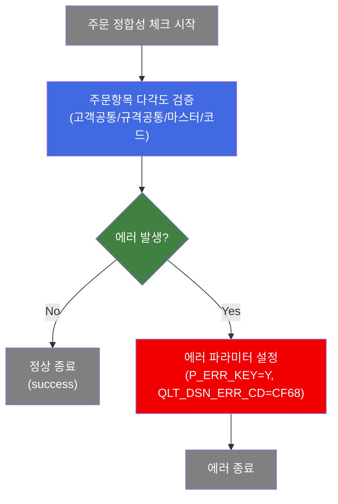
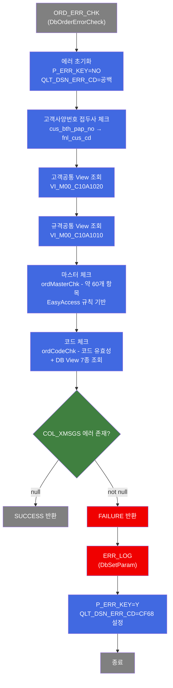
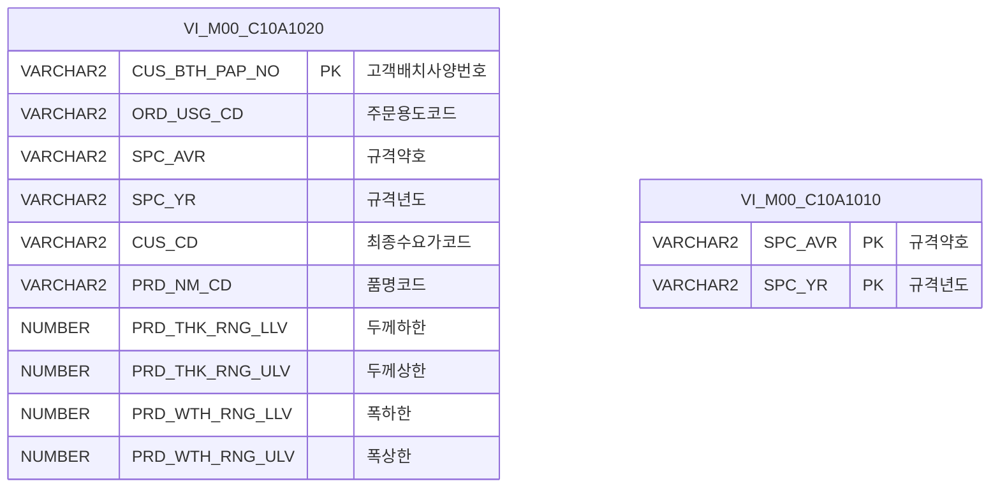

<h1 style="font-size: 40px; text-align: center; font-weight:
   bold; margin: 30px 0;">
  C102100010 레거시 시스템 분석 종합 보고서
</h1>


# 1. 시스템 개요
- **서비스 ID**: C102100010
- **업무명**: 생산가부요청 주문 정합성 에러 체크
- **분석 일시**: 2026-03-16 18:45 (KST)
- **분석 시간**: 약 3분
- **전체 Activity 수**: 2개 (Common 1개, Custom 1개)
- **분석자**: Claude Opus 4.6
- **분석 도구**: /analyze-service C102100010
- **문서 버전**: 1.0

# 📊 비즈니스 프로세스 분석

## 시스템 목적

C102100010 서비스는 OMS(주문관리시스템)에서 C10 MES로 전달된 생산가부요청 주문 데이터의 정합성을 사전 검증하는 NUI(배치) 서비스입니다.

주문항목들에 대해 고객공통기준, 규격공통기준, 마스터 데이터 기준, 코드 정합성 등을 다각도로 검증합니다. 에러가 발생한 경우 에러내역을 PosContext에 누적 등록하고, 최종적으로 에러가 없으면 `success`(정상 종료), 있으면 `failure`(에러 로그 기록 후 종료)를 반환하여 품질설계 프로세스 진입 전에 오류를 걸러냅니다.

주요 검증 영역:
- **고객공통기준 체크**: 고객사양번호 접두사, 주문용도코드, 규격약호, 두께/폭/길이 범위 등 12개 항목 대사
- **규격공통기준 체크**: 규격약호+규격년도 기반 규격공통 View 존재 여부 확인
- **마스터 체크**: EasyAccess 마스터 규칙 기반 약 60개 항목 유효성 검증
- **코드 체크**: GLUE 마스터 코드 유효성 + DB View 기반 고객사/수요가/포장방법/Spangle/도금량 검증

## 핵심 워크플로우 다이어그램



### 상세 워크플로우 다이어그램



## 주요 유즈케이스

### UC-01: 주문 정합성 전체 체크
- **Actor**: 배치 스케줄러 / 시스템 (OMS→MES 주문 수신 프로세스)
- **목적**: 생산가부요청 주문항목에 대해 고객공통/규격공통/마스터/코드 정합성을 다각도로 검증하여 품질설계 진입 전 오류 차단

- **전제조건**:
  - OMS에서 생산가부요청 주문 데이터가 PosContext에 적재됨
  - mesdao (MESAPUSER 스키마) 접근 가능
  - EasyAccess 마스터 데이터 및 코드 테이블 접근 가능
  - 주문 관련 약 20여개 항목(최종수요가코드, 규격약호, 규격년도, 제품형태, 주문두께/폭/길이 등)이 Context에 존재

- **주요 흐름**:
  1. 에러 초기화 (P_ERR_KEY=NO, QLT_DSN_ERR_CD=공백)
  2. 고객사양번호 접두사 검증 (fnl_cus_cd 시작 여부)
  3. 고객공통 View(VI_M00_C10A1020) 조회 → 12개 항목 대사
  4. 규격공통 View(VI_M00_C10A1010) 조회 → 존재 여부 확인
  5. ordMasterChk: EasyAccess 규칙 기반 약 60개 항목 마스터 체크
  6. ordCodeChk: GLUE 코드 유효성 + DB View 7종 조회
  7. 에러 없으면 success 반환, 있으면 failure → ERR_LOG 전이

- **대체 흐름**:
  - 고객공통 조회 결과 0건: A241 오류 누적
  - 고객공통 조회 결과 2건 이상: A242 오류 누적
  - 규격공통 조회 결과 0건: A341 오류, 2건 이상: A342 오류
  - 에러 발생 시 즉시 반환하지 않고 모든 항목 체크 후 에러 누적

- **후행조건**:
  - 에러 없음: 품질설계 프로세스 진입 가능
  - 에러 있음: P_ERR_KEY=Y, QLT_DSN_ERR_CD=CF68 설정, COL_XMSGS에 전체 에러 메시지 누적

### UC-02: 고객공통기준 대사 체크
- **Actor**: 시스템 (UC-01 내부 호출)
- **목적**: 주문항목이 고객공통사양과 일치하는지 12개 항목을 대사

- **전제조건**:
  - COL_CUS_BTH_PAP_NO(고객배치사양번호)가 유효한 값

- **주요 흐름**:
  1. VI_M00_C10A1020 View 조회 (고객사양번호 기반)
  2. 조회 결과 1건일 때 12개 항목 비교:
     - 주문용도코드(A243), 규격약호(A244), 규격년도(A245), 최종수요가(A246)
     - 품명(A247), 주문두께 범위(A248), 주문폭 범위(A249), 주문길이 범위(A250)
     - 두께구분코드(A251), 도금량(A252), 주문표면처리(A253), 색상코드(A254)
  3. 불일치 항목별 해당 에러코드를 setError로 누적

- **대체 흐름**:
  - 조회 0건: A241 오류 (고객공통 미등록)
  - 조회 2건 이상: A242 오류 (고객공통 중복)

- **후행조건**:
  - 에러 있으면 COL_XMSGS에 누적, 없으면 다음 체크 단계 진행

### UC-03: 코드 유효성 검증
- **Actor**: 시스템 (UC-01 내부 호출)
- **목적**: 주문 항목들이 GLUE 마스터 코드에 정의된 유효한 코드값인지 검증

- **전제조건**:
  - EasyAccess 마스터 데이터 접근 가능
  - 코드 검증 대상 약 30개 항목이 Context에 존재

- **주요 흐름**:
  1. HashMap에 유효성 체크 항목 등록 (에러코드/컬럼코드ID/에러메시지 형식)
  2. 고객사코드(CUS_CD) DB View ACT_CUS_CD_SELECT 조회
  3. 수요가코드(ACT_CUS_CD) DB View 조회
  4. 최종수요가코드(FNL_CUS_CD) DB View FNL_CUS_CD_SELECT 조회
  5. 제품형태별 포장방법(ORD_PAK_MTH_SELECT), 품명별 Spangle(ORD_SPNL_TP_SELECT), 품명별 도금량(GW_ASG_CD_SELECT) 카테고리 체크
  6. codeChk: EasyAccess.validateCodeValue() 일괄 검증

- **대체 흐름**:
  - 고객사코드 미존재: A231 오류
  - 고객사코드 중복: A232 오류
  - MasterDataException 발생: setError로 누적

- **후행조건**:
  - 코드 검증 결과가 COL_XMSGS에 누적

---
## 비즈니스 로직 상세

### 1. 주문 정합성 에러 체크 (DbOrderErrorCheck)

- **목적**: OMS에서 전달된 생산가부요청 주문 데이터를 처리하기 전 데이터 정합성을 사전에 검증
- **처리 케이스**:

  **[케이스 1: 고객사양번호 접두사 체크]**
  ```
    조건: cus_bth_pap_no가 유효하고 fnl_cus_cd로 시작하지 않음
    처리:
      1. A223 오류 코드 설정
      2. setError로 에러 누적
  ```

  **[케이스 2: 고객공통기준 대사 (12개 항목)]**
  ```
    조건: VI_M00_C10A1020 조회 결과 1건
    처리:
      1. ORD_USG_CD 비교 → 불일치 시 A243
      2. SPC_AVR 비교 → 불일치 시 A244
      3. SPC_YR 비교 → 불일치 시 A245
      4. CUS_CD 비교 → 불일치 시 A246
      5. PRD_NM_CD 비교 → 불일치 시 A247
      6. PRD_THK 범위 체크 → 이탈 시 A248
      7. PRD_WTH 범위 체크 (조합폭 포함) → 이탈 시 A249
      8. PRD_LTH 범위 체크 (Sheet만) → 이탈 시 A250
      9. ORD_THK_TP 비교 → 불일치 시 A251
      10. GW_ASG_CD 비교 → 불일치 시 A252
      11. ORD_SUR_HND_CD 비교 → 불일치 시 A253
      12. CCL_BOM_NO 비교 → 불일치 시 A254
  ```

  **[케이스 3: 에러 누적 패턴]**
  ```
    조건: 모든 체크 단계에서 에러 발생 시
    처리:
      1. 즉시 반환하지 않고 모든 항목 체크 완료
      2. COL_XMSGS에 에러 메시지 쉼표 구분 누적
      3. C10STR_QLT_DSN_ERR_CD에 에러코드 쉼표 구분 누적
      4. 최종 COL_XMSGS null 여부로 SUCCESS/FAILURE 판단
  ```

- **계산 공식**:

  ```
  [조합폭 계산]
  조건: ord_slit_grp_cnt > 0 AND ord_exc_wth == ord_mix_wth1
  조합폭 = ord_slit_grp_cnt × ord_mix_wth1

  변경 후(2016.08.17): 조합폭 = ord_mix_wth1 + ord_mix_wth2 + ... + ord_mix_wth10

  조합폭이 아닌 경우: ord_exc_wth 직접 사용

  [폭 범위 체크]
  에러 조건: 조합폭 < PRD_WTH_RNG_LLV(하한) OR 조합폭 > PRD_WTH_RNG_ULV(상한)
  ```

- **예외 처리**:
  - 고객공통 조회 0건: A241 "고객공통 미등록"
  - 고객공통 조회 >1건: A242 "고객공통 중복"
  - 규격공통 조회 0건: A341 "규격공통 미등록"
  - 규격공통 조회 >1건: A342 "규격공통 중복"
  - 고객사코드 미존재: A231 오류
  - MasterDataException: setError로 에러 누적

### 2. 에러 로그 설정 (ERR_LOG - DbSetParam)

- **목적**: 정합성 에러 발생 시 후속 프로세스에서 사용할 에러 파라미터 설정
- **처리 케이스**:

  **[케이스 1: failure 전이 시]**
  ```
    조건: ORD_ERR_CHK가 failure 반환
    처리:
      1. P_ERR_KEY = 'Y' (에러 발생 플래그)
      2. QLT_DSN_ERR_CD = 'CF68' (품질설계 에러코드)
      3. 서비스 종료 (end)
  ```

---

# ⚙️ Java 컴포넌트 분석

## Custom Activity 상세 분석

### 1개 Custom Activity 발견

### 1. DbOrderErrorCheck (ORD_ERR_CHK)
- **클래스명**: com.unionsteel.mes.c10.activity.nui.DbOrderErrorCheck
- **액티비티명**: ORD_ERR_CHK
- **파일 경로**: src/com/unionsteel/mes/c10/activity/nui/DbOrderErrorCheck.java
- **주요 기능**: 생산가부요청 주문항목 정합성 에러 체크
- **라인 수**: 4,087 라인 | **메소드 수**: 5개

> 생산가부요청의 주문항목들에 대해 고객공통기준, 규격공통기준, 마스터 데이터 기준, 코드 정합성 등을 다각도로 검증하여 에러가 발생한 경우 에러내역을 PosContext에 누적 등록한다. 최종적으로 에러가 없으면 `success`, 있으면 `failure`를 반환한다.

📎 **[상세 분석 보고서](../customClass/com.unionsteel.mes.c10.activity.nui.DbOrderErrorCheck_class_analysis.md)**

---

# 💾 데이터 요구사항

## 핵심 테이블/뷰

### 1. VI_M00_C10A1020 - (고객공통기준 View)
| 컬럼명 | 타입 | PK | 설명 |
|--------|------|----|-----|
| CUS_BTH_PAP_NO | VARCHAR2 | ✅ | 고객배치사양번호 (조회 키) |
| ORD_USG_CD | VARCHAR2 | | 주문용도코드 |
| SPC_AVR | VARCHAR2 | | 규격약호 |
| SPC_YR | VARCHAR2 | | 규격년도 |
| CUS_CD | VARCHAR2 | | 최종수요가코드 |
| PRD_NM_CD | VARCHAR2 | | 품명코드 |
| PRD_THK_RNG_LLV | NUMBER | | 주문두께 하한 |
| PRD_THK_RNG_ULV | NUMBER | | 주문두께 상한 |
| PRD_WTH_RNG_LLV | NUMBER | | 주문폭 하한 |
| PRD_WTH_RNG_ULV | NUMBER | | 주문폭 상한 |
| PRD_LTH_RNG_LLV | NUMBER | | 주문길이 하한 |
| PRD_LTH_RNG_ULV | NUMBER | | 주문길이 상한 |
| ORD_THK_TP | VARCHAR2 | | 두께구분코드 |
| GW_ASG_CD | VARCHAR2 | | 도금량지정코드 |
| ORD_SUR_HND_CD | VARCHAR2 | | 주문표면처리코드 |
| CCL_BOM_NO | VARCHAR2 | | 색상코드 |

### 2. VI_M00_C10A1010 - (규격공통기준 View)
| 컬럼명 | 타입 | PK | 설명 |
|--------|------|----|-----|
| SPC_AVR | VARCHAR2 | ✅ | 규격약호 (조회 키) |
| SPC_YR | VARCHAR2 | ✅ | 규격년도 (조회 키) |

## 데이터 플로우

### 1. 주문 정합성 체크

```
[생산가부요청 주문 정합성 체크]
OMS 주문 데이터 수신 (PosContext)
→ ORD_ERR_CHK (DbOrderErrorCheck)
  1. 에러 초기화 (P_ERR_KEY=NO)
  2. 고객사양번호 접두사 체크
  3. VI_M00_C10A1020 조회 → 12개 항목 대사
  4. VI_M00_C10A1010 조회 → 규격공통 존재 확인
  5. ordMasterChk → EasyAccess 규칙 60개 항목 체크
  6. ordCodeChk → 코드 유효성 + DB View 7종 조회
     - ACT_CUS_CD_SELECT (고객사코드/수요가코드)
     - FNL_CUS_CD_SELECT (최종수요가코드)
     - ORD_PAK_MTH_SELECT (포장방법)
     - ORD_SPNL_TP_SELECT (Spangle)
     - GW_ASG_CD_SELECT (도금량)
→ [에러 없음] success → end
→ [에러 있음] failure → ERR_LOG (P_ERR_KEY=Y, QLT_DSN_ERR_CD=CF68) → end
```

## SQL 일람표

| SQL 이름 | 쿼리 ID | 타입 | 출처 | 테이블/뷰 |
|---------|---------|-----|-------|-----------|
| 고객공통 조회 | VI_M00_C10A1020 | SELECT | DbOrderErrorCheck | VI_M00_C10A1020 |
| 규격공통 조회 | VI_M00_C10A1010 | SELECT | DbOrderErrorCheck | VI_M00_C10A1010 |
| 고객사코드 체크 | ACT_CUS_CD_SELECT | SELECT | DbOrderErrorCheck | ACT_CUS_CD View |
| 최종수요가코드 체크 | FNL_CUS_CD_SELECT | SELECT | DbOrderErrorCheck | FNL_CUS_CD View |
| 포장방법 체크 | ORD_PAK_MTH_SELECT | SELECT | DbOrderErrorCheck | ORD_PAK_MTH View |
| Spangle구분 체크 | ORD_SPNL_TP_SELECT | SELECT | DbOrderErrorCheck | ORD_SPNL_TP View |
| 도금량지정 체크 | GW_ASG_CD_SELECT | SELECT | DbOrderErrorCheck | GW_ASG_CD View |

> **참고**: 위 SQL 키들은 Java 코드 내에서 DAO를 통해 직접 호출되며, service XML의 sqlkey로는 등록되지 않았습니다. EasyAccess 마스터 규칙 호출은 별도로 다수 존재합니다.

## ER 다이어그램 (핵심 관계)



관계 설명:
- VI_M00_C10A1020(고객공통기준)과 VI_M00_C10A1010(규격공통기준)은 독립 View로 직접적인 FK 관계 없음
- 주문 데이터의 CUS_BTH_PAP_NO로 고객공통 조회, SPC_AVR+SPC_YR로 규격공통 조회
- 코드 검증용 View(ACT_CUS_CD, FNL_CUS_CD, ORD_PAK_MTH 등)는 M00APUSER 마스터 스키마 기반

---

# 📌 특이사항 및 주의사항

## 1. 에러 누적 패턴 (비중단 검증)
- **설계 특징**: 에러 발생 시 즉시 반환하지 않고 모든 항목 체크 후 에러를 누적하는 방식입니다. 대부분의 `return FAILURE`가 주석 처리되어 있어 한 번의 호출로 모든 오류를 파악할 수 있습니다.
- **에러 누적 방식**: `COL_XMSGS`에 쉼표 구분으로 에러 메시지 누적, `C10STR_QLT_DSN_ERR_CD`에 에러코드 누적
- **setError() 통일 패턴**: 모든 에러 등록이 setError() 메소드로 일원화

## 2. 대규모 검증 로직 (4,087 라인)
- **ordMasterChk 메소드**: 약 2,900여 라인으로 매우 높은 복잡도를 가짐. 약 60개 주문 항목에 대해 EasyAccess 규칙 기반 마스터 체크 수행
- **key 배열 패턴**: 20개 필드 배열(`String[] key1~key30`)로 항목 식별하는 독특한 패턴 사용
- **현대화 시 고려**: 검증 규칙이 Java 코드에 하드코딩되어 있어, 규칙 엔진이나 설정 기반으로 외부화하는 것이 권장됨

## 3. 조합폭(Slit 폭) 계산 변경 이력
- **변경 전**: `ord_slit_grp_cnt × ord_mix_wth1` (동일 폭 조합)
- **변경 후 (2016.08.17)**: `ord_mix_wth1 + ord_mix_wth2 + ... + ord_mix_wth10` (개별 폭 합산)
- 조합폭 유효 조건: `ord_slit_grp_cnt > 0 AND ord_exc_wth == ord_mix_wth1`

## 4. failure 전이 시 고정 에러코드
- **QLT_DSN_ERR_CD = CF68**: failure 시 ERR_LOG(DbSetParam)에서 품질설계 에러코드를 CF68로 고정 설정합니다. 개별 에러코드(A223, A241~A254, A341~A342 등)는 COL_XMSGS와 C10STR_QLT_DSN_ERR_CD에 누적되지만, 서비스 레벨 에러코드는 CF68 단일값입니다.

## 5. EasyAccess 프레임워크 의존성
- **EasyAccess API**: 코드 검증(`validateCodeValue`), 마스터 규칙 조회 등 GLUE 프레임워크의 마스터데이터 접근 API에 강하게 의존합니다. 현대화 시 EasyAccess 대체 메커니즘이 필요합니다.

## 6. service XML의 failure 전이
- **ORD_ERR_CHK**: success → end (정상), failure → ERR_LOG (에러)로 분기. Phase 1 파서에서 failure 전이가 누락될 수 있으나, 실제 서비스 XML에는 `<transition name="failure" value="ERR_LOG" />`가 명시되어 있습니다.

---

# 📚 참고 문서

- **Service XML**: `src/service/C102100010-service.xml`
- **Custom Java 클래스**:
  - `src/com/unionsteel/mes/c10/activity/nui/DbOrderErrorCheck.java` (4,087 라인)
  - 상세 분석: `docs/analysis/service/customClass/com.unionsteel.mes.c10.activity.nui.DbOrderErrorCheck_class_analysis.md`
