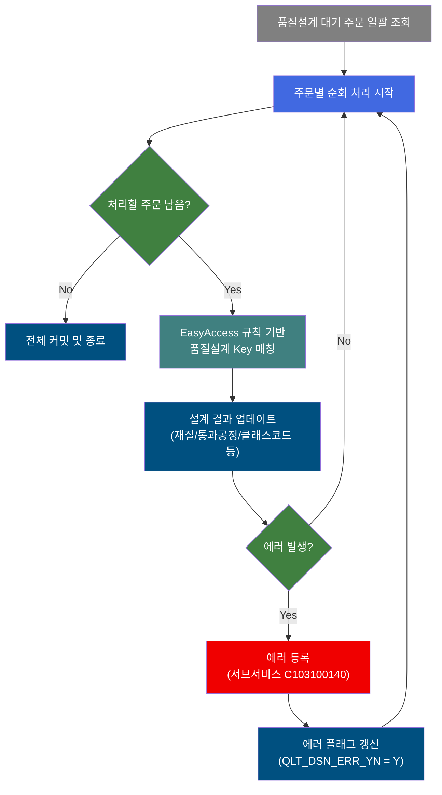
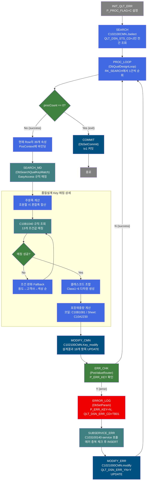
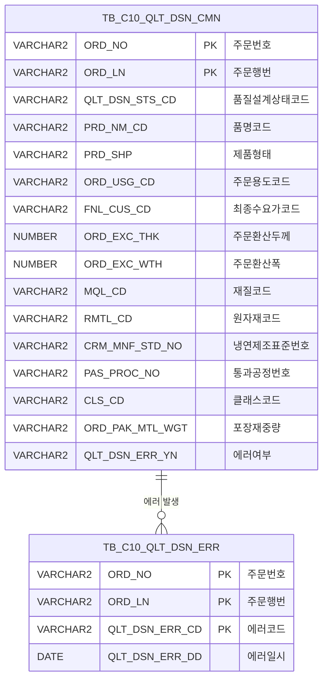

<h1 style="font-size: 40px; text-align: center; font-weight:
   bold; margin: 30px 0;">
  C102100020 레거시 시스템 분석 종합 보고서
</h1>


# 1. 시스템 개요
- **서비스 ID**: C102100020
- **업무명**: 품질설계 자동 Key 매칭 배치 처리
- **분석 일시**: 2026-03-16 18:50 KST
- **분석 시간**: 약 3분
- **전체 Activity 수**: 10개 (Custom 2, Built-in 5, Common 3)
- **분석자**: Claude Opus 4.6
- **분석 도구**: /analyze-service C102100020
- **문서 버전**: 1.0

# 📊 비즈니스 프로세스 분석

## 시스템 목적

C102100020 서비스는 품질설계 대기 상태(`QLT_DSN_STS_CD = 'J'`)인 주문을 일괄 조회하여, 각 주문의 속성(품명, 형태, 규격, 용도, 고객사, 두께, 폭 등)을 기반으로 EasyAccess 규칙 엔진을 통해 최적의 품질설계 Key를 자동 매칭하는 NUI(배치) 서비스이다.

매칭 성공 시 재질코드(MQL_CD), 원자재코드(RMTL_CD), 제조규격번호(CRM_MNF_STD_NO), 통과공정번호(PAS_PROC_NO), 클래스코드(CLS_CD), 포장재중량(ORD_PAK_MTL_WGT) 등 설계 결과를 `TB_C10_QLT_DSN_CMN` 테이블에 업데이트한다. 매칭 실패 시 에러코드를 서브서비스(C103100140)를 통해 `TB_C10_QLT_DSN_ERR` 테이블에 등록하고, 해당 주문의 에러 플래그(`QLT_DSN_ERR_YN`)를 'Y'로 갱신한다.

이 서비스는 주문 수신 후 품질설계 공정의 첫 단계로, 후속 공정(설계 확정, MO 생성, 생산 지시)의 전제 조건이 되는 핵심 배치 프로세스이다.

## 핵심 워크플로우 다이어그램



### 상세 워크플로우 다이어그램



## 주요 유즈케이스

### UC-01: 품질설계 대기 주문 일괄 자동 설계

- **Actor**: 시스템 (배치 프로세스)
- **목적**: 품질설계 대기 상태(J)인 모든 주문에 대해 EasyAccess 규칙 엔진을 통해 자동으로 품질설계 Key를 매칭하고 설계 결과를 저장

- **전제조건**:
  - TB_C10_QLT_DSN_CMN에 QLT_DSN_STS_CD = 'J' 상태인 주문이 존재
  - EasyAccess 규칙 마스터(C10B1040, C10B9980~C10B9984 등) 설정 완료
  - 배치 스케줄러에 의해 서비스 트리거됨

- **주요 흐름**:
  1. P_PROC_FLAG = 'C' 초기화 (INIT_QLT_ERR)
  2. TB_C10_QLT_DSN_CMN에서 QLT_DSN_STS_CD = 'J' 전건 조회 (C102100CMN.Jselect)
  3. 조회된 ResultSet을 1건씩 순회 (DbQualDesignLoop → 39개 주문 속성 바인딩)
  4. 각 주문에 대해 DbSearchQualKeyMatch 실행 → EasyAccess 규칙 매칭
  5. 매칭 성공: 재질/원자재/제조규격/통과공정/클래스코드/포장재중량 등 설계결과 UPDATE (C102100CMN.Key_modify)
  6. ERR_CHK: P_ERR_KEY 확인 → 정상이면 다음 건 처리
  7. 모든 건 처리 완료 시 COMMIT

- **대체 흐름**:
  - EasyAccess 매칭 실패 (ERRCD_KK01): 와일드카드 Fallback 전략으로 재시도 → 최종 실패 시 에러코드 설정 후 FAILURE 반환
  - 매칭 결과 2건 이상 (ERRCD_KK02): 중복 매칭 에러 → FAILURE 반환
  - Material Code 미존재 (ERRCD_KP06): mtl_cd 공백 → FAILURE 반환

- **후행조건**:
  - 정상 처리된 주문: 설계 Key 항목(MQL_CD, RMTL_CD, CRM_MNF_STD_NO, PAS_PROC_NO, CLS_CD, ORD_PAK_MTL_WGT 등) 업데이트 완료
  - 에러 발생 주문: TB_C10_QLT_DSN_ERR에 에러 레코드 등록, QLT_DSN_ERR_YN = 'Y' 갱신

### UC-02: 품질설계 에러 처리 및 등록

- **Actor**: 시스템 (배치 프로세스)
- **목적**: 품질설계 Key 매칭 실패 시 에러 정보를 체계적으로 등록하고 후속 수동 설계를 위한 플래그 설정

- **전제조건**:
  - DbSearchQualKeyMatch에서 FAILURE 반환 (P_ERR_KEY = 'Y')
  - 에러코드(QLT_DSN_ERR_CD)가 설정됨

- **주요 흐름**:
  1. ERR_CHK에서 P_ERR_KEY = 'Y' 감지 → error 전이
  2. ERROR_LOG: P_ERR_KEY = 'N' 초기화, QLT_DSN_ERR_CD = 'TB01' 설정
  3. SUBSERVICE_ERR: C103100140 서브서비스 호출
     - DbSearchCmnErrorCheck: ORD_NO + ORD_LN + QLT_DSN_ERR_CD 복합키로 중복 체크
     - 중복 없으면 TB_C10_QLT_DSN_ERR에 INSERT
  4. MODIFY_ERR: TB_C10_QLT_DSN_CMN의 QLT_DSN_ERR_YN = 'Y'로 UPDATE
  5. 다음 주문 건으로 PROC_LOOP 복귀

- **대체 흐름**:
  - 중복 에러 이미 등록됨: 서브서비스에서 INSERT 스킵 (중복 방지)

- **후행조건**:
  - 에러 레코드가 TB_C10_QLT_DSN_ERR에 등록됨 (중복 제외)
  - 해당 주문의 QLT_DSN_ERR_YN = 'Y'로 갱신
  - 배치 처리는 중단 없이 다음 건 계속 진행

### UC-03: EasyAccess 와일드카드 Fallback 매칭

- **Actor**: 시스템 (DbSearchQualKeyMatch 내부 로직)
- **목적**: 엄격 조건으로 품질설계 Key 매칭 실패 시 선택 조건을 단계적으로 완화하여 최대한 자동 매칭 성공률을 높임

- **전제조건**:
  - C10B1040 규칙 테이블에 13개 조건 키로 초기 조회 결과 0건
  - 고객사양번호(cus_bth_pap_no)가 지정되지 않은 주문 (지정 시 즉시 실패)

- **주요 흐름**:
  1. 주문용도코드 완화 1단계: 앞 3자리 유지 + "***" (예: "ABC123" → "ABC***")
  2. 주문용도코드 완화 2단계: 앞 1자리 유지 + "*****" (예: "ABC***" → "A*****")
  3. 주문용도코드 완화 3단계: 전체 와일드카드 "******"
  4. 고객사코드 완화: fnl_cus_cd = "******"
  5. 색상코드 완화: clr_cd = "*****"
  6. 각 단계마다 C10B1040 재조회 → 1건 매칭 시 성공

- **대체 흐름**:
  - 고객사양번호 지정 주문: Fallback 없이 즉시 ERRCD_KK01 에러 처리
  - 모든 Fallback 단계 실패: ERRCD_KK01 에러코드 설정 후 FAILURE 반환
  - 매칭 결과 2건 이상: ERRCD_KK02 (중복 매칭) 에러 처리

- **후행조건**:
  - 매칭 성공: 규칙 결과값(재질, 원자재, 제조규격, 통과공정 등)이 Context에 저장됨
  - 매칭 실패: 에러코드가 설정되어 에러 처리 흐름으로 전이

---
## 비즈니스 로직 상세

### 1. EasyAccess 규칙 기반 품질설계 Key 매칭 (DbSearchQualKeyMatch)

- **목적**: 주문 속성(품명, 형태, 규격, 용도, 고객사, 두께, 폭 등)을 종합하여 C10B1040 규칙 테이블에서 최적의 품질설계 Key를 자동 매칭하고, 생산 공정에서 적용할 재질, 제조규격, 통과공정 등을 결정

- **처리 케이스**:

  **[케이스 1: 주문폭 결정]**
  ```
    조건: 조분할 그룹수(ord_slit_grp_cnt) > 0
    처리:
      1. ord_mix_wth1 ~ ord_mix_wth10 합산
      2. ord_exc_wth = sum(혼합폭)
    조건: ord_slit_grp_cnt = 0
    처리:
      1. ord_exc_wth = 원본 주문폭(COL_ORD_EXC_WTH) 사용
  ```

  **[케이스 2: 와일드카드 Fallback 매칭]**
  ```
    조건: C10B1040 초기 조회 결과 0건 AND 고객사양번호 미지정
    처리:
      1. 주문용도코드 3자리 유지 + "***" 으로 완화
      2. 주문용도코드 1자리 유지 + "*****" 으로 완화
      3. 주문용도코드 전체 "******" 으로 완화
      4. 고객사코드 "******" 으로 완화
      5. 색상코드 "*****" 으로 완화
      6. 각 단계마다 C10B1040 재조회, 1건 매칭 시 성공
  ```

  **[케이스 3: 위탁임가공 통과공정 Override]**
  ```
    조건: poc_cgl_yn = "Y" AND poc_ccl_yn = "Y"
    처리: COL_PAS_PROC_NO = "3OA001" (CGL+CCL 동시 위탁)

    조건: poc_cgl_yn = "Y" AND poc_ccl_yn = "N"
    처리: COL_PAS_PROC_NO = "GOH001" (CGL만 위탁)

    조건: 그 외
    처리: COL_PAS_PROC_NO = 규칙 결과값 사용
  ```

### 2. 다차원 클래스코드 조합 (DbSearchQualKeyMatch)

- **목적**: 제품군, 행선지, 재질, Spangle, 도금량/조도, 표면처리 등 6개 차원의 코드를 EasyAccess 규칙에서 조회하여 최종 클래스코드(CLS_CD)를 조합

- **처리 케이스**:

  **[케이스 1: 냉연/원판 계열 (품명코드 A,B,C,D,1,E,N,2,5,7,8)]**
  ```
    처리:
      1. Class1 (제품군): C10B9980 규칙, 키: 품명코드, 주문두께구분, 주문EDG, 규격기관
      2. Class2 (행선지): C10B9981 규칙, 키: 품명코드, 제품형태, 조분할수, 복합조여부, 주문종류
      3. Class34 (재질): C10B9982 규칙, 키: 품명코드, 재질코드
      4. Class5: EG/EG칼라(E,2,N,8) → gw_asg_cd, 그 외 → ord_rou_cd
      5. Class6 (표면처리): C10B9984 규칙, 키: 품명코드, 주문표면처리코드
    결과: CLS_CD = Class1 + Class2 + Class34 + Class5 + Class6
  ```

  **[케이스 2: 도금 계열 (품명코드 G,K,J,L,V,W,3,4,6,9)]**
  ```
    처리:
      1. Class1 (제품군): C10B9980 규칙 (동일)
      2. Class2 (행선지): C10B9981 규칙 (동일)
      3. Class3 (재질): C10B9983 규칙, 키: 품명코드, 재질코드, 규격기관
      4. Class4: ord_spnl_tp (Spangle 구분)
      5. Class5: gw_asg_cd (도금량지정코드)
      6. Class6 (표면처리): C10B9984 규칙 (동일)
    결과: CLS_CD = Class1 + Class2 + Class3 + Class4 + Class5 + Class6
  ```

### 3. 포장재중량 계산 (DbSearchQualKeyMatch)

- **목적**: 코일과 Sheet 형태에 따라 포장재중량(ORD_PAK_MTL_WGT)을 자동 산출

- **계산 공식**:

  ```
  [코일 형태 (PRD_SHP = PRD_SHP_COIL)]
  C10B1081 규칙 조회 (포장방법, 폭범위, 포장단중, 길이범위) → 결과값 적용

  [Sheet 형태 (PRD_SHP = PRD_SHP_SHEET)]
  합산폭길이 = 주문폭 + 주문길이
  C10A2230 계산식 실행 (유통경로, 합산폭길이, 제품폭, 제품길이)
  ORD_PAK_MTL_WGT = BigDecimal 결과.setScale(0, ROUND_HALF_UP)
  ```

### 4. 루프 제어 및 건별 처리 (DbQualDesignLoop)

- **목적**: PosSearch로 조회한 대기 주문 ResultSet을 1건씩 순회하며 후속 Activity 체인에 단건 기준 데이터를 공급

- **처리 케이스**:

  **[케이스 1: 정상 순회]**
  ```
    조건: procCount > 0
    처리:
      1. procCount 감소 (procCount -= 1)
      2. 순방향 인덱스 계산: this_row = total_row - procCount
      3. P_ERR_KEY = "N", QLT_DSN_ERR_YN = "" 재초기화
      4. ResultSet에서 this_row번째 Row 탐색
      5. 39개 param 파싱 ("|" 구분자로 저장변수명|대상항목명 분리) → Context에 바인딩
      6. procCount 저장 후 "success" 반환
  ```

  **[케이스 2: 루프 종료]**
  ```
    조건: procCount == 0
    처리:
      1. Context에서 카운터 변수 제거
      2. "exit" 전이 반환 → COMMIT Activity로 이동
  ```

---

# ⚙️ Java 컴포넌트 분석

## Custom Activity 상세 분석

### 2개 Custom Activity 발견

### 1. DbQualDesignLoop (PROC_LOOP)
- **클래스명**: com.unionsteel.mes.c10.activity.nui.DbQualDesignLoop
- **액티비티명**: PROC_LOOP
- **파일 경로**: src/com/unionsteel/mes/c10/activity/nui/DbQualDesignLoop.java
- **주요 기능**: ResultSet 1건씩 순회 처리를 위한 루프 제어 액티비티
- **라인 수**: 171 | **메소드 수**: 1

> 이전 서비스(PosSearch)에서 조회한 PosRowSet을 순차적으로 읽으며, 한 건씩 PosContext에 세팅한 뒤 후속 액티비티 체인이 단건 기준으로 동작할 수 있도록 연결한다. 처리 건수가 0이 되면 "exit" 전이를 반환하여 루프를 종료한다.

📎 **[상세 분석 보고서](../customClass/com.unionsteel.mes.c10.activity.nui.DbQualDesignLoop_class_analysis.md)**

---

### 2. DbSearchQualKeyMatch (SEARCH_MD)
- **클래스명**: com.unionsteel.mes.c10.activity.nui.DbSearchQualKeyMatch
- **액티비티명**: SEARCH_MD
- **파일 경로**: src/com/unionsteel/mes/c10/activity/nui/DbSearchQualKeyMatch.java
- **주요 기능**: EasyAccess 규칙 엔진 기반 품질설계 Key 매칭 및 다차원 클래스코드 생성
- **라인 수**: 약 1047 | **메소드 수**: 1

> Master Data의 설계Key기준(C10B1040)을 읽어 품질설계Key사항을 편성하는 클래스이다. 주문 속성을 이용해 EasyAccess 규칙 엔진을 통해 최적의 품질설계 Key를 매칭하고, 매칭 실패 시 와일드카드 Fallback 전략을 사용하며, 매칭 성공 후에는 다차원 클래스코드(Class1~6)를 조합하여 최종 품질설계코드(COL_CLS_CD)를 생성한다.

📎 **[상세 분석 보고서](../customClass/com.unionsteel.mes.c10.activity.nui.DbSearchQualKeyMatch_class_analysis.md)**

---

# 💾 데이터 요구사항

## 핵심 테이블

### 1. TB_C10_QLT_DSN_CMN - (품질설계공통 마스터)

| 컬럼명 | 타입 | PK | 설명 |
|--------|------|----|------|
| ORD_NO | VARCHAR2 | ✅ | 주문번호 |
| ORD_LN | VARCHAR2 | ✅ | 주문행번 |
| QLT_DSN_STS_CD | VARCHAR2 | | 품질설계상태코드 (J:대기, I:등록, A:확정, M:수동완료) |
| PLNT_TP | VARCHAR2 | | 플랜트구분 |
| PRD_NM_CD | VARCHAR2 | | 품명코드 |
| PRD_SHP | VARCHAR2 | | 제품형태 (코일/Sheet) |
| FLOW_CHL | VARCHAR2 | | 유통경로 |
| ORD_KND | VARCHAR2 | | 주문종류 |
| ORD_USG_CD | VARCHAR2 | | 주문용도코드 |
| CUS_CD | VARCHAR2 | | 고객사코드 |
| FNL_CUS_CD | VARCHAR2 | | 최종수요가코드 |
| CUS_BTH_PAP_NO | VARCHAR2 | | 고객사양서번호 |
| SPC_AVR | VARCHAR2 | | 규격약호 |
| ORD_EXC_THK | NUMBER | | 주문환산두께 |
| ORD_EXC_WTH | NUMBER | | 주문환산폭 |
| ORD_EXC_LTH | NUMBER | | 주문환산길이 |
| MQL_CD | VARCHAR2 | | 재질코드 (설계결과) |
| RMTL_CD | VARCHAR2 | | 원자재코드 (설계결과) |
| RMTL_CD1 | VARCHAR2 | | 원자재코드1 |
| RMTL_CD2 | VARCHAR2 | | 원자재코드2 |
| CRM_MNF_STD_NO | VARCHAR2 | | 냉연제조표준번호 (설계결과) |
| CRM_MNF_STD_NO1 | VARCHAR2 | | 냉연제조표준번호1 |
| CRM_MNF_STD_NO2 | VARCHAR2 | | 냉연제조표준번호2 |
| PAS_PROC_NO | VARCHAR2 | | 통과공정번호 (설계결과) |
| QLT_DSN_CFM_TP | VARCHAR2 | | 품질설계확정구분 (M:수동, A:자동) |
| CLS_CD | VARCHAR2 | | 클래스코드 (Class1~6 조합, 설계결과) |
| SUB_CLS_CD | VARCHAR2 | | 서브클래스코드 |
| ORD_ROU_CD | VARCHAR2 | | 주문조도코드 |
| APR_INP_BAS_CD | VARCHAR2 | | 승인입력기준코드 (외관검사기준) |
| ORD_PAK_MTL_WGT | VARCHAR2 | | 포장재중량 (설계결과) |
| QLT_DSN_ERR_YN | VARCHAR2 | | 품질설계에러여부 (Y/N) |
| MTL_CD | VARCHAR2 | | Material Code |
| GW_ASG_CD | VARCHAR2 | | 도금량지정코드 |
| CCL_BOM_NO | VARCHAR2 | | CCL BOM 번호 |
| EMBS_CD | VARCHAR2 | | EMBOSS 무늬코드 |
| ORD_SPNL_TP | VARCHAR2 | | 주문Spangle구분 |
| ORD_SUR_HND_CD | VARCHAR2 | | 주문표면처리코드 |
| ORD_EDG_ASG_TP | VARCHAR2 | | 주문Edge지정구분 |
| ORD_THK_TP | VARCHAR2 | | 주문두께구분 |
| ORD_SLIT_GRP_CNT | VARCHAR2 | | 주문Slit조수 |
| ORD_MIX_WTH1~10 | VARCHAR2 | | 주문조합폭 1~10 |
| ORD_PAK_MTH | VARCHAR2 | | 주문포장방법 |
| ORD_PAK_UNT_WGT_ULV | VARCHAR2 | | 주문포장단중상한값 |
| POC_CGL_YN | VARCHAR2 | | CGL 위탁임가공구분 |
| POC_CCL_YN | VARCHAR2 | | CCL 위탁임가공구분 |
| TRST_PROC_YN | VARCHAR2 | | 위탁임가공여부 |

### 2. TB_C10_QLT_DSN_ERR - (품질설계에러 이력)

| 컬럼명 | 타입 | PK | 설명 |
|--------|------|----|------|
| ORD_NO | VARCHAR2 | ✅ | 주문번호 |
| ORD_LN | VARCHAR2 | ✅ | 주문행번 |
| QLT_DSN_ERR_CD | VARCHAR2 | ✅ | 품질설계에러코드 |
| QLT_DSN_ERR_DD | DATE | | 품질설계에러일시 (SYSDATE) |

## 데이터 플로우

### 1. 대기 주문 일괄 조회

```
[배치 서비스 시작]
서비스 트리거
→ C102100CMN.Jselect
  FROM TB_C10_QLT_DSN_CMN
  WHERE QLT_DSN_STS_CD = 'J'
→ RK_SEARCH에 전건 ResultSet 저장
→ DbQualDesignLoop에서 1건씩 순회 시작
```

### 2. 설계 Key 매칭 및 저장

```
[EasyAccess 규칙 매칭]
현재 주문 Row에서 39개 속성 추출
→ DbSearchQualKeyMatch.runActivity()
  C10B1040 규칙 조회 (13개 조건 키)
  → 매칭 성공 시: 재질/원자재/제조규격/통과공정 Context 저장
  → C10B9980~C10B9984 규칙 조회 → 6개 클래스코드 생성
  → 코일/Sheet 구분 포장재중량 계산
→ C102100CMN.Key_modify
  UPDATE TB_C10_QLT_DSN_CMN
  SET MQL_CD, RMTL_CD, CRM_MNF_STD_NO, PAS_PROC_NO,
      CLS_CD, SUB_CLS_CD, ORD_ROU_CD, APR_INP_BAS_CD,
      ORD_PAK_MTL_WGT, QLT_DSN_CFM_TP, ...
  WHERE ORD_NO = ? AND ORD_LN = ?
```

### 3. 에러 등록

```
[매칭 실패 시 에러 처리]
ERR_CHK에서 P_ERR_KEY = 'Y' 감지
→ SUBSERVICE_ERR: C103100140-service 호출
  → DbSearchCmnErrorCheck: TB_C10_QLT_DSN_ERR 중복 체크
  → PosInsert: INSERT INTO TB_C10_QLT_DSN_ERR (ORD_NO, ORD_LN, QLT_DSN_ERR_CD, QLT_DSN_ERR_DD)
→ C1021000CMN.modify
  UPDATE TB_C10_QLT_DSN_CMN
  SET QLT_DSN_ERR_YN = 'Y'
  WHERE ORD_NO = ? AND ORD_LN = ?
```

## SQL 일람표

| SQL 이름 | 쿼리 ID | 타입 | 출처 | 테이블 |
|---------|---------|-----|------|--------|
| 품질설계공통 대기 주문 조회 | C102100CMN.Jselect | SELECT | Service | TB_C10_QLT_DSN_CMN |
| 설계Key항목 업데이트 | C102100CMN.Key_modify | UPDATE | Service | TB_C10_QLT_DSN_CMN |
| 에러여부 업데이트 | C1021000CMN.modify | UPDATE | Service | TB_C10_QLT_DSN_CMN |
| 품질메시지 Insert | INSERT_MSG | INSERT | DbSearchQualKeyMatch | (품질메시지 테이블) |
| 정전메시지 Insert | INSERT_MSG_COR | INSERT | DbSearchQualKeyMatch | (정전메시지 테이블) |

## ER 다이어그램 (핵심 관계)



관계 설명:
- **TB_C10_QLT_DSN_CMN**이 중심 테이블로, 주문별 품질설계 정보를 관리
- **TB_C10_QLT_DSN_ERR**: ORD_NO, ORD_LN을 FK로 참조하며, 에러코드별 1:N 관계 (하나의 주문에 여러 에러 발생 가능)
- EasyAccess 규칙 테이블(C10B1040, C10B9980~C10B9984 등)은 마스터 데이터로 별도 관리

---

# 🔗 서브서비스

## 서브서비스 요약

| 서비스 ID | 설명 | 호출 액티비티 | 트랜잭션 | 상세 분석 |
|-----------|------|-------------|---------|----------|
| C103100140 | 품질설계결과 에러 등록 (중복 방지 포함) | SUBSERVICE_ERR | 기존 트랜잭션 공유 | [상세 분석 링크](./C103100140_legacy_analysis.md) |

### C103100140 - 품질설계결과 에러 등록
품질설계 과정에서 발생한 에러 정보를 TB_C10_QLT_DSN_ERR 테이블에 등록하되, ORD_NO + ORD_LN + QLT_DSN_ERR_CD 복합키로 중복 체크 후 신규건만 INSERT하는 서비스이다.
Activity 2개 (Custom 1, Built-in 1), SQL 2개 (SELECT 1, INSERT 1).

# 📌 특이사항 및 주의사항

## 1. 와일드카드 Fallback 전략의 매칭 순서 의존성
- **단계적 완화**: 주문용도코드 → 고객사코드 → 색상코드 순으로 와일드카드를 적용하므로, 규칙 마스터(C10B1040)에 와일드카드 패턴 데이터가 정확히 등록되어 있어야 한다
- **고객사양번호 지정 주문은 Fallback 불가**: `cus_bth_pap_no`가 지정된 주문은 매칭 실패 시 즉시 에러 처리되므로, 해당 주문의 규칙 데이터는 정확히 1건이 존재해야 한다
- **중복 매칭 방지**: 매칭 결과가 2건 이상이면 ERRCD_KK02 에러 → 규칙 마스터의 유일성 보장 필요

## 2. 에러 발생 시에도 배치 중단 없이 계속 진행
- **비중단 설계**: 개별 주문의 매칭 실패가 전체 배치를 중단시키지 않는다. 에러 등록 후 다음 건으로 계속 진행
- **에러 플래그 관리**: PROC_LOOP 진입 시마다 `P_ERR_KEY = "N"`, `QLT_DSN_ERR_YN = ""` 초기화 → 이전 건의 에러 상태가 다음 건에 영향을 미치지 않음
- **트랜잭션 범위**: 서브서비스 C103100140은 `new-transaction = false`이므로 부모 서비스의 트랜잭션을 공유하며, 전체 처리 완료 시 한 번에 COMMIT

## 3. 품명코드별 분기 처리 복잡성
- **냉연/원판 계열 vs 도금 계열**: 품명코드 첫 글자에 따라 클래스코드 조합 방식이 완전히 달라진다 (Class34 vs Class3+Class4, Class5 결정 기준 차이)
- **하드코딩된 품명코드 분류**: 'A','B','C','D','1','E','N','2','5','7','8' (냉연/원판), 'G','K','J','L','V','W','3','4','6','9' (도금) → 품명코드 추가 시 Java 소스 수정 필요
- **Sub 클래스코드**: 특정 품명코드에서만 mtl_cd 기반 서브코드를 추출하며, '-' 포함 여부에 따라 substring 위치가 다름 (7,13 vs 8,14)

## 4. 전건 조회 성능 리스크
- **Jselect 쿼리**: `WHERE QLT_DSN_STS_CD = 'J'` 단일 조건으로 전건 조회 (`SELECT *`) → 대기 주문이 대량인 경우 메모리 부하 가능
- **fetchSize=10**: ResultSet 전체를 한 번에 로드하지 않고 10건씩 가져오지만, PosRowSet 전체를 메모리에 유지
- **루프 내 다수 규칙 조회**: 1건당 최대 9개 EasyAccess 규칙 조회 + 2개 INSERT → N건이면 최대 11×N 회 DB 접근

## 5. 위탁임가공 통과공정 하드코딩
- **고정 공정번호**: CGL+CCL 동시 위탁 시 "3OA001", CGL만 위탁 시 "GOH001"이 Java 소스에 하드코딩
- **공정번호 변경 시**: Java 소스 수정 및 재빌드 필요 (마스터 데이터화 검토 필요)

# 📚 참고 문서

- **Query SQL**: `src/query/C102100CMN-query.glue_sql`
- **Custom Java 클래스**:
  - `src/com/unionsteel/mes/c10/activity/nui/DbQualDesignLoop.java`
  - `src/com/unionsteel/mes/c10/activity/nui/DbSearchQualKeyMatch.java`
- **서브서비스 분석**: `docs/analysis/service/nui/C103100140_legacy_analysis.md`
- **커스텀 클래스 분석**:
  - `docs/analysis/service/customClass/com.unionsteel.mes.c10.activity.nui.DbQualDesignLoop_class_analysis.md`
  - `docs/analysis/service/customClass/com.unionsteel.mes.c10.activity.nui.DbSearchQualKeyMatch_class_analysis.md`
