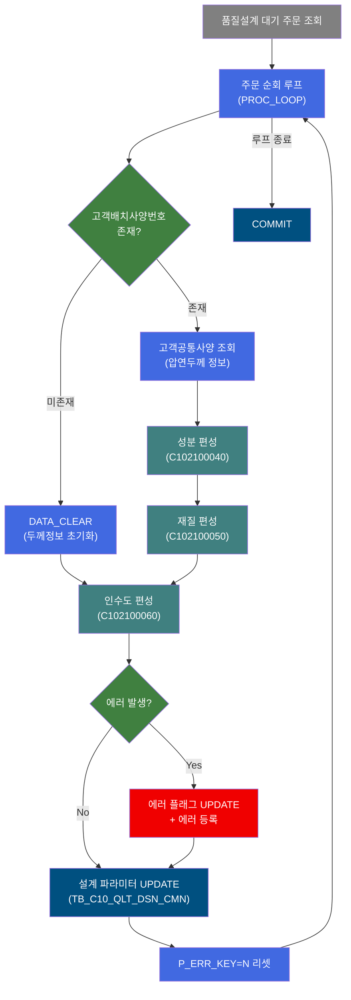
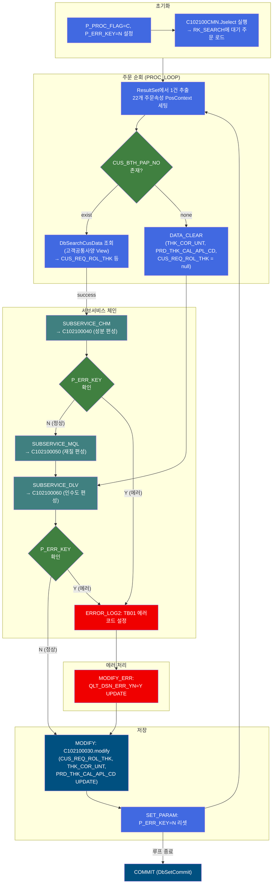
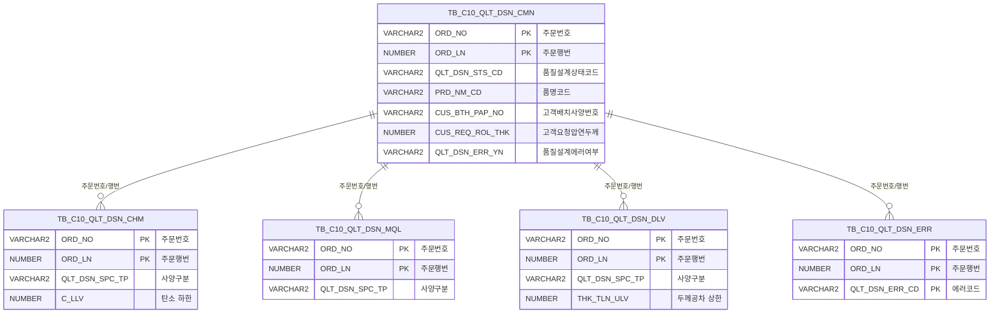

<h1 style="font-size: 40px; text-align: center; font-weight:
   bold; margin: 30px 0;">
  C102100030 레거시 시스템 분석 종합 보고서
</h1>


# 1. 시스템 개요
- **서비스 ID**: C102100030
- **업무명**: 고객사양(C) 품질설계 편성
- **분석 일시**: 2026-03-16 19:18 KST
- **분석 시간**: 약 12분 (서브서비스 포함)
- **전체 Activity 수**: 17개 (Custom 2, Built-in 7, Common 8)
- **분석자**: Claude Opus 4.6
- **분석 도구**: /analyze-service C102100030
- **문서 버전**: 1.0

# 📊 비즈니스 프로세스 분석

## 시스템 목적

C102100030 서비스는 **고객사양(C) 기준의 품질설계를 일괄 편성**하는 NUI(배치) 서비스이다. 품질설계 대기 상태(`QLT_DSN_STS_CD`)인 주문들을 조회하여 순회하면서, 각 주문에 대해 고객공통사양 조회 → 성분(CHM) 편성 → 재질(MQL) 편성 → 인수도(DLV) 편성을 순차적으로 수행한다.

핵심 처리 흐름은 다음과 같다:
1. **INIT_QLT_ERR**: P_PROC_FLAG=C(고객사양), P_ERR_KEY=N 초기화
2. **SEARCH**: C102100CMN.Jselect로 품질설계 대기 주문 전체 조회
3. **PROC_LOOP** (DbQualDesignLoop): 조회 ResultSet을 1건씩 순회하며 22개 주문속성을 PosContext에 세팅
4. **ROUTER_IF_THEN**: 고객배치사양번호(CUS_BTH_PAP_NO) 존재 여부로 분기
5. **SEARCH_MD** (DbSearchCusData): 고객공통사양 View에서 압연두께 정보 조회 (prodSpecKind=1)
6. **SUBSERVICE_CHM**: C102100040 호출 → 성분(13종 화학원소 상/하한) 편성
7. **SUBSERVICE_MQL**: C102100050 호출 → 재질(인장강도/항복점/연신율 등) 편성
8. **SUBSERVICE_DLV**: C102100060 호출 → 인수도(치수공차/형상규격) 편성
9. **MODIFY**: 고객요청압연두께(CUS_REQ_ROL_THK) 등 설계 파라미터를 TB_C10_QLT_DSN_CMN에 UPDATE

각 서브서비스에서 에러 발생 시 에러 플래그(P_ERR_KEY=Y)를 확인하는 ROUTER_CHK_ERR/ROUTER_CHK_ERR5 라우터가 에러 전파를 감지하고, MODIFY_ERR(QLT_DSN_ERR_YN=Y 업데이트) + SUBSERVICE(C103100140 에러 등록)로 에러 처리한다.

## 핵심 워크플로우 다이어그램



### 상세 워크플로우 다이어그램



## 주요 유즈케이스

### UC-01: 고객사양 품질설계 일괄 편성

- **Actor**: 품질설계 배치 프로세스 (상위 서비스 C102100000에서 호출)
- **목적**: 품질설계 대기 주문 전체에 대해 고객사양 기준으로 성분/재질/인수도를 일괄 편성

- **전제조건**:
  - TB_C10_QLT_DSN_CMN에 대기 상태(QLT_DSN_STS_CD) 주문이 존재
  - EasyAccess 마스터에 성분/재질/인수도 규격 데이터가 등록되어 있음

- **주요 흐름**:
  1. INIT_QLT_ERR에서 P_PROC_FLAG=C(고객사양), P_ERR_KEY=N 초기화
  2. SEARCH에서 C102100CMN.Jselect로 대기 주문 전체 조회 → RK_SEARCH에 로드
  3. PROC_LOOP가 1건씩 순회하며 22개 주문속성(ORD_NO, ORD_LN, 품명코드, 두께/폭/길이 등) 세팅
  4. ROUTER_IF_THEN이 CUS_BTH_PAP_NO 존재 여부로 분기
  5. 존재 시: SEARCH_MD(DbSearchCusData)로 고객공통사양 조회 → 성분→재질→인수도 편성
  6. 미존재 시: DATA_CLEAR로 두께정보 초기화 후 인수도 편성만 수행
  7. MODIFY에서 CUS_REQ_ROL_THK, THK_COR_UNT, PRD_THK_CAL_APL_CD를 TB_C10_QLT_DSN_CMN에 UPDATE
  8. SET_PARAM에서 P_ERR_KEY=N 리셋 후 다음 주문으로

- **대체 흐름**:
  - 서브서비스 에러 발생: ROUTER_CHK_ERR이 P_ERR_KEY=Y 감지 → ERROR_LOG2(TB01) → MODIFY_ERR(QLT_DSN_ERR_YN=Y) → SUBSERVICE(C103100140 에러 등록)
  - SEARCH_MD 실패: failure 전이로 에러 처리

- **후행조건**:
  - 각 주문에 대해 TB_C10_QLT_DSN_CHM(성분), TB_C10_QLT_DSN_MQL(재질), TB_C10_QLT_DSN_DLV(인수도) 레코드 등록
  - TB_C10_QLT_DSN_CMN에 설계 파라미터 UPDATE

### UC-02: CUS_BTH_PAP_NO 미존재 시 축소 편성

- **Actor**: 품질설계 배치 프로세스
- **목적**: 고객배치사양번호가 없는 주문에 대해서는 고객공통사양 조회와 성분/재질 편성을 건너뛰고 인수도만 편성

- **전제조건**:
  - 주문에 CUS_BTH_PAP_NO가 null 또는 빈 값

- **주요 흐름**:
  1. ROUTER_IF_THEN이 CUS_BTH_PAP_NO=none(미존재) 감지
  2. DATA_CLEAR에서 THK_COR_UNT, PRD_THK_CAL_APL_CD, CUS_REQ_ROL_THK를 sp_null로 초기화
  3. SUBSERVICE_DLV(C102100060)로 바로 인수도 편성만 수행
  4. MODIFY에서 null 값으로 UPDATE

- **대체 흐름**:
  - 인수도 편성도 실패하면 에러 처리 경로로 진입

- **후행조건**:
  - TB_C10_QLT_DSN_DLV에 인수도 레코드만 등록 (성분/재질은 미등록)

### UC-03: 에러 전파 및 복구

- **Actor**: 품질설계 배치 프로세스
- **목적**: 서브서비스 에러 시 에러 플래그를 기록하되, 다음 주문 처리를 계속 진행

- **전제조건**:
  - 서브서비스(성분/재질/인수도)에서 에러 발생하여 P_ERR_KEY=Y 설정됨

- **주요 흐름**:
  1. ROUTER_CHK_ERR/ROUTER_CHK_ERR5가 P_ERR_KEY=Y 감지 → error 전이
  2. ERROR_LOG2에서 에러코드 TB01(규격공통) 설정
  3. MODIFY_ERR에서 C1021000CMN.modify 실행 → QLT_DSN_ERR_YN=Y UPDATE
  4. MODIFY에서 정상적으로 설계 파라미터 UPDATE (에러 여부와 무관)
  5. SET_PARAM/SET_PARAM2에서 P_ERR_KEY=N 리셋
  6. PROC_LOOP로 복귀하여 다음 주문 처리 계속

- **대체 흐름**:
  - 없음 (에러가 발생해도 루프는 계속)

- **후행조건**:
  - TB_C10_QLT_DSN_CMN.QLT_DSN_ERR_YN=Y로 에러 주문 표시
  - TB_C10_QLT_DSN_ERR에 에러 이력 등록
  - 다음 주문은 정상 처리 계속

---

## 비즈니스 로직 상세

### 1. 고객공통사양 조회 (DbSearchCusData)

- **목적**: 고객배치사양번호(CUS_BTH_PAP_NO)를 키로 고객공통 View(VI_M00_C10A1020)에서 압연두께 관련 정보를 조회

- **처리 케이스**:

  **[케이스 1: 고객배치사양번호 존재]**
  ```
    조건: CUS_BTH_PAP_NO가 null이 아니고 빈 값이 아님
    처리:
      1. ROUTER_IF_THEN이 "exist" 경로로 분기
      2. DbSearchCusData가 VI_M00_C10A1020 View 조회
      3. CUS_REQ_ROL_THK(고객요청압연두께), THK_COR_UNT(두께보정단위),
         PRD_THK_CAL_APL_CD(제품두께계산적용코드) 추출
      4. PosContext에 저장 후 success 전이 → SUBSERVICE_CHM
  ```

  **[케이스 2: 고객배치사양번호 미존재]**
  ```
    조건: CUS_BTH_PAP_NO가 null 또는 빈 값
    처리:
      1. ROUTER_IF_THEN이 "none" 경로로 분기
      2. DATA_CLEAR에서 THK_COR_UNT, PRD_THK_CAL_APL_CD,
         CUS_REQ_ROL_THK를 sp_null로 초기화
      3. 성분/재질 편성 건너뛰고 SUBSERVICE_DLV로 직행
  ```

### 2. 루프 제어 (DbQualDesignLoop)

- **목적**: SEARCH에서 조회한 ResultSet을 1건씩 순회하며 주문속성을 PosContext에 세팅

- **22개 순회 파라미터**:
  ```
  param0/1:   ORD_NO / ORD_LN             (주문번호/행번)
  param2/3:   SPC_AVR / SPC_YR            (규격 개정/연도)
  param4/5:   PRD_NM_CD / PRD_SHP         (품명코드/형상)
  param6:     CUS_BTH_PAP_NO              (고객배치사양번호)
  param7/8/9: ORD_EXC_THK/WTH/LTH        (주문 두께/폭/길이)
  param10:    ACPT_RT_SPC                 (인수도 규격)
  param11:    ORD_EDG_ASG_TP              (에지 지정 유형)
  param12:    GW_ASG_CD                   (GW 지정 코드)
  param13/14/15: ORD_THK/WTH/LTH_MNG_CD  (두께/폭/길이 관리코드)
  param16~21: ORD_THK/WTH/LTH_TLN_LLV/ULV (주문 공차 상/하한)
  ```

### 3. 에러 플래그 메커니즘

- **목적**: 서브서비스 체인에서 발생한 에러를 상위 서비스로 전파하면서도 루프를 중단하지 않음

- **처리 케이스**:

  **[에러 감지 및 기록]**
  ```
    조건: ROUTER_CHK_ERR이 P_ERR_KEY=Y 감지
    처리:
      1. ERROR_LOG2: QLT_DSN_ERR_CD=TB01 설정
      2. MODIFY_ERR: C1021000CMN.modify로 QLT_DSN_ERR_YN=Y UPDATE
      3. SUBSERVICE: C103100140으로 에러 등록
      4. SET_PARAM2: P_ERR_KEY=N 리셋 → 루프 복귀
  ```

  **[COMMIT 단계의 에러 확인]**
  ```
    조건: DbSetCommit에서 checkId=P_ERR_KEY, exitFlag=N
    처리:
      1. P_ERR_KEY가 Y여도 exitFlag=N이므로 커밋 수행
      2. 전체 트랜잭션은 정상 커밋 (에러 주문도 포함)
  ```

- **예외 처리**:
  - 서브서비스 에러 → P_ERR_KEY=Y 전파 → ROUTER_CHK_ERR에서 감지 → 에러 기록 후 루프 계속
  - TB01 에러코드: 규격공통 에러 (개별 서브서비스의 TB02/TB03/TB04와 별도)

---

# ⚙️ Java 컴포넌트 분석

## Custom Activity 상세 분석

### 2개 Custom Activity 발견

### 1. DbSearchCusData (SEARCH_MD)
- **클래스명**: com.unionsteel.mes.c10.activity.nui.DbSearchCusData
- **액티비티명**: SEARCH_MD
- **파일 경로**: src/com/unionsteel/mes/c10/activity/nui/DbSearchCusData.java
- **주요 기능**: 고객공통사양(VI_M00_C10A1020 View)을 조회하여 해당 주문의 품질설계 관련 압연두께 정보(CUS_REQ_ROL_THK, THK_COR_UNT, PRD_THK_CAL_APL_CD)를 PosContext에 편성. prodSpecKind=1(고객사양).

#### 메소드 구조
- **주요 메소드**: runActivity
  - **반환 타입**: void (PosActivity 생명주기)
  - **파라미터**: PosContext ctx

#### 핵심 비즈니스 로직
- **고객공통사양 View 조회**: CUS_BTH_PAP_NO를 키로 VI_M00_C10A1020 검색
- **압연두께 정보 추출**: CUS_REQ_ROL_THK, THK_COR_UNT, PRD_THK_CAL_APL_CD
- **결과 전이**: 정보 존재 시 success, 미존재 시 failure

#### Java 상수 및 의존성
- **주요 상수**: C10NuiConstantsIF
- **핵심 의존성**: PosActivity, PosContext

---

### 2. DbQualDesignLoop (PROC_LOOP)
- **클래스명**: com.unionsteel.mes.c10.activity.nui.DbQualDesignLoop
- **액티비티명**: PROC_LOOP
- **파일 경로**: src/com/unionsteel/mes/c10/activity/nui/DbQualDesignLoop.java
- **주요 기능**: 이전 Activity가 조회한 ResultSet을 1건씩 순회 처리하기 위한 루프 제어 Activity. 22개 파라미터를 PosContext에 매핑하며, countName(QLT_DSN_STS_CD_COUNT)으로 처리 건수 추적.

#### 메소드 구조
- **주요 메소드**: runActivity
  - **반환 타입**: void
  - **파라미터**: PosContext ctx

#### 핵심 비즈니스 로직
- **ResultSet 순회**: bind-result(RK_SEARCH)에서 1건씩 추출
- **파라미터 매핑**: 22개 param의 "출력키|입력키" 형태로 ResultSet→PosContext 매핑
- **루프 종료 판단**: ResultSet 끝에 도달하면 end 전이

#### Java 상수 및 의존성
- **주요 상수**: C10NuiConstantsIF
- **핵심 의존성**: PosActivity, PosContext, PosRowSet

---

# 💾 데이터 요구사항

## 핵심 테이블

### 1. TB_C10_QLT_DSN_CMN - (품질설계 공통)
| 컬럼명 | 타입 | PK | 설명 |
|--------|------|----|------|
| ORD_NO | VARCHAR2 | ✅ | 주문번호 |
| ORD_LN | NUMBER | ✅ | 주문행번 |
| QLT_DSN_STS_CD | VARCHAR2 | | 품질설계상태코드 |
| PLNT_TP | VARCHAR2 | | 플랜트유형 |
| PRD_NM_CD | VARCHAR2 | | 품명코드 |
| PRD_SHP | VARCHAR2 | | 제품형상 |
| FLOW_CHL | VARCHAR2 | | 유통경로 |
| ORD_KND | VARCHAR2 | | 주문종류 |
| ORD_PRD_GRD | VARCHAR2 | | 주문제품등급 |
| ORD_USG_CD | VARCHAR2 | | 주문용도코드 |
| CUS_CD | VARCHAR2 | | 고객코드 |
| ACT_CUS_CD | VARCHAR2 | | 실고객코드 |
| FNL_CUS_CD | VARCHAR2 | | 최종고객코드 |
| CUS_BTH_PAP_NO | VARCHAR2 | | 고객배치사양번호 |
| SPC_OFC | VARCHAR2 | | 규격기관 |
| SPC_AVR | VARCHAR2 | | 규격개정 |
| SPC_YR | VARCHAR2 | | 규격연도 |
| SPC_NM | VARCHAR2 | | 규격명 |
| SPC_FUL_NM | VARCHAR2 | | 규격전체명 |
| ORD_SZ | VARCHAR2 | | 주문사이즈 |
| ORD_EXC_THK | NUMBER | | 주문두께 |
| ORD_EXC_WTH | NUMBER | | 주문폭 |
| ORD_EXC_LTH | NUMBER | | 주문길이 |
| CUS_REQ_ROL_THK | NUMBER | | 고객요청압연두께 |
| THK_COR_UNT | VARCHAR2 | | 두께보정단위 |
| PRD_THK_CAL_APL_CD | VARCHAR2 | | 제품두께계산적용코드 |
| QLT_DSN_ERR_YN | VARCHAR2 | | 품질설계에러여부 |
| CUS_REQ_DLV_DD | VARCHAR2 | | 고객요청납기일 |
| ORD_SCH_DLV_DD | VARCHAR2 | | 주문예정납기일 |

## 데이터 플로우

### 1. 대기 주문 조회

```
[품질설계 대기 주문 전체 조회]
SEARCH Activity
→ C102100CMN.Jselect 실행
  FROM TB_C10_QLT_DSN_CMN
  WHERE QLT_DSN_STS_CD = 대기 상태
  SELECT ORD_NO, ORD_LN, PRD_NM_CD, PRD_SHP,
         CUS_BTH_PAP_NO, ORD_EXC_THK/WTH/LTH 등 25개 컬럼
→ RK_SEARCH에 ResultSet 로드
```

### 2. 서브서비스 편성 체인

```
[주문별 사양 편성]
PROC_LOOP에서 1건 추출
→ ROUTER_IF_THEN: CUS_BTH_PAP_NO 체크
  ├─ exist → SEARCH_MD (DbSearchCusData)
  │    → 고객공통사양 View 조회
  │    → SUBSERVICE_CHM (C102100040) → 성분 편성
  │    → SUBSERVICE_MQL (C102100050) → 재질 편성
  │    → SUBSERVICE_DLV (C102100060) → 인수도 편성
  └─ none → DATA_CLEAR (두께정보 null)
       → SUBSERVICE_DLV (C102100060) → 인수도만 편성
```

### 3. 설계 파라미터 UPDATE

```
[설계 결과 저장]
MODIFY Activity
→ C102100030.modify 실행
  UPDATE TB_C10_QLT_DSN_CMN
  SET CUS_REQ_ROL_THK = ?,
      THK_COR_UNT = ?,
      PRD_THK_CAL_APL_CD = ?,
      audit 컬럼 4개
  WHERE ORD_NO = ? AND ORD_LN = ?
```

### 4. 에러 처리

```
[에러 발생 시]
ROUTER_CHK_ERR: P_ERR_KEY=Y 감지
→ ERROR_LOG2: QLT_DSN_ERR_CD=TB01 설정
→ MODIFY_ERR
  UPDATE TB_C10_QLT_DSN_CMN
  SET QLT_DSN_ERR_YN = 'Y',
      audit 컬럼 4개
  WHERE ORD_NO = ? AND ORD_LN = ?
→ SUBSERVICE (C103100140): 에러 등록
```

## SQL 일람표

| SQL 이름 | 쿼리 ID | 타입 | 출처 | 테이블 |
|---------|---------|------|------|--------|
| 대기 주문 조회 | C102100CMN.Jselect | SELECT | Service | TB_C10_QLT_DSN_CMN |
| 설계 파라미터 UPDATE | C102100030.modify | UPDATE | Service | TB_C10_QLT_DSN_CMN |
| 에러 플래그 UPDATE | C1021000CMN.modify | UPDATE | Service | TB_C10_QLT_DSN_CMN |

## ER 다이어그램 (핵심 관계)



관계 설명:
- TB_C10_QLT_DSN_CMN이 중심 테이블로 주문별 품질설계 공통정보 관리
- CHM(성분), MQL(재질), DLV(인수도)는 각각 사양유형별 상세 규격 데이터
- ERR은 편성 실패 시 에러코드별 이력 관리
- 모든 테이블이 ORD_NO + ORD_LN으로 연결

---

# 🔗 서브서비스

## 서브서비스 요약

| 서비스 ID | 설명 | 호출 액티비티 | 트랜잭션 | 상세 분석 |
|-----------|------|-------------|---------|----------|
| C102100040 | 고객사양 성분(CHM) 편성 | SUBSERVICE_CHM | 기존 트랜잭션 공유 | [상세 분석](./C102100040_legacy_analysis.md) |
| C102100050 | 고객사양 재질(MQL) 편성 | SUBSERVICE_MQL | 기존 트랜잭션 공유 | [상세 분석](./C102100050_legacy_analysis.md) |
| C102100060 | 고객사양 인수도(DLV) 편성 | SUBSERVICE_DLV | 기존 트랜잭션 공유 | [상세 분석](./C102100060_legacy_analysis.md) |
| C103100140 | 품질설계결과 에러 등록 | SUBSERVICE | 기존 트랜잭션 공유 | [상세 분석](./C103100140_legacy_analysis.md) |

### C102100040 - 고객사양 성분(CHM) 편성
DbSearchChemData(prodSpecKind=1)로 EasyAccess 마스터에서 13종 화학원소(C, SI, MN, P, S, CR, NI, CU, AL, TI, NB, V, N)의 상/하한값을 조회하여 TB_C10_QLT_DSN_CHM에 INSERT. Activity 4개, SQL 1개.

### C102100050 - 고객사양 재질(MQL) 편성
재질사양(인장강도/항복점/연신율 등)을 마스터에서 조회하여 TB_C10_QLT_DSN_MQL에 INSERT. 에러코드 TB03.

### C102100060 - 고객사양 인수도(DLV) 편성
DbSearchDeliSpec(prodSpecKind=1)로 치수공차(두께/폭/길이) + 형상규격(반곡/중곡/외곡/직선도/직각도/대각선차/급준도/TELESCOPE) 14개 항목을 조회하여 TB_C10_QLT_DSN_DLV에 INSERT. Activity 4개, SQL 1개.

### C103100140 - 품질설계결과 에러 등록
ORD_NO + ORD_LN + QLT_DSN_ERR_CD 복합키로 중복 체크 후 TB_C10_QLT_DSN_ERR에 INSERT. Activity 2개, SQL 2개.

---

# 📌 특이사항 및 주의사항

## 1. CUS_BTH_PAP_NO 기반 조건부 편성
- **ROUTER_IF_THEN 분기**: 고객배치사양번호 존재 여부에 따라 편성 범위가 크게 달라짐
- **존재 시**: 성분+재질+인수도 전체 편성 (SEARCH_MD → SUBSERVICE_CHM → SUBSERVICE_MQL → SUBSERVICE_DLV)
- **미존재 시**: DATA_CLEAR 후 인수도만 편성 (SUBSERVICE_DLV만 수행)
- 고객배치사양번호가 없는 주문은 고객이 별도 성분/재질 규격을 지정하지 않은 것으로 간주

## 2. 이중 에러 체크 라우터 (ROUTER_CHK_ERR / ROUTER_CHK_ERR5)
- **ROUTER_CHK_ERR**: 성분 편성(C102100040) 직후 에러 확인 → 에러 시 재질/인수도 편성 건너뛰고 에러 처리
- **ROUTER_CHK_ERR5**: 인수도 편성(C102100060) 직후 에러 확인 → 에러 시 에러 플래그 기록
- **PosValueRouter 사용**: P_ERR_KEY 값(N=success, Y=error)으로 분기하는 2단계 에러 감지 패턴

## 3. 트랜잭션 관리의 복잡성
- **4개 서브서비스 모두 new-transaction=false**: 메인 트랜잭션 공유로 전체 주문 처리가 하나의 트랜잭션
- **DbSetCommit의 exitFlag=N**: 에러가 있어도(P_ERR_KEY=Y) 커밋 수행 - 정상 주문과 에러 주문이 동일 트랜잭션에서 커밋
- **에러 복구 패턴**: P_ERR_KEY=N 리셋(SET_PARAM/SET_PARAM2)으로 다음 주문 처리 시 깨끗한 상태 보장

## 4. INIT_QLT_ERR의 param-count 불일치
- **param-count=1로 선언**되었지만 실제 param0, param1 **2개 설정**: P_PROC_FLAG=C, P_ERR_KEY=N
- GLUE Framework가 param-count보다 많은 파라미터도 처리하는 것으로 추정되나, 잠재적 버그 가능성

## 5. 서브서비스 new-transacion 오타
- **SUBSERVICE(C103100140)**: `new-transacion`으로 오타 (`new-transaction`이어야 함)
- GLUE Framework가 오타된 프로퍼티를 무시하고 기본값(false=기존 트랜잭션 공유)으로 동작하는 것으로 추정

---

# 📚 참고 문서

- **Query SQL**: `src/query/C102100030-query.glue_sql`, `src/query/C1021000CMN-query.glue_sql`, `src/query/C102100CMN-query.glue_sql`
- **Service XML**: `src/service/C102100030-service.xml`
- **Custom Java 클래스**:
  - `src/com/unionsteel/mes/c10/activity/nui/DbSearchCusData.java`
  - `src/com/unionsteel/mes/c10/activity/nui/DbQualDesignLoop.java`
- **서브서비스 분석**:
  - `docs/analysis/service/nui/C102100040_legacy_analysis.md`
  - `docs/analysis/service/nui/C102100050_legacy_analysis.md`
  - `docs/analysis/service/nui/C102100060_legacy_analysis.md`
  - `docs/analysis/service/nui/C103100140_legacy_analysis.md`
