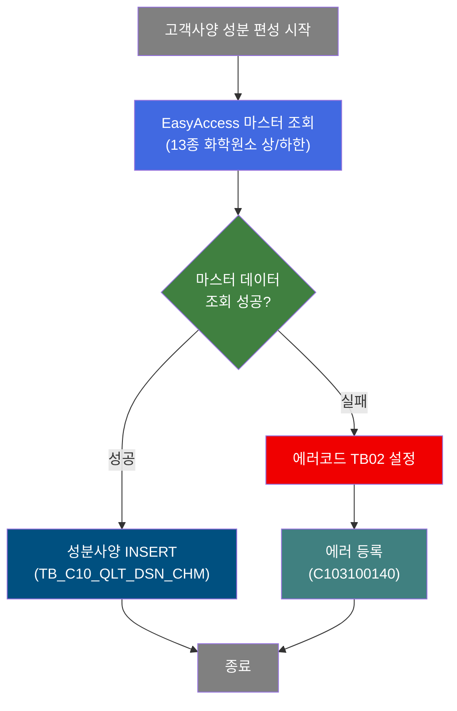
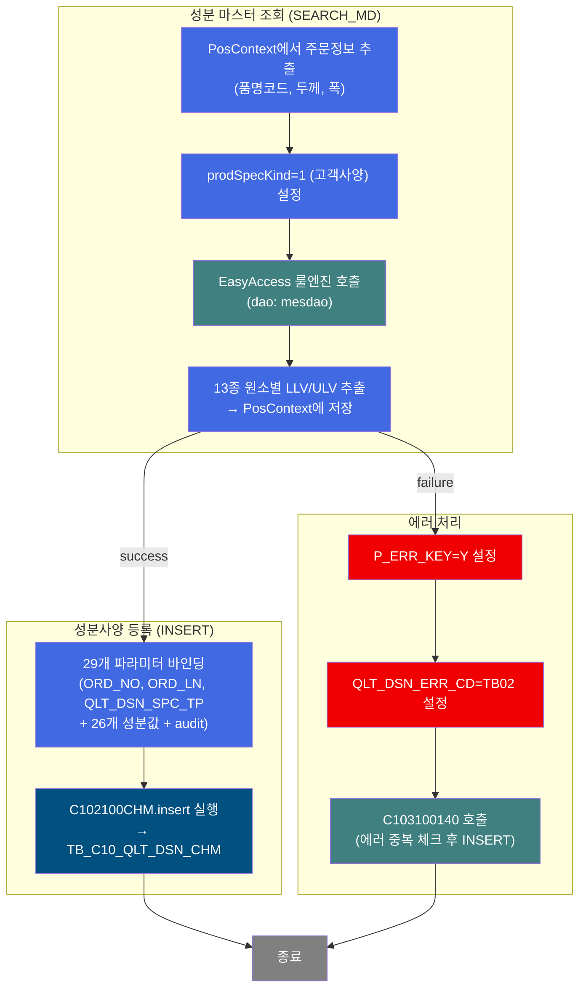
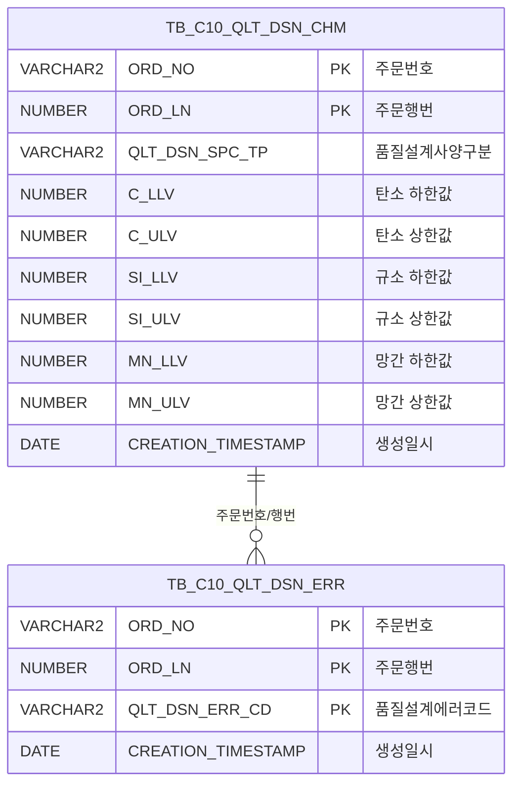

<h1 style="font-size: 40px; text-align: center; font-weight:
   bold; margin: 30px 0;">
  C102100040 레거시 시스템 분석 종합 보고서
</h1>


# 1. 시스템 개요
- **서비스 ID**: C102100040
- **업무명**: 고객사양(C) 성분 편성
- **분석 일시**: 2026-03-16 19:09 KST
- **분석 시간**: 약 2분
- **전체 Activity 수**: 4개 (Custom 1, Built-in 1, Common 2)
- **분석자**: Claude Opus 4.6
- **분석 도구**: /analyze-service C102100040
- **문서 버전**: 1.0

# 📊 비즈니스 프로세스 분석

## 시스템 목적

C102100040 서비스는 품질설계 자동화 프로세스에서 **고객사양(C) 기준의 성분(Chemical Composition) 데이터를 편성**하는 NUI(배치) 서비스이다. `prodSpecKind=1`(고객사양)로 설정되어 있어, 고객이 요구하는 화학성분 규격값(상한/하한)을 마스터 데이터(EasyAccess 룰 엔진)에서 조회하여 `TB_C10_QLT_DSN_CHM` 테이블에 INSERT한다.

처리 대상은 13종의 화학원소(C, SI, MN, P, S, CR, NI, CU, AL, TI, NB, V, N)이며, 각 원소별 하한값(LLV)과 상한값(ULV) 총 26개 성분 파라미터를 편성한다. DbSearchChemData 커스텀 클래스가 주문정보(품명코드, 두께, 폭 등)와 공정 목표값을 기반으로 EasyAccess 마스터를 조회하고, 조회 결과를 PosContext에 저장한 후 PosInsert가 DB에 등록한다.

에러 발생 시(마스터 데이터 미존재 등) 에러코드 `TB02`(성분CHM)를 설정하고, 서브서비스 C103100140을 호출하여 `TB_C10_QLT_DSN_ERR` 테이블에 에러 이력을 기록한다.

## 핵심 워크플로우 다이어그램



### 상세 워크플로우 다이어그램



## 주요 유즈케이스

### UC-01: 고객사양 성분 편성

- **Actor**: 품질설계 배치 프로세스 (상위 서비스 C102100030에서 호출)
- **목적**: 주문에 대한 고객 요구 화학성분 규격(13종 원소 상/하한값)을 마스터에서 조회하여 품질설계 성분 테이블에 등록

- **전제조건**:
  - 상위 서비스에서 주문번호(ORD_NO), 주문행번(ORD_LN) 등 주문정보가 PosContext에 설정됨
  - EasyAccess 마스터에 해당 품명코드/두께/폭 조건의 성분 규격 데이터가 존재
  - `TB_C10_QLT_DSN_CHM` 테이블에 해당 주문의 기존 성분 데이터가 삭제된 상태

- **주요 흐름**:
  1. SEARCH_MD Activity(DbSearchChemData)가 PosContext에서 주문정보 추출
  2. prodSpecKind=1(고객사양) 조건으로 EasyAccess 룰 엔진 조회
  3. 13종 화학원소(C, SI, MN, P, S, CR, NI, CU, AL, TI, NB, V, N)의 상/하한값 추출
  4. INSERT Activity가 C102100CHM.insert 쿼리로 29개 파라미터(주문키 3 + 성분값 26)를 TB_C10_QLT_DSN_CHM에 등록

- **대체 흐름**:
  - 마스터 데이터 미존재: ERROR_LOG에서 에러코드 TB02 설정 → C103100140 서브서비스로 에러 등록
  - EasyAccess 조회 실패: failure 전이로 에러 처리 경로 진입

- **후행조건**:
  - TB_C10_QLT_DSN_CHM에 고객사양 성분 레코드 1건 등록 (QLT_DSN_SPC_TP='C' 등)
  - 에러 시 TB_C10_QLT_DSN_ERR에 TB02 에러 레코드 등록

### UC-02: 성분 편성 실패 시 에러 기록

- **Actor**: 품질설계 배치 프로세스
- **목적**: 마스터 데이터 부재 등으로 성분 편성이 실패한 경우 에러 이력을 기록하여 후속 수동 처리를 가능하게 함

- **전제조건**:
  - SEARCH_MD Activity에서 마스터 조회 실패 (failure 전이)

- **주요 흐름**:
  1. ERROR_LOG Activity(DbSetParam)가 P_ERR_KEY=Y, QLT_DSN_ERR_CD=TB02 설정
  2. SUBSERVICE_ERR Activity가 C103100140-service 호출 (new-transaction=false, 기존 트랜잭션 공유)
  3. C103100140이 중복 에러 체크 후 TB_C10_QLT_DSN_ERR에 INSERT

- **대체 흐름**:
  - 동일 에러가 이미 등록된 경우: C103100140이 중복 체크로 INSERT 스킵

- **후행조건**:
  - TB_C10_QLT_DSN_ERR에 에러코드 TB02 레코드가 등록됨 (또는 이미 존재하여 스킵)

### UC-03: 다중 사양유형별 성분 편성 (컨텍스트)

- **Actor**: 품질설계 배치 프로세스
- **목적**: 동일한 DbSearchChemData 클래스가 prodSpecKind 값에 따라 고객/규격/사내/보증 4가지 유형의 성분을 편성

- **전제조건**:
  - 상위 서비스에서 prodSpecKind 프로퍼티를 적절히 설정하여 호출

- **주요 흐름**:
  1. C102100040은 prodSpecKind=1(고객사양)로 호출
  2. 동일 클래스 DbSearchChemData가 prodSpecKind 값에 따라 분기:
     - 1: 고객사양 마스터 조회
     - 2: 규격사양 마스터 조회
     - 3: 사내사양 마스터 조회
     - 4: 보증사양 마스터 조회
  3. 각 유형별로 동일한 INSERT 쿼리(C102100CHM.insert)로 저장하되 QLT_DSN_SPC_TP 값이 달라짐

- **대체 흐름**:
  - 해당 사양유형에 마스터 데이터가 없으면 에러 처리 경로로 진입

- **후행조건**:
  - 해당 사양유형의 성분 레코드가 TB_C10_QLT_DSN_CHM에 등록됨

---

## 비즈니스 로직 상세

### 1. 성분 마스터 조회 및 편성 (DbSearchChemData)

- **목적**: 주문 정보를 기반으로 EasyAccess 룰 엔진에서 13종 화학원소의 상/하한 규격값을 조회하여 PosContext에 세팅

- **처리 케이스**:

  **[케이스 1: 고객사양(prodSpecKind=1) 성분 조회]**
  ```
    조건: prodSpecKind = 1 (고객사양)
    처리:
      1. PosContext에서 bind-list(RK_SEARCH)로 주문정보 추출 (품명코드, 두께, 폭 등)
      2. EasyAccess 마스터에 고객사양 조건으로 조회
      3. 13종 원소별 LLV(하한)/ULV(상한) 값 추출
      4. bind-result(RK_MAIN)에 결과 저장
      5. 성공 시 success 전이 → INSERT Activity
  ```

  **[케이스 2: 마스터 데이터 미존재]**
  ```
    조건: EasyAccess 조회 결과 없음
    처리:
      1. failure 전이 → ERROR_LOG Activity
      2. 에러코드 TB02(성분CHM) 설정
      3. C103100140 서브서비스 호출하여 에러 등록
  ```

- **13종 화학원소 파라미터 매핑**:

  ```
  param3/4:   C_LLV / C_ULV    (탄소)
  param5/6:   SI_LLV / SI_ULV  (규소)
  param7/8:   MN_LLV / MN_ULV  (망간)
  param9/10:  P_LLV / P_ULV    (인)
  param11/12: S_LLV / S_ULV    (황)
  param13/14: CR_LLV / CR_ULV  (크롬)
  param15/16: NI_LLV / NI_ULV  (니켈)
  param17/18: CU_LLV / CU_ULV  (구리)
  param19/20: AL_LLV / AL_ULV  (알루미늄)
  param21/22: TI_LLV / TI_ULV  (티타늄)
  param23/24: NB_LLV / NB_ULV  (니오븀)
  param25/26: V_LLV / V_ULV    (바나듐)
  param27/28: N_LLV / N_ULV    (질소)
  ```

- **예외 처리**:
  - 마스터 데이터 미존재 → 에러코드 TB02 설정, 에러 등록 서브서비스 호출
  - EasyAccess 연결 실패 → failure 전이로 에러 처리 경로

---

# ⚙️ Java 컴포넌트 분석

## Custom Activity 상세 분석

### 1개 Custom Activity 발견

### 1. DbSearchChemData (SEARCH_MD)
- **클래스명**: com.unionsteel.mes.c10.activity.nui.DbSearchChemData
- **액티비티명**: SEARCH_MD
- **파일 경로**: src/com/unionsteel/mes/c10/activity/nui/DbSearchChemData.java
- **주요 기능**: 철강 제품의 성분사양(Chemical Composition Specification)을 편성하는 NUI 액티비티. 품질설계 프로세스에서 주문에 대한 성분 규격값(하한/상한)을 고객사양, 규격사양, 사내사양, 보증사양의 4가지 유형별로 조회·편성하여 PosContext에 저장.

#### 메소드 구조
- **주요 메소드**: runActivity
  - **반환 타입**: void (PosActivity 생명주기)
  - **파라미터**: PosContext ctx

#### 핵심 비즈니스 로직
- **prodSpecKind 기반 분기**: prodSpecKind 프로퍼티(1=고객, 2=규격, 3=사내, 4=보증)에 따라 조회 대상 마스터가 달라짐
- **EasyAccess 룰 엔진 조회**: 품명코드, 두께, 폭 등 주문 속성을 조건으로 마스터 데이터 조회
- **성분값 세팅**: 조회된 13종 원소의 상/하한값을 PosContext의 bind-result에 저장
- **결과 전이**: 성공 시 success(→INSERT), 실패 시 failure(→ERROR_LOG)

#### Java 상수 및 의존성
- **주요 상수**: C10NuiConstantsIF (NUI 공통 상수 인터페이스)
- **핵심 의존성**: PosActivity (GLUE Framework), PosContext, EasyAccess 룰 엔진

---

# 💾 데이터 요구사항

## 핵심 테이블

### 1. TB_C10_QLT_DSN_CHM - (품질설계 성분사양)
| 컬럼명 | 타입 | PK | 설명 |
|--------|------|----|------|
| ORD_NO | VARCHAR2 | ✅ | 주문번호 |
| ORD_LN | NUMBER | ✅ | 주문행번 |
| QLT_DSN_SPC_TP | VARCHAR2 | | 품질설계사양구분 (C=고객, S=규격, I=사내, D=보증) |
| C_LLV | NUMBER | | 탄소(C) 하한값 |
| C_ULV | NUMBER | | 탄소(C) 상한값 |
| SI_LLV | NUMBER | | 규소(SI) 하한값 |
| SI_ULV | NUMBER | | 규소(SI) 상한값 |
| MN_LLV | NUMBER | | 망간(MN) 하한값 |
| MN_ULV | NUMBER | | 망간(MN) 상한값 |
| P_LLV | NUMBER | | 인(P) 하한값 |
| P_ULV | NUMBER | | 인(P) 상한값 |
| S_LLV | NUMBER | | 황(S) 하한값 |
| S_ULV | NUMBER | | 황(S) 상한값 |
| CR_LLV | NUMBER | | 크롬(CR) 하한값 |
| CR_ULV | NUMBER | | 크롬(CR) 상한값 |
| NI_LLV | NUMBER | | 니켈(NI) 하한값 |
| NI_ULV | NUMBER | | 니켈(NI) 상한값 |
| CU_LLV | NUMBER | | 구리(CU) 하한값 |
| CU_ULV | NUMBER | | 구리(CU) 상한값 |
| AL_LLV | NUMBER | | 알루미늄(AL) 하한값 |
| AL_ULV | NUMBER | | 알루미늄(AL) 상한값 |
| TI_LLV | NUMBER | | 티타늄(TI) 하한값 |
| TI_ULV | NUMBER | | 티타늄(TI) 상한값 |
| NB_LLV | NUMBER | | 니오븀(NB) 하한값 |
| NB_ULV | NUMBER | | 니오븀(NB) 상한값 |
| V_LLV | NUMBER | | 바나듐(V) 하한값 |
| V_ULV | NUMBER | | 바나듐(V) 상한값 |
| N_LLV | NUMBER | | 질소(N) 하한값 |
| N_ULV | NUMBER | | 질소(N) 상한값 |
| CREATED_OBJECT_TYPE | VARCHAR2 | | 생성 Object 유형 |
| CREATED_OBJECT_ID | VARCHAR2 | | 생성 Object ID |
| CREATED_PROGRAM_ID | VARCHAR2 | | 생성 프로그램 ID |
| CREATION_TIMESTAMP | DATE | | 생성일시 |
| LAST_UPDATED_OBJECT_TYPE | VARCHAR2 | | 최종변경 Object 유형 |
| LAST_UPDATED_OBJECT_ID | VARCHAR2 | | 최종변경 Object ID |
| LAST_UPDATE_PROGRAM_ID | VARCHAR2 | | 최종변경 프로그램 ID |
| LAST_UPDATE_TIMESTAMP | DATE | | 최종변경일시 |

## 데이터 플로우

### 1. 성분사양 등록

```
[고객사양 성분 편성]
상위 서비스에서 호출
→ SEARCH_MD (DbSearchChemData)
  EasyAccess 룰 엔진 조회
  조건: 품명코드, 두께, 폭, prodSpecKind=1(고객사양)
  결과: 13종 원소별 LLV/ULV → PosContext(RK_MAIN)에 저장
→ INSERT (PosInsert)
  C102100CHM.insert 실행
  INTO TB_C10_QLT_DSN_CHM
  VALUES (ORD_NO, ORD_LN, QLT_DSN_SPC_TP,
          C_LLV~N_ULV 26개 성분값,
          audit 컬럼 8개)
→ 성분사양 등록 완료
```

### 2. 에러 등록

```
[성분 편성 실패 시 에러 등록]
SEARCH_MD failure 전이
→ ERROR_LOG (DbSetParam)
  P_ERR_KEY=Y, QLT_DSN_ERR_CD=TB02 설정
→ SUBSERVICE_ERR
  C103100140-service 호출 (new-transaction=false)
  → 에러 중복 체크 후 TB_C10_QLT_DSN_ERR INSERT
```

## SQL 일람표

| SQL 이름 | 쿼리 ID | 타입 | 출처 | 테이블 |
|---------|---------|------|------|--------|
| 성분사양 등록 | C102100CHM.insert | INSERT | Service | TB_C10_QLT_DSN_CHM |

## ER 다이어그램 (핵심 관계)



관계 설명:
- TB_C10_QLT_DSN_CHM이 중심 테이블로, 주문별 성분사양 데이터를 저장
- TB_C10_QLT_DSN_ERR은 편성 실패 시 에러코드(TB02)를 기록하며 ORD_NO, ORD_LN으로 연결
- 동일 주문에 여러 사양유형(C/S/I/D)의 성분 레코드가 존재할 수 있음

---

# 🔗 서브서비스

## 서브서비스 요약

| 서비스 ID | 설명 | 호출 액티비티 | 트랜잭션 | 상세 분석 |
|-----------|------|-------------|---------|----------|
| C103100140 | 품질설계결과 에러 등록 (중복 방지) | SUBSERVICE_ERR | 기존 트랜잭션 공유 | [상세 분석](./C103100140_legacy_analysis.md) |

### C103100140 - 품질설계결과 에러 등록
품질설계 과정에서 발생한 에러 정보를 TB_C10_QLT_DSN_ERR 테이블에 등록하는 서비스. 핵심 기능은 ORD_NO + ORD_LN + QLT_DSN_ERR_CD 복합키로 중복 체크 후 INSERT하는 것이다. Activity 2개, SQL 2개로 구성.

---

# 📌 특이사항 및 주의사항

## 1. prodSpecKind 기반 공유 클래스 패턴
- **동일 클래스 다중 서비스**: DbSearchChemData는 prodSpecKind 프로퍼티(1=고객, 2=규격, 3=사내, 4=보증)에 따라 4개의 서로 다른 서비스(C102100040/C102100030 계열)에서 사용됨
- **서비스 XML 프로퍼티로 분기 제어**: Java 코드 변경 없이 서비스 XML의 prodSpecKind 값만 달리하여 4가지 사양유형을 처리하는 구조

## 2. 위치기반 파라미터(?) 사용 및 29개 대량 바인딩
- **isNamed=false**: INSERT 쿼리가 명명 파라미터(:param)가 아닌 위치기반 파라미터(?)를 사용하여 29개 파라미터의 순서가 정확히 일치해야 함
- **파라미터 순서 의존성**: param0~param28의 순서가 INSERT 컬럼 순서와 1:1 매핑되므로, 순서 변경 시 데이터 무결성 오류 위험

## 3. 에러 처리의 트랜잭션 공유
- **new-transaction=false**: C103100140 서브서비스가 기존 트랜잭션을 공유하므로, 에러 등록이 메인 트랜잭션과 함께 커밋/롤백됨
- **중복 방지 우선**: C103100140이 Java 레벨에서 중복 체크를 수행하므로, DB 제약조건 위반 없이 안전하게 INSERT 수행

## 4. audit 컬럼 자동 채움
- **8개 감사 컬럼**: CREATED_OBJECT_TYPE, CREATED_OBJECT_ID, CREATED_PROGRAM_ID, CREATION_TIMESTAMP, LAST_UPDATED_OBJECT_TYPE, LAST_UPDATED_OBJECT_ID, LAST_UPDATE_PROGRAM_ID, LAST_UPDATE_TIMESTAMP
- **isAudit=true 설정**: PosInsert가 audit 컬럼을 자동 채움 (사용자ID, 프로그램ID, 현재시간 등)

---

# 📚 참고 문서

- **Query SQL**: `src/query/C102100CHM-query.glue_sql`
- **Service XML**: `src/service/C102100040-service.xml`
- **Custom Java 클래스**:
  - `src/com/unionsteel/mes/c10/activity/nui/DbSearchChemData.java`
- **서브서비스 분석**: `docs/analysis/service/nui/C103100140_legacy_analysis.md`
