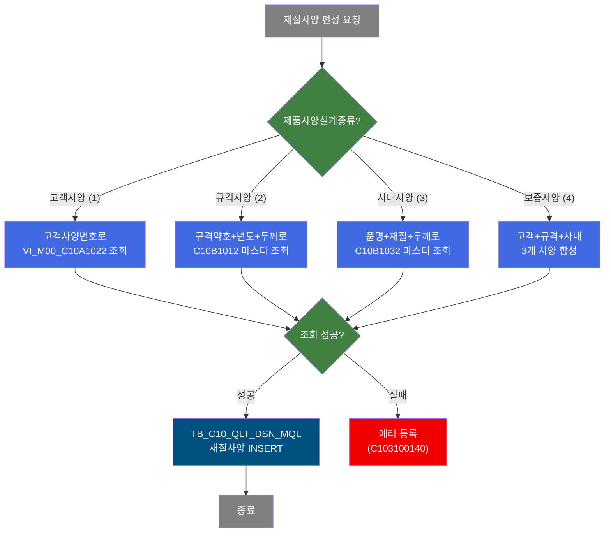
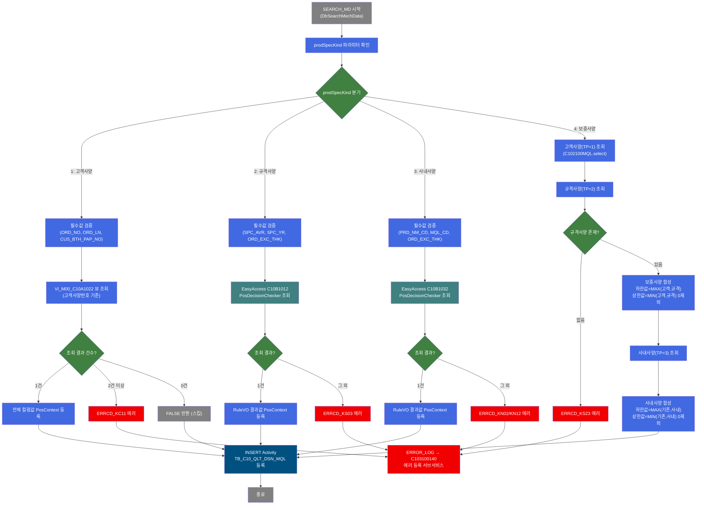
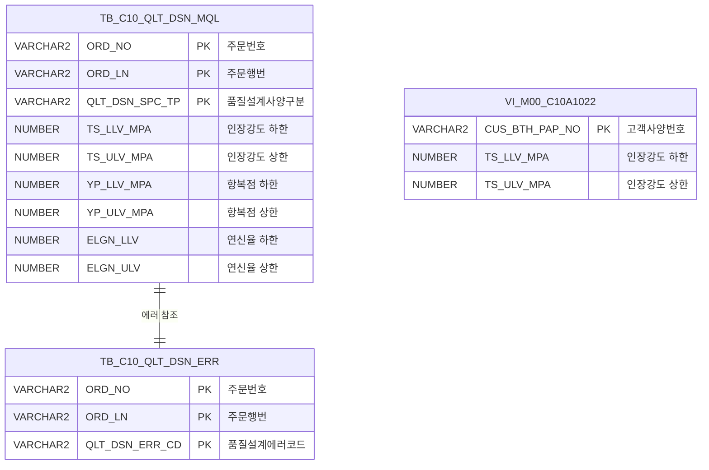

<h1 style="font-size: 40px; text-align: center; font-weight:
   bold; margin: 30px 0;">
  C102100050 레거시 시스템 분석 종합 보고서
</h1>


# 1. 시스템 개요
- **서비스 ID**: C102100050
- **업무명**: 품질설계 재질사양(MQL) 편성 및 등록
- **분석 일시**: 2026-03-16 19:00 KST
- **분석 시간**: 약 2분
- **전체 Activity 수**: 4개 (Custom 1, Built-in 3)
- **분석자**: Claude Opus 4.6
- **분석 도구**: /analyze-service C102100050
- **문서 버전**: 1.0

# 📊 비즈니스 프로세스 분석

## 시스템 목적

C102100050 서비스는 주문에 대한 재질사양(MQL: Mechanical Quality Level)을 마스터 데이터에서 조회하여 편성한 후 `TB_C10_QLT_DSN_MQL` 테이블에 등록하는 NUI(배치) 서비스이다. 품질설계 과정에서 제품의 기계적 성질(인장강도, 항복점, 연신율, 경도, 에나멜 등급) 및 도금량 기준을 설정하는 핵심 서비스이다.

서비스의 핵심 로직은 `prodSpecKind`(제품사양설계종류) 파라미터에 따라 4가지 경로로 분기하여 마스터 데이터를 조회하는 것이다. 고객사양('1')은 고객사양번호로 VI_M00_C10A1022 뷰를 조회하고, 규격사양('2')은 규격약호+년도+두께로 C10B1012 마스터 테이블을, 사내사양('3')은 품명코드+재질코드+두께로 C10B1032 마스터 테이블을, 보증사양('4')은 고객+규격+사내 3개 사양을 합성하여 가장 엄격한 기준(하한값은 MAX, 상한값은 0이 아닌 MIN)을 적용한다.

조회된 재질사양 데이터는 PosContext에 등록된 후 INSERT Activity를 통해 `TB_C10_QLT_DSN_MQL` 테이블에 저장된다. 에러 발생 시 서브서비스 C103100140을 호출하여 에러 정보를 등록한다.

## 핵심 워크플로우 다이어그램



### 상세 워크플로우 다이어그램



## 주요 유즈케이스

### UC-01: 고객 재질사양 편성 (prodSpecKind=1)
- **Actor**: 품질설계 배치 프로세스
- **목적**: 고객이 요구한 재질사양을 마스터 뷰에서 조회하여 품질설계 결과에 등록

- **전제조건**:
  - 주문번호(ORD_NO), 주문행번(ORD_LN)이 PosContext에 설정됨
  - 고객사양번호(CUS_BTH_PAP_NO)가 존재함
  - VI_M00_C10A1022 마스터 뷰에 해당 고객사양 데이터가 등록되어 있음

- **주요 흐름**:
  1. prodSpecKind='1'로 DbSearchMechData Activity 실행
  2. 필수 파라미터(ORD_NO, ORD_LN, CUS_BTH_PAP_NO) Null 체크
  3. VI_M00_C10A1022 뷰에서 고객사양번호로 재질사양 조회
  4. 조회 결과가 1건이면 전체 컬럼값을 PosContext에 등록
  5. INSERT Activity가 TB_C10_QLT_DSN_MQL에 재질사양 등록

- **대체 흐름**:
  - 필수값 누락: ERRCD_KC02 에러 설정 → FAILURE 반환 → C103100140 에러 등록
  - 조회 결과 2건 이상: ERRCD_KC11 에러 설정 → FAILURE 반환
  - 조회 결과 0건: FALSE 반환 (에러 없이 스킵)

- **후행조건**:
  - TB_C10_QLT_DSN_MQL에 QLT_DSN_SPC_TP='1'인 재질사양 레코드 등록됨

### UC-02: 규격 재질사양 편성 (prodSpecKind=2)
- **Actor**: 품질설계 배치 프로세스
- **목적**: 규격(JIS/KS 등) 기반 재질사양을 마스터 의사결정 테이블에서 조회하여 등록

- **전제조건**:
  - 규격약호(SPC_AVR), 규격년도(SPC_YR), 주문환산두께(ORD_EXC_THK)가 PosContext에 설정됨
  - C10B1012 마스터 테이블에 해당 규격 재질 데이터가 등록되어 있음

- **주요 흐름**:
  1. prodSpecKind='2'로 DbSearchMechData Activity 실행
  2. 필수 파라미터(ORD_NO, ORD_LN, SPC_AVR, SPC_YR, ORD_EXC_THK) Null 체크
  3. EasyAccess.getPosDecisionChecker(C10B1012)로 마스터 의사결정 조회
  4. PosRuleVO 결과의 모든 항목명/값을 PosContext에 등록
  5. INSERT Activity가 TB_C10_QLT_DSN_MQL에 재질사양 등록

- **대체 흐름**:
  - 필수값 누락 또는 마스터 조회 실패: ERRCD_KS02/KS03 에러 → FAILURE
  - 조회 결과 2건 이상: ERRCD_KS03 에러 → FAILURE
  - 조회 결과 0건: ERRCD_KS03 에러 → FAILURE

- **후행조건**:
  - TB_C10_QLT_DSN_MQL에 QLT_DSN_SPC_TP='2'인 재질사양 레코드 등록됨

### UC-03: 사내 재질사양 편성 (prodSpecKind=3)
- **Actor**: 품질설계 배치 프로세스
- **목적**: 사내 자체 재질사양을 마스터 의사결정 테이블에서 조회하여 등록

- **전제조건**:
  - 품명코드(PRD_NM_CD), 재질코드(MQL_CD), 주문환산두께(ORD_EXC_THK)가 PosContext에 설정됨
  - C10B1032 마스터 테이블에 해당 사내 재질 데이터가 등록되어 있음

- **주요 흐름**:
  1. prodSpecKind='3'으로 DbSearchMechData Activity 실행
  2. 필수 파라미터(ORD_NO, ORD_LN, PRD_NM_CD, MQL_CD, ORD_EXC_THK) Null 체크
  3. EasyAccess.getPosDecisionChecker(C10B1032)로 마스터 의사결정 조회
  4. PosRuleVO 결과의 모든 항목명/값을 PosContext에 등록
  5. INSERT Activity가 TB_C10_QLT_DSN_MQL에 재질사양 등록

- **대체 흐름**:
  - 필수값 누락 또는 마스터 조회 실패: ERRCD_KN02 에러 → FAILURE
  - 조회 결과 2건 이상: ERRCD_KN12 에러 → FAILURE
  - 조회 결과 0건: ERRCD_KN02 에러 → FAILURE

- **후행조건**:
  - TB_C10_QLT_DSN_MQL에 QLT_DSN_SPC_TP='3'인 재질사양 레코드 등록됨

### UC-04: 보증사양 합성 편성 (prodSpecKind=4)
- **Actor**: 품질설계 배치 프로세스
- **목적**: 고객+규격+사내 3개 사양을 합성하여 가장 엄격한 보증사양을 생성

- **전제조건**:
  - 해당 주문에 대해 고객사양(TP=1), 규격사양(TP=2)이 TB_C10_QLT_DSN_MQL에 이미 등록됨
  - 주문번호(ORD_NO), 주문행번(ORD_LN)이 PosContext에 설정됨

- **주요 흐름**:
  1. prodSpecKind='4'로 DbSearchMechData Activity 실행
  2. 고객사양(TP=1) 조회 → 결과가 있으면 전체 컬럼값 PosContext 등록
  3. 규격사양(TP=2) 조회 → 결과 없으면 ERRCD_KS23 에러
  4. 보증사양 합성: 하한값(LLV)은 MAX(고객, 규격), 상한값(ULV)은 MIN(고객, 규격) 단 0 제외
  5. 사내사양(TP=3) 조회 → 결과 있으면 동일 합성 로직 적용
  6. INSERT Activity가 TB_C10_QLT_DSN_MQL에 보증사양(TP=4) 등록

- **대체 흐름**:
  - 규격사양 미존재: ERRCD_KS23 에러 → FAILURE → C103100140 에러 등록
  - DB 조회 예외: P_ERR_KEY=Y → FAILURE

- **후행조건**:
  - TB_C10_QLT_DSN_MQL에 QLT_DSN_SPC_TP='4'인 보증사양 레코드 등록됨
  - 보증사양은 고객+규격+사내 중 가장 엄격한 기준이 적용됨

---
## 비즈니스 로직 상세

### 1. 보증사양 합성 로직 (DbSearchMechData, prodSpecKind=4)

- **목적**: 고객사양, 규격사양, 사내사양 3개의 재질사양을 합성하여 가장 엄격한(보수적인) 보증사양을 생성

- **처리 케이스**:

  **[케이스 1: 하한값(LLV) 합성 - MAX 적용]**
  ```
    대상 컬럼: TS_LLV_MPA, YP_LLV_MPA, ELGN_LLV, HRB_LLV, ER_LLV,
              TST_GW_FRN_LLV, TST_GW_BAK_LLV, TST_GW_TOT_LLV
    처리:
      1. 고객사양(TP=1) 값을 기준값으로 설정
      2. 규격사양(TP=2) 값과 비교하여 큰 값 적용 (DbCommonUtil.numCompare(기존, 신규, true))
      3. 사내사양(TP=3) 값과 비교하여 큰 값 적용
    비즈니스 의미: 하한값이 높을수록 엄격한 기준이므로 MAX를 적용
  ```

  **[케이스 2: 상한값(ULV) 합성 - MIN 적용 (0 제외)]**
  ```
    대상 컬럼: TS_ULV_MPA, YP_ULV_MPA, ELGN_ULV, HRB_ULV, ER_ULV,
              TST_GW_FRN_ULV, TST_GW_BAK_ULV, TST_GW_TOT_ULV
    처리:
      1. 고객사양(TP=1) 값을 기준값으로 설정
      2. 규격사양(TP=2) 값과 비교하여 NULL/0이 아닌 작은 값 적용 (DbCommonUtil.numCompare(기존, 신규, false))
      3. 사내사양(TP=3) 값과 비교하여 NULL/0이 아닌 작은 값 적용
    비즈니스 의미: 상한값이 낮을수록 엄격한 기준이므로 MIN을 적용, 단 0은 미설정으로 간주하여 제외
  ```

  **[케이스 3: 비수치 컬럼 처리]**
  ```
    대상: LLV/ULV 이외의 컬럼 (MQL_BND_TST_STD_CD, TST_PIC_GTH_INST_LOC 등)
    처리:
      1. 고객사양 값이 존재하면 고객사양 값 유지
      2. 고객사양 값이 NULL이면 규격사양 값으로 대체
      3. 규격사양 값도 NULL이면 사내사양 값으로 대체
    비즈니스 의미: 고객 요구가 최우선, 없으면 규격, 그래도 없으면 사내 기준 적용
  ```

- **계산 공식**:

  ```
  보증사양_하한값 = MAX(고객사양_하한값, 규격사양_하한값, 사내사양_하한값)
  보증사양_상한값 = MIN_NON_ZERO(고객사양_상한값, 규격사양_상한값, 사내사양_상한값)

  예시:
  고객 TS_LLV_MPA=270, 규격 TS_LLV_MPA=300, 사내 TS_LLV_MPA=280
  → 보증 TS_LLV_MPA = MAX(270, 300, 280) = 300 MPa

  고객 TS_ULV_MPA=450, 규격 TS_ULV_MPA=0(미설정), 사내 TS_ULV_MPA=430
  → 보증 TS_ULV_MPA = MIN_NON_ZERO(450, 0, 430) = 430 MPa
  ```

- **예외 처리**:
  - 규격사양 미존재: ERRCD_KS23 "규격사양 조회 불가" → 보증사양 생성 불가
  - 고객사양 미존재: 에러 없이 규격+사내 사양만으로 합성 진행
  - DB 조회 예외: P_ERR_KEY=Y 설정 후 FAILURE 반환

### 2. 마스터 데이터 의사결정 조회 (규격/사내 사양)

- **목적**: GLUE Framework의 EasyAccess 마스터 데이터 관리 기능을 활용하여 규격 또는 사내 재질사양 기준값을 조회

- **처리 케이스**:

  **[케이스 1: 규격사양 조회 (C10B1012)]**
  ```
    조건: prodSpecKind = '2'
    처리:
      1. Key 구성: 규격약호(SPC_AVR) + 규격년도(SPC_YR) + 주문환산두께(ORD_EXC_THK)
      2. EasyAccess.getPosDecisionChecker("C10B1012") 호출
      3. PosRuleVO에서 재질사양 항목값 추출
      4. 조회 결과 정확히 1건만 허용
  ```

  **[케이스 2: 사내사양 조회 (C10B1032)]**
  ```
    조건: prodSpecKind = '3'
    처리:
      1. Key 구성: 품명코드(PRD_NM_CD) + 재질코드(MQL_CD) + 주문환산두께(ORD_EXC_THK)
      2. EasyAccess.getPosDecisionChecker("C10B1032") 호출
      3. PosRuleVO에서 재질사양 항목값 추출
      4. 조회 결과 정확히 1건만 허용
  ```

- **예외 처리**:
  - MasterDataException: 마스터 데이터 조회 실패 → 해당 에러코드 설정
  - 결과 0건: 해당 사양 기준 미등록 → 에러
  - 결과 2건 이상: 마스터 데이터 중복 → 에러

---

# ⚙️ Java 컴포넌트 분석

## Custom Activity 상세 분석

### 1개 Custom Activity 발견

### 1. DbSearchMechData (SEARCH_MD)
- **클래스명**: com.unionsteel.mes.c10.activity.nui.DbSearchMechData
- **액티비티명**: SEARCH_MD
- **파일 경로**: src/com/unionsteel/mes/c10/activity/nui/DbSearchMechData.java
- **주요 기능**: 제품사양설계종류(prodSpecKind)에 따라 4가지 경로로 분기하여 마스터 데이터에서 재질사양을 조회·합성하고 PosContext에 등록
- **라인 수**: 497 | **메소드 수**: 1

#### 메소드 구조
- **주요 메소드**: runActivity
  - **반환 타입**: String (SUCCESS/FAILURE/FALSE)
  - **파라미터**: PosContext ctx

#### SQL 매핑 (총 2개)
| SQL 이름 | 쿼리 ID | 타입 | 테이블 |
|---------|---------|-----|-------|
| 고객재질View 조회 | VI_M00_C10A1022 (dao.find) | SELECT | VI_M00_C10A1022 |
| 기등록 재질사양 조회 | C102100MQL.select (dao.find) | SELECT | TB_C10_QLT_DSN_MQL |

#### 핵심 비즈니스 로직
- **prodSpecKind 분기**: '1'=고객사양(뷰 조회), '2'=규격사양(C10B1012), '3'=사내사양(C10B1032), '4'=보증사양(3개 합성)
- **보증사양 합성**: 하한값은 MAX, 상한값은 MIN(0 제외)으로 가장 엄격한 기준 적용
- **EasyAccess 마스터 조회**: PosDecisionChecker를 통한 의사결정 테이블 조회 (규격/사내)
- **에러 코드 체계**: KC(고객), KS(규격), KN(사내) 접두어로 에러 원인 구분

#### Java 상수 및 의존성
- **주요 상수**: C10NuiConstantsIF (NUM1~NUM4, ERRCD_KC02/KC11/KS02/KS03/KS23/KN02/KN12, SELECT_MQL, C10B1012, C10B1032, VI_M00_C10A1022)
- **핵심 의존성**: PosActivity, EasyAccess, PosDecisionChecker, PosRuleVO, DbCommonUtil, PosGenericDao

---

# 💾 데이터 요구사항

## 핵심 테이블

### 1. TB_C10_QLT_DSN_MQL - (품질설계 재질사양)
| 컬럼명 | 타입 | PK | 설명 |
|--------|------|----|-----|
| ORD_NO | VARCHAR2 | ✅ | 주문번호 |
| ORD_LN | VARCHAR2 | ✅ | 주문행번 |
| QLT_DSN_SPC_TP | VARCHAR2 | ✅ | 품질설계사양구분 (1=고객, 2=규격, 3=사내, 4=보증) |
| TS_LLV_MPA | NUMBER | | TS(인장강도) 하한값 MPa |
| TS_ULV_MPA | NUMBER | | TS(인장강도) 상한값 MPa |
| YP_LLV_MPA | NUMBER | | YP(항복점) 하한값 MPa |
| YP_ULV_MPA | NUMBER | | YP(항복점) 상한값 MPa |
| ELGN_LLV | NUMBER | | 연신율 하한값 |
| ELGN_ULV | NUMBER | | 연신율 상한값 |
| HRB_LLV | NUMBER | | HRB(경도) 하한값 |
| HRB_ULV | NUMBER | | HRB(경도) 상한값 |
| ER_LLV | NUMBER | | ER(에나멜) 하한값 |
| ER_ULV | NUMBER | | ER(에나멜) 상한값 |
| MQL_BND_TST_STD_CD | VARCHAR2 | | 재질BENDING시험기준코드 |
| TST_PIC_GTH_INST_LOC | VARCHAR2 | | 시편채취지시위치 |
| TST_PIC_GTH_INST_LTH | VARCHAR2 | | 시편채취지시길이 |
| TPG_RGS_NO | VARCHAR2 | | 시편호수 |
| TST_GW_FRN_LLV | NUMBER | | 시험도금량 전면 하한값 |
| TST_GW_FRN_ULV | NUMBER | | 시험도금량 전면 상한값 |
| TST_GW_BAK_LLV | NUMBER | | 시험도금량 후면 하한값 |
| TST_GW_BAK_ULV | NUMBER | | 시험도금량 후면 상한값 |
| TST_GW_TOT_LLV | NUMBER | | 시험도금량 전체 하한값 |
| TST_GW_TOT_ULV | NUMBER | | 시험도금량 전체 상한값 |
| CREATED_OBJECT_TYPE | VARCHAR2 | | 생성 OBJECT 유형 |
| CREATED_OBJECT_ID | VARCHAR2 | | 생성 OBJECT ID |
| CREATED_PROGRAM_ID | VARCHAR2 | | 생성 프로그램 ID |
| CREATION_TIMESTAMP | DATE | | 생성일시 |
| LAST_UPDATED_OBJECT_TYPE | VARCHAR2 | | 최종변경 OBJECT 유형 |
| LAST_UPDATED_OBJECT_ID | VARCHAR2 | | 최종변경 OBJECT ID |
| LAST_UPDATE_PROGRAM_ID | VARCHAR2 | | 최종변경 프로그램 ID |
| LAST_UPDATE_TIMESTAMP | DATE | | 최종변경일시 |

## 데이터 플로우

### 1. 재질사양 편성 및 등록
```
[마스터 데이터 조회]
prodSpecKind에 따라 분기
→ prodSpecKind=1: dao.find(VI_M00_C10A1022, 고객사양번호)
  FROM VI_M00_C10A1022 (M00APUSER 마스터 뷰)
  WHERE 고객사양번호 = ?
→ prodSpecKind=2: EasyAccess.getPosDecisionChecker(C10B1012)
  마스터 의사결정 테이블에서 규격약호+년도+두께 기준 조회
→ prodSpecKind=3: EasyAccess.getPosDecisionChecker(C10B1032)
  마스터 의사결정 테이블에서 품명+재질+두께 기준 조회
→ prodSpecKind=4: dao.find(C102100MQL.select) × 3회
  FROM TB_C10_QLT_DSN_MQL
  WHERE ORD_NO = ? AND ORD_LN = ? AND QLT_DSN_SPC_TP = ?
  (TP=1, TP=2, TP=3 순서로 조회 후 합성)

[재질사양 등록]
→ C102100MQL.insert
  INSERT INTO TB_C10_QLT_DSN_MQL
  VALUES(ORD_NO, ORD_LN, QLT_DSN_SPC_TP, 재질사양 컬럼 23개, 감사 컬럼 8개)
```

### 2. 에러 처리
```
[에러 발생 시]
→ ERROR_LOG Activity: P_ERR_KEY=Y, QLT_DSN_ERR_CD 설정
→ C103100140 서브서비스 호출
  INSERT INTO TB_C10_QLT_DSN_ERR (중복 체크 후 등록)
```

## SQL 일람표
| SQL 이름 | 쿼리 ID | 타입 | 출처 | 테이블 |
|---------|---------|-----|-------|-------|
| 재질사양 등록 | C102100MQL.insert | INSERT | Service | TB_C10_QLT_DSN_MQL |
| 고객재질뷰 조회 | VI_M00_C10A1022 (dao.find) | SELECT | DbSearchMechData.java | VI_M00_C10A1022 |
| 기등록 재질사양 조회 | C102100MQL.select (dao.find) | SELECT | DbSearchMechData.java | TB_C10_QLT_DSN_MQL |

## ER 다이어그램 (핵심 관계)



관계 설명:
- TB_C10_QLT_DSN_MQL이 중심 테이블로 주문별 재질사양 정보 관리
- 동일 주문(ORD_NO+ORD_LN)에 대해 최대 4개 사양구분(1~4) 레코드 존재
- VI_M00_C10A1022는 M00APUSER 마스터 뷰로 고객사양 소스 데이터 제공
- TB_C10_QLT_DSN_ERR은 재질사양 편성 실패 시 에러 정보 기록

---

# 🔗 서브서비스

## 서브서비스 요약

| 서비스 ID | 설명 | 호출 액티비티 | 트랜잭션 | 상세 분석 |
|-----------|------|-------------|---------|----------|
| C103100140 | 품질설계결과 에러 등록 (중복 방지) | SUBSERVICE_ERR | 신규 트랜잭션 | [상세 분석](./C103100140_legacy_analysis.md) |

### C103100140 - 품질설계결과 에러 등록
재질사양 편성 과정에서 에러가 발생하면 호출되는 서브서비스로, TB_C10_QLT_DSN_ERR 테이블에 에러 정보를 등록한다. 주문번호+행번+에러코드 복합키로 중복 체크 후 미존재 시에만 INSERT를 수행한다. Activity 2개(Custom 1, Built-in 1), SQL 1개로 구성된 단순 서비스이다.

# 📌 특이사항 및 주의사항

## 1. 보증사양 합성 시 0 값 처리
- **상한값 MIN 비교에서 0 제외**: `DbCommonUtil.numCompare(기존값, 신규값, false)`는 NULL이나 0을 "미설정"으로 간주하여 비교에서 제외한다. 이는 0이 "제한 없음"을 의미하는 업무 관행을 반영한 것이며, 마이그레이션 시 동일 로직을 반드시 구현해야 한다.

## 2. 고객사양 조회 0건 시 스킵 처리 (FALSE 반환)
- **prodSpecKind=1에서만 0건 시 에러가 아닌 FALSE 반환**: 고객사양이 없으면 에러가 아니라 단순 스킵으로 처리한다. 반면 규격사양(2)과 사내사양(3)은 0건 시 에러(FAILURE)를 반환한다. 이 비대칭적 처리는 고객사양이 선택적(optional)임을 나타낸다.

## 3. EasyAccess 마스터 데이터 의사결정 조회
- **GLUE Framework 고유 기능**: 규격사양(C10B1012)과 사내사양(C10B1032) 조회는 DB 직접 조회가 아닌 GLUE Framework의 EasyAccess/PosDecisionChecker를 사용한다. 이는 마스터 데이터 캐싱 및 의사결정 규칙 적용을 프레임워크가 관리하는 구조로, 마이그레이션 시 해당 마스터 테이블의 구조와 의사결정 규칙을 별도 분석해야 한다.

## 4. 보증사양(TP=4) 선행 의존성
- **보증사양은 반드시 고객(1)+규격(2)+사내(3) 사양이 먼저 등록된 후 실행되어야 한다**: 기등록된 TB_C10_QLT_DSN_MQL 데이터를 SELECT한 후 합성하므로, 실행 순서가 보장되지 않으면 불완전한 보증사양이 생성될 수 있다.

## 5. isNamed="false" SQL 바인딩
- **위치 기반(?) 바인딩 사용**: C102100MQL.insert 쿼리가 `isNamed="false"`로 설정되어 위치 기반(`?`) 파라미터를 사용한다. 컬럼 순서와 VALUES `?` 순서가 정확히 일치해야 하며, 총 31개 바인드 변수(비즈니스 23개 + 감사 8개)의 순서가 중요하다.

# 📚 참고 문서

- **Query SQL**: `src/query/C102100MQL-query.glue_sql`
- **Custom Java 클래스**:
  - `src/com/unionsteel/mes/c10/activity/nui/DbSearchMechData.java`
- **서브서비스 보고서**: `docs/analysis/service/nui/C103100140_legacy_analysis.md`
