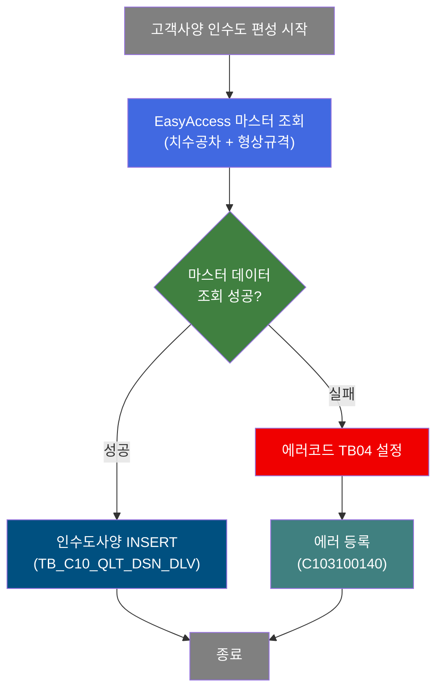
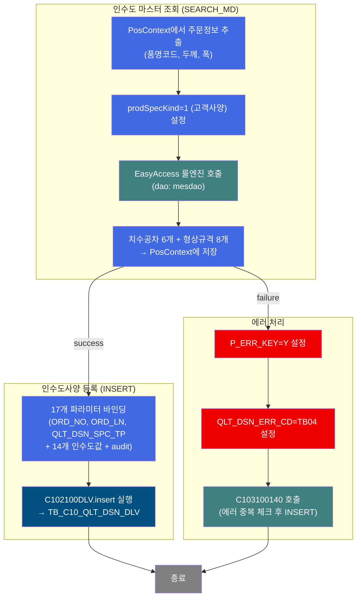
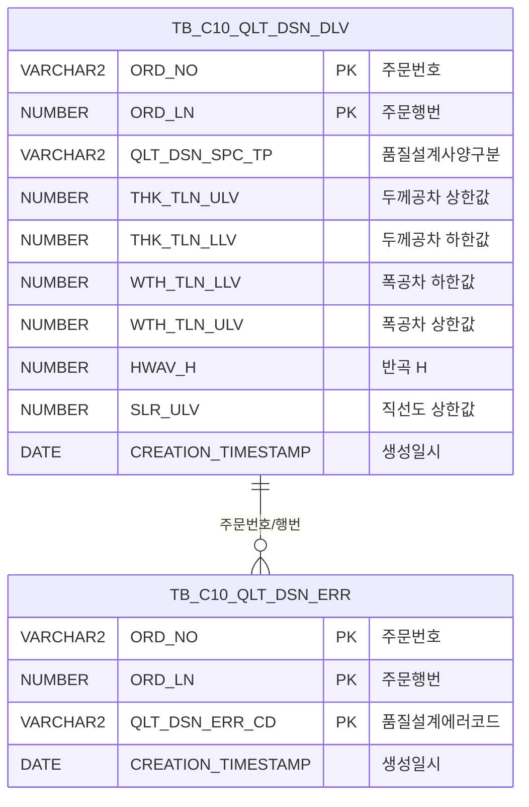

<h1 style="font-size: 40px; text-align: center; font-weight:
   bold; margin: 30px 0;">
  C102100060 레거시 시스템 분석 종합 보고서
</h1>


# 1. 시스템 개요
- **서비스 ID**: C102100060
- **업무명**: 고객사양(C) 인수도 편성
- **분석 일시**: 2026-03-16 19:15 KST
- **분석 시간**: 약 2분
- **전체 Activity 수**: 4개 (Custom 1, Built-in 1, Common 2)
- **분석자**: Claude Opus 4.6
- **분석 도구**: /analyze-service C102100060
- **문서 버전**: 1.0

# 📊 비즈니스 프로세스 분석

## 시스템 목적

C102100060 서비스는 품질설계 자동화 프로세스에서 **고객사양(C) 기준의 인수도(Delivery Specification) 데이터를 편성**하는 NUI(배치) 서비스이다. `prodSpecKind=1`(고객사양)로 설정되어 있어, 고객이 요구하는 치수 공차(두께/폭/길이)와 형상 규격(반곡/중곡/외곡/직선도/직각도/대각선차/급준도/TELESCOPE)을 마스터 데이터(EasyAccess 룰 엔진)에서 조회하여 `TB_C10_QLT_DSN_DLV` 테이블에 INSERT한다.

DbSearchDeliSpec 커스텀 클래스가 주문정보를 기반으로 마스터를 조회하고, 총 17개 파라미터(주문키 3 + 인수도 규격 14)를 PosContext에 저장한 후 PosInsert가 DB에 등록한다. 에러 발생 시 에러코드 `TB04`(인수도DLV)를 설정하고, 서브서비스 C103100140을 호출하여 에러 이력을 기록한다.

## 핵심 워크플로우 다이어그램



### 상세 워크플로우 다이어그램



## 주요 유즈케이스

### UC-01: 고객사양 인수도 편성

- **Actor**: 품질설계 배치 프로세스 (상위 서비스 C102100030에서 호출)
- **목적**: 주문에 대한 고객 요구 치수 공차(두께/폭/길이)와 형상 규격(반곡/중곡/외곡 등)을 마스터에서 조회하여 인수도 테이블에 등록

- **전제조건**:
  - 상위 서비스에서 주문번호(ORD_NO), 주문행번(ORD_LN) 등 주문정보가 PosContext에 설정됨
  - EasyAccess 마스터에 해당 품명코드/두께/폭 조건의 인수도 규격 데이터가 존재
  - `TB_C10_QLT_DSN_DLV` 테이블에 해당 주문의 기존 인수도 데이터가 삭제된 상태

- **주요 흐름**:
  1. SEARCH_MD Activity(DbSearchDeliSpec)가 PosContext에서 주문정보 추출
  2. prodSpecKind=1(고객사양) 조건으로 EasyAccess 룰 엔진 조회
  3. 치수공차 6개(THK_TLN_ULV/LLV, WTH_TLN_ULV/LLV, LTH_TLN_ULV/LLV) + 형상규격 8개(HWAV_H, MWAV_H, EWAV_H, SLR_ULV, RAR_ULV, DGLN_DIF_ULV, STPN, TLC) 추출
  4. INSERT Activity가 C102100DLV.insert 쿼리로 25개 파라미터(주문키 3 + 인수도값 14 + audit 8)를 TB_C10_QLT_DSN_DLV에 등록

- **대체 흐름**:
  - 마스터 데이터 미존재: ERROR_LOG에서 에러코드 TB04 설정 → C103100140 서브서비스로 에러 등록
  - EasyAccess 조회 실패: failure 전이로 에러 처리 경로 진입

- **후행조건**:
  - TB_C10_QLT_DSN_DLV에 고객사양 인수도 레코드 1건 등록
  - 에러 시 TB_C10_QLT_DSN_ERR에 TB04 에러 레코드 등록

### UC-02: 인수도 편성 실패 시 에러 기록

- **Actor**: 품질설계 배치 프로세스
- **목적**: 마스터 데이터 부재 등으로 인수도 편성이 실패한 경우 에러 이력을 기록

- **전제조건**:
  - SEARCH_MD Activity에서 마스터 조회 실패 (failure 전이)

- **주요 흐름**:
  1. ERROR_LOG Activity(DbSetParam)가 P_ERR_KEY=Y, QLT_DSN_ERR_CD=TB04 설정
  2. SUBSERVICE_ERR Activity가 C103100140-service 호출 (new-transaction=false)
  3. C103100140이 중복 에러 체크 후 TB_C10_QLT_DSN_ERR에 INSERT

- **대체 흐름**:
  - 동일 에러가 이미 등록된 경우: C103100140이 중복 체크로 INSERT 스킵

- **후행조건**:
  - TB_C10_QLT_DSN_ERR에 에러코드 TB04 레코드가 등록됨

### UC-03: 다중 사양유형별 인수도 편성 (컨텍스트)

- **Actor**: 품질설계 배치 프로세스
- **목적**: 동일한 DbSearchDeliSpec 클래스가 prodSpecKind 값에 따라 고객/규격/보증 유형의 인수도를 편성

- **전제조건**:
  - 상위 서비스에서 prodSpecKind 프로퍼티를 적절히 설정하여 호출

- **주요 흐름**:
  1. C102100060은 prodSpecKind=1(고객사양)로 호출
  2. DbSearchDeliSpec가 prodSpecKind 값에 따라 분기:
     - 1: 고객인수도사양 마스터 조회
     - 2: 규격인수도사양 마스터 조회
     - 4: 보증사양 마스터 조회 (사내사양=3은 별도 처리)
  3. 각 유형별로 동일한 INSERT 쿼리(C102100DLV.insert)로 저장하되 QLT_DSN_SPC_TP 값이 달라짐

- **대체 흐름**:
  - 해당 사양유형에 마스터 데이터가 없으면 에러 처리 경로로 진입

- **후행조건**:
  - 해당 사양유형의 인수도 레코드가 TB_C10_QLT_DSN_DLV에 등록됨

---

## 비즈니스 로직 상세

### 1. 인수도 마스터 조회 및 편성 (DbSearchDeliSpec)

- **목적**: 주문 정보를 기반으로 EasyAccess 룰 엔진에서 치수 공차(두께/폭/길이 상하한)와 형상 규격(반곡/중곡/외곡/직선도/직각도/대각선차/급준도/TELESCOPE)을 조회하여 PosContext에 세팅

- **처리 케이스**:

  **[케이스 1: 고객사양(prodSpecKind=1) 인수도 조회]**
  ```
    조건: prodSpecKind = 1 (고객사양)
    처리:
      1. PosContext에서 bind-list(RK_SEARCH)로 주문정보 추출
      2. EasyAccess 마스터에 고객사양 조건으로 조회
      3. 치수공차(THK/WTH/LTH의 TLN_ULV/LLV) + 형상규격(HWAV_H 등) 추출
      4. bind-result(RK_MAIN)에 결과 저장
      5. 성공 시 success 전이 → INSERT Activity
  ```

  **[케이스 2: 마스터 데이터 미존재]**
  ```
    조건: EasyAccess 조회 결과 없음
    처리:
      1. failure 전이 → ERROR_LOG Activity
      2. 에러코드 TB04(인수도DLV) 설정
      3. C103100140 서브서비스 호출하여 에러 등록
  ```

- **17개 인수도 파라미터 매핑**:

  ```
  [치수 공차 - 6개]
  param3/4:   THK_TLN_ULV / THK_TLN_LLV   (두께공차 상한/하한)
  param5/6:   WTH_TLN_LLV / WTH_TLN_ULV   (폭공차 하한/상한)
  param7/8:   LTH_TLN_LLV / LTH_TLN_ULV   (길이공차 하한/상한)

  [형상 규격 - 8개]
  param9:     HWAV_H                       (반곡 H)
  param10:    MWAV_H                       (중곡 H)
  param11:    EWAV_H                       (외곡 H)
  param12:    SLR_ULV                      (직선도 상한값)
  param13:    RAR_ULV                      (직각도 상한값)
  param14:    DGLN_DIF_ULV                 (대각선차 상한값)
  param15:    STPN                         (급준도)
  param16:    TLC                          (TELESCOPE)
  ```

- **예외 처리**:
  - 마스터 데이터 미존재 → 에러코드 TB04 설정, 에러 등록 서브서비스 호출
  - EasyAccess 연결 실패 → failure 전이로 에러 처리 경로

---

# ⚙️ Java 컴포넌트 분석

## Custom Activity 상세 분석

### 1개 Custom Activity 발견

### 1. DbSearchDeliSpec (SEARCH_MD)
- **클래스명**: com.unionsteel.mes.c10.activity.nui.DbSearchDeliSpec
- **액티비티명**: SEARCH_MD
- **파일 경로**: src/com/unionsteel/mes/c10/activity/nui/DbSearchDeliSpec.java
- **주요 기능**: 품질설계 NUI 프로세스에서 인수도사양(공차 기준)을 편성하는 클래스. prodSpecKind 값에 따라 고객인수도사양(1), 규격인수도사양(2), 보증사양(4) 세 가지 처리 경로로 분기하여, 두께/폭/길이 공차 하한/상한값과 형상 규격을 Master Data에서 조회하고 PosContext에 저장.

#### 메소드 구조
- **주요 메소드**: runActivity
  - **반환 타입**: void (PosActivity 생명주기)
  - **파라미터**: PosContext ctx

#### 핵심 비즈니스 로직
- **prodSpecKind 기반 분기**: 프로퍼티(1=고객, 2=규격, 4=보증)에 따라 조회 대상 마스터가 달라짐
- **EasyAccess 룰 엔진 조회**: 품명코드, 두께, 폭 등 주문 속성을 조건으로 마스터 데이터 조회
- **인수도값 세팅**: 조회된 치수공차 6개 + 형상규격 8개를 PosContext의 bind-result에 저장
- **결과 전이**: 성공 시 success(→INSERT), 실패 시 failure(→ERROR_LOG)

#### Java 상수 및 의존성
- **주요 상수**: C10NuiConstantsIF (NUI 공통 상수 인터페이스)
- **핵심 의존성**: PosActivity (GLUE Framework), PosContext, EasyAccess 룰 엔진

---

# 💾 데이터 요구사항

## 핵심 테이블

### 1. TB_C10_QLT_DSN_DLV - (품질설계 인수도사양)
| 컬럼명 | 타입 | PK | 설명 |
|--------|------|----|------|
| ORD_NO | VARCHAR2 | ✅ | 주문번호 |
| ORD_LN | NUMBER | ✅ | 주문행번 |
| QLT_DSN_SPC_TP | VARCHAR2 | | 품질설계사양구분 |
| THK_TLN_ULV | NUMBER | | 두께공차 상한값 |
| THK_TLN_LLV | NUMBER | | 두께공차 하한값 |
| WTH_TLN_LLV | NUMBER | | 폭공차 하한값 |
| WTH_TLN_ULV | NUMBER | | 폭공차 상한값 |
| LTH_TLN_LLV | NUMBER | | 길이공차 하한값 |
| LTH_TLN_ULV | NUMBER | | 길이공차 상한값 |
| HWAV_H | NUMBER | | 반곡 H |
| MWAV_H | NUMBER | | 중곡 H |
| EWAV_H | NUMBER | | 외곡 H |
| SLR_ULV | NUMBER | | 직선도 상한값 |
| RAR_ULV | NUMBER | | 직각도 상한값 |
| DGLN_DIF_ULV | NUMBER | | 대각선차 상한값 |
| STPN | NUMBER | | 급준도 |
| TLC | NUMBER | | TELESCOPE |
| CREATED_OBJECT_TYPE | VARCHAR2 | | 생성 Object 유형 |
| CREATED_OBJECT_ID | VARCHAR2 | | 생성 Object ID |
| CREATED_PROGRAM_ID | VARCHAR2 | | 생성 프로그램 ID |
| CREATION_TIMESTAMP | DATE | | 생성일시 |
| LAST_UPDATED_OBJECT_TYPE | VARCHAR2 | | 최종변경 Object 유형 |
| LAST_UPDATED_OBJECT_ID | VARCHAR2 | | 최종변경 Object ID |
| LAST_UPDATE_PROGRAM_ID | VARCHAR2 | | 최종변경 프로그램 ID |
| LAST_UPDATE_TIMESTAMP | DATE | | 최종변경일시 |

## 데이터 플로우

### 1. 인수도사양 등록

```
[고객사양 인수도 편성]
상위 서비스에서 호출
→ SEARCH_MD (DbSearchDeliSpec)
  EasyAccess 룰 엔진 조회
  조건: 품명코드, 두께, 폭, prodSpecKind=1(고객사양)
  결과: 치수공차 6개 + 형상규격 8개 → PosContext(RK_MAIN)에 저장
→ INSERT (PosInsert)
  C102100DLV.insert 실행
  INTO TB_C10_QLT_DSN_DLV
  VALUES (ORD_NO, ORD_LN, QLT_DSN_SPC_TP,
          14개 인수도값, audit 컬럼 8개)
→ 인수도사양 등록 완료
```

### 2. 에러 등록

```
[인수도 편성 실패 시 에러 등록]
SEARCH_MD failure 전이
→ ERROR_LOG (DbSetParam)
  P_ERR_KEY=Y, QLT_DSN_ERR_CD=TB04 설정
→ SUBSERVICE_ERR
  C103100140-service 호출 (new-transaction=false)
  → 에러 중복 체크 후 TB_C10_QLT_DSN_ERR INSERT
```

## SQL 일람표

| SQL 이름 | 쿼리 ID | 타입 | 출처 | 테이블 |
|---------|---------|------|------|--------|
| 인수도 사양 등록 | C102100DLV.insert | INSERT | Service | TB_C10_QLT_DSN_DLV |

## ER 다이어그램 (핵심 관계)



관계 설명:
- TB_C10_QLT_DSN_DLV가 중심 테이블로, 주문별 인수도사양 데이터를 저장
- TB_C10_QLT_DSN_ERR은 편성 실패 시 에러코드(TB04)를 기록하며 ORD_NO, ORD_LN으로 연결
- 동일 주문에 여러 사양유형의 인수도 레코드가 존재할 수 있음

---

# 🔗 서브서비스

## 서브서비스 요약

| 서비스 ID | 설명 | 호출 액티비티 | 트랜잭션 | 상세 분석 |
|-----------|------|-------------|---------|----------|
| C103100140 | 품질설계결과 에러 등록 (중복 방지) | SUBSERVICE_ERR | 기존 트랜잭션 공유 | [상세 분석](./C103100140_legacy_analysis.md) |

### C103100140 - 품질설계결과 에러 등록
품질설계 과정에서 발생한 에러 정보를 TB_C10_QLT_DSN_ERR 테이블에 등록하는 서비스. ORD_NO + ORD_LN + QLT_DSN_ERR_CD 복합키로 중복 체크 후 INSERT. Activity 2개, SQL 2개로 구성.

---

# 📌 특이사항 및 주의사항

## 1. prodSpecKind 기반 공유 클래스 패턴 (3가지 경로)
- **고객(1)/규격(2)/보증(4)**: DbSearchDeliSpec는 prodSpecKind에 따라 3가지 처리 경로로 분기 (성분 편성의 4가지와 달리 사내사양=3은 인수도에서 별도 처리)
- **서비스 XML 프로퍼티로 분기 제어**: Java 코드 변경 없이 서비스 XML의 prodSpecKind 값만 달리하여 다양한 사양유형을 처리

## 2. 위치기반 파라미터(?) 사용 및 25개 바인딩
- **isNamed=false**: INSERT 쿼리가 위치기반 파라미터(?)를 사용하여 25개 파라미터의 순서가 정확히 일치해야 함
- **param 순서와 컬럼 순서 불일치 주의**: XML의 param 번호(param3=THK_TLN_ULV)가 SQL의 컬럼 순서와 다름 - param7이 LTH_TLN_LLV인 반면 param10이 MWAV_H로 비연속적 매핑

## 3. 형상 규격의 단방향 제약
- **상한값만 존재하는 항목**: SLR_ULV(직선도), RAR_ULV(직각도), DGLN_DIF_ULV(대각선차)는 상한값만 있고 하한값이 없음 - 형상 품질은 "기준 이하"만 관리
- **H값 단일**: HWAV_H(반곡), MWAV_H(중곡), EWAV_H(외곡)은 상/하한이 아닌 단일 허용값

## 4. 에러 처리의 트랜잭션 공유
- **new-transaction=false**: C103100140 서브서비스가 기존 트랜잭션을 공유하므로, 에러 등록이 메인 트랜잭션과 함께 커밋/롤백됨
- **에러코드 TB04**: 인수도 편성 전용 에러코드로, TB02(성분), TB03(재질) 등과 구분됨

---

# 📚 참고 문서

- **Query SQL**: `src/query/C102100DLV-query.glue_sql`
- **Service XML**: `src/service/C102100060-service.xml`
- **Custom Java 클래스**:
  - `src/com/unionsteel/mes/c10/activity/nui/DbSearchDeliSpec.java`
- **서브서비스 분석**: `docs/analysis/service/nui/C103100140_legacy_analysis.md`
