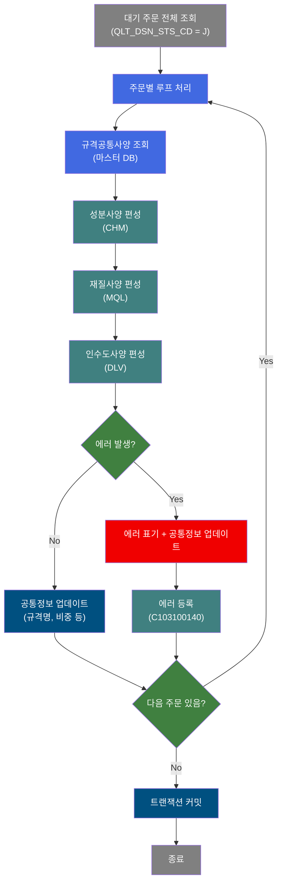
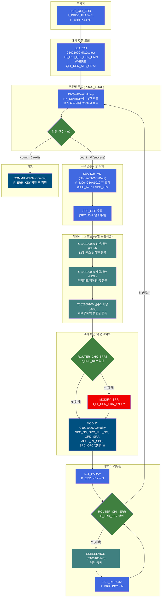
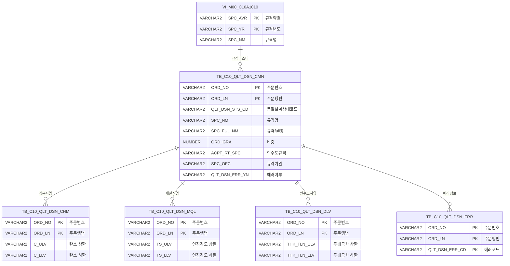

<h1 style="font-size: 40px; text-align: center; font-weight:
   bold; margin: 30px 0;">
  C102100070 레거시 시스템 분석 종합 보고서
</h1>


# 1. 시스템 개요
- **서비스 ID**: C102100070
- **업무명**: 품질설계 결과공통 배치 편성 (규격공통사양 + CHM/MQL/DLV)
- **분석 일시**: 2026-03-16 19:20 KST
- **분석 시간**: 약 3분
- **전체 Activity 수**: 16개 (Custom 2, Built-in 8, Common 6)
- **분석자**: Claude Opus 4.6
- **분석 도구**: /analyze-service C102100070
- **문서 버전**: 1.0

# 📊 비즈니스 프로세스 분석

## 시스템 목적

C102100070 서비스는 품질설계 대기 상태(`QLT_DSN_STS_CD='J'`)인 주문들을 일괄 처리하는 NUI(배치) 서비스이다. `TB_C10_QLT_DSN_CMN`(품질설계공통) 테이블에서 대기 주문을 전체 조회한 후, 각 주문에 대해 규격공통사양 조회 → 성분사양(CHM) 편성 → 재질사양(MQL) 편성 → 인수도사양(DLV) 편성 → 공통정보 업데이트를 순차적으로 수행한다.

각 주문 처리 단계에서 에러가 발생하면 에러 플래그(`P_ERR_KEY=Y`)를 설정하고, 품질설계 에러 여부(`QLT_DSN_ERR_YN='Y'`)를 표기한 후 에러 등록 서브서비스(C103100140)를 호출한다. 에러 발생 시에도 해당 주문의 규격정보 업데이트는 계속 수행하며, 처리를 중단하지 않고 다음 주문으로 진행한다. 모든 주문 처리 완료 후 트랜잭션을 커밋한다.

이 서비스는 4개의 서브서비스를 호출하는 오케스트레이터 역할을 하며, 품질설계 프로세스의 핵심 배치 처리를 담당한다.

## 핵심 워크플로우 다이어그램



### 상세 워크플로우 다이어그램



## 주요 유즈케이스

### UC-01: 품질설계 대기 주문 일괄 배치 처리
- **Actor**: 배치 스케줄러 (자동 실행)
- **목적**: 품질설계 대기 상태(J)인 모든 주문에 대해 규격공통사양, 성분사양, 재질사양, 인수도사양을 자동으로 편성하고 공통정보를 업데이트

- **전제조건**:
  - TB_C10_QLT_DSN_CMN에 QLT_DSN_STS_CD='J'인 주문이 1건 이상 존재
  - 마스터 데이터(VI_M00_C10A1010) 뷰에 규격사양 정보가 등록되어 있음
  - MESAPUSER 스키마 DB 접속 가능

- **주요 흐름**:
  1. INIT_QLT_ERR — 프로세스 플래그(P_PROC_FLAG=C) 및 에러키(P_ERR_KEY=N) 초기화
  2. SEARCH — C102100CMN.Jselect로 대기 주문 전체 조회 (RK_SEARCH)
  3. PROC_LOOP(DbQualDesignLoop) — RK_SEARCH에서 1건 추출, 11개 파라미터를 Context에 등록
  4. SEARCH_MD(DbSearchCmnData) — SPC_AVR(규격약호), SPC_YR(규격년도)로 VI_M00_C10A1010 뷰 조회
  5. SUBSERVICE_CHM(C102100080) — 성분사양 편성 (13개 원소 상하한)
  6. SUBSERVICE_MQL(C102100090) — 재질사양 편성 (인장강도, 항복점 등)
  7. SUBSERVICE_DLV(C102100100) — 인수도사양 편성 (치수공차, 형상품질)
  8. ROUTER_CHK_ERR5 — 에러 여부 확인 후 MODIFY 또는 MODIFY_ERR+MODIFY 실행
  9. MODIFY(C102100070.modify) — TB_C10_QLT_DSN_CMN에 규격명, 비중, 인수도규격, 규격기관 업데이트
  10. PROC_LOOP으로 복귀하여 다음 주문 처리

- **대체 흐름**:
  - 규격약호(SPC_AVR) 또는 규격년도(SPC_YR)가 null: ERRCD_KS01 에러코드 설정, P_ERR_KEY=Y로 전환하되 처리는 계속 진행
  - 서브서비스(CHM/MQL/DLV)에서 에러 발생: P_ERR_KEY=Y 설정, QLT_DSN_ERR_YN='Y'로 업데이트 후 에러 등록(C103100140) 실행
  - MODIFY 실패: ERROR_LOG2에서 P_ERR_KEY=Y, QLT_DSN_ERR_CD=TB01 설정 후 MODIFY_ERR → MODIFY 재시도

- **후행조건**:
  - 처리된 모든 주문의 TB_C10_QLT_DSN_CMN 규격정보가 업데이트됨
  - 에러 발생 주문은 QLT_DSN_ERR_YN='Y'로 표기, TB_C10_QLT_DSN_ERR에 에러 상세 등록됨
  - 트랜잭션 커밋 완료

### UC-02: 규격공통사양 마스터 조회 및 규격기관 추출
- **Actor**: 배치 프로세스 (SEARCH_MD Activity 내부)
- **목적**: 주문의 규격약호와 규격년도를 기반으로 마스터 데이터에서 규격공통사양을 조회하고, 규격기관 코드를 자동 추출

- **전제조건**:
  - PosContext에 SPC_AVR(규격약호), SPC_YR(규격년도) 값이 존재
  - M00APUSER 스키마의 VI_M00_C10A1010 뷰 접근 가능

- **주요 흐름**:
  1. prodSpecKind(=2, 규격사양) 값을 QLT_DSN_SPC_TP로 Context에 등록
  2. SPC_AVR, SPC_YR 값의 null 여부 확인
  3. VI_M00_C10A1010 뷰에서 규격년도, 규격약호 파라미터로 조회
  4. SPC_AVR 앞 2자리를 추출하여 SPC_OFC(규격기관) 값으로 Context에 등록

- **대체 흐름**:
  - SPC_AVR 또는 SPC_YR가 null: QLT_DSN_ERR_CD=KS01, P_ERR_KEY=Y 설정 (처리는 중단하지 않고 success 반환)
  - 뷰 조회 예외 발생: rowset=null로 설정, 에러 로그 기록 후 계속 진행
  - SPC_AVR 길이가 2 이하: SPC_OFC 추출 스킵

- **후행조건**:
  - 규격공통사양 정보가 PosContext에 등록됨
  - SPC_OFC(규격기관)이 Context에 설정됨

### UC-03: 에러 발생 시 에러 등록 및 계속 처리
- **Actor**: 배치 프로세스 (ROUTER_CHK_ERR 분기)
- **목적**: 품질설계 과정에서 에러가 발생한 주문에 대해 에러 정보를 등록하고, 배치 처리를 중단하지 않고 다음 주문으로 계속 진행

- **전제조건**:
  - MODIFY 또는 서브서비스에서 에러 발생으로 P_ERR_KEY=Y 상태
  - QLT_DSN_ERR_CD에 에러코드가 설정됨 (TB01: 공통정보 업데이트 에러, TB02: CHM 에러, TB03: MQL 에러, TB04: DLV 에러)

- **주요 흐름**:
  1. ROUTER_CHK_ERR에서 P_ERR_KEY=Y 감지 → error 전이
  2. SUBSERVICE(C103100140) 호출 — 주문번호+주문행번+에러코드 복합키로 중복 확인 후 INSERT
  3. SET_PARAM2 — P_ERR_KEY=N으로 초기화
  4. ROUTER_CHK_ERR로 복귀 → P_ERR_KEY=N이므로 success → PROC_LOOP으로 다음 주문 처리

- **대체 흐름**:
  - 동일 에러코드가 이미 등록된 경우: C103100140 서브서비스 내부에서 중복 방지 처리 (INSERT 스킵)

- **후행조건**:
  - TB_C10_QLT_DSN_ERR에 에러 레코드 등록 완료
  - P_ERR_KEY=N으로 초기화되어 다음 주문 처리 가능 상태

---

## 비즈니스 로직 상세

### 1. 주문 루프 처리 로직 (DbQualDesignLoop)

- **목적**: 대기 주문 ResultSet을 1건씩 순회하며, 각 주문의 핵심 파라미터를 Context에 등록하고 후속 Activity 체인을 제어

- **처리 케이스**:

  **케이스 1: 초기 실행 (countName 변수 미설정)**
  ```
    조건: PosContext에 QLT_DSN_STS_CD_COUNT 값이 null
    처리:
      1. RK_SEARCH ResultSet의 전체 건수를 카운터 초기값으로 설정
      2. BATCH_JOB=true 플래그 설정
      3. P_ERR_KEY=N, QLT_DSN_ERR_YN=공백 초기화
      4. 카운터를 1 감소하고 현재 처리 대상 행 번호 계산
      5. 해당 행의 11개 파라미터를 Context에 등록
      6. success 반환 → SEARCH_MD로 진행
  ```

  **케이스 2: 반복 실행 (다음 건 처리)**
  ```
    조건: QLT_DSN_STS_CD_COUNT > 0
    처리:
      1. 카운터를 1 감소
      2. 현재 행 번호 = 전체건수 - 남은카운터
      3. ResultSet을 순회하여 해당 행의 데이터 추출
      4. 11개 파라미터를 Context에 등록
      5. success 반환 → SEARCH_MD로 진행
  ```

  **케이스 3: 루프 종료**
  ```
    조건: QLT_DSN_STS_CD_COUNT == 0
    처리:
      1. 카운터 변수 Context에서 제거
      2. exit 반환 → COMMIT으로 진행
  ```

- **파라미터 매핑** (11개):

  ```
  param0:  ORD_NO → ORD_NO          (주문번호)
  param1:  ORD_LN → ORD_LN          (주문행번)
  param2:  SPC_AVR → SPC_AVR        (규격약호)
  param3:  SPC_YR → SPC_YR          (규격년도)
  param4:  PRD_NM_CD → PRD_NM_CD    (제품명코드)
  param5:  PRD_SHP → PRD_SHP        (제품형상)
  param6:  ORD_EXC_THK → ORD_EXC_THK (주문실적두께)
  param7:  ORD_EXC_WTH → ORD_EXC_WTH (주문실적폭)
  param8:  ORD_EXC_LTH → ORD_EXC_LTH (주문실적길이)
  param9:  ACPT_RT_SPC → ACPT_RT_SPC (인수도규격)
  param10: ORD_EDG_ASG_TP → ORD_EDG_ASG_TP (주문엣지배정유형)
  ```

- **예외 처리**:
  - param-count가 null: FAILURE 반환
  - Exception 발생: 에러 로그 기록 후 FAILURE 반환

### 2. 규격공통사양 조회 로직 (DbSearchCmnData)

- **목적**: 마스터 DB(M00APUSER)의 규격공통 뷰(VI_M00_C10A1010)에서 규격사양 기준 데이터를 조회하고 규격기관 코드를 자동 추출

- **처리 케이스**:

  **케이스 1: 정상 조회**
  ```
    조건: SPC_AVR(규격약호)과 SPC_YR(규격년도) 모두 존재
    처리:
      1. QLT_DSN_SPC_TP = prodSpecKind(2) 설정
      2. VI_M00_C10A1010 뷰 조회 (파라미터: SPC_YR, SPC_AVR)
      3. SPC_AVR 앞 2자리 → SPC_OFC(규격기관) 추출
      4. SUCCESS 반환
  ```

  **케이스 2: 규격약호/년도 누락**
  ```
    조건: SPC_AVR 또는 SPC_YR가 null
    처리:
      1. QLT_DSN_ERR_CD = ERRCD_KS01 설정
      2. P_ERR_KEY = Y 설정 (에러 플래그 활성화)
      3. 에러 로그 기록
      4. 뷰 조회는 계속 수행 (null 파라미터로)
      5. SUCCESS 반환 (에러여도 처리 중단하지 않음)
  ```

- **예외 처리**:
  - VI_M00_C10A1010 뷰 조회 실패 (Exception): rowset=null 설정, 에러 로그 기록 후 계속 진행
  - SPC_AVR 길이 ≤ 2: SPC_OFC 추출 스킵

### 3. 에러 코드 체계

- **목적**: 품질설계 각 단계별 에러를 코드로 구분하여 TB_C10_QLT_DSN_ERR에 등록

- **에러 코드 분류**:
  ```
  KS01 : 규격약호(SPC_AVR) 또는 규격년도(SPC_YR) 누락 (DbSearchCmnData)
  TB01 : 품질설계 공통정보 업데이트 에러 (MODIFY Activity failure)
  TB02 : 성분사양(CHM) 편성 에러 (C102100080 서브서비스)
  TB03 : 재질사양(MQL) 편성 에러 (C102100090 서브서비스)
  TB04 : 인수도사양(DLV) 편성 에러 (C102100100 서브서비스)
  ```

---

# ⚙️ Java 컴포넌트 분석

## Custom Activity 상세 분석

### 2개 Custom Activity 발견

### 1. DbQualDesignLoop (PROC_LOOP)
- **클래스명**: com.unionsteel.mes.c10.activity.nui.DbQualDesignLoop
- **액티비티명**: PROC_LOOP
- **파일 경로**: src/com/unionsteel/mes/c10/activity/nui/DbQualDesignLoop.java
- **주요 기능**: ResultSet 루프 제어 — 대기 주문을 1건씩 순회하며 파라미터를 Context에 등록

#### 메소드 구조
- **주요 메소드**: runActivity(PosContext ctx)
  - **반환 타입**: String (SUCCESS / EXIT / FAILURE)
  - **파라미터**: PosContext ctx

#### 핵심 비즈니스 로직
- **루프 카운터 관리**: countName 프로퍼티로 지정된 변수(QLT_DSN_STS_CD_COUNT)를 사용하여 남은 처리 건수를 추적. 초회 실행 시 ResultSet 전체 건수로 초기화, 매 반복마다 1씩 감소
- **역순 행 탐색**: this_row = total_row - procCount 공식으로 첫 번째 행부터 순차 처리. ResultSet을 매번 reset() 후 while(hasNext())로 해당 행까지 순회
- **파라미터 바인딩**: "저장변수명|대상항목명" 형식의 프로퍼티를 파이프로 분리하여 ResultSet 행의 컬럼값을 Context에 등록
- **배치 플래그**: BATCH_JOB=true를 Context에 설정하여 후속 서비스가 배치 처리임을 인식

#### Java 상수 및 의존성
- **주요 상수**: C10STR_P_ERR_KEY, C10STR_NO, C10STR_TRUE, C10STR_BATCH_JOB, C10STR_EXIT, C10STR_COUNTNAME, C10PN_BIND_RESULT, C10PN_PARAM, COL_QLT_DSN_ERR_YN, C10STR_SPACE
- **핵심 의존성**: PosActivity, PosContext, PosRowSet, PosRow, ActivityUtil, DbCommonUtil, C10NuiConstantsIF

---

### 2. DbSearchCmnData (SEARCH_MD)
- **클래스명**: com.unionsteel.mes.c10.activity.nui.DbSearchCmnData
- **액티비티명**: SEARCH_MD
- **파일 경로**: src/com/unionsteel/mes/c10/activity/nui/DbSearchCmnData.java
- **주요 기능**: 마스터 DB에서 규격공통사양(VI_M00_C10A1010)을 조회하고 규격기관 코드를 추출

#### 메소드 구조
- **주요 메소드**: runActivity(PosContext ctx)
  - **반환 타입**: String (항상 SUCCESS)
  - **파라미터**: PosContext ctx

#### SQL 매핑 (총 1개)
| SQL 이름 | 쿼리 ID | 타입 | 테이블 |
|---------|---------|-----|-------|
| 규격공통 뷰 조회 | VI_M00_C10A1010.find | SELECT | VI_M00_C10A1010 (M00APUSER) |

#### 핵심 비즈니스 로직
- **규격약호/년도 검증**: SPC_AVR, SPC_YR의 null 여부를 사전 확인하여 에러코드(KS01) 설정. 단, 에러 발생 시에도 처리를 중단하지 않고 SUCCESS 반환
- **뷰 조회**: PosParameter에 SPC_YR, SPC_AVR 순서로 바인딩하여 VI_M00_C10A1010 뷰 검색
- **규격기관 추출**: SPC_AVR의 앞 2자리를 substring하여 SPC_OFC 값으로 Context에 등록 (길이 3 이상일 때만)
- **prodSpecKind 설정**: 프로퍼티(=2, 규격사양)를 QLT_DSN_SPC_TP로 Context에 저장

#### Java 상수 및 의존성
- **주요 상수**: C10PN_PROSPECKIND, COL_QLT_DSN_SPC_TP, COL_SPC_AVR, COL_SPC_YR, COL_SPC_OFC, COL_QLT_DSN_ERR_CD, ERRCD_KS01, ERRMSG_R01, VI_M00_C10A1010
- **핵심 의존성**: PosActivity, PosContext, PosGenericDao, PosParameter, PosRowSet, DbCommonUtil, C10NuiConstantsIF

---

# 💾 데이터 요구사항

## 핵심 테이블

### 1. TB_C10_QLT_DSN_CMN - 품질설계공통 (메인 테이블)
| 컬럼명 | 타입 | PK | 설명 |
|--------|------|----|------|
| ORD_NO | VARCHAR2 | ✅ | 주문번호 |
| ORD_LN | VARCHAR2 | ✅ | 주문행번 |
| QLT_DSN_STS_CD | VARCHAR2 | | 품질설계상태코드 (J=대기) |
| PLNT_TP | VARCHAR2 | | 공장유형 |
| PRD_NM_CD | VARCHAR2 | | 제품명코드 |
| PRD_SHP | VARCHAR2 | | 제품형상 |
| FLOW_CHL | VARCHAR2 | | 유통경로 |
| ORD_KND | VARCHAR2 | | 주문종류 |
| ORD_PRD_GRD | VARCHAR2 | | 주문제품등급 |
| ORD_USG_CD | VARCHAR2 | | 주문용도코드 |
| CUS_CD | VARCHAR2 | | 고객코드 |
| ACT_CUS_CD | VARCHAR2 | | 실수요처코드 |
| FNL_CUS_CD | VARCHAR2 | | 최종수요처코드 |
| CUS_BTH_PAP_NO | VARCHAR2 | | 고객배합지번호 |
| SPC_OFC | VARCHAR2 | | 규격기관 |
| SPC_AVR | VARCHAR2 | | 규격약호 |
| SPC_YR | VARCHAR2 | | 규격년도 |
| SPC_NM | VARCHAR2 | | 규격명 |
| SPC_FUL_NM | VARCHAR2 | | 규격full명 |
| ORD_GRA | NUMBER | | 비중 |
| ACPT_RT_SPC | VARCHAR2 | | 인수도규격 |
| ORD_EXC_THK | NUMBER | | 주문실적두께 |
| ORD_EXC_WTH | NUMBER | | 주문실적폭 |
| ORD_EXC_LTH | NUMBER | | 주문실적길이 |
| ORD_EDG_ASG_TP | VARCHAR2 | | 주문엣지배정유형 |
| QLT_DSN_ERR_YN | VARCHAR2 | | 품질설계에러여부 (Y/N) |
| LAST_UPDATED_OBJECT_TYPE | VARCHAR2 | | 최종변경OBJECT유형 |
| LAST_UPDATED_OBJECT_ID | VARCHAR2 | | 최종변경OBJECTID |
| LAST_UPDATE_PROGRAM_ID | VARCHAR2 | | 최종변경프로그램ID |
| LAST_UPDATE_TIMESTAMP | DATE | | 최종변경일시 |

## 데이터 플로우

### 1. 대기 주문 조회
```
[배치 실행 시 대기 주문 전체 조회]
배치 서비스 시작
→ C102100CMN.Jselect
  FROM TB_C10_QLT_DSN_CMN
  WHERE QLT_DSN_STS_CD = 'J'
→ RK_SEARCH에 전체 대기 주문 적재
```

### 2. 규격공통사양 조회
```
[주문별 마스터 데이터 조회]
PROC_LOOP에서 주문 1건 추출
→ DbSearchCmnData.runActivity()
  FROM M00APUSER.VI_M00_C10A1010 (규격공통 뷰)
  WHERE SPC_YR = :규격년도
    AND SPC_AVR = :규격약호
→ 규격사양 정보 PosContext에 등록
→ SPC_AVR 앞 2자리 → SPC_OFC (규격기관) 추출
```

### 3. 서브서비스 순차 호출 (동일 트랜잭션)
```
[성분/재질/인수도 사양 순차 편성]
SEARCH_MD 완료
→ C102100080 (성분사양 CHM)
  INSERT INTO TB_C10_QLT_DSN_CHM (13개 원소 상하한 등록)
→ C102100090 (재질사양 MQL)
  INSERT INTO TB_C10_QLT_DSN_MQL (인장강도/항복점 등 등록)
→ C102100100 (인수도사양 DLV)
  INSERT INTO TB_C10_QLT_DSN_DLV (치수공차/형상품질 등록)
```

### 4. 공통정보 업데이트
```
[에러 여부 확인 후 공통정보 업데이트]
서브서비스 완료
→ ROUTER_CHK_ERR5: P_ERR_KEY 확인
  에러 있음 → C1021000CMN.modify: QLT_DSN_ERR_YN = 'Y' 업데이트
→ C102100070.modify
  UPDATE TB_C10_QLT_DSN_CMN
  SET SPC_NM, SPC_FUL_NM, ORD_GRA, ACPT_RT_SPC, SPC_OFC, 감사컬럼
  WHERE ORD_NO = :주문번호 AND ORD_LN = :주문행번
```

### 5. 에러 등록
```
[에러 발생 시 에러 등록]
ROUTER_CHK_ERR: P_ERR_KEY = Y
→ C103100140 (에러 등록 서브서비스)
  중복 확인 후 INSERT INTO TB_C10_QLT_DSN_ERR
→ SET_PARAM2: P_ERR_KEY = N
→ 다음 주문으로 계속
```

## SQL 일람표

| SQL 이름 | 쿼리 ID | 타입 | 출처 | 테이블 |
|---------|---------|-----|-------|-------|
| 품질설계공통 대기 주문 조회 | C102100CMN.Jselect | SELECT | Service | TB_C10_QLT_DSN_CMN |
| 품질설계결과공통 기본정보 업데이트 | C102100070.modify | UPDATE | Service | TB_C10_QLT_DSN_CMN |
| 품질설계에러여부 Y 업데이트 | C1021000CMN.modify | UPDATE | Service | TB_C10_QLT_DSN_CMN |
| 규격공통 뷰 조회 | VI_M00_C10A1010.find | SELECT | DbSearchCmnData.java | VI_M00_C10A1010 |

## ER 다이어그램 (핵심 관계)



관계 설명:
- **TB_C10_QLT_DSN_CMN**이 중심 테이블로 모든 관계의 허브 역할 (ORD_NO + ORD_LN 복합 PK)
- **성분/재질/인수도사양**: CMN과 1:1 관계 (동일 PK 기반)
- **에러정보**: CMN과 1:N 관계 (동일 주문에 여러 에러코드 등록 가능)
- **규격마스터**: VI_M00_C10A1010 뷰에서 SPC_AVR + SPC_YR로 규격사양 조회

---

# 🔗 서브서비스

## 서브서비스 요약

| 서비스 ID | 설명 | 호출 액티비티 | 트랜잭션 | 상세 분석 |
|-----------|------|-------------|---------|----------|
| C102100080 | 성분사양(CHM) 편성 | SUBSERVICE_CHM | 기존 트랜잭션 공유 | [상세 분석](./C102100080_legacy_analysis.md) |
| C102100090 | 재질사양(MQL) 편성 | SUBSERVICE_MQL | 기존 트랜잭션 공유 | [상세 분석](./C102100090_legacy_analysis.md) |
| C102100100 | 인수도사양(DLV) 편성 | SUBSERVICE_DLV | 기존 트랜잭션 공유 | [상세 분석](./C102100100_legacy_analysis.md) |
| C103100140 | 품질설계 에러 등록 | SUBSERVICE | 기존 트랜잭션 공유 | [상세 분석](./C103100140_legacy_analysis.md) |

### C102100080 - 품질설계 성분사양(CHM) 편성
성분사양 편성 서비스. 26개 성분 파라미터를 null로 초기화 → 마스터 DB에서 규격사양 기준으로 성분 기준값 조회(DbSearchChemData) → TB_C10_QLT_DSN_CHM에 13개 화학 원소(C, SI, MN, P, S, CR, NI, CU, AL, TI, NB, V, N) 상하한 등록. Activity 5개, SQL Key 1개. 에러 시 QLT_DSN_ERR_CD=TB02 설정.

### C102100090 - 품질설계 재질사양(MQL) 편성
재질사양 편성 서비스. 20개 재질 파라미터를 null로 초기화 → 마스터 DB에서 규격사양 기준으로 재질 기준값 조회(DbSearchMechData) → TB_C10_QLT_DSN_MQL에 인장강도(TS), 항복점(YP), 연신율(ELGN), 경도(HRB), 연성비(ER) 등 기계적 성질 상하한 등록. Activity 5개, SQL Key 1개. 에러 시 QLT_DSN_ERR_CD=TB03 설정.

### C102100100 - 품질설계 인수도사양(DLV) 편성
인수도사양 편성 서비스. 14개 인수도 파라미터를 null로 초기화 → 마스터 DB에서 규격사양 기준으로 인수도 기준값 조회(DbSearchDeliSpec) → TB_C10_QLT_DSN_DLV에 치수 공차(두께/폭/길이 상하한), 형상 품질(파고, 슬랩 휨, 대각선 차 등) 등록. Activity 5개, SQL Key 1개. 에러 시 QLT_DSN_ERR_CD=TB04 설정.

### C103100140 - 품질설계결과 에러 등록
에러 등록 서비스. DbSearchCmnErrorCheck가 ORD_NO + ORD_LN + QLT_DSN_ERR_CD 복합키로 기존 에러 레코드 존재 여부를 확인하고, 중복이 없을 때만 TB_C10_QLT_DSN_ERR에 INSERT 수행. Activity 2개, SQL Key 1개.

---

# 📌 특이사항 및 주의사항

## 1. MODIFY_ERR Activity의 중복 속성 정의
- **XML 구조 이상**: C102100070-service.xml의 MODIFY_ERR Activity에 동일한 속성(dao, resultkey, isAudit, param0, sqlkey, param1, param-count)이 **2번 중복 정의**되어 있음. 또한 success transition이 2개 정의됨 (MODIFY, ROUTER_CHK_ERR). GLUE Framework 파서의 동작에 따라 마지막 정의가 적용될 가능성이 높으나, 의도하지 않은 동작이 발생할 수 있는 잠재적 버그.

## 2. DbSearchCmnData의 에러 처리 비표준 패턴
- **에러 발생 시에도 SUCCESS 반환**: SPC_AVR 또는 SPC_YR가 null인 경우 에러 플래그(P_ERR_KEY=Y)를 설정하지만, 메소드 반환값은 항상 SUCCESS. FAILURE 반환 코드가 주석 처리되어 있음 (`// return PosBizControlConstants.FAILURE`). 이로 인해 에러 상태에서도 후속 서브서비스(CHM/MQL/DLV)가 null 파라미터로 실행될 수 있음.

## 3. PosParameter 바인딩 순서 문제
- **DbSearchCmnData**: `setWhereClauseParameter(0, colValue[1])` 후 `setWhereClauseParameter(0, colValue[0])` 호출. 동일 인덱스(0)에 2회 바인딩하는 것이 의도된 동작인지 확인 필요. 일반적으로는 순차 인덱스(0, 1)를 사용해야 하나, PosParameter 구현에 따라 순차 추가 방식일 수 있음.

## 4. DbQualDesignLoop의 비효율적 행 탐색
- **매 반복마다 전체 ResultSet 순회**: 현재 처리 대상 행을 찾기 위해 ResultSet을 reset() 후 while(hasNext())로 해당 행까지 순회. N건 처리 시 O(N²) 복잡도. 대량 대기 주문 시 성능 저하 가능성.

## 5. 서브서비스 트랜잭션 불일치
- **new-transacion 오타**: SUBSERVICE Activity(C103100140 호출)의 프로퍼티명이 `new-transacion`으로 오타. 정상 프로퍼티명은 `new-transaction`. GLUE Framework가 이를 인식하지 못하면 기본값(true)이 적용되어 별도 트랜잭션으로 실행될 수 있으며, 이 경우 에러 등록이 독립적으로 커밋됨.

## 6. 에러 복구 후 재진입 패턴
- **에러 등록 후 계속 처리**: ROUTER_CHK_ERR에서 에러 감지 → C103100140 에러 등록 → P_ERR_KEY=N 초기화 → ROUTER_CHK_ERR 재진입 → PROC_LOOP으로 다음 주문 처리. 이 패턴은 배치 처리의 안정성을 보장하지만, 한 주문의 에러가 다른 주문에 영향을 미치지 않도록 Context 초기화가 정확히 수행되어야 함.

---

# 📚 참고 문서

- **Query SQL**:
  - `src/query/C102100070-query.glue_sql` — C102100070.modify
  - `src/query/C102100CMN-query.glue_sql` — C102100CMN.Jselect, C1021000CMN.modify
- **Custom Java 클래스**:
  - `src/com/unionsteel/mes/c10/activity/nui/DbQualDesignLoop.java`
  - `src/com/unionsteel/mes/c10/activity/nui/DbSearchCmnData.java`
