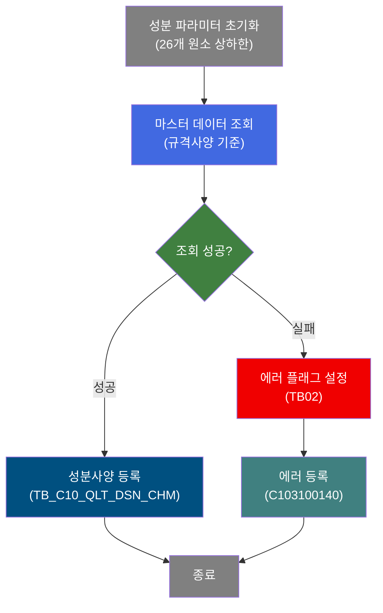
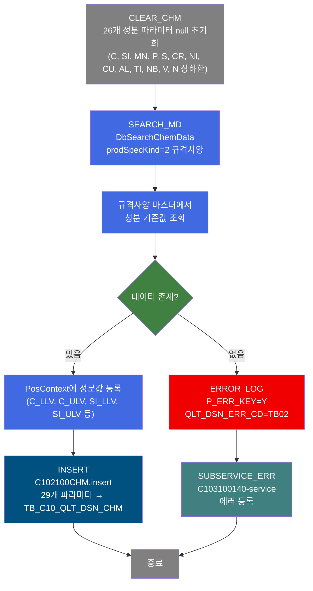
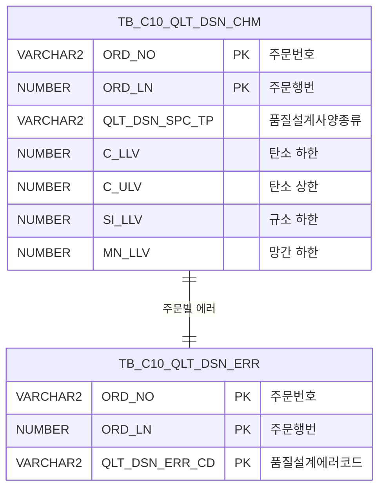

<h1 style="font-size: 40px; text-align: center; font-weight:
   bold; margin: 30px 0;">
  C102100080 레거시 시스템 분석 종합 보고서
</h1>


# 1. 시스템 개요
- **서비스 ID**: C102100080
- **업무명**: 품질설계 성분사양(CHM) 편성
- **분석 일시**: 2026-03-16 18:44 KST
- **분석 시간**: 약 1분
- **전체 Activity 수**: 5개 (Custom 1, Built-in 2, Common 2)
- **분석자**: Claude Opus 4.6
- **분석 도구**: /analyze-service C102100080
- **문서 버전**: 1.0

# 📊 비즈니스 프로세스 분석

## 시스템 목적

C102100080 서비스는 품질설계 과정에서 주문의 성분사양(CHM: Chemical Composition) 정보를 편성하여 `TB_C10_QLT_DSN_CHM` 테이블에 등록하는 NUI(배치) 서비스이다. 성분사양은 C(탄소), SI(규소), MN(망간), P(인), S(황), CR(크롬), NI(니켈), CU(구리), AL(알루미늄), TI(티타늄), NB(니오브), V(바나듐), N(질소) 등 13개 화학 원소의 상하한 범위값(26개 파라미터)을 포함한다.

서비스는 3단계로 구성된다. 첫째, `CLEAR_CHM` Activity(DbSetParam)가 26개 성분 파라미터를 null로 초기화한다. 둘째, `SEARCH_MD` Activity(DbSearchChemData)가 제품사양설계종류(prodSpecKind=2, 규격사양)에 따라 마스터 데이터에서 성분 기준값을 조회하여 PosContext에 등록한다. 셋째, `INSERT` Activity(PosInsert)가 29개 파라미터를 사용하여 성분사양 레코드를 등록한다.

에러 발생 시 `ERROR_LOG`가 에러 플래그(P_ERR_KEY=Y)와 에러코드(QLT_DSN_ERR_CD=TB02)를 설정하고, `SUBSERVICE_ERR`(C103100140-service)를 호출하여 품질설계 에러를 등록한다.

## 핵심 워크플로우 다이어그램



### 상세 워크플로우 다이어그램



## 주요 유즈케이스

### UC-01: 규격사양 기반 성분사양 편성
- **Actor**: 품질설계 배치 프로세스
- **목적**: 주문에 대한 규격사양 기준의 성분사양(화학 성분 범위) 데이터를 자동 편성하여 등록

- **전제조건**:
  - 부모 서비스(C102100070)에서 주문번호(ORD_NO), 주문행번(ORD_LN) 등 기본 정보가 PosContext에 설정됨
  - 규격사양 마스터 데이터가 존재함
  - 품질설계사양종류(QLT_DSN_SPC_TP) 값이 결정됨

- **주요 흐름**:
  1. 26개 성분 관련 파라미터를 null로 초기화 (CLEAR_CHM)
  2. DbSearchChemData가 prodSpecKind=2(규격사양) 기준으로 마스터 데이터 조회
  3. 조회된 성분 기준값(C/SI/MN/P/S/CR/NI/CU/AL/TI/NB/V/N 상하한)을 PosContext에 등록
  4. C102100CHM.insert 쿼리로 TB_C10_QLT_DSN_CHM 테이블에 29개 컬럼 INSERT

- **대체 흐름**:
  - 마스터 데이터 조회 실패 시: P_ERR_KEY=Y, QLT_DSN_ERR_CD=TB02 설정 후 C103100140 에러 등록 서비스 호출

- **후행조건**:
  - TB_C10_QLT_DSN_CHM 테이블에 해당 주문의 성분사양 레코드 등록 완료
  - 또는 TB_C10_QLT_DSN_ERR 테이블에 에러 레코드 등록

### UC-02: 성분 파라미터 초기화
- **Actor**: 품질설계 배치 프로세스
- **목적**: 루프 처리 시 이전 주문의 성분값이 다음 주문에 잔류하지 않도록 편성 전 모든 파라미터를 null로 리셋

- **전제조건**:
  - 서비스 시작 시점에 PosContext가 활성화됨

- **주요 흐름**:
  1. CLEAR_CHM Activity가 26개 파라미터를 sp_null로 설정
  2. 13개 화학 원소(C, SI, MN, P, S, CR, NI, CU, AL, TI, NB, V, N)의 하한(LLV)과 상한(ULV) 초기화

- **대체 흐름**: 없음

- **후행조건**:
  - 모든 성분 파라미터가 null 상태로 초기화됨

### UC-03: 성분사양 에러 처리
- **Actor**: 품질설계 배치 프로세스
- **목적**: 마스터 데이터 조회 실패 시 에러 정보를 기록

- **전제조건**:
  - SEARCH_MD Activity에서 성분 마스터 조회 실패

- **주요 흐름**:
  1. ERROR_LOG Activity가 P_ERR_KEY를 Y로 설정
  2. QLT_DSN_ERR_CD를 TB02(성분사양 에러코드)으로 설정
  3. C103100140-service 호출하여 TB_C10_QLT_DSN_ERR에 에러 등록

- **대체 흐름**:
  - 동일 에러 중복 등록 방지 (C103100140 내부 로직)

- **후행조건**:
  - TB_C10_QLT_DSN_ERR에 에러 레코드 등록됨

---
## 비즈니스 로직 상세

### 1. 성분사양 마스터 조회 분기 로직 (DbSearchChemData)

- **목적**: 제품사양설계종류(prodSpecKind)에 따라 서로 다른 마스터 소스에서 화학 성분 기준값을 조회
- **처리 케이스**:

  **[케이스 1: 고객사양 (prodSpecKind=1)]**
  ```
    조건: prodSpecKind = 1
    처리:
      1. 고객사양 마스터에서 성분 기준값 조회
      2. 고객이 요구한 화학 성분 범위를 PosContext에 등록
  ```

  **[케이스 2: 규격사양 (prodSpecKind=2) - 본 서비스 기본값]**
  ```
    조건: prodSpecKind = 2
    처리:
      1. 규격사양 마스터에서 성분 기준값 조회
      2. 해당 규격의 표준 화학 성분 범위를 PosContext에 등록
      3. C(탄소), SI(규소), MN(망간) 등 13개 원소의 상하한값 설정
  ```

  **[케이스 3: 사내사양 (prodSpecKind=3)]**
  ```
    조건: prodSpecKind = 3
    처리: 사내사양 마스터에서 성분 기준값 조회 후 PosContext에 등록
  ```

  **[케이스 4: 보증사양 (prodSpecKind=4)]**
  ```
    조건: prodSpecKind = 4
    처리: 보증사양 마스터에서 성분 기준값 조회 후 PosContext에 등록
  ```

- **예외 처리**:
  - 마스터 데이터 미존재: P_ERR_KEY=Y, QLT_DSN_ERR_CD=TB02 설정 후 에러 등록

### 2. 화학 원소별 성분 범위 관리

- **목적**: 13개 화학 원소의 하한/상한값을 정확하게 관리
- **처리 케이스**:

  **[원소 그룹별 관리]**
  ```
    주요 원소 (10개, 20 파라미터):
      - C(탄소): C_LLV, C_ULV
      - SI(규소): SI_LLV, SI_ULV
      - MN(망간): MN_LLV, MN_ULV
      - P(인): P_LLV, P_ULV
      - S(황): S_LLV, S_ULV
      - CR(크롬): CR_LLV, CR_ULV
      - NI(니켈): NI_LLV, NI_ULV
      - CU(구리): CU_LLV, CU_ULV
      - AL(알루미늄): AL_LLV, AL_ULV
      - TI(티타늄): TI_LLV, TI_ULV

    미량 원소 (3개, 6 파라미터):
      - NB(니오브): NB_LLV, NB_ULV
      - V(바나듐): V_LLV, V_ULV
      - N(질소): N_LLV, N_ULV
  ```

---

# ⚙️ Java 컴포넌트 분석

## Custom Activity 상세 분석

### 1개 Custom Activity 발견

### 1. DbSearchChemData (SEARCH_MD)
- **클래스명**: com.unionsteel.mes.c10.activity.nui.DbSearchChemData
- **액티비티명**: SEARCH_MD
- **파일 경로**: src/com/unionsteel/mes/c10/activity/nui/DbSearchChemData.java
- **주요 기능**: 철강 제품의 성분사양(Chemical Composition Specification)을 편성하는 NUI Activity. prodSpecKind에 따라 고객사양(1), 규격사양(2), 사내사양(3), 보증사양(4) 4가지 유형별로 마스터에서 화학 성분 기준값을 조회하여 PosContext에 저장

#### 메소드 구조
- **주요 메소드**: runActivity
  - **반환 타입**: String (다음 Activity 전이명)
  - **파라미터**: PosContext

#### 핵심 비즈니스 로직
- **prodSpecKind 분기**: 4가지 마스터 소스(고객/규격/사내/보증)에서 성분 기준값 조회
- **데이터 바인딩**: bind-list(RK_SEARCH)에서 현재 주문 정보를 읽고, bind-result(RK_MAIN)에 결과를 등록
- **에러 분기**: 마스터 조회 실패 시 error 전이로 분기

#### Java 상수 및 의존성
- **주요 상수**: C10NuiConstantsIF 인터페이스 구현
- **핵심 의존성**: PosActivity, PosContext, PosRowSet, mesdao

---

# 💾 데이터 요구사항

## 핵심 테이블

### 1. TB_C10_QLT_DSN_CHM - (품질설계 성분사양)
| 컬럼명 | 타입 | PK | 설명 |
|--------|------|----|-----|
| ORD_NO | VARCHAR2 | ✅ | 주문번호 |
| ORD_LN | NUMBER | ✅ | 주문행번 |
| QLT_DSN_SPC_TP | VARCHAR2 | | 품질설계사양종류 |
| C_LLV | NUMBER | | 탄소(C) 하한 |
| C_ULV | NUMBER | | 탄소(C) 상한 |
| SI_LLV | NUMBER | | 규소(SI) 하한 |
| SI_ULV | NUMBER | | 규소(SI) 상한 |
| MN_LLV | NUMBER | | 망간(MN) 하한 |
| MN_ULV | NUMBER | | 망간(MN) 상한 |
| P_LLV | NUMBER | | 인(P) 하한 |
| P_ULV | NUMBER | | 인(P) 상한 |
| S_LLV | NUMBER | | 황(S) 하한 |
| S_ULV | NUMBER | | 황(S) 상한 |
| CR_LLV | NUMBER | | 크롬(CR) 하한 |
| CR_ULV | NUMBER | | 크롬(CR) 상한 |
| NI_LLV | NUMBER | | 니켈(NI) 하한 |
| NI_ULV | NUMBER | | 니켈(NI) 상한 |
| CU_LLV | NUMBER | | 구리(CU) 하한 |
| CU_ULV | NUMBER | | 구리(CU) 상한 |
| AL_LLV | NUMBER | | 알루미늄(AL) 하한 |
| AL_ULV | NUMBER | | 알루미늄(AL) 상한 |
| TI_LLV | NUMBER | | 티타늄(TI) 하한 |
| TI_ULV | NUMBER | | 티타늄(TI) 상한 |
| NB_LLV | NUMBER | | 니오브(NB) 하한 |
| NB_ULV | NUMBER | | 니오브(NB) 상한 |
| V_LLV | NUMBER | | 바나듐(V) 하한 |
| V_ULV | NUMBER | | 바나듐(V) 상한 |
| N_LLV | NUMBER | | 질소(N) 하한 |
| N_ULV | NUMBER | | 질소(N) 상한 |

## 데이터 플로우

### 1. 성분사양 등록

```
[성분사양 편성 프로세스]
서비스 시작
→ CLEAR_CHM: 26개 성분 파라미터 null 초기화
→ SEARCH_MD (DbSearchChemData)
  FROM 마스터 데이터 (prodSpecKind=2 규격사양)
  WHERE 주문 조건 (RK_SEARCH 바인딩)
→ PosContext에 성분 기준값 등록
→ C102100CHM.insert
  INSERT INTO TB_C10_QLT_DSN_CHM
  VALUES (ORD_NO, ORD_LN, QLT_DSN_SPC_TP,
          C/SI/MN/P/S/CR/NI/CU/AL/TI/NB/V/N 상하한 26개 컬럼)
→ 성분사양 등록 완료
```

### 2. 에러 처리

```
[에러 발생 시]
SEARCH_MD 조회 실패
→ ERROR_LOG: P_ERR_KEY=Y, QLT_DSN_ERR_CD=TB02 설정
→ SUBSERVICE_ERR (C103100140-service)
  INSERT INTO TB_C10_QLT_DSN_ERR
  (ORD_NO, ORD_LN, QLT_DSN_ERR_CD)
→ 에러 등록 완료
```

## SQL 일람표
| SQL 이름 | 쿼리 ID | 타입 | 출처 | 테이블 |
|---------|---------|-----|-------|-------|
| 성분사양 등록 | C102100CHM.insert | INSERT | Service | TB_C10_QLT_DSN_CHM |

## ER 다이어그램 (핵심 관계)



관계 설명:
- TB_C10_QLT_DSN_CHM이 중심 테이블로 성분사양 데이터 저장
- TB_C10_QLT_DSN_ERR은 성분사양 편성 실패 시 에러코드(TB02)를 기록
- 두 테이블은 ORD_NO + ORD_LN으로 동일 주문을 참조

---

# 🔗 서브서비스

## 서브서비스 요약

| 서비스 ID | 설명 | 호출 액티비티 | 트랜잭션 | 상세 분석 |
|-----------|------|-------------|---------|----------|
| C103100140 | 품질설계 에러 등록 (중복 방지) | SUBSERVICE_ERR | 기존 트랜잭션 공유 | [상세 분석 링크](./C103100140_legacy_analysis.md) |

### C103100140 - 품질설계결과 에러 등록
주문에 대한 품질설계 에러코드를 TB_C10_QLT_DSN_ERR 테이블에 등록하며, 동일 주문+에러코드 중복 등록을 방지하는 서비스. Activity 2개, SQL 2개로 구성.

# 📌 특이사항 및 주의사항

## 1. 파라미터 초기화 필수성
- **루프 내 잔류값 방지**: 본 서비스는 부모 서비스(C102100070)의 루프 안에서 호출되므로, 이전 주문의 성분값이 다음 주문에 잔류하지 않도록 CLEAR_CHM에서 26개 파라미터를 null로 초기화한다.

## 2. C102100090(재질사양)과의 구조적 유사성
- **패턴 동일**: C102100080(성분)과 C102100090(재질)은 동일한 구조(CLEAR → SEARCH_MD → INSERT, ERROR_LOG → SUBSERVICE_ERR)를 따른다. 차이점은 대상 테이블(CHM vs MQL), 에러코드(TB02 vs TB03), 파라미터 종류(화학성분 vs 기계적성질)이다.

## 3. 에러코드 TB02의 의미
- **성분사양 전용 에러**: QLT_DSN_ERR_CD=TB02는 성분사양 편성 실패를 나타내는 전용 에러코드이다. TB01(규격사양), TB02(성분사양), TB03(재질사양) 등 각 편성 단계별로 구분된다.

## 4. 29개 파라미터 INSERT
- **대량 파라미터**: INSERT 시 29개 파라미터(PK 2개 + 사양종류 1개 + 성분 26개)를 사용하며, param0~param28까지 순서대로 매핑된다. 위치 기반 바인딩이므로 파라미터 순서 변경에 특히 주의해야 한다.

## 5. 트랜잭션 공유
- **서브서비스 트랜잭션**: SUBSERVICE_ERR의 new-transaction=false 설정으로 부모 서비스의 트랜잭션을 공유한다.

# 📚 참고 문서

- **Query SQL**: src/query/C102100CHM-query.glue_sql
- **Custom Java 클래스**:
  - src/com/unionsteel/mes/c10/activity/nui/DbSearchChemData.java
