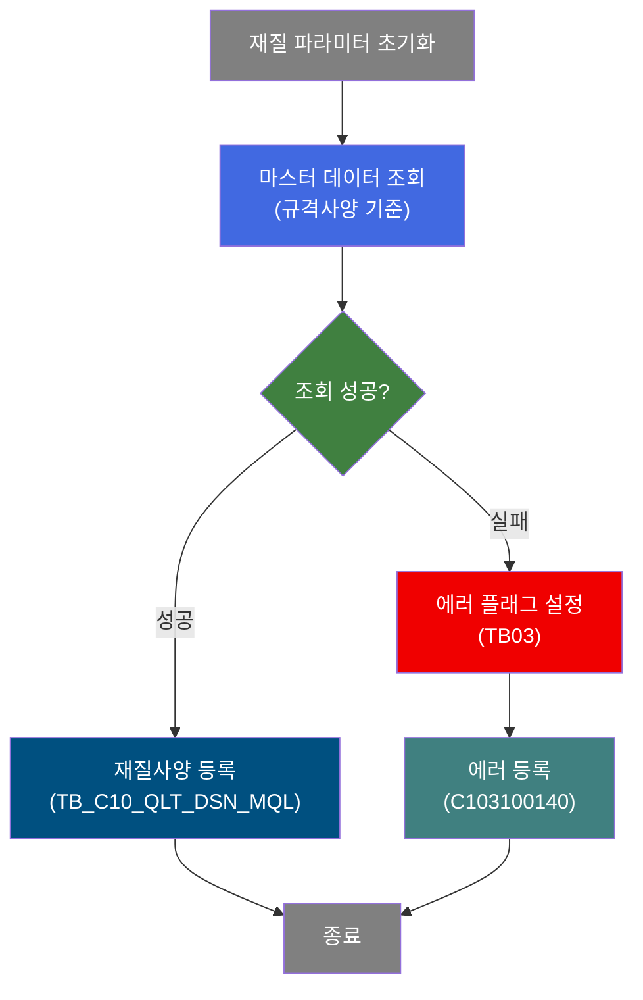
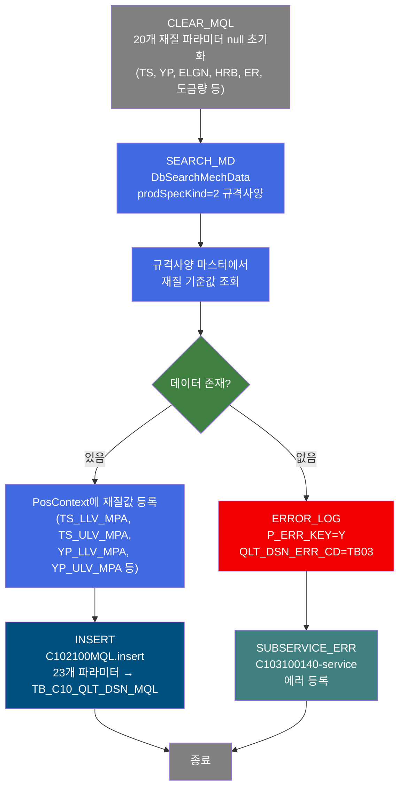
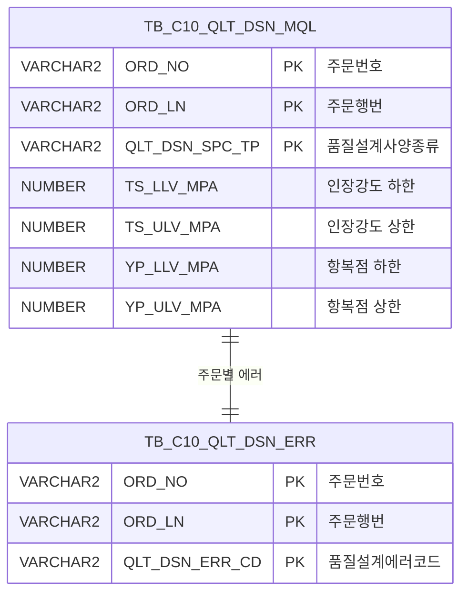

<h1 style="font-size: 40px; text-align: center; font-weight:
   bold; margin: 30px 0;">
  C102100090 레거시 시스템 분석 종합 보고서
</h1>


# 1. 시스템 개요
- **서비스 ID**: C102100090
- **업무명**: 품질설계 재질사양(MQL) 편성
- **분석 일시**: 2026-03-16 18:41 KST
- **분석 시간**: 약 2분
- **전체 Activity 수**: 5개 (Custom 1, Built-in 2, Common 2)
- **분석자**: Claude Opus 4.6
- **분석 도구**: /analyze-service C102100090
- **문서 버전**: 1.0

# 📊 비즈니스 프로세스 분석

## 시스템 목적

C102100090 서비스는 품질설계 과정에서 주문의 재질사양(MQL: Mechanical Quality Level) 정보를 편성하여 `TB_C10_QLT_DSN_MQL` 테이블에 등록하는 NUI(배치) 서비스이다. 재질사양은 인장강도(TS), 항복점(YP), 연신율(ELGN), 경도(HRB), 연성비(ER) 등 기계적 성질의 상하한 범위값과 도금량 굽힘 시험 기준, 시편 채취 위치/길이, TPG 번호, 감시중량 범위 등을 포함한다.

서비스는 3단계로 구성된다. 첫째, `CLEAR_MQL` Activity(DbSetParam)가 20개 재질 파라미터를 null로 초기화한다. 둘째, `SEARCH_MD` Activity(DbSearchMechData)가 제품사양설계종류(prodSpecKind=2, 규격사양)에 따라 마스터 데이터에서 재질 기준값을 조회하여 PosContext에 등록한다. 셋째, `INSERT` Activity(PosInsert)가 23개 파라미터를 사용하여 재질사양 레코드를 등록한다.

에러 발생 시 `ERROR_LOG` Activity가 에러 플래그(P_ERR_KEY=Y)와 에러코드(QLT_DSN_ERR_CD=TB03)를 설정하고, `SUBSERVICE_ERR`(C103100140-service)를 호출하여 품질설계 에러를 등록한다.

## 핵심 워크플로우 다이어그램



### 상세 워크플로우 다이어그램



## 주요 유즈케이스

### UC-01: 규격사양 기반 재질사양 편성
- **Actor**: 품질설계 배치 프로세스
- **목적**: 주문에 대한 규격사양 기준의 재질사양(기계적 성질 범위) 데이터를 자동 편성하여 등록

- **전제조건**:
  - 부모 서비스(C102100070)에서 주문번호(ORD_NO), 주문행번(ORD_LN) 등 기본 정보가 PosContext에 설정됨
  - 규격사양 마스터 데이터가 존재함
  - 품질설계사양종류(QLT_DSN_SPC_TP) 값이 결정됨

- **주요 흐름**:
  1. 20개 재질 관련 파라미터를 null로 초기화 (CLEAR_MQL)
  2. DbSearchMechData가 prodSpecKind=2(규격사양) 기준으로 마스터 데이터 조회
  3. 조회된 재질 기준값(TS/YP/ELGN/HRB/ER 상하한, 도금량 시험기준 등)을 PosContext에 등록
  4. C102100MQL.insert 쿼리로 TB_C10_QLT_DSN_MQL 테이블에 23개 컬럼 INSERT

- **대체 흐름**:
  - 마스터 데이터 조회 실패 시: P_ERR_KEY=Y, QLT_DSN_ERR_CD=TB03 설정 후 C103100140 에러 등록 서비스 호출
  - 에러 등록 후 서비스 종료 (INSERT 미수행)

- **후행조건**:
  - TB_C10_QLT_DSN_MQL 테이블에 해당 주문의 재질사양 레코드 등록 완료
  - 또는 TB_C10_QLT_DSN_ERR 테이블에 에러 레코드 등록

### UC-02: 재질 파라미터 초기화
- **Actor**: 품질설계 배치 프로세스
- **목적**: 이전 주문의 재질값이 잔류하지 않도록 편성 전 모든 파라미터를 null로 리셋

- **전제조건**:
  - 서비스 시작 시점에 PosContext가 활성화됨

- **주요 흐름**:
  1. CLEAR_MQL Activity가 20개 파라미터를 sp_null로 설정
  2. 인장강도(TS_LLV_MPA, TS_ULV_MPA), 항복점(YP_LLV_MPA, YP_ULV_MPA) 초기화
  3. 연신율(ELGN_LLV, ELGN_ULV), 경도(HRB_LLV, HRB_ULV), 연성비(ER_LLV, ER_ULV) 초기화
  4. 도금량 굽힘시험(MQL_BND_TST_STD_CD), 시편 채취 위치/길이 초기화
  5. TPG 번호, 감시중량 범위(FRN/BAK/TOT) 초기화

- **대체 흐름**: 없음 (초기화는 항상 성공)

- **후행조건**:
  - 모든 재질 파라미터가 null 상태로 초기화됨
  - 마스터 조회 단계 진행 가능

### UC-03: 재질사양 에러 처리
- **Actor**: 품질설계 배치 프로세스
- **목적**: 마스터 데이터 조회 실패 시 에러 정보를 기록하여 후속 조치 가능하도록 함

- **전제조건**:
  - SEARCH_MD Activity에서 재질 마스터 조회 실패

- **주요 흐름**:
  1. ERROR_LOG Activity가 P_ERR_KEY를 Y로 설정
  2. QLT_DSN_ERR_CD를 TB03(재질사양 에러코드)으로 설정
  3. C103100140-service(SUBSERVICE_ERR) 호출
  4. 에러 등록 서비스가 TB_C10_QLT_DSN_ERR 테이블에 에러 레코드 INSERT

- **대체 흐름**:
  - 에러 등록 서비스 자체의 중복 검사 로직에 의해 동일 에러 중복 등록 방지

- **후행조건**:
  - TB_C10_QLT_DSN_ERR에 에러 레코드 등록됨
  - 재질사양 INSERT는 수행되지 않음

---
## 비즈니스 로직 상세

### 1. 재질사양 마스터 조회 분기 로직 (DbSearchMechData)

- **목적**: 제품사양설계종류(prodSpecKind)에 따라 서로 다른 마스터 소스에서 재질 기준값을 조회하여 재질사양을 편성
- **처리 케이스**:

  **[케이스 1: 고객사양 (prodSpecKind=1)]**
  ```
    조건: prodSpecKind = 1
    처리:
      1. 고객사양 마스터에서 재질 기준값 조회
      2. 고객이 요구한 기계적 성질 범위를 PosContext에 등록
  ```

  **[케이스 2: 규격사양 (prodSpecKind=2) - 본 서비스 기본값]**
  ```
    조건: prodSpecKind = 2
    처리:
      1. 규격사양 마스터에서 재질 기준값 조회
      2. 해당 규격의 표준 기계적 성질 범위를 PosContext에 등록
      3. TS(인장강도), YP(항복점), ELGN(연신율), HRB(경도), ER(연성비) 상하한값 설정
  ```

  **[케이스 3: 사내사양 (prodSpecKind=3)]**
  ```
    조건: prodSpecKind = 3
    처리:
      1. 사내사양 마스터에서 재질 기준값 조회
      2. 사내 표준 기계적 성질 범위를 PosContext에 등록
  ```

  **[케이스 4: 보증사양 (prodSpecKind=4)]**
  ```
    조건: prodSpecKind = 4
    처리:
      1. 보증사양 마스터에서 재질 기준값 조회
      2. 보증 조건의 기계적 성질 범위를 PosContext에 등록
  ```

- **예외 처리**:
  - 마스터 데이터 미존재: P_ERR_KEY=Y 설정, ERROR_LOG → SUBSERVICE_ERR 흐름으로 분기
  - 에러코드 TB03: 재질사양 편성 실패를 의미

### 2. 파라미터 초기화 로직 (CLEAR_MQL)

- **목적**: 루프 처리 시 이전 주문의 재질값이 다음 주문에 잔류하지 않도록 방지
- **처리 케이스**:

  **[초기화 대상 파라미터 그룹]**
  ```
    기계적 성질 범위 (10개):
      - TS_LLV_MPA, TS_ULV_MPA (인장강도 하한/상한)
      - YP_LLV_MPA, YP_ULV_MPA (항복점 하한/상한)
      - ELGN_LLV, ELGN_ULV (연신율 하한/상한)
      - HRB_LLV, HRB_ULV (경도 하한/상한)
      - ER_LLV, ER_ULV (연성비 하한/상한)

    도금량/시험 관련 (3개):
      - MQL_BND_TST_STD_CD (도금량 굽힘 시험 기준코드)
      - TST_PIC_GTH_INST_LOC (시편 채취 지시 위치)
      - TST_PIC_GTH_INST_LTH (시편 채취 지시 길이)

    TPG/감시중량 관련 (7개):
      - TPG_RGS_NO (TPG 등록번호)
      - TST_GW_FRN_LLV, TST_GW_FRN_ULV (감시중량 전면 하한/상한)
      - TST_GW_BAK_LLV, TST_GW_BAK_ULV (감시중량 후면 하한/상한)
      - TST_GW_TOT_LLV, TST_GW_TOT_ULV (감시중량 합계 하한/상한)
  ```

---

# ⚙️ Java 컴포넌트 분석

## Custom Activity 상세 분석

### 1개 Custom Activity 발견

### 1. DbSearchMechData (SEARCH_MD)
- **클래스명**: com.unionsteel.mes.c10.activity.nui.DbSearchMechData
- **액티비티명**: SEARCH_MD
- **파일 경로**: src/com/unionsteel/mes/c10/activity/nui/DbSearchMechData.java
- **주요 기능**: 마스터 데이터에서 재질사양 기준을 조회하여 제품의 재질사양(MQL)을 편성하는 NUI Activity. prodSpecKind에 따라 고객사양(1), 규격사양(2), 사내사양(3), 보증사양(4) 네 가지 경로로 분기하여 각각 다른 마스터 소스에서 재질 데이터를 읽고 PosContext에 등록

#### 메소드 구조
- **주요 메소드**: runActivity
  - **반환 타입**: String (다음 Activity 전이명)
  - **파라미터**: PosContext

#### 핵심 비즈니스 로직
- **prodSpecKind 분기**: 제품사양설계종류에 따라 4가지 마스터 소스(고객/규격/사내/보증)에서 재질 기준값 조회
- **데이터 바인딩**: bind-list(RK_SEARCH)에서 현재 주문 정보를 읽고, bind-result(RK_MAIN)에 결과를 등록
- **에러 분기**: 마스터 조회 실패 시 error 전이로 분기하여 에러 등록 흐름 진행

#### Java 상수 및 의존성
- **주요 상수**: C10NuiConstantsIF 인터페이스 구현
- **핵심 의존성**: PosActivity, PosContext, PosRowSet, mesdao

---

# 💾 데이터 요구사항

## 핵심 테이블

### 1. TB_C10_QLT_DSN_MQL - (품질설계 재질사양)
| 컬럼명 | 타입 | PK | 설명 |
|--------|------|----|-----|
| ORD_NO | VARCHAR2 | ✅ | 주문번호 |
| ORD_LN | VARCHAR2 | ✅ | 주문행번 |
| QLT_DSN_SPC_TP | VARCHAR2 | ✅ | 품질설계사양종류 |
| TS_LLV_MPA | NUMBER | | 인장강도 하한 (MPa) |
| TS_ULV_MPA | NUMBER | | 인장강도 상한 (MPa) |
| YP_LLV_MPA | NUMBER | | 항복점 하한 (MPa) |
| YP_ULV_MPA | NUMBER | | 항복점 상한 (MPa) |
| ELGN_LLV | NUMBER | | 연신율 하한 |
| ELGN_ULV | NUMBER | | 연신율 상한 |
| HRB_LLV | NUMBER | | 경도 하한 |
| HRB_ULV | NUMBER | | 경도 상한 |
| ER_LLV | NUMBER | | 연성비 하한 |
| ER_ULV | NUMBER | | 연성비 상한 |
| MQL_BND_TST_STD_CD | VARCHAR2 | | 도금량 굽힘 시험 기준코드 |
| TST_PIC_GTH_INST_LOC | VARCHAR2 | | 시편 채취 지시 위치 |
| TST_PIC_GTH_INST_LTH | NUMBER | | 시편 채취 지시 길이 |
| TPG_RGS_NO | VARCHAR2 | | TPG 등록번호 |
| TST_GW_FRN_LLV | NUMBER | | 감시중량 전면 하한 |
| TST_GW_FRN_ULV | NUMBER | | 감시중량 전면 상한 |
| TST_GW_BAK_LLV | NUMBER | | 감시중량 후면 하한 |
| TST_GW_BAK_ULV | NUMBER | | 감시중량 후면 상한 |
| TST_GW_TOT_LLV | NUMBER | | 감시중량 합계 하한 |
| TST_GW_TOT_ULV | NUMBER | | 감시중량 합계 상한 |

## 데이터 플로우

### 1. 재질사양 등록

```
[재질사양 편성 프로세스]
서비스 시작
→ CLEAR_MQL: 20개 재질 파라미터 null 초기화
→ SEARCH_MD (DbSearchMechData)
  FROM 마스터 데이터 (prodSpecKind=2 규격사양)
  WHERE 주문 조건 (RK_SEARCH 바인딩)
→ PosContext에 재질 기준값 등록
→ C102100MQL.insert
  INSERT INTO TB_C10_QLT_DSN_MQL
  VALUES (ORD_NO, ORD_LN, QLT_DSN_SPC_TP,
          TS_LLV_MPA, TS_ULV_MPA, YP_LLV_MPA, YP_ULV_MPA,
          ELGN_LLV, ELGN_ULV, HRB_LLV, HRB_ULV,
          ER_LLV, ER_ULV, MQL_BND_TST_STD_CD,
          TST_PIC_GTH_INST_LOC, TST_PIC_GTH_INST_LTH,
          TPG_RGS_NO, 감시중량 6개 컬럼)
→ 재질사양 등록 완료
```

### 2. 에러 처리

```
[에러 발생 시]
SEARCH_MD 조회 실패
→ ERROR_LOG: P_ERR_KEY=Y, QLT_DSN_ERR_CD=TB03 설정
→ SUBSERVICE_ERR (C103100140-service)
  INSERT INTO TB_C10_QLT_DSN_ERR
  (ORD_NO, ORD_LN, QLT_DSN_ERR_CD)
→ 에러 등록 완료
```

## SQL 일람표
| SQL 이름 | 쿼리 ID | 타입 | 출처 | 테이블 |
|---------|---------|-----|-------|-------|
| 재질사양 등록 | C102100MQL.insert | INSERT | Service | TB_C10_QLT_DSN_MQL |

## ER 다이어그램 (핵심 관계)



관계 설명:
- TB_C10_QLT_DSN_MQL이 중심 테이블로 재질사양 데이터 저장
- TB_C10_QLT_DSN_ERR은 재질사양 편성 실패 시 에러코드(TB03)를 기록
- 두 테이블은 ORD_NO + ORD_LN으로 동일 주문을 참조

---

# 🔗 서브서비스

## 서브서비스 요약

| 서비스 ID | 설명 | 호출 액티비티 | 트랜잭션 | 상세 분석 |
|-----------|------|-------------|---------|----------|
| C103100140 | 품질설계 에러 등록 (중복 방지) | SUBSERVICE_ERR | 기존 트랜잭션 공유 | [상세 분석 링크](./C103100140_legacy_analysis.md) |

### C103100140 - 품질설계결과 에러 등록
주문에 대한 품질설계 에러코드를 TB_C10_QLT_DSN_ERR 테이블에 등록하며, 동일 주문+에러코드 중복 등록을 방지하는 서비스. Activity 2개, SQL 2개로 구성.

# 📌 특이사항 및 주의사항

## 1. 파라미터 초기화 필수성
- **루프 내 잔류값 방지**: 본 서비스는 부모 서비스(C102100070)의 루프 안에서 호출되므로, 이전 주문의 재질값이 다음 주문에 잔류하지 않도록 CLEAR_MQL에서 20개 파라미터를 null로 초기화한다. 이 초기화가 누락되면 이전 주문의 재질사양이 다음 주문에 적용되는 중대한 오류가 발생할 수 있다.

## 2. prodSpecKind 분기 구조
- **4경로 분기**: DbSearchMechData는 prodSpecKind 파라미터(1~4)에 따라 고객사양, 규격사양, 사내사양, 보증사양으로 분기한다. 본 서비스에서는 prodSpecKind=2(규격사양)으로 고정되어 있으나, 동일 클래스가 다른 서비스에서 다른 prodSpecKind로 재사용될 수 있다.

## 3. 에러코드 TB03의 의미
- **재질사양 전용 에러**: QLT_DSN_ERR_CD=TB03은 재질사양 편성 실패를 나타내는 전용 에러코드이다. 다른 품질설계 서비스에서는 각각 다른 에러코드(TB01, TB02 등)를 사용하여 에러 발생 위치를 구분한다.

## 4. 23개 파라미터 INSERT
- **대량 파라미터**: INSERT 시 23개 파라미터를 사용하며, 파라미터 순서가 SQL 바인드 변수와 정확히 일치해야 한다. param0~param22까지 순서대로 매핑되므로, 파라미터 추가/삭제 시 순서 변경에 주의해야 한다.

## 5. 트랜잭션 공유
- **서브서비스 트랜잭션**: SUBSERVICE_ERR의 new-transaction=false 설정으로 부모 서비스의 트랜잭션을 공유한다. 에러 등록 실패 시 전체 트랜잭션이 롤백될 수 있다.

# 📚 참고 문서

- **Query SQL**: src/query/C102100MQL-query.glue_sql
- **Custom Java 클래스**:
  - src/com/unionsteel/mes/c10/activity/nui/DbSearchMechData.java
