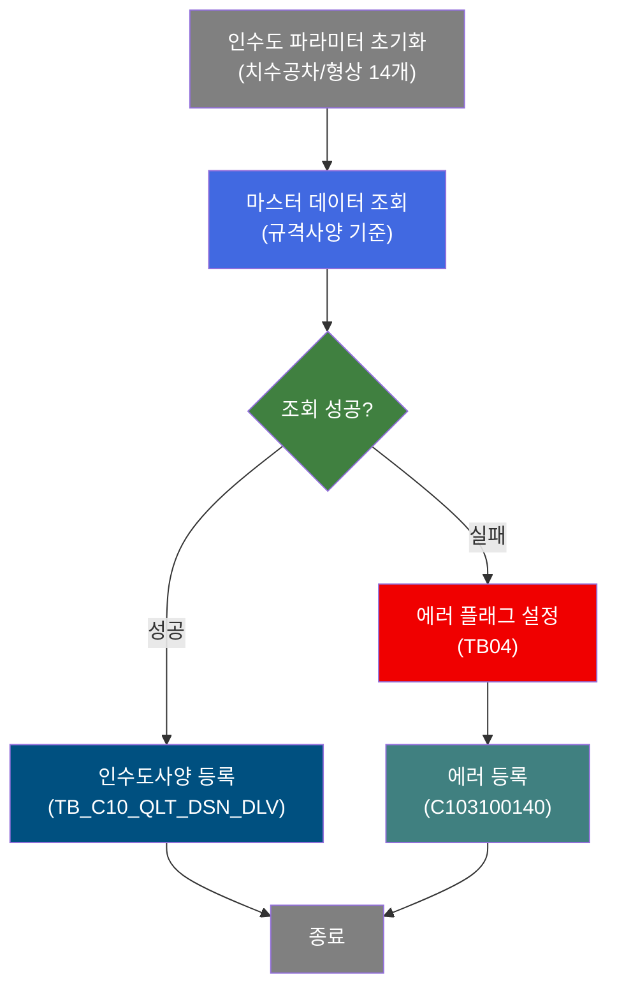
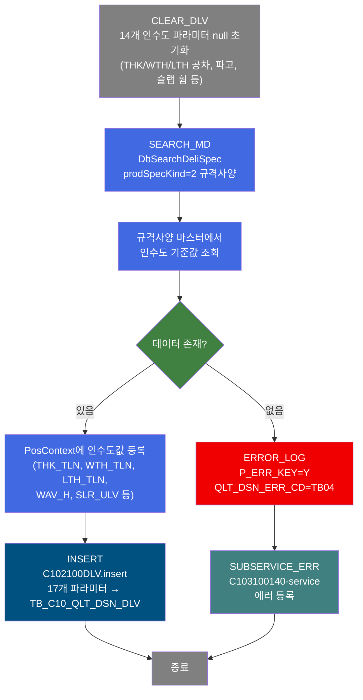
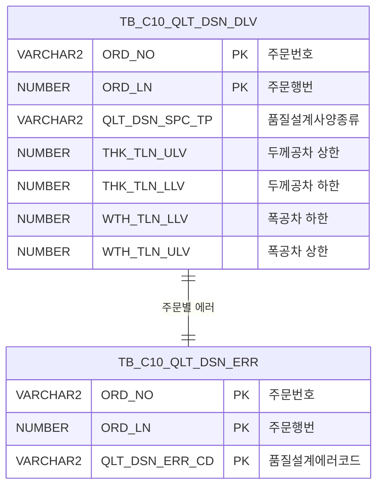

<h1 style="font-size: 40px; text-align: center; font-weight:
   bold; margin: 30px 0;">
  C102100100 레거시 시스템 분석 종합 보고서
</h1>


# 1. 시스템 개요
- **서비스 ID**: C102100100
- **업무명**: 품질설계 인수도사양(DLV) 편성
- **분석 일시**: 2026-03-16 18:47 KST
- **분석 시간**: 약 1분
- **전체 Activity 수**: 5개 (Custom 1, Built-in 2, Common 2)
- **분석자**: Claude Opus 4.6
- **분석 도구**: /analyze-service C102100100
- **문서 버전**: 1.0

# 📊 비즈니스 프로세스 분석

## 시스템 목적

C102100100 서비스는 품질설계 과정에서 주문의 인수도사양(DLV: Delivery Specification) 정보를 편성하여 `TB_C10_QLT_DSN_DLV` 테이블에 등록하는 NUI(배치) 서비스이다. 인수도사양은 제품의 치수 공차(두께/폭/길이 상하한), 형상 품질(파고, 슬랩 휨, 대각선 차 등), 기타 품질 기준(스탬핑, TLC)을 포함한다.

서비스는 3단계로 구성된다. 첫째, `CLEAR_DLV` Activity(DbSetParam)가 14개 인수도 파라미터를 null로 초기화한다. 둘째, `SEARCH_MD` Activity(DbSearchDeliSpec)가 제품사양설계종류(prodSpecKind=2, 규격사양)에 따라 마스터 데이터에서 인수도 기준값을 조회하여 PosContext에 등록한다. 셋째, `INSERT` Activity(PosInsert)가 17개 파라미터를 사용하여 인수도사양 레코드를 등록한다.

에러 발생 시 `ERROR_LOG`가 에러 플래그(P_ERR_KEY=Y)와 에러코드(QLT_DSN_ERR_CD=TB04)를 설정하고, `SUBSERVICE_ERR`(C103100140-service)를 호출하여 품질설계 에러를 등록한다.

## 핵심 워크플로우 다이어그램



### 상세 워크플로우 다이어그램



## 주요 유즈케이스

### UC-01: 규격사양 기반 인수도사양 편성
- **Actor**: 품질설계 배치 프로세스
- **목적**: 주문에 대한 규격사양 기준의 인수도사양(치수 공차, 형상 품질) 데이터를 자동 편성하여 등록

- **전제조건**:
  - 부모 서비스(C102100070)에서 주문번호(ORD_NO), 주문행번(ORD_LN) 등 기본 정보가 PosContext에 설정됨
  - 규격사양 마스터 데이터가 존재함

- **주요 흐름**:
  1. 14개 인수도 관련 파라미터를 null로 초기화 (CLEAR_DLV)
  2. DbSearchDeliSpec가 prodSpecKind=2(규격사양) 기준으로 마스터 데이터 조회
  3. 조회된 인수도 기준값(치수공차, 형상품질 등)을 PosContext에 등록
  4. C102100DLV.insert 쿼리로 TB_C10_QLT_DSN_DLV 테이블에 17개 컬럼 INSERT

- **대체 흐름**:
  - 마스터 데이터 조회 실패 시: P_ERR_KEY=Y, QLT_DSN_ERR_CD=TB04 설정 후 C103100140 에러 등록

- **후행조건**:
  - TB_C10_QLT_DSN_DLV 테이블에 해당 주문의 인수도사양 레코드 등록 완료
  - 또는 TB_C10_QLT_DSN_ERR에 에러 레코드 등록

### UC-02: 인수도 파라미터 초기화
- **Actor**: 품질설계 배치 프로세스
- **목적**: 루프 처리 시 이전 주문의 인수도값이 잔류하지 않도록 편성 전 모든 파라미터를 null로 리셋

- **전제조건**:
  - 서비스 시작 시점에 PosContext가 활성화됨

- **주요 흐름**:
  1. CLEAR_DLV Activity가 14개 파라미터를 sp_null로 설정
  2. 치수공차 6개(THK/WTH/LTH 상하한), 파고 3개(H/M/EWAV_H), 슬랩 휨(SLR_ULV), 직각도(RAR_ULV), 대각선차(DGLN_DIF_ULV), 스탬핑(STPN), TLC 초기화

- **대체 흐름**: 없음

- **후행조건**:
  - 모든 인수도 파라미터가 null 상태로 초기화됨

### UC-03: 인수도사양 에러 처리
- **Actor**: 품질설계 배치 프로세스
- **목적**: 마스터 데이터 조회 실패 시 에러 정보를 기록

- **전제조건**:
  - SEARCH_MD Activity에서 인수도 마스터 조회 실패

- **주요 흐름**:
  1. ERROR_LOG Activity가 P_ERR_KEY=Y, QLT_DSN_ERR_CD=TB04 설정
  2. C103100140-service 호출하여 에러 등록

- **대체 흐름**: 동일 에러 중복 등록 방지 (C103100140 내부 로직)

- **후행조건**:
  - TB_C10_QLT_DSN_ERR에 에러 레코드 등록됨

---
## 비즈니스 로직 상세

### 1. 인수도사양 마스터 조회 분기 로직 (DbSearchDeliSpec)

- **목적**: 제품사양설계종류(prodSpecKind)에 따라 서로 다른 마스터 소스에서 인수도 기준값(치수공차, 형상품질)을 조회
- **처리 케이스**:

  **[케이스 1: 고객인수도사양 (prodSpecKind=1)]**
  ```
    조건: prodSpecKind = 1
    처리:
      1. 고객인수도사양 마스터에서 치수공차/형상 기준값 조회
      2. 고객이 요구한 공차 범위를 PosContext에 등록
  ```

  **[케이스 2: 규격인수도사양 (prodSpecKind=2) - 본 서비스 기본값]**
  ```
    조건: prodSpecKind = 2
    처리:
      1. 규격인수도사양 마스터에서 기준값 조회
      2. 해당 규격의 표준 치수공차/형상품질 범위를 PosContext에 등록
      3. 두께(THK), 폭(WTH), 길이(LTH) 공차 상하한 설정
      4. 파고(H/M/EWAV), 슬랩 휨(SLR), 직각도(RAR), 대각선차(DGLN_DIF) 설정
  ```

  **[케이스 3: 보증사양 (prodSpecKind=4)]**
  ```
    조건: prodSpecKind = 4
    처리: 보증사양 마스터에서 인수도 기준값 조회 후 PosContext에 등록
  ```

- **예외 처리**:
  - 마스터 데이터 미존재: P_ERR_KEY=Y, QLT_DSN_ERR_CD=TB04 설정 후 에러 등록
  - prodSpecKind=3(사내사양)은 인수도사양에서는 분기 없음 (규격사양과 동일하게 처리되거나 미사용)

### 2. 치수공차 및 형상품질 파라미터

- **목적**: 제품의 치수 정밀도와 형상 품질 기준을 관리
- **처리 케이스**:

  **[치수공차 (Tolerance)]**
  ```
    두께공차 (2개):
      - THK_TLN_LLV (두께 공차 하한)
      - THK_TLN_ULV (두께 공차 상한)

    폭공차 (2개):
      - WTH_TLN_LLV (폭 공차 하한)
      - WTH_TLN_ULV (폭 공차 상한)

    길이공차 (2개):
      - LTH_TLN_LLV (길이 공차 하한)
      - LTH_TLN_ULV (길이 공차 상한)
  ```

  **[형상품질 (Shape Quality)]**
  ```
    파고 (3개):
      - HWAV_H (높이방향 파고)
      - MWAV_H (중앙부 파고)
      - EWAV_H (가장자리 파고)

    기타 형상 (3개):
      - SLR_ULV (슬랩 휨 상한)
      - RAR_ULV (직각도 상한)
      - DGLN_DIF_ULV (대각선차 상한)

    추가 품질 (2개):
      - STPN (스탬핑)
      - TLC (TLC)
  ```

---

# ⚙️ Java 컴포넌트 분석

## Custom Activity 상세 분석

### 1개 Custom Activity 발견

### 1. DbSearchDeliSpec (SEARCH_MD)
- **클래스명**: com.unionsteel.mes.c10.activity.nui.DbSearchDeliSpec
- **액티비티명**: SEARCH_MD
- **파일 경로**: src/com/unionsteel/mes/c10/activity/nui/DbSearchDeliSpec.java
- **주요 기능**: 품질설계 NUI 프로세스에서 인수도사양(공차 기준)을 편성하는 클래스. prodSpecKind에 따라 고객인수도사양(1), 규격인수도사양(2), 보증사양(4) 세 가지 처리 경로로 분기하여 두께/폭/길이 공차와 형상품질 기준을 마스터에서 조회

#### 메소드 구조
- **주요 메소드**: runActivity
  - **반환 타입**: String (다음 Activity 전이명)
  - **파라미터**: PosContext

#### 핵심 비즈니스 로직
- **prodSpecKind 분기**: 3가지 마스터 소스(고객/규격/보증)에서 인수도 기준값 조회
- **데이터 바인딩**: bind-list(RK_SEARCH)에서 현재 주문 정보를 읽고, bind-result(RK_MAIN)에 결과를 등록
- **에러 분기**: 마스터 조회 실패 시 error 전이로 분기

#### Java 상수 및 의존성
- **주요 상수**: C10NuiConstantsIF 인터페이스 구현
- **핵심 의존성**: PosActivity, PosContext, PosRowSet, mesdao

---

# 💾 데이터 요구사항

## 핵심 테이블

### 1. TB_C10_QLT_DSN_DLV - (품질설계 인수도사양)
| 컬럼명 | 타입 | PK | 설명 |
|--------|------|----|-----|
| ORD_NO | VARCHAR2 | ✅ | 주문번호 |
| ORD_LN | NUMBER | ✅ | 주문행번 |
| QLT_DSN_SPC_TP | VARCHAR2 | | 품질설계사양종류 |
| THK_TLN_ULV | NUMBER | | 두께 공차 상한 |
| THK_TLN_LLV | NUMBER | | 두께 공차 하한 |
| WTH_TLN_LLV | NUMBER | | 폭 공차 하한 |
| WTH_TLN_ULV | NUMBER | | 폭 공차 상한 |
| LTH_TLN_LLV | NUMBER | | 길이 공차 하한 |
| LTH_TLN_ULV | NUMBER | | 길이 공차 상한 |
| HWAV_H | NUMBER | | 높이방향 파고 |
| MWAV_H | NUMBER | | 중앙부 파고 |
| EWAV_H | NUMBER | | 가장자리 파고 |
| SLR_ULV | NUMBER | | 슬랩 휨 상한 |
| RAR_ULV | NUMBER | | 직각도 상한 |
| DGLN_DIF_ULV | NUMBER | | 대각선차 상한 |
| STPN | VARCHAR2 | | 스탬핑 |
| TLC | VARCHAR2 | | TLC |

## 데이터 플로우

### 1. 인수도사양 등록

```
[인수도사양 편성 프로세스]
서비스 시작
→ CLEAR_DLV: 14개 인수도 파라미터 null 초기화
→ SEARCH_MD (DbSearchDeliSpec)
  FROM 마스터 데이터 (prodSpecKind=2 규격사양)
  WHERE 주문 조건 (RK_SEARCH 바인딩)
→ PosContext에 인수도 기준값 등록
→ C102100DLV.insert
  INSERT INTO TB_C10_QLT_DSN_DLV
  VALUES (ORD_NO, ORD_LN, QLT_DSN_SPC_TP,
          THK/WTH/LTH 공차 6개, 파고 3개, SLR, RAR, DGLN_DIF, STPN, TLC)
→ 인수도사양 등록 완료
```

### 2. 에러 처리

```
[에러 발생 시]
SEARCH_MD 조회 실패
→ ERROR_LOG: P_ERR_KEY=Y, QLT_DSN_ERR_CD=TB04 설정
→ SUBSERVICE_ERR (C103100140-service)
  INSERT INTO TB_C10_QLT_DSN_ERR
  (ORD_NO, ORD_LN, QLT_DSN_ERR_CD)
→ 에러 등록 완료
```

## SQL 일람표
| SQL 이름 | 쿼리 ID | 타입 | 출처 | 테이블 |
|---------|---------|-----|-------|-------|
| 인수도사양 등록 | C102100DLV.insert | INSERT | Service | TB_C10_QLT_DSN_DLV |

## ER 다이어그램 (핵심 관계)



관계 설명:
- TB_C10_QLT_DSN_DLV이 중심 테이블로 인수도사양(치수공차/형상품질) 데이터 저장
- TB_C10_QLT_DSN_ERR은 인수도사양 편성 실패 시 에러코드(TB04)를 기록
- 두 테이블은 ORD_NO + ORD_LN으로 동일 주문을 참조

---

# 🔗 서브서비스

## 서브서비스 요약

| 서비스 ID | 설명 | 호출 액티비티 | 트랜잭션 | 상세 분석 |
|-----------|------|-------------|---------|----------|
| C103100140 | 품질설계 에러 등록 (중복 방지) | SUBSERVICE_ERR | 기존 트랜잭션 공유 | [상세 분석 링크](./C103100140_legacy_analysis.md) |

### C103100140 - 품질설계결과 에러 등록
주문에 대한 품질설계 에러코드를 TB_C10_QLT_DSN_ERR 테이블에 등록하며, 동일 주문+에러코드 중복 등록을 방지하는 서비스. Activity 2개, SQL 2개로 구성.

# 📌 특이사항 및 주의사항

## 1. C102100080/090과의 구조적 유사성
- **동일 패턴**: C102100100(인수도)은 C102100080(성분, TB02), C102100090(재질, TB03)과 동일한 CLEAR → SEARCH_MD → INSERT 패턴을 따른다. 차이점은 대상 테이블(DLV), 에러코드(TB04), 파라미터 종류(치수공차/형상품질)이다.

## 2. prodSpecKind 분기 제한
- **3경로만 지원**: DbSearchDeliSpec는 고객사양(1), 규격사양(2), 보증사양(4)만 지원하며, 사내사양(3)에 대한 분기는 없다. DbSearchChemData(4경로)나 DbSearchMechData(4경로)와 달리 인수도사양은 사내사양 경로가 불필요한 것으로 보인다.

## 3. 에러코드 TB04의 의미
- **인수도사양 전용 에러**: QLT_DSN_ERR_CD=TB04는 인수도사양 편성 실패를 나타내는 전용 에러코드이다. TB01(규격), TB02(성분), TB03(재질), TB04(인수도) 등 품질설계 단계별로 구분된다.

## 4. 파라미터 수 차이
- **초기화 14개, INSERT 17개**: CLEAR_DLV는 14개 파라미터를 초기화하지만, INSERT는 17개 파라미터(PK 2개 + 사양종류 1개 + 인수도 14개)를 사용한다. 초기화와 INSERT의 파라미터 수가 다르므로 PK와 사양종류는 부모 서비스에서 설정됨을 의미한다.

## 5. 형상품질 기준의 상한만 관리
- **비대칭 관리**: 슬랩 휨(SLR), 직각도(RAR), 대각선차(DGLN_DIF)는 상한(ULV)만 관리하고 하한은 없다. 이는 형상 불량이 양의 방향으로만 측정되는 물리적 특성을 반영한다.

# 📚 참고 문서

- **Query SQL**: src/query/C102100DLV-query.glue_sql
- **Custom Java 클래스**:
  - src/com/unionsteel/mes/c10/activity/nui/DbSearchDeliSpec.java
