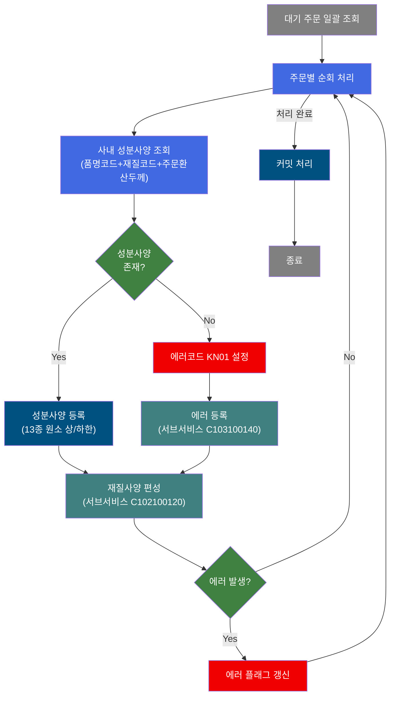
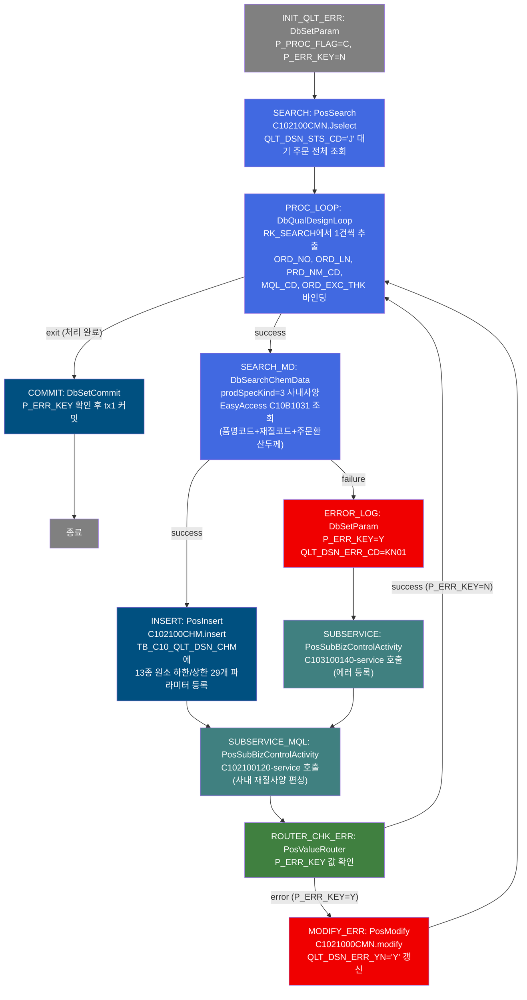
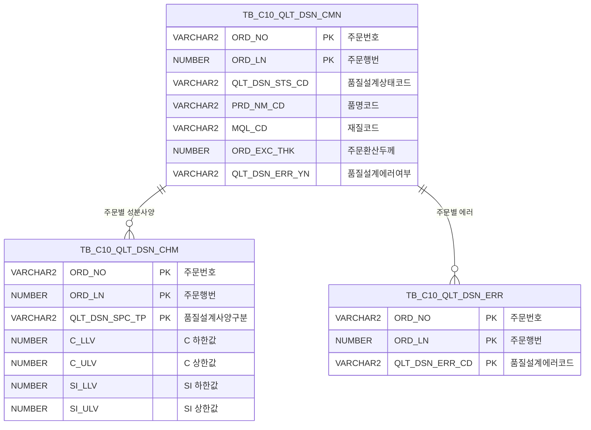

<h1 style="font-size: 40px; text-align: center; font-weight:
   bold; margin: 30px 0;">
  C102100110 레거시 시스템 분석 종합 보고서
</h1>


# 1. 시스템 개요
- **서비스 ID**: C102100110
- **업무명**: 사내사양(K) 성분사양 편성 (품질설계 배치)
- **분석 일시**: 2026-03-16 19:31 KST
- **분석 시간**: 약 3분
- **전체 Activity 수**: 11개 (Custom 2, Built-in 6, Common 3)
- **분석자**: Claude Opus 4.6
- **분석 도구**: /analyze-service C102100110
- **문서 버전**: 1.0

# 📊 비즈니스 프로세스 분석

## 시스템 목적

C102100110 서비스는 **사내사양(prodSpecKind=3) 기반 성분사양(CHM: Chemical Composition) 편성**을 수행하는 NUI(배치) 서비스이다. 품질설계 대기 상태(`QLT_DSN_STS_CD = 'J'`)인 주문 전체를 일괄 조회하여, 각 주문에 대해 사내 성분 마스터에서 13종 화학원소(C, Si, Mn, P, S, Cr, Ni, Cu, Al, Ti, Nb, V, N)의 하한값/상한값을 조회한 후 `TB_C10_QLT_DSN_CHM` 테이블에 등록한다.

서비스는 루프 구조로, `SEARCH` Activity가 대기 주문 전체를 조회한 후 `PROC_LOOP`(DbQualDesignLoop)가 1건씩 순회하며 `SEARCH_MD`(DbSearchChemData, prodSpecKind=3)에서 사내 성분사양을 편성하고, `INSERT`(PosInsert)로 등록한다. 성분사양 등록 후 서브서비스 `C102100120`(사내 재질사양 편성)을 호출하고, 에러 발생 시 `C103100140`(에러 등록)을 호출하여 에러코드 KN01(사내성분사양 미존재)을 기록한 뒤 `MODIFY_ERR`로 해당 주문의 `QLT_DSN_ERR_YN`을 'Y'로 갱신한다.

트랜잭션 관리자(`tx1`, commit=true)가 설정되어 있으며, 루프 종료 시 `COMMIT` Activity(DbSetCommit)에서 `P_ERR_KEY` 값을 확인하여 에러 없으면 커밋한다.


## 핵심 워크플로우 다이어그램



### 상세 워크플로우 다이어그램




## 주요 유즈케이스

### UC-01: 사내 성분사양 일괄 편성
- **Actor**: 배치 스케줄러 (NUI 배치 프로세스)
- **목적**: 품질설계 대기 상태인 전체 주문에 대해 사내사양 기반 성분 규격값을 일괄 편성하여 `TB_C10_QLT_DSN_CHM` 테이블에 등록

- **전제조건**:
  - 품질설계공통 테이블(`TB_C10_QLT_DSN_CMN`)에 `QLT_DSN_STS_CD = 'J'`(대기) 상태 주문 존재
  - 각 주문에 `PRD_NM_CD`(품명코드), `MQL_CD`(재질코드), `ORD_EXC_THK`(주문환산두께) 정보 존재
  - EasyAccess `C10B1031` 사내성분 판단기준 데이터 등록 완료

- **주요 흐름**:
  1. 초기화 - `P_PROC_FLAG = 'C'`, `P_ERR_KEY = 'N'` 설정
  2. `C102100CMN.Jselect` 쿼리로 대기 주문(`QLT_DSN_STS_CD = 'J'`) 전체 조회
  3. `PROC_LOOP`에서 조회 결과 1건씩 순회 (ORD_NO, ORD_LN, PRD_NM_CD, MQL_CD, ORD_EXC_THK 추출)
  4. `DbSearchChemData`에서 EasyAccess `C10B1031` 판단기준으로 사내 성분사양 매칭 (품명코드+재질코드+주문환산두께)
  5. 매칭 성공 시 13종 원소 하한/상한값을 PosContext에 저장
  6. `C102100CHM.insert` 쿼리로 `TB_C10_QLT_DSN_CHM` 테이블에 성분사양 등록 (QLT_DSN_SPC_TP = '3')
  7. 서브서비스 `C102100120` 호출하여 사내 재질사양(MQL) 편성
  8. 모든 주문 처리 완료 후 커밋

- **대체 흐름**:
  - 사내 성분사양 미존재: 에러코드 KN01 설정, `C103100140` 서브서비스로 에러 등록 후 재질사양 편성으로 계속 진행
  - EasyAccess 조회 결과 2건 이상: 에러코드 KN11 설정, FAILURE 반환
  - 재질사양 편성 에러: ROUTER_CHK_ERR에서 P_ERR_KEY=Y 감지, MODIFY_ERR로 QLT_DSN_ERR_YN='Y' 갱신 후 다음 주문 계속

- **후행조건**:
  - 처리된 주문에 대해 `TB_C10_QLT_DSN_CHM` 테이블에 사내 성분사양(QLT_DSN_SPC_TP='3') 레코드 생성
  - 에러 발생 주문은 `QLT_DSN_ERR_YN = 'Y'` 갱신 및 `TB_C10_QLT_DSN_ERR` 테이블에 에러 기록

### UC-02: 성분사양 미존재 에러 처리
- **Actor**: 배치 스케줄러 (NUI 배치 프로세스)
- **목적**: 사내 성분 마스터에 해당 주문의 성분사양이 등록되지 않은 경우 에러를 기록하여 후속 조치 가능하도록 함

- **전제조건**:
  - EasyAccess `C10B1031` 판단기준에 해당 품명코드+재질코드+주문환산두께 조합의 사양이 미등록

- **주요 흐름**:
  1. `DbSearchChemData`에서 `C10B1031` 조회 결과 0건 → FAILURE 반환
  2. `ERROR_LOG` Activity에서 `P_ERR_KEY = 'Y'`, `QLT_DSN_ERR_CD = 'KN01'` 설정
  3. `SUBSERVICE`에서 `C103100140-service` 호출 (중복 체크 후 에러 테이블에 INSERT)
  4. `SUBSERVICE_MQL`에서 `C102100120-service` 호출 (재질사양 편성 시도)
  5. `ROUTER_CHK_ERR`에서 `P_ERR_KEY = 'Y'` 감지 → error 전이
  6. `MODIFY_ERR`에서 `C1021000CMN.modify` 실행하여 `QLT_DSN_ERR_YN = 'Y'` 갱신
  7. 다음 주문으로 루프 계속

- **대체 흐름**:
  - 에러 등록 중복: `C103100140` 서브서비스에서 중복 체크 후 INSERT 스킵

- **후행조건**:
  - `TB_C10_QLT_DSN_ERR` 테이블에 에러코드 KN01 레코드 생성
  - 해당 주문의 `TB_C10_QLT_DSN_CMN.QLT_DSN_ERR_YN = 'Y'` 갱신

### UC-03: 루프 종료 및 커밋 처리
- **Actor**: 배치 스케줄러 (NUI 배치 프로세스)
- **목적**: 모든 대기 주문 처리 완료 후 트랜잭션을 안전하게 커밋

- **전제조건**:
  - PROC_LOOP의 카운터(QLT_DSN_STS_CD_COUNT)가 0에 도달

- **주요 흐름**:
  1. `PROC_LOOP`에서 `procCount == 0` 감지 → 카운터 변수 제거 후 `exit` 전이 반환
  2. `COMMIT`(DbSetCommit) Activity에서 `P_ERR_KEY` 값 확인
  3. `P_ERR_KEY = 'N'`이면 `tx1` 트랜잭션 커밋 후 종료

- **대체 흐름**:
  - 처리 대상 0건: SEARCH 결과 0건 → PROC_LOOP 즉시 exit → COMMIT

- **후행조건**:
  - 트랜잭션 커밋 완료
  - 모든 성분사양 INSERT 및 에러 플래그 UPDATE 확정

---

## 비즈니스 로직 상세

### 1. 사내 성분사양 편성 로직 (DbSearchChemData, prodSpecKind=3)

- **목적**: 주문의 품명코드+재질코드+주문환산두께 조합으로 사내 성분 마스터에서 13종 화학원소의 상/하한 기준값을 조회

- **처리 케이스**:

  **[케이스 1: 사내사양 정상 매칭]**
  ```
    조건: EasyAccess C10B1031 조회 결과 1건
    처리:
      1. PosDecisionChecker.getPosRule(colValue[PRD_NM_CD, MQL_CD, ORD_EXC_THK]) 호출
      2. 매칭된 결과의 itemNameRow Iterator 순회
      3. 13종 원소(C, SI, MN, P, S, CR, NI, CU, AL, TI, NB, V, N)의 하한값(_LLV)과 상한값(_ULV) 추출
      4. PosContext에 QLT_DSN_SPC_TP = '3'과 함께 26개 값(13원소 × 2) 저장
      5. "SUCCESS" 반환 → INSERT Activity로 전이
  ```

  **[케이스 2: 사내사양 미존재]**
  ```
    조건: EasyAccess C10B1031 조회 결과 0건
    처리:
      1. 에러코드 KN01("사내성분사양 미존재") 설정
      2. "FAILURE" 반환 → ERROR_LOG Activity로 전이
  ```

  **[케이스 3: 사내사양 중복 (2건 이상)]**
  ```
    조건: EasyAccess C10B1031 조회 결과 2건 이상
    처리:
      1. 에러코드 KN11("사내성분사양 중복") 설정
      2. "FAILURE" 반환 → ERROR_LOG Activity로 전이
  ```

- **참조 업무기준**:
  ```
  EasyAccess ID: C10B1031
  조건 컬럼: 품명코드(PRD_NM_CD), 재질코드(MQL_CD), 주문환산두께(ORD_EXC_THK)
  결과: 13종 원소별 하한/상한값
  ```

### 2. 루프 제어 로직 (DbQualDesignLoop)

- **목적**: SEARCH에서 조회한 대기 주문 ResultSet을 1건씩 순회하여 후속 처리 체인에 전달

- **처리 케이스**:

  **[케이스 1: 정상 루프 진행]**
  ```
    조건: procCount > 0
    처리:
      1. P_ERR_KEY = "N", BATCH_JOB = "true", QLT_DSN_ERR_YN = "" 초기화
      2. procCount -= 1, this_row = total_row - procCount (순방향 인덱스 계산)
      3. bindSet.reset() 후 this_row번째 Row 탐색
      4. param0~4로 지정된 5개 컬럼(ORD_NO, ORD_LN, PRD_NM_CD, MQL_CD, ORD_EXC_THK)을 ctx에 바인딩
      5. "success" 반환 → SEARCH_MD로 전이
  ```

  **[케이스 2: 루프 종료]**
  ```
    조건: procCount == 0
    처리:
      1. 카운터 변수(QLT_DSN_STS_CD_COUNT) ctx에서 제거
      2. "exit" 반환 → COMMIT으로 전이
  ```

- **계산 공식**:
  ```
  카운터 초기값: procCount = bindSet.count() (전체 대기 주문 건수)
  현재 처리 인덱스: this_row = total_row - procCount

  예시: 대기 주문 5건인 경우
    1회차: procCount=4, this_row=1 (첫 번째 주문)
    2회차: procCount=3, this_row=2 (두 번째 주문)
    ...
    5회차: procCount=0, this_row=5 → exit (루프 종료)
  ```

### 3. 에러 플래그 갱신 로직 (MODIFY_ERR)

- **목적**: 에러가 발생한 주문에 대해 품질설계공통 테이블의 에러 여부 플래그를 갱신

- **처리 케이스**:

  **[케이스 1: 에러 플래그 갱신]**
  ```
    조건: ROUTER_CHK_ERR에서 P_ERR_KEY = 'Y' 감지
    처리:
      1. C1021000CMN.modify 쿼리 실행
      2. TB_C10_QLT_DSN_CMN.QLT_DSN_ERR_YN = 'Y' 갱신
      3. 감사 컬럼(LAST_UPDATED_OBJECT_TYPE/ID, LAST_UPDATE_PROGRAM_ID/TIMESTAMP) 동시 갱신
      4. WHERE 조건: ORD_NO, ORD_LN
      5. "success" 반환 → PROC_LOOP으로 돌아가 다음 주문 처리
  ```

---

# ⚙️ Java 컴포넌트 분석

## Custom Activity 상세 분석

### 2개 Custom Activity 발견

### 1. DbSearchChemData (SEARCH_MD)
- **클래스명**: com.unionsteel.mes.c10.activity.nui.DbSearchChemData
- **액티비티명**: SEARCH_MD
- **파일 경로**: src/com/unionsteel/mes/c10/activity/nui/DbSearchChemData.java
- **주요 기능**: 사내사양(prodSpecKind=3) 기반 성분사양 편성 - EasyAccess C10B1031 판단기준으로 13종 화학원소 하한/상한값 조회
- **라인 수**: 534 | **메소드 수**: 1

> `DbSearchChemData`는 철강 제품의 성분사양(Chemical Composition Specification)을 편성하는 NUI 액티비티 클래스이다. 품질설계 프로세스에서 주문에 대한 성분 규격값(하한/상한)을 고객사양, 규격사양, 사내사양, 보증사양의 4가지 유형별로 조회·편성하여 PosContext에 저장한다. 본 서비스에서는 prodSpecKind=3(사내사양) 경로로 사용된다.

📎 **[상세 분석 보고서](../customClass/com.unionsteel.mes.c10.activity.nui.DbSearchChemData_class_analysis.md)**

---

### 2. DbQualDesignLoop (PROC_LOOP)
- **클래스명**: com.unionsteel.mes.c10.activity.nui.DbQualDesignLoop
- **액티비티명**: PROC_LOOP
- **파일 경로**: src/com/unionsteel/mes/c10/activity/nui/DbQualDesignLoop.java
- **주요 기능**: 루프 제어 - ResultSet을 1건씩 순회하며 후속 Activity 체인에 단건 데이터 전달
- **라인 수**: 171 | **메소드 수**: 1

> `DbQualDesignLoop`는 이전 액티비티가 조회한 ResultSet을 1건씩 순회 처리하기 위한 범용 루프 제어 액티비티이다. 카운터 기반 역방향 감소 + 순방향 인덱싱 방식으로 동작하며, 40개 이상 서비스에서 공유 사용되는 공통 컴포넌트이다.

📎 **[상세 분석 보고서](../customClass/com.unionsteel.mes.c10.activity.nui.DbQualDesignLoop_class_analysis.md)**

---

# 💾 데이터 요구사항

## 핵심 테이블

### 1. TB_C10_QLT_DSN_CMN - (품질설계공통 마스터)
| 컬럼명 | 타입 | PK | 설명 |
|--------|------|----|------|
| ORD_NO | VARCHAR2 | ✅ | 주문번호 |
| ORD_LN | NUMBER | ✅ | 주문행번 |
| QLT_DSN_STS_CD | VARCHAR2 | | 품질설계상태코드 (J=대기) |
| PLNT_TP | VARCHAR2 | | 공장구분 |
| PRD_NM_CD | VARCHAR2 | | 품명코드 |
| PRD_SHP | VARCHAR2 | | 제품형상 |
| FLOW_CHL | VARCHAR2 | | 유통경로 |
| ORD_KND | VARCHAR2 | | 주문종류 |
| ORD_PRD_GRD | VARCHAR2 | | 주문제품등급 |
| ORD_USG_CD | VARCHAR2 | | 주문용도코드 |
| CUS_CD | VARCHAR2 | | 고객코드 |
| ACT_CUS_CD | VARCHAR2 | | 실수요고객코드 |
| FNL_CUS_CD | VARCHAR2 | | 최종고객코드 |
| CUS_BTH_PAP_NO | VARCHAR2 | | 고객사양번호 |
| SPC_OFC | VARCHAR2 | | 규격기관 |
| SPC_AVR | VARCHAR2 | | 규격약호 |
| SPC_YR | VARCHAR2 | | 규격년도 |
| SPC_NM | VARCHAR2 | | 규격명 |
| SPC_FUL_NM | VARCHAR2 | | 규격전체명 |
| ORD_SZ | VARCHAR2 | | 주문사이즈 |
| ORD_EXC_THK | NUMBER | | 주문환산두께 |
| ORD_EXC_WTH | NUMBER | | 주문환산폭 |
| ORD_EXC_LTH | NUMBER | | 주문환산길이 |
| MQL_CD | VARCHAR2 | | 재질코드 |
| QLT_DSN_ERR_YN | VARCHAR2 | | 품질설계에러여부 (Y/N) |
| CUS_REQ_DLV_DD | VARCHAR2 | | 고객요청납기일 |
| ORD_SCH_DLV_DD | VARCHAR2 | | 주문예정납기일 |

### 2. TB_C10_QLT_DSN_CHM - (품질설계결과성분)
| 컬럼명 | 타입 | PK | 설명 |
|--------|------|----|------|
| ORD_NO | VARCHAR2 | ✅ | 주문번호 |
| ORD_LN | NUMBER | ✅ | 주문행번 |
| QLT_DSN_SPC_TP | VARCHAR2 | ✅ | 품질설계사양구분 (1=고객, 2=규격, 3=사내, 4=보증) |
| C_LLV | NUMBER | | C 하한값 |
| C_ULV | NUMBER | | C 상한값 |
| SI_LLV | NUMBER | | SI 하한값 |
| SI_ULV | NUMBER | | SI 상한값 |
| MN_LLV | NUMBER | | MN 하한값 |
| MN_ULV | NUMBER | | MN 상한값 |
| P_LLV | NUMBER | | P 하한값 |
| P_ULV | NUMBER | | P 상한값 |
| S_LLV | NUMBER | | S 하한값 |
| S_ULV | NUMBER | | S 상한값 |
| CR_LLV | NUMBER | | CR 하한값 |
| CR_ULV | NUMBER | | CR 상한값 |
| NI_LLV | NUMBER | | NI 하한값 |
| NI_ULV | NUMBER | | NI 상한값 |
| CU_LLV | NUMBER | | CU 하한값 |
| CU_ULV | NUMBER | | CU 상한값 |
| AL_LLV | NUMBER | | AL 하한값 |
| AL_ULV | NUMBER | | AL 상한값 |
| TI_LLV | NUMBER | | TI 하한값 |
| TI_ULV | NUMBER | | TI 상한값 |
| NB_LLV | NUMBER | | NB 하한값 |
| NB_ULV | NUMBER | | NB 상한값 |
| V_LLV | NUMBER | | V 하한값 |
| V_ULV | NUMBER | | V 상한값 |
| N_LLV | NUMBER | | N 하한값 |
| N_ULV | NUMBER | | N 상한값 |
| CREATED_OBJECT_TYPE | VARCHAR2 | | 생성OBJECT유형 |
| CREATED_OBJECT_ID | VARCHAR2 | | 생성OBJECTID |
| CREATED_PROGRAM_ID | VARCHAR2 | | 생성프로그램ID |
| CREATION_TIMESTAMP | VARCHAR2 | | 생성일시 |
| LAST_UPDATED_OBJECT_TYPE | VARCHAR2 | | 최종변경OBJECT유형 |
| LAST_UPDATED_OBJECT_ID | VARCHAR2 | | 최종변경OBJECTID |
| LAST_UPDATE_PROGRAM_ID | VARCHAR2 | | 최종변경프로그램ID |
| LAST_UPDATE_TIMESTAMP | VARCHAR2 | | 최종변경일시 |

## 데이터 플로우

### 1. 대기 주문 일괄 조회
```
[배치 프로세스 시작]
서비스 진입 (INIT_QLT_ERR)
→ P_PROC_FLAG = 'C', P_ERR_KEY = 'N' 초기화
→ C102100CMN.Jselect
  FROM TB_C10_QLT_DSN_CMN
  WHERE QLT_DSN_STS_CD = 'J'
→ RK_SEARCH에 전체 대기 주문 ResultSet 저장
```

### 2. 주문별 성분사양 편성 및 등록 (루프)
```
[주문별 순회 처리]
PROC_LOOP에서 RK_SEARCH 1건 추출
→ ORD_NO, ORD_LN, PRD_NM_CD, MQL_CD, ORD_EXC_THK 바인딩

[사내 성분사양 조회]
SEARCH_MD: DbSearchChemData (prodSpecKind=3)
→ EasyAccess C10B1031 판단기준 조회
  조건: PRD_NM_CD(품명코드), MQL_CD(재질코드), ORD_EXC_THK(주문환산두께)
→ 결과: 13종 원소(C,SI,MN,P,S,CR,NI,CU,AL,TI,NB,V,N) 하한/상한값
→ PosContext에 26개 값 + QLT_DSN_SPC_TP='3' 저장

[성분사양 등록]
INSERT: PosInsert
→ C102100CHM.insert
  INTO TB_C10_QLT_DSN_CHM
  (ORD_NO, ORD_LN, QLT_DSN_SPC_TP, 13종 원소 × 2 + 감사컬럼 8개)
  VALUES (29개 파라미터 + 감사값 자동)
```

### 3. 에러 처리
```
[성분사양 미존재 시]
ERROR_LOG: DbSetParam
→ P_ERR_KEY = 'Y', QLT_DSN_ERR_CD = 'KN01'

[에러 등록]
SUBSERVICE: C103100140-service 호출
→ ORD_NO + ORD_LN + QLT_DSN_ERR_CD 중복 체크 후 INSERT
  INTO TB_C10_QLT_DSN_ERR

[에러 플래그 갱신]
MODIFY_ERR: PosModify
→ C1021000CMN.modify
  UPDATE TB_C10_QLT_DSN_CMN
  SET QLT_DSN_ERR_YN = 'Y',
      LAST_UPDATED_OBJECT_TYPE = ?,
      LAST_UPDATED_OBJECT_ID = ?,
      LAST_UPDATE_PROGRAM_ID = ?,
      LAST_UPDATE_TIMESTAMP = ?
  WHERE ORD_NO = ? AND ORD_LN = ?
```

## SQL 일람표

| SQL 이름 | 쿼리 ID | 타입 | 출처 | 테이블 |
|---------|---------|------|------|--------|
| 품질설계공통 대기 주문 조회 | C102100CMN.Jselect | SELECT | Service | TB_C10_QLT_DSN_CMN |
| 성분사양 등록 | C102100CHM.insert | INSERT | Service | TB_C10_QLT_DSN_CHM |
| 에러 플래그 갱신 | C1021000CMN.modify | UPDATE | Service | TB_C10_QLT_DSN_CMN |

## ER 다이어그램 (핵심 관계)



관계 설명:
- `TB_C10_QLT_DSN_CMN`이 중심 테이블로 주문 마스터 역할 수행
- `TB_C10_QLT_DSN_CHM`: 주문당 최대 4건(고객/규격/사내/보증) 성분사양 저장 (QLT_DSN_SPC_TP로 구분)
- `TB_C10_QLT_DSN_ERR`: 주문당 에러코드별 1건씩 저장 (중복 방지 로직 적용)

---

# 🔗 서브서비스

## 서브서비스 요약

| 서비스 ID | 설명 | 호출 액티비티 | 트랜잭션 | 상세 분석 |
|-----------|------|-------------|---------|----------|
| C102100120 | 사내사양(K) 재질사양 편성 | SUBSERVICE_MQL | 기존 트랜잭션 공유 | [상세 분석](./C102100120_legacy_analysis.md) |
| C103100140 | 품질설계결과 에러 등록 (중복 방지) | SUBSERVICE | 기존 트랜잭션 공유 | [상세 분석](./C103100140_legacy_analysis.md) |

### C102100120 - 사내 재질사양 편성
사내사양(prodSpecKind=3) 기반 재질사양(MQL) 편성 서비스. `DbSearchMechData` Activity가 사내 재질 마스터에서 기계적 성질(인장강도, 항복점, 연신율, 경도 등)과 도금량 기준값을 조회하여 `TB_C10_QLT_DSN_MQL` 테이블에 등록한다. Activity 4개, SQL Key 1개. 에러 발생 시 에러코드 TB03을 설정하고 C103100140 서브서비스를 호출한다.

### C103100140 - 품질설계결과 에러 등록
품질설계 에러 정보를 `TB_C10_QLT_DSN_ERR` 테이블에 등록하는 서비스. `DbSearchCmnErrorCheck` Activity가 ORD_NO+ORD_LN+QLT_DSN_ERR_CD 복합키로 중복 체크하여, 동일 에러가 이미 존재하면 INSERT를 스킵한다. Activity 2개, SQL Key 1개.

---

# 📌 특이사항 및 주의사항

## 1. 루프 성능 특성 (O(n²) 탐색)
- **DbQualDesignLoop의 매 루프 전체 재탐색**: `bindSet.reset()` 후 while 순회로 this_row번째 Row를 매번 처음부터 탐색한다. 100건 처리 시 최대 5,050회 탐색이 발생한다.
- **대량 대기 주문 시 성능 저하**: 품질설계 대기 주문이 수백~수천 건인 경우 루프 탐색 오버헤드가 누적되어 배치 처리 시간이 증가할 수 있다.

## 2. 에러 발생 후 계속 진행 패턴
- **에러 발생 주문도 후속 처리 진행**: 성분사양 편성 실패(KN01)해도 재질사양 편성(C102100120)은 계속 호출된다. 성분사양 없이 재질사양만 등록되는 불완전한 상태가 발생할 수 있다.
- **에러 플래그 매 루프 초기화**: PROC_LOOP에서 매번 `P_ERR_KEY = 'N'`, `QLT_DSN_ERR_YN = ''`로 초기화하므로, 이전 주문의 에러 상태가 다음 주문에 영향을 주지 않는다.

## 3. 트랜잭션 관리 구조
- **서브서비스 트랜잭션 공유**: C102100120(재질사양)과 C103100140(에러등록) 모두 `new-transaction = false`로, 부모 서비스의 트랜잭션(tx1)을 공유한다. 전체 주문 처리 완료 후 일괄 커밋되므로, 중간 실패 시 전체 롤백 위험이 있다.
- **DbSetCommit의 checkId 패턴**: COMMIT Activity가 `P_ERR_KEY` 값을 확인하여 에러 여부에 따라 커밋/롤백을 결정하는 구조이다.

## 4. param-count 불일치 주의
- **INIT_QLT_ERR**: `param-count = 1`로 선언되었으나 실제 param0, param1 두 개를 사용한다. GLUE Framework의 DbSetParam은 param-count 이후의 param도 처리하므로 동작에는 문제없으나, 명세와 실제가 불일치한다.

## 5. 서비스 XML 오타
- **SUBSERVICE Activity**: `new-transacion`으로 오타가 있다 (정상: `new-transaction`). GLUE Framework가 이 프로퍼티를 인식하지 못하면 기본값(true)으로 동작하여 별도 트랜잭션이 생성될 수 있다.

## 6. 하드코딩된 에러코드
- **ERROR_LOG Activity**: `QLT_DSN_ERR_CD = 'KN01'`이 서비스 XML에 하드코딩되어 있다. 상수 인터페이스(`C10NuiConstantsIF`)에 정의된 에러코드와의 일관성 확인이 필요하다.

---

# 📚 참고 문서

- **Service XML**: `src/service/C102100110-service.xml`
- **Query SQL**:
  - `src/query/C102100CHM-query.glue_sql` (성분사양 INSERT/SELECT/DELETE)
  - `src/query/C102100CMN-query.glue_sql` (품질설계공통 조회/에러플래그 갱신)
- **Custom Java 클래스**:
  - `src/com/unionsteel/mes/c10/activity/nui/DbSearchChemData.java` (성분사양 편성)
  - `src/com/unionsteel/mes/c10/activity/nui/DbQualDesignLoop.java` (루프 제어)
  - `src/com/unionsteel/mes/c10/activity/common/DbSetCommit.java` (커밋 제어)
  - `src/com/unionsteel/mes/c10/activity/common/DbSetParam.java` (파라미터 설정)
