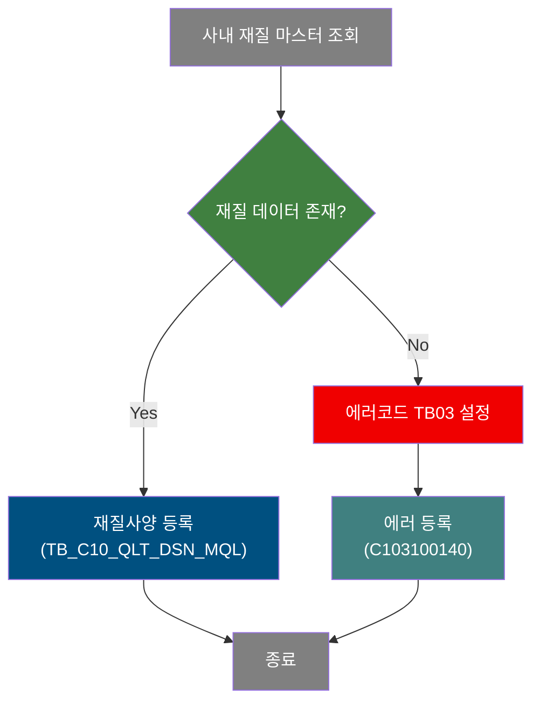
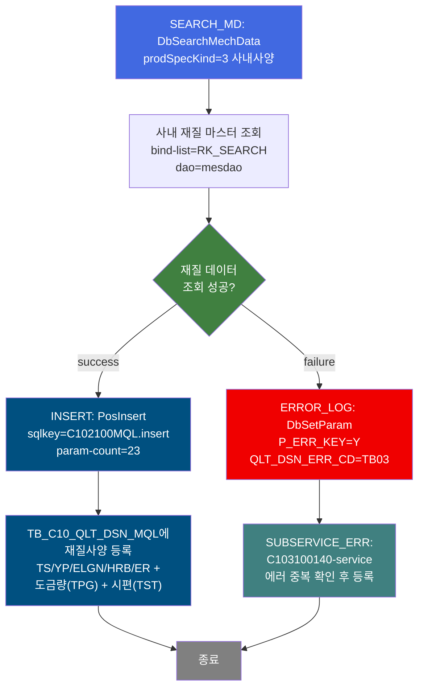
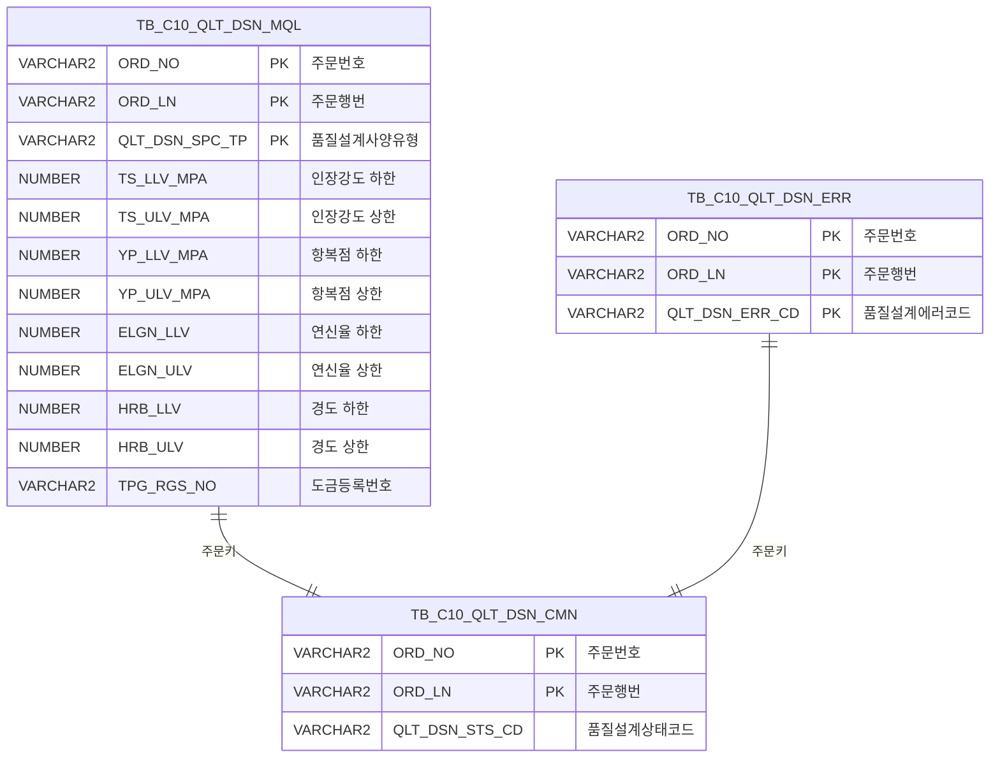

<h1 style="font-size: 40px; text-align: center; font-weight:
   bold; margin: 30px 0;">
  C102100120 레거시 시스템 분석 종합 보고서
</h1>


# 1. 시스템 개요
- **서비스 ID**: C102100120
- **업무명**: 사내사양(K) 재질사양 편성
- **분석 일시**: 2026-03-16 19:27 KST
- **분석 시간**: 약 2분
- **전체 Activity 수**: 4개 (Custom 1, Built-in 2, Common 1)
- **분석자**: Claude Opus 4.6
- **분석 도구**: /analyze-service C102100120
- **문서 버전**: 1.0

# 📊 비즈니스 프로세스 분석

## 시스템 목적

C102100120 서비스는 **사내사양(prodSpecKind=3) 기반 재질사양(MQL: Mechanical Quality Level) 편성**을 수행하는 NUI(배치) 서비스이다. 상위 서비스 C102100110(사내사양 품질설계)에서 서브서비스로 호출되어, 각 주문에 대한 기계적 성질(인장강도, 항복점, 연신율, 경도 등)과 도금량 기준값을 마스터 데이터에서 조회하여 품질설계 재질사양 테이블에 등록한다.

`DbSearchMechData` Activity가 prodSpecKind=3(사내사양) 경로로 분기하여 사내 재질 마스터에서 기준값을 조회하고, `PosInsert`가 `TB_C10_QLT_DSN_MQL` 테이블에 23개 파라미터로 INSERT한다. 에러 발생 시 에러코드 TB03(재질MQL)을 설정하고 서브서비스 C103100140을 호출하여 에러를 기록한다.

## 핵심 워크플로우 다이어그램



### 상세 워크플로우 다이어그램



## 주요 유즈케이스

### UC-01: 사내사양 기반 재질사양 편성
- **Actor**: 품질설계 배치 시스템
- **목적**: 주문에 대해 사내 재질 마스터에서 기계적 성질 기준값을 조회하여 품질설계 재질사양을 자동 편성

- **전제조건**:
  - 상위 서비스(C102100110)에서 주문 목록 조회 및 루프 처리 완료
  - PosContext에 ORD_NO, ORD_LN, PRD_NM_CD, MQL_CD, ORD_EXC_THK가 설정됨
  - 사내 재질 마스터 데이터가 존재함

- **주요 흐름**:
  1. DbSearchMechData가 prodSpecKind=3(사내사양) 경로로 분기
  2. bind-list(RK_SEARCH)에서 주문 정보(품명코드, MQL코드, 두께)를 추출
  3. 사내 재질 마스터에서 기계적 성질 기준값 조회
  4. 조회 결과를 PosContext(RK_MAIN)에 등록
  5. PosInsert가 23개 파라미터로 TB_C10_QLT_DSN_MQL에 INSERT

- **대체 흐름**:
  - 사내 재질 마스터에 해당 데이터 없음: ERROR_LOG에서 에러코드 TB03 설정 → C103100140 서브서비스로 에러 등록

- **후행조건**:
  - TB_C10_QLT_DSN_MQL에 재질사양 레코드 생성됨
  - 에러 시 TB_C10_QLT_DSN_ERR에 에러 레코드 생성됨

### UC-02: 재질사양 편성 에러 처리
- **Actor**: 품질설계 배치 시스템
- **목적**: 재질 마스터 조회 실패 시 에러를 기록하여 후속 처리(재처리/수동 편성) 가능하게 함

- **전제조건**:
  - DbSearchMechData에서 마스터 조회 실패

- **주요 흐름**:
  1. ERROR_LOG Activity에서 P_ERR_KEY='Y', QLT_DSN_ERR_CD='TB03' 설정
  2. SUBSERVICE_ERR에서 C103100140-service 호출 (new-transaction=false, 동일 트랜잭션)
  3. C103100140이 중복 확인 후 TB_C10_QLT_DSN_ERR에 에러 등록

- **대체 흐름**:
  - 동일 에러가 이미 등록된 경우: C103100140 내부에서 중복 스킵

- **후행조건**:
  - TB_C10_QLT_DSN_ERR에 에러코드 TB03 레코드 존재

### UC-03: 기계적 성질 범위값 등록
- **Actor**: 품질설계 배치 시스템
- **목적**: 인장강도, 항복점, 연신율, 경도, 연신율비 5가지 기계적 성질의 상하한값을 정확하게 등록

- **전제조건**:
  - DbSearchMechData에서 재질 마스터 조회 성공

- **주요 흐름**:
  1. 인장강도(TS) 상하한: TS_LLV_MPA, TS_ULV_MPA
  2. 항복점(YP) 상하한: YP_LLV_MPA, YP_ULV_MPA
  3. 연신율(ELGN) 상하한: ELGN_LLV, ELGN_ULV
  4. 경도(HRB) 상하한: HRB_LLV, HRB_ULV
  5. 연신율비(ER) 상하한: ER_LLV, ER_ULV
  6. 추가로 도금량(TPG_RGS_NO) 및 시편 관련 7개 파라미터도 함께 등록

- **대체 흐름**:
  - 특정 성질값이 null인 경우: null 그대로 INSERT (마스터에 정의되지 않은 항목)

- **후행조건**:
  - TB_C10_QLT_DSN_MQL에 5가지 기계적 성질 + 도금량 + 시편 정보가 한 레코드로 등록됨

---
## 비즈니스 로직 상세

### 1. 사내사양(prodSpecKind=3) 재질 마스터 조회 로직 (DbSearchMechData)

- **목적**: prodSpecKind 속성값에 따라 4가지 경로 중 사내사양(3) 경로로 분기하여 사내 재질 마스터에서 기준값을 조회
- **처리 케이스**:

  **[케이스: 사내사양 경로 (prodSpecKind=3)]**
  ```
    조건: Service XML의 prodSpecKind 속성이 "3"
    처리:
      1. bind-list(RK_SEARCH)에서 현재 루프 행의 품명코드(PRD_NM_CD), MQL코드(MQL_CD), 주문두께(ORD_EXC_THK) 추출
      2. 사내 재질 마스터 테이블에서 해당 조건으로 기계적 성질 기준값 조회
      3. 조회 결과(TS/YP/ELGN/HRB/ER 상하한, 도금량, 시편 정보)를 PosContext(RK_MAIN)에 등록
      4. success 전이 → INSERT Activity로 이동
  ```

  **[케이스: 조회 실패 시]**
  ```
    조건: 사내 재질 마스터에 해당 품명/MQL/두께 조합 데이터 없음
    처리:
      1. failure 전이 → ERROR_LOG Activity
      2. P_ERR_KEY='Y' 설정으로 에러 발생 플래그 등록
      3. QLT_DSN_ERR_CD='TB03' 설정 (재질MQL 에러 코드)
  ```

### 2. 재질사양 INSERT (C102100MQL.insert)

- **목적**: 주문별 재질사양(기계적 성질 + 도금량 + 시편)을 TB_C10_QLT_DSN_MQL 테이블에 등록
- **INSERT 파라미터 구조** (총 23개):

  ```
  주문 키 (3개):
    param0: ORD_NO (주문번호)
    param1: ORD_LN (주문행번)
    param2: QLT_DSN_SPC_TP (품질설계사양유형)

  기계적 성질 범위값 (10개 = 5종 × 상하한):
    param3~4: TS_LLV_MPA, TS_ULV_MPA (인장강도 MPa)
    param5~6: YP_LLV_MPA, YP_ULV_MPA (항복점 MPa)
    param7~8: ELGN_LLV, ELGN_ULV (연신율 %)
    param9~10: HRB_LLV, HRB_ULV (경도 HRB)
    param11~12: ER_LLV, ER_ULV (연신율비)

  도금/시편 정보 (10개):
    param13: MQL_BND_TST_STD_CD (재질굽힘시험기준코드)
    param14: TST_PIC_GTH_INST_LOC (시편채취지시위치)
    param15: TST_PIC_GTH_INST_LTH (시편채취지시길이)
    param16: TPG_RGS_NO (도금등록번호)
    param17~18: TST_GW_FRN_LLV, TST_GW_FRN_ULV (시편도금량 앞면 상하한)
    param19~20: TST_GW_BAK_LLV, TST_GW_BAK_ULV (시편도금량 뒷면 상하한)
    param21~22: TST_GW_TOT_LLV, TST_GW_TOT_ULV (시편도금량 합계 상하한)
  ```

- **예외 처리**:
  - INSERT 실패 시: 상위 서비스(C102100110)의 ROUTER_CHK_ERR에서 P_ERR_KEY 확인 후 에러 처리

---

# ⚙️ Java 컴포넌트 분석

## Custom Activity 상세 분석

### 1개 Custom Activity 발견

### 1. DbSearchMechData (SEARCH_MD)
- **클래스명**: com.unionsteel.mes.c10.activity.nui.DbSearchMechData
- **액티비티명**: SEARCH_MD
- **파일 경로**: src/com/unionsteel/mes/c10/activity/nui/DbSearchMechData.java
- **주요 기능**: prodSpecKind에 따라 4가지 재질 마스터 소스(고객/규격/사내/보증)에서 기계적 성질 기준값을 조회하여 PosContext에 등록

#### 메소드 구조
- **주요 메소드**: runActivity
  - **반환 타입**: String (success/failure)
  - **파라미터**: PosContext ctx

#### 핵심 비즈니스 로직
- **prodSpecKind 분기**: Service XML의 prodSpecKind 속성값(1=고객, 2=규격, 3=사내, 4=보증)에 따라 4가지 조회 경로로 분기
- **본 서비스에서는 prodSpecKind=3**: 사내사양 경로로 고정 분기
- **데이터 등록**: 조회된 재질 기준값을 bind-result(RK_MAIN)에 등록하여 후속 INSERT Activity에서 사용

#### Java 상수 및 의존성
- **주요 상수**: C10NuiConstantsIF (NUI 배치 상수 인터페이스)
- **핵심 의존성**: PosActivity (GLUE Framework 기본 Activity), mesdao (MESAPUSER 스키마 DAO)

---

# 💾 데이터 요구사항

## 핵심 테이블

### 1. TB_C10_QLT_DSN_MQL - 품질설계 재질사양
| 컬럼명 | 타입 | PK | 설명 |
|--------|------|----|-----|
| ORD_NO | VARCHAR2 | ✅ | 주문번호 |
| ORD_LN | VARCHAR2 | ✅ | 주문행번 |
| QLT_DSN_SPC_TP | VARCHAR2 | ✅ | 품질설계사양유형 |
| TS_LLV_MPA | NUMBER | | 인장강도 하한 (MPa) |
| TS_ULV_MPA | NUMBER | | 인장강도 상한 (MPa) |
| YP_LLV_MPA | NUMBER | | 항복점 하한 (MPa) |
| YP_ULV_MPA | NUMBER | | 항복점 상한 (MPa) |
| ELGN_LLV | NUMBER | | 연신율 하한 (%) |
| ELGN_ULV | NUMBER | | 연신율 상한 (%) |
| HRB_LLV | NUMBER | | 경도 하한 (HRB) |
| HRB_ULV | NUMBER | | 경도 상한 (HRB) |
| ER_LLV | NUMBER | | 연신율비 하한 |
| ER_ULV | NUMBER | | 연신율비 상한 |
| MQL_BND_TST_STD_CD | VARCHAR2 | | 재질굽힘시험기준코드 |
| TST_PIC_GTH_INST_LOC | VARCHAR2 | | 시편채취지시위치 |
| TST_PIC_GTH_INST_LTH | NUMBER | | 시편채취지시길이 |
| TPG_RGS_NO | VARCHAR2 | | 도금등록번호 |
| TST_GW_FRN_LLV | NUMBER | | 시편도금량 앞면 하한 |
| TST_GW_FRN_ULV | NUMBER | | 시편도금량 앞면 상한 |
| TST_GW_BAK_LLV | NUMBER | | 시편도금량 뒷면 하한 |
| TST_GW_BAK_ULV | NUMBER | | 시편도금량 뒷면 상한 |
| TST_GW_TOT_LLV | NUMBER | | 시편도금량 합계 하한 |
| TST_GW_TOT_ULV | NUMBER | | 시편도금량 합계 상한 |

## 데이터 플로우

### 1. 재질사양 편성

```
[사내 재질 마스터 조회]
SEARCH_MD (DbSearchMechData, prodSpecKind=3)
→ 사내 재질 마스터 테이블에서 기계적 성질 기준값 조회
  조건: PRD_NM_CD(품명코드), MQL_CD(MQL코드), ORD_EXC_THK(주문두께)
→ 조회 결과를 RK_MAIN에 등록

[재질사양 등록]
INSERT (PosInsert)
→ C102100MQL.insert
  INTO TB_C10_QLT_DSN_MQL
  VALUES (ORD_NO, ORD_LN, QLT_DSN_SPC_TP,
          TS/YP/ELGN/HRB/ER 상하한 10개,
          도금량/시편 관련 10개)
  isAudit=true (감사 컬럼 자동 기록)
→ 재질사양 1건 등록 완료
```

### 2. 에러 처리

```
[에러 발생 시]
ERROR_LOG (DbSetParam)
→ P_ERR_KEY = 'Y' 설정
→ QLT_DSN_ERR_CD = 'TB03' 설정

[에러 등록]
SUBSERVICE_ERR (PosSubBizControlActivity)
→ C103100140-service 호출 (동일 트랜잭션)
  INTO TB_C10_QLT_DSN_ERR
  (ORD_NO, ORD_LN, QLT_DSN_ERR_CD='TB03')
  중복 확인 후 INSERT
```

## SQL 일람표

| SQL 이름 | 쿼리 ID | 타입 | 출처 | 테이블 |
|---------|---------|-----|-------|-------|
| 품질설계 재질사양 등록 | C102100MQL.insert | INSERT | Service | TB_C10_QLT_DSN_MQL |

## ER 다이어그램 (핵심 관계)



관계 설명:
- TB_C10_QLT_DSN_CMN이 중심 테이블로 주문 정보 허브 역할
- TB_C10_QLT_DSN_MQL은 ORD_NO + ORD_LN으로 CMN과 1:1 관계 (사양유형별)
- TB_C10_QLT_DSN_ERR은 에러 발생 시에만 레코드 생성 (에러코드별 1건)

---

# 🔗 서브서비스

## 서브서비스 요약

| 서비스 ID | 설명 | 호출 액티비티 | 트랜잭션 | 상세 분석 |
|-----------|------|-------------|---------|----------|
| C103100140 | 품질설계결과 에러 등록 (중복 방지) | SUBSERVICE_ERR | 동일 트랜잭션 (new-transaction=false) | [상세 분석](./C103100140_legacy_analysis.md) |

### C103100140 - 품질설계결과 에러 등록
ORD_NO + ORD_LN + QLT_DSN_ERR_CD 복합키로 기존 에러 레코드 존재 여부를 먼저 확인(DbSearchCmnErrorCheck)하고, 중복이 없는 경우에만 TB_C10_QLT_DSN_ERR에 INSERT한다. Activity 2개, SQL 2개로 구성된 단순 서비스.

# 📌 특이사항 및 주의사항

## 1. prodSpecKind=3 고정 분기
- **사내사양 전용**: DbSearchMechData는 4가지 경로(고객/규격/사내/보증)를 지원하는 공유 클래스이나, 본 서비스에서는 Service XML의 `prodSpecKind="3"` 속성으로 사내사양 경로만 사용
- **동일 클래스 재사용**: C102100140(보증사양, prodSpecKind=4)과 동일한 DbSearchMechData 클래스를 사용하며, 속성값만 다름

## 2. 에러코드 TB03 (재질MQL)
- **에러코드 체계**: TB01(규격공통), TB02(성분CHM), **TB03(재질MQL)**, TB04(인수도DLV) 등 품질설계 에러코드 체계의 일부
- **에러 등록 서브서비스**: C103100140의 중복 방지 로직으로 동일 주문-에러코드 조합은 1회만 등록됨

## 3. C102100140과의 구조적 동일성
- **동일 패턴**: C102100140(보증사양 재질)과 서비스 구조가 거의 동일 (SEARCH_MD → INSERT, ERROR_LOG → SUBSERVICE_ERR)
- **차이점**: prodSpecKind 속성값만 다름 (3 vs 4), 나머지 Activity 구성, INSERT SQL, 파라미터 수(23개) 모두 동일
- **INSERT 파라미터 수 차이 주의**: C102100140은 서비스 XML 기준 param-count가 다를 수 있으나, 실제 SQL(C102100MQL.insert)은 동일

## 4. 트랜잭션 관리
- **서브서비스 호출 시 new-transaction=false**: 에러 등록(C103100140)이 상위 서비스와 동일 트랜잭션에서 실행됨
- **상위 서비스(C102100110)에서 커밋 관리**: 본 서비스는 자체 트랜잭션 관리 없이 상위 서비스의 커밋/롤백에 의존

# 📚 참고 문서

- **Query SQL**: `src/query/C102100MQL-query.glue_sql`
- **Service XML**: `src/service/C102100120-service.xml`
- **Custom Java 클래스**:
  - `src/com/unionsteel/mes/c10/activity/nui/DbSearchMechData.java`
