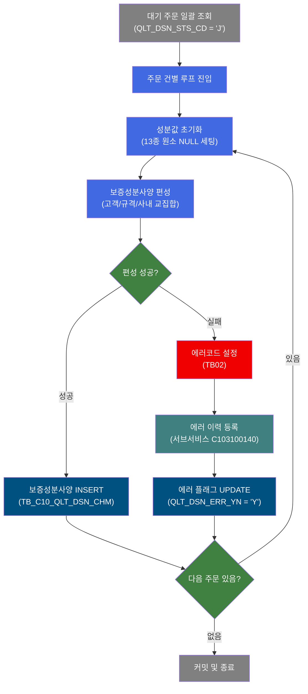
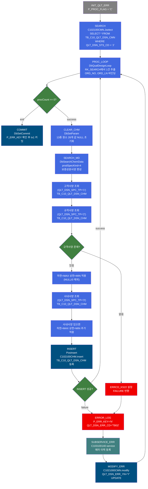
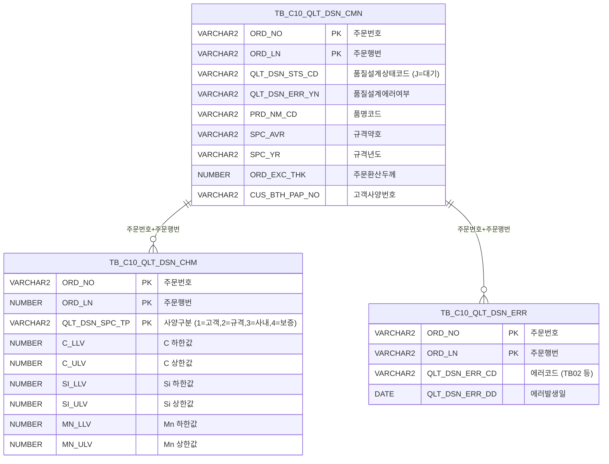

<h1 style="font-size: 40px; text-align: center; font-weight:
   bold; margin: 30px 0;">
  C102100130 레거시 시스템 분석 종합 보고서
</h1>


# 1. 시스템 개요
- **서비스 ID**: C102100130
- **업무명**: 품질설계 보증성분사양 편성 (NUI 배치)
- **분석 일시**: 2026-03-16 19:42 KST
- **분석 시간**: 약 5분
- **전체 Activity 수**: 10개 (Custom 2, Built-in 4, Common 4)
- **분석자**: Claude Opus 4.6
- **분석 도구**: /analyze-service C102100130
- **문서 버전**: 1.0

# 📊 비즈니스 프로세스 분석

## 시스템 목적

C102100130 서비스는 품질설계 프로세스에서 **보증성분사양(prodSpecKind=4)**을 편성하는 NUI 배치 서비스이다. 품질설계 상태코드가 'J'(대기)인 전체 주문을 일괄 조회하여, 각 주문에 대해 고객/규격/사내 세 가지 성분사양의 교집합(가장 엄격한 범위)을 계산하고 `TB_C10_QLT_DSN_CHM` 테이블에 보증사양으로 등록한다.

핵심 비즈니스 로직은 13종 화학원소(C, Si, Mn, P, S, Cr, Ni, Cu, Al, Ti, Nb, V, N)에 대해 **하한값은 최대값**, **상한값은 최소값(0/NULL 제외)**을 적용하여 세 사양을 모두 만족하는 최소 허용 범위를 산출하는 것이다. 규격사양이 존재하지 않으면 보증사양 편성이 불가하며 에러 처리된다.

서비스는 루프 구조로 동작하며, 대기 주문 전체를 순회하면서 건별로 성분사양 편성 → INSERT → 에러 시 에러 등록(서브서비스 C103100140) → 에러 플래그 UPDATE 흐름을 반복 수행한다. 트랜잭션 매니저(tx1, commit=true)가 설정되어 전체 처리 완료 후 일괄 커밋된다.

## 핵심 워크플로우 다이어그램



### 상세 워크플로우 다이어그램



## 주요 유즈케이스

### UC-01: 보증성분사양 일괄 편성

- **Actor**: NUI 배치 프로세스 (품질설계 시스템)
- **목적**: 대기 상태('J')인 전체 주문에 대해 보증성분사양을 자동으로 편성하여 TB_C10_QLT_DSN_CHM에 등록
- **전제조건**:
  - TB_C10_QLT_DSN_CMN에 QLT_DSN_STS_CD = 'J'인 주문이 존재
  - 각 주문에 대해 규격사양(QLT_DSN_SPC_TP='2')이 이미 편성되어 있어야 함
  - 고객사양(QLT_DSN_SPC_TP='1'), 사내사양(QLT_DSN_SPC_TP='3')은 선택적

- **주요 흐름**:
  1. INIT_QLT_ERR에서 P_PROC_FLAG = 'C' 초기화
  2. SEARCH에서 C102100CMN.Jselect로 대기 주문 전체 조회
  3. PROC_LOOP에서 1건씩 순회 (ORD_NO, ORD_LN 추출)
  4. CLEAR_CHM에서 13종 원소 26개 성분값을 NULL로 초기화
  5. SEARCH_MD(DbSearchChemData, prodSpecKind=4)에서 보증사양 편성:
     - 고객사양(1) 조회 → 규격사양(2) 조회(필수) → 사내사양(3) 조회
     - 하한값 = MAX(고객, 규격, 사내), 상한값 = MIN(고객, 규격, 사내) 적용
  6. INSERT에서 C102100CHM.insert로 보증성분사양 등록 (29개 파라미터)
  7. 다음 주문으로 루프 반복
  8. 전체 완료 후 COMMIT

- **대체 흐름**:
  - 규격사양 미존재: ERRCD_KS22 에러 → ERROR_LOG → SUBSERVICE_ERR(에러 등록) → MODIFY_ERR(에러 플래그 Y) → 다음 건 진행
  - INSERT 실패: ERROR_LOG → SUBSERVICE_ERR → MODIFY_ERR → 다음 건 진행

- **후행조건**:
  - 정상 처리 주문: TB_C10_QLT_DSN_CHM에 QLT_DSN_SPC_TP='4' 보증사양 1건 INSERT됨
  - 에러 발생 주문: TB_C10_QLT_DSN_ERR에 에러 이력 등록, TB_C10_QLT_DSN_CMN.QLT_DSN_ERR_YN = 'Y' 갱신

### UC-02: 보증성분사양 계산 (교집합 알고리즘)

- **Actor**: DbSearchChemData (prodSpecKind=4)
- **목적**: 고객/규격/사내 세 가지 성분사양의 교집합을 계산하여 가장 엄격한 허용 범위 결정
- **전제조건**:
  - 규격사양(QLT_DSN_SPC_TP='2')이 TB_C10_QLT_DSN_CHM에 존재 (필수)
  - 고객사양(QLT_DSN_SPC_TP='1'), 사내사양(QLT_DSN_SPC_TP='3')은 있으면 적용, 없으면 생략

- **주요 흐름**:
  1. 고객사양 조회 (C102100CHM.select, QLT_DSN_SPC_TP='1') → 있으면 ctx에 적재
  2. 규격사양 조회 (C102100CHM.select, QLT_DSN_SPC_TP='2') → 필수
  3. 규격사양 13종 원소 하한값: numCompare(기존값, 규격값, true) → 큰값 적용
  4. 규격사양 13종 원소 상한값: numCompare(기존값, 규격값, false) → 작은값(0/NULL 제외) 적용
  5. 사내사양 조회 (C102100CHM.select, QLT_DSN_SPC_TP='3') → 있으면 동일 로직 적용
  6. 최종 결과를 ctx에 저장 → 후속 INSERT Activity로 전달

- **대체 흐름**:
  - 규격사양 미존재: ERRCD_KS22 설정, FAILURE 반환 (보증사양 편성 불가)
  - 사내사양 미존재: 에러 없이 고객/규격 사양만으로 편성 계속

- **후행조건**:
  - ctx에 13종 원소 하한/상한 26개 값 + QLT_DSN_SPC_TP='4' 저장됨

### UC-03: 편성 에러 시 에러 등록 및 플래그 갱신

- **Actor**: NUI 배치 프로세스
- **목적**: 보증성분사양 편성 또는 INSERT 실패 시 에러 이력을 남기고 주문에 에러 플래그를 설정
- **전제조건**:
  - SEARCH_MD 또는 INSERT에서 FAILURE 반환

- **주요 흐름**:
  1. ERROR_LOG에서 P_ERR_KEY='N', QLT_DSN_ERR_CD='TB02' 설정
  2. SUBSERVICE_ERR에서 C103100140-service 호출 (동일 트랜잭션, new-transaction=false)
  3. C103100140 서비스가 TB_C10_QLT_DSN_ERR에 중복 체크 후 에러 이력 INSERT
  4. MODIFY_ERR에서 C1021000CMN.modify로 TB_C10_QLT_DSN_CMN.QLT_DSN_ERR_YN = 'Y' UPDATE
  5. PROC_LOOP로 돌아가 다음 주문 처리 계속

- **대체 흐름**:
  - 이미 동일 에러가 등록되어 있으면 C103100140에서 중복 INSERT 방지 (FAILURE 반환하지만 서비스 계속 진행)

- **후행조건**:
  - TB_C10_QLT_DSN_ERR에 에러 이력 등록 (신규인 경우)
  - TB_C10_QLT_DSN_CMN.QLT_DSN_ERR_YN = 'Y' 갱신

---

## 비즈니스 로직 상세

### 1. 보증성분사양 교집합 계산 (DbSearchChemData, prodSpecKind=4)

- **목적**: 고객/규격/사내 세 가지 성분사양의 허용 범위 교집합을 계산하여 세 사양을 모두 만족하는 가장 엄격한 보증 범위를 결정

- **처리 케이스**:

  **[케이스 1: 정상 편성 - 세 사양 모두 존재]**
  ```
  조건: 고객사양(1), 규격사양(2), 사내사양(3) 모두 TB_C10_QLT_DSN_CHM에 존재
  처리:
    1. 고객사양 조회 → 13종 원소 하한/상한값을 ctx에 적재
    2. 규격사양 조회 → 각 원소별 하한=MAX(고객, 규격), 상한=MIN(고객, 규격) 적용
    3. 사내사양 조회 → 각 원소별 하한=MAX(기존, 사내), 상한=MIN(기존, 사내) 적용
    4. 최종 결과: 세 사양의 교집합 범위
  ```

  **[케이스 2: 사내사양 미존재]**
  ```
  조건: 고객사양(1) 있음, 규격사양(2) 있음, 사내사양(3) 없음
  처리:
    1. 고객사양 + 규격사양 교집합만으로 보증사양 편성
    2. 에러 없이 정상 완료
  ```

  **[케이스 3: 규격사양 미존재 (에러)]**
  ```
  조건: 규격사양(QLT_DSN_SPC_TP='2') 미존재
  처리:
    1. ERRCD_KS22 에러코드 설정
    2. FAILURE 반환 → 에러 처리 흐름으로 전이
  ```

- **계산 공식**:

  ```
  보증 하한값(LLV) = MAX(고객 LLV, 규격 LLV, 사내 LLV)
  보증 상한값(ULV) = MIN(고객 ULV, 규격 ULV, 사내 ULV)
  단, NULL 또는 0인 값은 비교에서 제외 (numCompare 로직)

  대상 원소 (13종): C, Si, Mn, P, S, Cr, Ni, Cu, Al, Ti, Nb, V, N
  각 원소별 하한(_LLV), 상한(_ULV) → 총 26개 값 산출

  예시:
  C 하한값: 고객=0.05, 규격=0.04, 사내=0.06
    → 보증 C_LLV = MAX(0.05, 0.04, 0.06) = 0.06
  C 상한값: 고객=0.12, 규격=0.10, 사내=NULL
    → 보증 C_ULV = MIN(0.12, 0.10) = 0.10 (NULL 제외)
  ```

- **예외 처리**:
  - 규격사양 미존재: ERRCD_KS22 - 보증사양 편성 불가
  - INSERT 실패: 에러코드 TB02 설정 → 에러 등록 서브서비스 호출

### 2. 루프 제어 및 건별 처리 (DbQualDesignLoop)

- **목적**: 대기 주문 전체를 1건씩 순회하면서 보증사양 편성 처리를 반복 수행

- **처리 케이스**:

  **[케이스 1: 정상 루프 순회]**
  ```
  조건: procCount > 0
  처리:
    1. P_ERR_KEY = 'N', BATCH_JOB = 'true', QLT_DSN_ERR_YN = '' 초기화
    2. procCount -= 1, this_row = total_row - procCount
    3. RK_SEARCH에서 this_row번째 Row 탐색
    4. ORD_NO, ORD_LN 값을 ctx에 바인딩
    5. 'success' 반환 → CLEAR_CHM으로 전이
  ```

  **[케이스 2: 루프 종료]**
  ```
  조건: procCount == 0
  처리:
    1. ctx에서 카운터 변수(QLT_DSN_STS_CD_COUNT) 제거
    2. 'exit' 반환 → COMMIT으로 전이
  ```

### 3. 성분값 초기화 (CLEAR_CHM)

- **목적**: 이전 주문의 성분값이 다음 주문 편성에 영향을 주지 않도록 매 건 시작 전 13종 원소 26개 값을 NULL로 초기화

- **처리 케이스**:

  **[케이스 1: 전체 초기화]**
  ```
  조건: 항상 실행 (PROC_LOOP → CLEAR_CHM → SEARCH_MD 순서)
  처리:
    1. DbSetParam으로 26개 파라미터를 sp_null로 설정:
       C_LLV, C_ULV, SI_LLV, SI_ULV, MN_LLV, MN_ULV, P_LLV, P_ULV,
       S_LLV, S_ULV, CR_LLV, CR_ULV, NI_LLV, NI_ULV, CU_LLV, CU_ULV,
       AL_LLV, AL_ULV, TI_LLV, TI_ULV, NB_LLV, NB_ULV, V_LLV, V_ULV,
       N_LLV, N_ULV
    2. sp_null은 GLUE Framework에서 NULL 값으로 치환
  ```

---

# ⚙️ Java 컴포넌트 분석

## Custom Activity 상세 분석

### 2개 Custom Activity 발견

### 1. DbSearchChemData (SEARCH_MD)
- **클래스명**: `com.unionsteel.mes.c10.activity.nui.DbSearchChemData`
- **액티비티명**: `SEARCH_MD`
- **파일 경로**: `src/com/unionsteel/mes/c10/activity/nui/DbSearchChemData.java`
- **주요 기능**: 보증성분사양(prodSpecKind=4) 편성 - 고객/규격/사내 성분사양의 교집합 계산
- **라인 수**: 534 | **메소드 수**: 1

> `DbSearchChemData`는 철강 제품의 성분사양(Chemical Composition Specification)을 편성하는 NUI 액티비티 클래스이다. prodSpecKind 프로퍼티에 따라 고객(1)/규격(2)/사내(3)/보증(4) 4가지 유형의 성분사양을 조회·편성하며, C102100130에서는 prodSpecKind=4로 보증사양을 편성한다. 13종 원소의 하한/상한값에 대해 하한=MAX, 상한=MIN(NULL/0 제외) 알고리즘을 적용한다.

📎 **[상세 분석 보고서](../customClass/com.unionsteel.mes.c10.activity.nui.DbSearchChemData_class_analysis.md)**

---

### 2. DbQualDesignLoop (PROC_LOOP)
- **클래스명**: `com.unionsteel.mes.c10.activity.nui.DbQualDesignLoop`
- **액티비티명**: `PROC_LOOP`
- **파일 경로**: `src/com/unionsteel/mes/c10/activity/nui/DbQualDesignLoop.java`
- **주요 기능**: ResultSet 순회 루프 제어 - 대기 주문 전체를 1건씩 순차 처리
- **라인 수**: 171 | **메소드 수**: 1

> `DbQualDesignLoop`는 GLUE Framework 기반 NUI(배치) 서비스에서 이전 액티비티가 조회한 ResultSet을 1건씩 순회 처리하기 위한 루프 제어 액티비티이다. 역방향 카운터(procCount) 기반으로 순방향 인덱싱하며, 매 루프마다 bindSet.reset() 후 전체 순회하는 O(n²) 특성을 가진다. 40개 이상 서비스에서 공유 사용되는 공통 컴포넌트이다.

📎 **[상세 분석 보고서](../customClass/com.unionsteel.mes.c10.activity.nui.DbQualDesignLoop_class_analysis.md)**

---

# 💾 데이터 요구사항

## 핵심 테이블

### 1. TB_C10_QLT_DSN_CMN - 품질설계결과공통

| 컬럼명 | 타입 | PK | 설명 |
|--------|------|----|-----|
| ORD_NO | VARCHAR2 | ✅ | 주문번호 |
| ORD_LN | VARCHAR2 | ✅ | 주문행번 |
| QLT_DSN_STS_CD | VARCHAR2 | | 품질설계상태코드 (J=대기) |
| PLNT_TP | VARCHAR2 | | 공장구분 |
| PRD_NM_CD | VARCHAR2 | | 품명코드 |
| PRD_SHP | VARCHAR2 | | 제품형상 |
| FLOW_CHL | VARCHAR2 | | 유통경로 |
| ORD_KND | VARCHAR2 | | 주문종류 |
| ORD_PRD_GRD | VARCHAR2 | | 주문제품등급 |
| ORD_USG_CD | VARCHAR2 | | 주문용도코드 |
| CUS_CD | VARCHAR2 | | 고객코드 |
| ACT_CUS_CD | VARCHAR2 | | 실고객코드 |
| FNL_CUS_CD | VARCHAR2 | | 최종고객코드 |
| CUS_BTH_PAP_NO | VARCHAR2 | | 고객사양번호 |
| SPC_OFC | VARCHAR2 | | 규격기관 |
| SPC_AVR | VARCHAR2 | | 규격약호 |
| SPC_YR | VARCHAR2 | | 규격년도 |
| SPC_NM | VARCHAR2 | | 규격명 |
| SPC_FUL_NM | VARCHAR2 | | 규격전체명 |
| ORD_SZ | VARCHAR2 | | 주문사이즈 |
| ORD_EXC_THK | NUMBER | | 주문환산두께 |
| ORD_EXC_WTH | NUMBER | | 주문환산폭 |
| ORD_EXC_LTH | NUMBER | | 주문환산길이 |
| CUS_REQ_DLV_DD | VARCHAR2 | | 고객요청납기일 |
| ORD_SCH_DLV_DD | VARCHAR2 | | 주문예정납기일 |
| QLT_DSN_ERR_YN | VARCHAR2 | | 품질설계에러여부 (Y/N) |
| LAST_UPDATED_OBJECT_TYPE | VARCHAR2 | | 최종변경OBJECT유형 |
| LAST_UPDATED_OBJECT_ID | VARCHAR2 | | 최종변경OBJECTID |
| LAST_UPDATE_PROGRAM_ID | VARCHAR2 | | 최종변경프로그램ID |
| LAST_UPDATE_TIMESTAMP | DATE | | 최종변경일시 |

### 2. TB_C10_QLT_DSN_CHM - 품질설계결과성분

| 컬럼명 | 타입 | PK | 설명 |
|--------|------|----|-----|
| ORD_NO | VARCHAR2 | ✅ | 주문번호 |
| ORD_LN | NUMBER | ✅ | 주문행번 |
| QLT_DSN_SPC_TP | VARCHAR2 | ✅ | 품질설계사양구분 (1=고객, 2=규격, 3=사내, 4=보증) |
| C_LLV | NUMBER | | C 하한값 |
| C_ULV | NUMBER | | C 상한값 |
| SI_LLV | NUMBER | | Si 하한값 |
| SI_ULV | NUMBER | | Si 상한값 |
| MN_LLV | NUMBER | | Mn 하한값 |
| MN_ULV | NUMBER | | Mn 상한값 |
| P_LLV | NUMBER | | P 하한값 |
| P_ULV | NUMBER | | P 상한값 |
| S_LLV | NUMBER | | S 하한값 |
| S_ULV | NUMBER | | S 상한값 |
| CR_LLV | NUMBER | | Cr 하한값 |
| CR_ULV | NUMBER | | Cr 상한값 |
| NI_LLV | NUMBER | | Ni 하한값 |
| NI_ULV | NUMBER | | Ni 상한값 |
| CU_LLV | NUMBER | | Cu 하한값 |
| CU_ULV | NUMBER | | Cu 상한값 |
| AL_LLV | NUMBER | | Al 하한값 |
| AL_ULV | NUMBER | | Al 상한값 |
| TI_LLV | NUMBER | | Ti 하한값 |
| TI_ULV | NUMBER | | Ti 상한값 |
| NB_LLV | NUMBER | | Nb 하한값 |
| NB_ULV | NUMBER | | Nb 상한값 |
| V_LLV | NUMBER | | V 하한값 |
| V_ULV | NUMBER | | V 상한값 |
| N_LLV | NUMBER | | N 하한값 |
| N_ULV | NUMBER | | N 상한값 |
| CREATED_OBJECT_TYPE | VARCHAR2 | | 생성OBJECT유형 |
| CREATED_OBJECT_ID | VARCHAR2 | | 생성OBJECTID |
| CREATED_PROGRAM_ID | VARCHAR2 | | 생성프로그램ID |
| CREATION_TIMESTAMP | DATE | | 생성일시 |
| LAST_UPDATED_OBJECT_TYPE | VARCHAR2 | | 최종변경OBJECT유형 |
| LAST_UPDATED_OBJECT_ID | VARCHAR2 | | 최종변경OBJECTID |
| LAST_UPDATE_PROGRAM_ID | VARCHAR2 | | 최종변경프로그램ID |
| LAST_UPDATE_TIMESTAMP | DATE | | 최종변경일시 |

### 3. TB_C10_QLT_DSN_ERR - 품질설계에러이력

| 컬럼명 | 타입 | PK | 설명 |
|--------|------|----|-----|
| ORD_NO | VARCHAR2 | ✅ | 주문번호 |
| ORD_LN | VARCHAR2 | ✅ | 주문행번 |
| QLT_DSN_ERR_CD | VARCHAR2 | | 품질설계에러코드 |
| QLT_DSN_ERR_DD | DATE | | 에러발생일 (SYSDATE 자동) |
| CREATED_OBJECT_TYPE | VARCHAR2 | | 생성OBJECT유형 |
| CREATED_OBJECT_ID | VARCHAR2 | | 생성OBJECTID |
| CREATED_PROGRAM_ID | VARCHAR2 | | 생성프로그램ID |
| CREATION_TIMESTAMP | DATE | | 생성일시 |
| LAST_UPDATED_OBJECT_TYPE | VARCHAR2 | | 최종변경OBJECT유형 |
| LAST_UPDATED_OBJECT_ID | VARCHAR2 | | 최종변경OBJECTID |
| LAST_UPDATE_PROGRAM_ID | VARCHAR2 | | 최종변경프로그램ID |
| LAST_UPDATE_TIMESTAMP | DATE | | 최종변경일시 |

## 데이터 플로우

### 1. 대기 주문 일괄 조회

```
서비스 시작 (INIT_QLT_ERR → SEARCH)
→ C102100CMN.Jselect
  SELECT * FROM TB_C10_QLT_DSN_CMN
  WHERE QLT_DSN_STS_CD = 'J'
→ RK_SEARCH에 전체 대기 주문 ResultSet 적재
→ PROC_LOOP에서 1건씩 순회 시작
```

### 2. 보증성분사양 조회 및 편성 (건별)

```
CLEAR_CHM에서 13종 원소 26개 값 NULL 초기화
→ SEARCH_MD (DbSearchChemData, prodSpecKind=4)
  1차: C102100CHM.select (QLT_DSN_SPC_TP='1') → 고객사양 조회
    FROM TB_C10_QLT_DSN_CHM
    WHERE ORD_NO=? AND ORD_LN=? AND QLT_DSN_SPC_TP='1'
  2차: C102100CHM.select (QLT_DSN_SPC_TP='2') → 규격사양 조회 (필수)
    하한값 = MAX(고객, 규격), 상한값 = MIN(고객, 규격) [NULL/0 제외]
  3차: C102100CHM.select (QLT_DSN_SPC_TP='3') → 사내사양 조회
    하한값 = MAX(기존, 사내), 상한값 = MIN(기존, 사내) [NULL/0 제외]
→ 편성 완료된 26개 값을 ctx에 저장
```

### 3. 보증성분사양 등록

```
SEARCH_MD 성공 시
→ INSERT (PosInsert)
  C102100CHM.insert
  INSERT INTO TB_C10_QLT_DSN_CHM
    (ORD_NO, ORD_LN, QLT_DSN_SPC_TP,
     C_LLV, C_ULV, SI_LLV, SI_ULV, MN_LLV, MN_ULV,
     P_LLV, P_ULV, S_LLV, S_ULV, CR_LLV, CR_ULV,
     NI_LLV, NI_ULV, CU_LLV, CU_ULV, AL_LLV, AL_ULV,
     TI_LLV, TI_ULV, NB_LLV, NB_ULV, V_LLV, V_ULV,
     N_LLV, N_ULV, 감사컬럼 8개)
  VALUES (?, ?, ?, ..., ?, ?, ?, ?)
  param-count: 29 (isAudit=true → 감사컬럼 자동 처리)
→ 성공 시 PROC_LOOP로 복귀 (다음 건)
```

### 4. 에러 처리 흐름

```
SEARCH_MD FAILURE 또는 INSERT FAILURE 시
→ ERROR_LOG: P_ERR_KEY='N', QLT_DSN_ERR_CD='TB02'
→ SUBSERVICE_ERR: C103100140-service 호출 (new-transaction=false)
  - TB_C10_QLT_DSN_ERR 중복 체크 후 에러 INSERT
→ MODIFY_ERR: C1021000CMN.modify
  UPDATE TB_C10_QLT_DSN_CMN
  SET QLT_DSN_ERR_YN = 'Y',
      LAST_UPDATED_* = 감사정보
  WHERE ORD_NO=? AND ORD_LN=?
→ PROC_LOOP로 복귀 (다음 건)
```

## SQL 일람표

| SQL 이름 | 쿼리 ID | 타입 | 출처 | 테이블 |
|---------|---------|-----|------|--------|
| 대기 주문 조회 | C102100CMN.Jselect | SELECT | Service (C102100130-service.xml) | TB_C10_QLT_DSN_CMN |
| 보증성분사양 등록 | C102100CHM.insert | INSERT | Service (C102100130-service.xml) | TB_C10_QLT_DSN_CHM |
| 에러 플래그 갱신 | C1021000CMN.modify | UPDATE | Service (C102100130-service.xml) | TB_C10_QLT_DSN_CMN |
| 성분사양 조회 (보증편성용) | C102100CHM.select | SELECT | com.unionsteel.mes.c10.activity.nui.DbSearchChemData | TB_C10_QLT_DSN_CHM |

## ER 다이어그램 (핵심 관계)



관계 설명:
- TB_C10_QLT_DSN_CMN이 중심 테이블로 주문 정보를 관리하며, 품질설계 상태(QLT_DSN_STS_CD)와 에러 여부(QLT_DSN_ERR_YN) 플래그를 가짐
- TB_C10_QLT_DSN_CHM은 주문별 성분사양을 관리하며, QLT_DSN_SPC_TP로 사양 유형(1~4)을 구분. 하나의 주문에 최대 4건의 성분사양 레코드 존재
- TB_C10_QLT_DSN_ERR은 주문별 품질설계 에러 이력을 관리. 에러코드별로 중복 방지 후 INSERT

---

# 🔗 서브서비스

## 서브서비스 요약

| 서비스 ID | 설명 | 호출 액티비티 | 트랜잭션 | 상세 분석 |
|-----------|------|-------------|---------|----------|
| C103100140 | 품질설계결과 에러 등록 (중복 방지) | SUBSERVICE_ERR | 기존 트랜잭션 공유 (new-transaction=false) | [상세 분석](./C103100140_legacy_analysis.md) |

### C103100140 - 품질설계결과 에러 등록
품질설계 과정에서 발생한 에러 정보를 TB_C10_QLT_DSN_ERR 테이블에 등록하는 서비스이다. ORD_NO + ORD_LN + QLT_DSN_ERR_CD 3개 복합키로 중복 체크(DbSearchCmnErrorCheck) 후 신규 에러만 INSERT한다. Activity 2개(Custom 1, Built-in 1), SQL 2개.

---

# 📌 특이사항 및 주의사항

## 1. 보증성분사양 교집합 계산의 NULL/0 제외 로직

- **numCompare 메소드**: 상한값 비교 시 NULL 또는 0인 값을 비교 대상에서 제외한다. 이는 성분사양이 설정되지 않은 원소에 대해 불필요하게 0이 최소값으로 적용되는 것을 방지하기 위한 설계이나, 실제로 상한값이 0인 정당한 케이스가 존재하면 의도치 않게 무시될 수 있다.
- **하한값 비교**: true 플래그로 MAX 비교 수행. NULL 처리는 동일하게 적용.

## 2. DbQualDesignLoop의 O(n²) 탐색 성능

- 매 루프마다 `bindSet.reset()` 후 처음부터 while 전체 순회하여 목표 Row를 탐색한다. 대기 주문이 100건이면 최대 5,050회 탐색이 발생한다.
- 품질설계 대기 주문 수가 수백 건 이상인 경우 성능 저하가 발생할 수 있으며, 대량 배치 처리 시 실행 시간이 주문 수의 제곱에 비례하여 증가한다.

## 3. 에러 발생 시에도 루프 계속 진행 (Partial Success 패턴)

- 특정 주문에서 보증사양 편성 실패 시 에러 등록(C103100140) → 에러 플래그 갱신(QLT_DSN_ERR_YN='Y') 후 다음 주문 처리를 계속한다.
- COMMIT은 전체 루프 완료 후 한 번만 수행되므로, 일부 주문은 정상 INSERT되고 일부는 에러 처리된 상태에서 한꺼번에 커밋된다.
- 루프 중간에 시스템 장애 발생 시 전체 롤백되어 정상 처리된 주문의 보증사양도 함께 소실된다.

## 4. 서브서비스 트랜잭션 공유 (new-transaction=false)

- C103100140 서브서비스가 `new-transaction=false`로 호출되어 부모 서비스의 트랜잭션(tx1)을 공유한다. 에러 등록(TB_C10_QLT_DSN_ERR INSERT)이 부모의 COMMIT 시점에 함께 커밋된다.
- C103100140 내부에서 중복 체크 후 FAILURE 반환해도 부모 서비스의 에러 처리 흐름에는 영향 없이 MODIFY_ERR로 정상 진행된다.

## 5. CLEAR_CHM의 성분값 초기화 필수성

- 루프 내에서 매 건마다 26개 성분값을 NULL로 초기화하지 않으면, 이전 주문의 성분값이 다음 주문 편성에 잔류하여 잘못된 보증사양이 산출될 수 있다.
- 특히 이전 주문에 사내사양이 있고 다음 주문에 사내사양이 없는 경우, 초기화가 없으면 이전 주문의 사내사양 값이 다음 주문의 보증사양에 반영되는 심각한 오류가 발생한다.

## 6. 에러코드 'TB02' 하드코딩

- ERROR_LOG Activity에서 QLT_DSN_ERR_CD를 'TB02'로 하드코딩 설정한다. 이 에러코드는 "보증성분사양 편성 실패"를 의미하며, 다른 품질설계 서비스(C102100020~C102100160)에서 각기 다른 에러코드를 사용한다.

## 7. Jselect 쿼리의 SELECT * 사용

- C102100CMN.Jselect 쿼리가 `SELECT *`를 사용하여 TB_C10_QLT_DSN_CMN의 전체 컬럼을 조회한다. 실제 사용하는 컬럼은 ORD_NO, ORD_LN 등 일부이므로 불필요한 데이터 전송이 발생한다.
- 테이블에 컬럼이 추가/삭제되면 예상치 못한 영향을 받을 수 있다.

---

# 📚 참고 문서

- **Query SQL**: `src/query/C102100CHM-query.glue_sql`, `src/query/C102100CMN-query.glue_sql`
- **Service XML**: `src/service/C102100130-service.xml`
- **Custom Java 클래스**:
  - `src/com/unionsteel/mes/c10/activity/nui/DbSearchChemData.java`
  - `src/com/unionsteel/mes/c10/activity/nui/DbQualDesignLoop.java`
- **서브서비스 분석**: [C103100140 분석 보고서](./C103100140_legacy_analysis.md)
