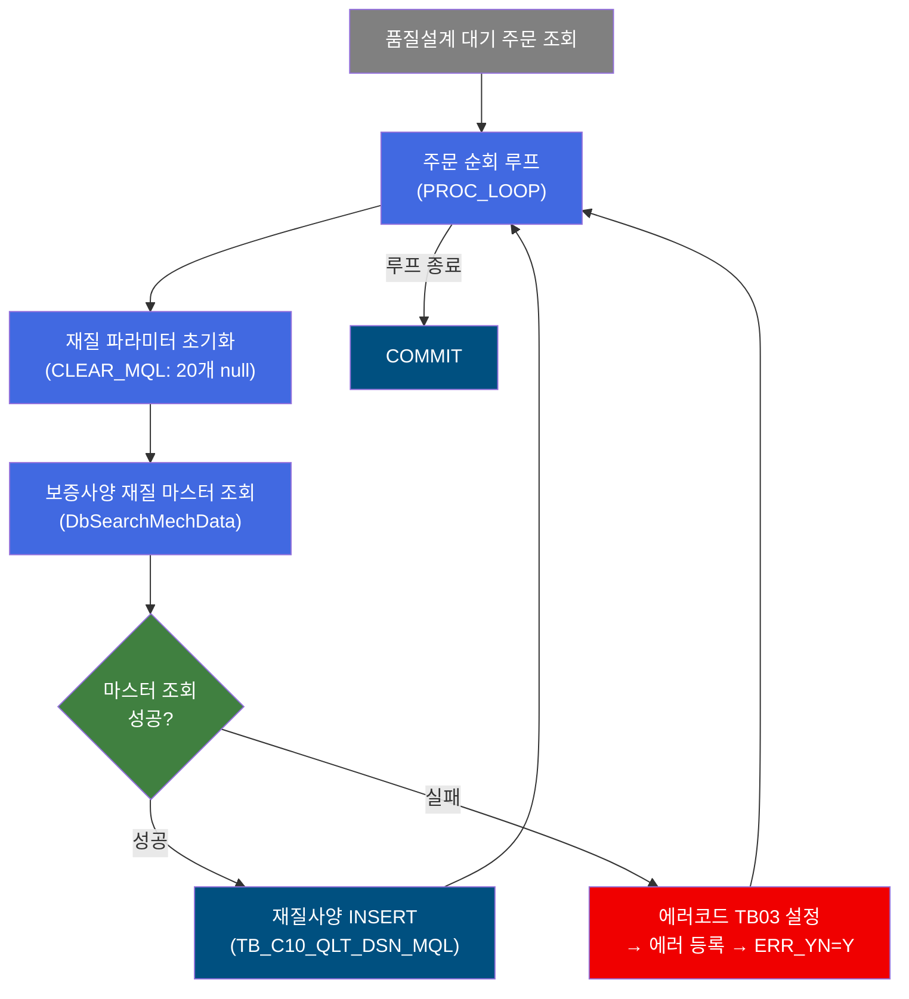
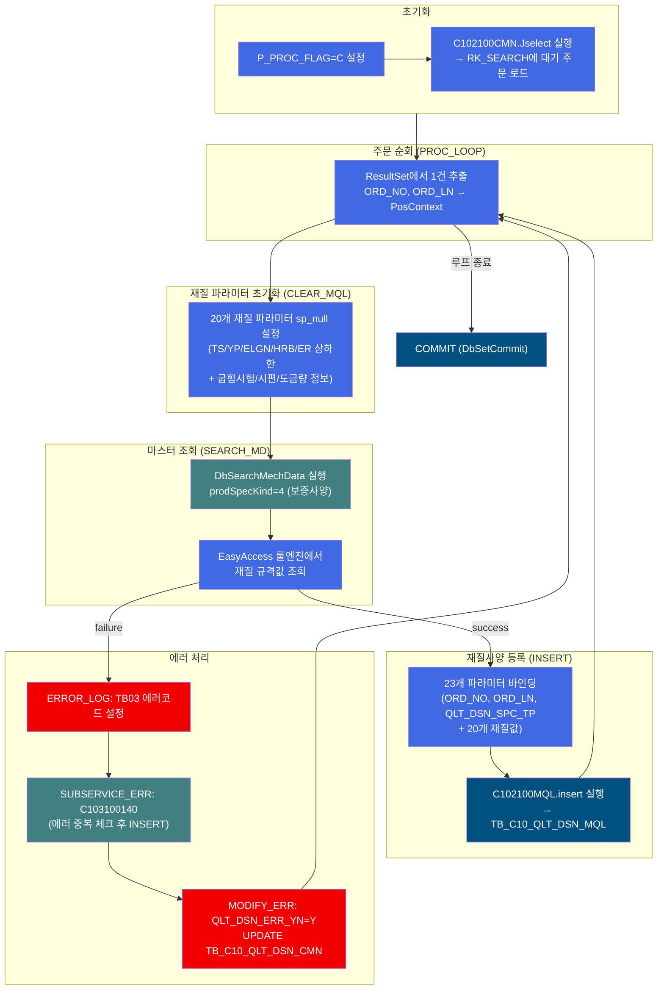
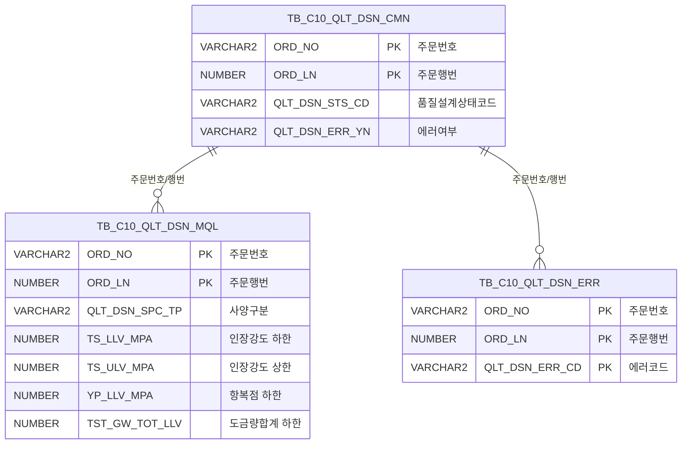

<h1 style="font-size: 40px; text-align: center; font-weight:
   bold; margin: 30px 0;">
  C102100140 레거시 시스템 분석 종합 보고서
</h1>


# 1. 시스템 개요
- **서비스 ID**: C102100140
- **업무명**: 보증사양(D) 재질 편성
- **분석 일시**: 2026-03-16 19:22 KST
- **분석 시간**: 약 2분
- **전체 Activity 수**: 10개 (Custom 2, Built-in 4, Common 4)
- **분석자**: Claude Opus 4.6
- **분석 도구**: /analyze-service C102100140
- **문서 버전**: 1.0

# 📊 비즈니스 프로세스 분석

## 시스템 목적

C102100140 서비스는 품질설계 자동화 프로세스에서 **보증사양(D) 기준의 재질(MQL: Mechanical Quality Level) 데이터를 일괄 편성**하는 NUI(배치) 서비스이다. `prodSpecKind=4`(보증사양)로 설정되어 있어, 보증 기준의 기계적 성질 규격값(인장강도/항복점/연신율/경도/에리쉔 등)과 도금량 감시 정보를 마스터 데이터에서 조회하여 `TB_C10_QLT_DSN_MQL` 테이블에 INSERT한다.

품질설계 대기 주문 전체를 조회(C102100CMN.Jselect)한 후, PROC_LOOP(DbQualDesignLoop)가 1건씩 순회하면서 각 주문에 대해 CLEAR_MQL(20개 재질 파라미터 초기화) → SEARCH_MD(DbSearchMechData로 마스터 조회) → INSERT(C102100MQL.insert로 23개 파라미터 등록)를 수행한다. 에러 발생 시 에러코드 `TB03`(재질MQL)을 설정하고, 서브서비스 C103100140으로 에러 이력을 기록한 후 MODIFY_ERR로 QLT_DSN_ERR_YN=Y를 UPDATE한다.

## 핵심 워크플로우 다이어그램



### 상세 워크플로우 다이어그램



## 주요 유즈케이스

### UC-01: 보증사양 재질 일괄 편성

- **Actor**: 품질설계 배치 프로세스 (상위 서비스 C102100000에서 호출)
- **목적**: 품질설계 대기 주문 전체에 대해 보증사양(D) 기준 재질 데이터를 일괄 편성

- **전제조건**:
  - TB_C10_QLT_DSN_CMN에 대기 상태 주문이 존재
  - EasyAccess 마스터에 보증사양 재질 규격 데이터가 등록되어 있음

- **주요 흐름**:
  1. INIT_QLT_ERR에서 P_PROC_FLAG=C 설정
  2. SEARCH에서 C102100CMN.Jselect로 대기 주문 전체 조회
  3. PROC_LOOP가 1건씩 순회하며 ORD_NO, ORD_LN을 PosContext에 세팅
  4. CLEAR_MQL에서 20개 재질 파라미터를 sp_null로 초기화
  5. SEARCH_MD(DbSearchMechData, prodSpecKind=4)로 보증사양 마스터 조회
  6. INSERT에서 C102100MQL.insert로 23개 파라미터를 TB_C10_QLT_DSN_MQL에 등록
  7. PROC_LOOP로 복귀하여 다음 주문 처리

- **대체 흐름**:
  - 마스터 데이터 미존재: ERROR_LOG(TB03) → SUBSERVICE_ERR(C103100140 에러 등록) → MODIFY_ERR(QLT_DSN_ERR_YN=Y)

- **후행조건**:
  - 각 주문에 대해 TB_C10_QLT_DSN_MQL에 보증사양 재질 레코드 등록
  - 에러 주문은 TB_C10_QLT_DSN_CMN.QLT_DSN_ERR_YN=Y 표시

### UC-02: 재질 편성 실패 시 에러 기록

- **Actor**: 품질설계 배치 프로세스
- **목적**: 마스터 데이터 부재 등으로 재질 편성이 실패한 경우 에러 이력을 기록하되 루프를 중단하지 않음

- **전제조건**:
  - SEARCH_MD Activity에서 마스터 조회 실패

- **주요 흐름**:
  1. ERROR_LOG: P_ERR_KEY=N(리셋), QLT_DSN_ERR_CD=TB03 설정
  2. SUBSERVICE_ERR: C103100140-service 호출 (new-transaction=false)
  3. MODIFY_ERR: C1021000CMN.modify로 QLT_DSN_ERR_YN=Y UPDATE
  4. PROC_LOOP로 복귀하여 다음 주문 계속 처리

- **대체 흐름**:
  - 동일 에러 이미 존재: C103100140이 중복 체크로 INSERT 스킵

- **후행조건**:
  - TB_C10_QLT_DSN_ERR에 에러코드 TB03 레코드 등록
  - TB_C10_QLT_DSN_CMN.QLT_DSN_ERR_YN=Y로 표시

### UC-03: 재질 파라미터 사전 초기화

- **Actor**: 품질설계 배치 프로세스
- **목적**: 이전 루프에서 남은 재질 데이터가 다음 주문에 혼입되지 않도록 20개 파라미터를 사전 초기화

- **전제조건**:
  - PROC_LOOP에서 새 주문 추출 직후

- **주요 흐름**:
  1. CLEAR_MQL에서 20개 재질 파라미터(TS/YP/ELGN/HRB/ER 상하한, 굽힘시험, 시편, 도금량 등)를 sp_null로 설정
  2. SEARCH_MD에서 새 값으로 덮어쓰기

- **후행조건**:
  - 마스터 조회 실패 시에도 이전 데이터가 잘못 INSERT되지 않음

---

## 비즈니스 로직 상세

### 1. 재질 마스터 조회 (DbSearchMechData)

- **목적**: 주문 정보를 기반으로 EasyAccess 룰 엔진에서 기계적 성질 규격값과 도금량 감시 정보를 조회

- **처리 케이스**:

  **[케이스 1: 보증사양(prodSpecKind=4) 재질 조회]**
  ```
    조건: prodSpecKind = 4 (보증사양)
    처리:
      1. PosContext에서 bind-list(RK_SEARCH)로 주문정보 추출
      2. EasyAccess 마스터에 보증사양 조건으로 조회
      3. 기계적 성질 10개(TS/YP/ELGN/HRB/ER 상하한) 추출
      4. 추가 속성 10개(굽힘시험기준코드, 시편채취위치/길이, 도금량 등) 추출
      5. bind_result(RK_RESULT)에 결과 저장
  ```

  **[케이스 2: 마스터 데이터 미존재]**
  ```
    조건: EasyAccess 조회 결과 없음
    처리:
      1. failure 전이 → ERROR_LOG
      2. 에러코드 TB03(재질MQL) 설정
      3. C103100140으로 에러 등록 → MODIFY_ERR로 ERR_YN=Y
  ```

- **23개 INSERT 파라미터 매핑**:

  ```
  [주문 키 - 3개]
  param0/1/2: ORD_NO / ORD_LN / QLT_DSN_SPC_TP

  [기계적 성질 - 10개]
  param3/4:   TS_LLV_MPA / TS_ULV_MPA     (인장강도 하한/상한, MPa)
  param5/6:   YP_LLV_MPA / YP_ULV_MPA     (항복점 하한/상한, MPa)
  param7/8:   ELGN_LLV / ELGN_ULV         (연신율 하한/상한, %)
  param9/10:  HRB_LLV / HRB_ULV           (경도 하한/상한, HRB)
  param11/12: ER_LLV / ER_ULV             (에리쉔 하한/상한, mm)

  [추가 속성 - 10개]
  param13:    MQL_BND_TST_STD_CD           (굽힘시험기준코드)
  param14:    TST_PIC_GTH_INST_LOC         (시편채취지시위치)
  param15:    TST_PIC_GTH_INST_LTH         (시편채취지시길이)
  param16:    TPG_RGS_NO                   (도금등록번호)
  param17/18: TST_GW_FRN_LLV / TST_GW_FRN_ULV  (시험도금량 표면 하한/상한)
  param19/20: TST_GW_BAK_LLV / TST_GW_BAK_ULV  (시험도금량 이면 하한/상한)
  param21/22: TST_GW_TOT_LLV / TST_GW_TOT_ULV  (시험도금량 합계 하한/상한)
  ```

---

# ⚙️ Java 컴포넌트 분석

## Custom Activity 상세 분석

### 2개 Custom Activity 발견

### 1. DbQualDesignLoop (PROC_LOOP)
- **클래스명**: com.unionsteel.mes.c10.activity.nui.DbQualDesignLoop
- **액티비티명**: PROC_LOOP
- **파일 경로**: src/com/unionsteel/mes/c10/activity/nui/DbQualDesignLoop.java
- **주요 기능**: ResultSet을 1건씩 순회하여 ORD_NO, ORD_LN을 PosContext에 매핑하는 루프 제어 Activity. 이 서비스에서는 2개 파라미터만 사용 (다른 서비스에서는 22개까지 사용).

### 2. DbSearchMechData (SEARCH_MD)
- **클래스명**: com.unionsteel.mes.c10.activity.nui.DbSearchMechData
- **액티비티명**: SEARCH_MD
- **파일 경로**: src/com/unionsteel/mes/c10/activity/nui/DbSearchMechData.java
- **주요 기능**: 마스터 데이터에서 재질사양 기준을 조회하여 기계적 성질(인장강도/항복점/연신율/경도/에리쉔)과 도금량 감시 정보를 편성. prodSpecKind(1=고객, 2=규격, 3=사내, 4=보증) 4가지 경로로 분기.

#### 핵심 비즈니스 로직
- **prodSpecKind=4 (보증사양)**: 이 서비스에서는 보증사양 마스터를 조회
- **EasyAccess 룰 엔진**: 품명코드, 두께, 폭 등을 조건으로 마스터 데이터 조회
- **20개 재질 파라미터**: 기계적 성질 10개 + 도금량/시편 정보 10개를 PosContext에 저장

---

# 💾 데이터 요구사항

## 핵심 테이블

### 1. TB_C10_QLT_DSN_MQL - (품질설계 재질사양)
| 컬럼명 | 타입 | PK | 설명 |
|--------|------|----|------|
| ORD_NO | VARCHAR2 | ✅ | 주문번호 |
| ORD_LN | NUMBER | ✅ | 주문행번 |
| QLT_DSN_SPC_TP | VARCHAR2 | | 품질설계사양구분 |
| TS_LLV_MPA | NUMBER | | 인장강도 하한 (MPa) |
| TS_ULV_MPA | NUMBER | | 인장강도 상한 (MPa) |
| YP_LLV_MPA | NUMBER | | 항복점 하한 (MPa) |
| YP_ULV_MPA | NUMBER | | 항복점 상한 (MPa) |
| ELGN_LLV | NUMBER | | 연신율 하한 (%) |
| ELGN_ULV | NUMBER | | 연신율 상한 (%) |
| HRB_LLV | NUMBER | | 경도 하한 (HRB) |
| HRB_ULV | NUMBER | | 경도 상한 (HRB) |
| ER_LLV | NUMBER | | 에리쉔 하한 (mm) |
| ER_ULV | NUMBER | | 에리쉔 상한 (mm) |
| MQL_BND_TST_STD_CD | VARCHAR2 | | 굽힘시험기준코드 |
| TST_PIC_GTH_INST_LOC | VARCHAR2 | | 시편채취지시위치 |
| TST_PIC_GTH_INST_LTH | NUMBER | | 시편채취지시길이 |
| TPG_RGS_NO | VARCHAR2 | | 도금등록번호 |
| TST_GW_FRN_LLV | NUMBER | | 시험도금량 표면 하한 |
| TST_GW_FRN_ULV | NUMBER | | 시험도금량 표면 상한 |
| TST_GW_BAK_LLV | NUMBER | | 시험도금량 이면 하한 |
| TST_GW_BAK_ULV | NUMBER | | 시험도금량 이면 상한 |
| TST_GW_TOT_LLV | NUMBER | | 시험도금량 합계 하한 |
| TST_GW_TOT_ULV | NUMBER | | 시험도금량 합계 상한 |

## 데이터 플로우

### 1. 대기 주문 조회 및 재질 편성

```
[보증사양 재질 일괄 편성]
INIT_QLT_ERR: P_PROC_FLAG=C 설정
→ SEARCH: C102100CMN.Jselect
  FROM TB_C10_QLT_DSN_CMN
  WHERE 대기 상태 조건
  → RK_SEARCH에 ResultSet 로드

[주문별 처리]
PROC_LOOP: 1건 추출 (ORD_NO, ORD_LN)
→ CLEAR_MQL: 20개 재질 파라미터 sp_null 초기화
→ SEARCH_MD (DbSearchMechData, prodSpecKind=4)
  EasyAccess 보증사양 마스터 조회
→ INSERT: C102100MQL.insert
  INTO TB_C10_QLT_DSN_MQL
  VALUES (23개 파라미터 + audit 8개)
→ PROC_LOOP 복귀
```

### 2. 에러 처리

```
[재질 편성 실패 시]
SEARCH_MD failure
→ ERROR_LOG: P_ERR_KEY=N, QLT_DSN_ERR_CD=TB03
→ SUBSERVICE_ERR: C103100140 호출
  → 에러 중복 체크 후 TB_C10_QLT_DSN_ERR INSERT
→ MODIFY_ERR: C1021000CMN.modify
  UPDATE TB_C10_QLT_DSN_CMN SET QLT_DSN_ERR_YN='Y'
→ PROC_LOOP 복귀 (다음 주문 계속)
```

## SQL 일람표

| SQL 이름 | 쿼리 ID | 타입 | 출처 | 테이블 |
|---------|---------|------|------|--------|
| 대기 주문 조회 | C102100CMN.Jselect | SELECT | Service | TB_C10_QLT_DSN_CMN |
| 에러 플래그 UPDATE | C1021000CMN.modify | UPDATE | Service | TB_C10_QLT_DSN_CMN |
| 재질사양 등록 | C102100MQL.insert | INSERT | Service | TB_C10_QLT_DSN_MQL |

## ER 다이어그램 (핵심 관계)



관계 설명:
- TB_C10_QLT_DSN_CMN이 중심 테이블로 대기 주문 목록 제공 및 에러 플래그 관리
- TB_C10_QLT_DSN_MQL은 주문별/사양유형별 재질 규격값 저장
- TB_C10_QLT_DSN_ERR은 에러코드(TB03)별 이력 관리

---

# 🔗 서브서비스

## 서브서비스 요약

| 서비스 ID | 설명 | 호출 액티비티 | 트랜잭션 | 상세 분석 |
|-----------|------|-------------|---------|----------|
| C103100140 | 품질설계결과 에러 등록 (중복 방지) | SUBSERVICE_ERR | 기존 트랜잭션 공유 | [상세 분석](./C103100140_legacy_analysis.md) |

### C103100140 - 품질설계결과 에러 등록
ORD_NO + ORD_LN + QLT_DSN_ERR_CD 복합키로 중복 체크 후 TB_C10_QLT_DSN_ERR에 INSERT. Activity 2개, SQL 2개.

---

# 📌 특이사항 및 주의사항

## 1. 독립 루프 구조 (자체 SEARCH + PROC_LOOP)
- **자체 주문 조회**: C102100030과 달리 이 서비스가 직접 C102100CMN.Jselect로 대기 주문을 조회하고 PROC_LOOP로 순회
- **상위 서비스 의존 최소화**: 상위 서비스(C102100000)에서 호출되지만 자체 루프를 가져 독립적으로 동작 가능
- **PROC_LOOP 파라미터 2개만**: ORD_NO, ORD_LN만 사용 (C102100030은 22개 사용)

## 2. CLEAR_MQL 사전 초기화 (20개 파라미터)
- **데이터 혼입 방지**: 이전 루프 반복에서 남은 재질 데이터가 다음 주문에 잘못 INSERT되는 것을 방지
- **sp_null 패턴**: DbSetParam의 sp_null 값으로 PosContext 키를 명시적 null로 설정
- **SEARCH_MD 실패 시 보호**: 마스터 조회 실패해도 이전 주문의 재질값이 남아있지 않음

## 3. 에러 처리의 P_ERR_KEY 리셋 특이점
- **ERROR_LOG에서 P_ERR_KEY=N 설정**: 에러 발생 시 P_ERR_KEY를 Y가 아닌 N으로 설정하는 점이 C102100030과 다름
- **이유**: 이 서비스는 ROUTER_CHK_ERR 없이 직접 에러 처리 후 PROC_LOOP로 복귀하므로, 별도의 에러 플래그 리셋이 불필요
- **MODIFY_ERR → PROC_LOOP 직행**: 에러 기록 후 곧바로 다음 주문 처리

## 4. 도금량 감시 정보의 포함
- **재질 + 도금량**: 순수 기계적 성질(TS/YP/ELGN/HRB/ER)뿐 아니라 도금량(TST_GW_FRN/BAK/TOT) 감시 정보까지 포함
- **표면/이면/합계**: 도금량을 표면(FRN), 이면(BAK), 합계(TOT) 3방향으로 상/하한 관리
- **TPG_RGS_NO**: 도금등록번호로 도금 마스터와 연결

---

# 📚 참고 문서

- **Query SQL**: `src/query/C102100MQL-query.glue_sql`, `src/query/C102100CMN-query.glue_sql`, `src/query/C1021000CMN-query.glue_sql`
- **Service XML**: `src/service/C102100140-service.xml`
- **Custom Java 클래스**:
  - `src/com/unionsteel/mes/c10/activity/nui/DbQualDesignLoop.java`
  - `src/com/unionsteel/mes/c10/activity/nui/DbSearchMechData.java`
- **서브서비스 분석**: `docs/analysis/service/nui/C103100140_legacy_analysis.md`
