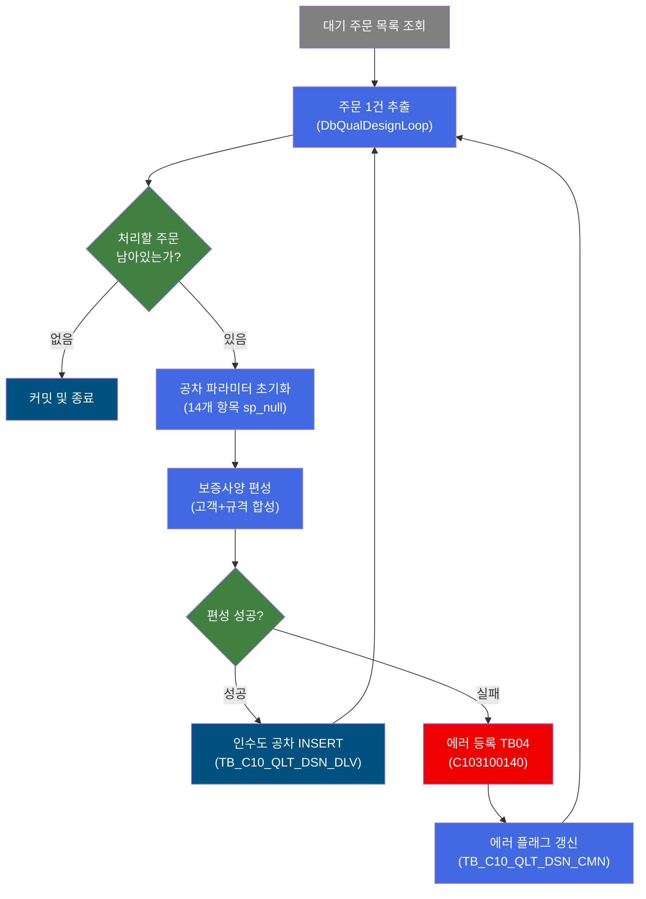
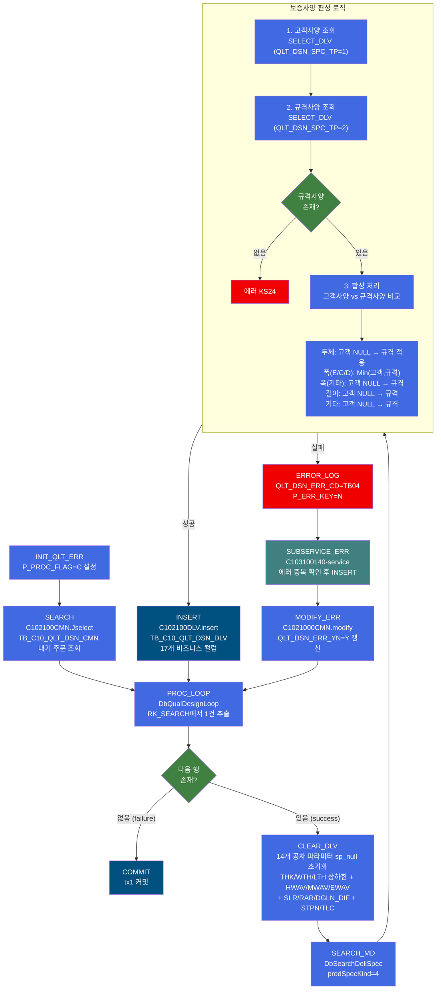
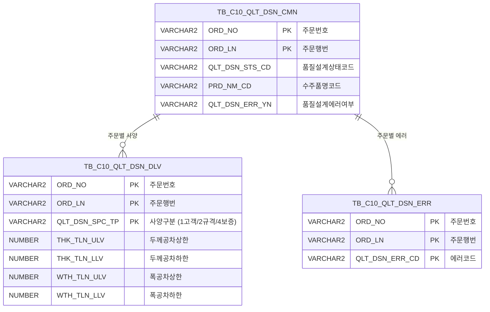

<h1 style="font-size: 40px; text-align: center; font-weight:
   bold; margin: 30px 0;">
  C102100150 레거시 시스템 분석 종합 보고서
</h1>


# 1. 시스템 개요
- **서비스 ID**: C102100150
- **업무명**: 보증사양(G) 인수도 공차 편성
- **분석 일시**: 2026-03-16 19:53 KST
- **분석 시간**: 약 2분
- **전체 Activity 수**: 10개 (Custom 2, Built-in 4, Common 4)
- **분석자**: Claude Opus 4.6
- **분석 도구**: /analyze-service C102100150
- **문서 버전**: 1.0

# 📊 비즈니스 프로세스 분석

## 시스템 목적

C102100150 서비스는 품질설계 배치 프로세스에서 **보증사양(prodSpecKind=4)** 기준의 인수도 공차(두께/폭/길이 허용공차, 평탄도, 직선도, 직각도, 대각선차, 급준도, Telescope)를 편성하여 `TB_C10_QLT_DSN_DLV` 테이블에 등록하는 NUI 서비스이다.

보증사양은 고객사양(QLT_DSN_SPC_TP=1)과 규격사양(QLT_DSN_SPC_TP=2)을 모두 조회한 후, 두 사양을 비교하여 **더 엄격한(보수적인) 값**을 최종 보증사양으로 채택하는 합성 처리 방식이다. 기본 원칙은 "고객사양이 존재하면 고객사양 우선, 없으면 규격사양 적용"이며, 특수 품명(E/C/D)의 폭공차 상한값은 고객사양과 규격사양 중 더 작은 값을 채택하는 별도 규칙이 2024.06.13에 추가되었다.

서비스 흐름은 `SEARCH` → `PROC_LOOP` → `CLEAR_DLV` → `SEARCH_MD` → `INSERT` 루프 구조로, 대기 주문(QLT_DSN_STS_CD 기반)을 1건씩 순회하며 보증사양을 편성·등록한다. 편성 실패 시 에러코드 TB04를 서브서비스 C103100140을 통해 에러 테이블에 등록하고, 공통 테이블의 에러 여부 플래그를 갱신한 후 다음 주문으로 진행한다.

## 핵심 워크플로우 다이어그램



### 상세 워크플로우 다이어그램




## 주요 유즈케이스

### UC-01: 보증사양 인수도 공차 정상 편성
- **Actor**: 배치 스케줄러 (자동 실행)
- **목적**: 대기 상태 주문에 대해 고객사양과 규격사양을 합성하여 보증사양 인수도 공차를 편성하고 등록

- **전제조건**:
  - 해당 주문의 품질설계공통(TB_C10_QLT_DSN_CMN) 레코드가 존재
  - 주문 상태가 배치 처리 대상 (QLT_DSN_STS_CD 기반)
  - 고객사양(QLT_DSN_SPC_TP=1) 또는 규격사양(QLT_DSN_SPC_TP=2)의 인수도 결과가 이미 등록됨

- **주요 흐름**:
  1. INIT_QLT_ERR에서 P_PROC_FLAG='C' 설정
  2. SEARCH에서 C102100CMN.Jselect로 대기 주문 목록 조회
  3. PROC_LOOP(DbQualDesignLoop)에서 1건 추출, ORD_NO/ORD_LN을 PosContext에 설정
  4. CLEAR_DLV에서 14개 공차 파라미터를 sp_null로 초기화
  5. SEARCH_MD(DbSearchDeliSpec, prodSpecKind=4)에서 보증사양 편성:
     - 고객사양(QLT_DSN_SPC_TP=1) 조회 → 규격사양(QLT_DSN_SPC_TP=2) 조회
     - 두께/폭/길이 공차 합성 처리
  6. INSERT에서 C102100DLV.insert로 TB_C10_QLT_DSN_DLV에 보증사양 등록
  7. PROC_LOOP로 복귀하여 다음 주문 처리

- **대체 흐름**:
  - 처리할 주문이 없는 경우: PROC_LOOP에서 failure 반환 → COMMIT → 종료

- **후행조건**:
  - TB_C10_QLT_DSN_DLV에 QLT_DSN_SPC_TP='4'인 보증사양 레코드 등록 완료
  - tx1 트랜잭션 커밋

### UC-02: 규격사양 미존재 에러 처리
- **Actor**: 배치 스케줄러 (자동 실행)
- **목적**: 규격사양이 존재하지 않아 보증사양을 편성할 수 없는 주문에 대한 에러 등록

- **전제조건**:
  - 해당 주문의 규격사양(QLT_DSN_SPC_TP=2) 인수도 결과가 TB_C10_QLT_DSN_DLV에 미등록

- **주요 흐름**:
  1. SEARCH_MD에서 규격사양 조회 시 rowset2.count() == 0
  2. 에러코드 KS24 설정, P_ERR_KEY='N'
  3. FAILURE 반환 → ERROR_LOG에서 QLT_DSN_ERR_CD='TB04' 설정
  4. SUBSERVICE_ERR로 C103100140 호출 → 에러 중복 확인 후 TB_C10_QLT_DSN_ERR에 등록
  5. MODIFY_ERR에서 C1021000CMN.modify로 TB_C10_QLT_DSN_CMN의 QLT_DSN_ERR_YN='Y' 갱신
  6. PROC_LOOP로 복귀하여 다음 주문 처리 계속

- **대체 흐름**:
  - 에러 중복 시: C103100140에서 중복 확인 후 INSERT 스킵

- **후행조건**:
  - TB_C10_QLT_DSN_ERR에 에러 레코드 등록
  - 해당 주문의 QLT_DSN_ERR_YN='Y'로 갱신

### UC-03: 품명 E/C/D 특수 폭공차 처리
- **Actor**: 배치 스케줄러 (자동 실행)
- **목적**: 품명코드가 E, C, D인 경우 폭공차 상한값을 고객사양과 규격사양 중 더 작은 값으로 설정

- **전제조건**:
  - PRD_NM_CD가 'E', 'C', 또는 'D'
  - 고객사양과 규격사양 모두 폭공차 상한값(WTH_TLN_ULV) 존재

- **주요 흐름**:
  1. 고객사양 조회 후 WTH_TLN_ULV 값을 PosContext에 설정
  2. 규격사양 조회 후 WTH_TLN_ULV 값 추출
  3. 폭공차 하한값(WTH_TLN_LLV)은 DbCommonUtil.numCompare로 기존 방식 적용
  4. 폭공차 상한값(WTH_TLN_ULV): 둘 다 존재하면 `Math.min(고객값, 규격값)` 적용
  5. 둘 중 하나라도 NULL이면 numCompare 방식으로 Fallback

- **대체 흐름**:
  - 품명이 E/C/D가 아닌 경우: 기존 방식(고객 NULL이면 규격 적용)으로 처리

- **후행조건**:
  - 폭공차 상한값이 고객/규격 중 더 보수적인 값으로 설정

---

## 비즈니스 로직 상세

### 1. 보증사양 합성 로직 (DbSearchDeliSpec, prodSpecKind=4)

- **목적**: 고객사양과 규격사양을 비교·합성하여 최종 보증사양 인수도 공차를 결정
- **처리 케이스**:

  **[케이스 1: 고객사양 존재 + 규격사양 존재 (일반 품명)]**
  ```
    조건: prodSpecKind=4, PRD_NM_CD ∉ {E, C, D}
    처리:
      1. SELECT_DLV로 고객사양(QLT_DSN_SPC_TP=1) 조회
      2. 고객사양 전체 컬럼을 PosContext에 설정
      3. SELECT_DLV로 규격사양(QLT_DSN_SPC_TP=2) 조회
      4. 두께공차: 고객 상/하한 모두 NULL → numCompare(고객, 규격, true) 적용
      5. 폭공차: 고객 상/하한 모두 NULL → numCompare(고객, 규격, true) 적용
      6. 길이공차: 고객 상/하한 모두 NULL → numCompare(고객, 규격, true) 적용
      7. 기타 항목: 고객사양 NULL → 규격사양 값 적용
  ```

  **[케이스 2: 고객사양 존재 + 규격사양 존재 (품명 E/C/D)]**
  ```
    조건: prodSpecKind=4, PRD_NM_CD ∈ {E, C, D}
    처리 (2024.06.13 김재용 차장 요청 변경):
      1. 고객사양/규격사양 조회는 동일
      2. 폭공차 하한값(WTH_TLN_LLV): numCompare(고객, 규격, true) - 기존 동일
      3. 폭공차 상한값(WTH_TLN_ULV):
         - 둘 다 존재: Math.min(Double.parseDouble(고객값), Double.parseDouble(규격값))
         - 하나라도 NULL: numCompare(고객, 규격, true) Fallback
      4. 두께/길이 공차: 일반 품명과 동일
  ```

  **[케이스 3: 고객사양 미존재]**
  ```
    조건: rowset1.count() == 0 (고객사양 없음)
    처리:
      1. 고객사양 컬럼이 PosContext에 설정되지 않음
      2. 규격사양 조회 후 모든 항목이 규격사양으로 자동 설정
         (고객사양이 NULL이므로 조건 "고객 NULL → 규격 적용" 자동 충족)
  ```

  **[케이스 4: 규격사양 미존재 (에러)]**
  ```
    조건: rowset2.count() == 0 (규격사양 없음)
    처리:
      1. 에러코드 KS24 설정
      2. P_ERR_KEY='N' 설정
      3. FAILURE 반환 → 에러 경로 진입
  ```

- **계산 공식**:
  ```
  보증사양 = 합성(고객사양, 규격사양)

  일반 합성 규칙:
    if 고객사양 == NULL then 규격사양
    else 고객사양

  두께/폭/길이 공차 합성:
    if 고객 상한 == NULL AND 고객 하한 == NULL then
      하한 = numCompare(고객_하한, 규격_하한, true)
      상한 = numCompare(고객_상한, 규격_상한, true)

  폭공차 상한 특수 규칙 (품명 E/C/D):
    if 고객 상한 != NULL AND 규격 상한 != NULL then
      WTH_TLN_ULV = Min(고객_WTH_TLN_ULV, 규격_WTH_TLN_ULV)
  ```

- **예외 처리**:
  - 규격사양 미존재 (KS24): `ERRMSG_R01` 에러 메시지 → FAILURE 반환
  - 고객사양 조회 Exception: P_ERR_KEY='N' → FAILURE 반환
  - 규격사양 조회 Exception: P_ERR_KEY='N' → FAILURE 반환

### 2. 루프 제어 로직 (DbQualDesignLoop)

- **목적**: SEARCH 쿼리 결과셋(RK_SEARCH)을 1건씩 순회하며 각 주문에 대해 보증사양 편성 로직을 반복 실행
- **처리 케이스**:

  **[케이스 1: 다음 행 존재]**
  ```
    조건: RK_SEARCH ResultSet에 다음 행 존재
    처리:
      1. param-count=2 기반 파라미터 추출: ORD_NO, ORD_LN
      2. 추출된 값을 PosContext에 설정
      3. countName(QLT_DSN_STS_CD_COUNT) 증가
      4. SUCCESS 반환 → CLEAR_DLV로 전이
  ```

  **[케이스 2: 더 이상 행 없음]**
  ```
    조건: ResultSet 끝
    처리:
      1. FAILURE 반환 → COMMIT으로 전이
  ```

---

# ⚙️ Java 컴포넌트 분석

## Custom Activity 상세 분석

### 2개 Custom Activity 발견

### 1. DbSearchDeliSpec (SEARCH_MD)
- **클래스명**: com.unionsteel.mes.c10.activity.nui.DbSearchDeliSpec
- **액티비티명**: SEARCH_MD
- **파일 경로**: src/com/unionsteel/mes/c10/activity/nui/DbSearchDeliSpec.java
- **주요 기능**: 보증사양(prodSpecKind=4) 인수도 공차 편성 - 고객사양과 규격사양 합성

#### 메소드 구조
- **주요 메소드**: runActivity(PosContext ctx)
  - **반환 타입**: String (SUCCESS/FAILURE)
  - **파라미터**: PosContext ctx

#### prodSpecKind별 분기 (이 서비스에서는 4)

| prodSpecKind | 처리 경로 | 사용 Master/View |
|---|---|---|
| 1 (고객) | 고객사양번호 기반 고객인수도 조회 + 관리코드별 EasyAccess 공차 계산 | VI_M00_C10A1023, C10B1013, C10B2180, C10A2181, C10A2182 |
| 2 (규격) | 규격약호/년도 기반 규격공통 조회 + EasyAccess 인수도 공차 결정 | VI_M00_C10A1010, C10B1013 |
| 4 (보증) | 고객+규격 사양 합성, 더 엄격한 값 채택 | SELECT_DLV |

#### SQL 매핑 (총 4개 - Java 내부)
| SQL 이름 | 쿼리/뷰 ID | 타입 | 용도 |
|---------|-----------|------|------|
| 고객인수도 조회 | VI_M00_C10A1023 | SELECT (View) | 고객사양번호 기반 인수도 조회 (prodSpecKind=1) |
| 폭공차 조회 | VI_M00_C10A2181 | SELECT (View) | 폭관리코드 기반 공차 조회 (prodSpecKind=1) |
| 길이공차 조회 | VI_M00_C10A2182 | SELECT (View) | 길이관리코드 기반 공차 조회 (prodSpecKind=1) |
| 기존 인수도 조회 | SELECT_DLV | SELECT | 주문번호/행번/사양구분별 기존 인수도 결과 조회 (prodSpecKind=4) |

#### EasyAccess Master Data 참조 (prodSpecKind=1,2에서 사용)
| Master Code | 용도 |
|---|---|
| C10B1013 | 인수도 공차 결정 (Decision Checker) - 인수도규격, 품명, 제품형태, Edge구분, 두께/폭/길이 기반 |
| C10B2180 | 두께공차 계산 (Calc) - 하한/상한, 관리코드, L/BU 방향 기반 |

#### 핵심 비즈니스 로직
- **prodSpecKind=4 보증사양 합성**: 고객사양(QLT_DSN_SPC_TP=1)과 규격사양(QLT_DSN_SPC_TP=2)을 SELECT_DLV로 각각 조회한 후, 공차 항목별로 합성 규칙 적용
- **품명 E/C/D 특수 처리**: 폭공차 상한값을 Math.min()으로 더 작은 값 채택 (2024.06.13 변경)
- **numCompare 합성**: DbCommonUtil.numCompare()로 NULL이 아닌 값 우선 또는 수치 비교

#### Java 상수 및 의존성
- **주요 상수**: C10NuiConstantsIF (COL_THK_TLN_LLV/ULV, COL_WTH_TLN_LLV/ULV, COL_LTH_TLN_LLV/ULV, ERRCD_KS24, SELECT_DLV)
- **핵심 의존성**: EasyAccess (Master Data), DbCommonUtil (isNull, numCompare), PosDecisionChecker, PosCalcVO

#### 에러 코드
| 에러 코드 | 의미 | 발생 조건 |
|---|---|---|
| KS24 | 규격사양 미존재 | prodSpecKind=4에서 규격사양 조회 결과 0건 |
| KS01 | 규격공통 미존재 | prodSpecKind=2에서 규격공통View 조회 결과 0건 |
| KS11 | 규격공통 중복 | prodSpecKind=2에서 규격공통View 조회 결과 2건 이상 |
| KS30 | 인수도 공차 미존재 | EasyAccess C10B1013 조회 실패 또는 결과 0건 |
| KS21 | 인수도 공차 중복 | EasyAccess C10B1013 결과 2건 이상 |
| KS05 | 두께공차 계산 실패 | EasyAccess C10B2180 계산 Exception |
| KS18 | 고객인수도 중복 | 고객인수도View 조회 결과 2건 이상 |
| KS09 | 폭공차 미존재 | 폭공차View 조회 결과 0건 |
| KS19 | 폭공차 중복 | 폭공차View 조회 결과 2건 이상 |
| KS10 | 길이공차 미존재 | 길이공차View 조회 결과 0건 |
| KS20 | 길이공차 중복 | 길이공차View 조회 결과 2건 이상 |

---

### 2. DbQualDesignLoop (PROC_LOOP)
- **클래스명**: com.unionsteel.mes.c10.activity.nui.DbQualDesignLoop
- **액티비티명**: PROC_LOOP
- **파일 경로**: src/com/unionsteel/mes/c10/activity/nui/DbQualDesignLoop.java
- **주요 기능**: ResultSet 순회 루프 제어 — 1건씩 추출하여 PosContext에 설정

#### 메소드 구조
- **주요 메소드**: runActivity(PosContext ctx)
  - **반환 타입**: String (SUCCESS=다음 행 있음/FAILURE=없음)
  - **파라미터**: PosContext ctx

#### 서비스 Property 설정
| Property | 값 | 의미 |
|---|---|---|
| param-count | 2 | 추출 파라미터 수 |
| param0 | ORD_NO\|ORD_NO | 주문번호 |
| param1 | ORD_LN\|ORD_LN | 주문행번 |
| bind-result | RK_SEARCH | 입력 ResultSet 키 |
| countName | QLT_DSN_STS_CD_COUNT | 루프 카운터명 |

---

# 💾 데이터 요구사항

## 핵심 테이블

### 1. TB_C10_QLT_DSN_DLV - (품질설계결과 인수도)
| 컬럼명 | 타입 | PK | 설명 |
|--------|------|----|------|
| ORD_NO | VARCHAR2 | ✅ | 주문번호 |
| ORD_LN | VARCHAR2 | ✅ | 주문행번 |
| QLT_DSN_SPC_TP | VARCHAR2 | ✅ | 품질설계사양구분 (1=고객, 2=규격, 3=사내, 4=보증) |
| THK_TLN_ULV | NUMBER | | 두께공차상한값 |
| THK_TLN_LLV | NUMBER | | 두께공차하한값 |
| WTH_TLN_LLV | NUMBER | | 폭공차하한값 |
| WTH_TLN_ULV | NUMBER | | 폭공차상한값 |
| LTH_TLN_LLV | NUMBER | | 길이공차하한값 |
| LTH_TLN_ULV | NUMBER | | 길이공차상한값 |
| HWAV_H | NUMBER | | 반곡H |
| MWAV_H | NUMBER | | 중곡H |
| EWAV_H | NUMBER | | 외곡H |
| SLR_ULV | NUMBER | | 직선도상한값 |
| RAR_ULV | NUMBER | | 직각도상한값 |
| DGLN_DIF_ULV | NUMBER | | 대각선차상한값 |
| STPN | NUMBER | | 급준도 |
| TLC | NUMBER | | TELESCOPE |
| CREATED_OBJECT_TYPE | VARCHAR2 | | 생성OBJECT유형 |
| CREATED_OBJECT_ID | VARCHAR2 | | 생성OBJECTID |
| CREATED_PROGRAM_ID | VARCHAR2 | | 생성프로그램ID |
| CREATION_TIMESTAMP | DATE | | 생성일시 |
| LAST_UPDATED_OBJECT_TYPE | VARCHAR2 | | 최종변경OBJECT유형 |
| LAST_UPDATED_OBJECT_ID | VARCHAR2 | | 최종변경OBJECTID |
| LAST_UPDATE_PROGRAM_ID | VARCHAR2 | | 최종변경프로그램ID |
| LAST_UPDATE_TIMESTAMP | DATE | | 최종변경일시 |

### 2. TB_C10_QLT_DSN_CMN - (품질설계 공통)
| 컬럼명 | 타입 | PK | 설명 |
|--------|------|----|------|
| ORD_NO | VARCHAR2 | ✅ | 주문번호 |
| ORD_LN | VARCHAR2 | ✅ | 주문행번 |
| QLT_DSN_STS_CD | VARCHAR2 | | 품질설계상태코드 |
| PLNT_TP | VARCHAR2 | | 공장구분 |
| PRD_NM_CD | VARCHAR2 | | 수주품명코드 |
| PRD_SHP | VARCHAR2 | | 제품형태 |
| FLOW_CHL | VARCHAR2 | | 유통경로 |
| ORD_KND | VARCHAR2 | | 주문종류 |
| ORD_PRD_GRD | VARCHAR2 | | 수주제품등급 |
| ORD_USG_CD | VARCHAR2 | | 주문용도지정코드 |
| CUS_CD | VARCHAR2 | | 고객사코드 |
| ACT_CUS_CD | VARCHAR2 | | 실수요가코드 |
| FNL_CUS_CD | VARCHAR2 | | 최종수요가코드 |
| CUS_BTH_PAP_NO | VARCHAR2 | | 고객사양번호 |
| SPC_OFC | VARCHAR2 | | 규격기관 |
| SPC_AVR | VARCHAR2 | | 규격약호 |
| SPC_YR | VARCHAR2 | | 규격년도 |
| SPC_NM | VARCHAR2 | | 규격명 |
| SPC_FUL_NM | VARCHAR2 | | 규격풀명 |
| ORD_SZ | VARCHAR2 | | 주문사이즈 |
| ORD_EXC_THK | NUMBER | | 주문환산두께 |
| ORD_EXC_WTH | NUMBER | | 주문환산폭 |
| ORD_EXC_LTH | NUMBER | | 주문환산길이 |
| CUS_REQ_DLV_DD | VARCHAR2 | | 고객요청납기일 |
| ORD_SCH_DLV_DD | VARCHAR2 | | 주문예정납기일 |
| QLT_DSN_ERR_YN | VARCHAR2 | | 품질설계에러여부 |

## 데이터 플로우

### 1. 주문 목록 조회
```
배치 시작
→ C102100CMN.Jselect
  FROM TB_C10_QLT_DSN_CMN
  WHERE QLT_DSN_STS_CD 기반 대기 상태 필터
→ RK_SEARCH ResultSet에 대기 주문 목록 저장
```

### 2. 보증사양 편성 및 등록 (주문 1건당)
```
PROC_LOOP에서 ORD_NO, ORD_LN 추출
→ CLEAR_DLV: 14개 공차 파라미터 sp_null 초기화
→ SEARCH_MD (DbSearchDeliSpec, prodSpecKind=4):
  1단계: SELECT_DLV(ORD_NO, ORD_LN, '1') - 고객사양 조회
    FROM TB_C10_QLT_DSN_DLV
    WHERE ORD_NO=? AND ORD_LN=? AND QLT_DSN_SPC_TP='1'
  2단계: SELECT_DLV(ORD_NO, ORD_LN, '2') - 규격사양 조회
    FROM TB_C10_QLT_DSN_DLV
    WHERE ORD_NO=? AND ORD_LN=? AND QLT_DSN_SPC_TP='2'
  3단계: 합성 처리 → PosContext에 최종 공차값 설정
→ C102100DLV.insert
  INSERT INTO TB_C10_QLT_DSN_DLV (25개 컬럼)
  VALUES (ORD_NO, ORD_LN, '4', 두께상하한, 폭상하한, 길이상하한,
          반곡H, 중곡H, 외곡H, 직선도, 직각도, 대각선차, 급준도, TLC,
          감사컬럼 8개)
```

### 3. 에러 처리
```
SEARCH_MD FAILURE 반환
→ ERROR_LOG: QLT_DSN_ERR_CD='TB04', P_ERR_KEY='N' 설정
→ C103100140-service: 에러 중복 확인 후 TB_C10_QLT_DSN_ERR INSERT
→ C1021000CMN.modify:
  UPDATE TB_C10_QLT_DSN_CMN
  SET QLT_DSN_ERR_YN = 'Y', 감사컬럼 갱신
  WHERE ORD_NO=? AND ORD_LN=?
```

## SQL 일람표

| SQL 이름 | 쿼리 ID | 타입 | 출처 | 테이블 |
|---------|---------|------|------|--------|
| 대기 주문 조회 | C102100CMN.Jselect | SELECT | Service | TB_C10_QLT_DSN_CMN |
| 인수도 사양 등록 | C102100DLV.insert | INSERT | Service | TB_C10_QLT_DSN_DLV |
| 에러 플래그 갱신 | C1021000CMN.modify | UPDATE | Service | TB_C10_QLT_DSN_CMN |
| 기존 인수도 조회 | SELECT_DLV (C102100DLV.select) | SELECT | Java (DbSearchDeliSpec) | TB_C10_QLT_DSN_DLV |

## ER 다이어그램 (핵심 관계)



관계 설명:
- **TB_C10_QLT_DSN_CMN**이 중심 테이블로 주문 기본정보와 규격/품명/사이즈 정보를 보유
- **TB_C10_QLT_DSN_DLV**는 주문번호+행번+사양구분(1/2/4)을 복합 PK로 하여 사양별 공차값 저장
- **TB_C10_QLT_DSN_ERR**는 에러코드별 에러 이력을 관리하며, C103100140 서브서비스에서 중복 방지 후 등록

---

# 🔗 서브서비스

## 서브서비스 요약

| 서비스 ID | 설명 | 호출 액티비티 | 트랜잭션 | 상세 분석 |
|-----------|------|-------------|---------|----------|
| C103100140 | 품질설계결과 에러 등록 (중복 방지) | SUBSERVICE_ERR | 신규 트랜잭션 | [상세 분석](./C103100140_legacy_analysis.md) |

### C103100140 - 품질설계결과 에러 등록
ORD_NO + ORD_LN + QLT_DSN_ERR_CD 복합키로 기존 에러 레코드 존재 여부를 조회(DbSearchCmnErrorCheck)한 후, 중복이 없을 경우에만 TB_C10_QLT_DSN_ERR에 신규 에러 레코드를 INSERT한다. 2개 Activity, 2개 SQL 쿼리로 구성된 단순 서비스이며, commit=true로 자동 커밋된다.

---

# 📌 특이사항 및 주의사항

## 1. 품명 E/C/D 폭공차 특수 규칙 (2024.06.13 변경)
- **변경 내용**: 품명코드가 E, C, D인 주문의 경우 폭공차 상한값을 고객사양과 규격사양 중 **더 작은 값(Min)**으로 적용하도록 변경됨
- **변경 이유**: 김재용 차장 요청 — 해당 품명에 대해 보다 보수적인 폭공차 기준 적용 필요
- **구현**: `Double.parseDouble()` + `Math.min()` 사용. 변환 실패 시 NumberFormatException 발생 가능성이 있으나 별도 예외 처리 없음
- **영향 범위**: prodSpecKind=4(보증사양)에서만 적용, prodSpecKind=1(고객)이나 2(규격)에는 영향 없음

## 2. CLEAR_DLV의 14개 파라미터 전체 초기화
- **특이 사항**: 매 주문 처리 전 CLEAR_DLV 단계에서 공차 관련 14개 파라미터를 모두 `sp_null`로 초기화
- **초기화 대상**: THK_TLN_LLV/ULV, WTH_TLN_LLV/ULV, LTH_TLN_LLV/ULV (6개 공차) + HWAV_H, MWAV_H, EWAV_H, SLR_ULV, RAR_ULV, DGLN_DIF_ULV, STPN, TLC (8개 형상)
- **목적**: 이전 주문의 편성 결과가 다음 주문에 오염되지 않도록 방지. PosContext는 요청 범위에서 공유되므로 명시적 초기화 필수

## 3. rowset.count() 로직 버그 가능성 (DbSearchDeliSpec 214행)
- **코드**: `if (rowset.count() != 0) { ... } else if (rowset.count() > 1) { ... } else { ... }`
- **문제**: `rowset.count() != 0`이 true인 경우 1건이든 다건이든 모두 첫 번째 분기에 진입하므로, `else if (rowset.count() > 1)` 분기는 절대 실행되지 않음
- **영향**: 고객인수도(prodSpecKind=1)에서 다건 중복(KS18 에러) 감지가 불가능. 다건이어도 첫 번째 행만 사용됨
- **주의**: 이 버그는 고객인수도 경로(prodSpecKind=1)에만 해당하며, 보증사양(prodSpecKind=4) 경로에서는 별도 에러 체크가 없어 직접적 영향 없음

## 4. 디버그 로그 하드코딩
- **코드**: `logger.logDebug("고객사양번호 근데 여기를 왜타?     : " + cus_bth_pap_no)` (164행)
- **코드**: `logger.logDebug("여기를 타야정상이지")` (401행)
- **문제**: 개발/디버깅 중 삽입된 한글 디버그 메시지가 운영 코드에 잔존. 업무 로직에 영향은 없으나 로그 품질 저하

## 5. 길이공차 조건에 폭관리코드 사용 (389행 버그)
- **코드**: `if ((!ord_wth_mng_cd.equals(C10STR_SPACE) && !ord_wth_mng_cd.equals(C10STR_Z)))` (389행, 길이공차 적용 블록 내부)
- **문제**: 길이공차(LTH_TLN) 값을 적용하는 블록에서 조건 변수가 `ord_wth_mng_cd`(폭관리코드)로 되어 있음. `ord_lth_mng_cd`(길이관리코드)를 사용해야 정확함
- **영향**: prodSpecKind=1(고객사양) 경로에서 길이공차 적용 시 폭관리코드 조건으로 판단하게 되어 의도치 않은 결과 가능

---

# 📚 참고 문서

- **Query SQL**: `src/query/C102100DLV-query.glue_sql`, `src/query/C102100CMN-query.glue_sql`, `src/query/C1021000CMN-query.glue_sql`
- **Custom Java 클래스**:
  - `src/com/unionsteel/mes/c10/activity/nui/DbSearchDeliSpec.java`
  - `src/com/unionsteel/mes/c10/activity/nui/DbQualDesignLoop.java`
- **서비스 XML**: `src/service/C102100150-service.xml`
- **서브서비스 분석**: [C103100140_legacy_analysis.md](./C103100140_legacy_analysis.md)
