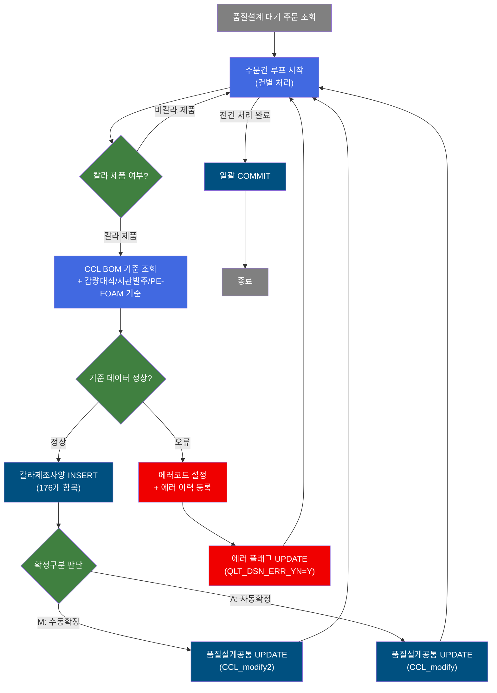
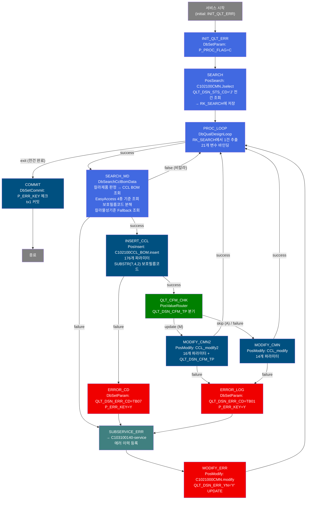
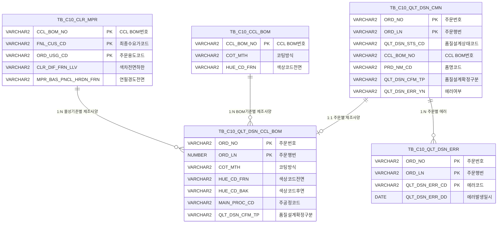

<h1 style="font-size: 40px; text-align: center; font-weight:
   bold; margin: 30px 0;">
  C102100160 레거시 시스템 분석 종합 보고서
</h1>


# 1. 시스템 개요
- **서비스 ID**: C102100160
- **업무명**: 품질설계 칼라제조사양 자동편성 (NUI 배치)
- **분석 일시**: 2026-03-16 20:07 KST
- **분석 시간**: 약 3분 (재생성)
- **전체 Activity 수**: 12개 (Custom 2, Built-in 7, Common 3)
- **분석자**: Claude Opus 4.6
- **분석 도구**: /analyze-service C102100160
- **문서 버전**: 1.1 (재생성)

# 📊 비즈니스 프로세스 분석

## 시스템 목적

C102100160 서비스는 품질설계 대기 상태(QLT_DSN_STS_CD='J')인 주문을 일괄 조회하여 칼라(CCL) 제조사양을 자동 편성하는 NUI(배치) 서비스이다. 칼라 제품(PRD_NM_CD 1~9)에 해당하는 주문만 대상으로 하며, CCL BOM 기준 데이터, 칼라물성시험기준, 감량매직체크기준, 지관발주메시지기준, PE-FOAM 적용메시지기준을 순차적으로 조회·편성한 후 `TB_C10_QLT_DSN_CCL_BOM` 테이블에 176개 항목의 제조사양을 INSERT한다.

서비스는 대기 주문 전체를 루프로 순회하며 건별로 처리한다. 품질설계 확정구분(QLT_DSN_CFM_TP)이 'M'(수동)인 경우 `CCL_modify2` 쿼리로, 그 외('A'=자동 등)인 경우 `CCL_modify` 쿼리로 품질설계공통(TB_C10_QLT_DSN_CMN)을 UPDATE한다. 처리 중 오류 발생 시 에러코드를 설정하고 서브서비스(C103100140)를 호출하여 에러 이력을 등록한 뒤 에러 플래그(QLT_DSN_ERR_YN='Y')를 UPDATE한다.

전체 루프 완료 후 트랜잭션 매니저(tx1)가 일괄 COMMIT을 수행하되, 에러 발생 건(P_ERR_KEY='Y')은 커밋에서 제외되는 체크 로직이 포함되어 있다.

## 핵심 워크플로우 다이어그램



### 상세 워크플로우 다이어그램



## 주요 유즈케이스

### UC-01: 품질설계 대기 주문 일괄 칼라제조사양 편성

- **Actor**: 시스템 (NUI 배치 프로세스)
- **목적**: 품질설계 대기(QLT_DSN_STS_CD='J') 상태의 칼라 제품 주문에 대해 CCL BOM 기준 데이터를 자동 조회·편성하여 칼라제조사양을 등록

- **전제조건**:
  - TB_C10_QLT_DSN_CMN에 QLT_DSN_STS_CD='J'인 주문이 존재
  - 해당 주문의 CCL_BOM_NO에 매칭되는 CCL BOM 기준(TB_C10_CCL_BOM) 데이터가 존재
  - EasyAccess 마스터(C10B2280, C10B2290, C10B2300) 기준이 설정되어 있음

- **주요 흐름**:
  1. C102100CMN.Jselect 쿼리로 대기 주문 전건 조회 → RK_SEARCH에 저장
  2. DbQualDesignLoop가 RK_SEARCH에서 1건씩 추출, 21개 변수(ORD_NO, ORD_LN, PRD_NM_CD 등)를 PosContext에 바인딩
  3. DbSearchCclBomData가 칼라 제품 여부 판정 (PRD_NM_CD 1~9)
  4. CCL BOM 기준 조회 (dao.find SELECT_CCL_BOM) → 전체 컬럼 데이터를 PosContext에 등록
  5. 감량매직체크기준(C10B2280) 조회 → DEF_RED_TXT 설정
  6. 지관발주메시지기준(C10B2290) 조회 → PPR_RNG_PORD_TXT 설정 (ORD_SLV_KND_TP='N'이면 공백)
  7. PE-FOAM 적용메시지기준(C10B2300) 조회 → PE_FOAM_TXT 설정
  8. 보호필름코드(ORD_PTT_FLM_DTL_CD) 분해 → PTT_FLM_LUS_RT_CD, PTT_FLM_THK_CD 등 5개 항목
  9. 칼라물성시험기준(TB_C10_CLR_MPR) 조회 → 색차, 연필경도, MEK, Bending 등 설정 (Fallback 로직 포함)
  10. C102100CCL_BOM.insert로 176개 항목 INSERT
  11. QLT_DSN_CFM_TP 분기 → 'M'이면 CCL_modify2, 아니면 CCL_modify로 공통 테이블 UPDATE

- **대체 흐름**:
  - 비칼라 제품: DbSearchCclBomData가 'false' 반환 → 루프 다음 건으로 진행
  - CCL BOM 미존재/복수: 에러코드 KP03/KP13 설정 → 서브서비스 에러 등록
  - 칼라물성기준 미존재: Fallback 조회 (고객사→'******', 용도→'******' 순차 대체) → 전부 실패 시 에러코드 KP04
  - INSERT 실패: 에러코드 TB07 → 에러 이력 등록 + QLT_DSN_ERR_YN='Y' UPDATE

- **후행조건**:
  - 정상 건: TB_C10_QLT_DSN_CCL_BOM에 제조사양 등록, TB_C10_QLT_DSN_CMN에 칼라 관련 항목 UPDATE
  - 에러 건: TB_C10_QLT_DSN_ERR에 에러 이력 등록, QLT_DSN_ERR_YN='Y' 설정

### UC-02: 칼라물성기준 Fallback 조회

- **Actor**: 시스템 (DbSearchCclBomData 내부 로직)
- **목적**: 정확한 조건으로 칼라물성기준을 찾지 못할 때 조건을 완화하여 최대한 기준 데이터를 매칭

- **전제조건**:
  - CCL BOM 기준 조회가 성공(1건)한 상태
  - TB_C10_CLR_MPR 테이블에 기준 데이터 존재

- **주요 흐름**:
  1. 1차 조회: CCL_BOM_NO + 최종수요가코드(FNL_CUS_CD) + 주문용도코드(ORD_USG_CD)
  2. 조회 실패 시 → 주문용도코드를 '******'으로 대체하여 2차 조회
  3. 2차 실패 시 → 최종수요가코드를 '******'으로 대체, 원래 주문용도코드 복원하여 3차 조회
  4. 3차 실패 시 → 최종수요가코드 '******' + 주문용도코드 '******'으로 4차 조회
  5. 매칭 성공 시 → 색차, 연필경도, MEK, Bending, 품질메시지 등 15개 항목 설정

- **대체 흐름**:
  - 4차까지 전부 실패: 에러코드 KP04 설정 → FAILURE 반환 → 에러 처리 흐름 진입
  - 조회 결과 복수(>1): 에러코드 KP14 설정 → FAILURE 반환

- **후행조건**:
  - 물성기준 항목(CLR_DIF_FRN_LLV, MPR_BAS_PNCL_HRDN_FRN 등)이 PosContext에 설정됨

### UC-03: 품질설계 확정구분별 공통정보 UPDATE

- **Actor**: 시스템
- **목적**: 칼라제조사양 등록 후 품질설계공통 테이블에 요약 정보를 반영하되, 확정구분(자동/수동)에 따라 UPDATE 항목을 차별화

- **전제조건**:
  - INSERT_CCL 성공
  - QLT_DSN_CFM_TP 값이 PosContext에 존재

- **주요 흐름**:
  1. QLT_CFM_CHK(PosValueRouter)가 QLT_DSN_CFM_TP 값 분기
  2. 'M'(수동확정) → MODIFY_CMN2: 16개 항목 UPDATE (QLT_DSN_CFM_TP, CCL_BOM_ATT_YN 포함)
  3. 'A'(자동확정) 또는 기타 → MODIFY_CMN: 14개 항목 UPDATE (확정구분 미포함)

- **대체 흐름**:
  - UPDATE 실패: ERROR_LOG → 에러코드 TB01 설정 → 에러 처리 흐름 진입

- **후행조건**:
  - TB_C10_QLT_DSN_CMN의 색상, 도막두께, 수지, 광택도, 코팅방식, 감량/지관/PE-FOAM 메시지 등 갱신

---
## 비즈니스 로직 상세

### 1. 칼라 제품 판정 로직 (DbSearchCclBomData)

- **목적**: 주문의 품명코드(PRD_NM_CD)를 기반으로 칼라 제품 여부를 판정하여, 비칼라 제품은 제조사양 편성 대상에서 제외
- **처리 케이스**:

  **[케이스 1: 칼라 제품]**
  ```
    조건: PRD_NM_CD IN ('1','2','3','4','5','6','7','8','9')
    처리:
      1. CCL BOM 기준 조회 진행
      2. 후속 마스터 데이터 조회 및 편성
  ```

  **[케이스 2: 비칼라 제품]**
  ```
    조건: PRD_NM_CD NOT IN ('1'~'9')
    처리:
      1. 'false' transition 반환 → PROC_LOOP로 복귀
      2. 다음 주문 처리
  ```

### 2. CCL BOM 기준 데이터 편성 및 자동확정 판정

- **목적**: CCL BOM 번호로 기준 테이블을 조회하여 제조사양 전체 항목을 PosContext에 등록하고, 품질설계 확정구분을 결정
- **처리 케이스**:

  **[케이스 1: CCL BOM 정확히 1건 매칭]**
  ```
    조건: rowset.count() == 1
    처리:
      1. BOM 기준의 전체 컬럼을 PosContext에 순차 등록
      2. QLT_DSN_CFM_TP 처리:
         - BOM 기준값이 'M'(수동) → EasyAccess C10B2260으로 자동확정 가능 여부 재판정
           - C10B2260 결과가 null → 수동확정(M) 유지
           - C10B2260 결과 존재 → 자동확정(A) 전환
         - BOM 기준값이 null → 수동확정(M) 설정
         - BOM 기준값이 'A' 등 기타 → 그대로 유지
  ```

  **[케이스 2: CCL BOM 복수건]**
  ```
    조건: rowset.count() > 1
    처리:
      1. 에러코드 KP13 설정
      2. FAILURE 반환
  ```

  **[케이스 3: CCL BOM 미존재]**
  ```
    조건: rowset.count() == 0
    처리:
      1. 에러코드 KP03 설정
      2. FAILURE 반환
  ```

### 3. 보호필름 상세코드 분해 로직

- **목적**: 품질설계공통의 보호필름상세코드(ORD_PTT_FLM_DTL_CD)를 자릿수별로 분해하여 개별 코드 항목에 저장
- **계산 공식**:
  ```
  ORD_PTT_FLM_DTL_CD = "ABCDE" (5자리 복합코드)

  PTT_FLM_LUS_RT_CD  = substring(0,1) = 'A'  (광택코드)
  PTT_FLM_THK_CD     = substring(1,2) = 'B'  (두께코드)
  PTT_FLM_MQL_CD     = substring(2,3) = 'C'  (재질코드)
  PTT_FLM_SUS_ADH_CD = substring(3,4) = 'D'  (SUS점착력코드)
  PTT_FLM_PRD_ADH_CD = substring(4,5) = 'E'  (제품점착력코드)

  ※ 코드 길이가 부족하면 해당 항목은 공백(SPACE) 처리
  ```

### 4. EasyAccess 마스터 4종 순차 조회

- **목적**: 감량매직체크, 지관발주메시지, PE-FOAM 적용메시지 기준을 EasyAccess 마스터에서 조회하여 해당 텍스트 메시지를 편성

  **[C10B2280 - 감량매직체크기준]**
  ```
    조건키: 국가코드, 고객사코드, 수요가코드, 최종수요가코드, 용도코드, CCL BOM번호
    결과: DEF_RED_TXT (감량매직체크결과)
    오류: 복수건 → 에러코드 KT34
  ```

  **[C10B2290 - 지관발주메시지기준]**
  ```
    조건키: 고객사코드, 수요가코드, 최종수요가코드, 품명, 제품형태, 주문환산두께,
           보호필름상세코드, EMBOSS무늬, Edge지정구분, 포장단중하한/상한, 주문용도, 색상코드(TOP)
    결과: PPR_RNG_PORD_TXT (지관발주메시지)
    특수규칙: ORD_SLV_KND_TP='N'이면 메시지 강제 공백 처리
    오류: 복수건 → 에러코드 KT35
  ```

  **[C10B2300 - PE-FOAM 적용메시지기준]**
  ```
    조건키: 고객사코드, 수요가코드, 최종수요가코드, 품명, 제품형태, 주문환산두께,
           국가코드, 보호필름상세코드, EMBOSS무늬, Edge지정구분, 포장단중하한/상한,
           주문용도대분류(1자리), 주문용도, CCL BOM번호
    결과: PE_FOAM_TXT (PE-FOAM적용메시지)
    오류: 복수건 → 에러코드 KT36
  ```

- **예외 처리**:
  - EasyAccess MasterDataException 발생 시 → result=null 처리, 해당 기준만 스킵 (FAILURE 아님)
  - 조회 결과 0건 → 해당 메시지 항목 미설정 (에러 아님)
  - 조회 결과 복수건 → FAILURE 반환 → 에러 처리 흐름

### 5. 루프 제어 로직 (DbQualDesignLoop)

- **목적**: 이전 Activity(SEARCH)의 조회 ResultSet을 1건씩 순회하며 후속 Activity 체인에 필요한 변수를 PosContext에 바인딩
- **처리 케이스**:

  **[케이스 1: 처리 대상 잔여]**
  ```
    조건: procCount > 0
    처리:
      1. procCount 1 차감
      2. 현재 행(this_row) 계산: total_row - procCount
      3. RowSet에서 this_row번째 행 탐색 (커서 리셋 후 순차 이동)
      4. 21개 param(저장변수명|대상항목명 형식)을 PosContext에 바인딩
      5. 'success' 반환 → SEARCH_MD로 전이
  ```

  **[케이스 2: 전건 처리 완료]**
  ```
    조건: procCount == 0
    처리:
      1. 카운터 변수 제거 (ctx.remove)
      2. 'exit' 반환 → COMMIT으로 전이
  ```

- **계산 공식**:
  ```
  procCount = (첫 실행 시) total_row, (이후) 이전 procCount 값
  procCount = procCount - 1
  this_row = total_row - procCount

  예시: total_row=6
  1차: procCount=5, this_row=1
  2차: procCount=4, this_row=2
  ...
  6차: procCount=0 → exit
  ```

---

# ⚙️ Java 컴포넌트 분석

## Custom Activity 상세 분석

### 2개 Custom Activity 발견

### 1. DbSearchCclBomData (SEARCH_MD)
- **클래스명**: com.unionsteel.mes.c10.activity.nui.DbSearchCclBomData
- **액티비티명**: SEARCH_MD
- **파일 경로**: src/com/unionsteel/mes/c10/activity/nui/DbSearchCclBomData.java
- **주요 기능**: 칼라제조사양 편성 - CCL BOM 기준 조회, EasyAccess 마스터 4종 조회, 보호필름코드 분해, 칼라물성기준 Fallback 조회
- **라인 수**: 530 | **메소드 수**: 1 (runActivity)

#### 메소드 구조
- **주요 메소드**: runActivity(PosContext ctx)
  - **반환 타입**: String (SUCCESS/FALSE/FAILURE)
  - **파라미터**: PosContext ctx

#### SQL 매핑 (총 2개)
| SQL 이름 | 쿼리 ID | 타입 | 테이블 |
|---------|---------|-----|-------|
| SELECT_CCL_BOM | C102100CCL_BOM.select | SELECT | TB_C10_CCL_BOM |
| SELECT_CLR_MPR | (TB_C10_CLR_MPR 직접조회) | SELECT | TB_C10_CLR_MPR |

#### 핵심 비즈니스 로직
- **칼라 제품 판정**: PRD_NM_CD 1~9 외 제품은 'false' 반환으로 스킵
- **CCL BOM 기준 조회**: CCL_BOM_NO 기반 단건 조회, 전체 컬럼 PosContext 등록
- **자동/수동 확정 판정**: QLT_DSN_CFM_TP='M'일 때 EasyAccess C10B2260으로 재판정
- **감량매직체크(C10B2280)**: 국가/고객사/수요가/용도/BOM번호 6개 키로 조회
- **지관발주메시지(C10B2290)**: 13개 조건키, ORD_SLV_KND_TP='N' 시 공백 강제
- **PE-FOAM 적용메시지(C10B2300)**: 15개 조건키, 용도 대분류(1자리) 포함
- **보호필름코드 분해**: ORD_PTT_FLM_DTL_CD 5자리를 자릿수별 5개 항목으로 분해
- **칼라물성기준 Fallback**: CCL_BOM_NO + FNL_CUS_CD + ORD_USG_CD → '******' 순차 대체 조회

#### Java 상수 및 의존성
- **주요 상수**: C10B2260, C10B2280, C10B2290, C10B2300 (EasyAccess 마스터 ID), PRD_NM_CD_1~9 (칼라 제품 코드), ERRCD_KP03/KP04/KP13/KP14/KT34/KT35/KT36 (에러코드)
- **핵심 의존성**: EasyAccess (마스터 데이터 조회), PosDecisionChecker/PosRuleVO (기준 매칭), DbCommonUtil (NULL 체크, 별표 생성)

---

### 2. DbQualDesignLoop (PROC_LOOP)
- **클래스명**: com.unionsteel.mes.c10.activity.nui.DbQualDesignLoop
- **액티비티명**: PROC_LOOP
- **파일 경로**: src/com/unionsteel/mes/c10/activity/nui/DbQualDesignLoop.java
- **주요 기능**: ResultSet 루프 제어 - 이전 Activity 조회 결과를 1건씩 순회하며 변수 바인딩 및 카운터 관리

#### 메소드 구조
- **주요 메소드**: runActivity(PosContext ctx)
  - **반환 타입**: String (SUCCESS/EXIT/FAILURE)
  - **파라미터**: PosContext ctx

#### 핵심 비즈니스 로직
- **카운터 기반 루프 제어**: countName 변수로 잔여 처리건수 관리, 0이면 'exit' 반환
- **파라미터 바인딩**: param-count/param# 설정에 따라 RowSet의 현재 행에서 값 추출 → PosContext에 저장변수명으로 등록
- **초기화 처리**: P_ERR_KEY='N', BATCH_JOB='true', QLT_DSN_ERR_YN=SPACE 초기화

#### Java 상수 및 의존성
- **주요 상수**: C10STR_EXIT, C10STR_COUNTNAME, C10PN_BIND_RESULT, C10PN_PARAM
- **핵심 의존성**: ActivityUtil (null 체크), DbCommonUtil (valueOf 변환)

---

# 💾 데이터 요구사항

## 핵심 테이블

### 1. TB_C10_QLT_DSN_CMN - (품질설계 공통)
| 컬럼명 | 타입 | PK | 설명 |
|--------|------|----|-----|
| ORD_NO | VARCHAR2 | ✅ | 주문번호 |
| ORD_LN | VARCHAR2 | ✅ | 주문행번 |
| QLT_DSN_STS_CD | VARCHAR2 | | 품질설계상태코드 (J=대기, A=완료, I=의뢰, *=취소) |
| PRD_NM_CD | VARCHAR2 | | 품명코드 (1~9=칼라) |
| CCL_BOM_NO | VARCHAR2 | | CCL BOM번호 |
| HUE_CD_FRN | VARCHAR2 | | 색상코드전면 |
| HUE_CD_BAK | VARCHAR2 | | 색상코드후면 |
| PNT_FLM_THK_FRN_TOT | VARCHAR2 | | 도막두께전면Total |
| PNT_FLM_THK_BAK_TOT | VARCHAR2 | | 도막두께후면Total |
| RSN_TP_FRN | VARCHAR2 | | 수지구분전면 |
| RSN_TP_BAK | VARCHAR2 | | 수지구분후면 |
| LUS_RT_CD_FRN | VARCHAR2 | | 광택도코드전면 |
| LUS_RT_CD_BAK | VARCHAR2 | | 광택도코드후면 |
| COT_MTH | VARCHAR2 | | 코팅방식 |
| QLT_DSN_CFM_TP | VARCHAR2 | | 품질설계확정구분 (M=수동, A=자동) |
| DEF_RED_TXT | VARCHAR2 | | 감량매직체크결과 |
| PPR_RNG_PORD_TXT | VARCHAR2 | | 지관발주메시지 |
| PE_FOAM_TXT | VARCHAR2 | | PE-FOAM적용메시지 |
| ATT_ORD_YN | VARCHAR2 | | 관심주문여부 |
| QLT_DSN_ERR_YN | VARCHAR2 | | 품질설계에러여부 |
| CUS_CD | VARCHAR2 | | 고객사코드 |
| FNL_CUS_CD | VARCHAR2 | | 최종수요가코드 |
| ORD_USG_CD | VARCHAR2 | | 주문용도코드 |
| ORD_PTT_FLM_DTL_CD | VARCHAR2 | | 보호필름상세코드 |

### 2. TB_C10_QLT_DSN_CCL_BOM - (품질설계결과 칼라제조사양)
| 컬럼명 | 타입 | PK | 설명 |
|--------|------|----|-----|
| ORD_NO | VARCHAR2 | ✅ | 주문번호 |
| ORD_LN | NUMBER | ✅ | 주문행번 |
| COT_MTH | VARCHAR2 | | 코팅방식 |
| HUE_CD_FRN | VARCHAR2 | | 색상코드전면 |
| HUE_CD_BAK | VARCHAR2 | | 색상코드후면 |
| PNT_FLM_THK_FRN_TOT | VARCHAR2 | | 도막두께전면Total |
| PNT_FLM_THK_BAK_TOT | VARCHAR2 | | 도막두께후면Total |
| LUS_RT_CD_FRN | VARCHAR2 | | 광택도코드전면 |
| RSN_TP_FRN | VARCHAR2 | | 수지구분전면 |
| PTT_FLM_DTL_CD | VARCHAR2 | | 보호필름상세코드 |
| PTT_FLM_DTL_CD_N | VARCHAR2 | | 보호필름상세코드(신규) - SUBSTR(?,4,2)로 저장 |
| MAIN_PROC_CD | VARCHAR2 | | 주공정코드 |
| QLT_DSN_CFM_TP | VARCHAR2 | | 품질설계확정구분 |
| LUXTEEL_BRD_CD | VARCHAR2 | | LUXTEEL 브랜드코드 |

### 3. TB_C10_CCL_BOM - (CCL BOM 기준)
| 컬럼명 | 타입 | PK | 설명 |
|--------|------|----|-----|
| CCL_BOM_NO | VARCHAR2 | ✅ | CCL BOM번호 |
| (전체 컬럼) | - | | 칼라제조사양 기준 전체 항목 (176+개) |

### 4. TB_C10_CLR_MPR - (칼라물성시험기준)
| 컬럼명 | 타입 | PK | 설명 |
|--------|------|----|-----|
| CCL_BOM_NO | VARCHAR2 | ✅ | CCL BOM번호 |
| FNL_CUS_CD | VARCHAR2 | ✅ | 최종수요가코드 |
| ORD_USG_CD | VARCHAR2 | ✅ | 주문용도코드 |
| CLR_DIF_FRN_LLV | VARCHAR2 | | 색차전면하한값 |
| CLR_DIF_FRN_ULV | VARCHAR2 | | 색차전면상한값 |
| MPR_BAS_PNCL_HRDN_FRN | VARCHAR2 | | 물성기준연필경도전면 |
| MPR_BAS_MEK_FRN | VARCHAR2 | | 물성기준MEK전면 |
| CLR_BND_TST_FRN_STD_CD | VARCHAR2 | | 칼라Bending전면기준코드 |
| CCL_QLT_MSG_TXT | VARCHAR2 | | CCL공정품질메시지 |

### 5. TB_C10_QLT_DSN_ERR - (품질설계 에러)
| 컬럼명 | 타입 | PK | 설명 |
|--------|------|----|-----|
| ORD_NO | VARCHAR2 | ✅ | 주문번호 |
| ORD_LN | VARCHAR2 | ✅ | 주문행번 |
| QLT_DSN_ERR_CD | VARCHAR2 | ✅ | 품질설계에러코드 |
| QLT_DSN_ERR_DD | DATE | | 에러발생일시 |

## 데이터 플로우

### 1. 대기 주문 조회
```
[배치 실행 시 대기 주문 전건 조회]
서비스 시작
→ C102100CMN.Jselect
  FROM TB_C10_QLT_DSN_CMN
  WHERE QLT_DSN_STS_CD = 'J'
→ RK_SEARCH에 ResultSet 저장
→ PROC_LOOP에서 1건씩 추출
```

### 2. CCL BOM 기준 조회 및 편성
```
[칼라 제품 판정 후 CCL BOM 기준 조회]
PROC_LOOP에서 1건 추출 (ORD_NO, ORD_LN, CCL_BOM_NO 등)
→ DbSearchCclBomData.runActivity()
  PRD_NM_CD 1~9 여부 판정
→ C102100CCL_BOM.select (dao.find)
  FROM TB_C10_CCL_BOM
  WHERE CCL_BOM_NO = ?
→ 전체 컬럼 PosContext 등록
→ EasyAccess C10B2280 (감량매직체크기준) 조회
→ EasyAccess C10B2290 (지관발주메시지기준) 조회
→ EasyAccess C10B2300 (PE-FOAM 적용메시지기준) 조회
→ 보호필름코드 분해 (5자리 → 5항목)
→ TB_C10_CLR_MPR 칼라물성기준 조회 (Fallback 포함)
```

### 3. 칼라제조사양 등록 및 공통 UPDATE
```
[제조사양 INSERT + 공통 UPDATE]
SEARCH_MD 성공
→ C102100CCL_BOM.insert
  INSERT INTO TB_C10_QLT_DSN_CCL_BOM (176개 컬럼)
  VALUES (176개 파라미터, SUBSTR(?,4,2) 포함)

→ QLT_CFM_CHK 분기:
  [M: 수동확정]
  → C102100CMN.CCL_modify2
    UPDATE TB_C10_QLT_DSN_CMN SET 16개 항목 (QLT_DSN_CFM_TP 포함)
    WHERE ORD_NO = ? AND ORD_LN = ?

  [A: 자동확정 / 기타]
  → C102100CMN.CCL_modify
    UPDATE TB_C10_QLT_DSN_CMN SET 14개 항목
    WHERE ORD_NO = ? AND ORD_LN = ?
```

### 4. 에러 처리
```
[에러 발생 시]
에러코드 설정 (ERROR_LOG 또는 ERROR_CD)
→ SUBSERVICE_ERR: C103100140-service 호출
  중복 체크 후 TB_C10_QLT_DSN_ERR INSERT
→ MODIFY_ERR: C1021000CMN.modify
  UPDATE TB_C10_QLT_DSN_CMN SET QLT_DSN_ERR_YN = 'Y'
  WHERE ORD_NO = ? AND ORD_LN = ?
```

## SQL 일람표
| SQL 이름 | 쿼리 ID | 타입 | 출처 | 테이블 |
|---------|---------|-----|-------|-------|
| 품질설계 대기 주문 조회 | C102100CMN.Jselect | SELECT | Service | TB_C10_QLT_DSN_CMN |
| 칼라제조사양 등록 | C102100CCL_BOM.insert | INSERT | Service | TB_C10_QLT_DSN_CCL_BOM |
| 품질설계공통 칼라항목 UPDATE (자동) | C102100CMN.CCL_modify | UPDATE | Service | TB_C10_QLT_DSN_CMN |
| 품질설계공통 칼라항목 UPDATE (수동) | C102100CMN.CCL_modify2 | UPDATE | Service | TB_C10_QLT_DSN_CMN |
| 품질설계 에러플래그 UPDATE | C1021000CMN.modify | UPDATE | Service | TB_C10_QLT_DSN_CMN |
| CCL BOM 기준 조회 | C102100CCL_BOM.select | SELECT | Java (DbSearchCclBomData) | TB_C10_CCL_BOM |
| 칼라물성시험기준 조회 | (SELECT_CLR_MPR) | SELECT | Java (DbSearchCclBomData) | TB_C10_CLR_MPR |

## ER 다이어그램 (핵심 관계)



관계 설명:
- **TB_C10_QLT_DSN_CMN**이 중심 테이블로 품질설계 전체 프로세스의 허브 역할
- TB_C10_QLT_DSN_CMN → TB_C10_QLT_DSN_CCL_BOM: ORD_NO + ORD_LN 기반 1:1 관계 (주문당 1건의 칼라제조사양)
- TB_C10_QLT_DSN_CMN → TB_C10_QLT_DSN_ERR: ORD_NO + ORD_LN 기반 1:N 관계 (주문당 다수 에러 가능)
- TB_C10_CCL_BOM → TB_C10_QLT_DSN_CCL_BOM: CCL_BOM_NO 기반 1:N 관계 (하나의 BOM 기준으로 여러 주문의 제조사양 생성)
- TB_C10_CLR_MPR → TB_C10_QLT_DSN_CCL_BOM: 물성기준 결과가 제조사양에 반영 (간접 참조)

---

# 🔗 서브서비스

## 서브서비스 요약

| 서비스 ID | 설명 | 호출 액티비티 | 트랜잭션 | 상세 분석 |
|-----------|------|-------------|---------|----------|
| C103100140 | 품질설계결과 에러 등록 (중복 방지) | SUBSERVICE_ERR | 기존 트랜잭션 공유 (new-transaction=false) | [상세 분석 링크](./C103100140_legacy_analysis.md) |

### C103100140 - 품질설계결과 에러 등록
품질설계 과정에서 발생한 에러 정보를 TB_C10_QLT_DSN_ERR 테이블에 등록하는 서비스. DbSearchCmnErrorCheck Activity가 주문번호+주문행번+에러코드 3개 복합키로 중복 체크 후, 미등록 건만 INSERT 수행. Activity 2개, SQL Key 2개 구성.

# 📌 특이사항 및 주의사항

## 1. 176개 파라미터 INSERT의 복잡성
- **대량 파라미터**: C102100CCL_BOM.insert 쿼리는 176개의 위치기반 파라미터(?)를 사용하며, 이는 서비스 XML에서 param0~param175로 매핑된다. 파라미터 순서가 컬럼 순서와 정확히 일치해야 하며, 하나라도 순서가 틀리면 데이터 오염이 발생한다.
- **SUBSTR 처리**: INSERT VALUES 절 중 한 부분에서 `SUBSTR(?,4,2)` 패턴이 사용되어 보호필름 관련 코드의 4번째 자리부터 2자리만 추출하여 저장한다. 이는 `PTT_FLM_SUS_ADH_CD_N` 컬럼에 해당한다.

## 2. EasyAccess 마스터 의존성 및 장애 대응
- **4종 마스터 순차 의존**: C10B2260(자동확정 판정), C10B2280(감량매직), C10B2290(지관발주), C10B2300(PE-FOAM) 등 4개 EasyAccess 마스터에 의존한다. 마스터 데이터 미등록 또는 변경 시 품질설계 결과에 직접 영향을 미친다.
- **장애 허용 설계**: MasterDataException 발생 시 result=null 처리하여 해당 기준만 스킵하고 나머지 처리는 계속 진행한다. 단, 복수건(>1) 매칭은 FAILURE로 처리한다.

## 3. 칼라물성기준 Fallback 패턴의 암묵적 규칙
- **4단계 Fallback**: 최종수요가코드와 주문용도코드를 '******'(별표 6자리)로 순차 대체하는 Fallback 조회 패턴이 while(true) 루프로 구현되어 있다. 이 패턴은 DB에 '******' 값이 범용 기본값으로 등록되어 있음을 전제로 한다.
- **Fallback 순서**: (FNL_CUS_CD, ORD_USG_CD) → (FNL_CUS_CD, '******') → ('******', ORD_USG_CD) → ('******', '******') 순서로 조회하며, 마지막 단계 실패 시에만 에러 처리한다.

## 4. 지관발주메시지 ORD_SLV_KND_TP='N' 강제 공백 처리
- ORD_SLV_KND_TP(주문내경링종류구분)가 'N'이면 EasyAccess 기준 조회 결과와 무관하게 PPR_RNG_PORD_TXT를 강제 공백 처리한다. 이는 2018.04.16에 추가된 특수 규칙으로, 내경링이 없는 주문은 지관 발주가 불필요하기 때문이다.

## 5. 에러 처리 구조의 비대칭성
- **UPDATE 실패 에러코드(TB01)**: CCL_modify/CCL_modify2 UPDATE 실패 시 에러코드 TB01이 설정되나, INSERT 실패 시에는 TB07이 설정된다. 에러코드가 서로 다른 경로로 설정되므로 에러 분석 시 구분이 필요하다.
- **서브서비스 트랜잭션 공유**: C103100140 서비스가 new-transaction=false로 설정되어 있어, 에러 등록이 부모 트랜잭션에 포함된다. 이는 부모의 COMMIT/ROLLBACK에 에러 이력도 함께 영향받는다는 의미이다.

## 6. 트랜잭션 제어 방식
- DbSetCommit의 checkId='P_ERR_KEY' 설정으로, 에러 발생 건(P_ERR_KEY='Y')과 정상 건의 커밋 동작을 분리한다. exitFlag='N'이므로 에러 건이 있어도 루프는 계속 진행하며, 최종 커밋 시점에 에러 건 처리가 결정된다.

# 📚 참고 문서

- **Query SQL**:
  - `src/query/C102100CMN-query.glue_sql`
  - `src/query/C102100CCL_BOM-query.glue_sql`
- **Custom Java 클래스**:
  - `src/com/unionsteel/mes/c10/activity/nui/DbSearchCclBomData.java`
  - `src/com/unionsteel/mes/c10/activity/nui/DbQualDesignLoop.java`
- **서비스 XML**: `src/service/C102100160-service.xml`
- **서브서비스**: `docs/analysis/service/nui/C103100140_legacy_analysis.md`
