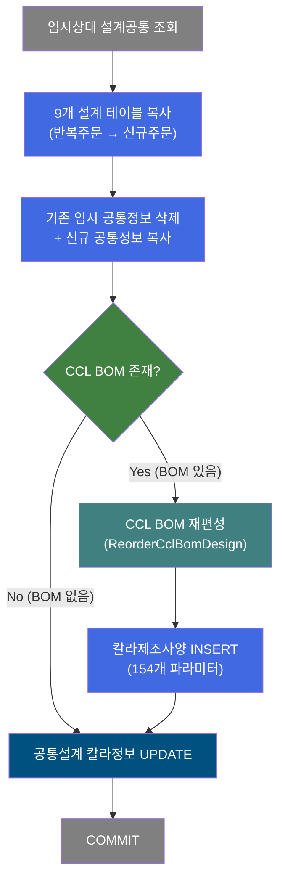

<h1 style="font-size: 40px; text-align: center; font-weight:
   bold; margin: 30px 0;">
  C102100170 반복주문 품질설계 데이터 복사 + CCL BOM 재편성 레거시 시스템 분석 종합 보고서
</h1>


# 1. 시스템 개요
- **서비스 ID**: C102100170
- **업무명**: 반복주문 품질설계 데이터 복사 및 칼라제조사양(CCL BOM) 재편성
- **분석 일시**: 2026-03-16 20:02 KST
- **전체 Activity 수**: 16개 (Custom 1, Built-in 13, Common 2)
- **분석자**: Claude Opus 4.6
- **분석 도구**: /analyze-service C102100170
- **문서 버전**: 1.0

# 📊 비즈니스 프로세스 분석

## 시스템 목적

C102100170 서비스는 **반복주문(Repeat Order)** 시 이전 주문의 품질설계 데이터를 신규 주문으로 일괄 복사하고, 칼라제품인 경우 CCL BOM(칼라제조사양)을 재편성하는 NUI 배치 서비스이다.

반복주문은 동일 고객이 동일 사양으로 재발주하는 경우를 의미하며, 이전 주문(ORD_REP_NO/ORD_REP_LN)에서 확정된 품질설계 결과를 그대로 가져와 신규 주문(ORD_NO/ORD_LN)에 적용한다. 복사 대상은 9개 설계 테이블(공통, 원자재, 성분, 인수도, 제조사양, 재질, 공정, 메시지, 메시지1)이며, 칼라제품의 경우 추가로 CCL BOM 기준 조회 + EasyAccess 마스터 4종 + 칼라물성시험기준 Fallback 조회를 수행하여 칼라제조사양 INSERT까지 완료한다.

최종적으로 공통설계 테이블의 칼라 관련 컬럼(색상코드, 도막두께, 수지유형, 광택도, 감량/지관/PE-FOAM 메시지)을 UPDATE하여 전체 프로세스를 마무리한다.


## 핵심 워크플로우 다이어그램



### 상세 워크플로우 다이어그램

```mermaid
flowchart TD
    subgraph Step1 ["1. 임시상태 설계공통 조회"]
        S1["SEARCH_CMN_T<br/>C102100CMN.Tselect<br/>QLT_DSN_STS_CD='T'"]:::proc
    end

    subgraph Step2 ["2. 반복주문 설계 데이터 복사 (INSERT...SELECT)"]
        S2A["INSERT_RMT<br/>원자재설계 복사<br/>TB_C10_QLT_DSN_RMT"]:::proc
        S2B["INSERT_CHM<br/>성분설계 복사<br/>TB_C10_QLT_DSN_CHM"]:::proc
        S2C["INSERT_DEV<br/>인수도설계 복사<br/>TB_C10_QLT_DSN_DLV"]:::proc
        S2D["INSERT_MNF<br/>제조사양 복사 (125컬럼)<br/>TB_C10_QLT_DSN_MNF"]:::proc
        S2E["INSERT_MQL<br/>재질설계 복사<br/>TB_C10_QLT_DSN_MQL"]:::proc
        S2F["INSERT_PROC<br/>통과공정 복사<br/>TB_C10_QLT_DSN_PROC"]:::proc
        S2G["INSERT_MSG<br/>제조메시지 복사<br/>TB_C10_QLT_DSN_MSG"]:::proc
        S2H["INSERT_MSG1<br/>메시지1 복사<br/>TB_C10_QLT_DSN_MSG1"]:::proc
    end

    subgraph Step3 ["3. 공통정보 교체"]
        S3A["DELETE_CMN<br/>임시상태(T) 삭제"]:::error
        S3B["INSERT_CMN<br/>반복주문 → 신규 복사 (165컬럼)<br/>QLT_DSN_STS_CD='A'"]:::proc
    end

    subgraph Step4 ["4. CCL BOM 분기"]
        S4{"CCL_BOM_CHK<br/>CCL_BOM_NO null?"}:::decision
    end

    subgraph Step5 ["5. CCL BOM 재편성"]
        S5A["SEARCH_MD<br/>ReorderCclBomDesign"]:::proc_call
        S5A1["CCL BOM 기준 조회<br/>SELECT_CCL_BOM"]:::proc
        S5A2["감량매직체크(C10B2280)<br/>지관발주메시지(C10B2290)<br/>PE-FOAM메시지(C10B2300)"]:::proc
        S5A3["칼라물성기준 4단계 Fallback<br/>SELECT_CLR_MPR"]:::proc
        S5B["INSERT_CCL_BOM<br/>칼라제조사양 등록 (154 params)<br/>TB_C10_QLT_DSN_CCL_BOM"]:::proc
    end

    subgraph Step6 ["6. 공통설계 칼라정보 갱신"]
        S6["MODIFY_CMN<br/>색상/도막/수지/감량/지관/FOAM<br/>UPDATE TB_C10_QLT_DSN_CMN"]:::save
    end

    S7["COMMIT"]:::start

    S1 --> S2A --> S2B --> S2C --> S2D --> S2E --> S2F --> S2G --> S2H
    S2H --> S3A --> S3B --> S4
    S4 -->|"N (BOM 없음)"| S6
    S4 -->|"Y (BOM 있음)"| S5A
    S5A --> S5A1 --> S5A2 --> S5A3 --> S5B
    S5B --> S6 --> S7

    classDef start fill:#808080,color:#fff
    classDef proc fill:#4169E1,color:#fff
    classDef proc_call fill:#408080,color:#fff
    classDef decision fill:#408040,color:#fff
    classDef save fill:#005080,color:#fff
    classDef error fill:#F00000,color:#fff
```




## 주요 유즈케이스

### UC-01: 반복주문 품질설계 데이터 일괄 복사
- **Actor**: 품질설계 배치 시스템 (NUI)
- **목적**: 반복주문 시 이전 주문의 확정된 품질설계 결과를 신규 주문으로 자동 복사하여 설계 재작업을 최소화

- **전제조건**:
  - 반복주문번호(ORD_REP_NO/ORD_REP_LN)에 확정된 설계 데이터가 존재
  - 신규 주문(ORD_NO/ORD_LN)에 임시상태('T')의 설계공통정보가 존재
  - PosContext에 ORD_NO, ORD_LN, ORD_REP_NO, ORD_REP_LN이 설정됨

- **주요 흐름**:
  1. 임시상태('T')인 설계공통정보 조회 (C102100CMN.Tselect)
  2. 반복주문에서 8개 설계 테이블 데이터 복사 (RMT→CHM→DLV→MNF→MQL→PROC→MSG→MSG1)
  3. 기존 임시상태 공통정보 삭제 (CMMdelete, QLT_DSN_STS_CD='T')
  4. 반복주문 공통정보 복사 (CMNinsert, 165컬럼, 설계상태를 'A'로 변경)
  5. COMMIT

- **대체 흐름**:
  - 임시상태 설계공통 데이터 없음: SEARCH_CMN_T에서 빈 결과 반환
  - 반복주문 데이터 없음: INSERT...SELECT에서 0건 INSERT (오류 없이 진행)

- **후행조건**:
  - 신규 주문에 9개 설계 테이블이 반복주문 데이터로 채워짐
  - 설계공통의 설계상태코드가 'A'(임시)로 설정됨

### UC-02: 칼라제품 CCL BOM 재편성
- **Actor**: 품질설계 배치 시스템 (NUI)
- **목적**: 칼라제품인 경우 CCL BOM 기준 + EasyAccess 마스터 데이터 4종 + 칼라물성시험기준을 조회하여 칼라제조사양을 재편성

- **전제조건**:
  - 신규 주문의 CCL_BOM_NO가 존재 (null이 아님)
  - 품명코드(PRD_NM_CD)가 칼라제품 (1~9 중 하나)
  - CCL BOM 마스터에 해당 BOM 번호 데이터 존재

- **주요 흐름**:
  1. CCL_BOM_CHK: CCL_BOM_NO null 체크 → Y(존재) 경로
  2. ReorderCclBomDesign Activity 실행:
     a. 칼라제품 여부 확인 (PRD_NM_CD 1~9)
     b. SELECT_CCL_BOM: CCL BOM 기준 단건 조회
     c. C10B2280: 감량매직체크기준 EasyAccess 조회 (6개 조건)
     d. C10B2290: 지관발주메시지기준 EasyAccess 조회 (13개 조건)
     e. C10B2300: PE-FOAM적용메시지기준 EasyAccess 조회 (15개 조건)
     f. CCL BOM 전체 컬럼 PosContext 등록 (QLT_DSN_CFM_TP 수동확정 특수처리)
     g. 보호필름 코드 5개 분해 등록
     h. SELECT_CLR_MPR: 칼라물성시험기준 4단계 Fallback 조회
  3. INSERT_CCL_BOM: 칼라제조사양 등록 (154개 파라미터)
  4. MODIFY_CMN: 공통설계 칼라 관련 컬럼 UPDATE (색상, 도막, 수지, 감량/지관/FOAM 메시지)

- **대체 흐름**:
  - CCL_BOM_NO가 null: CCL BOM 재편성 스킵, MODIFY_CMN으로 직행
  - 비칼라 제품 (PRD_NM_CD ∉ 1~9): ReorderCclBomDesign에서 FALSE 반환 (Skip)
  - CCL BOM 0건: 에러코드 KP03 설정, P_ERR_KEY='Y', FAILURE
  - CCL BOM 2건 이상: 에러코드 KP13 설정, FAILURE
  - EasyAccess 2건 이상: 각 기준별 에러코드(KT34/KT35/KT36) 설정, FAILURE
  - 칼라물성기준 최종 0건: 에러코드 KP04, FAILURE

- **후행조건**:
  - TB_C10_QLT_DSN_CCL_BOM에 칼라제조사양 신규 등록
  - TB_C10_QLT_DSN_CMN의 칼라 관련 컬럼 갱신

### UC-03: 칼라물성시험기준 4단계 Fallback 조회
- **Actor**: ReorderCclBomDesign Activity
- **목적**: CCL BOM번호 + 최종수요가코드 + 용도코드 조합으로 칼라물성기준을 조회하되, 데이터 미존재 시 와일드카드(******)를 순차 적용하여 최대한 기준을 찾음

- **전제조건**:
  - CCL_BOM_NO, FNL_CUS_CD, ORD_USG_CD 값이 PosContext에 존재

- **주요 흐름**:
  1. 1단계: (CCL_BOM_NO, FNL_CUS_CD, ORD_USG_CD) → 원래값으로 조회
  2. 0건 → 2단계: (CCL_BOM_NO, FNL_CUS_CD, ******) → 용도를 와일드카드로
  3. 0건 → 3단계: (CCL_BOM_NO, ******, 원래 ORD_USG_CD 복원) → 고객을 와일드카드로
  4. 0건 → 4단계: (CCL_BOM_NO, ******, ******) → 둘 다 와일드카드
  5. 여전히 0건 → FAILURE (에러코드 KP04)

- **대체 흐름**:
  - 어느 단계든 1건 조회 성공: 물성값 14종(색차/연필경도/MEK/굴곡시험/품질메시지/유니글로스/보호필름 등) PosContext 등록 후 break
  - 2건 이상 조회: 에러코드 KP14, FAILURE

- **후행조건**:
  - PosContext에 칼라물성기준 14종 값 등록
  - INSERT_CCL_BOM에서 해당 값 사용

---
## 비즈니스 로직 상세

### 1. 반복주문 설계 데이터 일괄 복사

- **목적**: 이전 주문(반복주문)의 확정된 품질설계 결과 9개 테이블을 신규 주문으로 복사하여 재설계 시간을 단축

- **처리 케이스**:

  **[케이스 1: 8개 하위 설계 테이블 순차 복사]**
  ```
    조건: ORD_REP_NO, ORD_REP_LN 존재
    처리:
      1. RMTinsert: 원자재설계(코드, 그레이드, 목표값, 공차) 11개 항목 복사
      2. CHMinsert: 성분설계(C/SI/MN/P/S/CR/NI/CU/AL/TI/NB/V/N 상하한값) 31개 항목 복사
      3. DLVinsert: 인수도설계(두께/폭/길이공차, 파형높이, 강연화 등) 17개 항목 복사
      4. MNFinsert: 제조사양(열처리/냉연/도금층/슬릿 등) 125개 컬럼 복사
      5. MQLinsert: 재질설계(TS/YP/신율/경도/탄성복원력 등) 22개 항목 복사
      6. PROCinsert: 통과공정(주공정/대체공정 6개/재질코드) 복사
      7. MSGinsert: 제조사양별 메시지(타입+원자재코드별) 복사
      8. MSG1insert: 메시지1(설계메시지명) 복사
  ```

  **[케이스 2: 공통설계정보 교체 (삭제 → 재복사)]**
  ```
    조건: 신규 주문에 임시상태('T') 공통정보 존재
    처리:
      1. CMMdelete: QLT_DSN_STS_CD='T'인 공통정보 삭제
      2. CMNinsert: 반복주문에서 165개 컬럼 복사
         - QLT_DSN_STS_CD를 'A'(임시)로 강제 설정
         - 배송일(DLV_DD), 수령일, 메시지 등 일부 항목은 파라미터값으로 오버라이드
  ```

### 2. CCL BOM 재편성 (ReorderCclBomDesign)

- **목적**: 칼라제품의 경우 CCL BOM 마스터 + EasyAccess 4종 기준 + 칼라물성시험기준을 조회하여 칼라제조사양을 편성

- **처리 케이스**:

  **[케이스 1: 칼라제품 - CCL BOM 존재]**
  ```
    조건: PRD_NM_CD ∈ {1,2,3,4,5,6,7,8,9} AND CCL_BOM_NO IS NOT NULL
    처리:
      1. SELECT_CCL_BOM: CCL BOM 번호로 기준 단건 조회
      2. C10B2280 감량매직체크기준 조회 (국가/고객사/수요가/최종수요가/용도/BOM번호)
         → DEF_RED_TXT (감량텍스트) PosContext 등록
      3. C10B2290 지관발주메시지기준 조회 (고객/수요가/최종수요가/품명/제품형태/환산두께/보호필름/엠보스/Edge지정/포장단중/용도/색상 13개)
         → PPR_RNG_PORD_TXT (지관발주메시지) PosContext 등록
         ※ ORD_SLV_KND_TP='N'이면 메시지 공백 처리
      4. C10B2300 PE-FOAM메시지기준 조회 (15개 조건, 용도대분류 포함)
         → PE_FOAM_TXT (PE-FOAM메시지) PosContext 등록
      5. CCL BOM 전체 컬럼 PosContext 등록
         - QLT_DSN_CFM_TP 특수처리: 값이 'M'(수동)이면 C10B2260으로 재확인
         - 값이 null이면 'M'(수동)으로 강제 설정
      6. 보호필름코드(ORD_PTT_FLM_DTL_CD) 5자리 분해:
         - 1자리: PTT_FLM_LUS_RT_CD (광택)
         - 2자리: PTT_FLM_THK_CD (두께)
         - 3자리: PTT_FLM_MQL_CD (재질)
         - 4자리: PTT_FLM_SUS_ADH_CD (접착면)
         - 5자리: PTT_FLM_PRD_ADH_CD (제품면)
      7. 칼라물성시험기준 4단계 Fallback 조회 (SELECT_CLR_MPR)
         → 물성값 14종 PosContext 등록
      8. INSERT_CCL_BOM: 154개 파라미터로 칼라제조사양 등록
  ```

  **[케이스 2: 비칼라제품 또는 CCL BOM 미존재]**
  ```
    조건: PRD_NM_CD ∉ {1~9} 또는 CCL_BOM_NO IS NULL
    처리:
      1. CCL_BOM_CHK에서 'N' 경로 → MODIFY_CMN 직행
      2. 또는 ReorderCclBomDesign에서 FALSE 반환 (Skip)
  ```

- **예외 처리**:
  - CCL BOM 0건 조회: 에러코드 KP03 → "CCL BOM 기준 없음"
  - CCL BOM 2건 이상: 에러코드 KP13 → "CCL BOM 기준 복수 존재"
  - 감량매직 2건 이상: 에러코드 KT34 → "감량매직체크기준 복수"
  - 지관발주 2건 이상: 에러코드 KT35 → "지관발주메시지기준 복수"
  - PE-FOAM 2건 이상: 에러코드 KT36 → "PE-FOAM기준 복수"
  - 칼라물성 0건 (4단계 전부): 에러코드 KP04 → "칼라물성기준 미존재"
  - 칼라물성 2건 이상: 에러코드 KP14 → "칼라물성기준 복수"

### 3. 공통설계 칼라정보 갱신

- **목적**: CCL BOM 재편성 결과를 공통설계 테이블에 반영

- **처리 케이스**:

  **[UPDATE 대상 컬럼 (14개)]**
  ```
    SET:
      HUE_CD_FRN          = 전면 색상코드
      HUE_CD_BAK          = 후면 색상코드
      PNT_FLM_THK_FRN_TOT = 전면 도막두께 합계
      PNT_FLM_THK_BAK_TOT = 후면 도막두께 합계
      RSN_TP_FRN           = 전면 수지유형
      RSN_TP_BAK           = 후면 수지유형
      LUS_RT_CD_FRN        = 전면 광택도코드
      LUS_RT_CD_BAK        = 후면 광택도코드
      COT_MTH              = 코팅방법
      DEF_RED_TXT          = 감량매직체크 텍스트
      PPR_RNG_PORD_TXT     = 지관발주메시지 텍스트
      PE_FOAM_TXT          = PE-FOAM메시지 텍스트
    WHERE: ORD_NO, ORD_LN
  ```

---

# ⚙️ Java 컴포넌트 분석

## Custom Activity 상세 분석

### 1개 Custom Activity 발견

### 1. ReorderCclBomDesign (SEARCH_MD)
- **클래스명**: com.unionsteel.mes.c10.activity.nui.ReorderCclBomDesign
- **액티비티명**: SEARCH_MD
- **파일 경로**: src/com/unionsteel/mes/c10/activity/nui/ReorderCclBomDesign.java
- **주요 기능**: 칼라제조사양 재편성 - CCL BOM 기준 + EasyAccess 4종 + 칼라물성기준 4단계 Fallback 조회
- **라인 수**: 524 | **메소드 수**: 1개 (runActivity)

> 칼라제조사양을 재편성(Reorder)하는 Activity 클래스다. `DbSearchCclBomData`와 로직이 거의 동일하나, 본 클래스는 기존 편성 이후 재편성(재설계) 시 호출된다. CCL BOM 기준 조회, 감량매직체크기준, 지관발주메시지기준, PE-FOAM 적용메시지 기준의 EasyAccess 4종, 그리고 칼라물성기준 4단계 Fallback 조회를 수행하여 PosContext에 등록한다.

📎 **[상세 분석 보고서](../customClass/com.unionsteel.mes.c10.activity.nui.ReorderCclBomDesign_class_analysis.md)**

---

# 💾 데이터 요구사항

## 핵심 테이블

### 1. TB_C10_QLT_DSN_CMN - 품질설계공통
| 컬럼명 | 타입 | PK | 설명 |
|--------|------|----|------|
| ORD_NO | VARCHAR2 | ✅ | 주문번호 |
| ORD_LN | NUMBER | ✅ | 주문행번 |
| QLT_DSN_STS_CD | VARCHAR2 | | 설계상태코드 (T=임시, A=임시확정) |
| PRD_NM_CD | VARCHAR2 | | 품명코드 (1~9=칼라) |
| CCL_BOM_NO | VARCHAR2 | | CCL BOM번호 |
| CUS_CD | VARCHAR2 | | 고객사코드 |
| FNL_CUS_CD | VARCHAR2 | | 최종수요가코드 |
| ACT_CUS_CD | VARCHAR2 | | 수요가코드 |
| ORD_USG_CD | VARCHAR2 | | 주문용도코드 |
| HUE_CD_FRN | VARCHAR2 | | 전면 색상코드 |
| HUE_CD_BAK | VARCHAR2 | | 후면 색상코드 |
| PNT_FLM_THK_FRN_TOT | VARCHAR2 | | 전면 도막두께 합계 |
| PNT_FLM_THK_BAK_TOT | VARCHAR2 | | 후면 도막두께 합계 |
| COT_MTH | VARCHAR2 | | 코팅방법 |
| DEF_RED_TXT | VARCHAR2 | | 감량매직체크 텍스트 |
| PPR_RNG_PORD_TXT | VARCHAR2 | | 지관발주메시지 텍스트 |
| PE_FOAM_TXT | VARCHAR2 | | PE-FOAM메시지 텍스트 |

### 2. TB_C10_QLT_DSN_CCL_BOM - 칼라제조사양
| 컬럼명 | 타입 | PK | 설명 |
|--------|------|----|------|
| ORD_NO | VARCHAR2 | ✅ | 주문번호 |
| ORD_LN | NUMBER | ✅ | 주문행번 |
| COT_MTH | VARCHAR2 | | 코팅방법 |
| HUE_CD_FRN | VARCHAR2 | | 전면 색상코드 |
| HUE_CD_BAK | VARCHAR2 | | 후면 색상코드 |
| PNT_FLM_THK_FRN_*COT | VARCHAR2 | | 전면 도막두께 (1~4 코트) |
| PNT_FLM_THK_BAK_*COT | VARCHAR2 | | 후면 도막두께 (1~4 코트) |
| LUS_RT_CD_FRN_*COT | VARCHAR2 | | 전면 광택도 (1~4 코트) |
| LUS_RT_BAK_*COT_LLV/ULV | VARCHAR2 | | 후면 광택도 범위 (1~4 코트) |
| RSN_TP_FRN_*COT | VARCHAR2 | | 전면 수지유형 (1~4 코트) |
| RSN_TP_BAK_*COT | VARCHAR2 | | 후면 수지유형 (1~4 코트) |
| CLR_DIF_FRN_LLV/ULV | NUMBER | | 전면 색차 하한/상한 |
| CLR_DIF_BAK_LLV/ULV | NUMBER | | 후면 색차 하한/상한 |
| PTT_FLM_DTL_CD | VARCHAR2 | | 보호필름상세코드 |
| QLT_DSN_CFM_TP | VARCHAR2 | | 품질설계확정구분 (A=자동, M=수동) |

### 3. TB_C10_QLT_DSN_RMT - 원자재설계
| 컬럼명 | 타입 | PK | 설명 |
|--------|------|----|------|
| ORD_NO | VARCHAR2 | ✅ | 주문번호 |
| ORD_LN | NUMBER | ✅ | 주문행번 |
| QLT_DSN_MNF_TP | VARCHAR2 | | 설계제조유형 |

### 4. TB_C10_QLT_DSN_CHM - 성분설계
| 컬럼명 | 타입 | PK | 설명 |
|--------|------|----|------|
| ORD_NO | VARCHAR2 | ✅ | 주문번호 |
| ORD_LN | NUMBER | ✅ | 주문행번 |
| QLT_DSN_SPC_TP | VARCHAR2 | | 설계사양유형 |
| C_LLV / C_ULV | NUMBER | | 탄소 하한/상한 |
| SI_LLV / SI_ULV | NUMBER | | 실리콘 하한/상한 |
| MN_LLV / MN_ULV | NUMBER | | 망간 하한/상한 |

### 5. TB_C10_QLT_DSN_DLV - 인수도설계
| 컬럼명 | 타입 | PK | 설명 |
|--------|------|----|------|
| ORD_NO | VARCHAR2 | ✅ | 주문번호 |
| ORD_LN | NUMBER | ✅ | 주문행번 |
| QLT_DSN_SPC_TP | VARCHAR2 | | 설계사양유형 |

### 6. TB_C10_QLT_DSN_MNF - 제조사양설계
| 컬럼명 | 타입 | PK | 설명 |
|--------|------|----|------|
| ORD_NO | VARCHAR2 | ✅ | 주문번호 |
| ORD_LN | NUMBER | ✅ | 주문행번 |
| QLT_DSN_MNF_TP | VARCHAR2 | | 설계제조유형 |

### 7. TB_C10_QLT_DSN_MQL - 재질설계
| 컬럼명 | 타입 | PK | 설명 |
|--------|------|----|------|
| ORD_NO | VARCHAR2 | ✅ | 주문번호 |
| ORD_LN | NUMBER | ✅ | 주문행번 |
| QLT_DSN_SPC_TP | VARCHAR2 | | 설계사양유형 |

### 8. TB_C10_QLT_DSN_PROC - 원자재통과공정
| 컬럼명 | 타입 | PK | 설명 |
|--------|------|----|------|
| ORD_NO | VARCHAR2 | ✅ | 주문번호 |
| ORD_LN | NUMBER | ✅ | 주문행번 |
| PROC_SEQ | NUMBER | | 공정순번 |
| MAIN_PROC_CD | VARCHAR2 | | 주공정코드 |

### 9. TB_C10_QLT_DSN_MSG - 제조사양메시지
| 컬럼명 | 타입 | PK | 설명 |
|--------|------|----|------|
| ORD_NO | VARCHAR2 | ✅ | 주문번호 |
| ORD_LN | NUMBER | ✅ | 주문행번 |
| QLT_DSN_MNF_TP | VARCHAR2 | | 제조사양유형 |
| QLT_MSG_NM | VARCHAR2 | | 메시지명 |

### 10. TB_C10_QLT_DSN_MSG1 - 메시지1
| 컬럼명 | 타입 | PK | 설명 |
|--------|------|----|------|
| ORD_NO | VARCHAR2 | ✅ | 주문번호 |
| ORD_LN | NUMBER | ✅ | 주문행번 |
| QLT_MSG_NM | VARCHAR2 | | 메시지명 |


## 데이터 플로우

### 1. 임시상태 설계공통 조회
```
SEARCH_CMN_T 실행
→ C102100CMN.Tselect
  FROM TB_C10_QLT_DSN_CMN
  WHERE ORD_NO = :ORD_NO
    AND ORD_LN = :ORD_LN
    AND QLT_DSN_STS_CD = 'T'
→ PosContext에 임시 설계공통 컬럼값 로드 (PRD_NM_CD, CCL_BOM_NO, CUS_CD 등)
```

### 2. 반복주문 데이터 복사 (8개 테이블)
```
INSERT_RMT ~ INSERT_MSG1 순차 실행
→ 각 INSERT...SELECT 쿼리:
  INSERT INTO TB_C10_QLT_DSN_[테이블] (ORD_NO, ORD_LN, ...)
  SELECT :ORD_NO, :ORD_LN, [나머지 컬럼]
  FROM TB_C10_QLT_DSN_[테이블]
  WHERE ORD_NO = :ORD_REP_NO AND ORD_LN = :ORD_REP_LN
→ 8개 테이블 순차 복사 완료
```

### 3. 공통정보 교체
```
DELETE_CMN 실행
→ C102100170.CMMdelete
  DELETE FROM TB_C10_QLT_DSN_CMN
  WHERE ORD_NO = :ORD_NO AND ORD_LN = :ORD_LN AND QLT_DSN_STS_CD = 'T'

INSERT_CMN 실행
→ C102100170.CMNinsert
  INSERT INTO TB_C10_QLT_DSN_CMN (ORD_NO, ORD_LN, QLT_DSN_STS_CD='A', ... 165컬럼)
  SELECT :ORD_NO, :ORD_LN, 'A', [나머지 컬럼]
  FROM TB_C10_QLT_DSN_CMN
  WHERE ORD_NO = :ORD_REP_NO AND ORD_LN = :ORD_REP_LN
```

### 4. CCL BOM 재편성 + 칼라제조사양 등록
```
CCL_BOM_CHK → Y 경로
→ SEARCH_MD (ReorderCclBomDesign)
  CCL BOM 기준 + EasyAccess 4종 + 칼라물성 4단계 Fallback
→ INSERT_CCL_BOM
  C102100CCL_BOM.insert
  INSERT INTO TB_C10_QLT_DSN_CCL_BOM (154개 파라미터)
→ MODIFY_CMN
  C102100CMN.CCL_modify
  UPDATE TB_C10_QLT_DSN_CMN SET 칼라 관련 14개 컬럼
  WHERE ORD_NO = :ORD_NO AND ORD_LN = :ORD_LN
```


## SQL 일람표
| SQL 이름 | 쿼리 ID | 타입 | 출처 | 테이블 |
|---------|---------|-----|------|-------|
| 임시상태 설계공통 조회 | C102100CMN.Tselect | SELECT | Service | TB_C10_QLT_DSN_CMN |
| 원자재설계 복사 | C102100170.RMTinsert | INSERT | Service | TB_C10_QLT_DSN_RMT |
| 성분설계 복사 | C102100170.CHMinsert | INSERT | Service | TB_C10_QLT_DSN_CHM |
| 인수도설계 복사 | C102100170.DLVinsert | INSERT | Service | TB_C10_QLT_DSN_DLV |
| 제조사양 복사 | C102100170.MNFinsert | INSERT | Service | TB_C10_QLT_DSN_MNF |
| 재질설계 복사 | C102100170.MQLinsert | INSERT | Service | TB_C10_QLT_DSN_MQL |
| 통과공정 복사 | C102100170.PROCinsert | INSERT | Service | TB_C10_QLT_DSN_PROC |
| 제조메시지 복사 | C102100170.MSGinsert | INSERT | Service | TB_C10_QLT_DSN_MSG |
| 메시지1 복사 | C102100170.MSG1insert | INSERT | Service | TB_C10_QLT_DSN_MSG1 |
| 임시공통정보 삭제 | C102100170.CMMdelete | DELETE | Service | TB_C10_QLT_DSN_CMN |
| 공통설계정보 복사 | C102100170.CMNinsert | INSERT | Service | TB_C10_QLT_DSN_CMN |
| 칼라제조사양 등록 | C102100CCL_BOM.insert | INSERT | Service | TB_C10_QLT_DSN_CCL_BOM |
| 공통설계 칼라정보 갱신 | C102100CMN.CCL_modify | UPDATE | Service | TB_C10_QLT_DSN_CMN |


## ER 다이어그램 (핵심 관계)

```mermaid
erDiagram
    TB_C10_QLT_DSN_CMN ||--o| TB_C10_QLT_DSN_CCL_BOM : "칼라제조사양"
    TB_C10_QLT_DSN_CMN ||--o{ TB_C10_QLT_DSN_RMT : "원자재설계"
    TB_C10_QLT_DSN_CMN ||--o{ TB_C10_QLT_DSN_CHM : "성분설계"
    TB_C10_QLT_DSN_CMN ||--o{ TB_C10_QLT_DSN_DLV : "인수도설계"
    TB_C10_QLT_DSN_CMN ||--o{ TB_C10_QLT_DSN_MNF : "제조사양"
    TB_C10_QLT_DSN_CMN ||--o{ TB_C10_QLT_DSN_MQL : "재질설계"
    TB_C10_QLT_DSN_CMN ||--o{ TB_C10_QLT_DSN_PROC : "통과공정"
    TB_C10_QLT_DSN_CMN ||--o{ TB_C10_QLT_DSN_MSG : "제조메시지"
    TB_C10_QLT_DSN_CMN ||--o{ TB_C10_QLT_DSN_MSG1 : "메시지1"

    TB_C10_QLT_DSN_CMN {
        VARCHAR2 ORD_NO PK "주문번호"
        NUMBER ORD_LN PK "주문행번"
        VARCHAR2 QLT_DSN_STS_CD "설계상태 (T/A)"
        VARCHAR2 PRD_NM_CD "품명코드"
        VARCHAR2 CCL_BOM_NO "CCL BOM번호"
        VARCHAR2 CUS_CD "고객사코드"
        VARCHAR2 FNL_CUS_CD "최종수요가코드"
        VARCHAR2 HUE_CD_FRN "전면 색상코드"
        VARCHAR2 HUE_CD_BAK "후면 색상코드"
    }
    TB_C10_QLT_DSN_CCL_BOM {
        VARCHAR2 ORD_NO PK "주문번호"
        NUMBER ORD_LN PK "주문행번"
        VARCHAR2 COT_MTH "코팅방법"
        VARCHAR2 HUE_CD_FRN "전면 색상"
        VARCHAR2 QLT_DSN_CFM_TP "설계확정구분"
    }
    TB_C10_QLT_DSN_RMT {
        VARCHAR2 ORD_NO PK "주문번호"
        NUMBER ORD_LN PK "주문행번"
        VARCHAR2 QLT_DSN_MNF_TP "제조유형"
    }
    TB_C10_QLT_DSN_CHM {
        VARCHAR2 ORD_NO PK "주문번호"
        NUMBER ORD_LN PK "주문행번"
        NUMBER C_LLV "탄소 하한"
        NUMBER C_ULV "탄소 상한"
    }
    TB_C10_QLT_DSN_DLV {
        VARCHAR2 ORD_NO PK "주문번호"
        NUMBER ORD_LN PK "주문행번"
        VARCHAR2 QLT_DSN_SPC_TP "사양유형"
    }
    TB_C10_QLT_DSN_MNF {
        VARCHAR2 ORD_NO PK "주문번호"
        NUMBER ORD_LN PK "주문행번"
        VARCHAR2 QLT_DSN_MNF_TP "제조유형"
    }
    TB_C10_QLT_DSN_MQL {
        VARCHAR2 ORD_NO PK "주문번호"
        NUMBER ORD_LN PK "주문행번"
        VARCHAR2 QLT_DSN_SPC_TP "사양유형"
    }
    TB_C10_QLT_DSN_PROC {
        VARCHAR2 ORD_NO PK "주문번호"
        NUMBER ORD_LN PK "주문행번"
        NUMBER PROC_SEQ "공정순번"
    }
    TB_C10_QLT_DSN_MSG {
        VARCHAR2 ORD_NO PK "주문번호"
        NUMBER ORD_LN PK "주문행번"
        VARCHAR2 QLT_DSN_MNF_TP "제조유형"
    }
    TB_C10_QLT_DSN_MSG1 {
        VARCHAR2 ORD_NO PK "주문번호"
        NUMBER ORD_LN PK "주문행번"
        VARCHAR2 QLT_MSG_NM "메시지명"
    }
```



관계 설명:
- **TB_C10_QLT_DSN_CMN**이 중심 테이블로 ORD_NO + ORD_LN 기반 1:N 관계의 허브 역할
- 9개 하위 테이블 모두 ORD_NO + ORD_LN을 FK로 참조
- CCL_BOM은 칼라제품에만 존재 (1:0..1 관계)
- MNF/MSG는 QLT_DSN_MNF_TP를 추가 키로 사용하여 제조유형별 다건
- PROC는 PROC_SEQ를 추가 키로 사용하여 공정순번별 다건

---

# 📌 특이사항 및 주의사항

## 1. 대량 INSERT 파라미터 관리 복잡성
- **INSERT_CCL_BOM 154개 파라미터**: 칼라제조사양 등록 시 154개의 위치 기반 파라미터(?)를 사용한다. 파라미터 순서가 잘못되면 데이터 무결성이 심각하게 훼손될 수 있으며, 현대화 시 반드시 Named Parameter 방식으로 전환해야 한다.
- **CMNinsert 165개 컬럼**: 공통설계정보 복사도 165개 컬럼으로 구성되어 유지보수가 어렵다.

## 2. ReorderCclBomDesign과 DbSearchCclBomData 코드 중복
- 두 클래스는 524줄 중 COL_KEY_WRD1~4 등록 여부만 다르며 나머지 로직이 동일하다. 코드 중복으로 인해 한쪽 수정 시 다른 쪽도 동일하게 반영해야 하는 유지보수 부담이 있다. 현대화 시 공통 메소드 추출 또는 전략 패턴 적용이 필요하다.

## 3. EasyAccess 결과 null 체크 누락 (잠재적 NPE)
- `C10B2280`, `C10B2290`, `C10B2300` EasyAccess 조회에서 MasterDataException catch 후 result를 null로 설정하지만, 이후 `result.getRecordCount()`를 null 체크 없이 호출한다. MasterDataException 발생 시 NullPointerException이 발생할 수 있다.
  - 예: `ReorderCclBomDesign.java:248` - `result.getRecordCount()` 호출 전 null 체크 없음

## 4. 설계상태코드 'T'→'A' 전환 패턴
- CMMdelete는 QLT_DSN_STS_CD='T'(임시) 조건으로만 삭제하고, CMNinsert는 'A'(임시확정)로 복사한다. 이로 인해 'T' 상태가 아닌 기존 데이터는 삭제되지 않으며, 동일 주문에 'A' 상태 데이터가 이미 존재할 경우 PK 중복 오류가 발생할 수 있다.

## 5. 칼라물성기준 Fallback while(true) 무한루프 잠재 위험
- `ReorderCclBomDesign.java:445`의 while(true) 루프는 4단계 Fallback 후 반드시 break 또는 return으로 탈출하도록 설계되어 있으나, 만약 setAstar(6) 비교 로직에 문자열 인코딩 이슈가 있으면 무한루프에 빠질 수 있다. 실제로는 fnl_cus_cd와 ord_usg_cd가 모두 '******'이 되면 return FAILURE로 탈출한다.

## 6. 지관발주메시지 ORD_SLV_KND_TP='N' 특수 처리
- 2018.04.16 변경: 주문내경링종류구분(ORD_SLV_KND_TP)이 'N'이면 지관발주메시지(PPR_RNG_PORD_TXT)를 빈 문자열로 강제 설정한다. 이 로직은 C10B2290 EasyAccess 결과와 무관하게 적용되므로, 비즈니스 규칙 변경 시 주의가 필요하다.

## 7. 디버그 로깅 과다
- EasyAccess 조회 전/후 각 파라미터를 개별 logDebug로 출력한다 (C10B2280: 6건, C10B2290: 13건, C10B2300: 15건). 운영 환경에서 로그 레벨이 DEBUG일 경우 성능 저하 원인이 될 수 있다.

---

# 📚 참고 문서

- **Service XML**: `src/service/C102100170-service.xml`
- **Query SQL**:
  - `src/query/C102100170-query.glue_sql`
  - `src/query/C102100CMN-query.glue_sql`
  - `src/query/C102100CCL_BOM-query.glue_sql`
- **Custom Java 클래스**:
  - `src/com/unionsteel/mes/c10/activity/nui/ReorderCclBomDesign.java`
