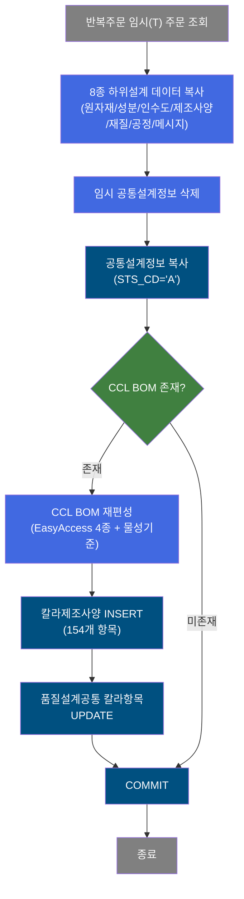

<h1 style="font-size: 40px; text-align: center; font-weight:
   bold; margin: 30px 0;">
  C102100180 레거시 시스템 분석 종합 보고서
</h1>


# 1. 시스템 개요
- **서비스 ID**: C102100180
- **업무명**: 반복주문 품질설계 재편성 (NUI 배치)
- **분석 일시**: 2026-03-16 20:10 KST
- **분석 시간**: 약 3분
- **전체 Activity 수**: 15개 (Custom 1, Built-in 12, Common 2)
- **분석자**: Claude Opus 4.6
- **분석 도구**: /analyze-service C102100180
- **문서 버전**: 1.0

# 📊 비즈니스 프로세스 분석

## 시스템 목적

C102100180 서비스는 반복주문(QLT_DSN_STS_CD='T')의 품질설계 데이터를 이전 주문(ORD_REP_NO/ORD_REP_LN)에서 신규 주문으로 일괄 복사하고, 칼라 제품인 경우 CCL BOM 제조사양을 재편성하는 NUI(배치) 서비스이다.

반복주문이란 기존에 설계가 완료된 주문과 동일한 사양으로 재발주된 주문을 의미한다. 이 서비스는 원자재설계(RMT), 성분설계(CHM), 인수도설계(DLV), 제조사양설계(MNF), 재질설계(MQL), 원자재통과공정(PROC), 메시지설계(MSG, MSG1) 등 8종의 하위 설계 데이터를 이전 주문에서 복사한 후, 기존 임시 상태(STS_CD='T')의 공통설계정보를 삭제하고 이전 주문의 공통설계정보를 신규 주문으로 복사(STS_CD='A'로 변경)한다.

이후 CCL BOM번호(CCL_BOM_NO) 존재 여부를 확인하여, 칼라 제품이면 `ReorderCclBomDesign` Activity를 통해 CCL BOM 기준 데이터와 EasyAccess 마스터 4종(C10B2260/C10B2280/C10B2290/C10B2300), 칼라물성기준(TB_C10_CLR_MPR)을 재조회·재편성한다. 비칼라 제품은 CCL BOM 재편성을 건너뛰고 바로 COMMIT한다.

## 핵심 워크플로우 다이어그램



### 상세 워크플로우 다이어그램

```mermaid
flowchart TD
    A["서비스 시작\n(initial: SEARCH_CMN_T)"]:::start
    A --> B["SEARCH_CMN_T\nPosSearch: C102100CMN.Tselect\nQLT_DSN_STS_CD='T' 전건 조회\n→ RK_SEARCH"]:::proc
    B --> C["INSERT_RMT\nPosInsert: C102100170.RMTinsert\n원자재설계정보 복사 (11개 항목)"]:::save
    C --> D["INSERT_CHM\nPosInsert: C102100170.CHMinsert\n성분설계정보 복사 (31개 항목)"]:::save
    D --> E["INSERT_DEV\nPosInsert: C102100170.DLVinsert\n인수도설계정보 복사 (17개 항목)"]:::save
    E --> F["INSERT_MNF\nPosInsert: C102100170.MNFinsert\n제조사양설계정보 복사 (125개 항목)"]:::save
    F --> G["INSERT_MQL\nPosInsert: C102100170.MQLinsert\n재질설계정보 복사 (22개 항목)"]:::save
    G --> H["INSERT_PROC\nPosInsert: C102100170.PROCinsert\n원자재통과공정정보 복사"]:::save
    H --> I["INSERT_MSG\nPosInsert: C102100170.MSGinsert\n메시지설계정보 복사"]:::save
    I --> J["INSERT_MSG1\nPosInsert: C102100170.MSG1insert\n메시지1설계정보 복사"]:::save
    J --> K["DELETE_CMN\nPosDelete: C102100170.CMMdelete\n임시(T) 공통설계정보 삭제"]:::error
    K --> L["INSERT_CMN\nPosInsert: C102100170.CMNinsert\n공통설계정보 복사 (165개 항목)\nSTS_CD='A' 고정"]:::save
    L --> M["CCL_BOM_CHK\nDbConditionRouter\nRK_SEARCH.CCL_BOM_NO NULL 체크"]:::decision2
    M -->|"Y (존재)"| N["SEARCH_MD\nReorderCclBomDesign\nCCL BOM 재편성\nEasyAccess 4종 + 물성기준 Fallback"]:::proc
    M -->|"N (미존재)"| Q["COMMIT\nDbSetCommit: tx1"]:::save
    N --> O["INSERT_CCL_BOM\nPosInsert: C102100CCL_BOM.insert\n154개 파라미터"]:::save
    O --> P["MODIFY_CMN\nPosModify: C102100CMN.CCL_modify\n11개 항목 UPDATE"]:::save
    P --> Q
    Q --> R["종료"]:::start

    classDef start fill:#808080,color:#fff
    classDef proc fill:#4169E1,color:#fff
    classDef decision2 fill:#008000,color:#fff
    classDef save fill:#005080,color:#fff
    classDef error fill:#F00000,color:#fff
```



## 주요 유즈케이스

### UC-01: 반복주문 품질설계 데이터 일괄 복사

- **Actor**: 시스템 (NUI 배치 프로세스)
- **목적**: 반복주문(QLT_DSN_STS_CD='T')의 설계 데이터를 이전 주문에서 신규 주문으로 일괄 복사하여 설계 업무 효율화

- **전제조건**:
  - TB_C10_QLT_DSN_CMN에 QLT_DSN_STS_CD='T'인 주문이 존재
  - 해당 주문에 반복주문번호(ORD_REP_NO, ORD_REP_LN)가 매핑되어 있음
  - 이전 주문(ORD_REP_NO)의 각종 설계 데이터가 존재

- **주요 흐름**:
  1. C102100CMN.Tselect로 QLT_DSN_STS_CD='T'인 전건 조회 → RK_SEARCH에 저장
  2. INSERT_RMT: 이전 주문의 원자재설계정보(11개 항목) 복사
  3. INSERT_CHM: 이전 주문의 성분설계정보(31개 성분 범위) 복사
  4. INSERT_DEV: 이전 주문의 인수도설계정보(17개 항목) 복사
  5. INSERT_MNF: 이전 주문의 제조사양설계정보(125개 항목) 복사
  6. INSERT_MQL: 이전 주문의 재질설계정보(22개 기계적 성질) 복사
  7. INSERT_PROC: 이전 주문의 원자재통과공정정보 복사
  8. INSERT_MSG: 이전 주문의 메시지설계정보 복사
  9. INSERT_MSG1: 이전 주문의 메시지1설계정보 복사
  10. DELETE_CMN: 신규 주문의 임시(T) 공통설계정보 삭제
  11. INSERT_CMN: 이전 주문의 공통설계정보(165개 항목) 복사 (STS_CD='A'로 변경)

- **대체 흐름**:
  - 이전 주문에 해당 설계 데이터 미존재: INSERT 0건 처리 (에러 아님)
  - DELETE_CMN 대상 없음: 삭제 0건 처리 (에러 아님)

- **후행조건**:
  - 신규 주문에 8종 하위설계 데이터가 복사됨
  - 공통설계정보가 'A'(완료) 상태로 재등록됨

### UC-02: 칼라제품 CCL BOM 재편성

- **Actor**: 시스템 (ReorderCclBomDesign Activity)
- **목적**: 반복주문 중 칼라 제품(CCL_BOM_NO 존재)에 대해 최신 CCL BOM 기준으로 칼라제조사양을 재편성

- **전제조건**:
  - UC-01의 공통설계정보 복사 완료
  - CCL_BOM_CHK에서 CCL_BOM_NO가 NULL이 아님 (칼라 제품)
  - CCL BOM 기준 테이블(TB_C10_CCL_BOM)에 해당 BOM 데이터 존재

- **주요 흐름**:
  1. CCL_BOM_CHK가 RK_SEARCH의 CCL_BOM_NO NULL 여부 판정
  2. CCL_BOM_NO 존재 시 → SEARCH_MD(ReorderCclBomDesign) 실행
  3. 칼라 제품 판정 (PRD_NM_CD 1~9)
  4. CCL BOM 기준 조회 (dao.find SELECT_CCL_BOM)
  5. EasyAccess C10B2280(감량매직체크기준) 조회
  6. EasyAccess C10B2290(지관발주메시지기준) 조회
  7. EasyAccess C10B2300(PE-FOAM 적용메시지기준) 조회
  8. 보호필름코드 5자리 분해
  9. 칼라물성기준(TB_C10_CLR_MPR) 4단계 Fallback 조회
  10. INSERT_CCL_BOM: C102100CCL_BOM.insert (154개 항목 INSERT)
  11. MODIFY_CMN: C102100CMN.CCL_modify (11개 칼라 항목 UPDATE)

- **대체 흐름**:
  - CCL_BOM_NO NULL (비칼라 제품): CCL BOM 재편성 생략 → 바로 COMMIT
  - 비칼라 제품 (PRD_NM_CD NOT IN 1~9): 'false' 반환 → 루프 다음 건
  - CCL BOM 미존재/복수건: FAILURE → 에러 처리
  - 칼라물성기준 4단계 Fallback 전부 실패: FAILURE

- **후행조건**:
  - TB_C10_QLT_DSN_CCL_BOM에 최신 CCL BOM 기반 칼라제조사양 등록
  - TB_C10_QLT_DSN_CMN에 색상/도막/수지/광택도 등 칼라 항목 갱신

### UC-03: 비칼라 제품 반복주문 처리

- **Actor**: 시스템 (NUI 배치 프로세스)
- **목적**: CCL BOM번호가 없는 비칼라 제품의 반복주문에 대해 기본 설계 데이터만 복사

- **전제조건**:
  - UC-01의 공통설계정보 복사 완료
  - CCL_BOM_CHK에서 CCL_BOM_NO가 NULL

- **주요 흐름**:
  1. UC-01의 8종 설계 데이터 복사 + 공통설계정보 복사 완료
  2. CCL_BOM_CHK에서 CCL_BOM_NO NULL 판정 → 'N' 반환
  3. CCL BOM 재편성 건너뜀
  4. 바로 COMMIT(tx1)

- **대체 흐름**: 없음

- **후행조건**:
  - 8종 설계 데이터 + 공통설계정보만 복사 완료
  - 칼라제조사양 관련 데이터 변경 없음

---
## 비즈니스 로직 상세

### 1. 8종 하위설계 데이터 일괄 복사 패턴

- **목적**: 반복주문의 품질설계 하위 데이터를 이전 주문에서 신규 주문으로 일괄 복사하여 설계자의 반복 작업을 제거
- **처리 케이스**:

  **[케이스 1: 순차 INSERT-SELECT 복사]**
  ```
    조건: 모든 반복주문 (QLT_DSN_STS_CD='T')
    처리:
      1. 각 INSERT 쿼리가 INSERT INTO ... SELECT ... FROM ... WHERE ORD_NO=:ORD_REP_NO AND ORD_LN=:ORD_REP_LN 패턴으로 실행
      2. 신규 주문번호(ORD_NO, ORD_LN)로 PK를 교체
      3. 생성자/변경자 정보(OBJECT_TYPE, OBJECT_ID, PROGRAM_ID, TIMESTAMP) 신규 기록
      4. 8종 테이블을 정해진 순서로 순차 실행
  ```

  **[케이스 2: 공통설계정보 DELETE-INSERT 패턴]**
  ```
    조건: 임시 상태(QLT_DSN_STS_CD='T') 데이터 존재
    처리:
      1. DELETE_CMN: QLT_DSN_STS_CD='T' 조건으로 기존 임시 행 삭제
      2. INSERT_CMN: 이전 주문에서 165개 항목 복사, QLT_DSN_STS_CD='A'로 고정
      3. 설계상태가 임시(T)에서 완료(A)로 전환됨
  ```

### 2. CCL BOM 존재 여부 분기 (DbConditionRouter)

- **목적**: 칼라 제품과 비칼라 제품을 구분하여 CCL BOM 재편성 여부를 결정
- **처리 케이스**:

  **[케이스 1: CCL BOM 존재 (칼라 제품)]**
  ```
    조건: RK_SEARCH.CCL_BOM_NO IS NOT NULL
    처리:
      1. DbConditionRouter가 'Y' 반환
      2. SEARCH_MD(ReorderCclBomDesign) → INSERT_CCL_BOM → MODIFY_CMN 체인 실행
  ```

  **[케이스 2: CCL BOM 미존재 (비칼라 제품)]**
  ```
    조건: RK_SEARCH.CCL_BOM_NO IS NULL
    처리:
      1. DbConditionRouter가 'N' 반환
      2. 바로 COMMIT으로 전이 → CCL BOM 재편성 생략
  ```

### 3. 칼라제조사양 재편성 (ReorderCclBomDesign)

- **목적**: 재편성 시 최신 CCL BOM 기준 데이터와 EasyAccess 마스터를 조회하여 칼라제조사양을 새로 생성
- **처리 케이스**:

  **[케이스 1: 정상 재편성]**
  ```
    조건: CCL_BOM_NO로 CCL BOM 기준 정확히 1건 매칭
    처리:
      1. 칼라 제품 판정 (PRD_NM_CD 1~9)
      2. dao.find(SELECT_CCL_BOM) → 전체 컬럼 PosContext 등록
      3. QLT_DSN_CFM_TP 처리: 'M' → C10B2260 재판정, null → 'M' 설정
      4. C10B2280(감량매직), C10B2290(지관발주), C10B2300(PE-FOAM) 순차 조회
      5. 보호필름코드 5자리 분해 (광택/두께/재질/SUS점착력/제품점착력)
      6. 칼라물성기준 4단계 Fallback 조회
      7. SUCCESS 반환 → INSERT_CCL_BOM으로 전이
  ```

  **[케이스 2: DbSearchCclBomData와의 차이]**
  ```
    DbSearchCclBomData (C102100160): 신규 편성 시 사용, COL_KEY_WRD1~4 등록 O
    ReorderCclBomDesign (C102100180): 재편성 시 사용, COL_KEY_WRD1~4 등록 X
    나머지 로직 100% 동일
  ```

### 4. 칼라물성기준 4단계 Fallback 조회

- **목적**: 정확한 조건으로 칼라물성기준을 찾지 못할 때 조건을 완화하여 최대한 기준 데이터를 매칭
- **계산 공식**:
  ```
  Fallback 순서:
  1차: CCL_BOM_NO + FNL_CUS_CD(원래값) + ORD_USG_CD(원래값)
  2차: CCL_BOM_NO + FNL_CUS_CD(원래값) + '******'
  3차: CCL_BOM_NO + '******' + ORD_USG_CD(원래값)
  4차: CCL_BOM_NO + '******' + '******'

  ※ '******' = 별표 6자리 (범용 기본값)
  ※ 4차까지 전부 실패 → FAILURE (에러코드 KP04)
  ※ 조회 결과 복수건(>1) → FAILURE (에러코드 KP14)
  ```

### 5. 공통설계정보 복사 시 상태 전환 로직

- **목적**: 반복주문의 임시 상태를 완료 상태로 전환하면서 이전 주문의 설계 데이터를 적용
- **처리 케이스**:

  **[케이스 1: DELETE-INSERT 상태 전환]**
  ```
    조건: 신규 주문에 QLT_DSN_STS_CD='T' 행 존재
    처리:
      1. CMMdelete: QLT_DSN_STS_CD='T' 조건으로 임시 행 삭제
      2. CMNinsert: 이전 주문에서 165개 항목 복사
         - QLT_DSN_STS_CD = 'A' (완료) 고정
         - 일부 항목(배송일, 수령일, 메시지) 파라미터 오버라이드
         - 생성/변경 정보 신규 기록
  ```

---

# ⚙️ Java 컴포넌트 분석

## Custom Activity 상세 분석

### 1개 Custom Activity 발견

### 1. ReorderCclBomDesign (SEARCH_MD)
- **클래스명**: com.unionsteel.mes.c10.activity.nui.ReorderCclBomDesign
- **액티비티명**: SEARCH_MD
- **파일 경로**: src/com/unionsteel/mes/c10/activity/nui/ReorderCclBomDesign.java
- **주요 기능**: 칼라제조사양 재편성 - CCL BOM 기준 조회, EasyAccess 마스터 4종 조회, 보호필름코드 분해, 칼라물성기준 Fallback 조회
- **라인 수**: 524 | **메소드 수**: 1개 (runActivity)

> 칼라제조사양을 재편성(Reorder)하는 Activity 클래스다. `DbSearchCclBomData`와 로직이 거의 동일하나, 재편성 시 호출되며 COL_KEY_WRD1~4를 등록하지 않는다는 점이 유일한 차이이다.

📎 **[상세 분석 보고서](../customClass/com.unionsteel.mes.c10.activity.nui.ReorderCclBomDesign_class_analysis.md)**

---

# 💾 데이터 요구사항

## 핵심 테이블

### 1. TB_C10_QLT_DSN_CMN - (품질설계 공통)
| 컬럼명 | 타입 | PK | 설명 |
|--------|------|----|-----|
| ORD_NO | VARCHAR2 | ✅ | 주문번호 |
| ORD_LN | NUMBER | ✅ | 주문행번 |
| QLT_DSN_STS_CD | VARCHAR2 | | 품질설계상태코드 (T=임시, A=완료, J=대기) |
| PRD_NM_CD | VARCHAR2 | | 품명코드 (1~9=칼라) |
| CCL_BOM_NO | VARCHAR2 | | CCL BOM번호 |
| ORD_REP_NO | VARCHAR2 | | 반복주문번호 |
| ORD_REP_LN | NUMBER | | 반복주문행번 |
| HUE_CD_FRN | VARCHAR2 | | 색상코드전면 |
| HUE_CD_BAK | VARCHAR2 | | 색상코드후면 |
| PNT_FLM_THK_FRN_TOT | VARCHAR2 | | 도막두께전면Total |
| PNT_FLM_THK_BAK_TOT | VARCHAR2 | | 도막두께후면Total |
| RSN_TP_FRN | VARCHAR2 | | 수지구분전면 |
| RSN_TP_BAK | VARCHAR2 | | 수지구분후면 |
| LUS_RT_CD_FRN | VARCHAR2 | | 광택도코드전면 |
| LUS_RT_CD_BAK | VARCHAR2 | | 광택도코드후면 |
| COT_MTH | VARCHAR2 | | 코팅방식 |
| CUS_CD | VARCHAR2 | | 고객사코드 |
| FNL_CUS_CD | VARCHAR2 | | 최종수요가코드 |
| ORD_USG_CD | VARCHAR2 | | 주문용도코드 |

### 2. TB_C10_QLT_DSN_CCL_BOM - (품질설계결과 칼라제조사양)
| 컬럼명 | 타입 | PK | 설명 |
|--------|------|----|-----|
| ORD_NO | VARCHAR2 | ✅ | 주문번호 |
| ORD_LN | NUMBER | ✅ | 주문행번 |
| COT_MTH | VARCHAR2 | | 코팅방식 |
| HUE_CD_FRN | VARCHAR2 | | 색상코드전면 |
| HUE_CD_BAK | VARCHAR2 | | 색상코드후면 |
| MAIN_PROC_CD | VARCHAR2 | | 주공정코드 |
| QLT_DSN_CFM_TP | VARCHAR2 | | 품질설계확정구분 |

### 3. TB_C10_QLT_DSN_RMT - (원자재설계정보)
| 컬럼명 | 타입 | PK | 설명 |
|--------|------|----|-----|
| ORD_NO | VARCHAR2 | ✅ | 주문번호 |
| ORD_LN | NUMBER | ✅ | 주문행번 |
| QLT_DSN_MNF_TP | VARCHAR2 | | 설계제조사양구분 |

### 4. TB_C10_QLT_DSN_CHM - (성분설계정보)
| 컬럼명 | 타입 | PK | 설명 |
|--------|------|----|-----|
| ORD_NO | VARCHAR2 | ✅ | 주문번호 |
| ORD_LN | NUMBER | ✅ | 주문행번 |
| QLT_DSN_SPC_TP | VARCHAR2 | | 설계규격구분 |
| C_LLV | NUMBER | | 탄소 하한값 |
| C_ULV | NUMBER | | 탄소 상한값 |

### 5. TB_C10_QLT_DSN_DLV - (인수도설계정보)
| 컬럼명 | 타입 | PK | 설명 |
|--------|------|----|-----|
| ORD_NO | VARCHAR2 | ✅ | 주문번호 |
| ORD_LN | NUMBER | ✅ | 주문행번 |
| QLT_DSN_SPC_TP | VARCHAR2 | | 설계규격구분 |

### 6. TB_C10_QLT_DSN_MNF - (제조사양설계정보)
| 컬럼명 | 타입 | PK | 설명 |
|--------|------|----|-----|
| ORD_NO | VARCHAR2 | ✅ | 주문번호 |
| ORD_LN | NUMBER | ✅ | 주문행번 |
| QLT_DSN_MNF_TP | VARCHAR2 | | 제조사양구분 |

### 7. TB_C10_QLT_DSN_MQL - (재질설계정보)
| 컬럼명 | 타입 | PK | 설명 |
|--------|------|----|-----|
| ORD_NO | VARCHAR2 | ✅ | 주문번호 |
| ORD_LN | NUMBER | ✅ | 주문행번 |
| QLT_DSN_SPC_TP | VARCHAR2 | | 설계규격구분 |

### 8. TB_C10_QLT_DSN_PROC - (원자재통과공정정보)
| 컬럼명 | 타입 | PK | 설명 |
|--------|------|----|-----|
| ORD_NO | VARCHAR2 | ✅ | 주문번호 |
| ORD_LN | NUMBER | ✅ | 주문행번 |
| PROC_SEQ | NUMBER | | 공정순번 |
| MAIN_PROC_CD | VARCHAR2 | | 주공정코드 |

### 9. TB_C10_QLT_DSN_MSG - (메시지설계정보)
| 컬럼명 | 타입 | PK | 설명 |
|--------|------|----|-----|
| ORD_NO | VARCHAR2 | ✅ | 주문번호 |
| ORD_LN | NUMBER | ✅ | 주문행번 |
| QLT_DSN_MNF_TP | VARCHAR2 | | 제조사양구분 |

### 10. TB_C10_QLT_DSN_MSG1 - (메시지1설계정보)
| 컬럼명 | 타입 | PK | 설명 |
|--------|------|----|-----|
| ORD_NO | VARCHAR2 | ✅ | 주문번호 |
| ORD_LN | NUMBER | ✅ | 주문행번 |
| QLT_MSG_NM | VARCHAR2 | | 품질메시지명 |

### 11. TB_C10_CCL_BOM - (CCL BOM 기준)
| 컬럼명 | 타입 | PK | 설명 |
|--------|------|----|-----|
| CCL_BOM_NO | VARCHAR2 | ✅ | CCL BOM번호 |
| (전체 컬럼) | - | | 칼라제조사양 기준 전체 항목 |

### 12. TB_C10_CLR_MPR - (칼라물성시험기준)
| 컬럼명 | 타입 | PK | 설명 |
|--------|------|----|-----|
| CCL_BOM_NO | VARCHAR2 | ✅ | CCL BOM번호 |
| FNL_CUS_CD | VARCHAR2 | ✅ | 최종수요가코드 |
| ORD_USG_CD | VARCHAR2 | ✅ | 주문용도코드 |
| CLR_DIF_FRN_LLV | VARCHAR2 | | 색차전면하한값 |
| MPR_BAS_PNCL_HRDN_FRN | VARCHAR2 | | 물성기준연필경도전면 |

## 데이터 플로우

### 1. 반복주문 대상 조회
```
[배치 실행 시 반복주문 임시(T) 주문 조회]
서비스 시작
→ C102100CMN.Tselect
  FROM TB_C10_QLT_DSN_CMN
  WHERE QLT_DSN_STS_CD = 'T'
→ RK_SEARCH에 ResultSet 저장
```

### 2. 8종 하위설계 데이터 복사
```
[이전 주문에서 신규 주문으로 설계 데이터 일괄 복사]
SEARCH_CMN_T 성공
→ C102100170.RMTinsert: INSERT INTO TB_C10_QLT_DSN_RMT SELECT ... FROM TB_C10_QLT_DSN_RMT WHERE ORD_REP_NO, ORD_REP_LN
→ C102100170.CHMinsert: INSERT INTO TB_C10_QLT_DSN_CHM (31개 성분 범위) 복사
→ C102100170.DLVinsert: INSERT INTO TB_C10_QLT_DSN_DLV (17개 인수도 조건) 복사
→ C102100170.MNFinsert: INSERT INTO TB_C10_QLT_DSN_MNF (125개 제조사양) 복사
→ C102100170.MQLinsert: INSERT INTO TB_C10_QLT_DSN_MQL (22개 재질 항목) 복사
→ C102100170.PROCinsert: INSERT INTO TB_C10_QLT_DSN_PROC (공정 정보) 복사
→ C102100170.MSGinsert: INSERT INTO TB_C10_QLT_DSN_MSG (메시지) 복사
→ C102100170.MSG1insert: INSERT INTO TB_C10_QLT_DSN_MSG1 (메시지1) 복사
```

### 3. 공통설계정보 교체
```
[임시 삭제 → 이전 주문 복사]
→ C102100170.CMMdelete
  DELETE FROM TB_C10_QLT_DSN_CMN
  WHERE ORD_NO = ? AND ORD_LN = ? AND QLT_DSN_STS_CD = 'T'

→ C102100170.CMNinsert
  INSERT INTO TB_C10_QLT_DSN_CMN (165개 항목)
  SELECT ... FROM TB_C10_QLT_DSN_CMN WHERE ORD_REP_NO, ORD_REP_LN
  QLT_DSN_STS_CD = 'A' (완료 고정)
```

### 4. 칼라제조사양 재편성 (칼라 제품만)
```
[CCL BOM 존재 시 재편성]
CCL_BOM_CHK: CCL_BOM_NO IS NOT NULL → 'Y'
→ ReorderCclBomDesign.runActivity()
  CCL BOM 기준 조회 + EasyAccess 4종 + 물성기준 Fallback

→ C102100CCL_BOM.insert
  INSERT INTO TB_C10_QLT_DSN_CCL_BOM (154개 항목)

→ C102100CMN.CCL_modify
  UPDATE TB_C10_QLT_DSN_CMN SET 11개 칼라 항목
  WHERE ORD_NO = ? AND ORD_LN = ?
```

## SQL 일람표
| SQL 이름 | 쿼리 ID | 타입 | 출처 | 테이블 |
|---------|---------|-----|-------|-------|
| 반복주문 임시 주문 조회 | C102100CMN.Tselect | SELECT | Service | TB_C10_QLT_DSN_CMN |
| 원자재설계정보 복사 | C102100170.RMTinsert | INSERT | Service | TB_C10_QLT_DSN_RMT |
| 성분설계정보 복사 | C102100170.CHMinsert | INSERT | Service | TB_C10_QLT_DSN_CHM |
| 인수도설계정보 복사 | C102100170.DLVinsert | INSERT | Service | TB_C10_QLT_DSN_DLV |
| 제조사양설계정보 복사 | C102100170.MNFinsert | INSERT | Service | TB_C10_QLT_DSN_MNF |
| 재질설계정보 복사 | C102100170.MQLinsert | INSERT | Service | TB_C10_QLT_DSN_MQL |
| 원자재통과공정정보 복사 | C102100170.PROCinsert | INSERT | Service | TB_C10_QLT_DSN_PROC |
| 메시지설계정보 복사 | C102100170.MSGinsert | INSERT | Service | TB_C10_QLT_DSN_MSG |
| 메시지1설계정보 복사 | C102100170.MSG1insert | INSERT | Service | TB_C10_QLT_DSN_MSG1 |
| 임시 공통설계정보 삭제 | C102100170.CMMdelete | DELETE | Service | TB_C10_QLT_DSN_CMN |
| 공통설계정보 복사 | C102100170.CMNinsert | INSERT | Service | TB_C10_QLT_DSN_CMN |
| 칼라제조사양 등록 | C102100CCL_BOM.insert | INSERT | Service | TB_C10_QLT_DSN_CCL_BOM |
| 품질설계공통 칼라항목 UPDATE | C102100CMN.CCL_modify | UPDATE | Service | TB_C10_QLT_DSN_CMN |
| CCL BOM 기준 조회 | C102100CCL_BOM.select | SELECT | Java (ReorderCclBomDesign) | TB_C10_CCL_BOM |
| 칼라물성시험기준 조회 | (SELECT_CLR_MPR) | SELECT | Java (ReorderCclBomDesign) | TB_C10_CLR_MPR |

## ER 다이어그램 (핵심 관계)

```mermaid
erDiagram
    TB_C10_QLT_DSN_CMN ||--o| TB_C10_QLT_DSN_CCL_BOM : "1:1 주문별 제조사양"
    TB_C10_QLT_DSN_CMN ||--o| TB_C10_QLT_DSN_RMT : "1:1 원자재설계"
    TB_C10_QLT_DSN_CMN ||--o| TB_C10_QLT_DSN_CHM : "1:N 성분설계"
    TB_C10_QLT_DSN_CMN ||--o| TB_C10_QLT_DSN_DLV : "1:1 인수도설계"
    TB_C10_QLT_DSN_CMN ||--o| TB_C10_QLT_DSN_MNF : "1:N 제조사양설계"
    TB_C10_QLT_DSN_CMN ||--o| TB_C10_QLT_DSN_MQL : "1:N 재질설계"
    TB_C10_QLT_DSN_CMN ||--o{ TB_C10_QLT_DSN_PROC : "1:N 통과공정"
    TB_C10_QLT_DSN_CMN ||--o{ TB_C10_QLT_DSN_MSG : "1:N 메시지"
    TB_C10_QLT_DSN_CMN ||--o{ TB_C10_QLT_DSN_MSG1 : "1:N 메시지1"
    TB_C10_CCL_BOM ||--o{ TB_C10_QLT_DSN_CCL_BOM : "1:N BOM기준별"
    TB_C10_CLR_MPR ||--o{ TB_C10_QLT_DSN_CCL_BOM : "1:N 물성기준별"
    TB_C10_QLT_DSN_CMN {
        VARCHAR2 ORD_NO PK "주문번호"
        NUMBER ORD_LN PK "주문행번"
        VARCHAR2 QLT_DSN_STS_CD "품질설계상태코드"
        VARCHAR2 CCL_BOM_NO "CCL BOM번호"
        VARCHAR2 ORD_REP_NO "반복주문번호"
        NUMBER ORD_REP_LN "반복주문행번"
        VARCHAR2 PRD_NM_CD "품명코드"
    }
    TB_C10_QLT_DSN_CCL_BOM {
        VARCHAR2 ORD_NO PK "주문번호"
        NUMBER ORD_LN PK "주문행번"
        VARCHAR2 COT_MTH "코팅방식"
        VARCHAR2 HUE_CD_FRN "색상코드전면"
        VARCHAR2 MAIN_PROC_CD "주공정코드"
    }
    TB_C10_QLT_DSN_RMT {
        VARCHAR2 ORD_NO PK "주문번호"
        NUMBER ORD_LN PK "주문행번"
        VARCHAR2 QLT_DSN_MNF_TP "설계제조사양구분"
    }
    TB_C10_QLT_DSN_CHM {
        VARCHAR2 ORD_NO PK "주문번호"
        NUMBER ORD_LN PK "주문행번"
        VARCHAR2 QLT_DSN_SPC_TP "설계규격구분"
    }
    TB_C10_CCL_BOM {
        VARCHAR2 CCL_BOM_NO PK "CCL BOM번호"
    }
    TB_C10_CLR_MPR {
        VARCHAR2 CCL_BOM_NO PK "CCL BOM번호"
        VARCHAR2 FNL_CUS_CD PK "최종수요가코드"
        VARCHAR2 ORD_USG_CD PK "주문용도코드"
    }
```



관계 설명:
- **TB_C10_QLT_DSN_CMN**이 중심 테이블로 품질설계 전체 프로세스의 허브 역할
- 8종 하위설계 테이블(RMT, CHM, DLV, MNF, MQL, PROC, MSG, MSG1)이 ORD_NO + ORD_LN 기준으로 공통 테이블과 연결
- TB_C10_CCL_BOM → TB_C10_QLT_DSN_CCL_BOM: 하나의 BOM 기준으로 여러 주문의 칼라 제조사양 생성
- TB_C10_CLR_MPR: 칼라물성기준 Fallback 조회를 통해 제조사양에 물성값 반영

---

# 📌 특이사항 및 주의사항

## 1. C102100170 쿼리 공유 구조
- 본 서비스(C102100180)는 자체 쿼리 파일 없이 **C102100170-query.glue_sql**의 쿼리를 공유 사용한다. 이는 C102100170(반복주문 품질설계 복사 원본 서비스)과 동일한 INSERT-SELECT 패턴을 사용하기 때문이다. 쿼리 수정 시 양쪽 서비스에 동시 영향이 있으므로 주의가 필요하다.

## 2. DELETE-INSERT 패턴의 데이터 무결성
- 공통설계정보(TB_C10_QLT_DSN_CMN)에 대해 DELETE 후 INSERT 패턴을 사용한다. DELETE와 INSERT 사이에 장애가 발생하면 공통설계정보가 유실될 수 있다. tx1 트랜잭션 매니저가 일괄 COMMIT을 제어하므로, 중간 장애 시 전체 ROLLBACK되어 데이터 무결성이 보장된다.

## 3. CCL BOM 재편성에서 COL_KEY_WRD1~4 미등록
- ReorderCclBomDesign은 DbSearchCclBomData와 524라인 중 거의 동일한 코드이지만, 칼라물성기준 조회 성공 시 `COL_KEY_WRD1~4`(키워드 4종)를 PosContext에 등록하지 않는다. 이는 재편성 시에는 키워드 값을 갱신하지 않겠다는 업무 의도이나, 코드 중복이 상당하여 유지보수 리스크가 있다.

## 4. 154개 파라미터 INSERT (C102100CCL_BOM.insert)
- C102100160 서비스의 176개 파라미터 INSERT와 동일한 쿼리(C102100CCL_BOM.insert)를 사용하지만, 본 서비스에서는 param-count=154로 설정되어 있다. 이는 서비스 XML에서 매핑하는 파라미터 수의 차이로, 쿼리 자체는 동일하나 일부 컬럼에 대해 NULL이 바인딩될 수 있다.

## 5. 단건 처리 방식 (루프 없음)
- C102100160 서비스가 DbQualDesignLoop를 통해 다건 루프 처리하는 것과 달리, 본 서비스는 SEARCH_CMN_T의 조회 결과를 루프 없이 단건으로 처리한다. RK_SEARCH에 다건이 반환되더라도 첫 번째 건만 처리될 수 있으므로, 배치 스케줄러 단에서 건별 호출이 이루어지는 것으로 추정된다.

## 6. EasyAccess 마스터 4종 의존성
- C10B2260(자동확정 판정), C10B2280(감량매직), C10B2290(지관발주), C10B2300(PE-FOAM) 등 4개 EasyAccess 마스터에 의존한다. MasterDataException 발생 시 해당 기준만 스킵하고 계속 진행하는 장애 허용 설계가 적용되어 있다.

# 📚 참고 문서

- **Query SQL**:
  - `src/query/C102100CMN-query.glue_sql`
  - `src/query/C102100170-query.glue_sql`
  - `src/query/C102100CCL_BOM-query.glue_sql`
- **Custom Java 클래스**:
  - `src/com/unionsteel/mes/c10/activity/nui/ReorderCclBomDesign.java`
- **서비스 XML**: `src/service/C102100180-service.xml`
- **커스텀 클래스 상세 보고서**: `docs/analysis/service/customClass/com.unionsteel.mes.c10.activity.nui.ReorderCclBomDesign_class_analysis.md`
