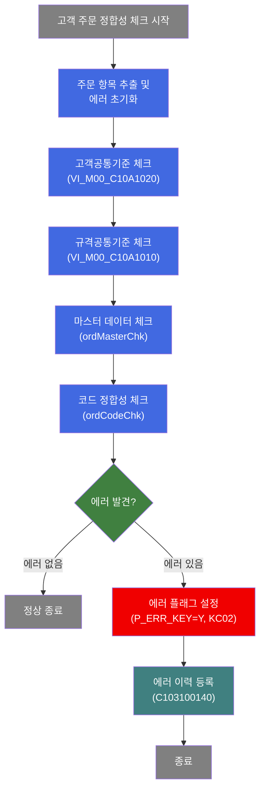
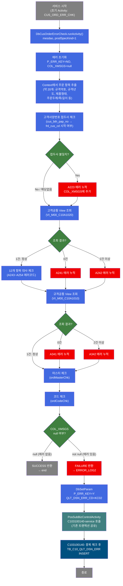
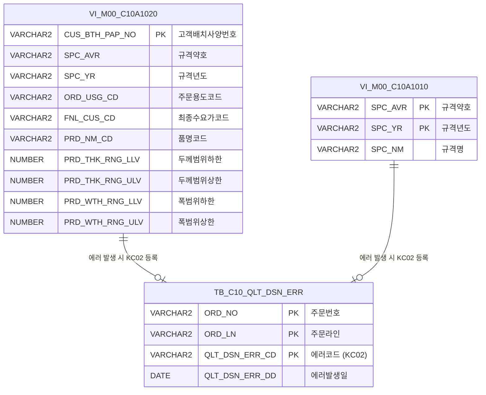

<h1 style="font-size: 40px; text-align: center; font-weight:
   bold; margin: 30px 0;">
  C102177700 레거시 시스템 분석 종합 보고서
</h1>


# 1. 시스템 개요
- **서비스 ID**: C102177700
- **업무명**: 고객 주문 에러 정합성 체크
- **분석 일시**: 2026-03-16 20:18 KST
- **분석 시간**: 약 5분
- **전체 Activity 수**: 3개 (Custom 1, Common 1, Built-in 1)
- **분석자**: Claude Opus 4.6
- **분석 도구**: /analyze-service C102177700
- **문서 버전**: 1.0

# 📊 비즈니스 프로세스 분석

## 시스템 목적

C102177700 서비스는 고객 주문(Customer Order) 항목에 대한 정합성 에러 체크를 수행하는 NUI(배치) 서비스이다. `DbCusOrderErrorCheck` Activity가 주문 항목에 대해 고객공통기준(VI_M00_C10A1020), 규격공통기준(VI_M00_C10A1010), 마스터코드 유효성, 코드 정합성 등을 다각도로 검증한다.

에러가 발견되지 않으면 서비스는 즉시 종료(success → end)된다. 에러가 발견되면 `ERROR_LOG2` Activity(DbSetParam)가 에러 플래그(`P_ERR_KEY=Y`)와 품질설계에러코드(`QLT_DSN_ERR_CD=KC02`)를 설정한 후, 서브서비스 `C103100140`을 호출하여 에러 이력을 TB_C10_QLT_DSN_ERR 테이블에 등록한다.

이 서비스는 `DbOrderErrorCheck`와 유사한 구조이나, `prodSpecKind=1` 속성이 설정되어 고객 주문에 특화된 사양 구분 체크를 수행한다. 에러 발생 시 `COL_XMSGS`에 에러 메시지를 쉼표 구분으로 누적하는 패턴을 사용한다.

## 핵심 워크플로우 다이어그램



### 상세 워크플로우 다이어그램



## 주요 유즈케이스

### UC-01: 고객 주문 정합성 체크 - 정상 (에러 없음)

- **Actor**: NUI 배치 프로세스 / 품질설계 시스템
- **목적**: 고객 주문 항목이 고객공통기준, 규격공통기준, 마스터코드, 코드 정합성을 모두 만족하는지 검증
- **전제조건**:
  - PosContext에 주문 관련 항목이 설정되어 있음 (ORD_NO, ORD_LN, 최종수요가코드, 고객배치사양번호, 규격약호, 규격년도 등 약 20개)
  - buni-list에 `RK_SEARCH`, bind-result에 `RK_MAIN` 설정
  - mesdao를 통한 DB 접속 가능

- **주요 흐름**:
  1. CUS_ORD_ERR_CHK Activity(DbCusOrderErrorCheck) 실행, prodSpecKind=1
  2. 에러 초기화 (P_ERR_KEY=NO, COL_XMSGS 초기화)
  3. 고객사양번호 접두사 체크 통과
  4. 고객공통 View(VI_M00_C10A1020) 조회 → 1건 매칭, 12개 항목 대사 모두 통과
  5. 규격공통 View(VI_M00_C10A1010) 조회 → 1건 매칭
  6. 마스터 체크(ordMasterChk) 통과
  7. 코드 체크(ordCodeChk) 통과
  8. COL_XMSGS = null → SUCCESS 반환 → end (정상 종료)

- **대체 흐름**:
  - 없음 (모든 체크 통과)

- **후행조건**:
  - P_ERR_KEY = NO (에러 없음)
  - TB_C10_QLT_DSN_ERR에 변경 없음

### UC-02: 고객 주문 정합성 체크 - 에러 발견 시 에러 이력 등록

- **Actor**: NUI 배치 프로세스
- **목적**: 정합성 체크 과정에서 에러가 발견된 경우 에러 코드(KC02)를 설정하고 에러 이력 테이블에 등록
- **전제조건**:
  - UC-01과 동일한 전제조건
  - 주문 항목 중 하나 이상이 기준과 불일치

- **주요 흐름**:
  1. CUS_ORD_ERR_CHK Activity에서 정합성 체크 수행
  2. 체크 과정 중 에러 발견 → COL_XMSGS에 에러 메시지 누적
  3. FAILURE 반환 → ERROR_LOG2 Activity로 전이
  4. DbSetParam이 P_ERR_KEY=Y, QLT_DSN_ERR_CD=KC02 설정
  5. SUBSERVICE Activity가 C103100140-service 호출 (new-transaction=false)
  6. C103100140: 중복 체크 후 TB_C10_QLT_DSN_ERR에 에러 레코드 INSERT

- **대체 흐름**:
  - C103100140에서 중복 에러 발견: INSERT 미수행 → 정상 종료

- **후행조건**:
  - P_ERR_KEY = Y
  - TB_C10_QLT_DSN_ERR에 에러 레코드 1건 삽입 (중복 아닌 경우)
  - QLT_DSN_ERR_CD = KC02 기록

### UC-03: 고객공통기준 항목 대사 에러

- **Actor**: NUI 배치 프로세스
- **목적**: 고객공통기준 View(VI_M00_C10A1020) 조회 결과와 주문 항목이 불일치할 때 개별 에러코드 부여
- **전제조건**:
  - 고객배치사양번호(cus_bth_pap_no)가 유효
  - VI_M00_C10A1020에서 1건 조회됨

- **주요 흐름**:
  1. 고객공통 View 조회 결과 1건과 주문 항목 12개 항목 대사
  2. 불일치 항목별 에러코드 부여:
     - 주문용도코드 상이 → A243
     - 규격약호 상이 → A244
     - 규격년도 상이 → A245
     - 최종수요가 상이 → A246
     - 품명 상이 → A247
     - 주문두께 범위 이탈 → A248
     - 주문폭 범위 이탈 → A249 (조합폭 계산 포함)
     - 주문길이 범위 이탈 → A250 (SHEET 제품만)
     - 두께구분코드 상이 → A251
     - 도금량 상이 → A252
     - 주문표면처리 상이 → A253
     - 색상코드 상이 → A254
  3. 모든 에러 COL_XMSGS에 누적 → FAILURE 반환

- **대체 흐름**:
  - 조회 0건: A241 에러 (고객공통기준 미등록)
  - 조회 2건 이상: A242 에러 (고객공통기준 중복)

- **후행조건**:
  - COL_XMSGS에 개별 에러 메시지 누적
  - C10STR_QLT_DSN_ERR_CD에 에러코드 누적

---

## 비즈니스 로직 상세

### 1. 고객 주문 정합성 다단계 체크 (DbCusOrderErrorCheck)

- **목적**: 고객 주문 항목의 정합성을 고객공통기준, 규격공통기준, 마스터 데이터, 코드 유효성 4단계로 검증하여 품질설계 에러를 사전에 감지

- **처리 케이스**:

  **[케이스 1: 고객사양번호 접두사 체크]**
  ```
  조건: cus_bth_pap_no가 유효(null 아님)
  처리:
    1. fnl_cus_cd(최종수요가코드)로 cus_bth_pap_no가 시작하는지 검증
    2. 시작하지 않으면 A223 에러 → COL_XMSGS에 누적
  ```

  **[케이스 2: 고객공통기준 대사 (VI_M00_C10A1020)]**
  ```
  조건: COL_CUS_BTH_PAP_NO가 null이 아닌 경우
  처리:
    1. VI_M00_C10A1020 View 조회 (고객배치사양번호 기준)
    2. count = 1: 12개 항목 개별 대사 (A243~A254)
    3. count = 0: A241 에러 (미등록)
    4. count > 1: A242 에러 (중복)
  ```

  **[케이스 3: 규격공통기준 체크 (VI_M00_C10A1010)]**
  ```
  조건: spc_avr(규격약호)와 spc_yr(규격년도) 둘 다 유효
  처리:
    1. VI_M00_C10A1010 View 조회
    2. count = 1: 정상
    3. count = 0: A341 에러 (미등록)
    4. count > 1: A342 에러 (중복)
  ```

  **[케이스 4: 마스터 데이터 체크]**
  ```
  조건: 항상 수행
  처리:
    1. ordMasterChk(ctx) 호출
    2. 필수값 존재 여부, 범위값 유효성, CCL BOM 칼라코드 일치 검증
    3. 에러 시 해당 에러코드를 COL_XMSGS에 누적
  ```

  **[케이스 5: 코드 정합성 체크]**
  ```
  조건: 항상 수행
  처리:
    1. ordCodeChk(ctx) 호출
    2. EasyAccess 마스터코드 일괄 검증 (품명, 제품형태, 유통경로, 주문종류 등 약 30개)
    3. 고객사코드(CUS_CD), 수요가코드(ACT_CUS_CD), 최종수요가코드(FNL_CUS_CD) 별도 DB 체크
    4. 주문포장방법 카테고리 체크, 품명별 Spangle 구분 체크, 도금량지정 체크
    5. 에러 시 해당 에러코드를 COL_XMSGS에 누적
  ```

- **계산 공식**:

  ```
  조합폭 계산:
    유효 조건: ord_slit_grp_cnt > 0 AND ord_exc_wth == ord_mix_wth1
    조합폭 = ord_slit_grp_cnt × ord_mix_wth1
    비조합폭: ord_exc_wth 직접 사용

  두께/폭/길이 범위 체크:
    에러 = (값 < RNG_LLV) OR (값 > RNG_ULV)
  ```

- **예외 처리**:
  - 고객공통기준 미등록: A241 에러 - "고객공통기준 미존재"
  - 고객공통기준 중복: A242 에러 - "고객공통기준 다건 존재"
  - 규격공통기준 미등록: A341 에러 - "규격공통기준 미존재"
  - 규격공통기준 중복: A342 에러 - "규격공통기준 다건 존재"
  - 고객사양번호 접두사 불일치: A223 에러

### 2. 에러 플래그 설정 및 에러 이력 등록

- **목적**: 정합성 체크에서 에러 발견 시 에러 코드 KC02를 설정하고 서브서비스를 통해 에러 이력 등록

- **처리 케이스**:

  **[케이스 1: 에러 이력 신규 등록]**
  ```
  조건: CUS_ORD_ERR_CHK에서 FAILURE 반환
  처리:
    1. ERROR_LOG2(DbSetParam)에서 P_ERR_KEY=Y, QLT_DSN_ERR_CD=KC02 설정
    2. C103100140 서브서비스 호출 (new-transaction=false, 기존 트랜잭션 공유)
    3. C103100140: (ORD_NO, ORD_LN, QLT_DSN_ERR_CD) 복합키로 중복 체크
    4. 중복 없으면 TB_C10_QLT_DSN_ERR에 INSERT
  ```

  **[케이스 2: 중복 에러 방지]**
  ```
  조건: 동일 (ORD_NO, ORD_LN, KC02) 에러 이미 등록됨
  처리:
    1. C103100140에서 중복 체크 조회 결과 1건 이상
    2. INSERT 미수행 → 정상 종료
  ```

---

# ⚙️ Java 컴포넌트 분석

## Custom Activity 상세 분석

### 1개 Custom Activity 발견

### 1. DbCusOrderErrorCheck (CUS_ORD_ERR_CHK)
- **클래스명**: `com.unionsteel.mes.c10.activity.nui.DbCusOrderErrorCheck`
- **액티비티명**: `CUS_ORD_ERR_CHK`
- **파일 경로**: (소스 미존재 - 유사 클래스: DbOrderErrorCheck.java)
- **주요 기능**: 고객 주문(Customer Order) 에러 정합성 체크 Activity. prodSpecKind=1 설정으로 고객 주문 특화 체크 수행.
- **참고 클래스**: DbOrderErrorCheck (4,087라인, 5개 메소드)

> DbOrderErrorCheck와 유사한 구조로, 주문 항목에 대해 고객공통기준(VI_M00_C10A1020), 규격공통기준(VI_M00_C10A1010), 마스터코드 유효성, 코드 정합성 등을 다각도로 검증한다. 에러 발생 시 COL_XMSGS에 누적하고 failure를 반환한다. **소스 코드 미존재** - DbOrderErrorCheck 분석 보고서 기반 추정.

#### 메소드 구조
- **주요 메소드**: `runActivity(PosContext ctx)`
  - 주문 정합성 전체 체크. 고객공통기준/규격공통기준/마스터/코드 체크를 순서대로 수행하고 에러 여부로 반환값 결정

#### 핵심 비즈니스 로직
- **에러 초기화**: P_ERR_KEY=NO 설정 후 Context에서 주문 항목 추출
- **고객사양번호 접두사 체크**: cus_bth_pap_no가 fnl_cus_cd로 시작하는지 검증 (A223 에러)
- **고객공통 View 대사**: VI_M00_C10A1020 조회 후 12개 항목 대사 (A241~A254 에러코드)
- **규격공통 View 체크**: VI_M00_C10A1010 조회 (A341, A342 에러코드)
- **마스터 체크**: ordMasterChk 호출 - 필수값, 범위값, CCL BOM 칼라코드 검증
- **코드 체크**: ordCodeChk 호출 - EasyAccess 마스터코드 일괄 검증, 고객사/수요가/최종수요가 DB 체크

#### Java 상수 및 의존성
- **주요 상수**: `C10NuiConstantsIF` (COL_XMSGS, C10STR_P_ERR_KEY, C10STR_QLT_DSN_ERR_CD 등)
- **핵심 의존성**: PosActivity, PosContext, PosRow/PosRowSet, PosParameter, EasyAccess, mesdao

📎 **[유사 클래스 상세 분석 보고서 (DbOrderErrorCheck)](../customClass/com.unionsteel.mes.c10.activity.nui.DbOrderErrorCheck_class_analysis.md)**

---

# 🔗 서브서비스

## 서브서비스 요약

| 서비스 ID | 설명 | 호출 액티비티 | 트랜잭션 | 상세 분석 |
|-----------|------|-------------|---------|----------|
| C103100140 | 품질설계결과 에러 등록 (중복 방지 포함) | SUBSERVICE | 기존 트랜잭션 공유 (new-transaction=false) | [상세 분석](./C103100140_legacy_analysis.md) |

### C103100140 - 품질설계결과 에러 등록
품질설계 과정에서 발생한 에러 정보를 TB_C10_QLT_DSN_ERR 테이블에 등록하는 서비스. 3개 복합키(ORD_NO, ORD_LN, QLT_DSN_ERR_CD)로 기존 에러 중복 여부를 체크한 후 신규 에러만 INSERT한다. Activity 2개, SQL 2개로 구성.

---

# 📌 특이사항 및 주의사항

## 1. 소스 코드 미존재 - DbCusOrderErrorCheck

- **DbCusOrderErrorCheck.java 파일이 프로젝트에 존재하지 않음** (소스 및 .class 파일 모두 미발견)
- DbOrderErrorCheck(4,087라인)와 유사한 구조로 추정되며, `prodSpecKind=1` 속성이 고객 주문 특화 동작을 구분
- 컴파일된 클래스가 서버에만 배포되어 있거나, 별도 빌드 라인에서 관리될 가능성 있음
- 현대화 시 소스 코드 확보 또는 DbOrderErrorCheck 기반 재구현 필요

## 2. 에러 메시지 누적 패턴 (COL_XMSGS)

- 에러가 발생할 때마다 COL_XMSGS에 쉼표(,) 구분으로 에러 메시지를 누적하는 패턴 사용
- 최종적으로 COL_XMSGS가 null이 아니면 전체 FAILURE로 판정
- 에러코드도 C10STR_QLT_DSN_ERR_CD에 별도로 누적
- 단일 주문 항목에서 복수의 에러가 동시에 발견될 수 있으나, 서브서비스 C103100140에는 고정 에러코드 `KC02`만 전달됨

## 3. 트랜잭션 공유 구조

- C102177700의 트랜잭션 관리자(`tx1`, commit=true)가 서브서비스 C103100140과 공유됨 (new-transaction=false)
- 에러 체크와 에러 이력 등록이 동일 트랜잭션 내에서 수행되므로, 에러 등록 실패 시 전체 롤백 가능성 있음
- C103100140의 SEARCH_ERR Activity가 Java 레벨에서만 중복 체크를 수행하므로, 동시 호출 시 Race Condition 가능성 존재

## 4. prodSpecKind=1 속성에 의한 동작 분기

- DbCusOrderErrorCheck는 서비스 XML에서 `prodSpecKind=1`을 property로 전달받음
- 이 값이 DbOrderErrorCheck(prodSpecKind 미설정 또는 다른 값)와의 동작 차이를 결정
- 고객 주문 특화 사양 구분 체크(고객배치사양번호 기반)가 활성화되는 것으로 추정

## 5. 고정 에러코드 KC02

- ERROR_LOG2에서 `QLT_DSN_ERR_CD=KC02`로 하드코딩되어 있음
- 개별 체크 단계의 세부 에러코드(A223, A241~A254, A341~A342 등)와는 별개로, 서브서비스에는 통합 에러코드 KC02만 전달
- COL_XMSGS에 누적된 세부 에러 메시지는 별도 경로로 활용되는 것으로 추정

---

# 💾 데이터 요구사항

## 핵심 테이블

| 테이블/뷰명 | 스키마 | 용도 | 접근 방식 |
|-------------|--------|------|----------|
| VI_M00_C10A1020 | M00APUSER | 고객공통기준 뷰 (고객배치사양번호 기반 12개 항목 대사) | mesdao SELECT |
| VI_M00_C10A1010 | M00APUSER | 규격공통기준 뷰 (규격약호+규격년도 기반 조회) | mesdao SELECT |
| TB_C10_QLT_DSN_ERR | MESAPUSER | 품질설계 에러 이력 테이블 | C103100140 서브서비스에서 INSERT |

## ER 다이어그램



관계 설명:
- **VI_M00_C10A1020**: 고객배치사양번호 기반으로 12개 항목(주문용도, 규격약호, 두께/폭/길이 범위 등) 대사 수행
- **VI_M00_C10A1010**: 규격약호+규격년도 기반으로 규격 존재 여부 및 중복 체크
- **TB_C10_QLT_DSN_ERR**: 에러 발생 시 서브서비스(C103100140)를 통해 에러 코드 KC02로 등록

---

# 📚 참고 문서

- **Service XML**: `src/service/C102177700-service.xml`
- **Custom Java 클래스**:
  - `com.unionsteel.mes.c10.activity.nui.DbCusOrderErrorCheck` (소스 미존재)
  - 참고: `src/com/unionsteel/mes/c10/activity/nui/DbOrderErrorCheck.java` (유사 클래스, 4,087라인)
- **서브서비스**: `src/service/C103100140-service.xml`
- **유사 클래스 분석 보고서**: `docs/analysis/service/customClass/com.unionsteel.mes.c10.activity.nui.DbOrderErrorCheck_class_analysis.md`
