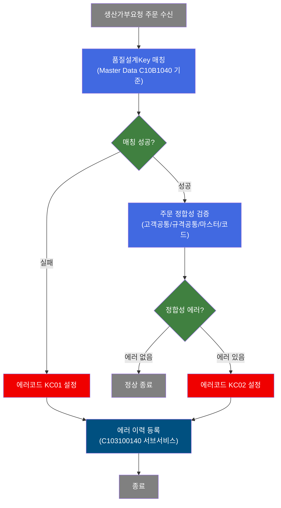
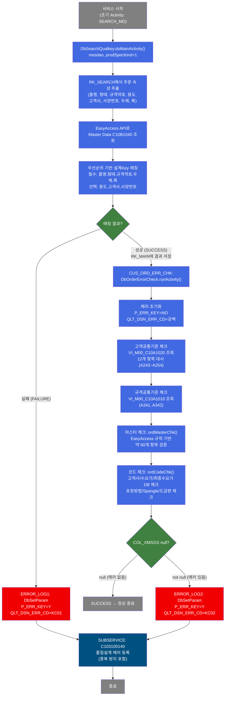
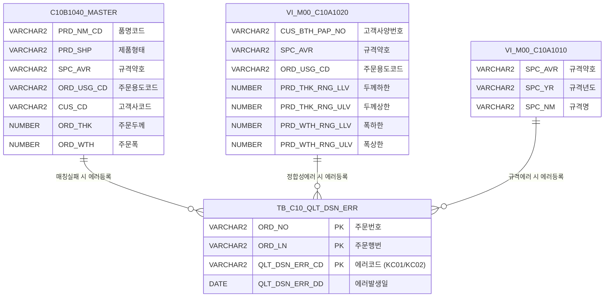

<h1 style="font-size: 40px; text-align: center; font-weight:
   bold; margin: 30px 0;">
  C102177701 레거시 시스템 분석 종합 보고서
</h1>


# 1. 시스템 개요
- **서비스 ID**: C102177701
- **업무명**: 품질설계Key 매칭 및 주문 정합성 검증
- **분석 일시**: 2026-03-16 20:11 KST
- **분석 시간**: 약 5분
- **전체 Activity 수**: 5개 (Custom 2, Common 2, Built-in 1)
- **분석자**: Claude Opus 4.6
- **분석 도구**: /analyze-service C102177701
- **문서 버전**: 1.0

# 📊 비즈니스 프로세스 분석

## 시스템 목적

C102177701 서비스는 OMS(주문관리시스템)에서 전달된 생산가부요청 주문에 대해 품질설계Key를 매칭하고, 주문 데이터의 정합성을 다각도로 검증하는 NUI(배치) 서비스이다.

서비스의 핵심 흐름은 두 단계로 구성된다. 첫째, `SEARCH_MD` Activity(DbSearchQualkey)가 Master Data의 설계Key기준(C10B1040)에서 주문 속성(품명, 형태, 규격약호, 주문용도코드, 고객사코드, 고객사양번호, 주문두께, 주문폭)에 맞는 품질설계Key를 우선순위 기반으로 매칭한다. 매칭에 성공하면 둘째, `CUS_ORD_ERR_CHK` Activity(DbOrderErrorCheck)가 고객공통기준, 규격공통기준, 마스터 데이터 기준, 코드 정합성 등을 검증하여 에러를 누적 수집한다.

에러가 발생한 경우(매칭 실패 시 KC01, 정합성 에러 시 KC02), `DbSetParam`으로 에러코드를 설정한 후 서브서비스 `C103100140`을 호출하여 `TB_C10_QLT_DSN_ERR` 테이블에 에러 이력을 등록한다. 에러 등록 시 중복 방지 로직이 적용되어 동일 주문-에러코드 조합이 이미 존재하면 INSERT를 스킵한다. 트랜잭션 관리자(`tx1`)가 설정되어 있으며 `commit=true`로 자동 커밋된다.

## 핵심 워크플로우 다이어그램



### 상세 워크플로우 다이어그램



## 주요 유즈케이스

### UC-01: 품질설계Key 매칭 (정상 케이스)
- **Actor**: NUI 배치 프로세스 / 품질설계 시스템
- **목적**: 생산가부요청 주문에 대해 마스터 데이터 기반으로 품질설계Key를 자동 매칭
- **전제조건**:
  - RK_SEARCH에 주문 정보(품명, 형태, 규격약호, 주문용도코드, 고객사코드, 고객사양번호, 주문두께, 주문폭)가 설정되어 있음
  - Master Data C10B1040 (설계Key기준)에 매칭 가능한 기준 데이터가 등록되어 있음
- **주요 흐름**:
  1. SEARCH_MD Activity 실행 - EasyAccess API로 C10B1040 마스터 데이터 조회
  2. 8개 조건(품명, 형태, 규격약호, 용도, 고객사, 사양번호, 두께, 폭)으로 우선순위 기반 매칭
  3. 매칭 결과를 RK_MAIN에 저장
  4. CUS_ORD_ERR_CHK Activity로 전이하여 주문 정합성 검증
  5. 모든 검증 통과 시 SUCCESS 반환
- **대체 흐름**:
  - 매칭 실패: FAILURE 반환 → ERROR_LOG1에서 KC01 에러코드 설정 → C103100140 서브서비스로 에러 등록
- **후행조건**:
  - 품질설계Key가 RK_MAIN에 저장됨
  - 주문 데이터가 후속 품질설계 프로세스에 사용 가능한 상태가 됨

### UC-02: 주문 정합성 에러 검출
- **Actor**: NUI 배치 프로세스
- **목적**: 품질설계Key 매칭 성공 후 주문 데이터의 고객공통/규격공통/마스터/코드 정합성을 다각도로 검증
- **전제조건**:
  - SEARCH_MD에서 품질설계Key 매칭이 성공하여 CUS_ORD_ERR_CHK로 전이됨
  - PosContext에 주문 관련 약 20개 항목이 설정되어 있음
- **주요 흐름**:
  1. 에러 초기화 (P_ERR_KEY=NO, QLT_DSN_ERR_CD=공백)
  2. 고객사양번호 접두사 검증 (cus_bth_pap_no가 fnl_cus_cd로 시작하는지)
  3. 고객공통기준 View(VI_M00_C10A1020) 조회 → 12개 항목 대사 (A243~A254)
  4. 규격공통기준 View(VI_M00_C10A1010) 조회 → 존재/중복 체크 (A341, A342)
  5. 마스터 체크: ordMasterChk() - EasyAccess 규칙 기반 약 60개 항목 검증
  6. 코드 체크: ordCodeChk() - 고객사/수요가/최종수요가 DB 유효성 + EasyAccess 코드 일괄 검증
  7. COL_XMSGS가 null이면 SUCCESS, 아니면 FAILURE
- **대체 흐름**:
  - 정합성 에러 발견: 에러 메시지를 COL_XMSGS에 쉼표 구분으로 누적 → FAILURE → ERROR_LOG2에서 KC02 에러코드 설정 → C103100140 서브서비스로 에러 등록
  - 고객공통기준 count > 1: A242 오류 (중복)
  - 고객공통기준 count = 0: A241 오류 (미등록)
- **후행조건**:
  - 에러 발생 시 TB_C10_QLT_DSN_ERR에 에러 이력이 등록됨
  - 에러 없으면 주문 데이터가 품질설계 프로세스에 정상 투입됨

### UC-03: 품질설계 에러 이력 등록
- **Actor**: NUI 배치 프로세스
- **목적**: 매칭 실패(KC01) 또는 정합성 에러(KC02) 발생 시 에러 이력을 TB_C10_QLT_DSN_ERR에 등록
- **전제조건**:
  - SEARCH_MD 또는 CUS_ORD_ERR_CHK에서 FAILURE 반환
  - DbSetParam으로 P_ERR_KEY=Y, QLT_DSN_ERR_CD=KC01 또는 KC02 설정 완료
- **주요 흐름**:
  1. ERROR_LOG1(KC01) 또는 ERROR_LOG2(KC02)에서 에러 파라미터 설정
  2. SUBSERVICE Activity가 C103100140-service 호출 (기존 트랜잭션 공유)
  3. C103100140: ORD_NO + ORD_LN + QLT_DSN_ERR_CD 복합키로 중복 체크
  4. 중복 없으면 TB_C10_QLT_DSN_ERR에 INSERT (QLT_DSN_ERR_DD = SYSDATE)
  5. 중복 있으면 INSERT 스킵 (정상 종료)
- **대체 흐름**:
  - 중복 레코드 존재: INSERT 스킵 후 정상 종료
  - DB 예외 발생: FAILURE 반환 (로그 기록)
- **후행조건**:
  - 에러 이력이 TB_C10_QLT_DSN_ERR에 등록됨 (중복 방지 적용)

---

## 비즈니스 로직 상세

### 1. 품질설계Key 우선순위 매칭 로직 (DbSearchQualkey)

- **목적**: 주문 속성 조합에 가장 적합한 품질설계Key를 마스터 데이터에서 자동 매칭
- **처리 케이스**:

  **[케이스 1: 전체 조건 매칭]**
  ```
    조건: 8개 조건(품명, 형태, 규격약호, 용도, 고객사, 사양번호, 두께, 폭) 모두 일치
    처리:
      1. EasyAccess API로 C10B1040 마스터 테이블 조회
      2. 필수 조건(품명, 형태, 규격약호, 두께, 폭) + 선택 조건(용도, 고객사, 사양번호) 매칭
      3. 매칭 결과를 RK_MAIN에 저장
      4. SUCCESS 반환
  ```

  **[케이스 2: 우선순위 기반 부분 매칭]**
  ```
    조건: 필수 조건 일치, 선택 조건 일부 불일치
    처리:
      1. 선택 조건을 단계적으로 완화하며 재매칭
      2. 우선순위에 따라 가장 적합한 결과 선택
      3. 매칭 결과를 RK_MAIN에 저장
  ```

  **[케이스 3: 매칭 실패]**
  ```
    조건: 필수 조건 불일치 또는 매칭 결과 없음
    처리:
      1. FAILURE 반환
      2. ERROR_LOG1에서 KC01 에러코드 설정
      3. C103100140 서브서비스로 에러 등록
  ```

### 2. 주문 정합성 에러 체크 로직 (DbOrderErrorCheck)

- **목적**: 생산가부요청 주문 데이터를 고객공통기준, 규격공통기준, 마스터 기준, 코드 기준으로 다각도 검증

- **처리 케이스**:

  **[케이스 1: 고객사양번호 접두사 검증]**
  ```
    조건: cus_bth_pap_no가 유효한 경우
    처리:
      1. fnl_cus_cd(최종수요가코드)로 시작하는지 검증
      2. 불일치 시 A223 오류 누적
  ```

  **[케이스 2: 고객공통기준 대사 (12개 항목)]**
  ```
    조건: COL_CUS_BTH_PAP_NO가 null이 아닌 경우
    처리:
      1. VI_M00_C10A1020 View 조회
      2. count = 1: 12개 항목 대사
         - A243: 주문용도코드 상이
         - A244: 규격약호 상이
         - A245: 규격년도 상이
         - A246: 최종수요가 상이
         - A247: 품명 상이
         - A248: 주문두께 범위 이탈
         - A249: 주문폭 범위 이탈 (조합폭 포함)
         - A250: 주문길이 범위 이탈 (SHEET만)
         - A251: 두께구분코드 상이
         - A252: 도금량 상이
         - A253: 주문표면처리 상이
         - A254: 색상코드 상이
      3. count > 1: A242 오류 (중복)
      4. count = 0: A241 오류 (미등록)
  ```

  **[케이스 3: 규격공통기준 검증]**
  ```
    조건: spc_avr(규격약호), spc_yr(규격년도) 둘 다 유효
    처리:
      1. VI_M00_C10A1010 View 조회
      2. count = 1: 정상
      3. count > 1: A342 오류 (중복)
      4. count = 0: A341 오류 (미등록)
  ```

- **계산 공식**:

  ```
  조합폭 계산:
    조건: ord_slit_grp_cnt > 0 AND ord_exc_wth == ord_mix_wth1
    조합폭 = ord_slit_grp_cnt x ord_mix_wth1

    2016.08.17 변경 추가:
    조합폭 = ord_mix_wth1 + ord_mix_wth2 + ... + ord_mix_wth10

    조합폭이 아닌 경우: ord_exc_wth 직접 사용
  ```

- **예외 처리**:
  - 에러 발생 시 즉시 반환하지 않고 모든 항목 체크 후 에러를 쉼표 구분으로 COL_XMSGS에 누적
  - setError() 메소드로 에러 누적 패턴 통일 (에러코드 + 에러메시지 쌍)
  - EasyAccess MasterDataException 발생 시에도 setError()로 에러 누적

---

# ⚙️ Java 컴포넌트 분석

## Custom Activity 상세 분석

### 2개 Custom Activity 발견

### 1. DbSearchQualkey (SEARCH_MD)
- **클래스명**: com.unionsteel.mes.c10.activity.nui.DbSearchQualkey
- **액티비티명**: SEARCH_MD
- **파일 경로**: 소스 파일 미존재 (유사 클래스 DbSearchQualKeyMatch 기반 추정)
- **주요 기능**: Master Data의 설계Key기준(C10B1040)을 읽어 품질설계Key사항을 편성

> Master Data의 설계Key기준을 읽어 품질설계Key사항을 편성하는 Activity이다. DbSearchQualKeyMatch의 이전/변형 버전으로 추정되며, GLUE EasyAccess API를 활용하여 마스터 데이터에서 품질설계Key를 우선순위 기반으로 매칭한다.

📎 **[상세 분석 보고서](../customClass/com.unionsteel.mes.c10.activity.nui.DbSearchQualkey_class_analysis.md)**

---

### 2. DbOrderErrorCheck (CUS_ORD_ERR_CHK)
- **클래스명**: com.unionsteel.mes.c10.activity.nui.DbOrderErrorCheck
- **액티비티명**: CUS_ORD_ERR_CHK
- **파일 경로**: `src/com/unionsteel/mes/c10/activity/nui/DbOrderErrorCheck.java`
- **주요 기능**: 생산가부요청 주문 정합성 에러 체크 (고객공통/규격공통/마스터/코드 검증)
- **라인 수**: 4,087 라인 | **메소드 수**: 5개

> 생산가부요청의 주문항목들에 대해 정합성 에러 여부를 체크하는 Activity이다. 고객공통기준, 규격공통기준, 마스터 데이터 기준, 코드 정합성 등을 다각도로 검증하여 에러가 발생한 경우 에러내역을 PosContext에 누적 등록한다.

📎 **[상세 분석 보고서](../customClass/com.unionsteel.mes.c10.activity.nui.DbOrderErrorCheck_class_analysis.md)**

---

# 🔗 서브서비스

## 서브서비스 요약

| 서비스 ID | 설명 | 호출 액티비티 | 트랜잭션 | 상세 분석 |
|-----------|------|-------------|---------|----------|
| C103100140 | 품질설계결과 에러 등록 (중복 방지 포함) | SUBSERVICE | 기존 트랜잭션 공유 (new-transaction=false) | [상세 분석 링크](./C103100140_legacy_analysis.md) |

### C103100140 - 품질설계결과 에러 등록
품질설계 과정에서 발생한 에러 정보를 `TB_C10_QLT_DSN_ERR` 테이블에 등록하는 NUI 서비스이다. ORD_NO + ORD_LN + QLT_DSN_ERR_CD 3개 복합키로 중복 체크 후 신규 에러만 INSERT한다. Activity 2개(Custom 1, Built-in 1), SQL Key 2개.

# 📌 특이사항 및 주의사항

## 1. 소스 파일 미존재 (DbSearchQualkey)
- **DbSearchQualkey 클래스의 소스 파일(.java)이 프로젝트에 존재하지 않음**. 컴파일된 .class 파일도 확인되지 않아 외부 라이브러리 또는 이전 버전에서 제거된 클래스로 추정됨
- 유사 클래스 `DbSearchQualKeyMatch`가 동일 패키지에 존재하며, 서비스 XML의 property 설정(bind-list, dao, prodSpecKind, bind-result)으로 볼 때 동일한 패턴의 마스터 데이터 매칭 로직을 수행하는 것으로 추정
- 현대화 시 `DbSearchQualKeyMatch`의 로직을 참고하여 구현 필요

## 2. 에러 누적 방식의 일괄 검증 패턴
- DbOrderErrorCheck는 에러 발생 시 즉시 반환(early return)하지 않고, **모든 항목을 체크한 후 에러를 쉼표 구분으로 COL_XMSGS에 누적**하는 방식을 사용
- 대부분의 `return FAILURE` 코드가 주석 처리되어 있어 의도적인 설계임을 확인
- 한 번의 서비스 호출로 모든 오류를 파악할 수 있는 장점이 있으나, 에러 메시지 파싱 시 쉼표 구분 문자열 처리에 주의 필요

## 3. 에러코드 구분 체계 (KC01 vs KC02)
- **KC01**: 품질설계Key 매칭 실패 (SEARCH_MD → ERROR_LOG1)
- **KC02**: 주문 정합성 에러 (CUS_ORD_ERR_CHK → ERROR_LOG2)
- 두 에러 경로 모두 동일한 서브서비스(C103100140)를 호출하여 TB_C10_QLT_DSN_ERR에 등록
- ERROR_LOG1의 property에 `param3` (param0~param3 중 1번째 누락)이 사용되는 비표준 패턴 존재

## 4. 대규모 마스터 체크 로직 (ordMasterChk)
- `ordMasterChk` 메소드가 약 2,900라인으로 매우 높은 복잡도를 가짐
- Context에서 약 60개 주문 항목을 추출하여 EasyAccess 규칙 기반으로 다수의 마스터 체크 수행
- 조합폭(Slit 폭) 계산 로직이 포함되어 있으며, 2016.08.17 변경으로 단순 합산 방식이 추가됨
- CCL BOM 칼라코드 일치 여부 체크 등 특수 도메인 로직 포함

## 5. 트랜잭션 공유 설정
- 메인 서비스(C102177701)의 트랜잭션 관리자(tx1, commit=true) 설정 하에서 서브서비스(C103100140)가 `new-transaction=false`로 호출되어 기존 트랜잭션을 공유
- 서브서비스의 INSERT가 메인 서비스의 트랜잭션 범위 내에서 커밋됨

# 💾 데이터 요구사항

## 핵심 테이블

| 테이블/뷰명 | 스키마 | 용도 | 참조 방식 |
|-------------|--------|------|----------|
| VI_M00_C10A1020 | M00APUSER | 고객공통기준 뷰 (12개 항목 대사) | DbOrderErrorCheck에서 SQL 직접 조회 |
| VI_M00_C10A1010 | M00APUSER | 규격공통기준 뷰 (존재/중복 체크) | DbOrderErrorCheck에서 SQL 직접 조회 |
| TB_C10_QLT_DSN_ERR | MESAPUSER | 품질설계 에러 이력 등록 | 서브서비스 C103100140에서 INSERT |
| C10B1040 (마스터) | - | 설계Key기준 (EasyAccess) | DbSearchQualkey에서 EasyAccess API 조회 |

## ER 다이어그램



관계 설명:
- **C10B1040_MASTER**: EasyAccess 마스터 기준표로, DbSearchQualkey가 품질설계Key 매칭에 사용. 매칭 실패 시 KC01 에러 등록
- **VI_M00_C10A1020**: 고객공통기준 뷰로, DbOrderErrorCheck가 12개 항목(A243~A254)을 대사하여 불일치 시 KC02 에러 등록
- **VI_M00_C10A1010**: 규격공통기준 뷰로, 규격 존재/중복 여부를 확인(A341, A342)
- **TB_C10_QLT_DSN_ERR**: 에러 이력 테이블로, 서브서비스 C103100140이 중복 방지 후 INSERT

---

# 📚 참고 문서

- **Service XML**: `src/service/C102177701-service.xml`
- **Custom Java 클래스**:
  - `src/com/unionsteel/mes/c10/activity/nui/DbOrderErrorCheck.java` (4,087라인)
  - DbSearchQualkey - 소스 미존재 (유사 클래스: `src/com/unionsteel/mes/c10/activity/nui/DbSearchQualKeyMatch.java`)
- **서브서비스**: `src/service/C103100140-service.xml`
- **서브서비스 분석**: `docs/analysis/service/nui/C103100140_legacy_analysis.md`
