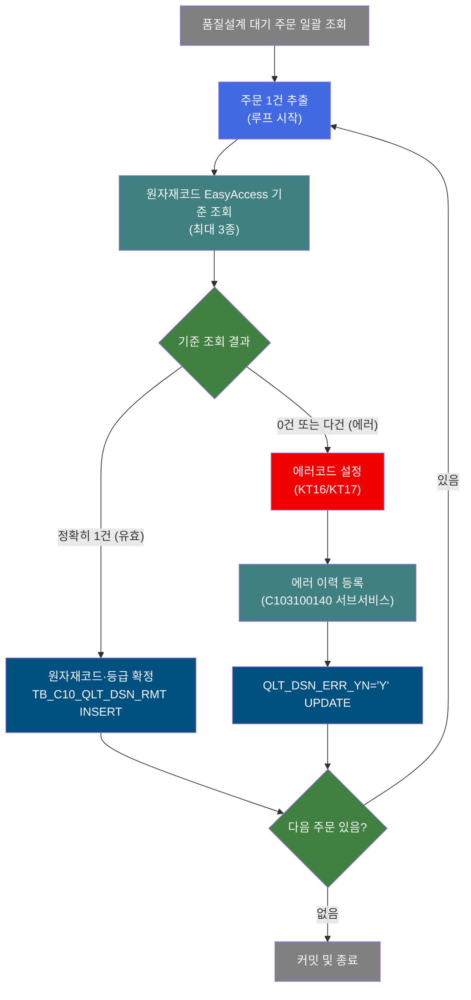
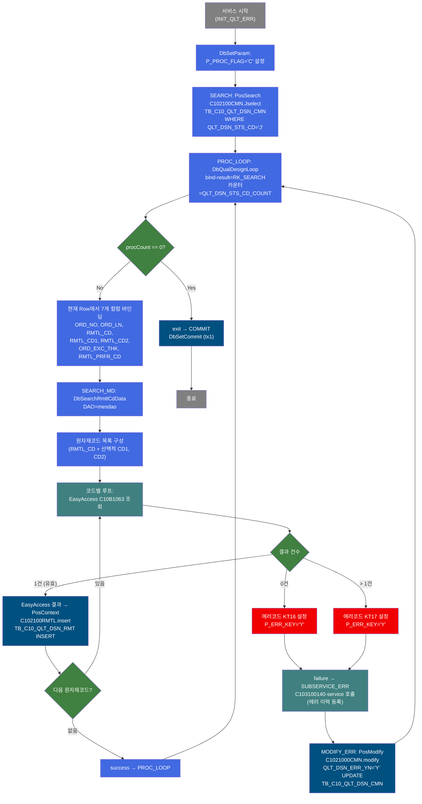
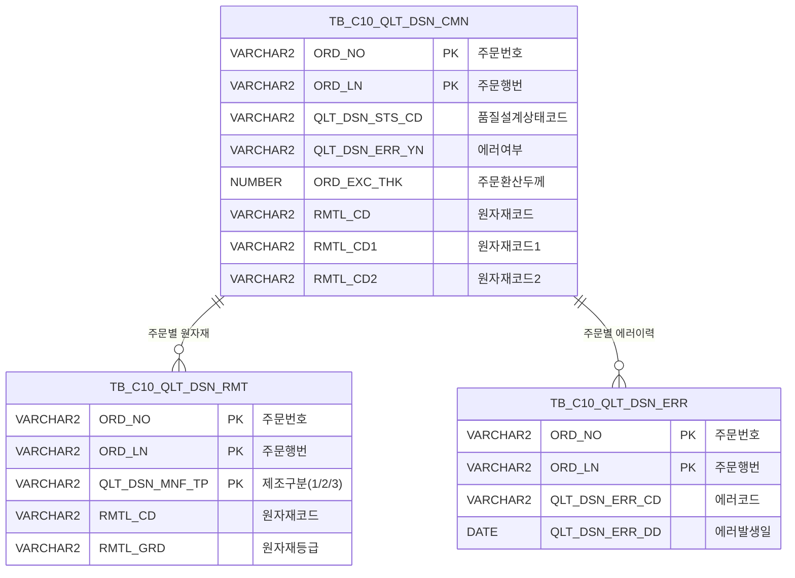

<h1 style="font-size: 40px; text-align: center; font-weight:
   bold; margin: 30px 0;">
  C103100010 레거시 시스템 분석 종합 보고서
</h1>


# 1. 시스템 개요
- **서비스 ID**: C103100010
- **업무명**: 품질설계 원자재코드 편성 배치
- **분석 일시**: 2026-03-16 15:35 KST
- **분석 시간**: 약 17분
- **전체 Activity 수**: 7개 (Custom 2, Built-in 3, Common 2)
- **분석자**: Claude Opus 4.6
- **분석 도구**: /analyze-service C103100010
- **문서 버전**: 1.0

# 📊 비즈니스 프로세스 분석

## 시스템 목적

C103100010 서비스는 품질설계 대기 상태(`QLT_DSN_STS_CD='J'`)인 주문을 일괄 조회하여, 각 주문의 원자재코드를 EasyAccess 마스터 기준(`C10B1063`)으로 검증하고 품질설계 원자재 테이블(`TB_C10_QLT_DSN_RMT`)에 저장하는 NUI(배치) 서비스이다.

서비스의 핵심 흐름은 루프 구조이다. 먼저 `PosSearch`가 대기 주문 전체를 조회한 후, `DbQualDesignLoop`가 1건씩 순회하면서 `DbSearchRmtlCdData`로 원자재코드를 편성한다. 한 주문에 최대 3종의 원자재코드(RMTL_CD/CD1/CD2)가 있을 수 있으며, 각각에 대해 EasyAccess 기준 조회 결과가 정확히 1건이어야 유효하다. 기준 불일치(0건=KT16, 다건=KT17) 시 에러 처리 서브서비스(`C103100140`)를 호출하여 에러 이력을 등록하고, 해당 주문의 `QLT_DSN_ERR_YN`을 `'Y'`로 갱신한다.

이 서비스는 품질설계 자동화 프로세스의 일부로, 주문 수신 후 품질설계 단계에서 원자재 편성을 자동으로 수행하여 수작업 없이 원자재코드·원자재등급을 확정하는 역할을 한다.

## 핵심 워크플로우 다이어그램



### 상세 워크플로우 다이어그램



## 주요 유즈케이스

### UC-01: 품질설계 원자재코드 자동 편성 (정상)

- **Actor**: NUI 배치 프로세스 (품질설계 스케줄러)
- **목적**: 품질설계 대기 주문의 원자재코드를 EasyAccess 마스터 기준으로 자동 검증·확정하여 원자재 테이블에 저장
- **전제조건**:
  - TB_C10_QLT_DSN_CMN에 QLT_DSN_STS_CD='J'(대기) 상태의 주문이 존재
  - 각 주문에 RMTL_CD(원자재코드)가 설정되어 있음
  - EasyAccess C10B1063 기준이 정상 등록되어 있음

- **주요 흐름**:
  1. INIT_QLT_ERR에서 P_PROC_FLAG='C' 설정
  2. SEARCH에서 C102100CMN.Jselect로 대기 주문 전체 조회 (TB_C10_QLT_DSN_CMN WHERE QLT_DSN_STS_CD='J')
  3. PROC_LOOP에서 1건씩 루프 진입, 7개 컬럼(ORD_NO, ORD_LN, RMTL_CD, RMTL_CD1, RMTL_CD2, ORD_EXC_THK, RMTL_PRFR_CD) 바인딩
  4. SEARCH_MD에서 원자재코드별 EasyAccess C10B1063 조회 (원자재코드 + 주문환산두께 입력)
  5. 조회 결과 1건 → 원자재코드·등급 확정 후 C102100RMTL.insert로 TB_C10_QLT_DSN_RMT INSERT
  6. 모든 원자재코드 처리 완료 → success → PROC_LOOP 복귀
  7. 전체 주문 처리 완료(procCount=0) → exit → COMMIT

- **대체 흐름**:
  - 대기 주문 없음 (0건 조회): PROC_LOOP에서 즉시 exit → COMMIT → 종료
  - 다중 원자재코드: RMTL_CD1, RMTL_CD2가 있으면 순차적으로 EasyAccess 조회 수행 (제조구분 1/2/3 자동 부여)

- **후행조건**:
  - TB_C10_QLT_DSN_RMT에 주문별 원자재코드·등급 레코드 저장
  - 트랜잭션 커밋 완료

### UC-02: 원자재 기준 미존재 에러 처리 (KT16)

- **Actor**: NUI 배치 프로세스
- **목적**: EasyAccess 기준에 등록되지 않은 원자재코드에 대해 에러를 기록하고 해당 주문에 에러 플래그를 설정
- **전제조건**:
  - 주문의 원자재코드가 EasyAccess C10B1063 기준에 미등록

- **주요 흐름**:
  1. SEARCH_MD에서 EasyAccess C10B1063 조회 결과 0건 또는 MasterDataException 발생
  2. 에러코드 KT16("원자재 기준 없음") 설정, P_ERR_KEY='Y'
  3. failure 반환 → SUBSERVICE_ERR → C103100140-service 호출
  4. C103100140에서 TB_C10_QLT_DSN_ERR에 에러 이력 INSERT (중복 체크 후)
  5. MODIFY_ERR에서 C1021000CMN.modify로 TB_C10_QLT_DSN_CMN의 QLT_DSN_ERR_YN='Y' UPDATE
  6. PROC_LOOP 복귀하여 다음 주문 계속 처리

- **대체 흐름**:
  - 동일 에러 이미 등록: C103100140에서 중복 감지 시 INSERT 생략 (정상 종료)

- **후행조건**:
  - TB_C10_QLT_DSN_ERR에 에러 이력 1건 추가 (또는 중복 시 변경 없음)
  - TB_C10_QLT_DSN_CMN.QLT_DSN_ERR_YN = 'Y' 갱신

### UC-03: 원자재 기준 중복 에러 처리 (KT17)

- **Actor**: NUI 배치 프로세스
- **목적**: EasyAccess 기준에 다건 매칭되는 원자재코드에 대해 에러를 기록
- **전제조건**:
  - 주문의 원자재코드 + 주문환산두께 조합으로 EasyAccess C10B1063 조회 시 2건 이상 반환

- **주요 흐름**:
  1. SEARCH_MD에서 EasyAccess C10B1063 조회 결과 > 1건
  2. 에러코드 KT17("원자재 기준 중복") 설정, P_ERR_KEY='Y'
  3. failure 반환 → SUBSERVICE_ERR → C103100140 호출 → 에러 이력 등록
  4. MODIFY_ERR에서 QLT_DSN_ERR_YN='Y' UPDATE
  5. PROC_LOOP 복귀

- **대체 흐름**: 없음

- **후행조건**:
  - 에러 이력 등록, 주문 에러 플래그 설정
  - 해당 주문의 원자재코드는 TB_C10_QLT_DSN_RMT에 미저장

### UC-04: INSERT 실패 에러 처리 (TB05)

- **Actor**: NUI 배치 프로세스
- **목적**: 원자재코드 저장 시 DB INSERT 예외 발생에 대한 에러 처리
- **전제조건**:
  - EasyAccess 조회는 정상(1건)이나 TB_C10_QLT_DSN_RMT INSERT 시 예외 발생

- **주요 흐름**:
  1. SEARCH_MD에서 EasyAccess 조회 성공 후 C102100RMTL.insert 실행 중 예외 발생
  2. 에러코드 TB05 설정, P_ERR_KEY='Y'
  3. failure 반환 → 에러 이력 등록 → QLT_DSN_ERR_YN='Y' UPDATE

- **대체 흐름**: 없음

- **후행조건**:
  - 에러 이력 등록, 해당 원자재코드 미저장

---

## 비즈니스 로직 상세

### 1. 원자재코드 편성 로직 (DbSearchRmtlCdData)

- **목적**: 주문의 원자재코드를 EasyAccess 마스터 기준으로 검증하고, 유효한 원자재코드·등급을 DB에 저장

- **처리 케이스**:

  **[케이스 1: 단일 원자재코드 (RMTL_CD만 존재)]**
  ```
  조건: RMTL_CD ≠ 공백, RMTL_CD1 = 공백, RMTL_CD2 = 공백
  처리:
    1. 원자재코드 목록 = [RMTL_CD] (1건)
    2. nidx=0: EasyAccess C10B1063(RMTL_CD, ORD_EXC_THK) 조회
    3. 결과 1건 → QLT_DSN_MNF_TP=1, RMTL_GRD=결과값 → TB_C10_QLT_DSN_RMT INSERT
    4. success 반환
  ```

  **[케이스 2: 다중 원자재코드 (RMTL_CD + CD1 + CD2)]**
  ```
  조건: RMTL_CD, RMTL_CD1, RMTL_CD2 모두 비공백
  처리:
    1. 원자재코드 목록 = [RMTL_CD, RMTL_CD1, RMTL_CD2] (3건)
    2. nidx=0: C10B1063(RMTL_CD) → QLT_DSN_MNF_TP=1 → INSERT
    3. nidx=1: C10B1063(RMTL_CD1) → QLT_DSN_MNF_TP=2 → INSERT
    4. nidx=2: C10B1063(RMTL_CD2) → QLT_DSN_MNF_TP=3 → INSERT
    5. 모든 코드 성공 시 success 반환
    (루프 중 하나라도 실패하면 즉시 failure)
  ```

  **[케이스 3: 기준 미존재 에러]**
  ```
  조건: EasyAccess C10B1063 조회 결과 0건 또는 MasterDataException 발생
  처리:
    1. QLT_DSN_ERR_CD = "KT16" 설정
    2. P_ERR_KEY = "Y" 설정
    3. failure 반환 → 에러 처리 체인 진입
  ```

  **[케이스 4: 기준 중복 에러]**
  ```
  조건: EasyAccess C10B1063 조회 결과 > 1건
  처리:
    1. QLT_DSN_ERR_CD = "KT17" 설정
    2. P_ERR_KEY = "Y" 설정
    3. failure 반환 → 에러 처리 체인 진입
  ```

- **예외 처리**:
  - EasyAccess MasterDataException: KT16 에러로 처리 (기준 데이터 없음으로 간주)
  - dao.insert() 예외: TB05 에러코드 설정, failure 반환
  - 어떤 원자재코드에서든 에러 발생 시 해당 주문의 전체 원자재 편성 중단

### 2. 루프 제어 로직 (DbQualDesignLoop)

- **목적**: 조회된 주문 목록을 1건씩 순차 처리하기 위한 범용 루프 컨트롤러

- **처리 케이스**:

  **[케이스 1: 최초 진입]**
  ```
  조건: ctx에 QLT_DSN_STS_CD_COUNT 변수 없음 (null)
  처리:
    1. procCount = bindSet.count() (전체 건수로 초기화)
    2. procCount -= 1
    3. this_row = total_row - procCount (순방향 인덱스 계산)
    4. 해당 Row의 7개 컬럼 바인딩 → success 반환
  ```

  **[케이스 2: 루프 진행]**
  ```
  조건: procCount > 0
  처리:
    1. P_ERR_KEY = "N", QLT_DSN_ERR_YN = "" 재초기화
    2. procCount -= 1
    3. this_row 계산, Row 탐색, 컬럼 바인딩
    4. success 반환
  ```

  **[케이스 3: 루프 종료]**
  ```
  조건: procCount == 0
  처리:
    1. ctx에서 QLT_DSN_STS_CD_COUNT 변수 제거
    2. "exit" 반환 → COMMIT Activity로 전이
  ```

### 3. 에러 플래그 갱신 로직 (MODIFY_ERR)

- **목적**: 원자재 편성 실패 주문에 대해 에러 여부 플래그를 갱신
- **처리 케이스**:

  **[케이스 1: QLT_DSN_ERR_YN 갱신]**
  ```
  조건: 원자재 편성 실패 (P_ERR_KEY='Y')
  처리:
    1. SUBSERVICE_ERR(C103100140)에서 에러 이력 등록 완료 후
    2. C1021000CMN.modify 실행
    3. TB_C10_QLT_DSN_CMN SET QLT_DSN_ERR_YN='Y'
       WHERE ORD_NO=? AND ORD_LN=?
    4. 감사 컬럼(LAST_UPDATED_*) 동시 갱신
  ```

---

# ⚙️ Java 컴포넌트 분석

## Custom Activity 상세 분석

### 2개 Custom Activity 발견

### 1. DbSearchRmtlCdData (SEARCH_MD)
- **클래스명**: `com.unionsteel.mes.c10.activity.nui.DbSearchRmtlCdData`
- **액티비티명**: `SEARCH_MD`
- **파일 경로**: `src/com/unionsteel/mes/c10/activity/nui/DbSearchRmtlCdData.java`
- **주요 기능**: 원자재코드 기준 마스터(EasyAccess C10B1063) 조회 및 품질설계 원자재 데이터 편성·저장
- **라인 수**: 183 | **메소드 수**: 1

> 품질설계 프로세스에서 주문의 원자재코드(최대 3개: RMTL_CD, RMTL_CD1, RMTL_CD2)에 대해 EasyAccess 마스터 기준(C10B1063)을 조회하여 원자재코드·원자재등급을 확정하고, 품질설계 원자재 테이블(`TB_C10_QLT_DSN_RMT`)에 저장한다. 기준 조회 결과가 정확히 1건이어야 유효하며, 0건=KT16, 다건=KT17 에러로 처리한다.

📎 **[상세 분석 보고서](../customClass/com.unionsteel.mes.c10.activity.nui.DbSearchRmtlCdData_class_analysis.md)**

---

### 2. DbQualDesignLoop (PROC_LOOP)
- **클래스명**: `com.unionsteel.mes.c10.activity.nui.DbQualDesignLoop`
- **액티비티명**: `PROC_LOOP`
- **파일 경로**: `src/com/unionsteel/mes/c10/activity/nui/DbQualDesignLoop.java`
- **주요 기능**: 이전 액티비티가 조회한 ResultSet을 1건씩 순회 처리하기 위한 범용 루프 제어
- **라인 수**: 171 | **메소드 수**: 1

> GLUE Framework 기반 NUI 서비스에서 PosRowSet을 1건씩 순회하는 루프 제어 액티비티이다. 역방향 카운터 기반 순방향 인덱싱(`this_row = total_row - procCount`)으로 Row를 탐색하고, `param0..N` 프로퍼티로 지정된 컬럼값을 PosContext에 바인딩한다. 40개 이상의 서비스에서 공유 사용되는 핵심 공통 컴포넌트이다.

📎 **[상세 분석 보고서](../customClass/com.unionsteel.mes.c10.activity.nui.DbQualDesignLoop_class_analysis.md)**

---

# 💾 데이터 요구사항

## 핵심 테이블

### 1. TB_C10_QLT_DSN_CMN - 품질설계 공통 (메인 테이블)

| 컬럼명 | 타입 | PK | 설명 |
|--------|------|----|-----|
| ORD_NO | VARCHAR2 | ✅ | 주문번호 |
| ORD_LN | VARCHAR2 | ✅ | 주문행번 |
| QLT_DSN_STS_CD | VARCHAR2 | | 품질설계상태코드 ('J'=대기) |
| PLNT_TP | VARCHAR2 | | 공장구분 |
| PRD_NM_CD | VARCHAR2 | | 품명코드 |
| PRD_SHP | VARCHAR2 | | 제품형상 |
| FLOW_CHL | VARCHAR2 | | 유통경로 |
| ORD_KND | VARCHAR2 | | 주문종류 |
| ORD_PRD_GRD | VARCHAR2 | | 주문제품등급 |
| ORD_USG_CD | VARCHAR2 | | 주문용도코드 |
| CUS_CD | VARCHAR2 | | 고객코드 |
| ACT_CUS_CD | VARCHAR2 | | 실고객코드 |
| FNL_CUS_CD | VARCHAR2 | | 최종고객코드 |
| CUS_BTH_PAP_NO | VARCHAR2 | | 고객출강단위번호 |
| SPC_OFC | VARCHAR2 | | 규격기관 |
| SPC_AVR | VARCHAR2 | | 규격약어 |
| SPC_YR | VARCHAR2 | | 규격연도 |
| SPC_NM | VARCHAR2 | | 규격명 |
| SPC_FUL_NM | VARCHAR2 | | 규격전체명 |
| ORD_SZ | VARCHAR2 | | 주문사이즈 |
| ORD_EXC_THK | NUMBER | | 주문환산두께 |
| ORD_EXC_WTH | NUMBER | | 주문환산폭 |
| ORD_EXC_LTH | NUMBER | | 주문환산길이 |
| CUS_REQ_DLV_DD | VARCHAR2 | | 고객요구납기일 |
| ORD_SCH_DLV_DD | VARCHAR2 | | 주문예정납기일 |
| QLT_DSN_ERR_YN | VARCHAR2 | | 품질설계에러여부 ('Y'/'N') |
| LAST_UPDATED_OBJECT_TYPE | VARCHAR2 | | 최종변경OBJECT유형 |
| LAST_UPDATED_OBJECT_ID | VARCHAR2 | | 최종변경OBJECTID |
| LAST_UPDATE_PROGRAM_ID | VARCHAR2 | | 최종변경프로그램ID |
| LAST_UPDATE_TIMESTAMP | DATE | | 최종변경일시 |

### 2. TB_C10_QLT_DSN_RMT - 품질설계 원자재 (INSERT 대상)

| 컬럼명 | 타입 | PK | 설명 |
|--------|------|----|-----|
| ORD_NO | VARCHAR2 | ✅ | 주문번호 |
| ORD_LN | VARCHAR2 | ✅ | 주문행번 |
| QLT_DSN_MNF_TP | VARCHAR2 | ✅ | 품질설계제조구분 (1/2/3) |
| RMTL_CD | VARCHAR2 | | 원자재코드 |
| RMTL_GRD | VARCHAR2 | | 원자재등급 (EasyAccess 결과) |
| CREATED_OBJECT_TYPE | VARCHAR2 | | 생성OBJECT유형 |
| CREATED_OBJECT_ID | VARCHAR2 | | 생성OBJECTID |
| CREATED_PROGRAM_ID | VARCHAR2 | | 생성프로그램ID |
| CREATION_TIMESTAMP | DATE | | 생성일시 |
| LAST_UPDATED_OBJECT_TYPE | VARCHAR2 | | 최종변경OBJECT유형 |
| LAST_UPDATED_OBJECT_ID | VARCHAR2 | | 최종변경OBJECTID |
| LAST_UPDATE_PROGRAM_ID | VARCHAR2 | | 최종변경프로그램ID |
| LAST_UPDATE_TIMESTAMP | DATE | | 최종변경일시 |

### 3. TB_C10_QLT_DSN_ERR - 품질설계 에러 이력 (서브서비스 C103100140에서 사용)

| 컬럼명 | 타입 | PK | 설명 |
|--------|------|----|-----|
| ORD_NO | VARCHAR2 | ✅ | 주문번호 |
| ORD_LN | VARCHAR2 | ✅ | 주문행번 |
| QLT_DSN_ERR_CD | VARCHAR2 | | 품질설계에러코드 (KT16/KT17 등) |
| QLT_DSN_ERR_DD | DATE | | 에러발생일 (SYSDATE) |
| CREATED_OBJECT_TYPE | VARCHAR2 | | 생성OBJECT유형 |
| CREATED_OBJECT_ID | VARCHAR2 | | 생성OBJECTID |
| CREATED_PROGRAM_ID | VARCHAR2 | | 생성프로그램ID |
| CREATION_TIMESTAMP | DATE | | 생성일시 |
| LAST_UPDATED_OBJECT_TYPE | VARCHAR2 | | 최종변경OBJECT유형 |
| LAST_UPDATED_OBJECT_ID | VARCHAR2 | | 최종변경OBJECTID |
| LAST_UPDATE_PROGRAM_ID | VARCHAR2 | | 최종변경프로그램ID |
| LAST_UPDATE_TIMESTAMP | DATE | | 최종변경일시 |

## 데이터 플로우

### 1. 대기 주문 조회

```
배치 서비스 시작
→ C102100CMN.Jselect
  SELECT * FROM TB_C10_QLT_DSN_CMN
  WHERE QLT_DSN_STS_CD = 'J'
→ RK_SEARCH에 전체 대기 주문 ResultSet 저장
→ DbQualDesignLoop에서 1건씩 순회 처리
```

### 2. 원자재코드 편성 (정상)

```
PROC_LOOP에서 현재 Row 바인딩 (ORD_NO, ORD_LN, RMTL_CD, RMTL_CD1, RMTL_CD2, ORD_EXC_THK, RMTL_PRFR_CD)
→ DbSearchRmtlCdData에서 원자재코드별 루프
  → EasyAccess C10B1063 조회 (입력: 원자재코드, 주문환산두께)
  → 결과 1건 → PosContext에 원자재등급 등 반영
→ C102100RMTL.insert
  INSERT INTO TB_C10_QLT_DSN_RMT
    (ORD_NO, ORD_LN, QLT_DSN_MNF_TP, RMTL_CD, RMTL_GRD, 감사컬럼 8종)
  VALUES (?, ?, ?, ?, ?, ?, ?, ?, ?, ?, ?, ?, ?)
→ TB_C10_QLT_DSN_RMT에 원자재 레코드 저장
```

### 3. 에러 처리 (원자재 기준 불일치)

```
DbSearchRmtlCdData에서 EasyAccess 결과 0건(KT16) 또는 다건(KT17)
→ P_ERR_KEY='Y', QLT_DSN_ERR_CD 설정
→ failure → SUBSERVICE_ERR
  → C103100140-service 호출
    → DbSearchCmnErrorCheck: TB_C10_QLT_DSN_ERR 중복 체크
    → 중복 없음: PosInsert → TB_C10_QLT_DSN_ERR INSERT
→ MODIFY_ERR
  → C1021000CMN.modify
    UPDATE TB_C10_QLT_DSN_CMN
    SET QLT_DSN_ERR_YN = 'Y',
        LAST_UPDATED_OBJECT_TYPE = ?,
        LAST_UPDATED_OBJECT_ID = ?,
        LAST_UPDATE_PROGRAM_ID = ?,
        LAST_UPDATE_TIMESTAMP = ?
    WHERE ORD_NO = ? AND ORD_LN = ?
→ PROC_LOOP 복귀 (다음 주문 처리)
```

## SQL 일람표

| SQL 이름 | 쿼리 ID | 타입 | 출처 | 테이블 |
|---------|---------|-----|------|--------|
| 대기 주문 조회 | C102100CMN.Jselect | SELECT | Service (SEARCH Activity) | TB_C10_QLT_DSN_CMN |
| 에러여부 갱신 | C1021000CMN.modify | UPDATE | Service (MODIFY_ERR Activity) | TB_C10_QLT_DSN_CMN |
| 원자재코드 저장 | C102100RMTL.insert | INSERT | com.unionsteel.mes.c10.activity.nui.DbSearchRmtlCdData | TB_C10_QLT_DSN_RMT |

## ER 다이어그램 (핵심 관계)



관계 설명:
- TB_C10_QLT_DSN_CMN이 중심 테이블로 품질설계 주문 정보를 관리
- TB_C10_QLT_DSN_RMT는 주문당 최대 3건의 원자재코드 결과를 저장 (1:N, 키=ORD_NO+ORD_LN)
- TB_C10_QLT_DSN_ERR는 주문별 에러 이력을 관리 (1:N, 키=ORD_NO+ORD_LN)

---

# 🔗 서브서비스

## 서브서비스 요약

| 서비스 ID | 설명 | 호출 액티비티 | 트랜잭션 | 상세 분석 |
|-----------|------|-------------|---------|----------|
| C103100140 | 품질설계 에러 이력 등록 (중복 방지) | SUBSERVICE_ERR | 기존 트랜잭션 공유 | [상세 분석](./C103100140_legacy_analysis.md) |

### C103100140 - 품질설계결과 에러 등록
품질설계 과정에서 발생한 에러 정보를 `TB_C10_QLT_DSN_ERR` 테이블에 등록하는 NUI 서비스. `DbSearchCmnErrorCheck`가 3개 복합키(ORD_NO, ORD_LN, QLT_DSN_ERR_CD)로 중복 여부를 먼저 확인한 뒤, 중복이 없을 때만 `PosInsert`로 에러 레코드를 INSERT한다. Activity 2개, SQL 1개로 구성된 단순 구조.

---

# 📌 특이사항 및 주의사항

## 1. 루프 구조의 O(n²) 성능 특성

- **DbQualDesignLoop**: 매 루프마다 `bindSet.reset()` 후 while 전체 순회로 해당 Row를 탐색하는 구조. 100건 처리 시 최대 5,050회 탐색이 발생한다. 대기 주문이 대량으로 적체될 경우 배치 처리 시간이 급격히 증가할 수 있다.

## 2. EasyAccess 마스터 기준 의존성 (C10B1063)

- 원자재코드 편성이 전적으로 EasyAccess C10B1063 기준에 의존한다. 기준 데이터가 미등록이거나 중복 등록되면 해당 주문의 원자재 편성이 실패하며, 수동 기준 등록 후 배치 재실행이 필요하다.
- `MasterDataException` 발생 시 result2가 null로 처리되어 KT16 에러로 간주되므로, 실제 원인(기준 미등록 vs 조회 오류)을 구분할 수 없다.

## 3. 쿼리 파일 교차 참조

- **C102100CMN.Jselect**: `C102100CMN-query.glue_sql` 파일에 정의 (서비스 ID C103100010과 다른 쿼리 파일)
- **C1021000CMN.modify**: 동일 `C102100CMN-query.glue_sql` 파일에 정의되나 쿼리 ID 접두사(C1021000CMN)가 다름
- **C102100RMTL.insert**: `C102100RMTL-query.glue_sql` 파일에 정의 (Java 코드에서 직접 참조)
- 품질설계 관련 서비스들(C102100*, C103100*)이 쿼리 파일을 교차 공유하는 구조로, 쿼리 변경 시 영향 범위 파악에 주의 필요

## 4. 에러 시 루프 계속 진행 설계

- 한 주문에서 원자재 편성 에러가 발생해도 에러 이력 등록 + QLT_DSN_ERR_YN='Y' 갱신 후 PROC_LOOP로 복귀하여 **다음 주문 처리를 계속**한다. 전체 배치가 중단되지 않으므로 일부 에러가 있어도 나머지 주문은 정상 처리된다.
- 단, COMMIT Activity에 `checkId="P_ERR_KEY"` 설정이 있어 마지막 주문의 에러 상태가 커밋 동작에 영향을 줄 수 있다.

## 5. RMTL_CD3 미처리

- `C10NuiConstantsIF`에 RMTL_CD3 상수가 정의되어 있으나, DbSearchRmtlCdData에서는 RMTL_CD, RMTL_CD1, RMTL_CD2만 처리한다. 4번째 원자재코드는 이 서비스에서 편성되지 않는다.

## 6. PosValueParameter 순서 의존성

- DbSearchRmtlCdData에서 `PosValueParameter` (isNamed="false") 방식을 사용하므로, 파라미터 순서가 SQL의 `?` 순서와 정확히 일치해야 한다. SQL 변경 시 Java 코드의 파라미터 순서도 함께 수정 필요.

---

# 📚 참고 문서

- **Service XML**: `src/service/C103100010-service.xml`
- **Query SQL**:
  - `src/query/C102100CMN-query.glue_sql` (C102100CMN.Jselect, C1021000CMN.modify)
  - `src/query/C102100RMTL-query.glue_sql` (C102100RMTL.insert)
- **Custom Java 클래스**:
  - `src/com/unionsteel/mes/c10/activity/nui/DbSearchRmtlCdData.java`
  - `src/com/unionsteel/mes/c10/activity/nui/DbQualDesignLoop.java`
- **Common Java 클래스**:
  - `src/com/unionsteel/mes/c10/activity/common/DbSetCommit.java`
  - `src/com/unionsteel/mes/c10/activity/common/DbSetParam.java`
- **서브서비스**: [C103100140 분석 보고서](./C103100140_legacy_analysis.md)
- **상수 파일**: `src/com/unionsteel/mes/c10/activity/common/constants/C10NuiConstantsIF.java`
