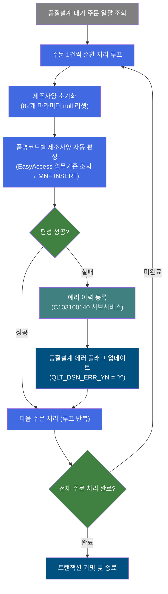
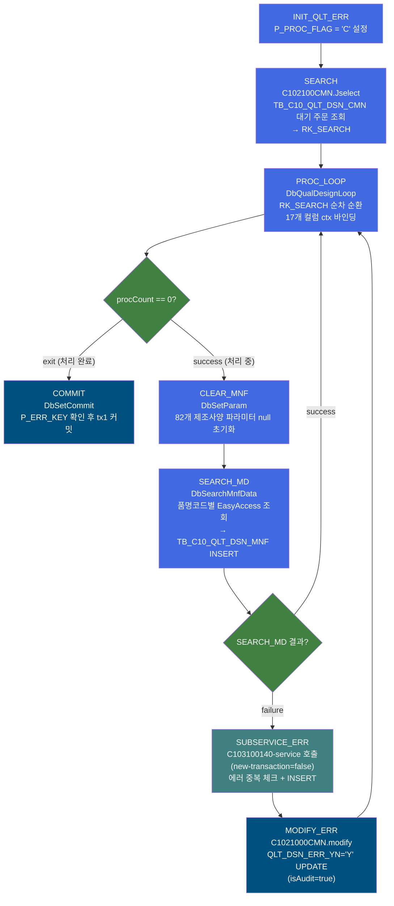
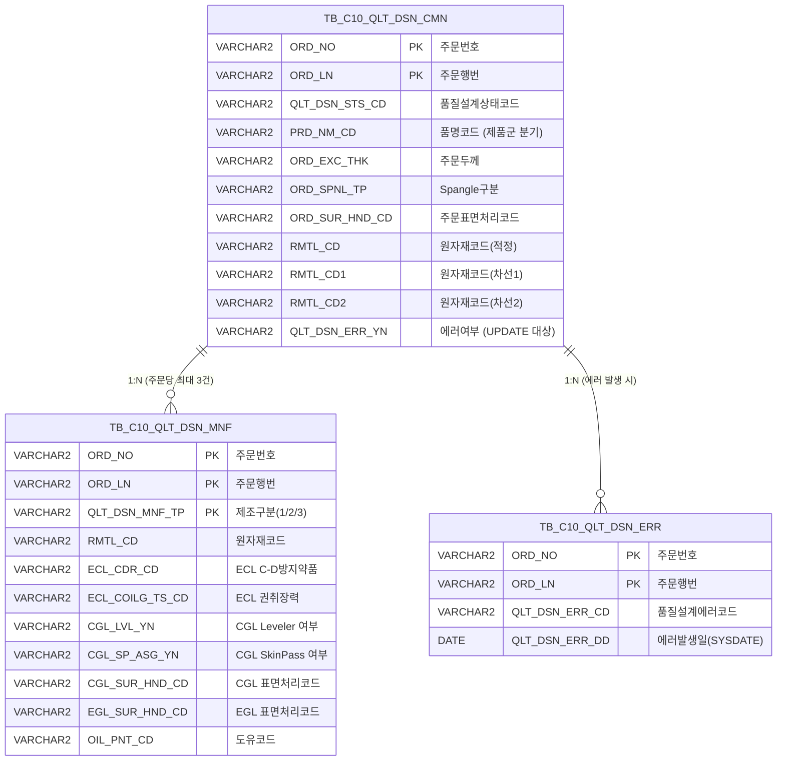

<h1 style="font-size: 40px; text-align: center; font-weight:
   bold; margin: 30px 0;">
  C103100020 레거시 시스템 분석 종합 보고서
</h1>


# 1. 시스템 개요
- **서비스 ID**: C103100020
- **업무명**: 품질설계 제조사양 자동 편성 (냉연/도금 강판)
- **분석 일시**: 2026-03-16 KST
- **분석 시간**: 약 5분
- **전체 Activity 수**: 7개 (Custom 2, Built-in 2, Common 3)
- **분석자**: Claude Sonnet 4.6
- **분석 도구**: /analyze-service C103100020
- **문서 버전**: 1.0

# 📊 비즈니스 프로세스 분석

## 시스템 목적

C103100020 서비스는 냉연/도금 강판 제품의 **품질설계 결과를 바탕으로 제조사양(MNF: Manufacturing Specification)을 자동 편성하고 DB에 등록**하는 NUI(배치) 서비스이다. 사용자 조작 없이 배치 처리로 실행되며, 품질설계 대기 상태(QLT_DSN_STS_CD)인 주문 목록을 일괄 처리한다.

처리 대상 주문별로 품명코드(PRD_NM_CD)에 따라 ECL 계열(냉연/전기도금: CR, EGI, ZnNi, CCI, CCEI, CCNI)과 CGL 계열(용융도금: GI, G/A, Hot GI, G/L, GIX, GLX 등)로 분류하고, 각 제품군에 적합한 EasyAccess 업무기준(ECL C-D 방지약품, ECL 권취장력, CGL Leveler 설정, CGL SkinPass 여부, 정전공정 방청유 등)을 조회하여 최대 3개의 원자재(적정/차선1/차선2)별 제조사양 레코드를 `TB_C10_QLT_DSN_MNF`에 INSERT한다.

제조사양 편성 중 오류가 발생하면 서브서비스(C103100140)를 통해 품질설계 에러 정보를 `TB_C10_QLT_DSN_ERR`에 등록하고, `TB_C10_QLT_DSN_CMN`의 `QLT_DSN_ERR_YN` 컬럼을 'Y'로 업데이트하여 에러 주문을 명확히 식별한다. 모든 처리가 완료되면 `DbSetCommit`이 오류 여부를 확인한 후 트랜잭션을 커밋한다.

## 핵심 워크플로우 다이어그램



### 상세 워크플로우 다이어그램



## 주요 유즈케이스

### UC-01: 품질설계 대기 주문 제조사양 일괄 편성

- **Actor**: NUI 배치 프로세스 (스케줄러 또는 수동 트리거)
- **목적**: TB_C10_QLT_DSN_CMN의 품질설계 대기 주문 전체에 대해 제품군별 제조사양을 자동 편성하여 TB_C10_QLT_DSN_MNF에 등록
- **전제조건**:
  - TB_C10_QLT_DSN_CMN에 처리 대상 대기 주문이 존재함
  - EasyAccess 업무기준(C10B2130, C10B2140, C10B2150, C10B2170)이 정상 설정되어 있음
  - masterdao (M00APUSER)가 정상 연결되어 있음
  - mesdao (MESAPUSER)가 정상 연결되어 있음

- **주요 흐름**:
  1. INIT_QLT_ERR - `P_PROC_FLAG = 'C'` 초기화 설정
  2. SEARCH - `C102100CMN.Jselect` 쿼리로 TB_C10_QLT_DSN_CMN에서 처리 대상 주문 목록 전체 조회 (결과 → RK_SEARCH)
  3. PROC_LOOP(DbQualDesignLoop) - RK_SEARCH를 1건씩 순환, 17개 컬럼(ORD_NO, ORD_LN, PRD_NM_CD, ORD_EXC_THK, RMTL_CD 등)을 ctx에 바인딩
  4. CLEAR_MNF - 82개 제조사양 파라미터를 null로 초기화 (전 처리 주문의 값 잔류 방지)
  5. SEARCH_MD(DbSearchMnfData) - 품명코드 기반으로 EasyAccess 업무기준 조회 후 TB_C10_QLT_DSN_MNF에 INSERT
  6. 모든 주문 처리 후 COMMIT - P_ERR_KEY 확인 후 tx1 커밋

- **대체 흐름**:
  - 조회 결과 0건: PROC_LOOP에서 즉시 exit 전이 → COMMIT으로 이동 (정상 종료)
  - EasyAccess 기준 없음(KK58 등): SEARCH_MD에서 failure 반환 → 에러 등록 흐름 진입

- **후행조건**:
  - 처리된 주문별 제조사양 레코드가 TB_C10_QLT_DSN_MNF에 삽입됨 (주문당 최대 3건)
  - tx1 트랜잭션 커밋 완료

### UC-02: 냉연/전기도금 계열 제조사양 편성

- **Actor**: DbSearchMnfData 액티비티 (SEARCH_MD)
- **목적**: 품명코드가 ECL 계열(C, E, N, 1, 2, 8)인 주문에 대해 ECL 공정 파라미터(C-D 방지약품, 권취장력 등)를 EasyAccess에서 조회하여 제조사양 편성
- **전제조건**:
  - PROC_LOOP에서 PRD_NM_CD, ORD_EXC_THK, ORD_SUR_HND_CD, RMTL_CD 등이 ctx에 설정되어 있음
  - masterdao를 통해 M00APUSER 접근 가능
  - 업무기준 C10B2130(ECL C-D 방지약품), C10B2140(ECL 권취장력) 설정됨

- **주요 흐름**:
  1. PRD_NM_CD가 'C', 'E', 'N', '1', '2', '8' 중 하나인지 확인 (ECL 계열 판별)
  2. [C10B2130] ECL C-D 방지약품 조회 - 조건: ORD_EXC_THK(주문두께) → ECL_CDR_CD 결정
  3. [C10B2140] ECL 권취장력 조회 - 조건: PRD_NM_CD(품명코드) → ECL_COILG_TS_CD 결정
  4. 품명코드 'E'(EGI) 또는 'N'(ZnNi)인 경우 → EGL_SUR_HND_CD = ORD_SUR_HND_CD 설정
  5. 품명코드 'C' 또는 '1'(CR, CCI)인 경우 → [C10B2170] 정전공정 방청유 조회 → OIL_PNT_CD 결정
  6. `C102100MNF.insert`로 TB_C10_QLT_DSN_MNF에 INSERT (QLT_DSN_MNF_TP = 1, 2, 3)

- **대체 흐름**:
  - EasyAccess 조회 0건: 에러코드 KK58(약품)/KK54(권취장력)/KK68(방청유) 설정 후 FAILURE
  - EasyAccess 조회 2건 이상: 에러코드 KK59/KK55/KK69 설정 후 FAILURE

- **후행조건**:
  - TB_C10_QLT_DSN_MNF에 ECL 사양 레코드 삽입됨 (원자재 수만큼 최대 3건)

### UC-03: 용융도금 계열 제조사양 편성 (CGL SkinPass 포함)

- **Actor**: DbSearchMnfData 액티비티 (SEARCH_MD)
- **목적**: 품명코드가 CGL 계열(G, J, K, L, V, W, 3, 4, 6, 9)인 주문에 대해 CGL 공정 파라미터(Leveler 설정, SkinPass 여부, 표면처리코드 등)를 편성하여 제조사양 등록
- **전제조건**:
  - PROC_LOOP에서 PRD_NM_CD, ORD_SPNL_TP(Spangle구분), ORD_SUR_HND_CD 등이 ctx에 설정되어 있음
  - 업무기준 C10B2150(CGL Leveler Set 기준) 설정됨

- **주요 흐름**:
  1. PRD_NM_CD가 ECL 계열 외 나머지 (G, J, K, L, V, W, 3, 4, 6, 9 등 CGL 계열) 확인
  2. [C10B2150] CGL Leveler Set 기준 조회 - 조건: PRD_NM_CD → CGL_LVL_YN 결정
  3. SPNL_TP = ORD_SPNL_TP (Spangle 구분 설정)
  4. SkinPass 여부 결정: ORD_SPNL_TP IN ('4', '5', '7') → CGL_SP_ASG_YN = 'Y', 그 외 → 'N'
  5. CGL_SUR_HND_CD = ORD_SUR_HND_CD 설정
  6. `C102100MNF.insert`로 TB_C10_QLT_DSN_MNF에 INSERT

- **대체 흐름**:
  - CGL Leveler 기준 없음: 에러코드 KK56 설정 후 FAILURE
  - CGL Leveler 기준 중복: 에러코드 KK57 설정 후 FAILURE

- **후행조건**:
  - TB_C10_QLT_DSN_MNF에 CGL 사양 레코드 삽입됨 (CGL_LVL_YN, CGL_SP_ASG_YN, CGL_SUR_HND_CD 포함)

### UC-04: 제조사양 편성 오류 이력 등록

- **Actor**: SUBSERVICE_ERR + MODIFY_ERR (오류 발생 시 실행)
- **목적**: SEARCH_MD(DbSearchMnfData) 실패 시 품질설계 에러를 이력 테이블에 기록하고 주문의 에러 플래그를 업데이트하여 오류 주문 추적 가능하게 처리
- **전제조건**:
  - DbSearchMnfData의 runActivity()에서 FAILURE 반환됨
  - ctx에 QLT_DSN_ERR_CD, ORD_NO, ORD_LN이 설정됨

- **주요 흐름**:
  1. SUBSERVICE_ERR - C103100140-service 호출 (new-transaction=false, 동일 트랜잭션 공유)
  2. C103100140 내부: TB_C10_QLT_DSN_ERR 중복 체크 후 신규인 경우만 INSERT
  3. MODIFY_ERR - `C1021000CMN.modify`로 TB_C10_QLT_DSN_CMN.QLT_DSN_ERR_YN = 'Y' UPDATE
  4. PROC_LOOP으로 복귀하여 다음 주문 처리 계속

- **대체 흐름**:
  - 동일 에러 이미 등록됨: C103100140이 FAILURE 반환 → INSERT 없이 종료 (중복 방지)

- **후행조건**:
  - TB_C10_QLT_DSN_ERR에 에러 이력 1건 등록 (중복 아닌 경우)
  - TB_C10_QLT_DSN_CMN.QLT_DSN_ERR_YN = 'Y' 업데이트
  - 에러 발생에도 배치 처리는 계속됨 (다음 주문으로 진행)

### UC-05: 원자재 다중(최대 3개) 제조사양 처리

- **Actor**: DbSearchMnfData 액티비티
- **목적**: 하나의 주문에 적정/차선1/차선2 3가지 원자재 배정 시 각각 독립 제조사양 레코드 생성
- **전제조건**:
  - PROC_LOOP에서 RMTL_CD, RMTL_CD1, RMTL_CD2 및 CRM_MNF_STD_NO, CRM_MNF_STD_NO1, CRM_MNF_STD_NO2 바인딩됨

- **주요 흐름**:
  1. RMTL_CD(적정 원자재)로 1번 처리 → QLT_DSN_MNF_TP = 1로 INSERT
  2. RMTL_CD1(차선1 원자재) 존재 시 2번 처리 → QLT_DSN_MNF_TP = 2로 INSERT
  3. RMTL_CD2(차선2 원자재) 존재 시 3번 처리 → QLT_DSN_MNF_TP = 3으로 INSERT
  4. 각 원자재별 EasyAccess 조회 독립 수행 (CRM_MNF_STD_NO1, CRM_MNF_STD_NO2 각각 사용)

- **대체 흐름**:
  - 차선 원자재 미존재: null 체크 후 해당 반복 건너뜀

- **후행조건**:
  - TB_C10_QLT_DSN_MNF에 원자재 수만큼 레코드 생성 (1~3건)

---
## 비즈니스 로직 상세

### 1. 루프 기반 배치 처리 패턴 (DbQualDesignLoop)

- **목적**: PosSearch로 조회한 주문 목록(PosRowSet)을 1건씩 순차 처리하기 위한 루프 제어
- **처리 케이스**:

  **[케이스 1: 루프 최초 진입]**
  ```
  조건: ctx에 QLT_DSN_STS_CD_COUNT 변수 없음
  처리:
    1. P_ERR_KEY = "N", BATCH_JOB = "true" ctx 설정
    2. RK_SEARCH PosRowSet의 전체 건수(total_row) 취득
    3. procCount = total_row (전체 건수로 카운터 초기화)
    4. this_row = total_row - procCount + 1 (= 1번째 Row)
    5. 1번째 Row의 17개 컬럼값을 ctx에 바인딩
    6. ctx에 QLT_DSN_STS_CD_COUNT = procCount - 1 저장 후 success 반환
  ```

  **[케이스 2: 루프 반복 처리 중]**
  ```
  조건: ctx에 QLT_DSN_STS_CD_COUNT 값이 존재함
  처리:
    1. P_ERR_KEY = "N", QLT_DSN_ERR_YN = "" 재초기화
    2. procCount = ctx에서 QLT_DSN_STS_CD_COUNT 읽기
    3. this_row = total_row - procCount (순방향 인덱스 계산)
    4. bindSet.reset() 후 while 순회로 this_row 탐색
    5. 해당 Row의 17개 컬럼 ctx 바인딩 후 procCount -= 1 저장
    6. success 반환 → CLEAR_MNF로 진행
  ```

  **[케이스 3: 루프 종료]**
  ```
  조건: procCount == 0
  처리:
    1. ctx에서 QLT_DSN_STS_CD_COUNT 변수 제거
    2. exit 반환 → COMMIT으로 전이
  ```

- **계산 공식**:

  ```
  this_row = total_row - procCount

  예시: 전체 6건 처리 시
  1회차: procCount=6 → this_row = 6-6+1 = 1번째 Row (최초 진입 시)
  2회차: procCount=5 → this_row = 6-5 = 1번째 (? → 실제는 reset 후 while 카운트)
  ...실제로는 bindSet.reset() + while 순회로 this_row 번째 Row 탐색

  성능 특성: 100건 처리 시 최대 5,050회 Row 탐색 (O(n²))
  ```

- **예외 처리**:
  - `param-count` 미설정: failure 반환
  - `bind-result` 키 ctx에 없음: NullPointerException → failure 반환
  - 그 외 Exception: 에러 로그 후 failure 반환

---

### 2. 제품군별 제조사양 자동 편성 (DbSearchMnfData)

- **목적**: 품명코드(PRD_NM_CD) 기반으로 제품군을 분류하고 EasyAccess 업무기준 테이블에서 공정 파라미터를 조회하여 TB_C10_QLT_DSN_MNF에 INSERT
- **처리 케이스**:

  **[케이스 1: 냉연/전기도금 계열 (ECL 라인)]**
  ```
  조건: PRD_NM_CD IN ('C', 'E', 'N', '1', '2', '8')
        (CR=C, EGI=E, ZnNi=N, CCI=1, CCEI=2, CCNI=8)
  처리:
    1. [C10B2130] ECL C-D 방지약품 조회 (조건: ORD_EXC_THK) → ECL_CDR_CD
    2. [C10B2140] ECL 권취장력 조회 (조건: PRD_NM_CD) → ECL_COILG_TS_CD
    3. PRD_NM_CD IN ('E', 'N') 이면 → EGL_SUR_HND_CD = ORD_SUR_HND_CD
    4. PRD_NM_CD IN ('C', '1') 이면 → [C10B2170] 방청유 조회 (조건: PRD_NM_CD + ORD_SUR_HND_CD + PRD_SHP) → OIL_PNT_CD
    5. 원자재별 C102100MNF.insert 실행 (QLT_DSN_MNF_TP = 1, 2, 3)
  ```

  **[케이스 2: 용융도금 계열 (CGL 라인)]**
  ```
  조건: PRD_NM_CD NOT IN ('C', 'E', 'N', '1', '2', '8')
        (GI=G, G/A=J, Hot GI=K, G/L=L, GIX=V, GLX=W, CCGI=3, CCLI=4, CCGX=6, CCLX=9 등)
  처리:
    1. [C10B2150] CGL Leveler Set 기준 조회 (조건: PRD_NM_CD) → CGL_LVL_YN
    2. SPNL_TP = ORD_SPNL_TP (Spangle 구분 직접 설정)
    3. CGL SkinPass 결정:
       - ORD_SPNL_TP IN ('4', '5', '7') → CGL_SP_ASG_YN = 'Y'
       - 그 외 → CGL_SP_ASG_YN = 'N'
    4. CGL_SUR_HND_CD = ORD_SUR_HND_CD
    5. 원자재별 C102100MNF.insert 실행
  ```

  **[케이스 3: EasyAccess 조회 오류]**
  ```
  조건: 업무기준 조회 결과가 0건 또는 2건 이상
  처리:
    1. 에러코드 설정 (KK58/KK59/KK54/KK55/KK56/KK57/KK68/KK69)
    2. QLT_DSN_ERR_CD ctx에 설정
    3. P_ERR_KEY = "Y" 설정
    4. FAILURE 반환 → SUBSERVICE_ERR으로 전이
  ```

- **계산 공식**:

  ```
  CGL SkinPass 결정 규칙 (하드코딩):
  CGL_SP_ASG_YN =
    IF ORD_SPNL_TP = '4' (최초 정의)
      OR ORD_SPNL_TP = '5' (2014.11.25 우봉우 대리 추가)
      OR ORD_SPNL_TP = '7' (2018.03.30 전현진 대리 추가)
    THEN 'Y'
    ELSE 'N'

  원자재 다중 처리:
  for nidx in [0, 1, 2]:
    if RMTL_CD[nidx] != null:
      QLT_DSN_MNF_TP = nidx + 1
      → 제조사양 편성 + INSERT
  ```

- **예외 처리**:
  - ECL C-D 방지약품 기준 없음: 에러코드 KK58 → FAILURE
  - ECL C-D 방지약품 기준 중복: 에러코드 KK59 → FAILURE
  - ECL 권취장력 기준 없음: 에러코드 KK54 → FAILURE
  - ECL 권취장력 기준 중복: 에러코드 KK55 → FAILURE
  - CGL Leveler 기준 없음: 에러코드 KK56 → FAILURE
  - CGL Leveler 기준 중복: 에러코드 KK57 → FAILURE
  - 정전공정 방청유 기준 없음: 에러코드 KK68 → FAILURE
  - 정전공정 방청유 기준 중복: 에러코드 KK69 → FAILURE
  - DB INSERT 오류: 에러코드 TB06 → FAILURE

---

### 3. 제조사양 컨텍스트 초기화 (CLEAR_MNF)

- **목적**: 각 주문 처리 전 이전 주문에서 설정된 제조사양 파라미터 잔류값을 null로 초기화하여 데이터 오염 방지
- **처리 케이스**:

  **[케이스 1: 82개 파라미터 전체 초기화]**
  ```
  조건: 매 주문 처리 전 (PROC_LOOP success 후, SEARCH_MD 전)
  처리:
    - DbSetParam으로 82개 파라미터를 sp_null로 설정
    - 포함 항목: ECL/CGL/EGL/TM/COR/PLTCM 관련 두께/너비 허용범위 (LLV/ULV/TRV)
                 소둔로 조건 (FUR_TP, HEAT_CYL_NO, COR_TM, COIL_TMP, CLG_END_TMP)
                 CGL별 가열/냉각온도/속도 (HTG_TEM, CLG_TEM, SHK_TM, LN_SPD)
                 표면처리 코드, 방향, 방청유 등
  ```

---

# ⚙️ Java 컴포넌트 분석

## Custom Activity 상세 분석

### 2개 Custom Activity 발견

### 1. DbQualDesignLoop (PROC_LOOP)
- **클래스명**: `com.unionsteel.mes.c10.activity.nui.DbQualDesignLoop`
- **액티비티명**: `PROC_LOOP`
- **파일 경로**: `src/com/unionsteel/mes/c10/activity/nui/DbQualDesignLoop.java`
- **주요 기능**: PosSearch로 조회한 PosRowSet을 1건씩 순환 처리하기 위한 루프 제어 액티비티. 처리 건수가 0이 되면 exit 전이로 루프 종료
- **라인 수**: 171 | **메소드 수**: 1

> `DbQualDesignLoop`는 GLUE Framework NUI 서비스에서 이전 액티비티가 조회한 ResultSet을 1건씩 순회 처리하기 위한 루프 제어 액티비티이다. `bind-result`(RK_SEARCH) 키로 PosRowSet을 수신하여 `countName`(QLT_DSN_STS_CD_COUNT) 카운터로 처리 진행 상황을 관리하며, 역방향 카운터(`procCount` 감소) + 순방향 인덱싱(`this_row = total_row - procCount`) 방식으로 현재 처리 Row를 결정한다. 처리 건수 0 도달 시 ctx에서 카운터 제거 후 `"exit"` 반환으로 루프를 안전하게 종료하며, 40개 이상 서비스에서 공유 사용되는 범용 컴포넌트이다.

📎 **[상세 분석 보고서](../customClass/com.unionsteel.mes.c10.activity.nui.DbQualDesignLoop_class_analysis.md)**

---

### 2. DbSearchMnfData (SEARCH_MD)
- **클래스명**: `com.unionsteel.mes.c10.activity.nui.DbSearchMnfData`
- **액티비티명**: `SEARCH_MD`
- **파일 경로**: `src/com/unionsteel/mes/c10/activity/nui/DbSearchMnfData.java`
- **주요 기능**: 품명코드(PRD_NM_CD) 기반으로 EasyAccess 업무기준 4종을 조회하여 냉연/도금 강판의 제조사양 항목을 결정하고 TB_C10_QLT_DSN_MNF에 INSERT
- **라인 수**: 379 | **메소드 수**: 1

> `DbSearchMnfData`는 냉연/도금 강판의 품질설계 결과 제조사양(MNF)을 편성하고 DB에 등록하는 NUI 액티비티이다. 제품군을 ECL 계열(C, E, N, 1, 2, 8)과 CGL 계열(G, J, K, L, V, W, 3, 4, 6, 9)로 분류하여 각각 ECL C-D 방지약품(C10B2130), ECL 권취장력(C10B2140), CGL Leveler 설정(C10B2150), 정전공정 방청유(C10B2170) 등의 EasyAccess 업무기준을 masterdao(M00APUSER)로 조회한다. 하나의 주문에 최대 3개 원자재(RMTL_CD/RMTL_CD1/RMTL_CD2)가 존재할 수 있으며 원자재별로 QLT_DSN_MNF_TP(1/2/3)로 구분된 독립 레코드를 `C102100MNF.insert`로 TB_C10_QLT_DSN_MNF에 삽입한다.

📎 **[상세 분석 보고서](../customClass/com.unionsteel.mes.c10.activity.nui.DbSearchMnfData_class_analysis.md)**

---

# 💾 데이터 요구사항

## 핵심 테이블

### 1. TB_C10_QLT_DSN_CMN - 품질설계 공통 (주문 정보 및 품질설계 상태)

| 컬럼명 | 타입 | PK | 설명 |
|--------|------|----|-----|
| ORD_NO | VARCHAR2 | ✅ | 주문번호 |
| ORD_LN | VARCHAR2 | ✅ | 주문행번 |
| QLT_DSN_STS_CD | VARCHAR2 | | 품질설계상태코드 (조회 필터 조건) |
| PLNT_TP | VARCHAR2 | | 공장구분 |
| PRD_NM_CD | VARCHAR2 | | 품명코드 (제품군 분기 핵심 키: C/E/N/1/2/8=ECL, G/J/K... =CGL) |
| PRD_SHP | VARCHAR2 | | 제품형태 |
| FLOW_CHL | VARCHAR2 | | 유통경로 |
| ORD_KND | VARCHAR2 | | 주문종류 |
| ORD_PRD_GRD | VARCHAR2 | | 주문제품등급 |
| ORD_USG_CD | VARCHAR2 | | 주문용도코드 |
| CUS_CD | VARCHAR2 | | 고객코드 |
| ACT_CUS_CD | VARCHAR2 | | 실고객코드 |
| FNL_CUS_CD | VARCHAR2 | | 최종고객코드 |
| CUS_BTH_PAP_NO | VARCHAR2 | | 고객도면번호 |
| SPC_OFC | VARCHAR2 | | 규격사무소 |
| SPC_AVR | VARCHAR2 | | 규격개정번호 |
| SPC_YR | VARCHAR2 | | 규격연도 |
| SPC_NM | VARCHAR2 | | 규격명 |
| SPC_FUL_NM | VARCHAR2 | | 규격전체명 |
| ORD_SZ | VARCHAR2 | | 주문크기 |
| ORD_EXC_THK | NUMBER | | 주문두께 (ECL C-D 방지약품 조회 조건) |
| ORD_EXC_WTH | NUMBER | | 주문너비 |
| ORD_EXC_LTH | NUMBER | | 주문길이 |
| CUS_REQ_DLV_DD | VARCHAR2 | | 고객요구납기 |
| ORD_SCH_DLV_DD | VARCHAR2 | | 주문예정납기 |
| QLT_DSN_ERR_YN | VARCHAR2 | | 품질설계 에러 여부 (MODIFY_ERR에서 'Y'로 업데이트) |
| MQL_CD | VARCHAR2 | | 자재품질등급코드 |
| ORD_SPNL_TP | VARCHAR2 | | 주문Spangle구분 (CGL SkinPass 결정 조건) |
| ORD_SP_ASG_YN | VARCHAR2 | | 주문SkinPass배정여부 |
| ORD_SUR_HND_CD | VARCHAR2 | | 주문표면처리코드 |
| CRM_MNF_STD_NO | VARCHAR2 | | 냉연제조표준번호(적정) |
| CRM_MNF_STD_NO1 | VARCHAR2 | | 냉연제조표준번호(차선1) |
| CRM_MNF_STD_NO2 | VARCHAR2 | | 냉연제조표준번호(차선2) |
| RMTL_CD | VARCHAR2 | | 원자재코드(적정) |
| RMTL_CD1 | VARCHAR2 | | 원자재코드(차선1) |
| RMTL_CD2 | VARCHAR2 | | 원자재코드(차선2) |

### 2. TB_C10_QLT_DSN_MNF - 품질설계 제조사양

| 컬럼명 | 타입 | PK | 설명 |
|--------|------|----|-----|
| ORD_NO | VARCHAR2 | ✅ | 주문번호 |
| ORD_LN | VARCHAR2 | ✅ | 주문행번 |
| QLT_DSN_MNF_TP | VARCHAR2 | ✅ | 제조구분 (1=적정, 2=차선1, 3=차선2) |
| RMTL_CD | VARCHAR2 | | 원자재코드 |
| CRM_MNF_STD_NO | VARCHAR2 | | 냉연제조표준번호 |
| ECL_CDR_CD | VARCHAR2 | | ECL C-D 방지약품코드 [C10B2130 조회결과] |
| ECL_COILG_TS_CD | VARCHAR2 | | ECL 권취장력코드 [C10B2140 조회결과] |
| CGL_LVL_YN | VARCHAR2 | | CGL Leveler 사용여부 [C10B2150 조회결과] |
| SPNL_TP | VARCHAR2 | | Spangle구분 |
| CGL_SP_ASG_YN | VARCHAR2 | | CGL SkinPass 배정여부 (Spangle 4/5/7 → Y) |
| CGL_SUR_HND_CD | VARCHAR2 | | CGL 표면처리코드 |
| EGL_SUR_HND_CD | VARCHAR2 | | EGL 표면처리코드 |
| OIL_PNT_CD | VARCHAR2 | | 도유코드 [C10B2170 조회결과, CR/CCI 한정] |
| CREATED_OBJECT_TYPE | VARCHAR2 | | 생성 OBJECT 유형 |
| CREATED_OBJECT_ID | VARCHAR2 | | 생성 OBJECT ID |
| CREATED_PROGRAM_ID | VARCHAR2 | | 생성 프로그램 ID |
| CREATION_TIMESTAMP | DATE | | 생성 일시 |
| LAST_UPDATED_OBJECT_TYPE | VARCHAR2 | | 최종변경 OBJECT 유형 |
| LAST_UPDATED_OBJECT_ID | VARCHAR2 | | 최종변경 OBJECT ID |
| LAST_UPDATE_PROGRAM_ID | VARCHAR2 | | 최종변경 프로그램 ID |
| LAST_UPDATE_TIMESTAMP | DATE | | 최종변경 일시 |

### 3. TB_C10_QLT_DSN_ERR - 품질설계 에러 이력 (서브서비스 C103100140 관리)

| 컬럼명 | 타입 | PK | 설명 |
|--------|------|----|-----|
| ORD_NO | VARCHAR2 | ✅ | 주문번호 |
| ORD_LN | VARCHAR2 | ✅ | 주문행번 |
| QLT_DSN_ERR_CD | VARCHAR2 | | 품질설계에러코드 |
| QLT_DSN_ERR_DD | DATE | | 에러발생일 (SYSDATE 자동 설정) |
| CREATED_OBJECT_TYPE | VARCHAR2 | | 생성 OBJECT 유형 |
| CREATED_OBJECT_ID | VARCHAR2 | | 생성 OBJECT ID |
| CREATED_PROGRAM_ID | VARCHAR2 | | 생성 프로그램 ID |
| CREATION_TIMESTAMP | DATE | | 생성 일시 |
| LAST_UPDATED_OBJECT_TYPE | VARCHAR2 | | 최종변경 OBJECT 유형 |
| LAST_UPDATED_OBJECT_ID | VARCHAR2 | | 최종변경 OBJECT ID |
| LAST_UPDATE_PROGRAM_ID | VARCHAR2 | | 최종변경 프로그램 ID |
| LAST_UPDATE_TIMESTAMP | DATE | | 최종변경 일시 |

## 데이터 플로우

### 1. 처리 대상 주문 조회

```
서비스 시작 (배치 트리거)
→ C102100CMN.Jselect (SEARCH Activity)
  FROM TB_C10_QLT_DSN_CMN
  WHERE 품질설계 대기 상태 조건 (QLT_DSN_STS_CD 조건)
→ 결과 PosRowSet을 RK_SEARCH 키로 ctx에 저장
→ PROC_LOOP에서 1건씩 처리 시작
```

### 2. 제조사양 편성 및 등록

```
PROC_LOOP에서 1건 바인딩 (ORD_NO, ORD_LN, PRD_NM_CD, RMTL_CD 등 17개 컬럼)
→ CLEAR_MNF: 82개 제조사양 파라미터 null 초기화
→ SEARCH_MD(DbSearchMnfData):
  masterdao → VI_M00_CODE_ACCESS (EasyAccess)
    [C10B2130] ECL C-D 방지약품 조회 (ECL 계열만)
    [C10B2140] ECL 권취장력 조회 (ECL 계열만)
    [C10B2150] CGL Leveler 기준 조회 (CGL 계열만)
    [C10B2170] 정전공정 방청유 조회 (CR/CCI만)
  → C102100MNF.insert
    INSERT INTO TB_C10_QLT_DSN_MNF
      (ORD_NO, ORD_LN, QLT_DSN_MNF_TP, RMTL_CD, CRM_MNF_STD_NO,
       ECL_CDR_CD, ECL_COILG_TS_CD, CGL_LVL_YN, SPNL_TP,
       CGL_SP_ASG_YN, CGL_SUR_HND_CD, EGL_SUR_HND_CD, OIL_PNT_CD,
       감사 컬럼 8개)
    원자재 수만큼 반복 (QLT_DSN_MNF_TP = 1, 2, 3)
```

### 3. 에러 발생 시 이력 등록

```
SEARCH_MD failure 발생 (EasyAccess 기준 없음/중복 등)
→ SUBSERVICE_ERR: C103100140-service 호출 (동일 트랜잭션)
  → C103100140.select: TB_C10_QLT_DSN_ERR 중복 체크
    - 중복 없으면 → C103100040.insert: TB_C10_QLT_DSN_ERR INSERT
→ MODIFY_ERR: C1021000CMN.modify
  UPDATE TB_C10_QLT_DSN_CMN
  SET QLT_DSN_ERR_YN = 'Y'
  WHERE ORD_NO = ? AND ORD_LN = ?
→ PROC_LOOP으로 복귀 (다음 주문 계속 처리)
```

### 4. 트랜잭션 종료

```
PROC_LOOP에서 exit (모든 주문 처리 완료)
→ COMMIT(DbSetCommit):
  P_ERR_KEY 확인 후 tx1 커밋
  exitFlag = 'N' (오류 있어도 서비스 계속)
→ end
```

## SQL 일람표

| SQL 이름 | 쿼리 ID | 타입 | 출처 | 테이블 |
|---------|---------|-----|------|--------|
| 품질설계공통 대기 주문 조회 | C102100CMN.Jselect | SELECT | Service (C103100020-service.xml) | TB_C10_QLT_DSN_CMN |
| 품질설계 에러 플래그 업데이트 | C1021000CMN.modify | UPDATE | Service (C103100020-service.xml) | TB_C10_QLT_DSN_CMN |
| 제조사양 등록 INSERT | C102100MNF.insert | INSERT | com.unionsteel.mes.c10.activity.nui.DbSearchMnfData | TB_C10_QLT_DSN_MNF |
| ECL C-D 방지약품 기준 조회 | EasyAccess [C10B2130] | SELECT | com.unionsteel.mes.c10.activity.nui.DbSearchMnfData | M00APUSER (업무기준) |
| ECL 권취장력 기준 조회 | EasyAccess [C10B2140] | SELECT | com.unionsteel.mes.c10.activity.nui.DbSearchMnfData | M00APUSER (업무기준) |
| CGL Leveler 기준 조회 | EasyAccess [C10B2150] | SELECT | com.unionsteel.mes.c10.activity.nui.DbSearchMnfData | M00APUSER (업무기준) |
| 정전공정 방청유 기준 조회 | EasyAccess [C10B2170] | SELECT | com.unionsteel.mes.c10.activity.nui.DbSearchMnfData | M00APUSER (업무기준) |

## ER 다이어그램 (핵심 관계)



관계 설명:
- TB_C10_QLT_DSN_CMN이 중심 테이블로 주문 정보와 품질설계 상태를 관리
- TB_C10_QLT_DSN_MNF: 주문당 최대 3건 (QLT_DSN_MNF_TP = 1/2/3)의 제조사양 레코드 생성
- TB_C10_QLT_DSN_ERR: 제조사양 편성 실패 시 에러 이력 등록, ORD_NO+ORD_LN+QLT_DSN_ERR_CD 복합키로 중복 방지

---

# 🔗 서브서비스

## 서브서비스 요약

| 서비스 ID | 설명 | 호출 액티비티 | 트랜잭션 | 상세 분석 |
|-----------|------|-------------|---------|----------|
| C103100140 | 품질설계결과 에러 등록 (중복 방지 포함) | SUBSERVICE_ERR | 기존 트랜잭션 공유 (new-transaction=false) | [상세 분석 링크](./C103100140_legacy_analysis.md) |

### C103100140 - 품질설계결과 에러 등록

C103100140은 품질설계 제조사양 편성 실패 시 호출되는 서브서비스로, `TB_C10_QLT_DSN_ERR` 테이블에 에러 이력을 등록한다. Activity 2개(Custom 1 + Built-in 1), SQL 2개(SELECT + INSERT)로 구성된다.

핵심 로직은 DbSearchCmnErrorCheck 액티비티가 (ORD_NO, ORD_LN, QLT_DSN_ERR_CD) 3개 복합키로 중복 레코드 존재 여부를 사전 확인하는 것이다. 중복이 없을 때만 PosInsert(C103100040.insert)가 실행되어 신규 에러 레코드를 등록하며, 이미 동일 에러가 등록된 경우 INSERT 없이 종료(FAILURE → end)하여 에러 이력 중복을 방지한다. 부모 서비스(C103100020)와 same transaction으로 동작하므로 에러 등록도 tx1 커밋에 함께 포함된다.

---

# 📌 특이사항 및 주의사항

## 1. DbQualDesignLoop의 O(n²) 성능 특성

- **매 루프마다 전체 ResultSet 재탐색**: `bindSet.reset()` 후 while 전체 순회로 `this_row`번째 Row를 찾는 구조로, 처리 건수가 많을수록 탐색 횟수가 누적 증가한다.
- **성능 예시**: 100건 처리 시 최대 5,050회(100+99+...+1) 탐색 수행. 1,000건이면 500,500회.
- **영향 범위**: 동일 클래스(DbQualDesignLoop)가 40개 이상 서비스에서 공유 사용되므로 처리 건수가 많은 배치 실행 시 주의가 필요하다.

## 2. CGL SkinPass 조건 하드코딩 - 업무 변경 시 소스 수정 필수

- CGL SkinPass 여부(`CGL_SP_ASG_YN`)는 Spangle 구분값 `'4'`, `'5'`, `'7'`에 대해 하드코딩으로 분기 처리된다.
- 이력: 최초 `'4'`만 적용 → 2014.11.25 `'5'` 추가 (우봉우 대리) → 2018.03.30 `'7'` 추가 (전현진 대리)
- Spangle 구분이 변경되거나 신규 값이 추가되면 `DbSearchMnfData.java` 소스 수정 및 재배포가 필요하다. EasyAccess 업무기준으로 관리되지 않아 변경 이력 추적이 어렵다.

## 3. CLEAR_MNF의 82개 파라미터 null 초기화 - 대규모 컨텍스트 오염 방지 패턴

- PROC_LOOP → CLEAR_MNF → SEARCH_MD 순서에서, CLEAR_MNF가 이전 주문 처리에서 남은 제조사양 값들을 모두 null로 초기화한다.
- DbSetParam에 82개 param을 선언하는 비표준 패턴으로, 컨텍스트 변수가 주문 경계를 넘어 잔류하는 문제를 예방한다.
- 향후 제조사양 항목이 추가되면 CLEAR_MNF의 param 목록도 반드시 갱신해야 한다.

## 4. 오류 발생에도 배치 처리 계속 진행 (exitFlag=N)

- COMMIT Activity의 `exitFlag = 'N'` 설정으로, P_ERR_KEY가 'Y'(오류 발생)이더라도 서비스 자체는 정상 종료(end 전이)된다.
- 에러가 발생한 주문은 `TB_C10_QLT_DSN_CMN.QLT_DSN_ERR_YN = 'Y'`로 마킹되고, 나머지 주문은 계속 처리된다. 배치 처리 특성상 일부 실패가 전체 처리를 중단시키지 않도록 설계된 것이다.
- 이로 인해 에러 발생 주문이 조용히 스킵될 수 있으므로 운영 모니터링 시 TB_C10_QLT_DSN_ERR 및 TB_C10_QLT_DSN_CMN.QLT_DSN_ERR_YN 확인이 필요하다.

## 5. EasyAccess 조회는 정확히 1건 필수 - 기준 미설정 시 즉시 FAILURE

- 4개의 EasyAccess 업무기준(C10B2130/C10B2140/C10B2150/C10B2170) 모두 RecordCount가 정확히 1건이어야 정상 처리된다.
- 0건(기준 미설정)과 2건 이상(기준 중복)은 각각 별도 에러코드로 구분하여 즉시 FAILURE를 반환한다. 새로운 제품군이나 규격이 추가될 때 EasyAccess 기준이 먼저 설정되지 않으면 해당 주문의 제조사양 편성이 전면 실패한다.

## 6. DbSearchMnfData 파일 헤더 불일치

- `DbSearchMnfData.java`의 파일 헤더의 `@FileName`이 `DbSearchRsnRouData.java`로 기재되어 있어 소스 탐색 및 버전 관리 시 혼동을 줄 수 있다.
- 복사 후 수정 누락으로 발생한 것으로, 실제 클래스명 및 파일명은 `DbSearchMnfData.java`가 정확하다.

## 7. 서브서비스 C103100140의 동일 트랜잭션 공유 - Race Condition 주의

- `SUBSERVICE_ERR`의 `new-transaction=false` 설정으로 C103100140이 부모 서비스의 tx1을 공유한다.
- C103100140 내부의 중복 방지 로직이 Java 레벨(SELECT → FAILURE 분기)에서만 처리되며, DB 레벨 UNIQUE 제약조건이 없다면 동시 다중 배치 실행 환경에서 Race Condition으로 중복 레코드가 삽입될 수 있다.

---

# 📚 참고 문서

- **Service XML**: `src/service/C103100020-service.xml`
- **Query SQL**: `src/query/C102100CMN-query.glue_sql`
- **Custom Java 클래스**:
  - `src/com/unionsteel/mes/c10/activity/nui/DbQualDesignLoop.java`
  - `src/com/unionsteel/mes/c10/activity/nui/DbSearchMnfData.java`
- **Common Activity 클래스**:
  - `src/com/unionsteel/mes/c10/activity/common/DbSetParam.java`
  - `src/com/unionsteel/mes/c10/activity/common/DbSetCommit.java`
- **상수 파일**: `src/com/unionsteel/mes/c10/activity/common/constants/C10NuiConstantsIF.java`
- **서브서비스 분석 보고서**: `docs/analysis/service/nui/C103100140_legacy_analysis.md`
- **커스텀 클래스 분석 보고서**:
  - `docs/analysis/service/customClass/com.unionsteel.mes.c10.activity.nui.DbQualDesignLoop_class_analysis.md`
  - `docs/analysis/service/customClass/com.unionsteel.mes.c10.activity.nui.DbSearchMnfData_class_analysis.md`
