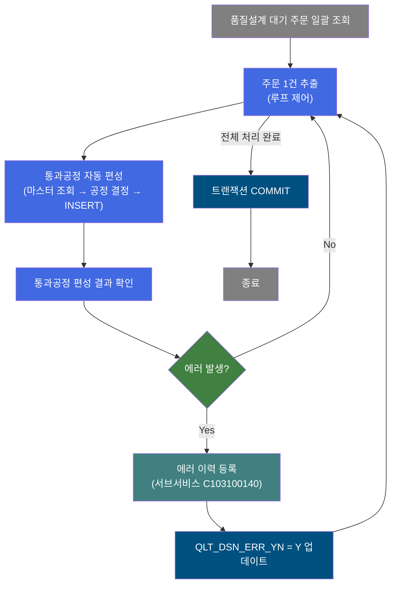
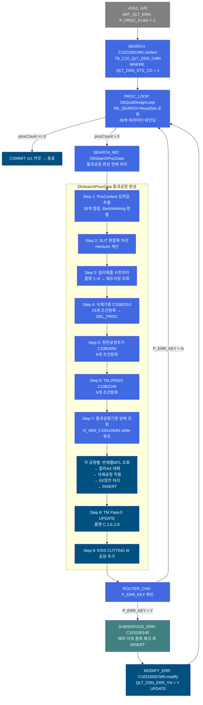
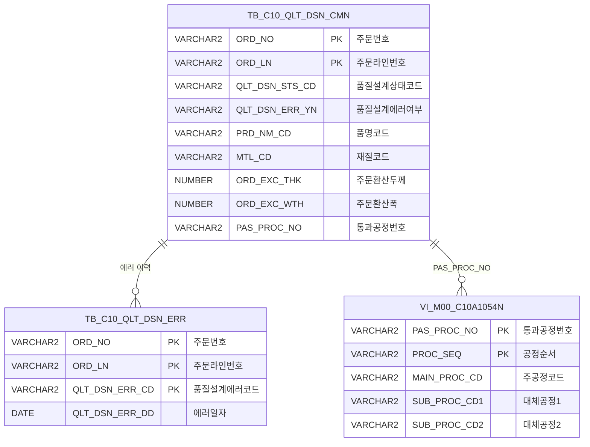

<h1 style="font-size: 40px; text-align: center; font-weight:
   bold; margin: 30px 0;">
  C103100030 레거시 시스템 분석 종합 보고서
</h1>


# 1. 시스템 개요
- **서비스 ID**: C103100030
- **업무명**: 품질설계 통과공정 자동 편성 (배치)
- **분석 일시**: 2026-03-16 18:49 KST (재생성)
- **분석 시간**: 약 1분 (캐시 히트)
- **전체 Activity 수**: 8개 (Custom 2, Built-in 6)
- **분석자**: Claude Opus 4.6
- **분석 도구**: /analyze-service C103100030
- **문서 버전**: 1.0

# 📊 비즈니스 프로세스 분석

## 시스템 목적

C103100030 서비스는 품질설계 자동화 배치(NUI) 프로세스로, 수주 주문의 품질설계 대기 건을 일괄 조회하여 각 주문별로 생산 통과공정을 자동 편성하는 핵심 배치 서비스이다. 주문 사양(품명코드, 재질, 두께, 폭, 칼라제조사양 등)을 기반으로 EasyAccess 업무기준(C10B2010/C10B2050/C10B2240)과 통과공정기준 View(VI_M00_C10A1054N)를 조회하여 공정 순서와 주공정/대체공정 코드를 결정하고, 품질설계결과 통과공정 테이블에 INSERT한다.

서비스의 처리 흐름은 다음과 같다. 먼저 `INIT_QLT_ERR`에서 P_PROC_FLAG를 'C'로 초기화한 뒤, `SEARCH` Activity가 TB_C10_QLT_DSN_CMN 테이블에서 품질설계상태코드(QLT_DSN_STS_CD)가 'J'(대기)인 주문을 일괄 조회한다. `PROC_LOOP`(DbQualDesignLoop)가 조회 결과를 1건씩 순회하며, 각 건에 대해 `SEARCH_MD`(DbSearchProcData)가 통과공정 편성 전체 로직을 수행한다. 에러 발생 시 서브서비스 C103100140을 호출하여 에러 이력을 등록하고, QLT_DSN_ERR_YN을 'Y'로 UPDATE한 뒤 다음 건으로 계속 진행한다. 모든 건 처리 완료 후 COMMIT으로 트랜잭션을 확정한다.

통과공정 편성은 단순한 공정 코드 조회가 아니라, 공정 삭제 기준 적용, 정전공정 삽입, 칼라 공정 대체, TM 2PASS 처리, 칼라 2PASS 추가, KISS CUTTING 공정 삽입까지 복합적인 공정 편성 규칙을 포함한다.

## 핵심 워크플로우 다이어그램



### 상세 워크플로우 다이어그램



## 주요 유즈케이스

### UC-01: 품질설계 대기 주문 일괄 통과공정 편성

- **Actor**: NUI 배치 프로세스 (품질설계 시스템)
- **목적**: 품질설계 상태가 '대기(J)'인 모든 주문에 대해 생산 통과공정을 자동으로 결정하고 등록
- **전제조건**:
  - TB_C10_QLT_DSN_CMN에 QLT_DSN_STS_CD = 'J'인 주문이 존재
  - EasyAccess 업무기준(C10B2010, C10B2050, C10B2240)이 정상 설정됨
  - 통과공정기준 View(VI_M00_C10A1054N)에 공정 마스터 데이터 존재

- **주요 흐름**:
  1. 서비스 시작 → P_PROC_FLAG를 'C'로 초기화
  2. C102100CMN.Jselect 쿼리로 대기 주문 전건 조회 (SELECT * FROM TB_C10_QLT_DSN_CMN WHERE QLT_DSN_STS_CD = 'J')
  3. DbQualDesignLoop가 조회 결과를 1건씩 순회하며 39개 파라미터를 PosContext에 바인딩
  4. DbSearchProcData가 각 주문의 사양 기반으로 통과공정 편성 수행
  5. 공정 순서별 INSERT_PROC 실행으로 품질설계결과 통과공정 테이블에 등록
  6. 모든 건 처리 후 COMMIT

- **대체 흐름**:
  - 통과공정기준 미존재 (VI_M00_C10A1054N 조회 결과 0건): 에러코드 ERRCD_KK23 발생 → P_ERR_KEY = 'Y'
  - 삭제공정 적용 후 주공정 공백: 에러코드 ERRCD_KK27 발생 → P_ERR_KEY = 'Y'
  - 에러 발생 시: C103100140 서브서비스로 에러 이력 등록 → QLT_DSN_ERR_YN = 'Y' 업데이트 → 다음 건 계속 진행

- **후행조건**:
  - 품질설계결과 통과공정 테이블에 각 주문별 공정 순서가 INSERT됨
  - 에러 발생 주문은 QLT_DSN_ERR_YN = 'Y'로 마킹되고 에러 이력이 TB_C10_QLT_DSN_ERR에 등록됨
  - TM Pass수가 해당 품명에 대해 UPDATE됨

### UC-02: 칼라제품 통과공정 편성 (품명 1~9)

- **Actor**: NUI 배치 프로세스
- **목적**: 칼라제품(품명코드 1~9)의 경우 칼라 제조사양(CCL BOM)을 기반으로 특화된 공정 편성 수행
- **전제조건**:
  - 주문의 품명코드(PRD_NM_CD)가 1~9 중 하나
  - VI_M00_C10A1054_PROC_CHK에 통과공정 기준 존재
  - CCL BOM 제조사양(SELECT_MNF_CCL_BOM)이 등록됨

- **주요 흐름**:
  1. 품명코드 1~9 확인 → 칼라제품 사전 처리 진입
  2. VI_M00_C10A1054_PROC_CHK로 통과공정 기준 존재 확인
  3. SELECT_MNF_CCL_BOM으로 칼라 제조사양 조회 (주공정, 대체공정1~3, 도장방식, 재단선 여부 등)
  4. 통과공정기준 while 루프에서 main_proc_cd가 "AX" 형식인 경우 → ccl_proc_cd(칼라 주공정)로 대체
  5. 도장방식(A/B/C/D/E 또는 6/7/8/9)에 따라 칼라 2PASS 추가 INSERT
  6. main_proc_cd가 "6X" 형식인 경우 → CclShlProc()으로 정전(SHL) 공정 결정

- **대체 흐름**:
  - 칼라정전라인결정기준(VI_M00_C10A2030) 조회 결과 다건: 에러코드 ERRCD_KT31 → SPACE2 반환
  - 칼라정전라인결정기준 미존재: 에러코드 ERRCD_KT30 → SPACE 반환

- **후행조건**:
  - 칼라 공정(AX)이 실제 ccl_proc_cd로 치환되어 INSERT됨
  - 2PASS 조건 충족 시 동일 공정이 추가 INSERT됨

### UC-03: 에러 발생 주문 처리 및 이력 등록

- **Actor**: NUI 배치 프로세스
- **목적**: 통과공정 편성 중 에러가 발생한 주문에 대해 에러 이력을 등록하고 후속 주문 처리를 계속 진행
- **전제조건**:
  - DbSearchProcData 실행 중 에러 발생 (P_ERR_KEY = 'Y')

- **주요 흐름**:
  1. DbSearchProcData에서 에러 발생 → P_ERR_KEY = 'Y' 설정
  2. ROUTER_CHK에서 P_ERR_KEY 값 확인 → error 전이
  3. SUBSERVICE_ERR: C103100140 서브서비스 호출 (기존 트랜잭션 공유)
  4. C103100140에서 ORD_NO + ORD_LN + QLT_DSN_ERR_CD 복합키로 중복 체크
  5. 중복 없으면 TB_C10_QLT_DSN_ERR에 에러 이력 INSERT
  6. MODIFY_ERR: C1021000CMN.modify로 QLT_DSN_ERR_YN = 'Y' UPDATE
  7. PROC_LOOP로 복귀하여 다음 주문 처리 계속

- **대체 흐름**:
  - 동일 에러 이미 등록됨: C103100140에서 INSERT 건너뜀 (중복 방지)

- **후행조건**:
  - 에러 주문의 QLT_DSN_ERR_YN이 'Y'로 마킹됨
  - TB_C10_QLT_DSN_ERR에 에러 이력이 (중복 없이) 등록됨
  - 후속 주문 처리가 중단 없이 계속됨

### UC-04: KISS CUTTING 및 TM 2PASS 특수 공정 추가

- **Actor**: NUI 배치 프로세스
- **목적**: 주문 사양에 따라 KISS CUTTING(6I) 공정 및 TM 2PASS(51) 공정을 자동 추가
- **전제조건**:
  - KISS CUTTING: kiss_cut_yn = 'Y'
  - TM 2PASS: C10B2240 업무기준 조회 결과 TM_PASS_CNT ≠ '1'

- **주요 흐름**:
  1. TM 2PASS: main_proc_cd = "51" 공정에서 tm_proc_cd = "51" 확인 시 → InsProc() 추가 호출
  2. TM Pass수는 무조건 "1"로 강제 설정 (COL_TM_PASS_CNT = "1")
  3. 품명 C, 1, E, 2, 8인 경우 → chgtmpass()로 TM Pass수 UPDATE
  4. KISS CUTTING: kiss_cut_yn = 'Y'인 경우 → PROC_CD_INS_SHL(6I) 공정 추가 INSERT

- **대체 흐름**:
  - TM_PASS_CNT = '1': TM 2PASS 추가하지 않음
  - kiss_cut_yn ≠ 'Y': KISS CUTTING 공정 추가하지 않음

- **후행조건**:
  - 해당 공정이 통과공정 목록에 추가 INSERT됨

---

## 비즈니스 로직 상세

### 1. 통과공정 편성 종합 로직 (DbSearchProcData)

- **목적**: 주문 사양을 기반으로 마스터 데이터를 조회하여 생산 통과공정의 순서와 공정코드(주공정/대체공정)를 자동 결정

- **처리 케이스**:

  **[케이스 1: SLIT 혼합폭 계산]**
  ```
  조건: ord_slit_grp_cnt > 0 (SLIT 조수가 있는 경우)
  처리:
    1. mix_wth = min(ord_mix_wth1 ~ ord_mix_wth10) (0 제외한 최솟값)
    2. exc_wth = sum(ord_mix_wth1 ~ ord_mix_wth10) (합산폭)
  조건: ord_slit_grp_cnt = 0
  처리:
    1. mix_wth = ord_exc_wth (환산폭 그대로 사용)
    2. exc_wth = ord_exc_wth
  ```

  **[케이스 2: 통과공정 삭제기준 적용 (EasyAccess C10B2010)]**
  ```
  조건: 23개 조건항목(품명코드, 백마킹, 내경, 표면처리코드, 도금량지정코드,
        EMBOSS무늬, 포장단중하한, 코일외경, 두께, 폭, 재질코드, EDGE,
        길이, 제품형태, 권취방법, 최종수요가, 주문용도, 스팽글, SLIT조수 등)
  처리:
    1. 조건 매칭되는 삭제 대상 공정코드 목록(DEL_PROC) 수집
    2. 각 통과공정에서 DEL_PROC에 해당하는 공정코드 제거
    3. 삭제 후 주공정 = SPACE이면 에러(ERRCD_KK27) 반환
  ```

  **[케이스 3: 정전공정 추가기준 적용 (EasyAccess C10B2050)]**
  ```
  조건: 9개 조건항목(품명코드, 제품형태, SLIT조수, 혼합폭최솟값, EDGE,
        두께, 재단선유무, 위탁임가공, EMBOSS무늬)
  처리:
    1. 추가할 정전공정의 위치(loc: B=앞, A=뒤)와 기준공정(base_proc_cd) 결정
    2. 주공정(cor_proc_cd) 및 대체공정(cor_proc_cd1~3) 결정
    3. 특수: cor_proc_cd1 = "74" AND exc_wth > 1270mm → 74공정 제거
  ```

  **[케이스 4: 칼라제품 AX 공정 대체]**
  ```
  조건: 품명코드 IN (1~9) AND main_proc_cd가 "AX" 형식 (2번째 자리 "X")
  처리:
    1. main_proc_cd를 ccl_proc_cd(칼라 제조사양 주공정)로 대체
    2. sub_proc_cd1~3을 ccl_proc_cd1~3(칼라 대체공정)으로 대체
  ```

  **[케이스 5: 반제품 MaterialCode 결정]**
  ```
  조건: 칼라제품 AND main_proc_cd = "72" → SELECT_SEM_MTL1 (RCL 전용)
  조건: 칼라제품 AND main_proc_cd 첫자리 = "7" (72 제외) → SELECT_SEM_MTL3
  조건: 그 외 → SELECT_SEM_MTL2 (일반, 첫자리 비교)
  ```

- **계산 공식**:

  ```
  BackMarking 판별:
    bak_mrk = (COL_BAK_MRK.substring(0,4) == "BACK") ? "Y" : "N"

  SLIT 혼합폭:
    mix_wth = MIN(ord_mix_wth1, ..., ord_mix_wth10)  [0 제외]
    exc_wth = SUM(ord_mix_wth1, ..., ord_mix_wth10)

  통과공정 순서 계산:
    proc_seq = 기본순서 + add_seq  [정전/2PASS 추가 시 add_seq 누적 증가]
  ```

- **예외 처리**:
  - 통과공정기준 미존재 (VI_M00_C10A1054N 결과=0): 에러코드 ERRCD_KK23 → FAILURE
  - 삭제공정 적용 후 주공정 공백: 에러코드 ERRCD_KK27 → FAILURE
  - 칼라정전라인결정기준 다건: 에러코드 ERRCD_KT31 → SPACE2 반환
  - 칼라정전라인결정기준 미존재: 에러코드 ERRCD_KT30 → SPACE 반환
  - EasyAccess MasterDataException: 로그만 출력, 에러 반환 없이 계속 진행

### 2. 칼라 2PASS 추가 로직

- **목적**: 칼라 도장 방식에 따라 동일 공정을 2회 수행하도록 추가 INSERT

- **처리 케이스**:

  **[케이스 1: 1-pass형 도장방식]**
  ```
  조건: main_proc_cd 첫자리 = "A"
        AND 도장방식 IN (A, B, C, D, E)
        AND ccl_bom_no 첫자리 ≠ "V"
  처리: 동일 공정 1회 추가 INSERT (add_seq++)
  ```

  **[케이스 2: 2-pass형 도장방식]**
  ```
  조건: 도장방식 IN (6, 7, 8, 9)
        AND main_proc_cd IN (A2, A3, A6)
  처리: 동일 공정 1회 추가 INSERT (add_seq++)
  ```

### 3. TM 공정 처리 로직

- **목적**: TM(탠덤밀) 공정의 PASS 횟수를 관리하고 필요 시 2PASS 추가

- **처리 케이스**:

  **[케이스 1: TM 1PASS 강제화]**
  ```
  조건: main_proc_cd = "51" (TM 공정)
  처리: COL_TM_PASS_CNT = "1" 강제 설정
  ```

  **[케이스 2: TM 2PASS 추가]**
  ```
  조건: main_proc_cd = "51" AND tm_proc_cd = "51"
        (C10B2240 업무기준에서 TM_PASS_CNT ≠ "1"로 판정된 경우)
  처리: InsProc() 추가 호출 (add_seq++)
  ```

  **[케이스 3: TM Pass수 UPDATE]**
  ```
  조건: 품명코드 IN (C, 1, E, 2, 8)
  처리: chgtmpass() → UPDATE_TMPASS SQL 실행
  ```

---

# ⚙️ Java 컴포넌트 분석

## Custom Activity 상세 분석

### 2개 Custom Activity 발견

### 1. DbSearchProcData (SEARCH_MD)
- **클래스명**: com.unionsteel.mes.c10.activity.nui.DbSearchProcData
- **액티비티명**: SEARCH_MD
- **파일 경로**: src/com/unionsteel/mes/c10/activity/nui/DbSearchProcData.java
- **주요 기능**: 품질설계 통과공정 자동 편성 (마스터 조회 → 공정 결정 → DB INSERT)
- **라인 수**: 1426 | **메소드 수**: 5개 (runActivity, DelProc, CclShlProc, InsProc, chgtmpass)

> 품질설계 NUI(배치) 프로세스에서 통과공정을 편성하는 클래스이다. 주문 정보, 제품군, 칼라 제조사양 등을 기반으로 마스터 데이터(EasyAccess, DAO)를 조회하여 통과공정 순서 및 각 공정의 주공정/대체공정 코드를 결정하고, 품질설계결과 통과공정 테이블에 INSERT한다.

📎 **[상세 분석 보고서](../customClass/com.unionsteel.mes.c10.activity.nui.DbSearchProcData_class_analysis.md)**

---

### 2. DbQualDesignLoop (PROC_LOOP)
- **클래스명**: com.unionsteel.mes.c10.activity.nui.DbQualDesignLoop
- **액티비티명**: PROC_LOOP
- **파일 경로**: src/com/unionsteel/mes/c10/activity/nui/DbQualDesignLoop.java
- **주요 기능**: ResultSet 순회 루프 제어 (1건씩 PosContext 바인딩 → 후속 Activity 체인 실행)
- **라인 수**: 171 | **메소드 수**: 1개 (runActivity)

> GLUE Framework 기반 NUI(배치) 서비스에서 이전 액티비티가 조회한 ResultSet을 1건씩 순회 처리하기 위한 루프 제어 액티비티이다. 처리 건수가 0이 되면 "exit" 전이를 반환하여 루프를 종료한다. 40개 이상의 서비스에서 공유 사용되는 공통 컴포넌트이다.

📎 **[상세 분석 보고서](../customClass/com.unionsteel.mes.c10.activity.nui.DbQualDesignLoop_class_analysis.md)**

---

# 💾 데이터 요구사항

## 핵심 테이블

### 1. TB_C10_QLT_DSN_CMN - (품질설계 공통 마스터)
| 컬럼명 | 타입 | PK | 설명 |
|--------|------|----|------|
| ORD_NO | VARCHAR2 | ✅ | 주문번호 |
| ORD_LN | VARCHAR2 | ✅ | 주문라인번호 |
| QLT_DSN_STS_CD | VARCHAR2 | | 품질설계상태코드 (J=대기) |
| QLT_DSN_ERR_YN | VARCHAR2 | | 품질설계에러여부 (Y/N) |
| PLNT_TP | VARCHAR2 | | 공장구분 |
| PRD_NM_CD | VARCHAR2 | | 품명코드 |
| PRD_SHP | VARCHAR2 | | 제품형태 |
| MTL_CD | VARCHAR2 | | 재질코드 |
| PAS_PROC_NO | VARCHAR2 | | 통과공정번호 |
| BAK_MRK | VARCHAR2 | | 백마킹 |
| ORD_EXC_THK | NUMBER | | 주문환산두께 |
| ORD_EXC_WTH | NUMBER | | 주문환산폭 |
| ORD_EXC_LTH | NUMBER | | 주문환산길이 |
| ORD_COIL_IDIA | VARCHAR2 | | 주문코일내경 |
| ORD_SLV_KND_TP | VARCHAR2 | | 주문내경링종류구분 |
| ORD_SUR_HND_CD | VARCHAR2 | | 주문표면처리코드 |
| GW_ASG_CD | VARCHAR2 | | 도금량지정코드 |
| EMBS_CD | VARCHAR2 | | EMBOSS무늬 |
| ORD_PAK_UNT_WGT_LLV | VARCHAR2 | | 주문포장단중하한값 |
| ORD_COIL_ODIA | VARCHAR2 | | 주문코일외경 |
| ORD_SLIT_GRP_CNT | VARCHAR2 | | SLIT조수 |
| ORD_MIX_WTH1~10 | VARCHAR2 | | 혼합폭 1~10 |
| ORD_EDG_ASG_TP | VARCHAR2 | | 주문EDGE지정구분 |
| TRST_PROC_YN | VARCHAR2 | | 위탁임가공여부 |
| MQL_CD | VARCHAR2 | | 재질추가코드 |
| SPC_AVR | VARCHAR2 | | 규격약호 |
| FNL_CUS_CD | VARCHAR2 | | 최종수요가코드 |
| ORD_USG_CD | VARCHAR2 | | 주문용도코드 |
| CCL_BOM_NO | VARCHAR2 | | CCL BOM번호 |
| ORD_COILG_MTH | VARCHAR2 | | 권취방법 |
| KISS_CUT_YN | VARCHAR2 | | KISS CUTTING 여부 |
| ORD_SPNL_TP | VARCHAR2 | | 스팽글타입 |
| RMTL_CD | VARCHAR2 | | 원자재코드 |
| FLOW_CHL | VARCHAR2 | | 유통경로 |
| ORD_KND | VARCHAR2 | | 주문종류 |
| CUS_REQ_DLV_DD | VARCHAR2 | | 고객요구납기 |
| ORD_SCH_DLV_DD | VARCHAR2 | | 주문예정납기 |
| LAST_UPDATED_OBJECT_TYPE | VARCHAR2 | | 최종변경OBJECT유형 |
| LAST_UPDATED_OBJECT_ID | VARCHAR2 | | 최종변경OBJECTID |
| LAST_UPDATE_PROGRAM_ID | VARCHAR2 | | 최종변경프로그램ID |
| LAST_UPDATE_TIMESTAMP | VARCHAR2 | | 최종변경일시 |

### 2. TB_C10_QLT_DSN_ERR - (품질설계 에러 이력)
| 컬럼명 | 타입 | PK | 설명 |
|--------|------|----|------|
| ORD_NO | VARCHAR2 | ✅ | 주문번호 |
| ORD_LN | VARCHAR2 | ✅ | 주문라인번호 |
| QLT_DSN_ERR_CD | VARCHAR2 | ✅ | 품질설계에러코드 |
| QLT_DSN_ERR_DD | DATE | | 품질설계에러일자 (SYSDATE) |

## 데이터 플로우

### 1. 대기 주문 조회
```
배치 시작
→ C102100CMN.Jselect
  FROM TB_C10_QLT_DSN_CMN
  WHERE QLT_DSN_STS_CD = 'J'
→ RK_SEARCH ResultSet에 전건 적재
```

### 2. 통과공정 편성 (건별 반복)
```
PROC_LOOP에서 1건 추출
→ DbSearchProcData.runActivity() 호출
  1) EasyAccess C10B2010 조회 → 삭제 대상 공정 수집
  2) EasyAccess C10B2050 조회 → 정전공정 추가 정보 결정
  3) EasyAccess C10B2240 조회 → TM 2PASS 여부 결정
  4) VI_M00_C10A1054N (통과공정기준) while 루프
     → SELECT_SEM_MTL1/2/3 (반제품 Material 조회)
     → INSERT_PROC (통과공정 INSERT)
  5) UPDATE_TMPASS (TM Pass수 UPDATE)
```

### 3. 에러 처리
```
P_ERR_KEY = 'Y' 감지
→ C103100140 서브서비스 호출
  FROM TB_C10_QLT_DSN_ERR
  WHERE ORD_NO = ? AND ORD_LN = ? AND QLT_DSN_ERR_CD = ?
  → 중복 없으면 INSERT
→ C1021000CMN.modify
  UPDATE TB_C10_QLT_DSN_CMN
  SET QLT_DSN_ERR_YN = 'Y'
  WHERE ORD_NO = ? AND ORD_LN = ?
```

## SQL 일람표

| SQL 이름 | 쿼리 ID | 타입 | 출처 | 테이블 |
|---------|---------|------|------|--------|
| 대기 주문 조회 | C102100CMN.Jselect | SELECT | Service | TB_C10_QLT_DSN_CMN |
| 에러여부 UPDATE | C1021000CMN.modify | UPDATE | Service | TB_C10_QLT_DSN_CMN |
| 통과공정기준 존재확인 | VI_M00_C10A1054_PROC_CHK | SELECT | DbSearchProcData | VI_M00_C10A1054_PROC_CHK |
| 칼라 제조사양 조회 | SELECT_MNF_CCL_BOM | SELECT | DbSearchProcData | (칼라 제조사양 테이블) |
| 통과공정기준 View 조회 | VI_M00_C10A1054N | SELECT | DbSearchProcData | VI_M00_C10A1054N |
| 반제품MTL 조회(RCL) | SELECT_SEM_MTL1 | SELECT | DbSearchProcData | (반제품 Material 테이블) |
| 반제품MTL 조회(일반) | SELECT_SEM_MTL2 | SELECT | DbSearchProcData | (반제품 Material 테이블) |
| 반제품MTL 조회(7X) | SELECT_SEM_MTL3 | SELECT | DbSearchProcData | (반제품 Material 테이블) |
| 이전 칼라공정 조회 | SELECT_CCL_PROC | SELECT | DbSearchProcData | (칼라공정 이력) |
| 칼라정전라인결정 | VI_M00_C10A2030 | SELECT | DbSearchProcData | VI_M00_C10A2030 |
| 통과공정 INSERT | INSERT_PROC | INSERT | DbSearchProcData | (품질설계결과 통과공정 테이블) |
| TM Pass수 UPDATE | UPDATE_TMPASS | UPDATE | DbSearchProcData | (품질설계 제조표준 테이블) |

## ER 다이어그램 (핵심 관계)



관계 설명:
- TB_C10_QLT_DSN_CMN이 중심 테이블로, 주문 단위 품질설계 정보를 관리
- TB_C10_QLT_DSN_ERR: ORD_NO + ORD_LN으로 연결되는 에러 이력 (1:N)
- VI_M00_C10A1054N: PAS_PROC_NO를 통해 통과공정기준을 참조 (1:N)

---

# 🔗 서브서비스

## 서브서비스 요약

| 서비스 ID | 설명 | 호출 액티비티 | 트랜잭션 | 상세 분석 |
|-----------|------|-------------|---------|----------|
| C103100140 | 품질설계결과 에러 등록 (중복 방지) | SUBSERVICE_ERR | 기존 트랜잭션 공유 | [상세 분석](./C103100140_legacy_analysis.md) |

### C103100140 - 품질설계결과 에러 등록
품질설계 과정에서 발생한 에러 정보를 TB_C10_QLT_DSN_ERR 테이블에 등록하는 서비스이다. ORD_NO + ORD_LN + QLT_DSN_ERR_CD의 3개 복합키로 기존 레코드 존재 여부를 먼저 조회하여 중복 등록을 방지한 뒤, 신규 건에 대해서만 INSERT를 수행한다. Activity 2개, SQL Key 2개로 구성된 단순 서비스이다.

---

# 📌 특이사항 및 주의사항

## 1. 복합적 공정 편성 규칙의 순서 의존성
- **삭제 → 추가 → 대체 순서**: 통과공정삭제기준(C10B2010) 적용 → 정전공정추가기준(C10B2050) 적용 → 칼라 AX 공정 대체 순서로 처리되며, 이 순서가 변경되면 결과가 달라질 수 있다.
- **정전공정 위치(B/A)**: 기준공정 이전(B=Before) 또는 이후(A=After)에 삽입하는 위치 지정이 있으므로, 공정 순서 계산 시 add_seq 누적에 주의가 필요하다.
- **74공정 폭 제한**: cor_proc_cd1 = "74" AND exc_wth > 1270mm인 경우 74공정을 제거하는 특수 규칙이 있다 (2014.11.05 추가).

## 2. DbQualDesignLoop의 O(n²) 탐색 특성
- **매 루프 전체 커서 재탐색**: bindSet.reset() 후 while 전체 순회로 this_row를 탐색하는 방식이므로, 처리 건수가 많을수록 탐색 횟수가 누적 증가한다. 100건 처리 시 최대 5,050회 탐색이 발생한다.
- **역방향 카운터**: procCount는 남은 건수로 초기화되며 1씩 감소, this_row = total_row - procCount 수식으로 순방향 인덱싱을 계산하는 독특한 구조이다.

## 3. EasyAccess MasterDataException 무시 패턴
- **에러 무시**: C10B2010, C10B2050, C10B2240 EasyAccess 조회 시 MasterDataException이 발생하면 로그만 출력하고 에러를 반환하지 않는다. 마스터 데이터 미등록 시 삭제/추가/2PASS 규칙이 적용되지 않은 채 통과공정이 편성될 수 있다.
- **영향**: 마스터 데이터 누락 시 기본 통과공정기준(VI_M00_C10A1054N)만으로 공정이 결정되므로, 운영 중 마스터 데이터 정합성 관리가 중요하다.

## 4. 에러 발생 시 배치 중단 없는 계속 처리
- **P_ERR_KEY 기반 에러 핸들링**: DbSearchProcData에서 에러 발생 시 P_ERR_KEY = 'Y'로 설정하고 FAILURE를 반환하지만, ROUTER_CHK → SUBSERVICE_ERR → MODIFY_ERR 경로를 거쳐 에러 이력 등록 후 PROC_LOOP로 복귀하여 다음 건을 계속 처리한다.
- **에러 주문 마킹**: QLT_DSN_ERR_YN = 'Y'로 마킹되어 이후 조회에서 에러 건을 식별할 수 있다.

## 5. 2024.10.10 KISS CUTTING 공정 추가
- **최근 변경**: kiss_cut_yn = 'Y'인 경우 PROC_CD_INS_SHL(6I) 공정을 추가 INSERT하는 로직이 2024.10.10에 추가되었다. 이는 통과공정기준 while 루프 완료 후 마지막 단계에서 실행된다.

## 6. 서브서비스 트랜잭션 공유
- **new-transaction = false**: C103100140 서브서비스가 부모 서비스의 트랜잭션(tx1)을 공유한다. 에러 이력 INSERT와 QLT_DSN_ERR_YN UPDATE가 최종 COMMIT에서 함께 확정되므로, 배치 도중 장애 발생 시 에러 이력과 에러 마킹이 모두 롤백된다.

---

# 📚 참고 문서

- **Service XML**: `src/service/C103100030-service.xml`
- **Query SQL**: `src/query/C102100CMN-query.glue_sql`
- **Custom Java 클래스**:
  - `src/com/unionsteel/mes/c10/activity/nui/DbSearchProcData.java`
  - `src/com/unionsteel/mes/c10/activity/nui/DbQualDesignLoop.java`
- **서브서비스**: [C103100140 분석 보고서](./C103100140_legacy_analysis.md)
