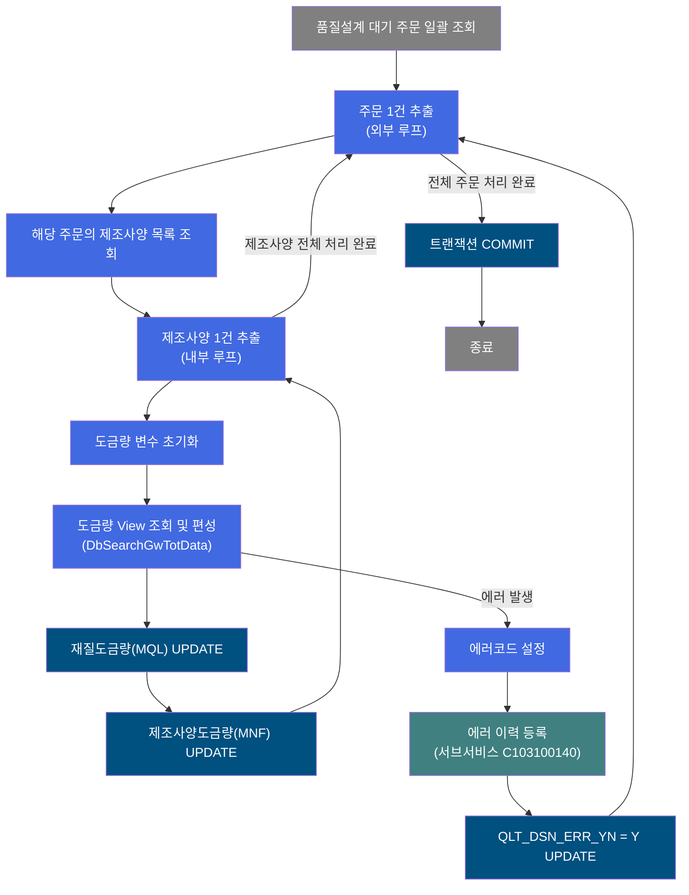
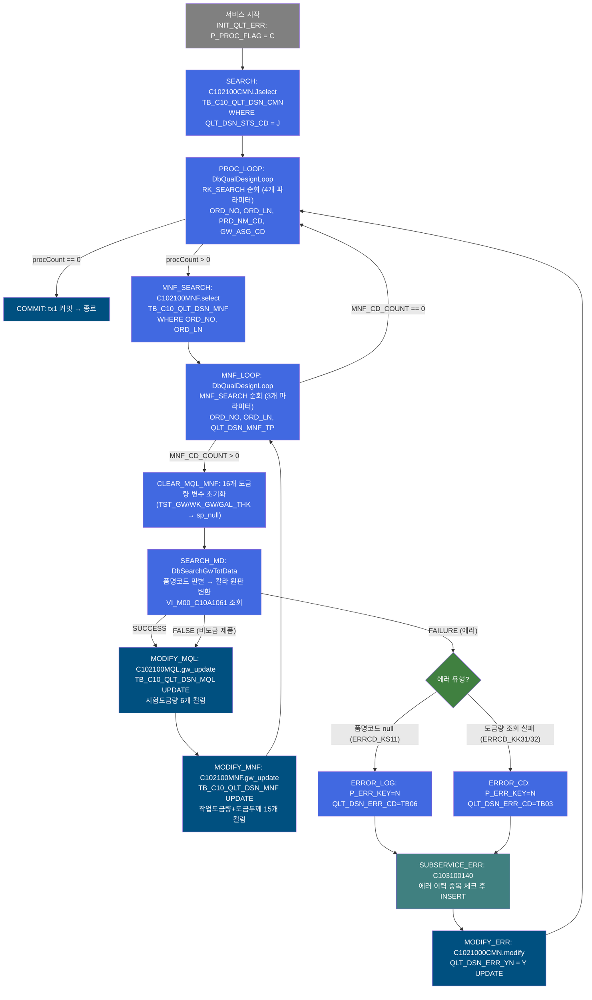
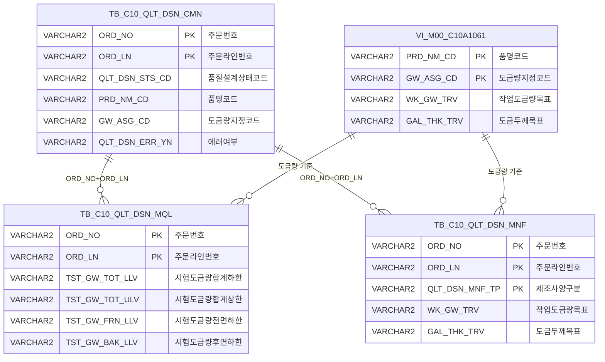

<h1 style="font-size: 40px; text-align: center; font-weight:
   bold; margin: 30px 0;">
  C103100040 레거시 시스템 분석 종합 보고서
</h1>


# 1. 시스템 개요
- **서비스 ID**: C103100040
- **업무명**: 품질설계 도금량 자동 편성 (배치)
- **분석 일시**: 2026-03-16 18:50 KST
- **분석 시간**: 약 4분
- **전체 Activity 수**: 14개 (Custom 3인스턴스/2클래스, Built-in 5, Common 6)
- **분석자**: Claude Opus 4.6
- **분석 도구**: /analyze-service C103100040
- **문서 버전**: 1.0

# 📊 비즈니스 프로세스 분석

## 시스템 목적

C103100040 서비스는 품질설계 자동화 배치(NUI) 프로세스로, 품질설계 대기 상태('J')인 주문을 일괄 조회하여 각 주문의 제조사양(MNF)별로 도금량(Galvanizing Weight) 정보를 자동 편성하는 서비스이다.

서비스는 이중 루프 구조로 동작한다. 외부 루프(`PROC_LOOP`)가 대기 주문을 1건씩 순회하면서, 각 주문에 대해 제조사양 목록을 조회(`MNF_SEARCH`)한 뒤 내부 루프(`MNF_LOOP`)가 제조사양별로 도금량 편성을 수행한다. 핵심 로직은 `DbSearchGwTotData`가 담당하며, 품명코드 기반으로 도금 가능 제품 여부를 판별하고, 칼라제품은 원판 품명코드로 변환한 뒤 `VI_M00_C10A1061`(도금량 View)을 조회하여 시험도금량과 작업도금량을 PosContext에 설정한다.

편성된 도금량은 두 테이블에 UPDATE된다: `TB_C10_QLT_DSN_MQL`(재질도금량)에는 시험도금량(전면/후면/합계 상하한)을, `TB_C10_QLT_DSN_MNF`(제조사양)에는 작업도금량(목표/전면/후면/합계 상하한) 및 도금두께 정보를 저장한다. 에러 발생 시 서브서비스 C103100140을 통해 에러 이력을 등록하고 QLT_DSN_ERR_YN을 'Y'로 마킹한 뒤 다음 건을 계속 처리한다.

## 핵심 워크플로우 다이어그램



### 상세 워크플로우 다이어그램



## 주요 유즈케이스

### UC-01: 품질설계 대기 주문 일괄 도금량 편성

- **Actor**: NUI 배치 프로세스 (품질설계 시스템)
- **목적**: 품질설계 상태가 '대기(J)'인 모든 주문에 대해 제조사양별 도금량 정보를 자동 편성
- **전제조건**:
  - TB_C10_QLT_DSN_CMN에 QLT_DSN_STS_CD = 'J'인 주문이 존재
  - TB_C10_QLT_DSN_MNF에 해당 주문의 제조사양이 등록됨
  - VI_M00_C10A1061(도금량 View)에 마스터 데이터 존재

- **주요 흐름**:
  1. P_PROC_FLAG를 'C'로 초기화
  2. C102100CMN.Jselect로 대기 주문 전건 조회
  3. PROC_LOOP가 주문 1건 추출 (ORD_NO, ORD_LN, PRD_NM_CD, GW_ASG_CD 바인딩)
  4. C102100MNF.select로 해당 주문의 제조사양 목록 조회
  5. MNF_LOOP가 제조사양 1건 추출 (QLT_DSN_MNF_TP 바인딩)
  6. CLEAR_MQL_MNF에서 16개 도금량 변수 초기화
  7. DbSearchGwTotData가 품명코드 기반 도금량 View 조회 및 시험/작업도금량 설정
  8. C102100MQL.gw_update로 TB_C10_QLT_DSN_MQL에 시험도금량 UPDATE
  9. C102100MNF.gw_update로 TB_C10_QLT_DSN_MNF에 작업도금량+도금두께 UPDATE
  10. 모든 건 처리 후 COMMIT

- **대체 흐름**:
  - 비도금 제품 (품명코드가 도금 대상 아님): DbSearchGwTotData에서 FALSE 반환 → 도금량 없이 MQL/MNF UPDATE 진행 (null/공백 값 저장)
  - 품명코드 null: 에러코드 TB06 → 에러 이력 등록 → 다음 주문
  - 도금량 View 조회 실패 (0건 또는 다건): 에러코드 TB03 → 에러 이력 등록 → 다음 주문

- **후행조건**:
  - TB_C10_QLT_DSN_MQL에 시험도금량 정보 UPDATE됨
  - TB_C10_QLT_DSN_MNF에 작업도금량 및 도금두께 정보 UPDATE됨
  - 에러 발생 주문은 QLT_DSN_ERR_YN = 'Y'로 마킹됨

### UC-02: 도금 방식별 시험도금량 자동 분배

- **Actor**: NUI 배치 프로세스
- **목적**: 도금 작업공정 방식(합계도금/개별도금)에 따라 시험도금량을 자동 분배
- **전제조건**:
  - 도금 가능 품명코드에 해당하는 주문
  - VI_M00_C10A1061에서 정확히 1건 조회됨

- **주요 흐름**:
  1. 품명코드로 도금 방식 판별
  2. 합계도금(G,K,J,L,V,W 및 칼라 3,4,6,9): TST_GW_TOT에 WK_GW_TOT 복사, TST_GW_FRN/BAK는 공백
  3. 개별도금(E,N 및 칼라 2,8): TST_GW_FRN/BAK에 WK_GW_FRN/BAK 복사, TST_GW_TOT는 공백

- **대체 흐름**:
  - 비도금 제품: 모든 도금량 변수가 sp_null 상태로 UPDATE됨

- **후행조건**:
  - 도금 방식에 맞는 시험도금량이 TB_C10_QLT_DSN_MQL에 저장됨

### UC-03: 칼라제품 원판 품명코드 변환

- **Actor**: NUI 배치 프로세스
- **목적**: 칼라제품(도색 후 제품)의 도금량 조회 시 원판(베이스) 품명코드로 변환하여 올바른 도금량 기준 적용
- **전제조건**:
  - 칼라제품 품명코드 (3, 4, 6, 8, 9, 2)

- **주요 흐름**:
  1. 품명코드 3 → G, 4 → L, 6 → V, 9 → W, 2 → E, 8 → N으로 변환
  2. 변환된 원판 품명코드 + 도금량지정코드(GW_ASG_CD)로 VI_M00_C10A1061 조회
  3. 조회 결과로 도금량 편성

- **후행조건**:
  - 칼라제품이 원판 기준의 도금량으로 편성됨

---

## 비즈니스 로직 상세

### 1. 도금량 편성 로직 (DbSearchGwTotData)

- **목적**: 품명코드와 도금량지정코드를 기반으로 마스터 데이터에서 도금량 정보를 조회하여 시험/작업도금량으로 분배

- **처리 케이스**:

  **[케이스 1: 합계도금 제품]**
  ```
  조건: 품명코드 IN (G, K, J, L, V, W) 또는 칼라제품 (3, 4, 6, 9)
  처리:
    1. 칼라제품은 원판 코드로 변환 (3→G, 4→L, 6→V, 9→W)
    2. VI_M00_C10A1061 조회 (prd_nm_cd, gw_asg_cd)
    3. 시험도금량 합계 = 작업도금량 합계 복사
       TST_GW_TOT_LLV = WK_GW_TOT_LLV
       TST_GW_TOT_ULV = WK_GW_TOT_ULV
    4. 시험도금량 전면/후면 = 공백
       TST_GW_FRN_LLV = "", TST_GW_FRN_ULV = ""
       TST_GW_BAK_LLV = "", TST_GW_BAK_ULV = ""
  ```

  **[케이스 2: 전면/후면 개별도금 제품]**
  ```
  조건: 품명코드 IN (E, N) 또는 칼라제품 (2, 8)
  처리:
    1. 칼라제품은 원판 코드로 변환 (2→E, 8→N)
    2. VI_M00_C10A1061 조회 (prd_nm_cd, gw_asg_cd)
    3. 시험도금량 합계 = 공백
       TST_GW_TOT_LLV = "", TST_GW_TOT_ULV = ""
    4. 시험도금량 전면/후면 = 작업도금량 전면/후면 복사
       TST_GW_FRN_LLV = WK_GW_FRN_LLV
       TST_GW_FRN_ULV = WK_GW_FRN_ULV
       TST_GW_BAK_LLV = WK_GW_BAK_LLV
       TST_GW_BAK_ULV = WK_GW_BAK_ULV
  ```

  **[케이스 3: 비도금 제품]**
  ```
  조건: 품명코드가 14개 도금 대상(E,G,K,J,L,V,N,W,2,3,4,6,8,9) 외
  처리: FALSE 반환 (정상 스킵, 도금량 설정 없이 이후 UPDATE에 null 전달)
  ```

- **예외 처리**:
  - 품명코드 null: 에러코드 ERRCD_KS11 → FAILURE
  - 도금량 View 조회 0건: 에러코드 ERRCD_KK31 (ERRMSG_R82) → FAILURE
  - 도금량 View 조회 다건: 에러코드 ERRCD_KK32 (ERRMSG_R83) → FAILURE
  - MasterDataException: 에러코드 ERRCD_KK31 → FAILURE

### 2. 이중 루프 제어 로직

- **목적**: 주문 단위 외부 루프와 제조사양 단위 내부 루프를 통한 다단계 일괄 처리

- **처리 케이스**:

  **[외부 루프: PROC_LOOP]**
  ```
  대상: RK_SEARCH (대기 주문 전건)
  카운터: QLT_DSN_STS_CD_COUNT
  바인딩: ORD_NO, ORD_LN, PRD_NM_CD, GW_ASG_CD
  종료 → COMMIT
  ```

  **[내부 루프: MNF_LOOP]**
  ```
  대상: MNF_SEARCH (주문별 제조사양 목록)
  카운터: MNF_CD_COUNT
  바인딩: ORD_NO, ORD_LN, QLT_DSN_MNF_TP
  종료 → 외부 루프 다음 건
  ```

---

# ⚙️ Java 컴포넌트 분석

## Custom Activity 상세 분석

### 2개 Custom 클래스, 3개 Activity 인스턴스 발견

### 1. DbSearchGwTotData (SEARCH_MD)
- **클래스명**: com.unionsteel.mes.c10.activity.nui.DbSearchGwTotData
- **액티비티명**: SEARCH_MD
- **파일 경로**: src/com/unionsteel/mes/c10/activity/nui/DbSearchGwTotData.java
- **주요 기능**: 도금량 View 조회 및 도금 방식별 시험/작업도금량 편성
- **라인 수**: 205 | **메소드 수**: 1개 (runActivity)

> 도금제품에 대한 도금량(Galvanizing Weight) 정보를 편성하는 클래스이다. 품명코드를 기준으로 도금 가능 제품군 여부를 판별하고, 칼라제품의 경우 원판 품명코드로 변환하여 VI_M00_C10A1061(도금량 View)를 조회한다. 조회된 도금량 데이터를 도금 작업공정 방식에 따라 시험도금량 또는 작업도금량으로 PosContext에 설정한다.

📎 **[상세 분석 보고서](../customClass/com.unionsteel.mes.c10.activity.nui.DbSearchGwTotData_class_analysis.md)**

---

### 2. DbQualDesignLoop (PROC_LOOP, MNF_LOOP)
- **클래스명**: com.unionsteel.mes.c10.activity.nui.DbQualDesignLoop
- **액티비티명**: PROC_LOOP (주문 루프), MNF_LOOP (제조사양 루프)
- **파일 경로**: src/com/unionsteel/mes/c10/activity/nui/DbQualDesignLoop.java
- **주요 기능**: ResultSet 순회 루프 제어 (1건씩 PosContext 바인딩)
- **라인 수**: 171 | **메소드 수**: 1개 (runActivity)

> 동일 클래스가 2개 Activity 인스턴스에서 사용됨. PROC_LOOP는 대기 주문 전건을 순회하고, MNF_LOOP는 주문별 제조사양을 순회한다. 각 인스턴스는 서로 다른 countName, bind-result, param 설정으로 독립적인 루프를 구성한다.

📎 **[상세 분석 보고서](../customClass/com.unionsteel.mes.c10.activity.nui.DbQualDesignLoop_class_analysis.md)**

---

# 💾 데이터 요구사항

## 핵심 테이블

### 1. TB_C10_QLT_DSN_CMN - (품질설계 공통 마스터)
| 컬럼명 | 타입 | PK | 설명 |
|--------|------|----|------|
| ORD_NO | VARCHAR2 | ✅ | 주문번호 |
| ORD_LN | VARCHAR2 | ✅ | 주문라인번호 |
| QLT_DSN_STS_CD | VARCHAR2 | | 품질설계상태코드 (J=대기) |
| QLT_DSN_ERR_YN | VARCHAR2 | | 품질설계에러여부 |
| PRD_NM_CD | VARCHAR2 | | 품명코드 |
| GW_ASG_CD | VARCHAR2 | | 도금량지정코드 |

### 2. TB_C10_QLT_DSN_MQL - (품질설계 재질도금량)
| 컬럼명 | 타입 | PK | 설명 |
|--------|------|----|------|
| ORD_NO | VARCHAR2 | ✅ | 주문번호 |
| ORD_LN | VARCHAR2 | ✅ | 주문라인번호 |
| TST_GW_FRN_LLV | VARCHAR2 | | 시험도금량 전면 하한 |
| TST_GW_FRN_ULV | VARCHAR2 | | 시험도금량 전면 상한 |
| TST_GW_BAK_LLV | VARCHAR2 | | 시험도금량 후면 하한 |
| TST_GW_BAK_ULV | VARCHAR2 | | 시험도금량 후면 상한 |
| TST_GW_TOT_LLV | VARCHAR2 | | 시험도금량 합계 하한 |
| TST_GW_TOT_ULV | VARCHAR2 | | 시험도금량 합계 상한 |

### 3. TB_C10_QLT_DSN_MNF - (품질설계 제조사양)
| 컬럼명 | 타입 | PK | 설명 |
|--------|------|----|------|
| ORD_NO | VARCHAR2 | ✅ | 주문번호 |
| ORD_LN | VARCHAR2 | ✅ | 주문라인번호 |
| QLT_DSN_MNF_TP | VARCHAR2 | ✅ | 품질설계제조사양구분 |
| WK_GW_TRV | VARCHAR2 | | 작업도금량 목표값 |
| WK_GW_FRN_LLV | VARCHAR2 | | 작업도금량 전면 하한 |
| WK_GW_FRN_ULV | VARCHAR2 | | 작업도금량 전면 상한 |
| WK_GW_BAK_LLV | VARCHAR2 | | 작업도금량 후면 하한 |
| WK_GW_BAK_ULV | VARCHAR2 | | 작업도금량 후면 상한 |
| WK_GW_TOT_LLV | VARCHAR2 | | 작업도금량 합계 하한 |
| WK_GW_TOT_ULV | VARCHAR2 | | 작업도금량 합계 상한 |
| GAL_THK_LLV | VARCHAR2 | | 도금두께 최소 |
| GAL_THK_ULV | VARCHAR2 | | 도금두께 최대 |
| GAL_THK_TRV | VARCHAR2 | | 도금두께 목표값 |
| SPC_GAL_THK | VARCHAR2 | | 규격도금두께 |

### 4. VI_M00_C10A1061 - (도금량 마스터 View, m00apuser 스키마)
| 컬럼명 | 타입 | PK | 설명 |
|--------|------|----|------|
| PRD_NM_CD | VARCHAR2 | ✅ | 품명코드 (원판) |
| GW_ASG_CD | VARCHAR2 | ✅ | 도금량지정코드 |
| WK_GW_TRV | VARCHAR2 | | 작업도금량 목표값 |
| WK_GW_FRN_LLV | VARCHAR2 | | 작업도금량 전면 하한 |
| WK_GW_FRN_ULV | VARCHAR2 | | 작업도금량 전면 상한 |
| WK_GW_BAK_LLV | VARCHAR2 | | 작업도금량 후면 하한 |
| WK_GW_BAK_ULV | VARCHAR2 | | 작업도금량 후면 상한 |
| WK_GW_TOT_LLV | VARCHAR2 | | 작업도금량 합계 하한 |
| WK_GW_TOT_ULV | VARCHAR2 | | 작업도금량 합계 상한 |
| GAL_THK_LLV | VARCHAR2 | | 도금두께 최소 |
| GAL_THK_ULV | VARCHAR2 | | 도금두께 최대 |
| GAL_THK_TRV | VARCHAR2 | | 도금두께 목표값 |
| SPC_GAL_THK | VARCHAR2 | | 규격도금두께 |

## 데이터 플로우

### 1. 대기 주문 조회
```
배치 시작
→ C102100CMN.Jselect
  FROM TB_C10_QLT_DSN_CMN
  WHERE QLT_DSN_STS_CD = 'J'
→ RK_SEARCH ResultSet에 전건 적재
```

### 2. 제조사양 조회 (주문별)
```
PROC_LOOP에서 1건 추출
→ C102100MNF.select
  FROM TB_C10_QLT_DSN_MNF
  WHERE ORD_NO = ? AND ORD_LN = ?
→ MNF_SEARCH ResultSet에 적재
```

### 3. 도금량 편성 (제조사양별)
```
MNF_LOOP에서 1건 추출
→ CLEAR_MQL_MNF: 16개 도금량 변수 초기화 (sp_null)
→ DbSearchGwTotData.runActivity()
  1) 품명코드 도금 가능 판별 (14개 코드)
  2) 칼라제품 → 원판 품명코드 변환
  3) VI_M00_C10A1061 조회 (masterdao, prd_nm_cd + gw_asg_cd)
  4) 도금 방식별 시험도금량 분배
  5) 작업도금량 + 도금두께 ctx 저장
→ C102100MQL.gw_update
  UPDATE TB_C10_QLT_DSN_MQL
  SET TST_GW_FRN/BAK/TOT LLV/ULV = ?
  WHERE ORD_NO = ? AND ORD_LN = ?
→ C102100MNF.gw_update
  UPDATE TB_C10_QLT_DSN_MNF
  SET WK_GW_TRV/FRN/BAK/TOT LLV/ULV, GAL_THK LLV/ULV/TRV, SPC_GAL_THK = ?
  WHERE ORD_NO = ? AND ORD_LN = ? AND QLT_DSN_MNF_TP = ?
```

### 4. 에러 처리
```
DbSearchGwTotData FAILURE 감지
→ ERROR_LOG 또는 ERROR_CD: 에러코드 설정 (TB06 또는 TB03)
→ C103100140 서브서비스: 에러 이력 중복 체크 후 INSERT
→ C1021000CMN.modify: QLT_DSN_ERR_YN = 'Y' UPDATE
→ PROC_LOOP 복귀 (다음 주문)
```

## SQL 일람표

| SQL 이름 | 쿼리 ID | 타입 | 출처 | 테이블 |
|---------|---------|------|------|--------|
| 대기 주문 조회 | C102100CMN.Jselect | SELECT | Service | TB_C10_QLT_DSN_CMN |
| 제조사양 조회 | C102100MNF.select | SELECT | Service | TB_C10_QLT_DSN_MNF |
| 재질도금량 UPDATE | C102100MQL.gw_update | UPDATE | Service | TB_C10_QLT_DSN_MQL |
| 제조사양도금량 UPDATE | C102100MNF.gw_update | UPDATE | Service | TB_C10_QLT_DSN_MNF |
| 에러여부 UPDATE | C1021000CMN.modify | UPDATE | Service | TB_C10_QLT_DSN_CMN |
| 도금량 View 조회 | VI_M00_C10A1061 | SELECT | DbSearchGwTotData | VI_M00_C10A1061 (m00apuser) |

## ER 다이어그램 (핵심 관계)



관계 설명:
- TB_C10_QLT_DSN_CMN이 중심 테이블로, ORD_NO + ORD_LN 기준 1:N으로 MQL과 MNF에 연결
- VI_M00_C10A1061(m00apuser)은 도금량 마스터 View로, PRD_NM_CD + GW_ASG_CD로 조회되어 MQL/MNF에 도금량 값 공급
- TB_C10_QLT_DSN_MNF는 QLT_DSN_MNF_TP(제조사양구분)을 추가 PK로 가져, 주문당 복수 제조사양 관리

---

# 🔗 서브서비스

## 서브서비스 요약

| 서비스 ID | 설명 | 호출 액티비티 | 트랜잭션 | 상세 분석 |
|-----------|------|-------------|---------|----------|
| C103100140 | 품질설계결과 에러 등록 (중복 방지) | SUBSERVICE_ERR | 기존 트랜잭션 공유 | [상세 분석](./C103100140_legacy_analysis.md) |

### C103100140 - 품질설계결과 에러 등록
품질설계 과정에서 발생한 에러 정보를 TB_C10_QLT_DSN_ERR 테이블에 등록하는 서비스이다. ORD_NO + ORD_LN + QLT_DSN_ERR_CD의 3개 복합키로 기존 레코드 존재 여부를 조회하여 중복 등록을 방지한다. Activity 2개, SQL Key 2개로 구성된 단순 서비스이다.

---

# 📌 특이사항 및 주의사항

## 1. 이중 루프 구조 (외부: 주문, 내부: 제조사양)
- **PROC_LOOP** (외부): 대기 주문 전건을 순회하며, 각 주문에 대해 MNF_SEARCH를 실행하고 MNF_LOOP를 시작한다.
- **MNF_LOOP** (내부): 주문별 제조사양을 순회하며, 각 제조사양에 대해 도금량 편성 → MQL UPDATE → MNF UPDATE를 수행한다.
- 두 루프 모두 동일한 `DbQualDesignLoop` 클래스를 사용하되, `countName`, `bind-result`, `param` 설정이 다르다.
- 내부 루프의 O(n²) 탐색 특성이 제조사양 건수만큼 반복되므로, 주문당 제조사양이 많으면 성능 영향이 있을 수 있다.

## 2. 16개 변수 초기화 (CLEAR_MQL_MNF)
- **매 제조사양 처리 전** 16개 도금량 관련 변수를 `sp_null`로 초기화한다. 이전 제조사양의 도금량 값이 다음 건에 오염되는 것을 방지하기 위한 조치이다.
- 초기화 대상: TST_GW(6개), WK_GW(7개), GAL_THK(3개) 총 16개 변수

## 3. 에러코드 분리 (TB03 vs TB06)
- **TB03**: 도금량 조회 실패 (ERRCD_KK31: 0건, ERRCD_KK32: 다건) → `ERROR_CD` Activity에서 설정
- **TB06**: 품명코드 null (ERRCD_KS11) → `ERROR_LOG` Activity에서 설정
- 두 에러 경로 모두 동일하게 SUBSERVICE_ERR → MODIFY_ERR로 진행하나, 에러코드가 다르므로 TB_C10_QLT_DSN_ERR에 구분되어 저장된다.

## 4. 비도금 제품의 정상 처리 (FALSE 반환)
- DbSearchGwTotData가 비도금 제품에 대해 FALSE를 반환하면, 에러가 아닌 정상 처리로 간주되어 MODIFY_MQL → MODIFY_MNF로 진행한다. 이 경우 도금량 변수가 CLEAR_MQL_MNF에서 sp_null로 초기화된 상태로 UPDATE되므로, 기존에 잘못 설정된 도금량이 있었다면 null로 덮어써진다.

## 5. masterdao 사용 (도금량 View 조회)
- DbSearchGwTotData는 DAO property로 `masterdao`를 사용하여 m00apuser 스키마의 VI_M00_C10A1061 View를 조회한다. 나머지 SQL은 모두 `mesdao` (MESAPUSER 스키마)를 사용한다. 크로스 스키마 조회 시 View 접근 권한에 주의해야 한다.

## 6. 서브서비스 트랜잭션 공유
- C103100140 서브서비스가 `new-transaction = false`로 부모의 트랜잭션(tx1)을 공유한다. 최종 COMMIT에서 에러 이력 INSERT, 에러 마킹 UPDATE, 도금량 UPDATE가 함께 확정된다.

---

# 📚 참고 문서

- **Service XML**: `src/service/C103100040-service.xml`
- **Query SQL**:
  - `src/query/C102100CMN-query.glue_sql`
  - `src/query/C102100MQL-query.glue_sql`
  - `src/query/C102100MNF-query.glue_sql`
- **Custom Java 클래스**:
  - `src/com/unionsteel/mes/c10/activity/nui/DbSearchGwTotData.java`
  - `src/com/unionsteel/mes/c10/activity/nui/DbQualDesignLoop.java`
- **서브서비스**: [C103100140 분석 보고서](./C103100140_legacy_analysis.md)
