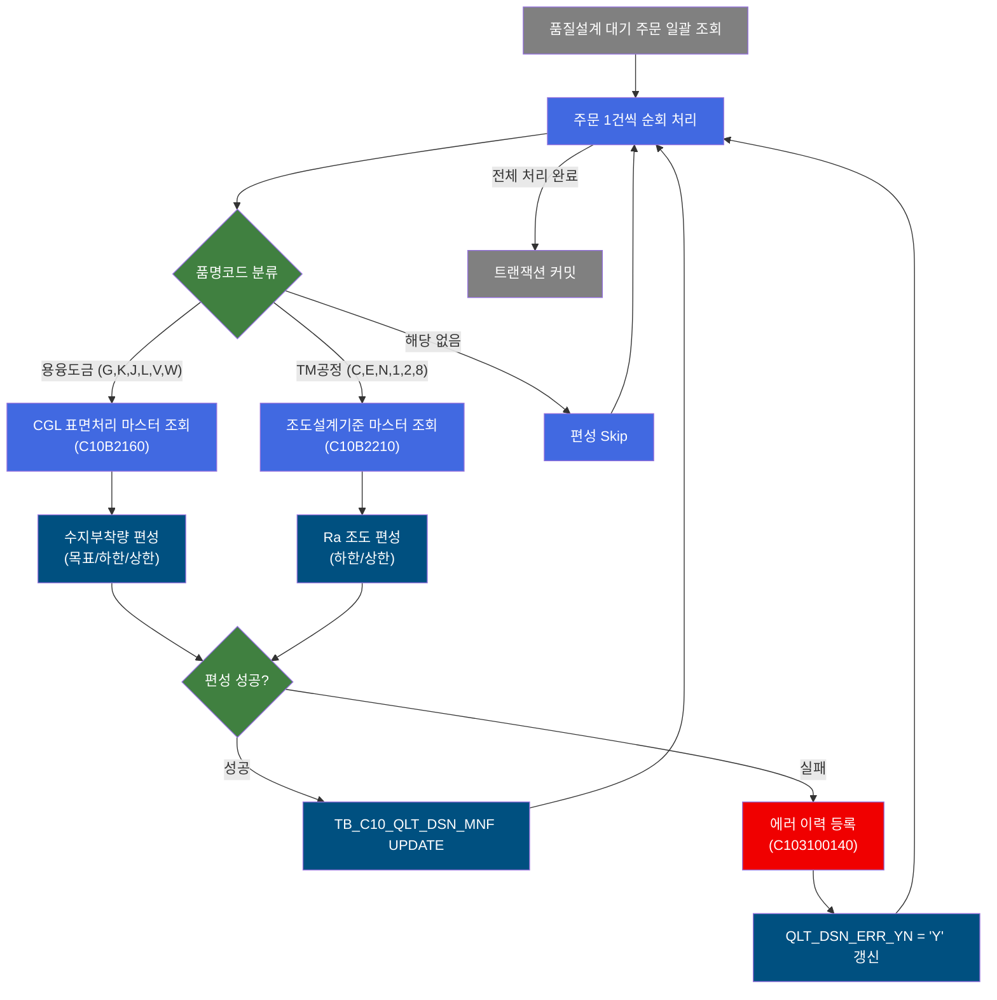
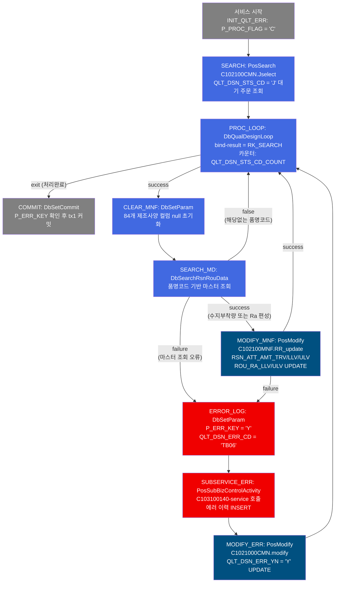
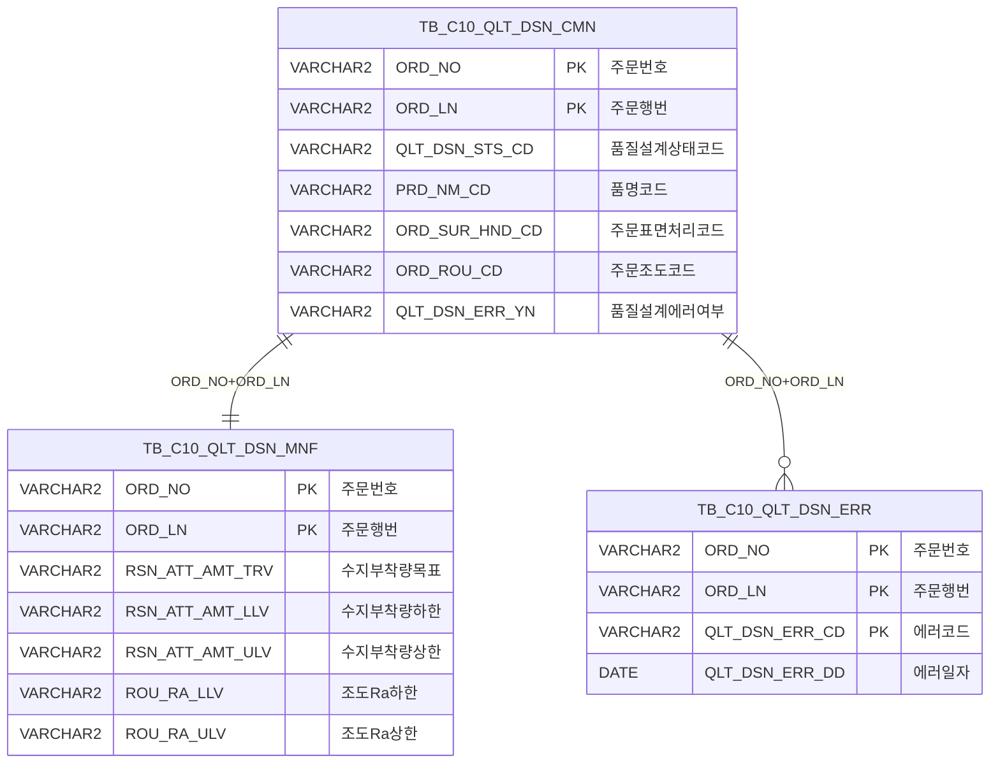

<h1 style="font-size: 40px; text-align: center; font-weight:
   bold; margin: 30px 0;">
  C103100050 레거시 시스템 분석 종합 보고서
</h1>


# 1. 시스템 개요
- **서비스 ID**: C103100050
- **업무명**: 품질설계 후처리/조도 편성 배치
- **분석 일시**: 2026-03-16 18:56 KST
- **분석 시간**: 약 5분
- **전체 Activity 수**: 9개 (Custom 2, Built-in 4, Common 3)
- **분석자**: Claude Opus 4.6
- **분석 도구**: /analyze-service C103100050
- **문서 버전**: 1.0

# 📊 비즈니스 프로세스 분석

## 시스템 목적

C103100050 서비스는 품질설계 대기 상태(`QLT_DSN_STS_CD = 'J'`)인 주문에 대해 **후처리(수지부착량) 또는 조도(Ra) 설계값을 자동 편성**하는 NUI(배치) 서비스이다.

대기 주문을 일괄 조회한 후, 각 주문의 품명코드(PRD_NM_CD)에 따라 두 가지 제품군으로 분류한다. 용융도금 제품군(G, K, J, L, V, W)은 CGL 표면처리 유형 Set기준(C10B2160) 마스터에서 수지부착량(목표/하한/상한)을 조회하여 편성하고, TM공정통과 제품군(C, E, N, 1, 2, 8)은 조도설계기준(C10B2210) 마스터에서 Ra(하한/상한) 값을 조회하여 편성한다. 편성된 값은 TB_C10_QLT_DSN_MNF(품질설계결과 제조사양) 테이블에 UPDATE된다.

편성 중 마스터 데이터 불일치 등의 에러가 발생하면 서브서비스 C103100140을 호출하여 TB_C10_QLT_DSN_ERR 테이블에 에러 이력을 등록하고, TB_C10_QLT_DSN_CMN의 QLT_DSN_ERR_YN을 'Y'로 갱신한다. 모든 주문 처리가 완료되면 트랜잭션을 커밋한다.

## 핵심 워크플로우 다이어그램



### 상세 워크플로우 다이어그램



## 주요 유즈케이스

### UC-01: 용융도금 제품 수지부착량 편성
- **Actor**: NUI 배치 프로세스 (품질설계 시스템)
- **목적**: 용융도금 제품(GI, GA 등)의 주문에 대해 CGL 표면처리 유형 Set기준 마스터에서 수지부착량 목표/하한/상한 값을 자동 편성

- **전제조건**:
  - TB_C10_QLT_DSN_CMN에 QLT_DSN_STS_CD = 'J'(대기) 상태인 주문이 존재
  - 해당 주문의 품명코드(PRD_NM_CD)가 G, K, J, L, V, W 중 하나
  - C10B2160 마스터에 해당 품명코드 + 주문표면처리코드 조합의 기준값이 등록되어 있음

- **주요 흐름**:
  1. 배치 서비스 시작 → P_PROC_FLAG = 'C' 초기화
  2. C102100CMN.Jselect로 대기 주문 일괄 조회
  3. DbQualDesignLoop가 조회 결과를 1건씩 순회 → ORD_NO, ORD_LN, PRD_NM_CD, ORD_SUR_HND_CD, ORD_ROU_CD 바인딩
  4. CLEAR_MNF에서 84개 제조사양 컬럼을 null 초기화
  5. DbSearchRsnRouData가 PRD_NM_CD 확인 → 용융도금 그룹 판별
  6. C10B2160 마스터에서 수지부착량(RSN_ATT_AMT_TRV/LLV/ULV) 조회, Ra 값은 null 설정
  7. C102100MNF.RR_update로 TB_C10_QLT_DSN_MNF에 편성값 UPDATE

- **대체 흐름**:
  - 마스터 조회 결과 0건: FALSE 반환 → 편성 Skip, 다음 주문으로 진행
  - 마스터 조회 결과 >1건: FAILURE (ERRCD_KK61) → 에러 등록 → QLT_DSN_ERR_YN = 'Y' 갱신

- **후행조건**:
  - TB_C10_QLT_DSN_MNF에 수지부착량 목표/하한/상한 값이 갱신됨
  - 타 그룹(조도) 값은 null로 초기화됨

### UC-02: TM공정 제품 조도(Ra) 편성
- **Actor**: NUI 배치 프로세스 (품질설계 시스템)
- **목적**: TM(Temper Mill) 통과 제품의 주문에 대해 조도설계기준 마스터에서 Ra 하한/상한 값을 자동 편성

- **전제조건**:
  - TB_C10_QLT_DSN_CMN에 대기 주문이 존재
  - 해당 주문의 품명코드(PRD_NM_CD)가 C, E, N, 1, 2, 8 중 하나
  - C10B2210 마스터에 해당 품명코드 + 주문조도코드 조합의 기준값이 등록되어 있음

- **전제조건**:
  - TB_C10_QLT_DSN_CMN에 QLT_DSN_STS_CD = 'J' 상태인 주문 존재
  - PRD_NM_CD가 C, E, N, 1, 2, 8 중 하나

- **주요 흐름**:
  1. PROC_LOOP에서 주문 1건 바인딩
  2. CLEAR_MNF에서 기존 제조사양 컬럼 초기화
  3. DbSearchRsnRouData가 PRD_NM_CD 확인 → TM공정 그룹 판별
  4. C10B2210 마스터에서 조도 Ra(ROU_RA_LLV/ULV) 조회, 수지부착량 값은 null 설정
  5. C102100MNF.RR_update로 TB_C10_QLT_DSN_MNF에 편성값 UPDATE

- **대체 흐름**:
  - 마스터 조회 결과 0건: 편성 Skip
  - 마스터 조회 결과 >1건: FAILURE (ERRCD_KK65) → 에러 등록

- **후행조건**:
  - TB_C10_QLT_DSN_MNF에 Ra 하한/상한 값이 갱신됨

### UC-03: 편성 에러 처리
- **Actor**: NUI 배치 프로세스
- **목적**: 후처리/조도 편성 중 마스터 데이터 불일치 등 에러 발생 시 에러 이력을 등록하고 해당 주문을 에러 상태로 표시

- **전제조건**:
  - DbSearchRsnRouData에서 마스터 조회 결과 >1건(복수 조회 오류) 발생
  - 또는 MODIFY_MNF UPDATE 실패

- **주요 흐름**:
  1. SEARCH_MD 또는 MODIFY_MNF에서 failure 전이 발생
  2. ERROR_LOG에서 P_ERR_KEY = 'Y', QLT_DSN_ERR_CD = 'TB06' 설정
  3. SUBSERVICE_ERR: C103100140-service 호출 → TB_C10_QLT_DSN_ERR에 에러 INSERT (중복 방지 로직 포함)
  4. MODIFY_ERR: C1021000CMN.modify로 TB_C10_QLT_DSN_CMN의 QLT_DSN_ERR_YN = 'Y' UPDATE
  5. PROC_LOOP로 복귀하여 다음 주문 처리 계속

- **대체 흐름**:
  - 동일 주문+에러코드가 이미 등록된 경우: C103100140 서브서비스 내 중복 체크로 INSERT Skip

- **후행조건**:
  - TB_C10_QLT_DSN_ERR에 에러 이력 등록
  - TB_C10_QLT_DSN_CMN의 QLT_DSN_ERR_YN = 'Y'로 갱신
  - 에러 발생 주문 이후의 주문도 계속 처리됨 (배치 중단 없음)

---
## 비즈니스 로직 상세

### 1. 품명코드 기반 제품군 분류 및 마스터 조회 (DbSearchRsnRouData)

- **목적**: 주문의 품명코드에 따라 적용할 표면 품질 기준을 결정하고 해당 마스터에서 설계값을 편성

- **처리 케이스**:

  **[케이스 1: 용융도금 제품군]**
  ```
    조건: PRD_NM_CD IN ('G', 'K', 'J', 'L', 'V', 'W')
    처리:
      1. 조회 키: 품명코드(PRD_NM_CD) + 주문표면처리코드(ORD_SUR_HND_CD)
      2. C10B2160(CGL 표면처리 유형 Set기준) 마스터 조회
      3. 결과 1건 → RSN_ATT_AMT_TRV(목표), RSN_ATT_AMT_LLV(하한), RSN_ATT_AMT_ULV(상한) 편성
      4. ROU_RA_LLV, ROU_RA_ULV는 null 초기화 (상호 배타적 보장)
  ```

  **[케이스 2: TM공정통과 제품군]**
  ```
    조건: PRD_NM_CD IN ('C', 'E', 'N', '1', '2', '8')
    처리:
      1. 조회 키: 품명코드(PRD_NM_CD) + 주문조도코드(ORD_ROU_CD)
      2. C10B2210(조도설계기준) 마스터 조회
      3. 결과 1건 → ROU_RA_LLV(하한), ROU_RA_ULV(상한) 편성
      4. RSN_ATT_AMT_LLV, RSN_ATT_AMT_ULV는 null 초기화 (상호 배타적 보장)
  ```

  **[케이스 3: 해당 없는 제품군]**
  ```
    조건: 두 그룹 모두 해당하지 않는 품명코드
    처리:
      1. FALSE 반환 → 후처리/조도 편성 단계 Skip
      2. 바로 다음 주문 처리로 진행
  ```

- **예외 처리**:
  - 품명코드 Null: ERRCD_KS11 설정 → FAILURE 반환
  - 용융도금 마스터 복수건 조회: ERRCD_KK61 → FAILURE (에러 등록)
  - TM공정 마스터 복수건 조회: ERRCD_KK65 → FAILURE (에러 등록)
  - 마스터 0건: FALSE → 편성 Skip (에러 아님)

### 2. ResultSet 루프 제어 (DbQualDesignLoop)

- **목적**: 이전 Activity가 조회한 대기 주문 ResultSet을 1건씩 순회하며 후속 편성 Activity 체인이 단건 처리할 수 있도록 연결

- **처리 케이스**:

  **[케이스 1: 정상 루프 진행]**
  ```
    조건: procCount > 0 (남은 처리 건수 있음)
    처리:
      1. procCount -= 1, this_row = total_row - procCount (순방향 인덱스 계산)
      2. P_ERR_KEY = 'N', QLT_DSN_ERR_YN = '' 초기화
      3. bindSet.reset() 후 this_row번째 Row 탐색
      4. param0~4 바인딩: ORD_NO, ORD_LN, PRD_NM_CD, ORD_SUR_HND_CD, ORD_ROU_CD
      5. success 반환 → CLEAR_MNF로 진행
  ```

  **[케이스 2: 루프 종료]**
  ```
    조건: procCount == 0 (모든 주문 처리 완료)
    처리:
      1. 카운터 변수 ctx에서 제거
      2. exit 반환 → COMMIT Activity로 진행
  ```

### 3. 에러 등록 및 에러 플래그 갱신

- **목적**: 편성 실패 주문에 대해 에러 이력을 기록하고 에러 상태를 표시하되, 배치 전체를 중단하지 않고 계속 진행

- **처리 케이스**:

  **[정상 에러 등록 흐름]**
  ```
    조건: SEARCH_MD failure 또는 MODIFY_MNF failure 발생
    처리:
      1. ERROR_LOG: P_ERR_KEY = 'Y', QLT_DSN_ERR_CD = 'TB06' 설정
      2. SUBSERVICE_ERR: C103100140-service 호출 (기존 트랜잭션 공유)
         - 중복 체크 후 신규 에러만 TB_C10_QLT_DSN_ERR에 INSERT
      3. MODIFY_ERR: TB_C10_QLT_DSN_CMN의 QLT_DSN_ERR_YN = 'Y'로 UPDATE
      4. PROC_LOOP로 복귀 → 다음 주문 처리 계속
  ```

---

# ⚙️ Java 컴포넌트 분석

## Custom Activity 상세 분석

### 2개 Custom Activity 발견

### 1. DbSearchRsnRouData (SEARCH_MD)
- **클래스명**: `com.unionsteel.mes.c10.activity.nui.DbSearchRsnRouData`
- **액티비티명**: SEARCH_MD
- **파일 경로**: `src/com/unionsteel/mes/c10/activity/nui/DbSearchRsnRouData.java`
- **주요 기능**: 품명코드 기반 후처리(수지부착량) 또는 조도(Ra) 설계값 편성
- **라인 수**: 183 | **메소드 수**: 1개

> 품명코드(PRD_NM_CD)에 따라 제품군을 두 그룹으로 분류한다. 용융도금 제품군은 C10B2160 마스터에서 수지부착량(하한/상한)을 편성하고, TM공정통과 제품군은 C10B2210 마스터에서 Ra(하한/상한) 값을 편성한다. 두 그룹은 상호 배타적이므로 한 그룹의 값이 등록될 때 다른 그룹의 값은 null로 초기화한다.

📎 **[상세 분석 보고서](../customClass/com.unionsteel.mes.c10.activity.nui.DbSearchRsnRouData_class_analysis.md)**

---

### 2. DbQualDesignLoop (PROC_LOOP)
- **클래스명**: `com.unionsteel.mes.c10.activity.nui.DbQualDesignLoop`
- **액티비티명**: PROC_LOOP
- **파일 경로**: `src/com/unionsteel/mes/c10/activity/nui/DbQualDesignLoop.java`
- **주요 기능**: ResultSet 순회 루프 제어 (1건씩 후속 Activity 체인에 바인딩)
- **라인 수**: 171 | **메소드 수**: 1개

> 이전 서비스(PosSearch)에서 조회한 PosRowSet을 1건씩 순회하며, ORD_NO/ORD_LN/PRD_NM_CD/ORD_SUR_HND_CD/ORD_ROU_CD를 PosContext에 바인딩한다. 역방향 카운터 기반 순방향 인덱싱 방식(this_row = total_row - procCount)으로, 매 루프마다 bindSet.reset() 후 전체 재탐색한다 (O(n^2) 특성). 40개 이상 서비스에서 공유 사용되는 공통 컴포넌트이다.

📎 **[상세 분석 보고서](../customClass/com.unionsteel.mes.c10.activity.nui.DbQualDesignLoop_class_analysis.md)**

---

# 💾 데이터 요구사항

## 핵심 테이블

### 1. TB_C10_QLT_DSN_CMN - (품질설계결과 공통)
| 컬럼명 | 타입 | PK | 설명 |
|--------|------|----|------|
| ORD_NO | VARCHAR2 | ✅ | 주문번호 |
| ORD_LN | VARCHAR2 | ✅ | 주문행번 |
| QLT_DSN_STS_CD | VARCHAR2 | | 품질설계상태코드 ('J'=대기) |
| PRD_NM_CD | VARCHAR2 | | 품명코드 (제품군 분류 기준) |
| ORD_SUR_HND_CD | VARCHAR2 | | 주문표면처리코드 |
| ORD_ROU_CD | VARCHAR2 | | 주문조도코드 |
| QLT_DSN_ERR_YN | VARCHAR2 | | 품질설계에러여부 ('Y'=에러) |
| PLNT_TP | VARCHAR2 | | 공장유형 |
| PRD_SHP | VARCHAR2 | | 제품형상 |
| FLOW_CHL | VARCHAR2 | | 유통경로 |
| ORD_KND | VARCHAR2 | | 주문종류 |
| ORD_EXC_THK | NUMBER | | 주문규격두께 |
| ORD_EXC_WTH | NUMBER | | 주문규격폭 |
| LAST_UPDATE_TIMESTAMP | VARCHAR2 | | 최종변경일시 |

### 2. TB_C10_QLT_DSN_MNF - (품질설계결과 제조사양)
| 컬럼명 | 타입 | PK | 설명 |
|--------|------|----|------|
| ORD_NO | VARCHAR2 | ✅ | 주문번호 |
| ORD_LN | VARCHAR2 | ✅ | 주문행번 |
| RSN_ATT_AMT_TRV | VARCHAR2 | | 수지부착량 기준목표 |
| RSN_ATT_AMT_LLV | VARCHAR2 | | 수지부착량 기준하한 |
| RSN_ATT_AMT_ULV | VARCHAR2 | | 수지부착량 기준상한 |
| ROU_RA_LLV | VARCHAR2 | | 조도 Ra 하한값 |
| ROU_RA_ULV | VARCHAR2 | | 조도 Ra 상한값 |
| LAST_UPDATED_OBJECT_TYPE | VARCHAR2 | | 최종변경OBJECT유형 |
| LAST_UPDATED_OBJECT_ID | VARCHAR2 | | 최종변경OBJECTID |
| LAST_UPDATE_PROGRAM_ID | VARCHAR2 | | 최종변경프로그램ID |
| LAST_UPDATE_TIMESTAMP | VARCHAR2 | | 최종변경일시 |

### 3. TB_C10_QLT_DSN_ERR - (품질설계 에러 이력)
| 컬럼명 | 타입 | PK | 설명 |
|--------|------|----|------|
| ORD_NO | VARCHAR2 | ✅ | 주문번호 |
| ORD_LN | VARCHAR2 | ✅ | 주문행번 |
| QLT_DSN_ERR_CD | VARCHAR2 | ✅ | 품질설계에러코드 |
| QLT_DSN_ERR_DD | DATE | | 품질설계에러일자 (SYSDATE) |

## 데이터 플로우

### 1. 대기 주문 조회
```
[배치 시작 - 대기 주문 일괄 조회]
서비스 시작
→ C102100CMN.Jselect
  FROM TB_C10_QLT_DSN_CMN
  WHERE QLT_DSN_STS_CD = 'J'
→ 전체 대기 주문을 RK_SEARCH ResultSet에 적재
```

### 2. 후처리/조도 편성 UPDATE
```
[주문별 편성값 UPDATE]
PROC_LOOP에서 주문 1건 추출
→ CLEAR_MNF: 84개 제조사양 컬럼 null 초기화
→ SEARCH_MD: 품명코드 기반 마스터 조회 (C10B2160 또는 C10B2210)
→ C102100MNF.RR_update
  UPDATE TB_C10_QLT_DSN_MNF
  SET RSN_ATT_AMT_TRV = ?, RSN_ATT_AMT_LLV = ?, RSN_ATT_AMT_ULV = ?,
      ROU_RA_LLV = ?, ROU_RA_ULV = ?
  WHERE ORD_NO = ? AND ORD_LN = ?
```

### 3. 에러 처리
```
[편성 에러 발생 시]
ERROR_LOG: QLT_DSN_ERR_CD = 'TB06' 설정
→ C103100140-service: 중복 체크 후 TB_C10_QLT_DSN_ERR INSERT
→ C1021000CMN.modify
  UPDATE TB_C10_QLT_DSN_CMN
  SET QLT_DSN_ERR_YN = 'Y'
  WHERE ORD_NO = ? AND ORD_LN = ?
```

## SQL 일람표

| SQL 이름 | 쿼리 ID | 타입 | 출처 | 테이블 |
|---------|---------|-----|------|--------|
| 대기 주문 조회 | C102100CMN.Jselect | SELECT | Service | TB_C10_QLT_DSN_CMN |
| 에러여부 UPDATE | C1021000CMN.modify | UPDATE | Service | TB_C10_QLT_DSN_CMN |
| 후처리/조도 편성 UPDATE | C102100MNF.RR_update | UPDATE | Service | TB_C10_QLT_DSN_MNF |

## ER 다이어그램 (핵심 관계)



관계 설명:
- **TB_C10_QLT_DSN_CMN**이 중심 테이블로 주문 기본 정보와 품질설계 상태를 관리
- **TB_C10_QLT_DSN_MNF**는 1:1 관계로 주문별 제조사양(후처리/조도 설계값)을 저장
- **TB_C10_QLT_DSN_ERR**는 1:N 관계로 주문별 복수 에러코드를 이력 관리 (복합 PK: ORD_NO + ORD_LN + QLT_DSN_ERR_CD)

---

# 🔗 서브서비스

## 서브서비스 요약

| 서비스 ID | 설명 | 호출 액티비티 | 트랜잭션 | 상세 분석 |
|-----------|------|-------------|---------|----------|
| C103100140 | 품질설계결과 에러 등록 (중복 방지) | SUBSERVICE_ERR | 기존 트랜잭션 공유 | [상세 분석](./C103100140_legacy_analysis.md) |

### C103100140 - 품질설계결과 에러 등록
품질설계 과정에서 발생한 에러 정보를 TB_C10_QLT_DSN_ERR 테이블에 등록하는 서비스이다. DbSearchCmnErrorCheck Activity가 ORD_NO + ORD_LN + QLT_DSN_ERR_CD 복합키로 기존 레코드 존재 여부를 조회하여, 중복이 없을 경우에만 PosInsert Activity가 신규 에러 레코드를 INSERT한다.
(Activity 2개, SQL Key 2개)

# 📌 특이사항 및 주의사항

## 1. 84개 컬럼 null 초기화 (CLEAR_MNF)
- **대량 파라미터 초기화**: 루프 내 매 주문 처리마다 CLEAR_MNF Activity에서 84개 제조사양 컬럼을 `sp_null`로 초기화한다. 이전 주문의 편성값이 다음 주문에 오염되는 것을 방지하기 위한 조치이나, 서비스 XML의 가독성과 유지보수성을 저하시키는 요인이다.

## 2. 루프 성능 특성 (O(n^2))
- **DbQualDesignLoop의 전체 재탐색**: 매 루프마다 `bindSet.reset()` 후 처음부터 this_row 위치까지 순회하는 방식으로, 처리 대상 주문이 N건이면 최대 N*(N+1)/2회 탐색이 발생한다. 대기 주문이 수백 건 이상일 경우 성능 이슈가 될 수 있다.

## 3. 에러 발생 시에도 배치 계속 진행
- **비중단 에러 처리**: 개별 주문의 편성 에러가 발생해도 배치 전체를 중단하지 않고 에러 이력을 등록한 후 다음 주문으로 계속 진행한다. P_ERR_KEY와 QLT_DSN_ERR_YN 플래그를 매 루프 시작 시 초기화하여 이전 에러 상태가 이월되지 않도록 보장한다.

## 4. 상호 배타적 필드 초기화 패턴
- **용융도금/TM공정 필드 상호 배타**: 수지부착량(RSN_ATT_AMT) 편성 시 조도(ROU_RA) 값을 null로, 조도 편성 시 수지부착량 값을 null로 초기화한다. 이는 이전 편성 단계에서 잘못 설정된 값이 잔류하지 않도록 하는 안전장치이다.

## 5. 에러코드 TB06 하드코딩
- **에러코드 고정**: ERROR_LOG Activity에서 QLT_DSN_ERR_CD = 'TB06'이 서비스 XML에 하드코딩되어 있다. 이 에러코드는 "후처리/조도 편성 오류"를 의미하며, 에러 유형 구분 없이 단일 코드만 사용된다.

## 6. 서브서비스 트랜잭션 공유
- **C103100140 트랜잭션**: `new-transaction="false"`로 설정되어 부모 서비스의 트랜잭션(tx1)을 공유한다. 에러 등록 INSERT와 에러 플래그 UPDATE가 동일 트랜잭션 내에서 수행되어, 최종 COMMIT Activity에서 일괄 커밋된다.

# 📚 참고 문서

- **Query SQL**:
  - `src/query/C102100CMN-query.glue_sql` (C102100CMN.Jselect, C1021000CMN.modify)
  - `src/query/C102100MNF-query.glue_sql` (C102100MNF.RR_update)
- **Custom Java 클래스**:
  - `src/com/unionsteel/mes/c10/activity/nui/DbSearchRsnRouData.java`
  - `src/com/unionsteel/mes/c10/activity/nui/DbQualDesignLoop.java`
- **서비스 XML**: `src/service/C103100050-service.xml`
- **서브서비스**: `src/service/C103100140-service.xml` → [분석 보고서](./C103100140_legacy_analysis.md)
