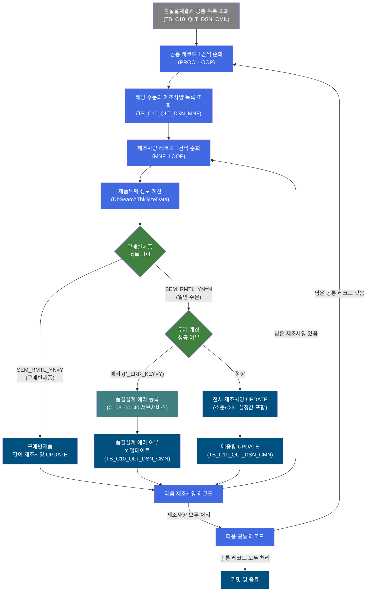
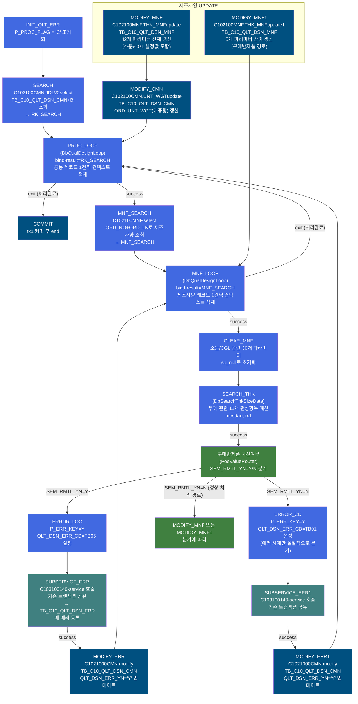
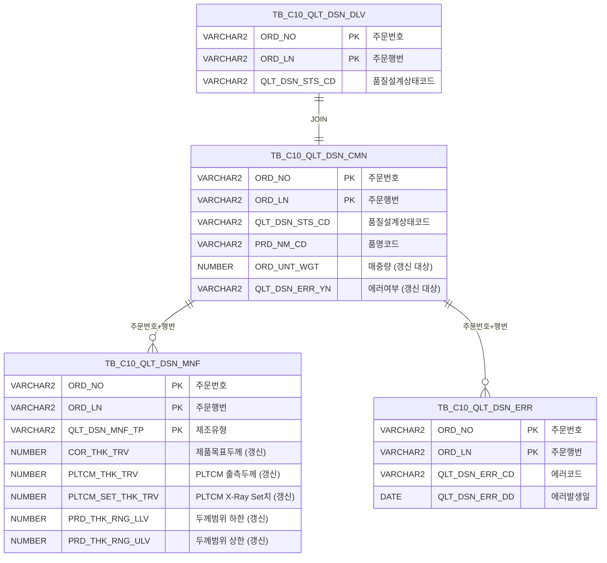

<h1 style="font-size: 40px; text-align: center; font-weight:
   bold; margin: 30px 0;">
  C103100070 레거시 시스템 분석 종합 보고서
</h1>


# 1. 시스템 개요
- **서비스 ID**: C103100070
- **업무명**: 품질설계결과 두께·제조사양 편성 (NUI 배치)
- **분석 일시**: 2026-03-16 KST
- **분석 시간**: 약 20분
- **전체 Activity 수**: 17개 (Custom 3, Built-in 14)
- **분석자**: Claude Sonnet 4.6
- **분석 도구**: /analyze-service C103100070
- **문서 버전**: 1.0

# 📊 비즈니스 프로세스 분석

## 시스템 목적

C103100070은 품질설계결과에 대해 **제품두께 관련 정보를 자동 계산·편성하고, 품질설계결과 공통 및 제조사양 테이블을 일괄 갱신**하는 NUI(배치) 서비스이다. 상위 시스템 또는 스케줄러로부터 주문번호(ORD_NO), 주문행번(ORD_LN), 품질설계상태코드가 담긴 결과셋을 수신하여, 주문별·제조유형별로 두께 편성 → 품질설계에러 등록 → 제조사양 갱신의 전체 프로세스를 수행한다.

서비스의 중심 흐름은 두 레벨의 루프로 구성된다. 외부 루프(PROC_LOOP)는 품질설계결과 공통(TB_C10_QLT_DSN_CMN) 대상 레코드를 1건씩 순회하며, 내부 루프(MNF_LOOP)는 각 주문에 대응하는 제조사양(TB_C10_QLT_DSN_MNF) 레코드를 순회한다. 각 레코드에 대해 `DbSearchThkSizeData`가 두께 관련 11개 항목을 계산하고, 에러 발생 시 `C103100140` 서브서비스를 호출하여 에러 이력을 등록한 뒤, 계산 결과를 제조사양 테이블에 갱신한다.

구매반제품(SEM_RMTL_YN=Y) 주문은 두께 계산 대부분을 건너뛰고 조기에 처리되어 전용 UPDATE 쿼리(THK_MNFupdate1)로 저장된다. 일반 주문은 전체 두께 계산 및 소둔/CGL 설정값을 포함한 완전한 제조사양 갱신(THK_MNFupdate)이 수행되며, 매중량(ORD_UNT_WGT)은 공통 테이블(TB_C10_QLT_DSN_CMN)에도 별도 업데이트된다.

## 핵심 워크플로우 다이어그램



### 상세 워크플로우 다이어그램



## 주요 유즈케이스

### UC-01: 일반 주문 제품두께·제조사양 편성

- **Actor**: NUI 배치 프로세스 / 품질설계 스케줄러
- **목적**: 품질설계결과 공통 대상 주문에 대해 제품두께 관련 11개 항목을 자동 계산하고 제조사양 테이블을 갱신하여 생산 공정에 필요한 두께 기준값을 확정
- **전제조건**:
  - TB_C10_QLT_DSN_CMN에 처리 대상 레코드(QLT_DSN_STS_CD 등 조회 조건 충족)가 존재
  - TB_C10_QLT_DSN_MNF에 해당 주문의 제조사양 레코드가 존재
  - EasyAccess 업무기준(C10B2060, C10B2070, C10B1051)이 정상 등록됨
  - qlt_dsn_mnf_tp = "1" (일반 제조유형)이거나 재질코드 첫글자 H/M 또는 품명코드 5/7

- **주요 흐름**:
  1. INIT_QLT_ERR Activity에서 P_PROC_FLAG = 'C'로 초기화
  2. SEARCH Activity에서 C102100CMN.JDLV2select 쿼리로 대상 레코드 전체 조회 (RK_SEARCH)
  3. PROC_LOOP(DbQualDesignLoop)에서 공통 레코드 1건 컨텍스트 적재
  4. MNF_SEARCH Activity에서 해당 주문의 제조사양 목록 조회 (MNF_SEARCH)
  5. MNF_LOOP(DbQualDesignLoop)에서 제조사양 레코드 1건 컨텍스트 적재
  6. CLEAR_MNF에서 소둔/CGL 관련 파라미터 30개 sp_null 초기화
  7. SEARCH_THK(DbSearchThkSizeData)에서 두께 11개 항목 계산 → SEM_RMTL_YN=N
  8. 구매반제품 차선여부 Router에서 SEM_RMTL_YN=N 경로 진입
  9. MODIFY_MNF Activity에서 C102100MNF.THK_MNFupdate 쿼리 실행 (42개 파라미터, TB_C10_QLT_DSN_MNF 갱신)
  10. MODIFY_CMN Activity에서 C102100CMN.UNT_WGTupdate로 매중량 갱신 (TB_C10_QLT_DSN_CMN)
  11. PROC_LOOP로 복귀 → 다음 레코드 처리
  12. 전체 처리 완료 후 COMMIT

- **대체 흐름**:
  - 두께 계산 에러 발생(P_ERR_KEY=Y): ERROR_CD 설정 → SUBSERVICE_ERR1 호출 → MODIFY_ERR1로 QLT_DSN_ERR_YN='Y' 업데이트 → 다음 주문으로 진행
  - C10B2060 조회 결과 없음: DbSearchThkSizeData에서 failure 반환 → 에러 처리 경로
  - C10B1051 조회 결과 없음: DbSearchThkSizeData에서 failure 반환 → 에러 처리 경로

- **후행조건**:
  - TB_C10_QLT_DSN_MNF에 두께 계산 결과(42개 항목) 갱신됨
  - TB_C10_QLT_DSN_CMN에 매중량(ORD_UNT_WGT) 갱신됨
  - 트랜잭션 tx1 커밋 완료

### UC-02: 구매반제품 간이 제조사양 편성

- **Actor**: NUI 배치 프로세스
- **목적**: 구매반제품(SEM_RMTL_YN=Y) 주문에 대해 두께 계산 전체를 건너뛰고 간이 항목만 저장하여 처리 효율 향상
- **전제조건**:
  - qlt_dsn_mnf_tp ≠ "1" AND 재질코드 첫글자 ≠ H/M AND 품명코드 ≠ 5/7 (구매반제품 조건)

- **주요 흐름**:
  1. SEARCH_THK에서 구매반제품 조기종료 체크 통과 → SEM_RMTL_YN = "Y" 반환
  2. 구매반제품 차선여부 Router에서 SEM_RMTL_YN=Y 경로 진입
  3. ERROR_LOG에서 P_ERR_KEY=Y, QLT_DSN_ERR_CD=TB06 설정 (에러 코드로 구매반제품 구분)
  4. SUBSERVICE_ERR(C103100140-service) 호출 → TB_C10_QLT_DSN_ERR에 TB06 에러 등록
  5. MODIFY_ERR에서 C1021000CMN.modify로 QLT_DSN_ERR_YN='Y' 업데이트
  6. MNF_LOOP로 복귀 → 다음 제조사양 처리 (MODIGY_MNF1로 간이 UPDATE)
  7. MNF_LOOP 소진 후 PROC_LOOP로 복귀

- **대체 흐름**:
  - 해당 없음 (구매반제품은 에러가 아니라 정상적 조기종료 처리)

- **후행조건**:
  - TB_C10_QLT_DSN_MNF에 간이 항목(5개)만 갱신됨 (MODIGY_MNF1 경로)
  - TB_C10_QLT_DSN_ERR에 TB06 에러코드 등록됨 (중복 방지 포함)
  - TB_C10_QLT_DSN_CMN에 QLT_DSN_ERR_YN='Y' 설정됨

### UC-03: 제조사양 레코드 존재 확인 및 반복 처리

- **Actor**: NUI 배치 프로세스
- **목적**: 1건의 공통 레코드에 대응하는 여러 제조유형(MNF) 레코드를 모두 처리
- **전제조건**:
  - TB_C10_QLT_DSN_MNF에 해당 ORD_NO + ORD_LN 대응 레코드가 1건 이상 존재
  - MNF_LOOP의 bind-result 키(MNF_SEARCH)가 PosContext에 설정됨

- **주요 흐름**:
  1. MNF_SEARCH에서 C102100MNF.select로 제조사양 전체 목록 조회
  2. MNF_LOOP에서 MNF_THK_COUNT 카운터 초기화 (최초 진입 시)
  3. 각 레코드에 대해 CLEAR_MNF → SEARCH_THK → 분기처리 → MODIFY 수행
  4. 처리 건수가 0이 되면 MNF_LOOP에서 "exit" 반환 → PROC_LOOP로 복귀

- **대체 흐름**:
  - 제조사양 레코드 없음: MNF_LOOP 첫 진입 시 count=0 → 즉시 exit → PROC_LOOP 복귀

- **후행조건**:
  - 해당 주문의 모든 제조유형 레코드가 처리됨
  - MNF_THK_COUNT 카운터가 ctx에서 제거됨

### UC-04: 품질설계 에러 이력 등록

- **Actor**: NUI 배치 프로세스 (두께 계산 에러 발생 시)
- **목적**: 두께 계산 실패 또는 구매반제품 식별 시 에러 코드를 에러 이력 테이블에 기록하여 품질설계 이력 추적 가능
- **전제조건**:
  - P_ERR_KEY = "Y" 상태로 진입
  - QLT_DSN_ERR_CD가 ctx에 설정됨 (TB06=구매반제품, TB01=두께계산에러 등)

- **주요 흐름**:
  1. SUBSERVICE_ERR 또는 SUBSERVICE_ERR1에서 C103100140-service 호출
  2. C103100140: DbSearchCmnErrorCheck가 중복 체크 수행
  3. 중복 없으면 PosInsert로 TB_C10_QLT_DSN_ERR에 INSERT
  4. MODIFY_ERR/MODIFY_ERR1에서 TB_C10_QLT_DSN_CMN.QLT_DSN_ERR_YN = 'Y' 갱신

- **대체 흐름**:
  - 동일 에러 이미 등록됨: C103100140에서 FAILURE 반환 → INSERT 건너뜀

- **후행조건**:
  - TB_C10_QLT_DSN_ERR에 에러 이력 기록됨 (신규인 경우)
  - TB_C10_QLT_DSN_CMN.QLT_DSN_ERR_YN = 'Y'로 갱신됨

---

## 비즈니스 로직 상세

### 1. 제품두께 편성 계산 (DbSearchThkSizeData)

- **목적**: 주문 제품의 재질·품명·두께구분·도금량 등 복합 조건에 따라 압연목표두께, 제품두께범위, PLTCM 출측두께, 제조표준값, 매중량 등 11개 편성항목을 자동 산출

- **처리 케이스**:

  **[케이스 1: 구매반제품 조기종료]**
  ```
  조건: qlt_dsn_mnf_tp ≠ "1" AND 재질코드 첫글자 ≠ H/M AND 품명코드 ≠ 5/7
  처리:
    1. SEM_RMTL_YN = "Y" 설정
    2. 두께 계산 전체 건너뜀
    3. "success" 즉시 반환
  ```

  **[케이스 2: 고객요청 압연두께 미지정 시 압연목표두께 계산]**
  ```
  조건: cus_req_rol_thk == 0 AND ord_thk_tp ≠ "3"
  처리:
    1. EasyAccess C10B2060 (압연두께Set치보정기준) 조회 - 10개 조건항목
    2. 결과 0건 → FAILURE (에러코드 KK82)
    3. 결과 2건 이상 → FAILURE (에러코드 KK83)
    4. 보정단위(CRN/PCN/TRK) × 두께구분(BMT/TCT) × 두께관리코드(5=TCT→BMT/6=BMT→TCT) 분기로 crm_thk 산출
  ```

  **[케이스 3: 고객요청 압연두께 지정 시]**
  ```
  조건: cus_req_rol_thk > 0 OR ord_thk_tp = "3"
  처리:
    1. 두께보정단위(CRN/PCN/TRK)와 두께구분(3=칼라TCT) 기반으로 crm_thk 산출
    2. 칼라TCT: 주문두께 + 고객요청 - 도막두께 - 도금두께 + 라미나두께
  ```

  **[케이스 4: 제품두께범위 계산 (품명별 분기)]**
  ```
  조건: 품명코드(prd_nm_cd)별 분기
  처리:
    - CR/P/O/F/H (A,B,C,D): 주문두께 ± 공차
    - CR칼라 (1,5,7):         주문두께 + 도막두께 ± 공차 - 라미나두께
    - EGI/GI/HGI/G·A/G·L (E,N,G,K,J,L,V,W): 주문두께 + 도금두께 ± 공차
    - 도금칼라 (2,3,4,6,8,9): 주문두께 + 도막두께 + 도금두께 ± 공차 - 라미나두께
  ```

  **[케이스 5: 제조표준기준 조회 (알미늄/스테인레스 제외)]**
  ```
  조건: 품명코드 ≠ 5(알미늄), 7(스테인레스)
  처리:
    1. EasyAccess C10B1051 조회 (5개 조건항목)
    2. 결과 0건 → FAILURE (KK13) / 2건 이상 → FAILURE (KK14)
    3. CR/EG 계열: 소둔로 설정값(일반ANN, HCANN) 저장
    4. GI/GA/GL 계열: CGL 라인별(#2~#5) 소둔Cycle·온도·속도 저장
  ```

- **계산 공식** (상세):

  ```
  [압연목표두께 crm_thk 핵심 공식]
  고객요청 없음 + CRN + TCT(2): crm_thk = 주문두께 - 도금두께 + 보정치
  고객요청 없음 + CRN + BMT(1): crm_thk = 주문두께 + 보정치
  고객요청 없음 + PCN + TCT(2): crm_thk = 주문두께 - 도금두께 + (주문두께 × 보정치/100)
  고객요청 없음 + PCN + BMT(1): crm_thk = 주문두께 + (주문두께 × 보정치/100)
  고객요청 없음 + TRK + TCT(2): crm_thk = 보정치 - 도금두께
  고객요청 없음 + TRK + BMT(1): crm_thk = 보정치
  고객요청 있음 + CRN + 칼라TCT(3): crm_thk = 주문두께 + 고객요청 - 도막두께 - 도금두께 + 라미나두께
  고객요청 있음 + PCN + 칼라TCT(3): BMT + (BMT × 고객요청/100)
  고객요청 있음 + TRK: crm_thk = 고객요청 그대로

  [PLTCM 출측두께]
  TRK 단위: pltcm_thk_trv = crm_thk
  그 외:    pltcm_thk_trv = crm_thk + crm_thk × sp_thk / 100

  [PLTCM X-Ray Set치]
  알미늄(5)/스테인레스(7): pltcm_set_thk_trv = ord_exc_thk (주문두께 그대로)
  그 외: DbCommonUtil.pltcm_x_Ray() → 소수점 3번째 자리를 0/5/올림으로 정규화 (0.005 단위)

  [매중량 계산 - Coil 형태만 해당]
  알미늄(5):      두께 × 2.73 × 폭 / 1000
  스테인레스(7):  두께 × 7.74 × 폭 / 1000
  그 외:          ((PLTCM Set치 × 7.85) + 작업도금량합계/1000) × 폭 / 1000

  [소수점 처리]
  thk_dot():    소수점 이하 4자리 이상이면 3자리까지 버림
  pltcm_x_Ray(): 소수점 3번째 자리를 0/5/올림으로 변환
  CRN 단위 TCT: Math.round(crm_thk * 10000) / 10000 (4자리 반올림)
  ```

- **예외 처리**:
  - C10B2060 조회 결과 0건: 에러코드 KK82 설정 → FAILURE 반환
  - C10B2060 조회 결과 2건 이상: 에러코드 KK83 설정 → FAILURE 반환
  - C10B1051 조회 결과 0건: 에러코드 KK13 설정 → FAILURE 반환
  - C10B1051 조회 결과 2건 이상: 에러코드 KK14 설정 → FAILURE 반환
  - PCN/TRK + 두께관리코드 불일치: 에러코드 KK94 설정 → FAILURE 반환

---

### 2. DbQualDesignLoop 루프 제어 로직

- **목적**: 이전 Activity(PosSearch)가 조회한 ResultSet(PosRowSet)을 1건씩 순회 처리하기 위해 컨텍스트에 Row 데이터를 적재하고 루프 카운터를 관리

- **처리 케이스**:

  **[케이스 1: 루프 최초 진입]**
  ```
  조건: ctx에 countName 변수 없음
  처리:
    1. P_ERR_KEY = "N", BATCH_JOB = "true" ctx에 세팅
    2. bindSet.count() = total_row로 procCount 초기화
    3. procCount == 0이면 "exit" 반환 (처리 대상 없음)
    4. procCount -= 1, this_row = total_row - procCount 계산
    5. param0..N 바인딩 → ctx에 저장 후 "success" 반환
  ```

  **[케이스 2: 루프 반복]**
  ```
  조건: ctx에 countName 변수 있음
  처리:
    1. P_ERR_KEY = "N", QLT_DSN_ERR_YN = "" 재초기화
    2. ctx에서 procCount 읽기
    3. procCount == 0이면 ctx에서 카운터 제거 후 "exit" 반환
    4. bindSet.reset() 후 while 전체 순회로 this_row 탐색
    5. 해당 Row에서 param 바인딩 후 "success" 반환
  ```

  **[케이스 3: 루프 종료]**
  ```
  조건: procCount == 0
  처리:
    1. ctx.remove(countName) 로 카운터 변수 정리
    2. "exit" 반환 → 상위 흐름으로 복귀
  ```

- **계산 공식**:
  ```
  this_row(현재 처리 Row 인덱스) = total_row - procCount
  예시: 전체 6건이면
    1회차: procCount=6→5, this_row=1
    2회차: procCount=5→4, this_row=2
    ...
    6회차: procCount=1→0, this_row=6
    7회차: procCount=0 → "exit" 반환
  ```

- **예외 처리**:
  - param-count 미설정: "failure" 반환
  - bind-result 키 없음: NullPointerException → catch → "failure" 반환

---

# ⚙️ Java 컴포넌트 분석

## Custom Activity 상세 분석

### 3개 인스턴스 (2개 고유 클래스) Custom Activity 발견

### 1. DbSearchThkSizeData (SEARCH_THK)
- **클래스명**: `com.unionsteel.mes.c10.activity.nui.DbSearchThkSizeData`
- **액티비티명**: `SEARCH_THK`
- **파일 경로**: `src/com/unionsteel/mes/c10/activity/nui/DbSearchThkSizeData.java`
- **주요 기능**: 품질설계 편성 과정에서 제품두께 관련 정보 일체(압연목표두께, 제품두께범위, PLTCM 출측두께, 제조표준, 매중량 등 11개 항목)를 계산하고 PosContext에 저장
- **라인 수**: 876 | **메소드 수**: 1

> `DbSearchThkSizeData`는 품질설계 편성 과정에서 제품두께 관련 정보 일체를 계산·편성하는 NUI Activity 클래스이다. 주문 코일/시트의 재질, 품명, 두께구분, 고객요청 압연두께, 도금량 등 약 40여 개 입력값을 받아 EasyAccess 업무기준(C10B2070, C10B2060, C10B1051) 3종을 참조하여 압연목표두께, PLTCM 출측두께, 제품두께범위 상하한, 소둔/CGL 설정값, 매중량 등 11개 편성항목을 산출한다. 구매반제품(SEM_RMTL_YN=Y) 판단 시 두께 계산 전체를 건너뛰는 조기종료 로직을 포함한다.

📎 **[상세 분석 보고서](../customClass/com.unionsteel.mes.c10.activity.nui.DbSearchThkSizeData_class_analysis.md)**

---

### 2. DbQualDesignLoop (MNF_LOOP)
- **클래스명**: `com.unionsteel.mes.c10.activity.nui.DbQualDesignLoop`
- **액티비티명**: `MNF_LOOP`
- **파일 경로**: `src/com/unionsteel/mes/c10/activity/nui/DbQualDesignLoop.java`
- **주요 기능**: 이전 MNF_SEARCH Activity가 조회한 제조사양 ResultSet(MNF_SEARCH)을 1건씩 순회 처리하기 위한 루프 제어 액티비티. MNF_THK_COUNT 카운터 기반으로 처리 건수 관리
- **라인 수**: 171 | **메소드 수**: 1

> `DbQualDesignLoop`는 GLUE Framework 기반 NUI(배치) 서비스에서 이전 액티비티가 조회한 ResultSet을 1건씩 순회 처리하기 위한 루프 제어 액티비티이다. 이전 서비스(주로 PosSearch)에서 쿼리 결과로 얻은 PosRowSet을 순차적으로 읽으며, 한 건씩 PosContext에 세팅한 뒤 후속 액티비티 체인이 단건 기준으로 동작할 수 있도록 연결한다. 처리 건수가 0이 되면 "exit" 전이를 반환하여 루프를 종료한다. 사용 빈도가 매우 높아 40개 이상의 서비스 XML에서 참조된다.

📎 **[상세 분석 보고서](../customClass/com.unionsteel.mes.c10.activity.nui.DbQualDesignLoop_class_analysis.md)**

---

### 3. DbQualDesignLoop (PROC_LOOP)
- **클래스명**: `com.unionsteel.mes.c10.activity.nui.DbQualDesignLoop`
- **액티비티명**: `PROC_LOOP`
- **파일 경로**: `src/com/unionsteel/mes/c10/activity/nui/DbQualDesignLoop.java`
- **주요 기능**: 외부 루프 역할. SEARCH Activity가 조회한 공통 ResultSet(RK_SEARCH)을 1건씩 순회. QLT_DSN_STS_CD_COUNT 카운터 기반으로 처리 건수 관리. 동일 클래스(DbQualDesignLoop)를 서로 다른 프로퍼티(bind-result=RK_SEARCH, countName=QLT_DSN_STS_CD_COUNT, param-count=41)로 인스턴스화한 것
- **라인 수**: 171 | **메소드 수**: 1

> MNF_LOOP와 동일한 DbQualDesignLoop 클래스를 사용하되, bind-result=RK_SEARCH, countName=QLT_DSN_STS_CD_COUNT로 다른 ResultSet을 대상으로 동작한다. 41개 파라미터를 컨텍스트에 적재하여 후속 MNF_SEARCH 및 두께 계산 체인이 주문 단위로 처리될 수 있도록 한다.

📎 **[상세 분석 보고서](../customClass/com.unionsteel.mes.c10.activity.nui.DbQualDesignLoop_class_analysis.md)**

---

# 💾 데이터 요구사항

## 핵심 테이블

### 1. TB_C10_QLT_DSN_CMN - 품질설계결과 공통

| 컬럼명 | 타입 | PK | 설명 |
|--------|------|----|-----|
| ORD_NO | VARCHAR2 | ✅ | 주문번호 |
| ORD_LN | VARCHAR2 | ✅ | 주문행번 |
| QLT_DSN_STS_CD | VARCHAR2 | | 품질설계상태코드 |
| PLNT_TP | VARCHAR2 | | 공장구분 |
| PRD_NM_CD | VARCHAR2 | | 품명코드 |
| PRD_SHP | VARCHAR2 | | 제품형태 (C=Coil, S=Sheet) |
| FLOW_CHL | VARCHAR2 | | 유통경로 |
| ORD_KND | VARCHAR2 | | 주문종류 |
| ORD_PRD_GRD | VARCHAR2 | | 주문제품등급 |
| ORD_USG_CD | VARCHAR2 | | 주문용도코드 |
| CUS_CD | VARCHAR2 | | 고객코드 |
| FNL_CUS_CD | VARCHAR2 | | 최종고객코드 |
| SPC_AVR | VARCHAR2 | | 규격기관 |
| ORD_EXC_THK | NUMBER | | 주문두께 |
| ORD_EXC_WTH | NUMBER | | 주문폭 |
| ORD_EXC_LTH | NUMBER | | 주문길이 |
| ORD_UNT_WGT | NUMBER | | 매중량 (배치 처리 결과로 갱신) |
| QLT_DSN_ERR_YN | VARCHAR2 | | 품질설계에러여부 (배치 처리 결과로 갱신) |
| LAST_UPDATED_OBJECT_TYPE | VARCHAR2 | | 최종변경 OBJECT 유형 |
| LAST_UPDATED_OBJECT_ID | VARCHAR2 | | 최종변경 OBJECT ID |
| LAST_UPDATE_PROGRAM_ID | VARCHAR2 | | 최종변경 프로그램 ID |
| LAST_UPDATE_TIMESTAMP | DATE | | 최종변경 일시 |

### 2. TB_C10_QLT_DSN_MNF - 품질설계결과 제조사양

| 컬럼명 | 타입 | PK | 설명 |
|--------|------|----|-----|
| ORD_NO | VARCHAR2 | ✅ | 주문번호 |
| ORD_LN | VARCHAR2 | ✅ | 주문행번 |
| QLT_DSN_MNF_TP | VARCHAR2 | ✅ | 품질설계 제조유형 |
| FUR_TP_GEN_ANN | VARCHAR2 | | 소둔로유형 (일반소둔) |
| HEAT_CYL_NO_GEN_ANN | VARCHAR2 | | 가열Cycle번호 (일반소둔) |
| COR_TM_GEN_ANN | NUMBER | | 코어온도 (일반소둔) |
| COIL_TMP_GEN_ANN | NUMBER | | 코일온도 (일반소둔) |
| CLG_END_TMP_GEN_ANN | NUMBER | | 냉각종료온도 (일반소둔) |
| FUR_TP_HC_ANN | VARCHAR2 | | 소둔로유형 (HCANN) |
| HEAT_CYL_NO_HC_ANN | VARCHAR2 | | 가열Cycle번호 (HCANN) |
| HEAT_CYL_NO_2CGL~5CGL | VARCHAR2 | | CGL #2~#5 가열Cycle번호 |
| HTG_TEM_2CGL~5CGL | NUMBER | | CGL #2~#5 가열온도 |
| CLG_TEM_2CGL~5CGL | NUMBER | | CGL #2~#5 냉각온도 |
| SHK_TM_2CGL~5CGL | NUMBER | | CGL #2~#5 소둔Cycle |
| LN_SPD_2CGL~5CGL | NUMBER | | CGL #2~#5 라인속도 |
| COR_THK_TRV | NUMBER | | 제품목표두께 (계산 결과) |
| PRD_THK_RNG_LLV | NUMBER | | 제품두께범위 하한 (보증) |
| PRD_THK_RNG_ULV | NUMBER | | 제품두께범위 상한 (보증) |
| PLTCM_THK_TRV | NUMBER | | PLTCM 출측두께 |
| PLTCM_SET_THK_TRV | NUMBER | | PLTCM X-Ray Set치 |
| PRD_LTH_RNG_LLV | NUMBER | | 제품길이범위 하한 (Sheet) |
| PRD_LTH_RNG_ULV | NUMBER | | 제품길이범위 상한 (Sheet) |
| PRD_THK_SPC_RNG_LLV | NUMBER | | 제품두께규격범위 하한 |
| PRD_THK_SPC_RNG_ULV | NUMBER | | 제품두께규격범위 상한 |
| LAST_UPDATE_TIMESTAMP | DATE | | 최종변경 일시 |

### 3. TB_C10_QLT_DSN_ERR - 품질설계 에러 이력

| 컬럼명 | 타입 | PK | 설명 |
|--------|------|----|-----|
| ORD_NO | VARCHAR2 | ✅ | 주문번호 |
| ORD_LN | VARCHAR2 | ✅ | 주문행번 |
| QLT_DSN_ERR_CD | VARCHAR2 | | 품질설계에러코드 (TB06=구매반제품, TB01=두께에러 등) |
| QLT_DSN_ERR_DD | DATE | | 에러발생일 (SYSDATE 자동 설정) |
| CREATION_TIMESTAMP | DATE | | 생성 일시 |
| LAST_UPDATE_TIMESTAMP | DATE | | 최종변경 일시 |

## 데이터 플로우

### 1. 조회

```
[서비스 초기 대상 목록 조회]
서비스 기동
→ SEARCH (C102100CMN.JDLV2select)
  FROM TB_C10_QLT_DSN_DLV A
  INNER JOIN TB_C10_QLT_DSN_CMN B ON A.ORD_NO = B.ORD_NO AND A.ORD_LN = B.ORD_LN
  (품질설계상태코드 조건 등)
→ RK_SEARCH 키로 PosContext에 저장

[주문별 제조사양 조회]
PROC_LOOP에서 ORD_NO, ORD_LN 컨텍스트 적재 후
→ MNF_SEARCH (C102100MNF.select)
  FROM TB_C10_QLT_DSN_MNF
  WHERE ORD_NO = :ORD_NO AND ORD_LN = :ORD_LN
→ MNF_SEARCH 키로 PosContext에 저장
```

### 2. 갱신 (일반 주문)

```
DbSearchThkSizeData 계산 완료 (SEM_RMTL_YN=N) 후
→ MODIFY_MNF (C102100MNF.THK_MNFupdate)
  UPDATE TB_C10_QLT_DSN_MNF
  SET COR_THK_TRV, PLTCM_THK_TRV, PLTCM_SET_THK_TRV,
      PRD_THK_RNG_LLV, PRD_THK_RNG_ULV, PRD_THK_SPC_RNG_LLV, PRD_THK_SPC_RNG_ULV,
      PRD_LTH_RNG_LLV, PRD_LTH_RNG_ULV,
      FUR_TP_GEN_ANN, HEAT_CYL_NO_GEN_ANN, COR_TM_GEN_ANN, COIL_TMP_GEN_ANN, CLG_END_TMP_GEN_ANN,
      FUR_TP_HC_ANN, HEAT_CYL_NO_HC_ANN, ...(CGL #2~#5 설정값),
      LAST_UPDATED_OBJECT_TYPE, ... (감사 컬럼)
  WHERE ORD_NO = :ORD_NO AND ORD_LN = :ORD_LN AND QLT_DSN_MNF_TP = :QLT_DSN_MNF_TP
→ MODIFY_CMN (C102100CMN.UNT_WGTupdate)
  UPDATE TB_C10_QLT_DSN_CMN
  SET ORD_UNT_WGT = :ORD_UNT_WGT, 감사컬럼
  WHERE ORD_NO = :ORD_NO AND ORD_LN = :ORD_LN
```

### 3. 갱신 (구매반제품)

```
DbSearchThkSizeData 조기종료 (SEM_RMTL_YN=Y) 후
→ ERROR_LOG (P_ERR_KEY=Y, QLT_DSN_ERR_CD=TB06)
→ SUBSERVICE_ERR (C103100140-service) → TB_C10_QLT_DSN_ERR INSERT
→ MODIFY_ERR (C1021000CMN.modify)
  UPDATE TB_C10_QLT_DSN_CMN
  SET QLT_DSN_ERR_YN = 'Y', 감사컬럼
  WHERE ORD_NO = :ORD_NO AND ORD_LN = :ORD_LN
→ MODIGY_MNF1 (C102100MNF.THK_MNFupdate1)
  UPDATE TB_C10_QLT_DSN_MNF
  SET PRD_THK_SPC_RNG_ULV, 감사컬럼 (간이 5개 항목)
  WHERE ORD_NO = :ORD_NO AND ORD_LN = :ORD_LN AND QLT_DSN_MNF_TP = :QLT_DSN_MNF_TP
```

### 4. 에러 처리 (두께 계산 실패)

```
DbSearchThkSizeData에서 FAILURE 반환 (P_ERR_KEY=Y 상태) 시
→ ERROR_CD (P_ERR_KEY=Y, QLT_DSN_ERR_CD=TB01)
→ SUBSERVICE_ERR1 (C103100140-service) → TB_C10_QLT_DSN_ERR INSERT
→ MODIFY_ERR1 (C1021000CMN.modify)
  UPDATE TB_C10_QLT_DSN_CMN
  SET QLT_DSN_ERR_YN = 'Y', 감사컬럼
```

## SQL 일람표

| SQL 이름 | 쿼리 ID | 타입 | 출처 | 테이블 |
|---------|---------|-----|------|--------|
| 공통 레코드 조회 | C102100CMN.JDLV2select | SELECT | Service | TB_C10_QLT_DSN_CMN, TB_C10_QLT_DSN_DLV |
| 제조사양 조회 | C102100MNF.select | SELECT | Service | TB_C10_QLT_DSN_MNF |
| 매중량 갱신 | C102100CMN.UNT_WGTupdate | UPDATE | Service | TB_C10_QLT_DSN_CMN |
| 에러여부 갱신 | C1021000CMN.modify | UPDATE | Service | TB_C10_QLT_DSN_CMN |
| 제조사양 전체 갱신 | C102100MNF.THK_MNFupdate | UPDATE | Service | TB_C10_QLT_DSN_MNF |
| 제조사양 간이 갱신 | C102100MNF.THK_MNFupdate1 | UPDATE | Service | TB_C10_QLT_DSN_MNF |

## ER 다이어그램 (핵심 관계)



관계 설명:
- TB_C10_QLT_DSN_CMN이 중심 테이블로 공통 품질설계 정보 관리
- TB_C10_QLT_DSN_MNF는 CMN과 (ORD_NO, ORD_LN)으로 연결되며 제조유형(QLT_DSN_MNF_TP)별 1:N 관계
- TB_C10_QLT_DSN_ERR는 CMN과 (ORD_NO, ORD_LN)으로 연결되며 에러코드별 이력 관리
- TB_C10_QLT_DSN_DLV는 초기 대상 조회 시 JOIN 대상 (SEARCH 단계에서만 참조)

---

# 🔗 서브서비스

## 서브서비스 요약

| 서비스 ID | 설명 | 호출 액티비티 | 트랜잭션 | 상세 분석 |
|-----------|------|-------------|---------|----------|
| C103100140 | 품질설계결과 에러 등록 (중복 방지 포함) | SUBSERVICE_ERR, SUBSERVICE_ERR1 | 기존 트랜잭션 공유 (new-transaction=false) | [상세 분석 보고서](./C103100140_legacy_analysis.md) |

### C103100140 - 품질설계결과 에러 등록

C103100140은 품질설계 과정에서 발생한 에러 정보를 TB_C10_QLT_DSN_ERR 테이블에 등록하는 NUI 서비스이다. 2개 Activity(Custom 1, Built-in 1), SQL 2개로 구성되며, DbSearchCmnErrorCheck가 3개 복합키(ORD_NO, ORD_LN, QLT_DSN_ERR_CD)로 기존 레코드 존재 여부를 조회한 뒤 중복이 없을 경우에만 PosInsert가 신규 에러 레코드를 등록한다. 트랜잭션 관리자(tx1, commit=true) 설정으로 자동 커밋되며, C103100070에서 new-transaction=false로 호출되어 부모 트랜잭션과 동일 트랜잭션을 공유한다.

---

# 📌 특이사항 및 주의사항

## 1. 이중 루프 구조의 처리 순서 및 복잡성

- **외부 루프(PROC_LOOP)**: SEARCH에서 조회한 공통 레코드를 순회. `QLT_DSN_STS_CD_COUNT` 카운터, `bind-result=RK_SEARCH`
- **내부 루프(MNF_LOOP)**: MNF_SEARCH에서 조회한 제조사양 레코드를 순회. `MNF_THK_COUNT` 카운터, `bind-result=MNF_SEARCH`
- 내부 루프의 "exit" 전이는 외부 루프(PROC_LOOP)로 복귀하는 것이 아니라 PROC_LOOP의 `success` 전이가 `MNF_SEARCH`를 가리키도록 설계되어 있어, Activity 체인 전이 흐름을 오해하지 않도록 주의 필요
- DbQualDesignLoop의 O(n²) 탐색 특성으로 인해, 처리 건수가 많을수록 성능 영향이 누적됨 (예: 100건 처리 시 최대 5,050회 탐색)

## 2. 구매반제품 처리 경로의 이중 서브서비스 호출 구조

- PROC_LOOP 경로 에러(TB01): `ERROR_CD` → `SUBSERVICE_ERR1` → `MODIFY_ERR1` → PROC_LOOP 복귀
- MNF_LOOP 경로 구매반제품(TB06): `ERROR_LOG` → `SUBSERVICE_ERR` → `MODIFY_ERR` → MNF_LOOP 복귀
- 두 경로 모두 `C103100140-service`를 호출하지만 복귀하는 루프 레벨이 다름. 구매반제품(SUBSERVICE_ERR → MODIFY_ERR → MNF_LOOP)은 제조사양 단위로, 두께계산에러(SUBSERVICE_ERR1 → MODIFY_ERR1 → PROC_LOOP)는 주문 단위로 다음 처리가 진행됨

## 3. CLEAR_MNF의 sp_null 패턴

- 소둔/CGL 관련 파라미터 30개를 매 제조사양 레코드 처리 전 `sp_null`로 초기화 (CLEAR_MNF Activity)
- DbSearchThkSizeData는 품명별 분기에 따라 일부 파라미터만 실제 값으로 설정하므로, 초기화하지 않으면 이전 레코드의 값이 오염될 수 있음
- CLEAR_MNF가 MODIFY_MNF의 UPDATE 쿼리에서 NULL 컬럼으로 저장되는 것을 보장함

## 4. MODIGY_MNF1 오타 (Activity 이름)

- 서비스 XML에 `MODIGY_MNF1`으로 정의되어 있음 (`MODIFY_MNF1`의 오타)
- Activity 이름은 서비스 내 키로 사용되므로 변경 시 전이 체인이 끊어질 수 있어 그대로 유지되어야 함

## 5. 트랜잭션 범위 - 서브서비스와 공유

- SUBSERVICE_ERR, SUBSERVICE_ERR1 모두 `new-transaction=false`로 설정됨
- 즉, C103100140-service의 INSERT(TB_C10_QLT_DSN_ERR)와 이후 MODIFY_ERR의 UPDATE(TB_C10_QLT_DSN_CMN)가 동일 트랜잭션(tx1) 내에서 수행됨
- COMMIT은 서비스 최종 단계(COMMIT Activity)에서 일괄 수행되므로, 중간 단계 에러 시 전체 롤백 가능

## 6. DbSearchThkSizeData의 DB 직접 접근 없음

- `DbSearchThkSizeData`는 `mesdao`가 property에 선언되어 있으나, 실제 코드 내에서는 DAO를 직접 사용하지 않음 (주석 처리된 코드에서만 흔적 존재)
- 모든 마스터 조회는 EasyAccess(캐싱 기반) 방식으로 수행됨 (C10B2070, C10B2060, C10B1051)
- 따라서 이 Activity의 DB 부하는 EasyAccess 캐시 미스 시에만 발생

---

# 📚 참고 문서

- **Query SQL**: `src/query/C102100CMN-query.glue_sql`, `src/query/C102100MNF-query.glue_sql`, `src/query/C1021000CMN-query.glue_sql`
- **Service XML**: `src/service/C103100070-service.xml`
- **Custom Java 클래스**:
  - `src/com/unionsteel/mes/c10/activity/nui/DbSearchThkSizeData.java`
  - `src/com/unionsteel/mes/c10/activity/nui/DbQualDesignLoop.java`
- **상수 파일**: `src/com/unionsteel/mes/c10/activity/common/constants/C10NuiConstantsIF.java`
