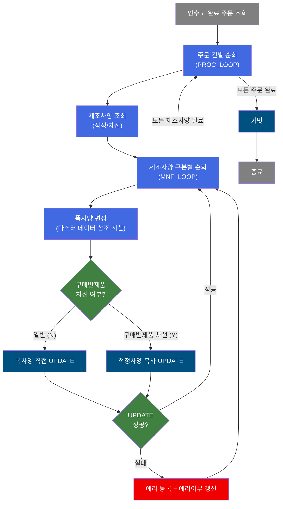
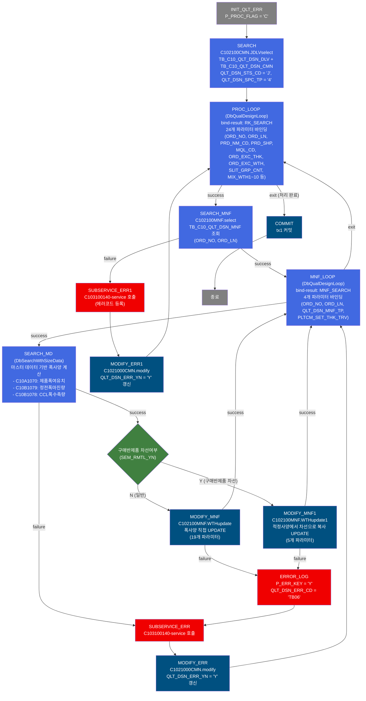
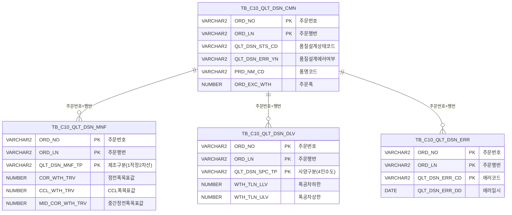

<h1 style="font-size: 40px; text-align: center; font-weight:
   bold; margin: 30px 0;">
  C103100080 레거시 시스템 분석 종합 보고서
</h1>


# 1. 시스템 개요
- **서비스 ID**: C103100080
- **업무명**: 품질설계 폭사양 편성 (배치)
- **분석 일시**: 2026-03-16 19:03 KST
- **분석 시간**: 약 5분
- **전체 Activity 수**: 15개 (Custom 3, Built-in 12)
- **분석자**: Claude Opus 4.6
- **분석 도구**: /analyze-service C103100080
- **문서 버전**: 1.0

# 📊 비즈니스 프로세스 분석

## 시스템 목적

C103100080 서비스는 품질설계 단계에서 주문별 **제품폭 관련 사양(기준적용폭, 정전목표폭, 조합폭, CCL출측폭, 중간정전목표폭 등)**을 자동 편성하여 제조사양 테이블에 반영하는 NUI(배치) 서비스이다. 품질설계 상태코드가 'J'(인수도 완료)인 주문-행번 목록을 대상으로 건별 반복 처리한다.

핵심 처리 흐름은 두 단계의 루프로 구성된다. 외부 루프(PROC_LOOP)가 인수도 완료 주문을 1건씩 순회하며, 각 주문의 제조사양 레코드를 조회한 후 내부 루프(MNF_LOOP)에서 제조사양 구분(적정/차선)별로 폭사양을 편성한다. 폭사양 편성 시 마스터 데이터(제품폭여유기준 C10A1070, 정전폭마진기준 C10B1079, CCL폭수축량기준 C10B1078)를 참조하여 계산하며, 구매반제품 차선 여부에 따라 직접 UPDATE 또는 적정 사양 복사 UPDATE를 분기 실행한다.

에러 발생 시 서브서비스(C103100140)를 통해 에러코드를 등록하고, 해당 주문의 품질설계에러여부(QLT_DSN_ERR_YN)를 'Y'로 갱신한 후 다음 건을 계속 처리하는 안정적인 에러 핸들링 구조를 갖추고 있다.

## 핵심 워크플로우 다이어그램



### 상세 워크플로우 다이어그램



## 주요 유즈케이스

### UC-01: 인수도 완료 주문의 폭사양 일괄 편성

- **Actor**: 배치 프로세스 (NUI)
- **목적**: 품질설계 인수도 완료(상태코드 'J') 상태의 전체 주문에 대해 제품폭 관련 사양을 자동 계산하여 제조사양 테이블에 반영

- **전제조건**:
  - TB_C10_QLT_DSN_CMN에 QLT_DSN_STS_CD = 'J'인 주문이 존재함
  - TB_C10_QLT_DSN_DLV에 인수도 사양(QLT_DSN_SPC_TP = '4')이 등록되어 있음
  - 마스터 데이터(C10A1070, C10B1079, C10B1078)가 정상 등록되어 있음

- **주요 흐름**:
  1. INIT_QLT_ERR에서 P_PROC_FLAG = 'C' 설정
  2. SEARCH(C102100CMN.JDLVselect)로 인수도 완료 주문 전체 목록 조회 (TB_C10_QLT_DSN_DLV + TB_C10_QLT_DSN_CMN 조인)
  3. PROC_LOOP에서 주문 1건씩 꺼내 24개 파라미터(ORD_NO, ORD_LN, PRD_NM_CD, ORD_EXC_WTH, MIX_WTH1~10 등) 바인딩
  4. SEARCH_MNF(C102100MNF.select)로 해당 주문의 제조사양 목록 조회
  5. MNF_LOOP에서 제조사양 구분(적정/차선)별로 순회
  6. SEARCH_MD(DbSearchWthSizeData)에서 마스터 데이터 기반 폭사양 계산
  7. 구매반제품 차선 여부 분기 후 MODIFY_MNF 또는 MODIFY_MNF1로 UPDATE
  8. 모든 주문 처리 완료 후 COMMIT

- **대체 흐름**:
  - 제조사양 조회 실패(SEARCH_MNF failure): C103100140 서브서비스로 에러 등록 → QLT_DSN_ERR_YN = 'Y' 갱신 → 다음 주문 계속 처리
  - 폭사양 편성 실패(SEARCH_MD failure): C103100140 서브서비스로 에러 등록 → QLT_DSN_ERR_YN = 'Y' 갱신 → 다음 제조사양 계속 처리
  - UPDATE 실패(MODIFY_MNF/MNF1 failure): ERROR_LOG에서 에러코드 'TB06' 설정 → 에러 등록 → 다음 제조사양 계속 처리

- **후행조건**:
  - TB_C10_QLT_DSN_MNF에 폭사양(SLIT_GRP_CNT, MIX_WTH1~10, PRD_WTH_RNG_LLV/ULV, COR_WTH_TRV, CCL_WTH_TRV, MID_COR_WTH_TRV) 반영됨
  - 에러 발생 주문은 TB_C10_QLT_DSN_ERR에 에러 이력 등록됨
  - 에러 발생 주문은 TB_C10_QLT_DSN_CMN.QLT_DSN_ERR_YN = 'Y'로 갱신됨

### UC-02: 구매반제품 차선 폭사양 복사 처리

- **Actor**: 배치 프로세스 (NUI)
- **목적**: 구매반제품 원자재의 차선 등록 케이스에서 적정사양(MNF_TP='1')의 폭사양을 차선 사양으로 복사

- **전제조건**:
  - 해당 주문이 구매반제품 차선 등록 대상 (QLT_DSN_MNF_TP ≠ '1', 원자재코드 H/M으로 시작하지 않음, 품명코드 5/7이 아님)

- **주요 흐름**:
  1. DbSearchWthSizeData에서 구매반제품 차선 조건 판별
  2. SEM_RMTL_YN = 'Y' 설정 후 즉시 반환
  3. PosValueRouter에서 'Y' 분기 → MODIFY_MNF1
  4. C102100MNF.WTHupdate1 실행: 적정사양(MNF_TP='1')의 폭사양 값을 서브쿼리로 조회하여 차선 사양에 덮어씀

- **대체 흐름**:
  - 적정사양 레코드 미존재 시: 서브쿼리가 NULL 반환 → 차선 사양 NULL로 UPDATE

- **후행조건**:
  - 차선 제조사양의 폭사양 값이 적정사양과 동일하게 갱신됨

### UC-03: 칼라제품 중간정전목표폭 계산

- **Actor**: 배치 프로세스 (NUI)
- **목적**: 칼라 제품(CCL 공정 필요)의 경우 CCL 폭수축량을 반영하여 중간정전목표폭을 계산

- **전제조건**:
  - 품명코드가 칼라 제품 코드(PRD_NM_CD_1~9) 중 하나
  - 재단선유무(CUT_LN_YN) = 'Y'

- **주요 흐름**:
  1. 칼라제조사양(SELECT_MNF_CCL_BOM) 조회로 재단선유무, 코팅방식, 수지구분전면, CCL BOM 번호 획득
  2. CCL출측폭 = 정전목표폭 (재단선 있는 경우)
  3. C10B1078 마스터로 CCL폭수축량 조회 (품명, 재질, X-Ray Set, 기준적용폭 조건)
  4. Slit조수 = 2인 경우: 중간정전목표폭 = (CCL출측폭 + CCL폭수축량) × 2
  5. 그 외: 중간정전목표폭 = CCL출측폭 + CCL폭수축량

- **대체 흐름**:
  - 칼라제조사양 조회 실패: 에러코드 KP05 설정 → failure 반환
  - CCL폭수축량 마스터 미존재: 에러코드 KT26 설정 → failure 반환
  - CCL폭수축량 마스터 중복: 에러코드 KT27 설정 → failure 반환

- **후행조건**:
  - MID_COR_WTH_TRV에 계산된 중간정전목표폭 값 반영됨

---

## 비즈니스 로직 상세

### 1. 정전목표폭(COR_WTH_TRV) 및 기준적용폭(ORD_EXC_WTH) 계산 (DbSearchWthSizeData)

- **목적**: 주문 제품의 폭사양(기준적용폭, 정전목표폭)을 Slit 조수, 재단선유무, 주문폭/조합폭 관계에 따라 분기 계산
- **처리 케이스**:

  **[케이스 1: 재단선 있음 + Slit 2조 + 주문폭 = 조합폭1]**
  ```
    조건: CUT_LN_YN = 'Y' AND ORD_SLIT_GRP_CNT = 2 AND ORD_EXC_WTH = ORD_MIX_WTH1
    처리:
      1. 기준적용폭 = 주문폭(ORD_EXC_WTH) 그대로 사용
      2. 정전목표폭 = 주문폭 + 제품폭여유치(MRG_WTH)
  ```

  **[케이스 2: 재단선 있음 + Slit 2조 + 주문폭 ≠ 조합폭1]**
  ```
    조건: CUT_LN_YN = 'Y' AND ORD_SLIT_GRP_CNT = 2 AND ORD_EXC_WTH ≠ ORD_MIX_WTH1
    처리:
      1. 기준적용폭 = 조합폭1(ORD_MIX_WTH1) 사용
      2. 정전목표폭 = 조합폭1 + 제품폭여유치
  ```

  **[케이스 3: Slit 조수 > 0 (다조 슬릿)]**
  ```
    조건: ORD_SLIT_GRP_CNT > 0 (케이스 1, 2에 해당하지 않는 경우)
    처리:
      1. 기준적용폭 = 조합폭1~10 전체 합산
      2. 정전목표폭 = 기준적용폭 + (제품폭여유치 × Slit조수)
  ```

  **[케이스 4: 기타 (단일 폭)]**
  ```
    조건: 위 케이스에 해당하지 않는 경우
    처리:
      1. 기준적용폭 = 주문폭(ORD_EXC_WTH) 그대로 사용
      2. 정전목표폭 = 주문폭 + 제품폭여유치
  ```

- **계산 공식**:

  ```
  제품폭범위 하한 = ORD_EXC_WTH + WTH_TLN_LLV (인수도폭공차 하한)
  제품폭범위 상한 = ORD_EXC_WTH + WTH_TLN_ULV (인수도폭공차 상한)

  제조사양 조합폭N = 주문조합폭N + 제품폭여유치 (조합폭N > 0인 경우만)

  정전EDGE지정구분:
    ORD_EDG_ASG_TP ∈ {'S'(Slit), 'C'(Coil)} → 'Y'
    그 외 → 'N'
  ```

### 2. CCL출측폭 및 중간정전목표폭 계산 (DbSearchWthSizeData)

- **목적**: 칼라 제품(CCL 공정 필요)의 CCL 목표폭과 중간정전 목표폭을 마스터 데이터 기반으로 계산
- **처리 케이스**:

  **[케이스 1: 재단선 있는 칼라 제품 (mid_cor_proc = true)]**
  ```
    조건: 칼라 품명코드 + CUT_LN_YN = 'Y'
    처리:
      1. CCL출측폭(CCL_WTH_TRV) = 정전목표폭(COR_WTH_TRV)
      2. C10B1078 마스터에서 CCL폭수축량 조회
         - 조건: 품명코드, 재질코드, PLTCM X-Ray Set, 기준적용폭
      3. Slit 2조: 중간정전목표폭 = (CCL출측폭 + CCL폭수축량) × 2
      4. 그 외: 중간정전목표폭 = CCL출측폭 + CCL폭수축량
  ```

  **[케이스 2: 재단선 없는 칼라 제품]**
  ```
    조건: 칼라 품명코드 + CUT_LN_YN ≠ 'Y'
    처리:
      1. CCL출측폭 = 정전목표폭 + 정전폭마진량(COL_WTH_MGN)
      2. 중간정전목표폭 = 0 (계산 안 함)
  ```

- **계산 공식**:

  ```
  [재단선 있는 칼라 제품]
  CCL출측폭 = COR_WTH_TRV
  중간정전목표폭 = (CCL출측폭 + CCL폭수축량) × Slit조수  (Slit 2조)
  중간정전목표폭 = CCL출측폭 + CCL폭수축량              (그 외)

  [재단선 없는 칼라 제품]
  CCL출측폭 = COR_WTH_TRV + 정전폭마진량
  ```

- **예외 처리**:
  - 칼라제조사양 조회 실패/0건: 에러코드 KP05 → FAILURE
  - 제품폭여유기준 미존재: 에러코드 KT03 → FAILURE
  - 제품폭여유기준 중복: 에러코드 KT13 → FAILURE
  - 정전폭마진기준 미존재: 에러코드 KT28 → FAILURE
  - 정전폭마진기준 중복: 에러코드 KT29 → FAILURE
  - CCL폭수축량기준 미존재: 에러코드 KT26 → FAILURE
  - CCL폭수축량기준 중복: 에러코드 KT27 → FAILURE

### 3. 구매반제품 차선 판별 로직 (DbSearchWthSizeData)

- **목적**: 구매반제품 원자재의 차선 등록 케이스를 식별하여 별도 처리 분기
- **처리 케이스**:

  **[구매반제품 차선 해당]**
  ```
    조건: QLT_DSN_MNF_TP ≠ '1' (적정이 아닌 경우)
      AND 원자재코드 첫 글자 ≠ 'H' AND ≠ 'M' (CCAI, CCUS 제외)
      AND 품명코드 ≠ '5' AND ≠ '7'
    처리:
      1. SEM_RMTL_YN = 'Y' 설정
      2. 즉시 SUCCESS 반환 (폭사양 계산 건너뜀)
      3. Router에서 MODIFY_MNF1로 분기 → 적정사양 복사 UPDATE
  ```

### 4. 루프 제어 로직 (DbQualDesignLoop)

- **목적**: ResultSet을 1건씩 순회하며 건별 파라미터를 PosContext에 바인딩하는 범용 루프 제어
- **처리 케이스**:

  **[정상 순회]**
  ```
    처리:
      1. 처리건수 관리변수(countName) 확인 — null이면 전체 row 수로 초기화
      2. 처리건수가 0이면 'exit' 반환 (루프 종료)
      3. 처리건수 1 차감, 현재 row 위치 계산 (this_row = total_row - procCount)
      4. ResultSet 순회하며 현재 row에서 param 바인딩
      5. P_ERR_KEY = 'N', QLT_DSN_ERR_YN = ' ' 초기화
      6. BATCH_JOB = 'true' 설정
      7. 'success' 반환
  ```

---

# ⚙️ Java 컴포넌트 분석

## Custom Activity 상세 분석

### 3개 Custom Activity 발견 (2개 고유 클래스)

### 1. DbQualDesignLoop (PROC_LOOP, MNF_LOOP)
- **클래스명**: com.unionsteel.mes.c10.activity.nui.DbQualDesignLoop
- **액티비티명**: PROC_LOOP (외부 루프), MNF_LOOP (내부 루프)
- **파일 경로**: src/com/unionsteel/mes/c10/activity/nui/DbQualDesignLoop.java
- **주요 기능**: ResultSet을 1건씩 순회하며 파라미터를 PosContext에 바인딩하는 범용 루프 제어 Activity

#### 메소드 구조
- **주요 메소드**: runActivity(PosContext ctx)
  - **반환 타입**: String (success/exit/failure)
  - **파라미터**: PosContext ctx

#### 핵심 비즈니스 로직
- **루프 카운터 관리**: countName 프로퍼티로 지정된 변수로 처리건수를 추적. null이면 ResultSet 전체 건수로 초기화, 매 호출 시 1 차감
- **건별 파라미터 바인딩**: param0~paramN 프로퍼티에서 "저장변수명|대상항목명" 패턴 파싱 → ResultSet의 현재 row에서 값 추출 → PosContext에 등록
- **종료 제어**: 처리건수가 0이 되면 'exit' 반환하여 루프 탈출, countName 변수를 context에서 제거
- **에러 초기화**: 매 건 처리 시 P_ERR_KEY = 'N', QLT_DSN_ERR_YN = ' '으로 초기화

#### Java 상수 및 의존성
- **주요 상수**: C10STR_P_ERR_KEY, C10STR_BATCH_JOB, C10STR_TRUE, C10STR_NO, C10STR_EXIT, C10STR_COUNTNAME, C10PN_BIND_RESULT, C10PN_PARAM, COL_QLT_DSN_ERR_YN
- **핵심 의존성**: PosActivity, PosContext, PosRowSet, PosRow, C10NuiConstantsIF, ActivityUtil, DbCommonUtil

---

### 2. DbSearchWthSizeData (SEARCH_MD)
- **클래스명**: com.unionsteel.mes.c10.activity.nui.DbSearchWthSizeData
- **액티비티명**: SEARCH_MD
- **파일 경로**: src/com/unionsteel/mes/c10/activity/nui/DbSearchWthSizeData.java
- **주요 기능**: 주문 제품의 폭 관련 설계값(기준적용폭, 정전목표폭, 조합폭, EDGE 지정, CCL출측폭, 중간정전목표폭)을 마스터 데이터 기반으로 계산

#### 메소드 구조
- **주요 메소드**: runActivity(PosContext ctx)
  - **반환 타입**: String (success/failure)
  - **파라미터**: PosContext ctx

#### SQL 매핑 (총 3개)
| SQL 이름 | 쿼리 ID | 타입 | 테이블 |
|---------|---------|-----|-------|
| 칼라제조사양 조회 | SELECT_MNF_CCL_BOM | SELECT | (MasterData 뷰) |
| 제품폭여유기준 조회 | VI_M00_C10A1070 | SELECT | (MasterData 뷰) |
| 정전폭마진기준/CCL폭수축량 | C10B1079, C10B1078 | EasyAccess | (MasterData) |

#### 핵심 비즈니스 로직
- **구매반제품 차선 판별**: QLT_DSN_MNF_TP ≠ '1' + 원자재코드 H/M 외 + 품명코드 5/7 외 → SEM_RMTL_YN = 'Y' 즉시 반환
- **칼라 제품 체크**: PRD_NM_CD가 PRD_NM_CD_1~9 중 하나인 경우 칼라 제조사양 조회 (재단선유무, 코팅방식, 수지구분, CCL BOM 번호)
- **제품폭여유치 조회**: C10A1070 마스터에서 ORD_WTH_MNG_CD 조건으로 MRG_WTH 획득
- **기준적용폭/정전목표폭 분기 계산**: 재단선유무, Slit조수, 주문폭/조합폭1 비교에 따른 4가지 분기
- **조합폭 편성**: 조합폭1~10 중 0이 아닌 값에 제품폭여유치를 각각 가산
- **정전폭마진량 조회**: C10B1079 마스터에서 8개 조건(EDGE구분, 품명, 제품형태, 코팅방식, 수지구분, 주문두께, CCL BOM번호, 스팽글구분)으로 조회
- **CCL출측폭/중간정전목표폭 계산**: 칼라 제품 + 재단선 유무에 따라 CCL폭수축량(C10B1078) 참조 계산

#### Java 상수 및 의존성
- **주요 상수**: PRD_NM_CD_1~9 (칼라제품 코드), C10B1079, C10B1078, C10A1070, SELECT_MNF_CCL_BOM, SLIT_EDGE, COIL_EDGE, ERRCD_KP05/KT03/KT13/KT26/KT27/KT28/KT29
- **핵심 의존성**: PosActivity, PosGenericDao, EasyAccess, PosDecisionChecker, PosRuleVO, C10NuiConstantsIF

---

# 💾 데이터 요구사항

## 핵심 테이블

### 1. TB_C10_QLT_DSN_MNF - 품질설계결과 제조사양
| 컬럼명 | 타입 | PK | 설명 |
|--------|------|----|------|
| ORD_NO | VARCHAR2 | ✅ | 주문번호 |
| ORD_LN | VARCHAR2 | ✅ | 주문행번 |
| QLT_DSN_MNF_TP | VARCHAR2 | ✅ | 품질설계제조구분 (1:적정, 2:차선) |
| SLIT_GRP_CNT | NUMBER | | Slit조수 |
| MIX_WTH1~10 | NUMBER | | 조합폭1~10 |
| PRD_WTH_RNG_LLV | NUMBER | | 제품폭범위하한값 |
| PRD_WTH_RNG_ULV | NUMBER | | 제품폭범위상한값 |
| COR_WTH_TRV | NUMBER | | 정전폭목표값 |
| CCL_WTH_TRV | NUMBER | | CCL폭목표값 |
| MID_COR_WTH_TRV | NUMBER | | 중간정전폭목표값 |
| RMTL_CD | VARCHAR2 | | 원자재코드 |
| CRM_MNF_STD_NO | VARCHAR2 | | 냉연제조표준번호 |
| LAST_UPDATED_OBJECT_TYPE | VARCHAR2 | | 최종변경OBJECT유형 |
| LAST_UPDATED_OBJECT_ID | VARCHAR2 | | 최종변경OBJECTID |
| LAST_UPDATE_PROGRAM_ID | VARCHAR2 | | 최종변경프로그램ID |
| LAST_UPDATE_TIMESTAMP | VARCHAR2 | | 최종변경일시 |

### 2. TB_C10_QLT_DSN_CMN - 품질설계결과 공통
| 컬럼명 | 타입 | PK | 설명 |
|--------|------|----|------|
| ORD_NO | VARCHAR2 | ✅ | 주문번호 |
| ORD_LN | VARCHAR2 | ✅ | 주문행번 |
| QLT_DSN_STS_CD | VARCHAR2 | | 품질설계상태코드 (J:인수도완료) |
| QLT_DSN_ERR_YN | VARCHAR2 | | 품질설계에러여부 (Y/N) |
| PRD_NM_CD | VARCHAR2 | | 품명코드 |
| PRD_SHP | VARCHAR2 | | 제품형태 |
| ORD_EXC_WTH | NUMBER | | 주문폭 |
| ORD_EXC_THK | NUMBER | | 주문두께 |
| ORD_SLIT_GRP_CNT | NUMBER | | 주문Slit조수 |
| ORD_MIX_WTH1~10 | NUMBER | | 주문조합폭1~10 |
| ORD_WTH_MNG_CD | VARCHAR2 | | 주문폭관리코드 |
| ORD_EDG_ASG_TP | VARCHAR2 | | 주문EDGE지정구분 |
| MQL_CD | VARCHAR2 | | 재질코드 |

### 3. TB_C10_QLT_DSN_DLV - 품질설계결과 인수도
| 컬럼명 | 타입 | PK | 설명 |
|--------|------|----|------|
| ORD_NO | VARCHAR2 | ✅ | 주문번호 |
| ORD_LN | VARCHAR2 | ✅ | 주문행번 |
| QLT_DSN_SPC_TP | VARCHAR2 | ✅ | 품질설계사양구분 (4:인수도사양) |
| THK_TLN_LLV | NUMBER | | 두께공차하한값 |
| THK_TLN_ULV | NUMBER | | 두께공차상한값 |
| WTH_TLN_LLV | NUMBER | | 폭공차하한값 |
| WTH_TLN_ULV | NUMBER | | 폭공차상한값 |
| LTH_TLN_LLV | NUMBER | | 길이공차하한값 |
| LTH_TLN_ULV | NUMBER | | 길이공차상한값 |
| HWAV_H | NUMBER | | 파고높이 |
| MWAV_H | NUMBER | | 중파고 |
| EWAV_H | NUMBER | | 이파고 |
| SLR_ULV | NUMBER | | SLR상한값 |
| RAR_ULV | NUMBER | | RAR상한값 |
| DGLN_DIF_ULV | NUMBER | | 대각길이차상한값 |
| STPN | NUMBER | | STPN |
| TLC | NUMBER | | TLC |

### 4. TB_C10_QLT_DSN_ERR - 품질설계결과 에러
| 컬럼명 | 타입 | PK | 설명 |
|--------|------|----|------|
| ORD_NO | VARCHAR2 | ✅ | 주문번호 |
| ORD_LN | VARCHAR2 | ✅ | 주문행번 |
| QLT_DSN_ERR_CD | VARCHAR2 | ✅ | 품질설계에러코드 |
| QLT_DSN_ERR_DD | DATE | | 품질설계에러일시 |

## 데이터 플로우

### 1. 인수도 완료 주문 조회
```
[인수도 완료 대상 일괄 조회]
서비스 시작
→ C102100CMN.JDLVselect
  FROM TB_C10_QLT_DSN_DLV A, TB_C10_QLT_DSN_CMN B
  WHERE A.ORD_NO(+) = B.ORD_NO
    AND A.ORD_LN(+) = B.ORD_LN
    AND B.QLT_DSN_STS_CD = 'J'
    AND A.QLT_DSN_SPC_TP = '4'
→ RK_SEARCH ResultSet에 저장
```

### 2. 제조사양 조회
```
[주문별 제조사양 목록 조회]
PROC_LOOP에서 ORD_NO, ORD_LN 추출
→ C102100MNF.select
  FROM TB_C10_QLT_DSN_MNF
  WHERE ORD_NO = ? AND ORD_LN = ?
  ORDER BY QLT_DSN_MNF_TP
→ MNF_SEARCH ResultSet에 저장
```

### 3. 폭사양 UPDATE (일반)
```
[폭사양 직접 UPDATE]
SEARCH_MD에서 폭사양 계산 완료 후
→ C102100MNF.WTHupdate
  UPDATE TB_C10_QLT_DSN_MNF SET
    SLIT_GRP_CNT, MIX_WTH1~10,
    PRD_WTH_RNG_LLV, PRD_WTH_RNG_ULV,
    COR_WTH_TRV, CCL_WTH_TRV, MID_COR_WTH_TRV
  WHERE ORD_NO = ? AND ORD_LN = ? AND QLT_DSN_MNF_TP = ?
```

### 4. 폭사양 UPDATE (구매반제품 차선)
```
[적정사양 복사 UPDATE]
구매반제품 차선 판별 시
→ C102100MNF.WTHupdate1
  UPDATE TB_C10_QLT_DSN_MNF SET
    (SLIT_GRP_CNT, MIX_WTH1~10, PRD_WTH_RNG_LLV/ULV,
     COR_WTH_TRV, CCL_WTH_TRV, MID_COR_WTH_TRV) =
    (SELECT ... FROM TB_C10_QLT_DSN_MNF
     WHERE ORD_NO = ? AND ORD_LN = ? AND QLT_DSN_MNF_TP = '1')
  WHERE ORD_NO = ? AND ORD_LN = ? AND QLT_DSN_MNF_TP = ?
```

### 5. 에러 처리
```
[에러 등록 + 에러여부 갱신]
에러 발생 시
→ C103100140-service (서브서비스)
  TB_C10_QLT_DSN_ERR INSERT (중복 체크 후)
→ C1021000CMN.modify
  UPDATE TB_C10_QLT_DSN_CMN
    SET QLT_DSN_ERR_YN = 'Y'
  WHERE ORD_NO = ? AND ORD_LN = ?
```

## SQL 일람표

| SQL 이름 | 쿼리 ID | 타입 | 출처 | 테이블 |
|---------|---------|-----|------|-------|
| 인수도 완료 주문 조회 | C102100CMN.JDLVselect | SELECT | Service | TB_C10_QLT_DSN_DLV, TB_C10_QLT_DSN_CMN |
| 제조사양 조회 | C102100MNF.select | SELECT | Service | TB_C10_QLT_DSN_MNF |
| 폭사양 직접 UPDATE | C102100MNF.WTHupdate | UPDATE | Service | TB_C10_QLT_DSN_MNF |
| 폭사양 복사 UPDATE (차선) | C102100MNF.WTHupdate1 | UPDATE | Service | TB_C10_QLT_DSN_MNF |
| 에러여부 UPDATE | C1021000CMN.modify | UPDATE | Service | TB_C10_QLT_DSN_CMN |

## ER 다이어그램 (핵심 관계)



관계 설명:
- TB_C10_QLT_DSN_CMN이 중심 테이블로 모든 관계의 허브 역할
- TB_C10_QLT_DSN_MNF: 주문별 제조구분(적정/차선)으로 1:N 관계
- TB_C10_QLT_DSN_DLV: 주문별 사양구분으로 1:N 관계 (본 서비스에서는 사양구분 '4' 인수도만 사용)
- TB_C10_QLT_DSN_ERR: 주문별 에러코드로 1:N 관계

---

# 🔗 서브서비스

## 서브서비스 요약

| 서비스 ID | 설명 | 호출 액티비티 | 트랜잭션 | 상세 분석 |
|-----------|------|-------------|---------|----------|
| C103100140 | 품질설계 에러 등록 (중복 방지) | SUBSERVICE_ERR, SUBSERVICE_ERR1 | 기존 트랜잭션 공유 | [상세 분석 링크](./C103100140_legacy_analysis.md) |

### C103100140 - 품질설계결과 에러 등록 (중복 방지)
품질설계 과정에서 발생한 에러 정보를 TB_C10_QLT_DSN_ERR에 등록하는 서비스. 주문번호+행번+에러코드 3개 복합키로 중복 체크 후 미존재 시에만 INSERT 수행. Activity 2개(Custom 1, Built-in 1), SQL 2개 사용.

# 📌 특이사항 및 주의사항

## 1. 이중 루프 구조의 복잡성
- **외부/내부 루프 동일 클래스**: PROC_LOOP와 MNF_LOOP 모두 DbQualDesignLoop를 사용하되, countName이 다름 (QLT_DSN_STS_CD_COUNT vs MNF_WTH_COUNT). 루프 중첩 시 각 countName 변수가 독립적으로 관리되어야 하며, 에러 발생 시 내부 루프의 카운터가 초기화되지 않고 다음 건으로 이동하는 점에 주의 필요
- **외부 루프 파라미터 24개**: PROC_LOOP가 바인딩하는 파라미터가 24개로 매우 많아, 주문 정보 변경 시 누락 위험 존재

## 2. 구매반제품 차선 판별 조건의 하드코딩
- **원자재코드 첫 글자 비교**: `rmtl_cd.substring(0,1).equals("H")` / `"M"` 으로 하드코딩되어 있음. 원자재코드 체계가 변경되면 코드 수정 필요
- **품명코드 비교**: `prd_nm_cd.equals("5")`, `"7"`로 하드코딩. 칼라제품 코드 판별도 PRD_NM_CD_1~9 상수로 하드코딩되어 있어 제품군 추가 시 상수 수정 필요

## 3. 디버그 로그 잔존
- DbSearchWthSizeData에 `logger.logDebug("DONSEOK CHECK1 ...")` 형태의 개발자 개인 디버그 로그가 7건 잔존. 운영 환경에서 불필요한 로그 출력 발생 가능

## 4. 주석 처리된 이전 로직
- DbSearchWthSizeData 359~384행에 기존 다조 슬릿 폭사양 계산 로직이 주석 처리되어 있음. 현재 로직은 `ord_slit_grp_cnt > 0`일 때 조합폭 전체를 합산하는 단순화된 방식으로 변경됨. 주석 코드와 현행 코드 간 비즈니스 로직 차이 확인 필요

## 5. 에러 처리 후 계속 진행 패턴
- 에러 발생 시 해당 건만 에러 등록하고 다음 건을 계속 처리하는 패턴. 대량 에러 발생 시에도 전체 배치가 중단되지 않으나, 에러 건이 폭사양 미편성 상태로 남게 됨
- MODIFY_MNF/MNF1 실패 시 에러코드 'TB06'이 하드코딩되어 모든 UPDATE 실패가 동일 코드로 기록됨

## 6. Outer Join 사용 패턴
- C102100CMN.JDLVselect에서 Oracle 전용 `(+)` 문법으로 TB_C10_QLT_DSN_DLV를 LEFT OUTER JOIN. 인수도사양이 없는 주문도 조회 대상에 포함될 수 있어, WTH_TLN_LLV/ULV가 NULL인 경우 폭범위 계산에 영향

---

# 📚 참고 문서

- **Query SQL**:
  - `src/query/C102100CMN-query.glue_sql`
  - `src/query/C102100MNF-query.glue_sql`
- **Custom Java 클래스**:
  - `src/com/unionsteel/mes/c10/activity/nui/DbQualDesignLoop.java`
  - `src/com/unionsteel/mes/c10/activity/nui/DbSearchWthSizeData.java`
- **서비스 XML**: `src/service/C103100080-service.xml`
- **서브서비스 분석**: `docs/analysis/service/nui/C103100140_legacy_analysis.md`
