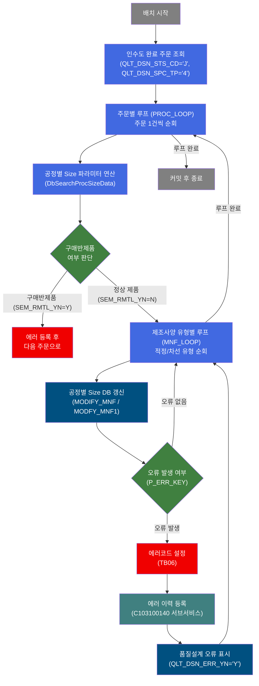
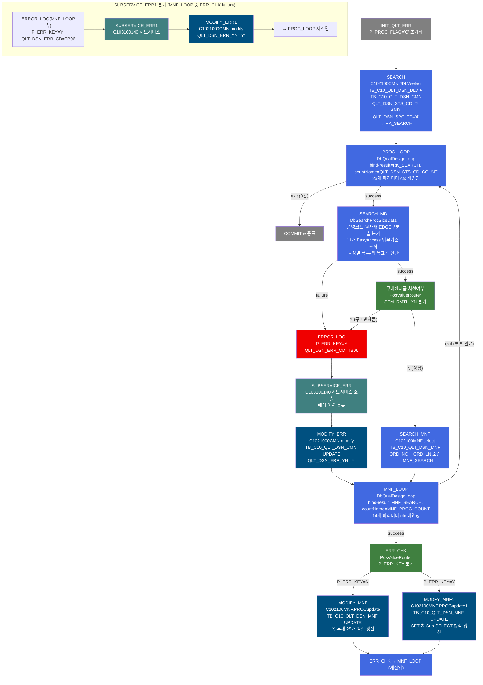
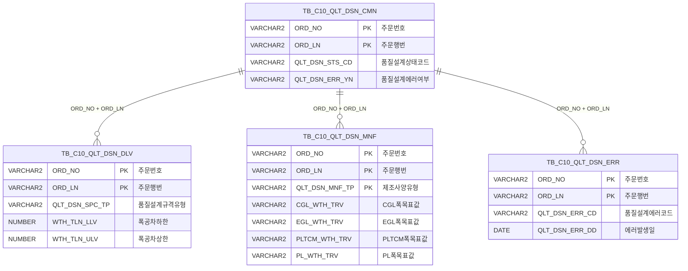

<h1 style="font-size: 40px; text-align: center; font-weight:
   bold; margin: 30px 0;">
  C103100090 레거시 시스템 분석 종합 보고서
</h1>


# 1. 시스템 개요
- **서비스 ID**: C103100090
- **업무명**: 품질설계결과 공정별 Size 연산 및 제조사양 갱신
- **분석 일시**: 2026-03-16 KST
- **분석 시간**: 약 5분
- **전체 Activity 수**: 16개 (Custom 3, Built-in 13)
- **분석자**: Claude Sonnet 4.6
- **분석 도구**: /analyze-service C103100090
- **문서 버전**: 1.0

# 📊 비즈니스 프로세스 분석

## 시스템 목적

C103100090 서비스는 품질설계결과 데이터를 기반으로 각 공정(CGL 용융도금, EGL 전기도금, CCL 정전도장, TM 조질압연, PLTCM 피도금 등)별 폭·두께 목표값 및 설계 파라미터를 연산하여 `TB_C10_QLT_DSN_MNF`(품질설계결과 제조사양) 테이블을 갱신하는 NUI(배치) 서비스이다.

서비스는 두 개의 루프 구조로 구성된다. 첫 번째 루프(PROC_LOOP)는 `TB_C10_QLT_DSN_DLV`에서 품질설계 상태코드 'J'(인수도 완료)인 주문 목록을 조회한 뒤 주문별로 `DbQualDesignLoop` 액티비티를 통해 순회한다. 각 주문에 대해 `DbSearchProcSizeData`가 품명코드·제품유형·원자재코드 기반의 복잡한 비즈니스 규칙으로 공정별 폭·두께를 연산하고, `구매반제품 차선여부` 라우터로 분기하여 두 번째 루프(MNF_LOOP)로 진입한다.

두 번째 루프(MNF_LOOP)는 같은 주문번호에 대한 제조사양 유형(적정/차선 등)별 레코드를 순회하여 연산된 폭·두께 값을 `MODIFY_MNF` 또는 `MODFY_MNF1`로 DB에 반영한다. 오류 발생 시 에러코드를 설정하고 서브서비스(C103100140)를 호출하여 에러 이력을 등록한 뒤 해당 주문에 오류 표시(`QLT_DSN_ERR_YN = 'Y'`)를 남기고 다음 주문으로 계속 진행한다.

## 핵심 워크플로우 다이어그램



### 상세 워크플로우 다이어그램



## 주요 유즈케이스

### UC-01: 인수도 완료 주문에 대한 공정별 Size 자동 연산

- **Actor**: 배치 스케줄러 / 품질설계 시스템
- **목적**: 인수도 확정된 주문의 품명·재질·공정 조건에 따라 CGL·EGL·CCL·TM·PLTCM 등 각 공정별 목표 폭·두께값을 자동 계산
- **전제조건**:
  - `TB_C10_QLT_DSN_CMN`에 `QLT_DSN_STS_CD = 'J'`인 주문이 존재함
  - `TB_C10_QLT_DSN_DLV`에 `QLT_DSN_SPC_TP = '4'`인 레코드가 연결되어 있음
  - EasyAccess 업무기준(C10B1074~C10B2230 등)이 정상 등록되어 있음
  - `TB_C10_QLT_DSN_MNF`에 해당 주문의 제조사양 레코드가 존재함

- **주요 흐름**:
  1. `INIT_QLT_ERR`로 `P_PROC_FLAG='C'` 초기화 후 서비스 시작
  2. `SEARCH` Activity가 `C102100CMN.JDLVselect`로 인수도 완료 주문 목록 조회 → `RK_SEARCH`에 저장
  3. `PROC_LOOP`(DbQualDesignLoop)가 주문 목록을 1건씩 순회, 26개 주문사양 파라미터를 ctx에 바인딩
  4. `SEARCH_MD`(DbSearchProcSizeData)가 품명코드별 비즈니스 규칙과 11개 EasyAccess 업무기준으로 공정별 폭·두께 연산
  5. `구매반제품 차선여부` 라우터에서 `SEM_RMTL_YN=N`이면 다음 단계 진행
  6. `SEARCH_MNF`로 해당 주문의 제조사양 레코드(QLT_DSN_MNF_TP별) 조회
  7. `MNF_LOOP`에서 각 제조사양 유형별로 `MODIFY_MNF`/`MODFY_MNF1` UPDATE 실행
  8. 모든 주문 처리 완료 후 `COMMIT`으로 트랜잭션 확정

- **대체 흐름**:
  - EasyAccess 업무기준 조회 실패(0건/복수): `SEARCH_MD`에서 FAILURE → `ERROR_LOG` → `SUBSERVICE_ERR` → `MODIFY_ERR` → `MNF_LOOP` 재진입
  - 구매반제품 원자재(`SEM_RMTL_YN=Y`): `ERROR_LOG` → `SUBSERVICE_ERR` → `MODIFY_ERR` → `MNF_LOOP` 재진입

- **후행조건**:
  - `TB_C10_QLT_DSN_MNF`의 공정별 Size 컬럼이 계산값으로 갱신됨
  - 오류 주문은 `TB_C10_QLT_DSN_CMN.QLT_DSN_ERR_YN = 'Y'`로 표시됨
  - `TB_C10_QLT_DSN_ERR`에 오류 이력이 등록됨 (C103100140 서브서비스 경유)

### UC-02: 구매반제품(SEM) 원자재 주문 조기 종료 처리

- **Actor**: 배치 스케줄러
- **목적**: 구매반제품 원자재를 사용하는 주문에 대해 공정별 Size 계산을 생략하고 에러 이력만 등록하여 다음 주문으로 넘어감
- **전제조건**:
  - `qlt_dsn_mnf_tp ≠ 1` (적정 설계가 아님)
  - `rmtl_cd` 첫 글자가 H·M 계열이 아님
  - `prd_nm_cd`가 5 또는 7이 아님

- **주요 흐름**:
  1. `SEARCH_MD`(DbSearchProcSizeData)가 구매반제품 원자재 조건 감지 → `SEM_RMTL_YN=Y`로 ctx 설정 후 SUCCESS 반환
  2. `구매반제품 차선여부` 라우터에서 `SEM_RMTL_YN=Y` 경로로 분기
  3. `ERROR_LOG`에서 `P_ERR_KEY=Y`, `QLT_DSN_ERR_CD=TB06` 설정
  4. `SUBSERVICE_ERR`(C103100140) 호출로 `TB_C10_QLT_DSN_ERR`에 오류 레코드 등록
  5. `MODIFY_ERR`으로 `TB_C10_QLT_DSN_CMN.QLT_DSN_ERR_YN='Y'` 갱신
  6. `MNF_LOOP`로 복귀하여 남은 제조사양 유형 처리 계속 진행

- **대체 흐름**:
  - 없음 (구매반제품 판별은 DbSearchProcSizeData 내부에서 단순 조건 분기)

- **후행조건**:
  - 해당 주문의 `TB_C10_QLT_DSN_CMN.QLT_DSN_ERR_YN = 'Y'` 갱신됨
  - `TB_C10_QLT_DSN_ERR`에 에러코드 `TB06` 레코드 등록됨
  - `TB_C10_QLT_DSN_MNF` 갱신 없음 (공정별 Size 계산 생략됨)

### UC-03: APS 임시 조치 적용 (차선 원자재코드 교체)

- **Actor**: 배치 스케줄러
- **목적**: APS 시스템 버그 대응을 위해 적정 설계의 D계열 원자재코드를 차선 설계의 H계열로 교체하여 ST폭 계산에 적용
- **전제조건**:
  - `QLT_DSN_MNF_TP = '1'` (적정 설계)
  - `RMTL_CD` 첫 글자가 'D'

- **주요 흐름**:
  1. `SEARCH_MD`(DbSearchProcSizeData) 진입 시 `qlt_dsn_mnf_tp='1'` AND `rmtl_cd[0]='D'` 조건 감지
  2. `SELECT_MNF2`(`C102100MNF.select2`) 쿼리로 차선 설계(`QLT_DSN_MNF_TP='2'`) 제조사양 조회
  3. 차선 원자재코드(H계열)를 추출하여 `rmtl_cd` 변수를 교체
  4. 교체된 원자재코드로 이후 CGL/EGL/PLTCM 폭감소량 EasyAccess 조회에 사용

- **대체 흐름**:
  - 차선 설계 레코드 없음: 기존 D계열 원자재코드 그대로 사용

- **후행조건**:
  - 교체된 원자재코드 기준으로 공정별 Size가 계산됨
  - APS 수정 완료 후 이 로직은 제거 예정 (코드 주석 기재)

### UC-04: 제조사양 유형별(적정/차선) 갱신 - SET치 서브셀렉트 방식

- **Actor**: 배치 스케줄러
- **목적**: `QLT_DSN_MNF_TP` 값에 따라 적정(`N`) 또는 오류 있는 제조사양(`Y`)에 대해 서로 다른 UPDATE 쿼리를 적용하여 공정별 Size 반영
- **전제조건**:
  - `MNF_LOOP`에서 현재 행의 파라미터가 ctx에 바인딩됨
  - `P_ERR_KEY` 상태가 판단됨

- **주요 흐름**:
  1. `MNF_LOOP`에서 현재 제조사양 유형의 데이터 로드
  2. `ERR_CHK`(PosValueRouter)에서 `P_ERR_KEY` 확인
  3. `P_ERR_KEY=N`이면 `MODIFY_MNF`(C102100MNF.PROCupdate)로 계산된 25개 컬럼 직접 UPDATE
  4. `P_ERR_KEY=Y`이면 `MODFY_MNF1`(C102100MNF.PROCupdate1)로 다른 레코드(차선 SET치)를 서브셀렉트하여 UPDATE
  5. `MNF_LOOP` 재진입으로 다음 유형 처리

- **대체 흐름**:
  - `ERR_CHK`에서 `P_ERR_KEY=Y` 확인 시: `MODFY_MNF1` → `ERR_CHK` 재진입 → `MNF_LOOP`
  - `MODFY_MNF1` 이후에도 `P_ERR_KEY=Y`이면 `SUBSERVICE_ERR1` → `MODIFY_ERR1` → `PROC_LOOP` 복귀

- **후행조건**:
  - 해당 `QLT_DSN_MNF_TP` 레코드의 공정별 Size 컬럼 갱신 완료

---

## 비즈니스 로직 상세

### 1. 공정별 목표폭 계산 로직 (DbSearchProcSizeData)

- **목적**: 품명코드(prd_nm_cd)·공정 구분·원자재코드 조합에 따라 CGL·EGL·TM·PLTCM 각 공정의 목표 폭(TRV)을 EasyAccess 업무기준 기반으로 연산

- **처리 케이스**:

  **[케이스 1: CGL 칼라 제품 (prd_nm_cd ∈ {3,4,6,9}) - 중간정전 통과]**
  ```
  조건: prd_nm_cd∈{3,4,6,9} AND 중간정전 공정(6xx·7xx) 통과
  처리:
    1. C10B1079로 정전폭마진량(col_wth_mgn) 조회
    2. C10B1077로 정전폭감소량(col_wth_shr) 조회
    3. cgl_wth_trv = mid_cor_wth_trv + col_wth_shr + col_wth_mgn
  ```

  **[케이스 2: CGL 칼라 제품 (prd_nm_cd ∈ {3,4,6,9}) - 중간정전 미통과]**
  ```
  조건: prd_nm_cd∈{3,4,6,9} AND 중간정전 공정 미통과
  처리:
    1. C10B1078로 CCL폭수축량(ccl_wth_shr) 조회
    2. cgl_wth_trv = ccl_wth_trv + ccl_wth_shr
  ```

  **[케이스 3: GI·HGI·GL·GA 도금 제품 (prd_nm_cd ∈ {G,K,J,L,V,W})]**
  ```
  조건: prd_nm_cd∈{G,K,J,L,V,W}
  처리:
    1. C10B1075로 CGL폭감소량(cgl_wth_shr) 조회 (주공정·대체공정1·2 각각)
    2. C10B1079로 정전폭마진량(col_wth_mgn) 조회
    3. cgl_wth_trv = cor_wth_trv + cgl_wth_shr + col_wth_mgn
  ```

  **[케이스 4: EGL 칼라 제품 (prd_nm_cd ∈ {2,8})]**
  ```
  조건: prd_nm_cd∈{2,8}
  처리:
    1. C10B2230으로 중간재 적용 여부 확인 → 해당 시 egl_proc_cd='92' 설정
    2. C10B1076으로 EGL폭감소량(egl_wth_shr) 조회 (주공정·대체공정1·2 각각)
    3. C10B1079로 정전폭마진량(col_wth_mgn) 조회
    4. 중간정전 통과 시: egl_wth_trv = mid_cor_wth_trv + col_wth_shr + col_wth_mgn
       미통과 시: egl_wth_trv = ccl_wth_trv + ccl_wth_shr
  ```

  **[케이스 5: 구매반제품 원자재 (조기 반환)]**
  ```
  조건: qlt_dsn_mnf_tp≠1 AND rmtl_cd 첫글자≠H,M AND prd_nm_cd≠5,7
  처리:
    1. SEM_RMTL_YN = "Y" ctx 설정
    2. SUCCESS 즉시 반환 (나머지 폭 계산 생략)
  ```

- **계산 공식** (상세히 기술):

  ```
  [CGL 목표폭]
  - 칼라+중간정전 통과: cgl_wth_trv = mid_cor_wth_trv + 정전폭감소량 + 정전폭마진량
  - 칼라+중간정전 미통과: cgl_wth_trv = ccl_wth_trv + CCL폭수축량
  - 비칼라(G/K/J/L/V/W): cgl_wth_trv = cor_wth_trv + CGL폭감소량 + 정전폭마진량

  [EGL 목표폭]
  - 칼라(2/8)+중간정전 통과: egl_wth_trv = mid_cor_wth_trv + 정전폭감소량 + 정전폭마진량
  - 칼라(2/8)+중간정전 미통과: egl_wth_trv = ccl_wth_trv + CCL폭수축량
  - 비칼라(E/N): egl_wth_trv = cor_wth_trv + EGL폭감소량 + 정전폭마진량

  [PL 폭목표]
  - pl_wth_trv = MIN(pltcm_wth_trv + tcm_wth_shr_qty + pltcm_wth_cor_val, 최대값)
  - 최대값 = MAX(주공정_PLTCM폭+수축량, 대체공정1_PLTCM폭+수축량, 대체공정2_PLTCM폭+수축량)

  [CCL·중간정전·EGL 목표두께]
  - 목표두께 = 제품목표두께 - (도막두께전후면합계 / 1000) + 라미나두께(해당 시)

  예시 (CGL 칼라, 중간정전 통과):
  mid_cor_wth_trv = 1,256mm
  정전폭감소량(C10B1077) = 8mm
  정전폭마진량(C10B1079) = 3mm
  → cgl_wth_trv = 1,256 + 8 + 3 = 1,267mm
  ```

- **예외 처리**:
  - EasyAccess 조회 0건: 에러코드(ERRCD_KT20~KK81) ctx 설정 → FAILURE 반환 → ERROR_LOG → SUBSERVICE_ERR
  - EasyAccess 조회 복수: 동일한 에러코드 설정 → FAILURE
  - C10B2191(PLTCM ST폭보정치), C10B2230(중간재): 조회 실패 시 에러 무시(softfail), 0값 또는 기본값 사용

---

### 2. 기준적용폭 분기 로직 (DbSearchProcSizeData - Slit 조건)

- **목적**: 재단선 유무 및 Slit 조수에 따라 공정별 폭 계산의 기준이 되는 `ord_exc_wth`(기준적용폭)와 `cegl_exc_wth`(도금폭수축량기준적용폭)를 결정

- **처리 케이스**:

  **[케이스 1: 재단선Y, Slit=2, 주문폭=조합폭1]**
  ```
  조건: cut_ln_yn=Y AND ord_slit_grp_cnt=2 AND ord_exc_wth=ord_mix_wth1
  처리: ord_exc_wth=주문폭, cegl_exc_wth=주문폭×2
  ```

  **[케이스 2: 재단선Y, Slit=2, 주문폭≠조합폭1]**
  ```
  조건: cut_ln_yn=Y AND ord_slit_grp_cnt=2 AND ord_exc_wth≠ord_mix_wth1
  처리: ord_exc_wth=조합폭1, cegl_exc_wth=주문폭
  ```

  **[케이스 3: Slit>0 (기타)]**
  ```
  조건: ord_slit_grp_cnt>0 (케이스1·2 미해당)
  처리: ord_exc_wth = cegl_exc_wth = ΣMix조합폭1~10
  ```

  **[케이스 4: Slit=0 (기본)]**
  ```
  조건: ord_slit_grp_cnt=0
  처리: ord_exc_wth = cegl_exc_wth = 주문폭(ORD_EXC_WTH)
  ```

---

### 3. 루프 제어 로직 (DbQualDesignLoop)

- **목적**: 이전 Activity(PosSearch)가 조회한 PosRowSet을 1건씩 순차 처리하는 루프 컨트롤러. C103100090에서는 PROC_LOOP(주문 목록)와 MNF_LOOP(제조사양 유형 목록) 두 인스턴스에서 사용

- **처리 케이스**:

  **[케이스 1: 루프 최초 진입]**
  ```
  조건: ctx에 countName 변수 없음
  처리:
    1. procCount = bindSet.count() (전체 건수)
    2. BATCH_JOB = "true", P_ERR_KEY = "N" ctx 초기화
  ```

  **[케이스 2: 루프 정상 순회]**
  ```
  조건: procCount > 0
  처리:
    1. procCount -= 1
    2. this_row = total_row - procCount (순방향 인덱스)
    3. bindSet.reset() 후 this_row번째 Row 탐색
    4. param0..N 항목을 ctx에 바인딩
    5. ctx.put(countName, procCount)
    6. "success" 반환
  ```

  **[케이스 3: 루프 종료]**
  ```
  조건: procCount == 0
  처리:
    1. ctx.remove(countName) (카운터 정리)
    2. "exit" 반환 → 상위 루프 또는 COMMIT으로 전이
  ```

- **예외 처리**:
  - `param-count` 미설정: `"failure"` 반환
  - `bind-result` 키 없음: NullPointerException → `"failure"` 반환

---

# ⚙️ Java 컴포넌트 분석

## Custom Activity 상세 분석

### 3개 Custom Activity 발견 (유니크 클래스 2개)

### 1. DbQualDesignLoop (PROC_LOOP, MNF_LOOP)
- **클래스명**: `com.unionsteel.mes.c10.activity.nui.DbQualDesignLoop`
- **액티비티명**: `PROC_LOOP`, `MNF_LOOP` (동일 클래스 2개 인스턴스)
- **파일 경로**: `src/com/unionsteel/mes/c10/activity/nui/DbQualDesignLoop.java`
- **주요 기능**: 이전 Activity(PosSearch)가 조회한 PosRowSet을 1건씩 순회하며 후속 Activity 체인에 단건 단위로 데이터를 공급하는 루프 제어 컨트롤러
- **라인 수**: 171 | **메소드 수**: 1

> `DbQualDesignLoop`는 GLUE Framework 기반 NUI(배치) 서비스에서 이전 Activity가 조회한 ResultSet을 1건씩 순회 처리하기 위한 루프 제어 Activity이다. 역방향 카운터(`procCount`) 기반으로 순방향 인덱싱(`this_row = total_row - procCount`)하며, 매 루프마다 `bindSet.reset()` 후 전체 재탐색(O(n²) 특성)하는 구조이다. `param0..N` 프로퍼티를 `저장변수명|대상항목명` 형식으로 파싱하여 현재 Row의 값을 ctx에 바인딩한다. 처리 건수가 0이 되면 `"exit"` 전이를 반환하여 루프를 종료한다.

📎 **[상세 분석 보고서](../customClass/com.unionsteel.mes.c10.activity.nui.DbQualDesignLoop_class_analysis.md)**

---

### 2. DbSearchProcSizeData (SEARCH_MD)
- **클래스명**: `com.unionsteel.mes.c10.activity.nui.DbSearchProcSizeData`
- **액티비티명**: `SEARCH_MD`
- **파일 경로**: `src/com/unionsteel/mes/c10/activity/nui/DbSearchProcSizeData.java`
- **주요 기능**: 품명코드·제품유형별 비즈니스 규칙 및 11개 EasyAccess 업무기준 조회를 통해 공정별 폭·두께 목표값과 설계 파라미터를 연산하여 PosContext에 편성
- **라인 수**: 1,651 | **메소드 수**: 1

> 칼라/도금/정전 제품군에 대해 주문사양(폭·두께·품명·재질·원자재·EDGE구분)을 입력받아 EasyAccess 업무기준(C10B1074~C10B2230 등 11종)과 DB 조회 결과(칼라제조사양, 통과공정)를 결합하여 CGL·EGL·TM·PLTCM 등 각 공정의 폭·두께 목표값, 수축량, 공차 범위, 설비 Set 기준 등 수십 개 파라미터를 계산한다. APS 시스템 버그 임시 조치 코드(D계열 → H계열 원자재코드 교체)가 포함되어 있으며, 구매반제품 원자재 조건 감지 시 조기 반환 처리를 수행한다.

📎 **[상세 분석 보고서](../customClass/com.unionsteel.mes.c10.activity.nui.DbSearchProcSizeData_class_analysis.md)**

---

# 💾 데이터 요구사항

## 핵심 테이블

### 1. TB_C10_QLT_DSN_CMN - 품질설계결과 공통

| 컬럼명 | 타입 | PK | 설명 |
|--------|------|----|-----|
| ORD_NO | VARCHAR2 | ✅ | 주문번호 |
| ORD_LN | VARCHAR2 | ✅ | 주문행번 |
| QLT_DSN_STS_CD | VARCHAR2 | | 품질설계상태코드 (J=인수도 완료) |
| QLT_DSN_ERR_YN | VARCHAR2 | | 품질설계에러여부 (Y/N) |
| LAST_UPDATED_OBJECT_TYPE | VARCHAR2 | | 최종변경 OBJECT 유형 |
| LAST_UPDATED_OBJECT_ID | VARCHAR2 | | 최종변경 OBJECT ID |
| LAST_UPDATE_PROGRAM_ID | VARCHAR2 | | 최종변경 프로그램 ID |
| LAST_UPDATE_TIMESTAMP | DATE | | 최종변경 일시 |

### 2. TB_C10_QLT_DSN_DLV - 품질설계결과 인수도

| 컬럼명 | 타입 | PK | 설명 |
|--------|------|----|-----|
| ORD_NO | VARCHAR2 | ✅ | 주문번호 |
| ORD_LN | VARCHAR2 | ✅ | 주문행번 |
| QLT_DSN_SPC_TP | VARCHAR2 | | 품질설계규격유형 (4=인수도 완료 대상) |
| THK_TLN_LLV | NUMBER | | 두께 공차 하한값 |
| THK_TLN_ULV | NUMBER | | 두께 공차 상한값 |
| WTH_TLN_LLV | NUMBER | | 폭 공차 하한값 |
| WTH_TLN_ULV | NUMBER | | 폭 공차 상한값 |
| LTH_TLN_LLV | NUMBER | | 길이 공차 하한값 |
| LTH_TLN_ULV | NUMBER | | 길이 공차 상한값 |
| HWAV_H | NUMBER | | 고주파 파고값 |
| MWAV_H | NUMBER | | 중주파 파고값 |
| EWAV_H | NUMBER | | 극저주파 파고값 |
| SLR_ULV | NUMBER | | 수평편차 상한값 |
| RAR_ULV | NUMBER | | 잔류응력 상한값 |
| DGLN_DIF_ULV | NUMBER | | 대각선 차이 상한값 |
| STPN | NUMBER | | 강도규격점수 |
| TLC | NUMBER | | 두께 공차 하한계수 |

### 3. TB_C10_QLT_DSN_MNF - 품질설계결과 제조사양

| 컬럼명 | 타입 | PK | 설명 |
|--------|------|----|-----|
| ORD_NO | VARCHAR2 | ✅ | 주문번호 |
| ORD_LN | VARCHAR2 | ✅ | 주문행번 |
| QLT_DSN_MNF_TP | VARCHAR2 | ✅ | 제조사양유형 (1=적정, 2=차선) |
| CCL_THK_TRV | VARCHAR2 | | CCL 두께 목표값 |
| MID_COR_THK_TRV | VARCHAR2 | | 중간정전 두께 목표값 |
| CGL_THK_TRV | VARCHAR2 | | CGL 두께 목표값 |
| CGL_WTH_TRV | VARCHAR2 | | CGL 폭 목표값 |
| EGL_THK_TRV | VARCHAR2 | | EGL 두께 목표값 |
| EGL_WTH_TRV | VARCHAR2 | | EGL 폭 목표값 |
| TM_THK_TRV | VARCHAR2 | | TM 두께 목표값 |
| TM_WTH_TRV | VARCHAR2 | | TM 폭 목표값 |
| TM_WTH_SUB_PROC1_TRV | VARCHAR2 | | TM 폭 대체공정1 목표값 |
| TM_WTH_SUB_PROC2_TRV | VARCHAR2 | | TM 폭 대체공정2 목표값 |
| PLTCM_THK_LLV | VARCHAR2 | | PLTCM 두께 하한값 |
| PLTCM_THK_ULV | VARCHAR2 | | PLTCM 두께 상한값 |
| PLTCM_WTH_TRV | VARCHAR2 | | PLTCM 폭 목표값 |
| PLTCM_WTH_SUB_PROC1_TRV | VARCHAR2 | | PLTCM 폭 대체공정1 목표값 |
| PLTCM_WTH_SUB_PROC2_TRV | VARCHAR2 | | PLTCM 폭 대체공정2 목표값 |
| PLTCM_EDG_ASG_TP | VARCHAR2 | | PLTCM EDGE 지정구분 |
| PLTCM_5STD_WR_TP | VARCHAR2 | | PLTCM 5Stand W/R 타입 |
| PLTCM_SLV_USE_YN | VARCHAR2 | | PLTCM Sleeve 사용여부 |
| COR_EDG_ASG_TP | VARCHAR2 | | 정전 EDGE 지정구분 |
| PL_WTH_TRV | VARCHAR2 | | PL 폭 목표값 |
| PL_WTH_SUB_PROC1_TRV | VARCHAR2 | | PL 폭 대체공정1 목표값 |
| PL_WTH_SUB_PROC2_TRV | VARCHAR2 | | PL 폭 대체공정2 목표값 |
| SPC_GAL_THK | VARCHAR2 | | 도금두께 규격값 |
| GAL_THK_TRV | VARCHAR2 | | 도금두께 목표값 |
| PLTCM_THK_TRV | VARCHAR2 | | PLTCM 두께 목표값 |
| PLTCM_SET_THK_TRV | VARCHAR2 | | PLTCM X-Ray Set 두께값 |
| LAST_UPDATE_TIMESTAMP | DATE | | 최종변경 일시 |

## 데이터 플로우

### 1. 인수도 완료 주문 조회

```
배치 서비스 시작
→ C102100CMN.JDLVselect
  FROM TB_C10_QLT_DSN_DLV A, TB_C10_QLT_DSN_CMN B
  WHERE A.ORD_NO(+) = B.ORD_NO
    AND A.ORD_LN(+) = B.ORD_LN
    AND B.QLT_DSN_STS_CD = 'J'         -- 인수도 완료 상태
    AND A.QLT_DSN_SPC_TP = '4'         -- 인수도 완료 규격유형
→ RK_SEARCH (PosRowSet)에 결과 저장
→ PROC_LOOP 진입 (건별 순회)
```

### 2. 제조사양 유형 조회

```
PROC_LOOP에서 ORD_NO, ORD_LN이 ctx에 바인딩된 상태
→ C102100MNF.select
  SELECT * FROM TB_C10_QLT_DSN_MNF
  WHERE ORD_NO = :ORD_NO
    AND ORD_LN = :ORD_LN
  ORDER BY QLT_DSN_MNF_TP
→ MNF_SEARCH에 결과 저장
→ MNF_LOOP 진입 (제조사양 유형별 순회)
```

### 3. 공정별 Size 갱신

```
MNF_LOOP에서 각 QLT_DSN_MNF_TP 레코드 처리
→ [P_ERR_KEY=N인 경우] C102100MNF.PROCupdate
    UPDATE TB_C10_QLT_DSN_MNF
    SET CCL_THK_TRV=?, MID_COR_THK_TRV=?, CGL_THK_TRV=?, CGL_WTH_TRV=?,
        EGL_THK_TRV=?, EGL_WTH_TRV=?, TM_THK_TRV=?, TM_WTH_TRV=?,
        TM_WTH_SUB_PROC1_TRV=?, TM_WTH_SUB_PROC2_TRV=?,
        PLTCM_THK_LLV=?, PLTCM_THK_ULV=?,
        PLTCM_WTH_TRV=?, PLTCM_WTH_SUB_PROC1_TRV=?, PLTCM_WTH_SUB_PROC2_TRV=?,
        PLTCM_EDG_ASG_TP=?, PLTCM_5STD_WR_TP=?, PLTCM_SLV_USE_YN=?,
        COR_EDG_ASG_TP=?, PL_WTH_TRV=?, PL_WTH_SUB_PROC1_TRV=?, PL_WTH_SUB_PROC2_TRV=?,
        감사컬럼...
    WHERE ORD_NO=? AND ORD_LN=? AND QLT_DSN_MNF_TP=?

→ [P_ERR_KEY=Y인 경우] C102100MNF.PROCupdate1
    UPDATE TB_C10_QLT_DSN_MNF
    SET (CCL_THK_TRV, ..., PL_WTH_SUB_PROC2_TRV) =
        (SELECT CCL_THK_TRV, ..., PL_WTH_SUB_PROC2_TRV
         FROM TB_C10_QLT_DSN_MNF
         WHERE ORD_NO=? AND ORD_LN=? AND QLT_DSN_MNF_TP=?)
    WHERE ORD_NO=? AND ORD_LN=? AND QLT_DSN_MNF_TP=?
```

### 4. 오류 시 품질설계 오류 표시

```
ERROR_LOG에서 P_ERR_KEY=Y 설정
→ SUBSERVICE_ERR / SUBSERVICE_ERR1 (C103100140 서브서비스 호출)
    → TB_C10_QLT_DSN_ERR에 에러코드 TB06 INSERT
→ C1021000CMN.modify
    UPDATE TB_C10_QLT_DSN_CMN
    SET QLT_DSN_ERR_YN = 'Y',
        감사컬럼...
    WHERE ORD_NO=? AND ORD_LN=?
```

## SQL 일람표

| SQL 이름 | 쿼리 ID | 타입 | 출처 | 테이블 |
|---------|---------|-----|------|--------|
| 인수도완료주문조회 | C102100CMN.JDLVselect | SELECT | Service | TB_C10_QLT_DSN_DLV, TB_C10_QLT_DSN_CMN |
| 제조사양유형조회 | C102100MNF.select | SELECT | Service | TB_C10_QLT_DSN_MNF |
| 공정별Size갱신(정상) | C102100MNF.PROCupdate | UPDATE | Service | TB_C10_QLT_DSN_MNF |
| 공정별Size갱신(오류-서브셀렉트) | C102100MNF.PROCupdate1 | UPDATE | Service | TB_C10_QLT_DSN_MNF |
| 품질설계오류표시 | C1021000CMN.modify | UPDATE | Service | TB_C10_QLT_DSN_CMN |
| 차선칼라제조사양조회 | C102100MNF.select2 | SELECT | com.unionsteel.mes.c10.activity.nui.DbSearchProcSizeData | TB_C10_QLT_DSN_MNF |
| 칼라제조사양조회(CCL BOM) | C102100CCL_BOM.Aselect | SELECT | com.unionsteel.mes.c10.activity.nui.DbSearchProcSizeData | TB_C10_QLT_DSN_CCL_BOM (추정) |
| 통과공정조회 | C102100PROC.select | SELECT | com.unionsteel.mes.c10.activity.nui.DbSearchProcSizeData | TB_C10_QLT_DSN_PROC (추정) |

## ER 다이어그램 (핵심 관계)



관계 설명:
- `TB_C10_QLT_DSN_CMN`이 중심 테이블로 ORD_NO+ORD_LN 복합키 기반으로 인수도(DLV), 제조사양(MNF), 에러이력(ERR) 서브 테이블과 연결
- `TB_C10_QLT_DSN_MNF`은 (ORD_NO, ORD_LN, QLT_DSN_MNF_TP) 3개 복합키로 제조사양 유형별 레코드를 관리 (1=적정, 2=차선 등)
- `TB_C10_QLT_DSN_ERR`은 에러 이력을 누적 저장하며, C103100140 서브서비스에서 중복 방지 처리 후 INSERT

---

# 🔗 서브서비스

## 서브서비스 요약

| 서비스 ID | 설명 | 호출 액티비티 | 트랜잭션 | 상세 분석 |
|-----------|------|-------------|---------|----------|
| C103100140 | 품질설계 에러 이력 등록 (중복 방지 포함) | SUBSERVICE_ERR, SUBSERVICE_ERR1 | 기존 트랜잭션 공유 (new-transaction=false) | [상세 분석 링크](./C103100140_legacy_analysis.md) |

### C103100140 - 품질설계결과 에러 등록 (중복 방지 포함)

C103100140은 ORD_NO + ORD_LN + QLT_DSN_ERR_CD 3개 복합키로 TB_C10_QLT_DSN_ERR 테이블의 기존 레코드 존재 여부를 먼저 확인(DbSearchCmnErrorCheck)하고, 중복이 없을 때만 PosInsert로 신규 에러 레코드를 INSERT하는 2-Activity 구조이다. Activity 수 2개, SQL 수 2개(SELECT 1, INSERT 1). 이 서비스는 C103100090의 `SUBSERVICE_ERR`(MODIFY_ERR로 이어지는 경로)와 `SUBSERVICE_ERR1`(MODIFY_ERR1로 이어지는 경로) 두 곳에서 호출되며, `new-transaction=false`로 부모 서비스의 트랜잭션 범위 안에서 실행된다.

---

# 📌 특이사항 및 주의사항

## 1. O(n²) 탐색 성능 문제 - DbQualDesignLoop

- **구조적 비효율**: `DbQualDesignLoop`는 매 루프 iteration마다 `bindSet.reset()` 후 전체 while 순회로 `this_row`번째 Row를 탐색한다. 처리 건수 n이 크면 탐색 횟수가 n(n+1)/2에 수렴하므로, 100건 처리 시 최대 5,050회 탐색이 발생한다.
- **이중 루프 중첩**: C103100090에서는 PROC_LOOP(주문 수)와 MNF_LOOP(제조사양 유형 수)가 중첩되므로, 주문 100건 × 유형 3종이면 PROC_LOOP만으로 5,050회, 내부 MNF_LOOP가 추가로 발생한다.

## 2. APS 임시 조치 코드 잔존 - DbSearchProcSizeData

- **임시 조치 코드**: `DbSearchProcSizeData` 라인 478~526에 APS 시스템 버그 대응 임시 조치 코드가 존재한다. 조치 기간(2025.10.24~)이 주석에 명시되어 있으며, APS 수정 완료 후 제거 예정이다.
- **하드코딩 기록**: 이전 버전 주석을 보면 D32→H32, D36→H36, D37→H39 방식의 하드코딩 변환이 존재했으나 현재는 `SELECT_MNF2` 조회 방식으로 전환됨. 임시 조치 코드가 제거되지 않고 장기간 운영되는 점은 유지보수 위험.

## 3. SUBSERVICE 호출 경로가 2개로 중복 - 트랜잭션 일관성 주의

- C103100140 서브서비스는 `SUBSERVICE_ERR`(PROC_LOOP 내 오류 경로)와 `SUBSERVICE_ERR1`(MNF_LOOP 후 ERR_CHK failure 경로) 두 군데에서 호출된다.
- 두 경로 모두 `new-transaction=false`이므로 부모 트랜잭션 범위 안에 포함된다. 마지막에 `COMMIT` Activity가 전체를 커밋한다.
- `SUBSERVICE_ERR1` 이후 `MODIFY_ERR1`은 PROC_LOOP로 복귀(다음 주문 처리)하고, `SUBSERVICE_ERR` 이후 `MODIFY_ERR`는 MNF_LOOP로 복귀(다음 제조사양 유형 처리)한다. 두 경로의 후속 전이가 다름을 인지해야 한다.

## 4. PROCupdate1의 서브셀렉트 갱신 패턴

- `C102100MNF.PROCupdate1`은 직접 계산값 대신 같은 테이블의 다른 `QLT_DSN_MNF_TP` 레코드를 서브셀렉트하여 SET-치로 활용하는 구조이다. 이는 에러 발생(`P_ERR_KEY=Y`) 시 적정 설계에 차선 설계의 Size값을 복사하는 안전 처리 로직으로 보인다.
- 서브셀렉트 원본 레코드가 없거나 여러 건이면 갱신 결과가 NULL 또는 예기치 않은 값이 될 수 있다.

## 5. 에러 발생 후 MNF_LOOP 재진입 - 부분 갱신 위험

- `SUBSERVICE_ERR → MODIFY_ERR → MNF_LOOP` 경로는 에러 발생 후 MNF_LOOP를 계속 진행하므로, 한 주문의 일부 `QLT_DSN_MNF_TP` 레코드는 갱신되고 나머지는 미갱신 상태가 될 수 있다.
- `QLT_DSN_ERR_YN = 'Y'` 표시 후 다음 제조사양 유형을 처리하는 구조여서 모든 유형이 에러 처리되는 보장은 없다.

## 6. 11개 EasyAccess 업무기준 순차 조회 - 처리 지연 가능성

- `DbSearchProcSizeData`는 주문 1건 처리 시 최대 C10B1074~C10B2230 11종, 일부(C10B1075·C10B1076)는 주공정·대체공정1·2에 대해 최대 3회씩 호출하여 단일 주문 기준 최대 18회 이상 EasyAccess 조회가 발생한다.
- EasyAccess 조회 실패(0건/복수) 시 즉시 FAILURE 반환하는 강경 처리(softfail 예외: C10B2191, C10B2230)이므로 업무기준 데이터 품질이 서비스 성공률에 직결된다.

## 7. countName 변수 ctx 오염 방지 - 루프 재진입 시 초기화 필수

- `DbQualDesignLoop`는 루프 종료 시 `ctx.remove(countName)`으로 카운터를 정리하지만, 예외(failure) 발생 시 정리되지 않는다. 동일 서비스가 재사용되는 환경에서는 이전 루프의 카운터가 잔존할 수 있다.
- C103100090에서 PROC_LOOP(`countName=QLT_DSN_STS_CD_COUNT`)와 MNF_LOOP(`countName=MNF_PROC_COUNT`)는 서로 다른 `countName`을 사용하므로 직접 간섭은 없지만, PROC_LOOP failure 시 ctx 정리가 미완료될 수 있다.

---

# 📚 참고 문서

- **Query SQL**:
  - `src/query/C102100CMN-query.glue_sql` (JDLVselect, modify)
  - `src/query/C102100MNF-query.glue_sql` (select, select2, PROCupdate, PROCupdate1)
  - `src/query/C1021000CMN-query.glue_sql` (modify)
- **Service XML**: `src/service/C103100090-service.xml`
- **Custom Java 클래스**:
  - `src/com/unionsteel/mes/c10/activity/nui/DbQualDesignLoop.java`
  - `src/com/unionsteel/mes/c10/activity/nui/DbSearchProcSizeData.java`
- **상수 파일**: `src/com/unionsteel/mes/c10/activity/common/constants/C10NuiConstantsIF.java`
- **서브서비스**: `src/service/C103100140-service.xml`
