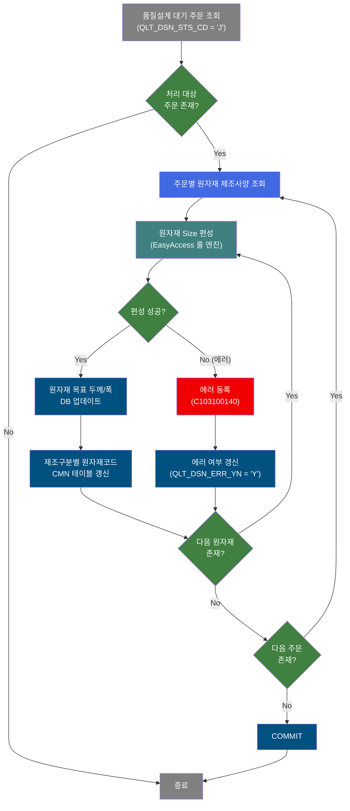
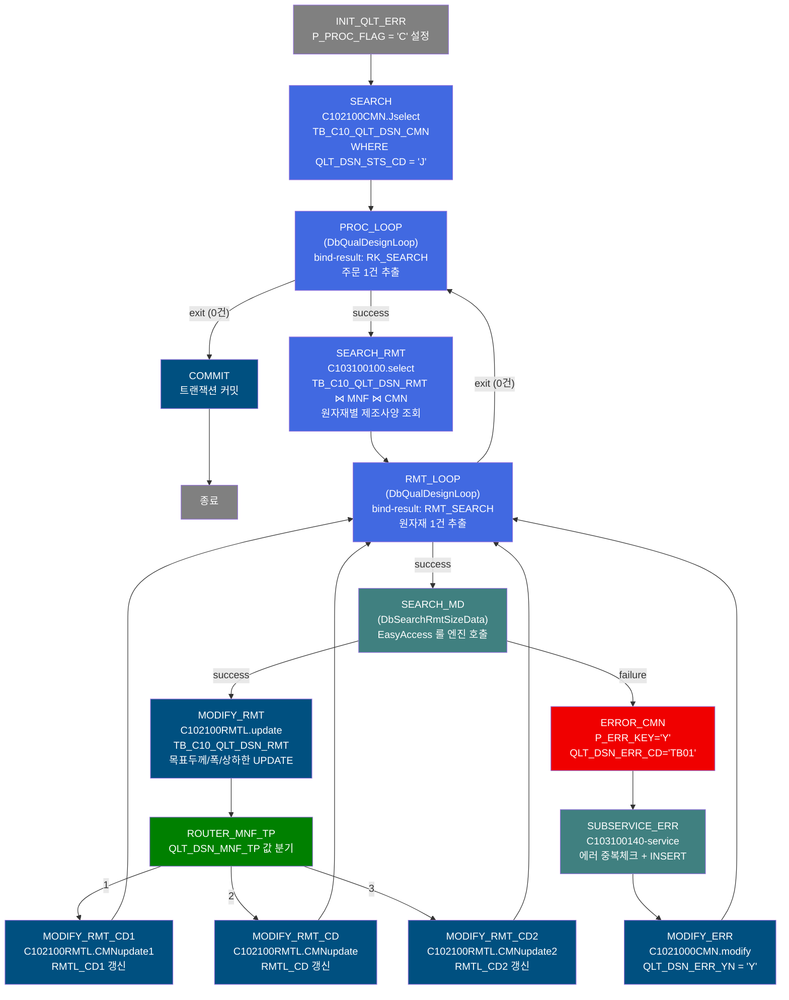
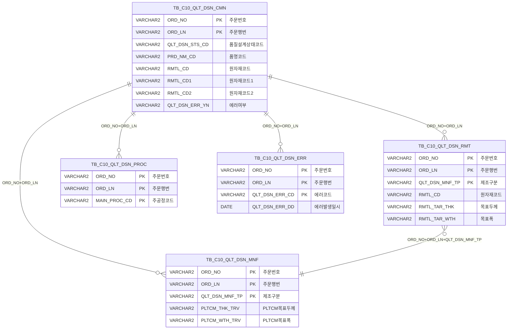

<h1 style="font-size: 40px; text-align: center; font-weight:
   bold; margin: 30px 0;">
  C103100100 레거시 시스템 분석 종합 보고서
</h1>


# 1. 시스템 개요
- **서비스 ID**: C103100100
- **업무명**: 품질설계 원자재 Size 편성 (목표 두께/폭 자동 산출)
- **분석 일시**: 2026-03-16 19:13 KST
- **분석 시간**: 약 5분
- **전체 Activity 수**: 16개 (Custom 2, Built-in 11, Common 3)
- **분석자**: Claude Opus 4.6
- **분석 도구**: /analyze-service C103100100
- **문서 버전**: 1.0

# 📊 비즈니스 프로세스 분석

## 시스템 목적

C103100100 서비스는 품질설계 자동화 프로세스의 핵심 배치(NUI) 서비스로, 대기 상태(`QLT_DSN_STS_CD='J'`)인 주문들을 순회하며 각 주문의 **원자재 목표 두께(RMTL_TAR_THK)**와 **원자재 목표 폭(RMTL_TAR_WTH)**을 자동으로 산출한다. 주문의 품명코드, 주문두께, EDGE지정구분, 중간재 적용 여부 등 다양한 조건에 따라 Master Data(EasyAccess 룰 엔진)를 조회하고, 조회 결과를 기반으로 원자재 사양을 결정한다.

서비스 흐름은 크게 2중 루프 구조로 되어 있다. 외부 루프(`PROC_LOOP`)는 품질설계공통 대기 주문을 1건씩 순회하고, 내부 루프(`RMT_LOOP`)는 각 주문에 대한 제조구분별(QLT_DSN_MNF_TP) 원자재 사양을 순회하며 처리한다. 각 원자재에 대해 `DbSearchRmtSizeData` Activity가 EasyAccess 룰 엔진(C10B2230, C10B1071, C10B1074, C10B1073, C10B2310)을 조회하여 목표 두께/폭을 계산하고, 그 결과를 `TB_C10_QLT_DSN_RMT`(원자재사양) 및 `TB_C10_QLT_DSN_CMN`(공통) 테이블에 UPDATE한다.

에러 발생 시 서브서비스 `C103100140`을 호출하여 에러 이력을 `TB_C10_QLT_DSN_ERR`에 등록하고, 해당 주문의 `QLT_DSN_ERR_YN`을 'Y'로 갱신한 뒤 다음 주문으로 진행한다.

## 핵심 워크플로우 다이어그램



### 상세 워크플로우 다이어그램



## 주요 유즈케이스

### UC-01: 품질설계 대기 주문 원자재 Size 자동 편성

- **Actor**: NUI 배치 프로세스 (품질설계 자동화 시스템)
- **목적**: 대기 상태 주문의 원자재 목표 두께와 폭을 EasyAccess 룰 엔진 기반으로 자동 산출하여 DB에 반영

- **전제조건**:
  - TB_C10_QLT_DSN_CMN에 QLT_DSN_STS_CD = 'J'(대기) 상태 주문이 존재
  - EasyAccess Master Data(C10B2230, C10B1071, C10B1074, C10B1073, C10B2310) 구성 완료
  - 해당 주문에 대한 제조사양(TB_C10_QLT_DSN_MNF) 및 원자재사양(TB_C10_QLT_DSN_RMT) 레코드 존재

- **주요 흐름**:
  1. QLT_DSN_STS_CD = 'J' 조건으로 대기 주문 전체 조회 (C102100CMN.Jselect)
  2. PROC_LOOP가 주문 1건씩 추출, 해당 주문의 원자재 제조사양 조회 (C103100100.select)
  3. RMT_LOOP가 원자재 1건씩 추출, DbSearchRmtSizeData에서 PLTCM폭 최대값 계산 → 중간재적용기준(C10B2230) → 원자재두께기준(C10B1071) → PLTCM수축량(C10B1074) → PLTCM마진량(C10B1073) 순서로 룰 조회
  4. 산출된 목표두께/폭을 TB_C10_QLT_DSN_RMT에 UPDATE (C102100RMTL.update)
  5. 제조구분(QLT_DSN_MNF_TP)에 따라 TB_C10_QLT_DSN_CMN의 RMTL_CD / RMTL_CD1 / RMTL_CD2 갱신
  6. 모든 주문 처리 완료 후 COMMIT

- **대체 흐름**:
  - 룰 조회 결과 0건: 해당 에러코드(ERRCD_KT06 등) 설정 → FAILURE 반환 → 에러 등록
  - 룰 조회 결과 2건 이상: 중복 에러코드(ERRCD_KT11 등) 설정 → FAILURE 반환 → 에러 등록
  - MasterDataException 발생: 해당 에러코드 설정 → FAILURE 반환 → 에러 등록

- **후행조건**:
  - TB_C10_QLT_DSN_RMT에 원자재 목표 두께/폭/상하한 값 갱신
  - TB_C10_QLT_DSN_CMN에 원자재코드(RMTL_CD, RMTL_CD1, RMTL_CD2) 갱신
  - 에러 발생 주문은 QLT_DSN_ERR_YN = 'Y', TB_C10_QLT_DSN_ERR에 에러 이력 등록

### UC-02: 알루미늄칼라/스테인레스칼라 원자재 편성 (품명 5, 7)

- **Actor**: NUI 배치 프로세스
- **목적**: 알루미늄칼라(PRD_NM_CD=5) 또는 스테인레스칼라(PRD_NM_CD=7) 주문은 별도 룰 조회 없이 주문 두께를 그대로 원자재 목표 두께로 사용

- **전제조건**:
  - 주문의 PRD_NM_CD가 '5' 또는 '7'
  - COR_WTH_TRV(제품목표폭) 값 존재

- **주요 흐름**:
  1. PRD_NM_CD가 5 또는 7 확인
  2. 원자재목표두께 = 주문두께(ORD_EXC_THK)
  3. 원자재목표두께하한 = 주문두께
  4. 원자재목표두께상한 = 주문두께
  5. 원자재목표폭 = 제품목표폭(COR_WTH_TRV) 반올림

- **대체 흐름**: 없음 (단순 대입)

- **후행조건**:
  - 원자재 두께 범위가 주문두께 단일값으로 설정됨

### UC-03: 중간재(D코드/FH) 두께 설계 기준 적용

- **Actor**: NUI 배치 프로세스
- **목적**: 중간재품명코드가 'D'(FH)인 경우 FH두께설계기준(C10B2310)을 적용하여 원자재 두께 범위 산출

- **전제조건**:
  - 중간재적용기준(C10B2230) 조회 결과 sem_prd_nm_cd = 'D'
  - 두께관리코드(ORD_THK_MNG_CD), 품명코드, 주문용도코드, 고객사코드 존재

- **주요 흐름**:
  1. 주문용도코드 우선순위 매트릭스 생성: [원본] → [앞3자리+***] → [앞1자리+*****] → [******]
  2. 고객사코드 우선순위: [원본] → [******]
  3. 이중 루프로 FH두께설계기준(C10B2310) 조회
  4. 매칭 성공 시: 원자재목표두께 = PLTCM두께, 하한 = PLTCM두께 + THK_RNG_LLV, 상한 = PLTCM두께 + THK_RNG_ULV
  5. 원자재목표폭 = PLTCM폭

- **대체 흐름**:
  - 모든 우선순위 조합에서 매칭 실패: ERRCD_KT37 에러 등록

- **후행조건**:
  - FH 두께 범위가 PLTCM 기준값 + 설계기준 보정값으로 설정됨

### UC-04: 구매CR(C코드) 중간재 두께 편성

- **Actor**: NUI 배치 프로세스
- **목적**: 중간재품명코드가 'C'인 경우 TM(템퍼밀) 목표값 기반으로 원자재 두께 범위 산출

- **전제조건**:
  - 중간재적용기준 조회 결과 sem_prd_nm_cd = 'C'
  - TM_THK_TRV, TM_WTH_TRV 값 존재

- **주요 흐름**:
  1. 원자재코드가 C25/C32/C70/C7B/C7T인 경우: 두께하한 = TM두께 x 0.98, 상한 = TM두께
  2. 그 외 C코드: 두께하한 = TM두께 x 0.95, 상한 = TM두께 x 1.05
  3. 소수점 2자리 반올림 처리
  4. 원자재목표폭 = TM폭 - 3 (EGI의 경우 반올림, 그 외 소수점 1자리)

- **대체 흐름**: 없음

- **후행조건**:
  - 구매CR 원자재 두께/폭이 TM 기준으로 편성됨

### UC-05: 에러 처리 및 이력 등록

- **Actor**: NUI 배치 프로세스
- **목적**: 원자재 Size 편성 중 에러 발생 시 에러 이력을 등록하고 해당 주문을 에러 상태로 표기

- **전제조건**:
  - DbSearchRmtSizeData에서 FAILURE 반환

- **주요 흐름**:
  1. ERROR_CMN/ERROR_LOG에서 P_ERR_KEY='Y', QLT_DSN_ERR_CD 설정
  2. 서브서비스 C103100140 호출 → 중복 체크 후 TB_C10_QLT_DSN_ERR INSERT
  3. C1021000CMN.modify로 TB_C10_QLT_DSN_CMN의 QLT_DSN_ERR_YN = 'Y' 갱신
  4. RMT_LOOP로 복귀하여 다음 원자재 처리 계속

- **대체 흐름**:
  - 에러 레코드 중복 시: C103100140에서 INSERT 스킵 (중복 방지 로직)

- **후행조건**:
  - 에러 이력 등록 완료, 해당 주문은 에러 표시 상태

---

## 비즈니스 로직 상세

### 1. PLTCM 폭 최대값 결정

- **목적**: 원자재 폭 계산의 기초가 되는 PLTCM 출측 폭 목표값 최대값 산출
- **처리 케이스**:

  **[케이스 1: 3개 공정 폭 비교]**
  ```
    조건: PLTCM_WTH_TRV(주공정), PLTCM_WTH_SUB_PROC1_TRV(대체1), PLTCM_WTH_SUB_PROC2_TRV(대체2)
    처리:
      1. 주공정 폭과 대체1 폭 비교 → 큰 값 선택
      2. 결과와 대체2 폭 비교 → 큰 값 선택
      3. 최대값을 max_pltcm_wth_trv로 설정
  ```

- **계산 공식**:
  ```
  max_pltcm_wth_trv = MAX(PLTCM_WTH_TRV, PLTCM_WTH_SUB_PROC1_TRV, PLTCM_WTH_SUB_PROC2_TRV)
  ```

### 2. 중간재적용기준 판정 (EasyAccess C10B2230)

- **목적**: 알루미늄칼라/스테인레스칼라를 제외한 주문에 대해 중간재 적용 여부 및 중간재 품명코드 결정
- **처리 케이스**:

  **[케이스 1: 중간재 적용 (RecordCount = 1)]**
  ```
    조건: C10B2230 룰에서 1건 매칭
    입력: 품명코드, 주문두께, 주문폭, 최종고객사, 고객사양번호, CCL_BOM_NO
    처리:
      1. 중간재품명코드(sem_prd_nm_cd) 추출
      2. 원자재코드 변경: sem_prd_nm_cd + 기존 원자재코드[1:]
  ```

  **[케이스 2: 중간재 미적용 (RecordCount = 0)]**
  ```
    조건: C10B2230 룰에서 0건 매칭
    처리: 에러 처리하지 않음 (정상 진행)
  ```

  **[케이스 3: 복수 매칭 에러 (RecordCount > 1)]**
  ```
    조건: C10B2230 룰에서 2건 이상 매칭
    처리: ERRCD_KK91 에러코드 설정 → FAILURE 반환
  ```

- **예외 처리**:
  - MasterDataException: result=null 처리 (에러 미발생, 계속 진행)

### 3. 원자재두께기준 산출 (EasyAccess C10B1071)

- **목적**: 원자재코드, PLTCM X-Ray Set치, PLTCM폭을 기반으로 원자재 목표두께 및 두께 범위 산출
- **처리 케이스**:

  **[케이스 1: EDGE지정구분이 NO_SLIT 또는 COIL_EDGE]**
  ```
    조건: ord_edg_asg_tp = 'N' 또는 'C'
    처리:
      1. PLTCM폭에 20mm 가산하여 조회 조건 적용 (2023.6.7 김태성부장 요청)
      2. C10B1071 룰 조회
  ```

  **[케이스 2: 기타 EDGE지정구분]**
  ```
    조건: 그 외
    처리: PLTCM폭 그대로 조회 조건 적용
  ```

- **계산 공식**:
  ```
  원자재목표두께(RMTL_TAR_THK) = C10B1071 룰의 RMTL_TAR_THK 값
  원자재두께하한(RMTL_TAR_THK_LVL) = MIN(C10B1071 룰의 두께1~5)
  원자재두께상한(RMTL_TAR_THK_UVL) = MAX(C10B1071 룰의 두께1~5)

  ※ 하한/상한은 Iterator로 모든 반환 컬럼을 순회하며 DbCommonUtil.numCompare()로 최소/최대 추적
  ```

- **예외 처리**:
  - RecordCount = 0: ERRCD_KT06 - "원자재두께기준 미존재"
  - RecordCount > 1: ERRCD_KT11 - "원자재두께기준 복수 존재"
  - MasterDataException: ERRCD_KT06

### 4. 원자재 목표 폭 결정 (복합 분기)

- **목적**: 품명코드, EDGE지정구분, 중간재품명코드 조합에 따른 원자재 목표 폭 산출
- **처리 케이스**:

  **[케이스 1: EDGE지정 = 'C' (COIL_EDGE)]**
  ```
    처리: 원자재목표폭 = ROUND(PLTCM폭최대값)
  ```

  **[케이스 2: EDGE지정 = 'N' (NO_SLIT) + CGL 계열 품명(G,K,J,L,V,W,3,4,6,9)]**
  ```
    처리: 원자재목표폭 = ROUND(PLTCM폭최대값)
    ※ 2019.10.07 이후 변경: CGL/EGL 폭수축량 반영 로직 → PLTCM 출측폭 최대값으로 단순화
  ```

  **[케이스 3: EDGE지정 = 'N' (NO_SLIT) + EGL 계열 품명(E,2,N,8)]**
  ```
    처리: 원자재목표폭 = ROUND(PLTCM폭최대값)
  ```

  **[케이스 4: EDGE지정 = 'N' (NO_SLIT) + 기타 품명]**
  ```
    처리: 원자재목표폭 = ROUND(제품목표폭(COR_WTH_TRV))
  ```

  **[케이스 5: 기타 EDGE지정]**
  ```
    처리: 원자재목표폭 = ROUND(PLTCM폭최대값 + PLTCM수축량 + PLTCM마진량)
  ```

- **계산 공식**:
  ```
  [일반] 원자재목표폭 = ROUND(max_pltcm_wth_trv + tcm_wth_shr_qty + mrg_wth)
  [COIL_EDGE] 원자재목표폭 = ROUND(max_pltcm_wth_trv)
  [NO_SLIT+CGL/EGL] 원자재목표폭 = ROUND(max_pltcm_wth_trv)
  [NO_SLIT+기타] 원자재목표폭 = ROUND(cor_wth_trv)
  ```

### 5. 중간재별 두께/폭 편성 로직

- **목적**: 중간재 품명코드에 따라 다른 공정 기준값으로 원자재 사양 결정

  **[케이스 1: C코드 (구매CR) - C25,C32,C70,C7B,C7T]**
  ```
    처리:
      1. 원자재목표두께하한 = ROUND(TM두께 x 0.98, 2)
      2. 원자재목표두께상한 = ROUND(TM두께 x 1.00, 2)
      3. 원자재목표두께 = TM두께
      4. 원자재목표폭 = TM폭 - 3 (EGI이면 정수 반올림, 그 외 소수1자리)
  ```

  **[케이스 2: C코드 (기타 구매CR)]**
  ```
    처리:
      1. 원자재목표두께하한 = ROUND(TM두께 x 0.95, 2)
      2. 원자재목표두께상한 = ROUND(TM두께 x 1.05, 2)
      3. 원자재목표두께 = TM두께
      4. 원자재목표폭 = TM폭 - 3
  ```

  **[케이스 3: G,L,V,W코드 (CGL 계열)]**
  ```
    처리:
      1. 원자재목표두께하한 = ROUND(CGL두께 x 0.95, 2)
      2. 원자재목표두께상한 = ROUND(CGL두께 x 1.05, 2)
      3. 원자재목표두께 = CGL두께
      4. 원자재목표폭 = ROUND(CGL폭 - 1, 1)
  ```

  **[케이스 4: E,N코드 (EGL 계열)]**
  ```
    처리:
      1. 원자재목표두께하한 = ROUND(EGL두께 x 0.95, 2)
      2. 원자재목표두께상한 = ROUND(EGL두께 x 1.05, 2)
      3. 원자재목표두께 = EGL두께
      4. 원자재목표폭 = ROUND(EGL폭 - 1, 1)
  ```

### 6. 슬릿 그룹 폭 합산 로직

- **목적**: 슬릿 그룹 주문의 경우 개별 슬릿 폭을 합산하여 주문폭으로 사용
- **처리 케이스**:

  **[케이스 1: 슬릿 그룹 존재 (ORD_SLIT_GRP_CNT > 0)]**
  ```
    조건: ORD_SLIT_GRP_CNT > 0
    처리: 주문폭 = ORD_MIX_WTH1 + ORD_MIX_WTH2 + ... + ORD_MIX_WTH10
  ```

  **[케이스 2: 단일 주문]**
  ```
    조건: ORD_SLIT_GRP_CNT = 0 또는 null
    처리: 주문폭 = ORD_EXC_WTH (원래 값 유지)
  ```

### 7. 제조구분별 원자재코드 갱신 (ROUTER_MNF_TP)

- **목적**: 제조구분(QLT_DSN_MNF_TP) 값에 따라 공통 테이블의 다른 원자재코드 컬럼 갱신
- **처리 케이스**:

  ```
  QLT_DSN_MNF_TP = 1 → RMTL_CD1 갱신 (C102100RMTL.CMNupdate1)
  QLT_DSN_MNF_TP = 2 → RMTL_CD 갱신  (C102100RMTL.CMNupdate)
  QLT_DSN_MNF_TP = 3 → RMTL_CD2 갱신 (C102100RMTL.CMNupdate2)
  ```

---

# ⚙️ Java 컴포넌트 분석

## Custom Activity 상세 분석

### 2개 Custom Activity 발견

### 1. DbSearchRmtSizeData (SEARCH_MD)
- **클래스명**: com.unionsteel.mes.c10.activity.nui.DbSearchRmtSizeData
- **액티비티명**: SEARCH_MD
- **파일 경로**: src/com/unionsteel/mes/c10/activity/nui/DbSearchRmtSizeData.java
- **주요 기능**: 품질설계 자동화에서 원자재 Size(목표 두께/폭) 편성. EasyAccess 룰 엔진(C10B2230, C10B1071, C10B1074, C10B1073, C10B2310)을 조회하여 품명코드, 주문 EDGE지정구분, 중간재 여부 등 조건에 따라 원자재 목표 두께/폭/상하한을 계산.

#### 메소드 구조
- **주요 메소드**: runActivity(PosContext ctx)
  - **반환 타입**: String (SUCCESS / FAILURE)
  - **파라미터**: PosContext ctx

#### SQL 매핑 (총 0개 - 직접 SQL 없음, EasyAccess 룰 엔진 사용)
| SQL 이름 | 쿼리 ID | 타입 | 테이블 |
|---------|---------|-----|-------|
| (EasyAccess) | C10B2230 | 룰 조회 | 중간재적용기준 |
| (EasyAccess) | C10B1071 | 룰 조회 | 원자재두께기준 |
| (EasyAccess) | C10B1074 | 룰 조회 | PLTCM폭수축량기준 |
| (EasyAccess) | C10B1073 | 룰 조회 | PLTCM폭마진량기준 |
| (EasyAccess) | C10B2310 | 룰 조회 | FH두께설계기준 |

#### 핵심 비즈니스 로직
- **PLTCM 폭 최대값 산출**: 주공정/대체공정1/대체공정2 폭 목표치 중 최대값 선택
- **중간재적용기준 판정**: C10B2230으로 중간재 품명코드 결정, 원자재코드 변환
- **원자재두께기준 산출**: C10B1071로 두께 및 두께 하한/상한 산출 (Iterator 기반 min/max 추적)
- **PLTCM수축량/마진량 반영**: C10B1074, C10B1073으로 폭 보정량 산출
- **중간재별 분기 처리**: D코드(FH우선순위 매트릭스), C코드(구매CR 두께 보정), G/L/V/W(CGL), E/N(EGL)
- **슬릿 그룹 폭 합산**: ORD_MIX_WTH1~10 합산

#### Java 상수 및 의존성
- **주요 상수**: PRD_NM_CD_5/7(알루미늄칼라/스테인레스칼라), COIL_EDGE, NO_SLIT, ERRCD_KT06/KT11/KT04/KT05/KT14/KT15/KT37/KK91
- **핵심 의존성**: EasyAccess(룰 엔진), PosDecisionChecker, PosRuleVO, DbCommonUtil, C10NuiConstantsIF

---

### 2. DbQualDesignLoop (PROC_LOOP, RMT_LOOP)
- **클래스명**: com.unionsteel.mes.c10.activity.nui.DbQualDesignLoop
- **액티비티명**: PROC_LOOP (주문 루프), RMT_LOOP (원자재 루프)
- **파일 경로**: src/com/unionsteel/mes/c10/activity/nui/DbQualDesignLoop.java
- **주요 기능**: 이전 액티비티의 ResultSet을 1건씩 순회하는 루프 제어 Activity. 처리 건수 카운터 관리, 현재 Row 데이터를 PosContext에 바인딩, 에러 변수 초기화.

#### 메소드 구조
- **주요 메소드**: runActivity(PosContext ctx)
  - **반환 타입**: String (SUCCESS / EXIT / FAILURE)
  - **파라미터**: PosContext ctx

#### 핵심 비즈니스 로직
- **카운터 기반 루프 제어**: 처리건수(countName)를 1씩 차감하며 0이면 EXIT 반환 → 루프 종료
- **Row 데이터 바인딩**: property(param0~N)의 "저장변수명|대상항목명" 패턴으로 현재 Row 데이터를 PosContext에 설정
- **에러 변수 초기화**: 각 Row 처리 전 P_ERR_KEY='N', QLT_DSN_ERR_YN=SPACE 초기화
- **배치 표시**: BATCH_JOB=true로 설정하여 후속 서비스에 배치 처리임을 알림

#### Java 상수 및 의존성
- **주요 상수**: C10STR_P_ERR_KEY, C10STR_BATCH_JOB, C10STR_COUNTNAME, C10PN_BIND_RESULT, C10STR_EXIT
- **핵심 의존성**: PosRowSet, PosRow, ActivityUtil, DbCommonUtil

---

# 💾 데이터 요구사항

## 핵심 테이블

### 1. TB_C10_QLT_DSN_CMN - (품질설계결과 공통)
| 컬럼명 | 타입 | PK | 설명 |
|--------|------|----|------|
| ORD_NO | VARCHAR2 | ✅ | 주문번호 |
| ORD_LN | VARCHAR2 | ✅ | 주문행번 |
| QLT_DSN_STS_CD | VARCHAR2 | | 품질설계상태코드 (J=대기) |
| PLNT_TP | VARCHAR2 | | 공장구분 |
| PRD_NM_CD | VARCHAR2 | | 품명코드 |
| PRD_SHP | VARCHAR2 | | 제품형상 |
| FLOW_CHL | VARCHAR2 | | 유통경로 |
| ORD_KND | VARCHAR2 | | 주문종류 |
| ORD_PRD_GRD | VARCHAR2 | | 주문제품등급 |
| ORD_USG_CD | VARCHAR2 | | 주문용도코드 |
| CUS_CD | VARCHAR2 | | 고객사코드 |
| FNL_CUS_CD | VARCHAR2 | | 최종고객사코드 |
| CUS_BTH_PAP_NO | VARCHAR2 | | 고객사양번호 |
| ORD_EXC_THK | NUMBER | | 주문두께 |
| ORD_EXC_WTH | NUMBER | | 주문폭 |
| ORD_EDG_ASG_TP | VARCHAR2 | | 주문EDGE지정구분 |
| ORD_SLIT_GRP_CNT | NUMBER | | 슬릿그룹수 |
| ORD_MIX_WTH1~10 | NUMBER | | 혼합폭1~10 |
| ORD_THK_MNG_CD | VARCHAR2 | | 두께관리코드 |
| CCL_BOM_NO | VARCHAR2 | | CCL BOM번호 |
| RMTL_CD | VARCHAR2 | | 원자재코드 (제조구분2) |
| RMTL_CD1 | VARCHAR2 | | 원자재코드1 (제조구분1) |
| RMTL_CD2 | VARCHAR2 | | 원자재코드2 (제조구분3) |
| QLT_DSN_ERR_YN | VARCHAR2 | | 품질설계에러여부 |
| MQL_CD | VARCHAR2 | | 재질코드 |

### 2. TB_C10_QLT_DSN_RMT - (품질설계결과 원자재사양)
| 컬럼명 | 타입 | PK | 설명 |
|--------|------|----|------|
| ORD_NO | VARCHAR2 | ✅ | 주문번호 |
| ORD_LN | VARCHAR2 | ✅ | 주문행번 |
| QLT_DSN_MNF_TP | VARCHAR2 | ✅ | 품질설계제조구분 |
| RMTL_CD | VARCHAR2 | | 원자재코드 |
| RMTL_GRD | VARCHAR2 | | 원자재등급 |
| RMTL_TAR_THK | VARCHAR2 | | 원자재목표두께 |
| RMTL_TAR_WTH | VARCHAR2 | | 원자재목표폭 |
| RMTL_TAR_THK_LVL | VARCHAR2 | | 원자재목표두께하한 |
| RMTL_TAR_THK_UVL | VARCHAR2 | | 원자재목표두께상한 |
| RMTL_TAR_WTH_LVL | VARCHAR2 | | 원자재목표폭하한 |
| RMTL_TAR_WTH_UVL | VARCHAR2 | | 원자재목표폭상한 |

### 3. TB_C10_QLT_DSN_MNF - (품질설계결과 제조사양)
| 컬럼명 | 타입 | PK | 설명 |
|--------|------|----|------|
| ORD_NO | VARCHAR2 | ✅ | 주문번호 |
| ORD_LN | VARCHAR2 | ✅ | 주문행번 |
| QLT_DSN_MNF_TP | VARCHAR2 | ✅ | 품질설계제조구분 |
| PLTCM_THK_TRV | VARCHAR2 | | PLTCM목표두께 |
| PLTCM_SET_THK_TRV | VARCHAR2 | | PLTCM X-Ray Set치 |
| PLTCM_WTH_TRV | VARCHAR2 | | PLTCM주공정폭목표치 |
| PLTCM_WTH_SUB_PROC1_TRV | VARCHAR2 | | PLTCM대체1폭목표치 |
| PLTCM_WTH_SUB_PROC2_TRV | VARCHAR2 | | PLTCM대체2폭목표치 |
| PLTCM_EDG_ASG_TP | VARCHAR2 | | PLTCM EDGE지정구분 |
| COR_WTH_TRV | VARCHAR2 | | 제품목표폭 |
| EGL_THK_TRV | VARCHAR2 | | EGL목표두께 |
| EGL_WTH_TRV | VARCHAR2 | | EGL목표폭 |
| TM_THK_TRV | VARCHAR2 | | TM목표두께 |
| TM_WTH_TRV | VARCHAR2 | | TM목표폭 |
| CGL_THK_TRV | VARCHAR2 | | CGL목표두께 |
| CGL_WTH_TRV | VARCHAR2 | | CGL목표폭 |

### 4. TB_C10_QLT_DSN_PROC - (품질설계결과 공정)
| 컬럼명 | 타입 | PK | 설명 |
|--------|------|----|------|
| ORD_NO | VARCHAR2 | ✅ | 주문번호 |
| ORD_LN | VARCHAR2 | ✅ | 주문행번 |
| MAIN_PROC_CD | VARCHAR2 | ✅ | 주공정코드 |

### 5. TB_C10_QLT_DSN_ERR - (품질설계 에러이력, 서브서비스 C103100140)
| 컬럼명 | 타입 | PK | 설명 |
|--------|------|----|------|
| ORD_NO | VARCHAR2 | ✅ | 주문번호 |
| ORD_LN | VARCHAR2 | ✅ | 주문행번 |
| QLT_DSN_ERR_CD | VARCHAR2 | ✅ | 품질설계에러코드 |
| QLT_DSN_ERR_DD | DATE | | 에러발생일시 |

## 데이터 플로우

### 1. 대기 주문 조회
```
[배치 시작]
→ C102100CMN.Jselect
  FROM TB_C10_QLT_DSN_CMN
  WHERE QLT_DSN_STS_CD = 'J'
→ 결과셋: RK_SEARCH (대기 주문 전체 목록)
```

### 2. 원자재 제조사양 조회 (주문별)
```
[PROC_LOOP에서 주문 1건 추출]
→ C103100100.select
  FROM TB_C10_QLT_DSN_RMT A
  INNER JOIN TB_C10_QLT_DSN_MNF B ON A.ORD_NO=B.ORD_NO AND A.ORD_LN=B.ORD_LN AND A.QLT_DSN_MNF_TP=B.QLT_DSN_MNF_TP
  INNER JOIN TB_C10_QLT_DSN_CMN C ON A.ORD_NO=C.ORD_NO AND A.ORD_LN=C.ORD_LN
  WHERE A.ORD_NO = ? AND A.ORD_LN = ?
  + 스칼라서브쿼리로 TB_C10_QLT_DSN_PROC에서 CGL/EGL 주공정코드 조회
→ 결과셋: RMT_SEARCH (원자재별 제조사양 목록)
```

### 3. 원자재 Size 편성 및 업데이트
```
[RMT_LOOP에서 원자재 1건 추출]
→ DbSearchRmtSizeData (EasyAccess 룰 엔진 호출)
  C10B2230 → 중간재적용기준
  C10B1071 → 원자재두께기준
  C10B1074 → PLTCM수축량기준
  C10B1073 → PLTCM마진량기준
  C10B2310 → FH두께설계기준

[편성 성공 시]
→ C102100RMTL.update
  UPDATE TB_C10_QLT_DSN_RMT
  SET RMTL_TAR_THK, RMTL_TAR_WTH, RMTL_TAR_THK_LVL, RMTL_TAR_THK_UVL,
      RMTL_TAR_WTH_LVL, RMTL_TAR_WTH_UVL, RMTL_CD
  WHERE ORD_NO = ? AND ORD_LN = ? AND QLT_DSN_MNF_TP = ?

→ C102100RMTL.CMNupdate / CMNupdate1 / CMNupdate2 (제조구분별)
  UPDATE TB_C10_QLT_DSN_CMN
  SET RMTL_CD (또는 RMTL_CD1, RMTL_CD2)
  WHERE ORD_NO = ? AND ORD_LN = ?
```

### 4. 에러 처리
```
[편성 실패 시]
→ ERROR_CMN/ERROR_LOG: P_ERR_KEY='Y', QLT_DSN_ERR_CD 설정
→ C103100140-service (서브서비스)
  TB_C10_QLT_DSN_ERR 중복 체크 + INSERT

→ C1021000CMN.modify
  UPDATE TB_C10_QLT_DSN_CMN
  SET QLT_DSN_ERR_YN = 'Y'
  WHERE ORD_NO = ? AND ORD_LN = ?
```

## SQL 일람표
| SQL 이름 | 쿼리 ID | 타입 | 출처 | 테이블 |
|---------|---------|-----|------|-------|
| 품질설계공통 대기 주문 조회 | C102100CMN.Jselect | SELECT | Service | TB_C10_QLT_DSN_CMN |
| 원자재 제조사양 조회 | C103100100.select | SELECT | Service | TB_C10_QLT_DSN_RMT, TB_C10_QLT_DSN_MNF, TB_C10_QLT_DSN_CMN, TB_C10_QLT_DSN_PROC |
| 원자재 Size 수정 | C102100RMTL.update | UPDATE | Service | TB_C10_QLT_DSN_RMT |
| 공통 원자재코드 갱신 (MNF_TP=2) | C102100RMTL.CMNupdate | UPDATE | Service | TB_C10_QLT_DSN_CMN |
| 공통 원자재코드1 갱신 (MNF_TP=1) | C102100RMTL.CMNupdate1 | UPDATE | Service | TB_C10_QLT_DSN_CMN |
| 공통 원자재코드2 갱신 (MNF_TP=3) | C102100RMTL.CMNupdate2 | UPDATE | Service | TB_C10_QLT_DSN_CMN |
| 에러여부 갱신 | C1021000CMN.modify | UPDATE | Service | TB_C10_QLT_DSN_CMN |

## ER 다이어그램 (핵심 관계)



관계 설명:
- TB_C10_QLT_DSN_CMN이 중심 테이블로, 주문 기본 정보와 원자재코드를 관리
- TB_C10_QLT_DSN_RMT: 주문별 제조구분별 원자재 사양 상세 (목표 두께/폭)
- TB_C10_QLT_DSN_MNF: 주문별 제조구분별 공정 목표값 (PLTCM/EGL/CGL/TM 등)
- TB_C10_QLT_DSN_RMT ↔ TB_C10_QLT_DSN_MNF: QLT_DSN_MNF_TP(제조구분)로 1:1 매핑
- TB_C10_QLT_DSN_PROC: 주문별 통과 공정 정보 (CGL/EGL 주공정코드 스칼라서브쿼리용)
- TB_C10_QLT_DSN_ERR: 에러 이력 (서브서비스 C103100140에서 관리)

---

# 🔗 서브서비스

## 서브서비스 요약

| 서비스 ID | 설명 | 호출 액티비티 | 트랜잭션 | 상세 분석 |
|-----------|------|-------------|---------|----------|
| C103100140 | 품질설계결과 에러 등록 (중복 방지) | SUBSERVICE_ERR, SUBSERVICE_ERR1 | 기존 트랜잭션 공유 (new-transaction=false) | [상세 분석 링크](./C103100140_legacy_analysis.md) |

### C103100140 - 품질설계결과 에러 등록
품질설계 과정에서 발생한 에러 코드를 TB_C10_QLT_DSN_ERR에 등록하는 서비스. DbSearchCmnErrorCheck Activity가 ORD_NO+ORD_LN+QLT_DSN_ERR_CD 3개 복합키로 중복 체크 후, 미존재 시에만 PosInsert로 INSERT 수행. Activity 2개, SQL Key 2개.

---

# 📌 특이사항 및 주의사항

## 1. EasyAccess 룰 엔진 의존성
- **다수 룰 정의 참조**: C10B2230(중간재적용), C10B1071(원자재두께), C10B1074(수축량), C10B1073(마진량), C10B2310(FH두께설계) 등 5개 룰 정의에 의존. 룰 데이터 변경 시 편성 결과에 직접 영향.
- **RecordCount 기반 분기**: 룰 조회 결과 건수(0/1/1+)에 따라 에러 코드가 다르게 설정됨. 마스터 데이터의 정합성이 서비스 정상 동작의 핵심.

## 2. 주석 처리된 코드 다수 존재 (CGL/EGL 폭수축량 로직)
- **DbSearchRmtSizeData.java 516~635행**: CGL/EGL 폭수축량(C10B1075, C10B1076) 조회 로직이 통째로 주석 처리됨. 2019.10.07 이후 PLTCM 출측폭 최대값으로 단순화되었으나, 주석 코드가 약 120행 잔존.
- 이전 로직은 `원자재폭 = 제품폭 + CGL/EGL폭감소량` 이었으나 현재는 `원자재폭 = ROUND(PLTCM폭최대값)`으로 변경됨.

## 3. 하드코딩된 원자재코드 목록
- **구매CR 특별 처리**: C25, C32, C70, C7B, C7T 5개 코드가 하드코딩되어 두께 보정 비율(x0.98)이 적용됨 (line 733). 다른 C코드는 x0.95/x1.05 적용.
- **중간재품명코드 판별**: `rmtl_cd.substring(0,1)`로 H/M 이외의 첫 글자를 중간재품명코드로 사용하는 로직 (line 316-318)이 C10B2230 결과와 별도로 동작.

## 4. 2중 루프 + 카운터 기반 순회 패턴
- **DbQualDesignLoop**: 전체 RowSet에서 카운터를 1씩 차감하며 매번 `reset()` → `hasNext()` → N번째 Row까지 순회하는 O(N^2) 복잡도의 순회 패턴. 대상 건수가 많을 경우 성능 이슈 가능.
- **EXIT 전이**: 루프 종료 시 XML에 정의된 transition이 아닌 코드에서 직접 "exit" 문자열을 반환하는데, service XML에 exit transition이 명시적으로 정의되어 있지 않으므로 기본 end로 처리됨.

## 5. FH두께설계기준 우선순위 매트릭스 (최근 추가)
- **ord_usg_cd 4단계 와일드카드**: 용도코드 원본 → 앞3자리+*** → 앞1자리+***** → ****** 순으로 EasyAccess 조회하는 Fallback 패턴. 고객사코드도 원본 → ****** 2단계.
- **이중 루프로 최대 8회 조회**: 4(용도) x 2(고객사) = 8가지 조합에서 첫 번째 매칭 시 break. 전체 실패 시 ERRCD_KT37 에러.

## 6. 에러 처리의 비대칭성
- **ERROR_CMN vs ERROR_LOG**: 두 Activity 모두 동일한 구조(P_ERR_KEY='Y' + QLT_DSN_ERR_CD 설정)이지만, ERROR_CMN은 'TB01', ERROR_LOG는 'TB06' 에러코드를 사용. SUBSERVICE_ERR과 SUBSERVICE_ERR1도 동일 서비스(C103100140)를 호출하지만 후속 처리가 다름(MODIFY_ERR → RMT_LOOP vs MODIFY_ERR1 → PROC_LOOP).

## 7. 트랜잭션 관리
- **tx1 트랜잭션**: SEARCH_MD(DbSearchRmtSizeData)와 COMMIT Activity가 tx1로 묶여 있음. 모든 주문 처리가 완료된 후 한 번에 COMMIT. 중간에 에러가 발생해도 다른 주문 처리는 계속 진행되며, 최종 COMMIT에서 에러/성공 모두 반영.
- **서브서비스 트랜잭션 공유**: C103100140이 `new-transaction=false`로 설정되어 부모 트랜잭션(tx1)을 공유. 에러 등록도 최종 COMMIT에 포함.

---

# 📚 참고 문서

- **Query SQL**:
  - `src/query/C103100100-query.glue_sql`
  - `src/query/C102100RMTL-query.glue_sql`
  - `src/query/C102100CMN-query.glue_sql`
- **Custom Java 클래스**:
  - `src/com/unionsteel/mes/c10/activity/nui/DbSearchRmtSizeData.java`
  - `src/com/unionsteel/mes/c10/activity/nui/DbQualDesignLoop.java`
- **서브서비스 분석**: `docs/analysis/service/nui/C103100140_legacy_analysis.md`
