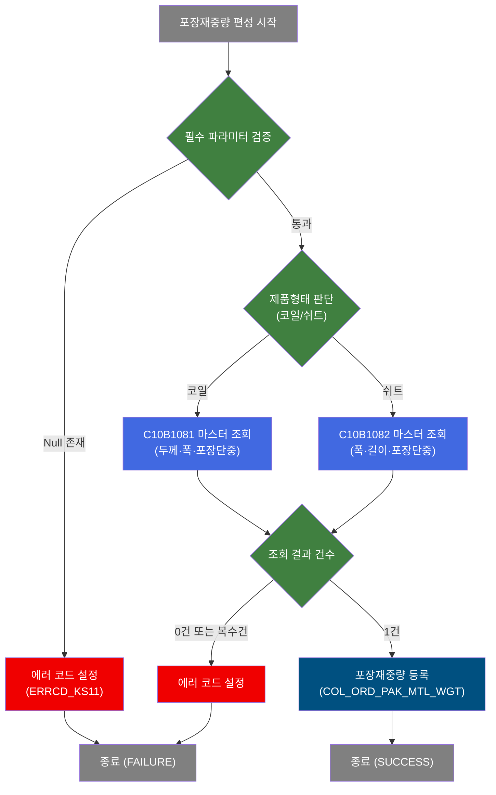
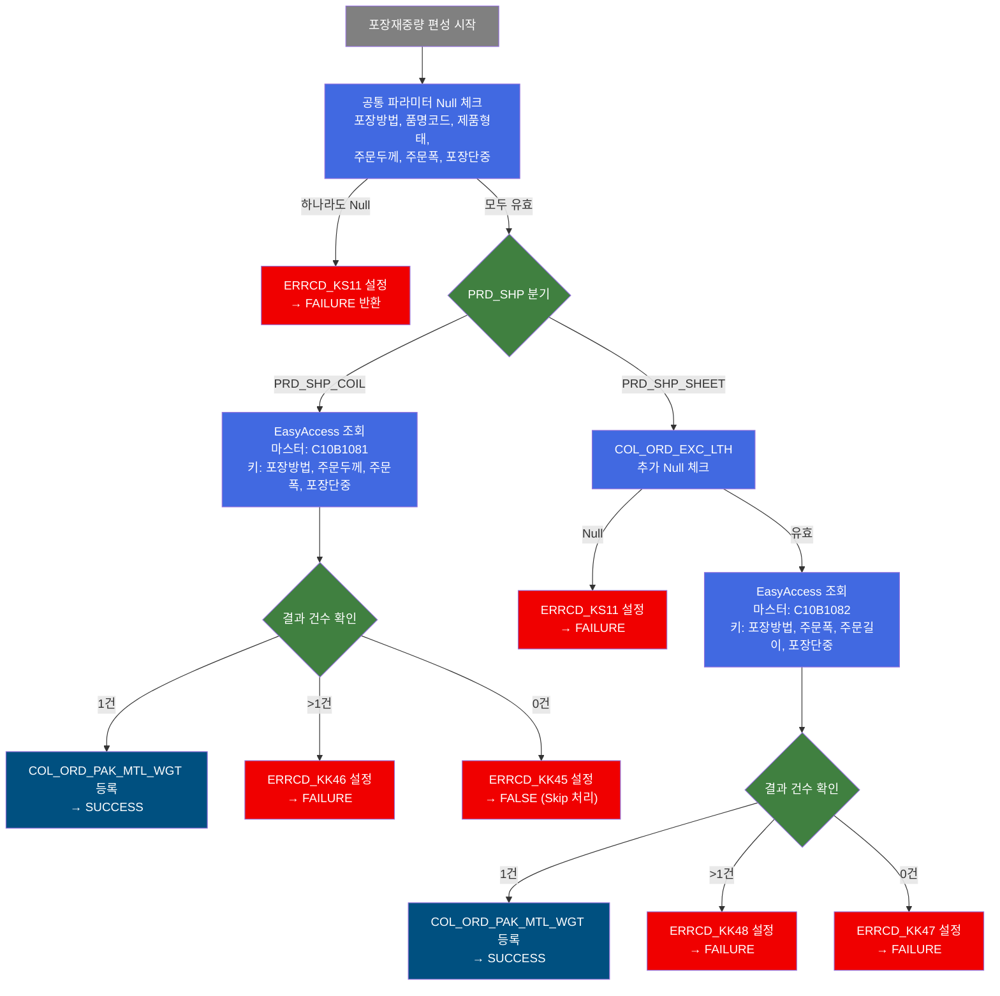
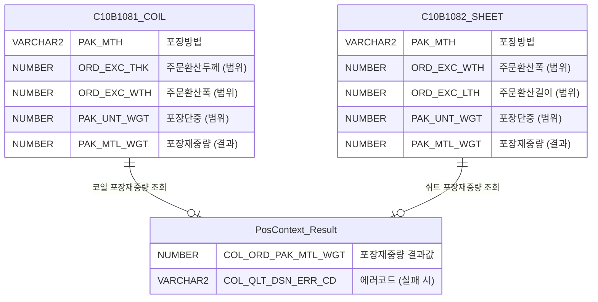

<h1 style="font-size: 40px; text-align: center; font-weight:
   bold; margin: 30px 0;">
  C103100110 레거시 시스템 분석 종합 보고서
</h1>


# 1. 시스템 개요
- **서비스 ID**: C103100110
- **업무명**: 포장재중량 마스터 조회 (PAK_MTL_WGT)
- **분석 일시**: 2026-03-16 19:25 KST
- **전체 Activity 수**: 1개 (Custom 1개)
- **분석자**: Claude Opus 4.6
- **분석 도구**: /analyze-service C103100110
- **문서 버전**: 1.0

# 📊 비즈니스 프로세스 분석

## 시스템 목적

C103100110 서비스는 제품의 포장재중량(PAK_MTL_WGT)을 편성하는 NUI(배치) 서비스이다. 주문 제품의 형태(코일/쉬트)에 따라 서로 다른 마스터 기준표(EasyAccess)를 조회하여 포장에 소요되는 자재 중량을 결정한다.

이 서비스는 품질설계 프로세스의 일부로, 코일은 `C10B1081` 마스터를, 쉬트는 `C10B1082` 마스터를 참조한다. 코일과 쉬트는 포장 방식이 다르므로 조회 키 구성도 다르다. 코일은 포장방법·두께·폭·포장단중 4개 키로, 쉬트는 포장방법·폭·길이·포장단중 4개 키로 조회한다. 조회 결과가 정확히 1건일 때만 포장재중량 값을 PosContext에 등록하고 성공 처리한다.

## 핵심 워크플로우 다이어그램



### 상세 워크플로우 다이어그램



## 주요 유즈케이스

### UC-01: 코일 제품 포장재중량 편성
- **Actor**: 품질설계 배치 프로세스
- **목적**: 코일 형태 제품에 대해 포장재중량 마스터(C10B1081)를 조회하여 정확한 포장재중량 값을 결정

- **전제조건**:
  - PosContext에 포장방법(COL_ORD_PAK_MTH), 품명코드(COL_PRD_NM_CD), 제품형태(COL_PRD_SHP), 주문환산두께(COL_ORD_EXC_THK), 주문환산폭(COL_ORD_EXC_WTH), 포장단중(COL_PAK_UNT_WGT)이 설정됨
  - 제품형태가 코일(PRD_SHP_COIL)임
  - C10B1081 마스터 데이터에 해당 조건에 맞는 기준 데이터가 등록됨

- **주요 흐름**:
  1. 공통 필수 파라미터 6개에 대한 Null 체크 수행
  2. 제품형태(PRD_SHP)가 코일(PRD_SHP_COIL)인지 확인
  3. EasyAccess.getPosDecisionChecker(C10B1081)로 마스터 기준표 조회 (키: 포장방법, 주문두께, 주문폭, 포장단중)
  4. 조회 결과가 정확히 1건이면 COL_ORD_PAK_MTL_WGT에 포장재중량 등록
  5. SUCCESS 반환

- **대체 흐름**:
  - 필수 파라미터 Null: ERRCD_KS11 설정 → FAILURE 반환
  - 조회 결과 복수건(>1): ERRCD_KK46("코일 포장재중량 기준 복수") 설정 → FAILURE 반환
  - 조회 결과 0건: ERRCD_KK45("코일 포장재중량 기준 미등록") 설정 → FALSE 반환 (Skip 처리)

- **후행조건**:
  - PosContext에 COL_ORD_PAK_MTL_WGT 값이 등록됨
  - 후속 품질설계 Activity에서 해당 값 참조 가능

### UC-02: 쉬트 제품 포장재중량 편성
- **Actor**: 품질설계 배치 프로세스
- **목적**: 쉬트 형태 제품에 대해 포장재중량 마스터(C10B1082)를 조회하여 정확한 포장재중량 값을 결정

- **전제조건**:
  - UC-01의 공통 필수 파라미터 6개 + 주문환산길이(COL_ORD_EXC_LTH) 추가 설정됨
  - 제품형태가 쉬트(PRD_SHP_SHEET)임
  - C10B1082 마스터 데이터에 해당 조건에 맞는 기준 데이터가 등록됨

- **주요 흐름**:
  1. 공통 필수 파라미터 6개에 대한 Null 체크 수행
  2. 제품형태(PRD_SHP)가 쉬트(PRD_SHP_SHEET)인지 확인
  3. COL_ORD_EXC_LTH(주문환산길이) 추가 Null 체크
  4. EasyAccess.getPosDecisionChecker(C10B1082)로 마스터 기준표 조회 (키: 포장방법, 주문폭, 주문길이, 포장단중)
  5. 조회 결과가 정확히 1건이면 COL_ORD_PAK_MTL_WGT에 포장재중량 등록
  6. SUCCESS 반환

- **대체 흐름**:
  - 주문환산길이 Null: ERRCD_KS11 설정 → FAILURE 반환
  - 조회 결과 복수건(>1): ERRCD_KK48("쉬트 포장재중량 기준 복수") 설정 → FAILURE 반환
  - 조회 결과 0건: ERRCD_KK47("쉬트 포장재중량 기준 미등록") 설정 → FAILURE 반환

- **후행조건**:
  - PosContext에 COL_ORD_PAK_MTL_WGT 값이 등록됨

### UC-03: 포장재중량 편성 실패 처리
- **Actor**: 품질설계 배치 프로세스
- **목적**: 포장재중량 마스터 조회 실패 시 에러 코드를 설정하여 후속 프로세스에서 오류를 인지하도록 처리

- **전제조건**:
  - PosContext에 필수 파라미터가 설정됨 (일부 Null이거나 마스터 미등록)

- **주요 흐름**:
  1. 필수 파라미터 Null 체크 또는 마스터 조회 수행
  2. 실패 조건에 해당하는 에러코드를 COL_QLT_DSN_ERR_CD에 설정
  3. C10STR_P_ERR_KEY 플래그를 "Y"로 설정
  4. FAILURE 또는 FALSE 반환

- **대체 흐름**:
  - 코일 0건 조회 시: FALSE 반환 (FAILURE와 구별 — Skip 처리로 후속 Activity에서 별도 대응 가능)

- **후행조건**:
  - 에러 코드가 PosContext에 등록되어 후속 프로세스에서 참조 가능
  - 에러 로그에 해당 내용 기록

---
## 비즈니스 로직 상세

### 1. 포장재중량 마스터 조회 로직

- **목적**: 주문 제품의 형태(코일/쉬트)에 따라 적절한 마스터 기준표에서 포장재중량을 조회하여 품질설계에 반영

- **처리 케이스**:

  **[케이스 1: 코일 제품 (PRD_SHP = PRD_SHP_COIL)]**
  ```
    조건: 제품형태가 코일
    처리:
      1. 4개 키(포장방법, 주문두께, 주문폭, 포장단중)로 colValue 배열 구성
      2. EasyAccess.getPosDecisionChecker("C10B1081").getPosRule(colValue) 호출
      3. 결과 1건 → COL_ORD_PAK_MTL_WGT에 포장재중량 등록
      4. 결과 >1건 → ERRCD_KK46 설정 (복수건 에러)
      5. 결과 0건 → ERRCD_KK45 설정, FALSE 반환 (Skip 처리)
  ```

  **[케이스 2: 쉬트 제품 (PRD_SHP = PRD_SHP_SHEET)]**
  ```
    조건: 제품형태가 쉬트
    처리:
      1. COL_ORD_EXC_LTH(주문환산길이) 추가 Null 체크
      2. 4개 키(포장방법, 주문폭, 주문길이, 포장단중)로 colValue 배열 구성
      3. EasyAccess.getPosDecisionChecker("C10B1082").getPosRule(colValue) 호출
      4. 결과 1건 → COL_ORD_PAK_MTL_WGT에 포장재중량 등록
      5. 결과 >1건 → ERRCD_KK48 설정 (복수건 에러)
      6. 결과 0건 → ERRCD_KK47 설정 (미등록 에러)
  ```

  **[케이스 3: 필수 파라미터 누락]**
  ```
    조건: 공통 필수 6개 항목 중 하나라도 Null
    처리:
      1. ERRCD_KS11 에러코드 설정
      2. 즉시 FAILURE 반환
  ```

- **에러 처리**:
  - ERRCD_KS11: 필수 파라미터 누락 - FAILURE 반환
  - ERRCD_KK45: 코일 포장재중량 기준 미등록 - FALSE 반환 (Skip)
  - ERRCD_KK46: 코일 포장재중량 기준 복수건 - FAILURE 반환
  - ERRCD_KK47: 쉬트 포장재중량 기준 미등록 - FAILURE 반환
  - ERRCD_KK48: 쉬트 포장재중량 기준 복수건 - FAILURE 반환

---

# ⚙️ Java 컴포넌트 분석

## Custom Activity 상세 분석

### 1개 Custom Activity 발견

### 1. DbSearchPakMtlWgtData (SEARCH_MD)
- **클래스명**: com.unionsteel.mes.c10.activity.nui.DbSearchPakMtlWgtData
- **액티비티명**: SEARCH_MD
- **파일 경로**: src/com/unionsteel/mes/c10/activity/nui/DbSearchPakMtlWgtData.java
- **주요 기능**: 포장재중량(PAK_MTL_WGT)을 편성하는 Activity 클래스. 주문 제품의 형태(코일/쉬트)에 따라 해당 마스터 데이터 기준(EasyAccess)을 조회하여 포장재중량 값을 PosContext에 등록
- **라인 수**: 181 | **메소드 수**: 1개

> 포장재중량 편성 Activity로, 코일은 `C10B1081`, 쉬트는 `C10B1082` 마스터를 참조한다. EasyAccess 프레임워크를 사용하여 DAO 직접 호출 없이 마스터 기준표를 조회하며, 조회 결과 건수에 따라 SUCCESS/FALSE/FAILURE로 분기한다.

📎 **[상세 분석 보고서](../customClass/com.unionsteel.mes.c10.activity.nui.DbSearchPakMtlWgtData_class_analysis.md)**

---

# 📌 특이사항 및 주의사항

## 1. 코일/쉬트 간 에러 처리 비대칭
- **코일 0건 → FALSE (Skip 처리)**: 코일의 경우 마스터 미등록 시 FALSE를 반환하여 후속 Activity에서 별도 처리 가능 (에러가 아닌 정상 Skip)
- **쉬트 0건 → FAILURE (에러 처리)**: 쉬트의 경우 마스터 미등록 시 FAILURE를 반환하여 즉시 에러 처리됨
- 이 비대칭은 의도적 설계로, 코일은 포장재중량 없이도 진행 가능하나 쉬트는 반드시 포장재중량이 필요함을 의미

## 2. EasyAccess 마스터 조회 방식 사용
- 본 서비스는 DAO(PosJdbcDao)를 직접 사용하지 않고 **EasyAccess 프레임워크**를 통해 마스터 기준표를 조회한다
- `EasyAccess.getPosDecisionChecker(마스터코드).getPosRule(colValue)` 패턴으로, 범위 조건(두께 from~to, 폭 from~to 등)을 포함한 다차원 기준표 매칭을 수행
- SQL 쿼리 파일(.glue_sql)이 존재하지 않으며, 쿼리 캐시에도 관련 쿼리가 없음

## 3. 조회 키 구성의 차이 (코일 vs 쉬트)
- **코일**: 포장방법, **주문두께**, 주문폭, 포장단중 → 두께가 핵심 변별 키
- **쉬트**: 포장방법, 주문폭, **주문길이**, 포장단중 → 길이가 핵심 변별 키 (두께 대신)
- 쉬트는 추가로 `COL_ORD_EXC_LTH`에 대한 별도 Null 체크가 존재하며, 이 값이 없으면 마스터 조회 자체를 시도하지 않음

## 4. 단일 Activity 서비스 구조
- 서비스 전체가 `SEARCH_MD` 단일 Activity로 구성되어 있으며, success 시 바로 end로 전이
- 서비스 XML에 SQL key 정의가 없고, Activity 체인이나 트랜잭션 분기도 없는 단순 구조
- NUI(배치) 서비스로 UI가 없으며, 다른 서비스의 Activity 체인 내에서 호출되는 서브 프로세스 성격

---

# 💾 데이터 요구사항

## 핵심 테이블

| 마스터코드 | 용도 | 조회 키 | 참조 방식 |
|-----------|------|---------|----------|
| C10B1081 | 코일 포장재중량 기준표 | 포장방법, 주문두께, 주문폭, 포장단중 | EasyAccess getPosDecisionChecker |
| C10B1082 | 쉬트 포장재중량 기준표 | 포장방법, 주문폭, 주문길이, 포장단중 | EasyAccess getPosDecisionChecker |

> **참고**: 본 서비스는 DAO를 직접 사용하지 않고 EasyAccess 프레임워크를 통해 마스터 기준표를 조회합니다. SQL 쿼리 파일(.glue_sql)이 존재하지 않습니다.

## ER 다이어그램



관계 설명:
- **C10B1081**: 코일 제품의 포장재중량 기준 마스터. 포장방법+두께+폭+포장단중 4개 키로 범위 기반 매칭
- **C10B1082**: 쉬트 제품의 포장재중량 기준 마스터. 포장방법+폭+길이+포장단중 4개 키로 범위 기반 매칭
- **PosContext_Result**: 조회 결과가 PosContext에 저장되어 후속 품질설계 Activity에서 참조

---

# 📚 참고 문서

- **Service XML**: `src/service/C103100110-service.xml`
- **Custom Java 클래스**:
  - `src/com/unionsteel/mes/c10/activity/nui/DbSearchPakMtlWgtData.java`
