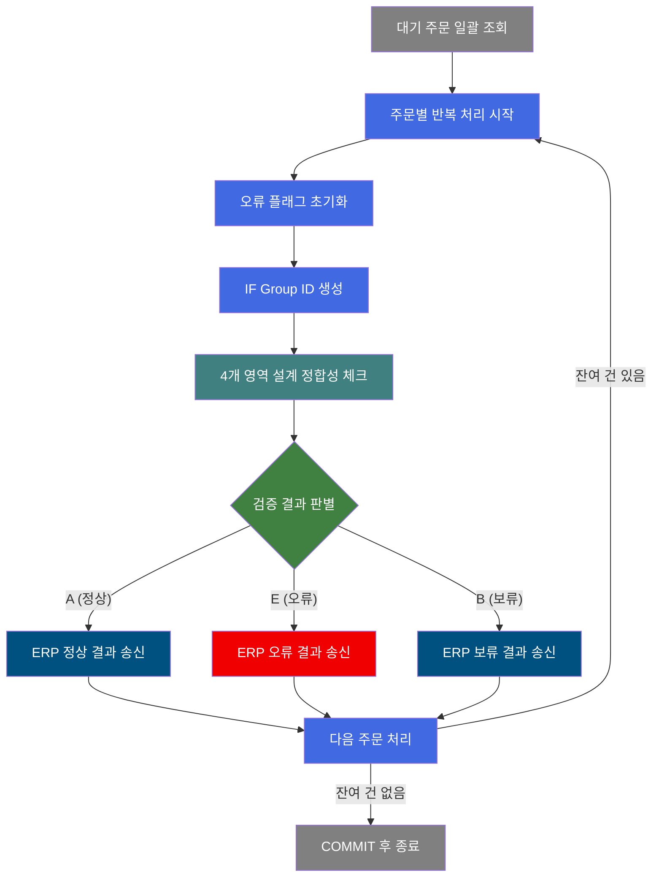
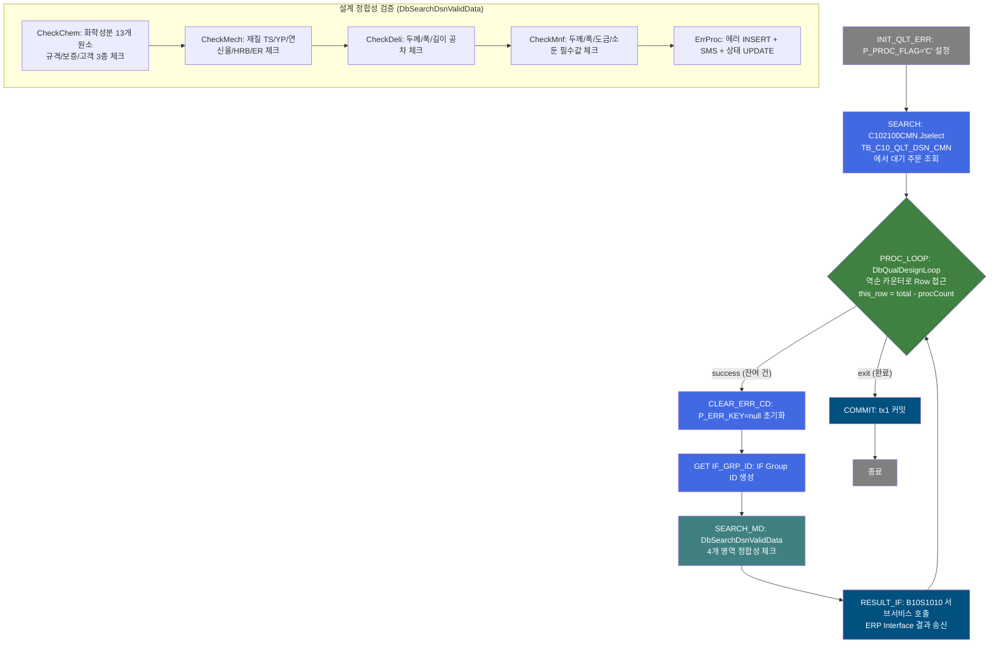
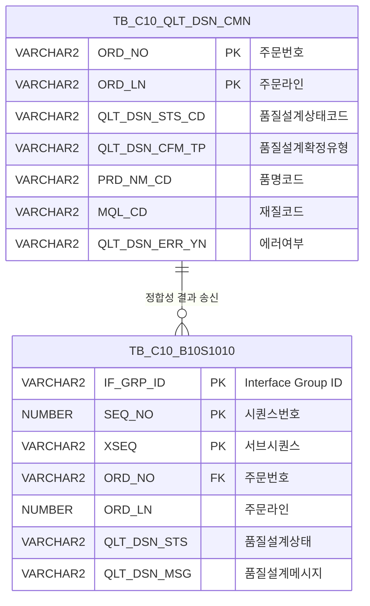

<h1 style="font-size: 40px; text-align: center; font-weight:
   bold; margin: 30px 0;">
  C103100130 레거시 시스템 분석 종합 보고서
</h1>


# 1. 시스템 개요
- **서비스 ID**: C103100130
- **업무명**: 품질설계 정합성 체크 (설계정합성체크)
- **분석 일시**: 2026-03-16 15:36 KST
- **전체 Activity 수**: 8개 (Built-in 3, Common 3, Custom 2)
- **분석자**: Claude Opus 4.6
- **분석 도구**: /analyze-service C103100130
- **문서 버전**: 1.0

# 📊 비즈니스 프로세스 분석

## 시스템 목적

C103100130은 품질설계 대기 상태인 주문에 대해 설계 정합성(Validation)을 일괄 체크하는 NUI(배치) 서비스이다. 품질설계 공통 테이블(TB_C10_QLT_DSN_CMN)에서 대기 주문을 조회한 후, 각 주문에 대해 성분(화학), 재질(기계적 특성), 인수도(치수 공차), 제조사양(두께/폭/도금/소둔) 4개 영역의 설계 데이터 정합성을 검증한다.

검증 결과에 따라 품질설계 상태를 A(자동확정), B(확정대기), E(에러)로 결정하고, 에러 발생 시 에러 코드를 누적하여 DB에 등록한다. 최종 결과는 서브서비스 B10S1010을 통해 EAI Interface로 ERP에 송신한다.

## 핵심 워크플로우 다이어그램



### 상세 워크플로우 다이어그램



## 주요 유즈케이스

### UC-01: 품질설계 대기 주문 일괄 정합성 체크
- **Actor**: 배치 프로세스 (품질설계 서비스 C102100000에서 호출)
- **목적**: 품질설계 대기 상태의 모든 주문에 대해 설계 데이터 정합성을 자동 검증하여 자동확정/보류/에러 상태 결정

- **전제조건**:
  - TB_C10_QLT_DSN_CMN에 품질설계 대기 주문 데이터 존재
  - 규격/보증/고객 사양 데이터가 설계 완료 상태
  - DB 연결(mesdao, eaidao) 정상

- **주요 흐름**:
  1. P_PROC_FLAG='C' 초기화 (INIT_QLT_ERR)
  2. C102100CMN.Jselect로 대기 주문 일괄 조회
  3. PROC_LOOP에서 역순 카운터로 1건씩 순회
  4. 오류 플래그 초기화 (P_ERR_KEY=null)
  5. IF Group ID 생성
  6. DbSearchDsnValidData에서 4개 영역 정합성 체크
  7. B10S1010 서브서비스로 결과 ERP 송신
  8. 다음 주문으로 루프백

- **대체 흐름**:
  - 대기 주문 없음: 루프 즉시 종료 → COMMIT
  - 정합성 체크 오류 시: 에러 코드 누적 후 상태 'E' 설정

- **후행조건**:
  - 각 주문의 QLT_DSN_STS_CD가 A/B/E로 확정
  - 에러 건은 에러 테이블에 에러 코드 기록
  - ERP로 결과 Interface 송신 완료

### UC-02: 화학성분 정합성 체크 (CheckChem)
- **Actor**: DbSearchDsnValidData 내부 메소드
- **목적**: 13개 화학 원소에 대해 규격/보증/고객 3종 사양과 설계값의 정합성 검증

- **전제조건**:
  - 품질설계 성분 데이터 등록 완료
  - 규격/보증/고객별 Min/Max 범위값 설정 완료

- **주요 흐름**:
  1. 13개 원소(C, Si, Mn, P, S, Cu, Ni, Cr, Mo, V, Nb, Ti, Al 등) 순회
  2. 각 원소에 대해 규격사양(SPC), 보증사양(GRT), 고객사양(CUS) 3종 체크
  3. chkMinMax로 Min/Max 범위 내 포함 여부 검증
  4. 범위 초과 시 해당 에러 코드 설정 (CF01~CF07 등)

- **대체 흐름**:
  - 반품주문(ORD_NO가 'R'로 시작): 성분 체크 스킵

- **후행조건**:
  - 에러 발견 시 에러 코드가 누적 문자열에 추가

### UC-03: 제조사양 필수값 체크 (CheckMnf)
- **Actor**: DbSearchDsnValidData 내부 메소드
- **목적**: 두께/폭/PLTCM/도금/소둔 등 제조사양 필수 항목의 설정 여부 검증

- **전제조건**:
  - 제조사양 데이터 등록 완료

- **주요 흐름**:
  1. 두께 관련 필수값 체크 (STD_THK, TOL_THK_UP/DN 등)
  2. 폭 관련 필수값 체크 (STD_WTH, TOL_WTH_UP/DN 등)
  3. PLTCM 출측 두께 체크
  4. 도금량 체크 (CR/EG 계열, GI/GA/GL 계열)
  5. 소둔로/소둔Cycle 체크
  6. 원자재 두께/폭 체크

- **대체 흐름**:
  - 광신스틸 임가공(poc_auto_yn='Y'): 일부 체크 스킵
  - 부산공장(fnl_cus_cd='320104'): 특수 처리

- **후행조건**:
  - 누락된 필수값에 대한 에러 코드(CF20~CF63) 설정

---
## 비즈니스 로직 상세

### 1. ResultSet 루프 처리 (DbQualDesignLoop)

- **목적**: GLUE Framework의 단일 Activity 체인 구조에서 복수 건 반복 처리를 위한 서비스 재진입(루프백) 패턴 구현
- **처리 케이스**:

  **[케이스 1: 정상 루프 진행]**
  ```
    조건: procCount < totalRow (잔여 건 존재)
    처리:
      1. this_row = total_row - procCount (역순 위치 계산)
      2. ResultSet에서 해당 Row의 데이터 추출
      3. param# property에 정의된 26개 변수를 Context에 바인딩
      4. P_ERR_KEY="N", QLT_DSN_ERR_YN="", BATCH_JOB="true" 초기화
      5. procCount 증가 후 "success" 전이
  ```

  **[케이스 2: 루프 종료]**
  ```
    조건: procCount >= totalRow (잔여 건 소진)
    처리:
      1. "exit" 전이로 루프 탈출
      2. COMMIT Activity로 진행
  ```

### 2. 설계 정합성 종합 검증 (DbSearchDsnValidData)

- **목적**: 4개 영역(성분/재질/인수도/제조사양)의 설계 데이터가 올바르게 설계되었는지 검증
- **처리 케이스**:

  **[케이스 1: 정상 확정 (A)]**
  ```
    조건: 4개 영역 모두 에러 없음
    처리:
      1. QLT_DSN_STS_CD = 'A' (자동확정)
      2. QLT_DSN_CFM_TP에 따라 'C'(확정) 또는 'A'(자동확정)
      3. ERP에 정상 결과 송신
  ```

  **[케이스 2: 확정대기 (B)]**
  ```
    조건: QLT_DSN_CFM_TP가 수동확정 요구 또는 특정 조건 충족
    처리:
      1. QLT_DSN_STS_CD = 'B' (확정대기)
      2. 담당자 수동 확인 필요 상태로 전환
      3. ERP에 보류 결과 송신
  ```

  **[케이스 3: 에러 (E)]**
  ```
    조건: 4개 영역 중 하나 이상에서 에러 발생
    처리:
      1. QLT_DSN_STS_CD = 'E' (에러)
      2. ErrProc에서 에러 코드 INSERT + SMS 발송
      3. TB_C10_QLT_DSN_CMN 상태 UPDATE
      4. ERP에 오류 결과 송신
  ```

### 3. Min/Max 범위 검증 로직 (chkMinMax)

- **목적**: 설계값이 규격/보증/고객 사양의 Min~Max 범위 내에 있는지 검증
- **계산 공식**:
  ```
  검증 결과 = (설계값 >= Min값) AND (설계값 <= Max값)

  예시:
  규격 C성분 Min=0.04, Max=0.10
  설계 C성분 = 0.06
  → 0.04 ≤ 0.06 ≤ 0.10 → 정상 (에러 미발생)

  설계 C성분 = 0.12
  → 0.12 > 0.10 → 에러 코드 CF01 발생
  ```

- **예외 처리**:
  - Min/Max가 모두 NULL인 경우: 해당 항목 체크 스킵
  - 반품주문(ORD_NO 'R' prefix): 성분/재질 체크 전체 스킵
  - 광신스틸 임가공(poc_auto_yn='Y'): 일부 제조사양 체크 스킵

---

# ⚙️ Java 컴포넌트 분석

## Custom Activity 상세 분석

### 2개 Custom Activity 발견

### 1. DbQualDesignLoop (PROC_LOOP)
- **클래스명**: com.unionsteel.mes.c10.activity.nui.DbQualDesignLoop
- **액티비티명**: PROC_LOOP
- **파일 경로**: src/com/unionsteel/mes/c10/activity/nui/DbQualDesignLoop.java
- **주요 기능**: ResultSet 기반 반복 처리 루프 게이트웨이
- **라인 수**: 171 | **메소드 수**: 1

> GLUE Framework NUI 서비스에서 이전 액티비티가 조회한 ResultSet을 1건씩 순회 처리하기 위한 루프 제어 액티비티. 역순 카운터 기반으로 Row에 접근하며, 26개 파라미터를 Context에 바인딩한다.

📎 **[상세 분석 보고서](../customClass/com.unionsteel.mes.c10.activity.nui.DbQualDesignLoop_class_analysis.md)**

---

### 2. DbSearchDsnValidData (SEARCH_MD)
- **클래스명**: com.unionsteel.mes.c10.activity.nui.DbSearchDsnValidData
- **액티비티명**: SEARCH_MD
- **파일 경로**: src/com/unionsteel/mes/c10/activity/nui/DbSearchDsnValidData.java
- **주요 기능**: 품질설계 4개 영역 정합성 종합 검증
- **라인 수**: 2,711 | **메소드 수**: 9

> 품질설계 대기 주문에 대해 성분(화학), 재질(기계적 특성), 인수도(치수 공차), 제조사양(두께/폭/도금/소둔) 4개 영역의 설계 데이터 정합성을 검증하고, 에러 코드를 누적하여 DB에 등록하며 최종 상태(A/B/E)를 결정하는 핵심 배치 액티비티.

📎 **[상세 분석 보고서](../customClass/com.unionsteel.mes.c10.activity.nui.DbSearchDsnValidData_class_analysis.md)**

---

# 💾 데이터 요구사항

## 핵심 테이블

### 1. TB_C10_QLT_DSN_CMN - (품질설계 공통 테이블)
| 컬럼명 | 타입 | PK | 설명 |
|--------|------|----|------|
| ORD_NO | VARCHAR2 | ✅ | 주문번호 |
| ORD_LN | VARCHAR2 | ✅ | 주문라인 |
| QLT_DSN_STS_CD | VARCHAR2 | | 품질설계 상태코드 (A/B/E) |
| QLT_DSN_CFM_TP | VARCHAR2 | | 품질설계 확정 유형 |
| PRD_NM_CD | VARCHAR2 | | 품명코드 |
| MQL_CD | VARCHAR2 | | 재질코드 |
| RMTL_CD | VARCHAR2 | | 원자재코드 |
| CRM_MNF_STD_NO | VARCHAR2 | | CRM 제조표준번호 |
| PAS_PROC_NO | VARCHAR2 | | 통과공정번호 |
| QLT_DSN_ERR_YN | VARCHAR2 | | 품질설계 에러 여부 |
| URG_MTL_TP | VARCHAR2 | | 긴급자재 유형 |
| ORD_LN_WGT | NUMBER | | 주문라인 중량 |
| GW_ASG_CD | VARCHAR2 | | GW 할당코드 |
| ORD_SPC_TXT | VARCHAR2 | | 주문 특기사항 |
| ORD_USG_CD | VARCHAR2 | | 주문 용도코드 |
| FNL_CUS_CD | VARCHAR2 | | 최종고객코드 |
| ORD_KND | VARCHAR2 | | 주문종류 |
| ORD_RGS_PRS_ID | VARCHAR2 | | 주문등록자 ID |
| ORD_DSN_CFM_TP | VARCHAR2 | | 주문설계확정유형 |
| CCL_BOM_NO | VARCHAR2 | | CCL BOM번호 |
| ORD_EDG_ASG_TP | VARCHAR2 | | 주문 Edge 할당유형 |
| CUT_LN_YN | VARCHAR2 | | 절단라인 여부 |
| ATT_ORD_YN | VARCHAR2 | | 첨부주문 여부 |
| POC_AUTO_YN | VARCHAR2 | | 광신스틸 자동 여부 |
| CUS_BTH_PAP_NO | VARCHAR2 | | 고객배치용지번호 |
| POC_CGL_YN | VARCHAR2 | | POC CGL 여부 |
| POC_CCL_YN | VARCHAR2 | | POC CCL 여부 |
| PLNT_TP | VARCHAR2 | | 공장유형 |
| PRD_SHP | VARCHAR2 | | 제품형상 |
| FLOW_CHL | VARCHAR2 | | 유통경로 |
| ORD_PRD_GRD | VARCHAR2 | | 주문제품등급 |
| CUS_CD | VARCHAR2 | | 고객코드 |
| ACT_CUS_CD | VARCHAR2 | | 실고객코드 |
| SPC_OFC | VARCHAR2 | | 규격기관 |
| SPC_AVR | VARCHAR2 | | 규격약어 |
| SPC_YR | VARCHAR2 | | 규격년도 |
| SPC_NM | VARCHAR2 | | 규격명 |
| SPC_FUL_NM | VARCHAR2 | | 규격전체명 |
| ORD_SZ | VARCHAR2 | | 주문사이즈 |
| ORD_EXC_THK | NUMBER | | 주문정확두께 |
| ORD_EXC_WTH | NUMBER | | 주문정확폭 |
| ORD_EXC_LTH | NUMBER | | 주문정확길이 |
| CUS_REQ_DLV_DD | VARCHAR2 | | 고객요청납기일 |
| ORD_SCH_DLV_DD | VARCHAR2 | | 주문예정납기일 |

## 데이터 플로우

### 1. 대기 주문 조회
```
품질설계 배치 시작
→ C102100CMN.Jselect
  FROM TB_C10_QLT_DSN_CMN
  WHERE QLT_DSN_STS_CD = 대기 상태 조건
→ 대기 주문 목록 (ResultSet)
→ PROC_LOOP에서 1건씩 순회 처리
```

### 2. 정합성 체크 → 결과 송신
```
각 주문별 반복 처리
→ DbSearchDsnValidData.runActivity()
  - CheckChem: 화학성분 13개 원소 × 3종 사양 범위 체크
  - CheckMech: 재질 TS/YP/연신율/HRB/ER 범위 체크
  - CheckDeli: 두께/폭/길이 공차 범위 체크
  - CheckMnf: 제조사양 필수값 존재 체크
  - ErrProc: 에러 코드 INSERT + 상태 UPDATE
→ B10S1010: EAI를 통해 ERP에 결과 송신
  - 정상(A): TB_C10_B10S1010에 정상 결과 INSERT
  - 오류(E): TB_C10_B10S1010에 에러 결과 INSERT
  - 보류(B): 오류 메시지 유무에 따라 분기 처리
```

## SQL 일람표
| SQL 이름 | 쿼리 ID | 타입 | 출처 | 테이블 |
|---------|---------|-----|-------|-------|
| 대기 주문 조회 | C102100CMN.Jselect | SELECT | Service | TB_C10_QLT_DSN_CMN |

## ER 다이어그램 (핵심 관계)



관계 설명:
- TB_C10_QLT_DSN_CMN이 중심 테이블로, 품질설계 대기 주문 데이터 원본
- TB_C10_B10S1010은 EAI 송신 테이블로, 정합성 검증 결과를 ERP로 전달
- 1:N 관계: 하나의 주문에 대해 여러 건의 Interface 송신 레코드 생성 가능

---

# 🔗 서브서비스

## 서브서비스 요약

| 서비스 ID | 설명 | 호출 액티비티 | 트랜잭션 | 상세 분석 |
|-----------|------|-------------|---------|----------|
| B10S1010 | 품질설계 결과 ERP Interface 송신 | RESULT_IF | 기존 트랜잭션 공유 | [상세 분석 링크](./B10S1010_legacy_analysis.md) |

### B10S1010 - 품질설계 결과 ERP Interface 송신
품질설계 상태코드(A/E/B)에 따라 3개 경로로 분기하여 EAI 송신 테이블(TB_C10_B10S1010)에 결과를 INSERT한다. Activity 9개, SQL 4개. 정상 경로는 품질설계 공통 테이블에서 조회 후 INSERT, 오류 경로는 에러 메시지 NOT NULL 건만 필터링하여 INSERT.

# 📌 특이사항 및 주의사항

## 1. DbSearchDsnValidData Dead Code 버그
- **소둔로/소둔Cycle 체크 미실행**: CheckMnf() 내 소둔 관련 조건식이 `&&`(AND)로 연결되어 있어 CF36~CF63 에러 코드 체크가 실제로 실행되지 않음
- CR/EG 계열(CF36~CF43)과 GI/GA/GL 계열(CF44~CF63) 모두 해당
- 현재 운영 환경에서 소둔 관련 에러가 감지되지 않을 수 있음

## 2. 하드코딩된 비즈니스 예외 처리
- **반품주문 스킵**: ORD_NO가 'R'로 시작하는 주문은 성분/재질 체크 전체 스킵
- **광신스틸 임가공**: `poc_auto_yn='Y'`인 경우 일부 제조사양 체크 스킵
- **부산공장**: `fnl_cus_cd='320104'`에 대한 특수 처리 로직 존재
- 이러한 하드코딩은 비즈니스 규칙 변경 시 코드 수정 필요

## 3. 대규모 클래스 복잡도
- DbSearchDsnValidData가 2,711라인으로 매우 크며, 9개 메소드에 걸쳐 복잡한 검증 로직 포함
- chkMinMax 중복 호출(line 1275, 1302)이 존재하여 불필요한 반복 실행 가능성
- 에러 코드가 CF01~CF73까지 광범위하게 사용되며, 코드 관리 복잡성 높음

## 4. 루프 패턴의 트랜잭션 관리
- PROC_LOOP에서 전체 주문을 순회하는 동안 하나의 트랜잭션(tx1) 내에서 처리
- 대량 주문 처리 시 트랜잭션이 길어질 수 있으며, 중간 실패 시 전체 롤백
- B10S1010 서브서비스는 별도 트랜잭션(tx2, eaidao)을 사용하여 EAI 송신

## 5. SMS 발송 기능
- ErrProc에서 에러 발생 시 SMS 발송 기능이 포함되어 있음
- 대량 에러 발생 시 SMS 대량 발송 가능성에 대한 제어 메커니즘 확인 필요

---

# 📚 참고 문서

- **Query SQL**: `src/query/C102100CMN-query.glue_sql`
- **Service XML**: `src/service/C103100130-service.xml`
- **Custom Java 클래스**:
  - `src/com/unionsteel/mes/c10/activity/nui/DbQualDesignLoop.java`
  - `src/com/unionsteel/mes/c10/activity/nui/DbSearchDsnValidData.java`
