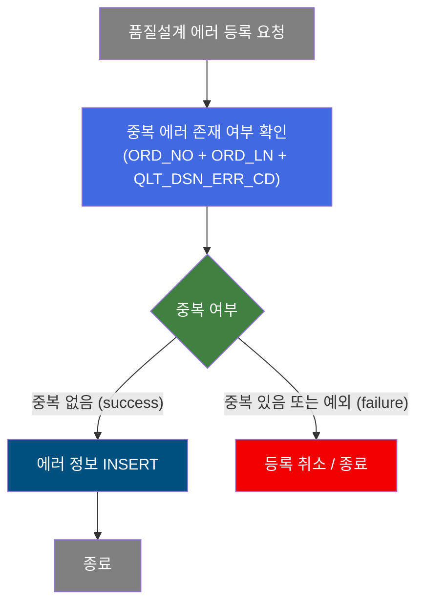
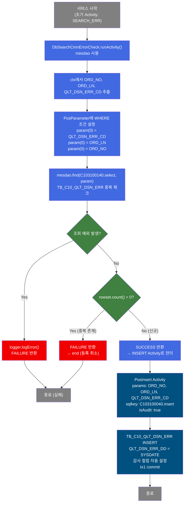
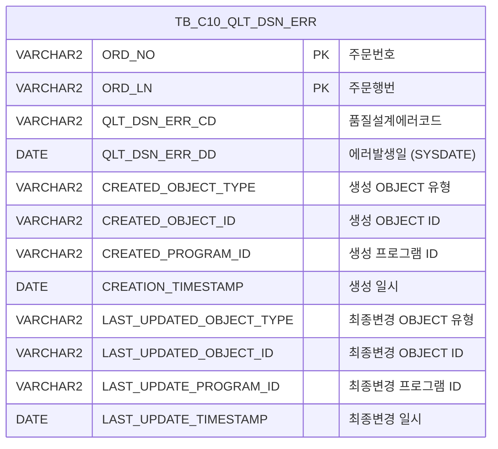

<h1 style="font-size: 40px; text-align: center; font-weight:
   bold; margin: 30px 0;">
  C103100140 레거시 시스템 분석 종합 보고서
</h1>


# 1. 시스템 개요
- **서비스 ID**: C103100140
- **업무명**: 품질설계결과 에러 등록 (중복 방지 포함)
- **분석 일시**: 2026-03-16 15:39 KST
- **분석 시간**: 약 3분
- **전체 Activity 수**: 2개 (Custom 1, Built-in 1)
- **분석자**: Claude Sonnet 4.6
- **분석 도구**: /analyze-service C103100140
- **문서 버전**: 1.0

# 📊 비즈니스 프로세스 분석

## 시스템 목적

C103100140 서비스는 품질설계 과정에서 발생한 에러 정보를 `TB_C10_QLT_DSN_ERR` 테이블에 등록하는 NUI(배치) 서비스이다. 핵심 기능은 동일한 주문에 대한 동일한 품질설계 에러코드가 중복 등록되지 않도록 방지하는 것이다.

서비스는 두 단계로 구성된다. 첫 번째로 `SEARCH_ERR` Activity(DbSearchCmnErrorCheck)가 주문번호(ORD_NO), 주문행번(ORD_LN), 품질설계에러코드(QLT_DSN_ERR_CD)의 3개 복합키로 기존 레코드 존재 여부를 조회한다. 중복이 없을 경우에만 두 번째 `INSERT` Activity(PosInsert)가 실행되어 신규 에러 레코드를 등록한다.

트랜잭션 관리자(`tx1`)가 설정되어 있으며 `commit=true`로 자동 커밋된다. 에러 중복 방지 로직이 서비스 앞단에서 Java Activity로 처리되므로, DB 레벨의 중복 키 오류 없이 안전하게 INSERT가 수행된다.

## 핵심 워크플로우 다이어그램



### 상세 워크플로우 다이어그램



## 주요 유즈케이스

### UC-01: 신규 품질설계 에러 등록

- **Actor**: NUI 배치 프로세스 / 품질설계 시스템
- **목적**: 품질설계 과정에서 발생한 에러 코드를 에러 이력 테이블에 신규 등록
- **전제조건**:
  - 주문번호(ORD_NO)가 PosContext에 설정되어 있음
  - 주문행번(ORD_LN)이 PosContext에 설정되어 있음
  - 품질설계에러코드(QLT_DSN_ERR_CD)가 PosContext에 설정되어 있음
  - 해당 조합의 에러가 아직 등록되지 않음

- **주요 흐름**:
  1. 서비스 호출 시 SEARCH_ERR Activity(DbSearchCmnErrorCheck) 실행
  2. `C103100140.select` 쿼리로 TB_C10_QLT_DSN_ERR 중복 체크
  3. 조회 결과 0건 → SUCCESS 반환 → INSERT Activity로 전이
  4. `C103100040.insert` 쿼리로 신규 에러 레코드 삽입 (QLT_DSN_ERR_DD = SYSDATE)
  5. 트랜잭션 커밋 후 종료

- **대체 흐름**:
  - 동일 에러 이미 등록됨: SEARCH_ERR에서 FAILURE 반환 → INSERT 건너뜀 → 종료
  - DB 예외 발생: SEARCH_ERR에서 오류 로그 후 FAILURE 반환 → 종료

- **후행조건**:
  - TB_C10_QLT_DSN_ERR에 신규 에러 레코드 1건 삽입됨
  - 감사 컬럼(CREATED_*, LAST_UPDATED_*) 자동 설정됨

### UC-02: 중복 품질설계 에러 등록 방지

- **Actor**: NUI 배치 프로세스
- **목적**: 이미 등록된 에러 코드의 중복 INSERT를 차단하여 데이터 무결성 보호
- **전제조건**:
  - 동일한 (ORD_NO, ORD_LN, QLT_DSN_ERR_CD) 조합이 TB_C10_QLT_DSN_ERR에 이미 존재

- **주요 흐름**:
  1. SEARCH_ERR Activity에서 중복 체크 실행
  2. `C103100140.select` 조회 결과 1건 이상 → rowset.count() > 0
  3. FAILURE 반환 → INSERT Activity 실행 없이 end로 전이
  4. 트랜잭션 종료 (INSERT 없음)

- **대체 흐름**:
  - 없음 (단순 차단)

- **후행조건**:
  - TB_C10_QLT_DSN_ERR 테이블에 변경 없음
  - 에러 로그 없음 (정상적인 중복 방지 처리)

### UC-03: DB 오류 발생 시 안전 종료

- **Actor**: NUI 배치 프로세스
- **목적**: 중복 체크 중 DB 예외 발생 시 INSERT를 차단하여 데이터 오염 방지
- **전제조건**:
  - DB 연결 오류, 쿼리 실행 오류 등 예외 상황 발생

- **주요 흐름**:
  1. SEARCH_ERR Activity에서 dao.find() 실행 중 Exception 발생
  2. catch(Exception e)에서 logger.logError(e.getMessage()) 실행
  3. FAILURE 반환 → INSERT 차단 → 종료

- **대체 흐름**:
  - 없음

- **후행조건**:
  - 에러 로그에 예외 메시지 기록
  - TB_C10_QLT_DSN_ERR 테이블에 변경 없음

---

## 비즈니스 로직 상세

### 1. 3개 복합키 기반 중복 체크 (DbSearchCmnErrorCheck)

- **목적**: TB_C10_QLT_DSN_ERR에 동일한 주문/에러코드 조합의 레코드가 존재하는지 확인하여 중복 INSERT 방지

- **처리 케이스**:

  **[케이스 1: 신규 에러 (중복 없음)]**
  ```
  조건: SELECT ... FROM TB_C10_QLT_DSN_ERR WHERE ORD_NO=? AND ORD_LN=? AND QLT_DSN_ERR_CD=? 결과 0건
  처리:
    1. rowset.count() == 0 확인
    2. SUCCESS 반환
    3. 다음 Activity(INSERT)로 전이
  ```

  **[케이스 2: 중복 에러 존재]**
  ```
  조건: SELECT 결과 1건 이상
  처리:
    1. rowset.count() > 0 확인
    2. FAILURE 반환
    3. end로 전이 (INSERT 미실행)
  ```

  **[케이스 3: DB 예외 발생]**
  ```
  조건: dao.find() 실행 중 Exception 발생
  처리:
    1. rowset = null 처리
    2. logger.logError(e.getMessage()) 로그 기록
    3. FAILURE 반환 (INSERT 차단)
  ```

- **예외 처리**:
  - DB 조회 예외: logger.logError() 후 FAILURE 반환으로 안전하게 INSERT 차단

### 2. 에러 발생일 자동 설정 (INSERT 쿼리)

- **목적**: 에러 발생 일시를 사용자 입력 없이 Oracle SYSDATE 기반으로 자동 설정
- **처리 케이스**:

  **[케이스 1: QLT_DSN_ERR_DD 자동 산출]**
  ```
  조건: INSERT 시 QLT_DSN_ERR_DD 값 설정
  처리:
    1. Oracle 함수: TO_DATE(TO_CHAR(SYSDATE,'YYYYMMDDHH24MISS'),'YYYYMMDDHH24MISS')
    2. SYSDATE를 'YYYYMMDDHH24MISS' 문자열 → DATE 타입으로 변환
    3. TB_C10_QLT_DSN_ERR.QLT_DSN_ERR_DD 컬럼에 저장
  ```

---

# ⚙️ Java 컴포넌트 분석

## Custom Activity 상세 분석

### 1개 Custom Activity 발견

### 1. DbSearchCmnErrorCheck (SEARCH_ERR)
- **클래스명**: `com.unionsteel.mes.c10.activity.nui.DbSearchCmnErrorCheck`
- **액티비티명**: `SEARCH_ERR`
- **파일 경로**: `src/com/unionsteel/mes/c10/activity/nui/DbSearchCmnErrorCheck.java`
- **주요 기능**: TB_C10_QLT_DSN_ERR 테이블에 동일 키(주문번호+주문행번+품질설계에러코드) 데이터 존재 여부를 확인하여 중복 INSERT 방지
- **라인 수**: 96 | **메소드 수**: 1

> TB_C10_QLT_DSN_ERR 테이블에서 3개 복합키(ORD_NO, ORD_LN, QLT_DSN_ERR_CD)로 기존 레코드를 조회하며, 조회 결과가 1건 이상이면 FAILURE를 반환하여 후속 INSERT Activity 실행을 차단한다. 예외 발생 시에도 동일하게 FAILURE를 반환하여 데이터 무결성을 보호한다.

📎 **[상세 분석 보고서](../customClass/com.unionsteel.mes.c10.activity.nui.DbSearchCmnErrorCheck_class_analysis.md)**

---

# 💾 데이터 요구사항

## 핵심 테이블

### 1. TB_C10_QLT_DSN_ERR - 품질설계 에러 이력

| 컬럼명 | 타입 | PK | 설명 |
|--------|------|----|-----|
| ORD_NO | VARCHAR2 | ✅ | 주문번호 |
| ORD_LN | VARCHAR2 | ✅ | 주문행번 |
| QLT_DSN_ERR_CD | VARCHAR2 | | 품질설계에러코드 |
| QLT_DSN_ERR_DD | DATE | | 품질설계에러발생일 (SYSDATE 자동 설정) |
| CREATED_OBJECT_TYPE | VARCHAR2 | | 생성 OBJECT 유형 |
| CREATED_OBJECT_ID | VARCHAR2 | | 생성 OBJECT ID |
| CREATED_PROGRAM_ID | VARCHAR2 | | 생성 프로그램 ID |
| CREATION_TIMESTAMP | DATE | | 생성 일시 |
| LAST_UPDATED_OBJECT_TYPE | VARCHAR2 | | 최종변경 OBJECT 유형 |
| LAST_UPDATED_OBJECT_ID | VARCHAR2 | | 최종변경 OBJECT ID |
| LAST_UPDATE_PROGRAM_ID | VARCHAR2 | | 최종변경 프로그램 ID |
| LAST_UPDATE_TIMESTAMP | DATE | | 최종변경 일시 |

## 데이터 플로우

### 1. 중복 체크 조회 (SEARCH_ERR)

```
서비스 호출 (ctx에 ORD_NO, ORD_LN, QLT_DSN_ERR_CD 설정됨)
→ C103100140.select
  FROM TB_C10_QLT_DSN_ERR
  WHERE ORD_NO = ?        -- ctx에서 추출
    AND ORD_LN = ?        -- ctx에서 추출
    AND QLT_DSN_ERR_CD = ?  -- ctx에서 추출
→ rowset.count() 확인
  - count > 0: FAILURE (INSERT 중단)
  - count = 0: SUCCESS (INSERT 진행)
```

### 2. 에러 레코드 신규 등록 (INSERT)

```
SEARCH_ERR에서 SUCCESS 반환 시
→ C103100040.insert
  INSERT INTO TB_C10_QLT_DSN_ERR
    (ORD_NO, ORD_LN, QLT_DSN_ERR_CD, QLT_DSN_ERR_DD,
     CREATED_OBJECT_TYPE, CREATED_OBJECT_ID, CREATED_PROGRAM_ID, CREATION_TIMESTAMP,
     LAST_UPDATED_OBJECT_TYPE, LAST_UPDATED_OBJECT_ID, LAST_UPDATE_PROGRAM_ID, LAST_UPDATE_TIMESTAMP)
  VALUES
    (?, ?, ?,
     TO_DATE(TO_CHAR(SYSDATE,'YYYYMMDDHH24MISS'),'YYYYMMDDHH24MISS'),
     ?, ?, ?, ?,
     ?, ?, ?, ?)
  param0=ORD_NO, param1=ORD_LN, param2=QLT_DSN_ERR_CD (isAudit=true로 감사 컬럼 자동 처리)
→ TB_C10_QLT_DSN_ERR 1건 INSERT
→ tx1 commit
```

## SQL 일람표

| SQL 이름 | 쿼리 ID | 타입 | 출처 | 테이블 |
|---------|---------|-----|------|--------|
| 에러 중복 체크 조회 | C103100140.select | SELECT | com.unionsteel.mes.c10.activity.nui.DbSearchCmnErrorCheck | TB_C10_QLT_DSN_ERR |
| 품질설계 에러 INSERT | C103100040.insert | INSERT | Service (C103100140-service.xml) | TB_C10_QLT_DSN_ERR |

## ER 다이어그램 (핵심 관계)



관계 설명:
- TB_C10_QLT_DSN_ERR는 이 서비스에서 단독으로 사용되는 테이블
- PK는 명시적으로 선언되지 않았으나 (ORD_NO, ORD_LN)을 복합키로 활용 (QLT_DSN_ERR_CD는 중복 체크 조건에 포함)
- 감사 컬럼(CREATED_*, LAST_UPDATED_*)은 PosInsert의 isAudit=true 기능으로 자동 관리

---

# 📌 특이사항 및 주의사항

## 1. SQL 키 불일치 - 쿼리 파일 참조 오류 의심

- **INSERT Activity의 sqlkey**: `C103100040.insert`로 지정되어 있으나, 실제 쿼리는 `C103100140-query.glue_sql` 파일에 정의되어 있음
- `C103100040`은 다른 서비스(품질설계결과 조회)의 ID이며, C103100140 서비스의 INSERT 쿼리가 해당 파일에 혼재하고 있는 구조
- 향후 유지보수 시 쿼리 파일 분리 여부 확인 필요

## 2. PosParameter 인덱스 이상 패턴

- `DbSearchCmnErrorCheck.runActivity()`의 `setWhereClauseParameter` 호출 시 인덱스를 모두 `0`으로 사용:
  ```java
  param.setWhereClauseParameter( 0, colValue[2] );  // QLT_DSN_ERR_CD
  param.setWhereClauseParameter( 0, colValue[1] );  // ORD_LN
  param.setWhereClauseParameter( 0, colValue[0] );  // ORD_NO
  ```
- 쿼리의 WHERE 절은 `ORD_NO=? AND ORD_LN=? AND QLT_DSN_ERR_CD=?` 순서이나 코드는 역순으로 인자를 설정
- `setWhereClauseParameter`가 내부적으로 스택(LIFO) 방식으로 동작하거나, 인덱스 0 지정이 항상 다음 위치에 추가되는 방식일 가능성이 있으나 프레임워크 동작 방식을 확인 없이는 실제 바인딩 순서 보장 불가

## 3. NUI 서비스 구조 - UI 없는 배치 처리

- C103100140은 JSP 화면 없이 NUI(배치) 방식으로만 동작하는 서비스
- 상위 서비스 또는 배치 프로세스에서 ctx에 ORD_NO, ORD_LN, QLT_DSN_ERR_CD를 설정한 후 호출해야 함
- 호출 시 3개 필수 파라미터 누락 시 NullPointerException 발생 가능 (null 체크 없음)

## 4. 중복 방지 로직이 DB 레벨이 아닌 Java 레벨에서만 처리

- 동시 다중 호출 환경에서 Race Condition 가능성 존재
- 두 배치 프로세스가 동시에 동일한 (ORD_NO, ORD_LN, QLT_DSN_ERR_CD)로 서비스를 호출할 경우 두 프로세스 모두 SEARCH_ERR에서 0건 조회 후 동시에 INSERT를 수행할 수 있음
- DB 레벨의 UNIQUE 제약 조건이 없다면 중복 레코드 삽입 가능

## 5. 트랜잭션 범위 설정

- 서비스 XML에 `<transaction-manager id="tx1" commit="true" />` 설정으로 자동 커밋 활성화
- SEARCH_ERR의 FAILURE 반환(end 전이) 시에도 트랜잭션이 종료되나, INSERT가 없으므로 롤백 대상 없음
- INSERT 성공 후 자동으로 커밋됨

---

# 📚 참고 문서

- **Query SQL**: `src/query/C103100140-query.glue_sql`
- **Service XML**: `src/service/C103100140-service.xml`
- **Custom Java 클래스**:
  - `src/com/unionsteel/mes/c10/activity/nui/DbSearchCmnErrorCheck.java`
- **상수 파일**: `src/com/unionsteel/mes/c10/activity/common/constants/C10NuiConstantsIF.java`
