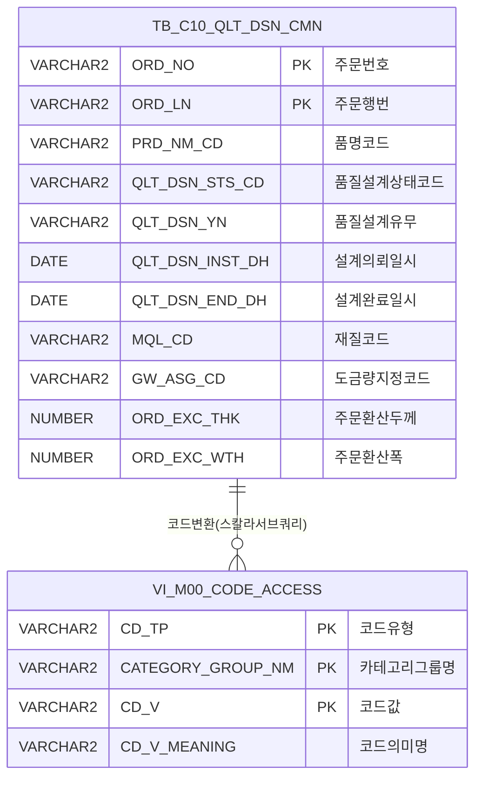

<h1 style="font-size: 40px; text-align: center; font-weight:
   bold; margin: 30px 0;">
  C104000010 레거시 시스템 분석 종합 보고서
</h1>


# 1. 시스템 개요
- **서비스 ID**: C104000010
- **업무명**: 품질설계의뢰현황
- **분석 일시**: 2026-03-16 15:35 (KST)
- **분석 시간**: 약 5분
- **전체 Activity 수**: 3개 (Built-in 3, Custom 0)
- **분석자**: Claude Opus 4.6 + Sonnet 4.6
- **분석 도구**: /analyze-service C104000010
- **문서 버전**: 1.0

# 📊 비즈니스 프로세스 분석

## 시스템 목적

품질설계의뢰현황(C104000010)은 동국제강 C10 냉연/도금 공정에서 주문 단위로 품질설계의뢰 상태를 조회하는 화면이다. 품질설계 담당자가 설계의뢰일자, 주문번호, 품명, 규격약호, 품질설계상태 등 다양한 조건으로 품질설계 대상 주문을 검색하고, 각 주문의 설계 진행 상태(의뢰/진행/완료 등)와 제조표준, 원자재코드, CCL-BOM 코드, 도금량, 통과공정번호 등 핵심 품질설계 정보를 한눈에 파악할 수 있다.

이 화면은 조회 전용 서비스로, 데이터 수정 기능 없이 TB_C10_QLT_DSN_CMN 테이블의 품질설계공통 데이터를 기반으로 동작한다. 행 더블클릭 시 품질설계 상세 화면(C104000020)으로 이동하여 개별 주문의 상세 설계 작업을 수행할 수 있도록 연결된다.

## 주요 유즈케이스

### UC-01: 품질설계의뢰현황 조회

- **Actor**: 품질설계 담당자
- **목적**: 설계의뢰일자 범위 및 다양한 조건으로 품질설계 대상 주문을 검색하여 설계 진행 상태를 파악

- **전제조건**:
  - 사용자가 시스템에 로그인되어 있음
  - TB_C10_QLT_DSN_CMN 테이블에 품질설계 데이터가 존재함
  - 설계의뢰일자가 입력되어 있음 (기본값: 전일~오늘)

- **주요 흐름**:
  1. 화면 진입 시 설계의뢰일자 기본값(전일~오늘) 설정 및 품질설계유무=Y 조건으로 자동 조회 실행
  2. 사용자가 필요 시 추가 검색 조건 입력 (주문번호, 품명, 규격약호, 주문용도, 최종수요가, 두께, 품질설계상태, 긴급재, MO전환유무)
  3. 조회 버튼 클릭 → 날짜 유효성 검증 (빈값 확인, 시작일 ≤ 종료일)
  4. C104000010.select 쿼리 실행 → Grid에 결과 표시 (32개 컬럼)
  5. Grid에서 주문 단위 품질설계 현황 확인

- **대체 흐름**:
  - 설계의뢰일자 미입력 시: "설계의뢰일자를 입력하지 않았습니다!" 경고 → 시작일 필드로 포커스
  - 시작일 > 종료일: "설계의뢰일자를 잘못 입력하였습니다!" 경고 → 시작일 필드로 포커스
  - 조회 결과 없음: Grid에 빈 목록 표시

- **후행조건**:
  - Grid에 조건에 맞는 품질설계의뢰 목록이 표시됨
  - 사용자가 행 더블클릭으로 상세 화면 이동 가능 상태

### UC-02: 품질설계 상세 화면 이동

- **Actor**: 품질설계 담당자
- **목적**: 특정 주문의 품질설계 상세 정보 확인 및 설계 작업 수행

- **전제조건**:
  - 품질설계의뢰현황 Grid에 데이터가 조회된 상태
  - 이동 대상 행이 선택 가능한 상태

- **주요 흐름**:
  1. Grid에서 원하는 주문 행을 더블클릭
  2. 해당 행의 주문번호(ORD_NO, col 0), 주문행번(ORD_LN, col 1), 품질설계유무(QLT_DSN_YN, col 29) 추출
  3. parent.newRemoveOpenTab("C104000020") 호출로 품질설계 상세 탭 열기
  4. C104000020 화면에서 해당 주문의 상세 품질설계 작업 수행

- **대체 흐름**:
  - C104000020 탭이 이미 열려 있는 경우: 기존 탭을 닫고 새로 열기 (newRemoveOpenTab)

- **후행조건**:
  - C104000020 화면이 ORD_NO, ORD_LN, QLT_DSN_YN 파라미터로 열림

### UC-03: 엑셀 내보내기

- **Actor**: 품질설계 담당자
- **목적**: 조회된 품질설계의뢰현황 데이터를 엑셀 파일로 내보내기

- **전제조건**:
  - 검색 조건이 설정된 상태 (Form에 값이 입력됨)

- **주요 흐름**:
  1. 엑셀출력 버튼 클릭
  2. Form 파라미터를 포함하여 excelExport.do URL 구성
  3. 새 창(310x300) 열어 엑셀 다운로드 실행

- **대체 흐름**:
  - 팝업 차단 시: 브라우저 팝업 허용 필요

- **후행조건**:
  - 엑셀 파일 다운로드 완료

### UC-04: 검색 조건 초기화

- **Actor**: 품질설계 담당자
- **목적**: 입력한 검색 조건을 기본값으로 되돌림

- **전제조건**:
  - 사용자가 검색 조건을 변경한 상태

- **주요 흐름**:
  1. 검색조건초기화 버튼 클릭
  2. 설계의뢰일자를 기본값(전일~오늘)으로 복원
  3. 품질설계상태, 품명 콤보를 첫 번째 옵션(전체)으로 재설정
  4. 주문번호, 규격약호, 두께, 최종수요가 텍스트 필드를 빈 문자열로 초기화

- **대체 흐름**: 없음

- **후행조건**:
  - 모든 검색 조건이 기본값으로 복원됨
  - 품질설계유무(QLT_DSN_YN) 콤보는 초기화되지 않음 (주석 처리됨)

---
## 비즈니스 로직 상세

### 1. 코드값→의미명 변환 (스칼라 서브쿼리)

- **목적**: Grid에 표시되는 코드 컬럼을 "코드 : 의미명" 형태의 사용자 친화적 표현으로 변환
- **처리 케이스**:

  **[케이스 1: 고정 카테고리 코드 변환]**
  ```
    조건: CATEGORY_GROUP_NM이 'SZ0000' 고정인 경우
    대상 컬럼: ORD_USG_CD(주문용도), PRD_NM_CD(품명), FNL_CUS_CD(최종수요가),
               MQL_CD(재질), PRD_SHP(제품유형), ORD_PTT_FLM_DTL_CD(보호필름상세),
               MO_CVT_ORD_YN(MO전환주문여부)
    처리:
      1. 각 코드값에 대해 M00APUSER.VI_M00_CODE_ACCESS 뷰에서 CD_V_MEANING 조회
      2. 결과를 "코드 : 의미명" 포맷으로 결합 (예: "E01 : 자동차용")
      3. PRD_NM_CD, PRD_SHP는 "코드 : 의미명" 전체를 표시
  ```

  **[케이스 2: 품명코드 기반 동적 카테고리 코드 변환]**
  ```
    조건: CATEGORY_GROUP_NM이 PRD_NM_CD(품명코드)에 따라 동적 결정되는 경우
    대상 컬럼: GW_ASG_CD(도금량지정코드), ORD_SUR_HND_CD(주문표면처리코드)
    처리:
      1. PRD_NM_CD 값에 따라 DECODE로 카테고리 그룹 결정
         - GW_ASG_CD: '4','L' → SL0000 / '2','E','8','N' → SE0000 / 'V','6' → SV0000 / 'W','9' → SW0000 / 기타 → SG0000
         - ORD_SUR_HND_CD: 'C','D' → SC0000 / 'E','N' → SE0000 / 'G','K','J' → SG0000 / 'L' → SL0000 / 'V','6' → SV0000 / 'W','9' → SW0000 / 기타 → SZ0000
      2. 해당 카테고리에서 코드 의미명 조회
  ```

### 2. 날짜 범위 조건 처리 (주문번호 입력 시 우회)

- **목적**: 주문번호 직접 입력 시 날짜 조건을 사실상 무시하여 전체 기간 조회 가능
- **처리 케이스**:

  **[케이스 1: 주문번호 미입력 (일반 조회)]**
  ```
    조건: :ORD_NO가 빈 문자열
    처리:
      1. QLT_DSN_INST_DH BETWEEN TO_DATE(:QLT_DSN_INST_DH_STR, 'YYYY-MM-DD')
         AND TO_DATE(:QLT_DSN_INST_DH_END, 'YYYY-MM-DD') + 1
      2. 종료일 +1일 하여 해당 일자 23:59:59까지 포함
  ```

  **[케이스 2: 주문번호 입력 시]**
  ```
    조건: :ORD_NO가 입력됨
    처리:
      1. DECODE(:ORD_NO, '', :QLT_DSN_INST_DH_STR, '1900-01-01') → 시작일을 1900-01-01로 설정
      2. DECODE(:ORD_NO, '', :QLT_DSN_INST_DH_END, '3000-12-31') → 종료일을 3000-12-31로 설정
      3. 사실상 날짜 조건 무시 → 해당 주문번호의 모든 이력 조회
  ```

### 3. 체크박스 → LIKE 조건 변환

- **목적**: 체크박스 입력(1/0)을 DB 조건값으로 변환하여 필터링
- **처리 케이스**:

  **[케이스 1: 긴급재 체크]**
  ```
    조건: :URG_MTL_TP = 1 (체크됨)
    처리: DECODE(:URG_MTL_TP, 1, 'Y', '') → 'Y%' 패턴 → URG_MTL_TP='Y'인 데이터만 조회
  ```

  **[케이스 2: MO전환유무 체크]**
  ```
    조건: :MO_CVT_ORD_YN = 1 (체크됨)
    처리: DECODE(:MO_CVT_ORD_YN, 1, 'X', '') → 'X%' 패턴 → MO_CVT_ORD_YN='X'인 데이터만 조회
  ```

  **[케이스 3: 미체크]**
  ```
    조건: 값 = 0 또는 빈값
    처리: DECODE 결과 '' → '%' 패턴 → 전체 조회 (필터 미적용)
  ```

### 4. 품질설계유무 표시 변환

- **목적**: QLT_DSN_YN 코드값을 한글 표시명으로 변환
- **처리 케이스**:
  ```
    DECODE(QLT_DSN_YN, 'Y', '대상', 'N', '비대상', '') AS QLT_DSN_YN_NM
    - 'Y' → '대상' (품질설계 대상 주문)
    - 'N' → '비대상' (품질설계 비대상 주문)
    - 기타 → 빈 문자열
  ```

---

# 💾 데이터 요구사항

## 핵심 테이블

### 1. TB_C10_QLT_DSN_CMN - 품질설계공통 테이블

| 컬럼명 | 타입 | PK | 설명 |
|--------|------|----|-----|
| ORD_NO | VARCHAR2 | ✅ | 주문번호 |
| ORD_LN | VARCHAR2 | ✅ | 주문행번 |
| SPC_AVR | VARCHAR2 | | 규격약호 |
| CUS_BTH_PAP_NO | VARCHAR2 | | 고객사양서번호 |
| ORD_USG_CD | VARCHAR2 | | 주문용도코드 |
| PRD_NM_CD | VARCHAR2 | | 품명코드 |
| FNL_CUS_CD | VARCHAR2 | | 최종수요가코드 |
| URG_MTL_TP | VARCHAR2 | | 긴급재구분 |
| ORD_EXC_THK | NUMBER | | 주문환산두께 |
| ORD_EXC_WTH | NUMBER | | 주문환산폭 |
| MQL_CD | VARCHAR2 | | 재질코드 |
| QLT_DSN_STS_CD | VARCHAR2 | | 품질설계상태코드 |
| RMTL_CD | VARCHAR2 | | 원자재코드 |
| RMTL_CD1 | VARCHAR2 | | 원자재코드1 |
| RMTL_CD2 | VARCHAR2 | | 원자재코드2 |
| CRM_MNF_STD_NO | VARCHAR2 | | 냉연제조표준번호 |
| CRM_MNF_STD_NO1 | VARCHAR2 | | 냉연제조표준번호1 |
| CRM_MNF_STD_NO2 | VARCHAR2 | | 냉연제조표준번호2 |
| PAS_PROC_NO | VARCHAR2 | | 통과공정번호 |
| CCL_BOM_NO | VARCHAR2 | | CCL BOM번호 |
| MTL_CD | VARCHAR2 | | Material Code |
| ORD_EDG_ASG_TP | VARCHAR2 | | 주문Edge지정구분 |
| PRD_SHP | VARCHAR2 | | 제품형태(유형) |
| GW_ASG_CD | VARCHAR2 | | 도금량지정코드 |
| HUE_CD_FRN | VARCHAR2 | | 색상코드(전면) |
| ORD_SUR_HND_CD | VARCHAR2 | | 주문표면처리코드 |
| ORD_PTT_FLM_DTL_CD | VARCHAR2 | | 주문보호필름상세코드 |
| ORD_LN_WGT | NUMBER | | 주문행번중량 |
| QLT_DSN_END_DH | DATE | | 품질설계완료일시 |
| QLT_DSN_YN | VARCHAR2 | | 품질설계유무 |
| MO_CVT_ORD_YN | VARCHAR2 | | MO전환주문여부 |
| QLT_DSN_INST_DH | DATE | | 품질설계의뢰일시 |

### 2. M00APUSER.VI_M00_CODE_ACCESS - 공통코드 뷰 (참조)

| 컬럼명 | 타입 | PK | 설명 |
|--------|------|----|-----|
| CD_TP | VARCHAR2 | ✅ | 코드유형 |
| CATEGORY_GROUP_NM | VARCHAR2 | ✅ | 카테고리그룹명 |
| CD_V | VARCHAR2 | ✅ | 코드값 |
| CD_V_MEANING | VARCHAR2 | | 코드의미명 |

## 데이터 플로우

### 1. 조회

```
[화면 초기 로딩 시 자동 조회]
화면 진입
→ onGridLoadEvent에서 QLT_DSN_YN='Y' 고정 파라미터 + 설계의뢰일자 설정
→ C104000010.select
  FROM TB_C10_QLT_DSN_CMN A
  WHERE ORD_NO LIKE :ORD_NO||'%'
    AND QLT_DSN_INST_DH BETWEEN (날짜범위)
    AND 각종 LIKE 조건 (품명, 규격약호, 주문용도, 수요가, 설계상태, 두께범위, 긴급재, MO전환)
  + 8개 스칼라 서브쿼리 (M00APUSER.VI_M00_CODE_ACCESS)
→ Grid에 품질설계의뢰 목록 표시 (32컬럼)

[조건 변경 후 재조회]
사용자가 검색 조건 입력/변경
→ find 버튼 클릭
→ 날짜 유효성 검증
→ uiCommon.parameters('C104000010_Form_1', 'C104000010_Grid_1', eventName)
→ C104000010.select (동일 쿼리, 변경된 파라미터)
→ Grid 데이터 갱신
```

## SQL 일람표

| SQL 이름 | 쿼리 ID | 타입 | 출처 | 테이블 |
|---------|---------|-----|-------|-------|
| 품질설계의뢰현황 조회 | C104000010.select | SELECT | Service | TB_C10_QLT_DSN_CMN, M00APUSER.VI_M00_CODE_ACCESS |

## ER 다이어그램 (핵심 관계)



관계 설명:
- TB_C10_QLT_DSN_CMN이 중심 테이블로 품질설계공통 데이터를 관리
- VI_M00_CODE_ACCESS 뷰와 8개 스칼라 서브쿼리로 연결 (ORD_USG_CD, PRD_NM_CD, FNL_CUS_CD, MQL_CD, PRD_SHP, GW_ASG_CD, ORD_SUR_HND_CD, ORD_PTT_FLM_DTL_CD, MO_CVT_ORD_YN)
- 코드 변환 시 CATEGORY_GROUP_NM이 품명코드에 따라 동적으로 결정되는 패턴 존재 (GW_ASG_CD, ORD_SUR_HND_CD)

---

# 🖥️ 사용자 인터페이스 요구사항

## 화면 레이아웃 상세

### Layout 구조 (Absolute 배치)
```javascript
{
  positioning: "absolute",
  components: [
    {
      id: "C104000010_Form_1",
      type: "form",
      position: { left: "0px", top: "1px", width: "981px", height: "84px" },
      url: "basicGridData.do",
      referenceItem: "C104000010_Grid_1",
      service: "C104000010-service"
    },
    {
      id: "C104000010_Grid_1",
      type: "grid",
      position: { left: "-7px", top: "88px", width: "976px", height: "467px" },
      url: "handleDataProcess.do",
      contextmenu: true,
      borderline: true,
      pageset: true,
      split: 2,
      rowCnt: 19,
      service: "C104000010-service"
    },
    {
      id: "messagebox",
      type: "messagebox",
      position: { left: "1px", top: "567px", width: "977px", height: "19px" }
    }
  ]
}
```

## 입출력 요소

### Form 컴포넌트
**C104000010_Form_1** (3행 검색 조건 영역, 84px)

**Block 0 (1행)**:
- QLT_DSN_INST_DH_STR: Calendar - 설계의뢰일자(시작), 배경색 #FFFFC0, 기본값 전일
- QLT_DSN_INST_DH_DUR: Label - "~" 구분자
- QLT_DSN_INST_DH_END: Calendar - 설계의뢰일자(종료), 배경색 #FFFFC0, 기본값 오늘
- ORD_NO: Input(10자) - 주문번호, 자동 대문자 변환
- QLT_DSN_YN: Combo - 설계대상유무 (SZ0000/QLT_DSN_YN), 기본 3번째 옵션(인덱스 2)
- excelExport: Button - 엑셀출력 → excelExport 함수 호출
- find: Button - 조회 (기본 disabled) → find 함수 호출
- winClose: Button - 닫기

**Block 1 (2행)**:
- PRD_NM_CD: Combo - 품명 (SZ0000/PRD_NM_CD), 옵션높이 220
- SPC_AVR: Input(15자) - 규격약호, 자동 대문자 변환
- ORD_USG_CD: Input(6자) - 주문용도, 자동 대문자 변환, 검색 팝업(masterPopup) 연결
- MO_CVT_ORD_YN: Checkbox - MO전환유무

**Block 2 (3행)**:
- QLT_DSN_STS_CD: Combo - 품질설계상태 (SZ0000/QLT_DSN_STS_CD), 기본 첫 번째 옵션
- ORD_EXT_THK_STR: Input(6자) - 두께(시작), 우측 정렬
- ORD_EXT_THK_DUR: Label - "~" 구분자
- ORD_EXT_THK_END: Input - 두께(종료), 우측 정렬
- CUS_CD: Input(6자) - 최종수요가, 자동 대문자 변환, 검색 팝업(masterPopup) 연결
- URG_MTL_TP: Checkbox - 긴급재
- clear: CustomButton - 검색조건초기화 → clear 함수 호출

### Grid 컴포넌트

**C104000010_Grid_1 (품질설계의뢰 목록)**
- 편집 가능 여부: 아니오 (전체 읽기 전용, ro/ron 타입)
- Split: 2 (첫 2개 컬럼 고정: 주문번호, 행번)
- Smart Rendering: 활성, 행높이 22px, 프리렌더링 19행
- 컨텍스트 메뉴: 활성 (셀 복사, 엑셀 내보내기)
- 페이지셋: 활성
- 소스 테이블: TB_C10_QLT_DSN_CMN
- 주요 컬럼 (32개):

  **숨김 컬럼**:
  - QLT_DSN_YN: ro - 품질설계유무 (숨김, 0% width)
  - MO_CVT_ORD_YN: ro - MO전환주문여부 (숨김, 0% width)

  **기본 식별 정보** (고정 영역):
  - ORD_NO: ro - 주문번호 (10%, 중앙정렬)
  - ORD_LN: ro - 주문행번 (4%, 중앙정렬)

  **주문 기본 정보**:
  - PRD_NM_CD: ro - 품명코드 (7%, 좌측정렬, "코드 : 의미명" 형태)
  - PRD_SHP: ro - 제품유형 (7%, 좌측정렬, "코드 : 의미명" 형태)
  - ORD_EDG_ASG_TP: ro - 주문Edge (10%, 중앙정렬)
  - SPC_AVR: ro - 규격약호 (14%, 중앙정렬)
  - CUS_BTH_PAP_NO: ro - 고객사양번호 (10%, 중앙정렬)
  - ORD_USG_CD: ro - 주문용도 (14%, 좌측정렬, "코드 : 의미명" 형태)
  - FNL_CUS_CD: ro - 최종수요가 (18%, 좌측정렬, "코드 : 의미명" 형태)
  - URG_MTL_TP: ro - 긴급재 (6%, 중앙정렬)

  **수치 정보**:
  - ORD_EXC_THK: ron - 주문환산두께 (6%, 중앙정렬, 포맷 00.000)
  - ORD_EXC_WTH: ron - 주문환산폭 (6%, 중앙정렬, 포맷 0,000.0)
  - ORD_LN_WGT: ro - 주문량 (7%, 중앙정렬, 포맷 0,000)

  **품질설계 정보**:
  - MQL_CD: ro - 재질코드 (14%, 좌측정렬, "코드 : 의미명" 형태)
  - QLT_DSN_STS_CD: ro - 설계상태 (10%, 중앙정렬)
  - RMTL_CD: ro - 원자재코드 (10%, 중앙정렬)
  - RMTL_CD1: ro - 원자재코드1 (10%, 중앙정렬)
  - RMTL_CD2: ro - 원자재코드2 (10%, 중앙정렬)
  - CRM_MNF_STD_NO: ro - 제조표준 (8%, 중앙정렬)
  - CRM_MNF_STD_NO1: ro - 제조표준1 (8%, 중앙정렬)
  - CRM_MNF_STD_NO2: ro - 제조표준2 (8%, 중앙정렬)
  - PAS_PROC_NO: ro - 통과공정번호 (12%, 중앙정렬)
  - GW_ASG_CD: ro - 도금량 (18%, 좌측정렬, "코드 : 의미명" 형태)
  - MTL_CD: ro - Material Code (18%, 좌측정렬)
  - CCL_BOM_NO: ro - CCL-BOM Code (14%, 중앙정렬)
  - ORD_SUR_HND_CD: ro - 주문표면처리코드 (14%, 좌측정렬, "코드 : 의미명" 형태)
  - ORD_PTT_FLM_DTL_CD: ro - 보호상세필름 (10%, 좌측정렬, "코드 : 의미명" 형태)

  **상태 정보**:
  - MO_CVT_ORD_YN_NM: ro - MO전환주문여부 (13%, 중앙정렬, "코드 : 의미명" 형태)
  - QLT_DSN_YN_NM: ro - 품질설계유무 (10%, 중앙정렬, DECODE 변환: Y→대상, N→비대상)
  - QLT_DSN_END_DH: ro - 설계완료일시 (14%, 중앙정렬, YYYY-MM-DD HH24:MI 형식)

## 화면 동작 흐름

### 1. 화면 초기 로딩
```
1. 화면 진입 → ui.initializeDHTMLX() 호출
2. Form 배경색 설정 (#FFFFFF)
3. Form XLE(XML Load Event) 발생 → onFormLoadEvent 실행
   - 설계의뢰일자 기본값 설정: 시작일=전일(getCurrentMinusDay('-',1,'YYYYMMDD')), 종료일=오늘(uiCommon.getCurrentDate())
   - 캘린더 주 시작요일 변경: 일요일(7)로 설정
   - 콤보 로드 (ui.combo.master):
     - QLT_DSN_STS_CD: SZ0000 카테고리, 첫 번째 옵션 선택
     - PRD_NM_CD: SZ0000 카테고리, 첫 번째 옵션 선택, 옵션높이 220
     - QLT_DSN_YN: SZ0000 카테고리, 세 번째 옵션(인덱스 2) 선택, 옵션높이 60
   - 콤보 입력 키다운 이벤트: Backspace(8), F5(116) 키 차단
   - 텍스트 필드 대문자 변환: ORD_USG_CD, ORD_NO, SPC_AVR, CUS_CD
4. Grid XLE 발생 → onGridLoadEvent 실행
   - QLT_DSN_YN='Y' 고정 파라미터 + 설계의뢰일자 설정
   - parametersC11('basicGridData.do', 'C104000010_Grid_1', 'find', customParam) 호출
   - Grid 자동 조회 실행
5. 행 더블클릭 이벤트 바인딩: doOnRowDblClicked
```

### 2. 조건 검색 조회
```
1. 사용자가 검색 조건 입력 (설계의뢰일자, 주문번호, 품명, 규격약호, 주문용도, 최종수요가, 설계상태, 두께, 긴급재, MO전환유무)
2. 조회 버튼 클릭 → find(eventName) 호출
3. 날짜 유효성 검증:
   - get_DateTypeDay()로 날짜 형식 변환
   - 빈값 검사 → "설계의뢰일자를 입력하지 않았습니다!" 경고
   - 시작일 > 종료일 → "설계의뢰일자를 잘못 입력하였습니다!" 경고
4. uiCommon.parameters('C104000010_Form_1', 'C104000010_Grid_1', eventName) 호출하여 URL 파라미터 구성
5. items['C104000010_Grid_1'].loadData(findUrl) 실행
6. Grid에 조회 결과 바인딩
```

### 3. 행 더블클릭 → 상세 화면 이동
```
1. Grid 행 더블클릭 → doOnRowDblClicked(rowId) 호출
2. 클릭 행에서 주문번호(col 0), 주문행번(col 1), 품질설계유무(col 29) 추출
3. parent.newRemoveOpenTab("C104000020", "ORD_NO=값&ORD_LN=값&QLT_DSN_YN=값") 호출
4. C104000020 (품질설계 상세) 탭 열기 및 해당 주문 자동 로드
```

### 4. 마스터 팝업 (주문용도/최종수요가)
```
1. 주문용도(ORD_USG_CD) 또는 최종수요가(CUS_CD) 필드의 검색 아이콘 클릭
2. serchIcon_ORD_USG_CD 또는 serchIcon_CUS_CD 함수에서 이미지 태그 + onClick 생성
3. masterPopup(CD_TP, CATEGORY_GROUP_NM, target, formId) 호출
4. ui.window로 모달 팝업 생성 (469x532, masterGridData.do)
5. 팝업에서 선택한 코드값이 Form 필드에 설정됨
```

## JavaScript 모듈

**C104000010.jsp** (인라인 스크립트)
- find(eventName): 품질설계의뢰현황 조회 (날짜 유효성 검증 → uiCommon.parameters → Grid loadData)
- save(eventName, formDivObj, referenceItem): 저장 (items[referenceItem].send 호출, 실제 사용되지 않음)
- refresh(referenceItem): Grid 새로고침 (items[referenceItem].refresh("find"))
- add(referenceItem): 새 행 추가 (items[referenceItem].addRow())
- remove(referenceItem): 행 삭제 (items[referenceItem].removeRow())
- copy(referenceItem): 행 클립보드 복사 (items[referenceItem].copyRowContent())
- undo(referenceItem): 실행 취소 (items[referenceItem].undo())
- redo(referenceItem): 다시 실행 (items[referenceItem].redo())
- onGridContextMenuClick(id, gridObj, menuObj): 컨텍스트 메뉴 처리 (copy_row → cellToClipboard, excel_grid → toExcel)
- findMessage(referenceItem): 서버 응답 메시지 표시 (uiCommon.message)
- onFormLoadEvent(): Form 초기화 (기본값 설정, 콤보 로드, 대문자 변환 바인딩)
- onGridLoadEvent(): Grid 초기 자동 조회 (QLT_DSN_YN='Y' 고정 + parametersC11)
- dateAdd(date, addDay): 날짜 가감 유틸리티 (주석에 "안씀" 표기)
- doOnRowDblClicked(rowId): 행 더블클릭 → C104000020 탭 이동 (parent.newRemoveOpenTab)
- serchIcon_ORD_USG_CD(name, val): 주문용도 검색 아이콘 생성 → masterPopup 연결
- serchIcon_CUS_CD(name, val): 최종수요가 검색 아이콘 생성 → masterPopup 연결
- masterPopup(CD_TP, CATEGORY_GROUP_NM, target, formId): 마스터 코드 팝업 (ui.window, 469x532, 모달)
- masterSetValue(code, name, target, formId): 팝업 반환값 설정 (주석에 "안씀" 표기)
- clear(): 검색 조건 초기화 (날짜 기본값, 콤보 재로드, 텍스트 필드 초기화)
- excelExport(eventName, formDivObj, referenceItem): 엑셀 내보내기 (parameters12 → window.open excelExport.do)
- parameters12(): 엑셀 전용 파라미터 생성 (formParameter + column-info + blank-row-count)

**참조 외부 스크립트**:
- ./dhtmlx/codebase/glue.ui.bootstrap.js (GLUE UI 프레임워크)
- ./js/c10.ui.js (C10 모듈 공통 UI)

## 주요 이벤트 핸들러

**find (조회 버튼 클릭)**
- 이벤트 타입: Button Command (find)
- 처리 내용:
  1. 설계의뢰일자 시작/종료값 추출 (getDhxForm().getInput)
  2. get_DateTypeDay()로 날짜 형식 변환
  3. 빈값/대소관계 유효성 검증 → 실패 시 dhtmlx.alert + 포커스 이동
  4. uiCommon.parameters('C104000010_Form_1', 'C104000010_Grid_1', eventName) 호출
  5. items['C104000010_Grid_1'].loadData(findUrl)

**doOnRowDblClicked (Grid 행 더블클릭)**
- 이벤트 타입: Grid Row Double Click
- 처리 내용:
  1. 더블클릭한 행의 ORD_NO(col 0), ORD_LN(col 1), QLT_DSN_YN(col 29) 추출
  2. parent.newRemoveOpenTab("C104000020", 파라미터 문자열)으로 상세 화면 이동

**onFormLoadEvent (Form 초기 로드)**
- 이벤트 타입: XLE (XML Load Event)
- 처리 내용:
  1. 설계의뢰일자 기본값 설정 (전일~오늘)
  2. 캘린더 주 시작요일 일요일(7)로 변경
  3. 3개 콤보 마스터 코드 로드 (QLT_DSN_STS_CD, PRD_NM_CD, QLT_DSN_YN)
  4. 콤보 키다운 이벤트에서 Backspace/F5 차단
  5. 4개 텍스트 필드 대문자 자동 변환 바인딩

**onGridLoadEvent (Grid 초기 로드)**
- 이벤트 타입: XLE (XML Load Event)
- 처리 내용:
  1. QLT_DSN_YN='Y' 고정 파라미터 설정
  2. 설계의뢰일자 시작값 가져오기
  3. parametersC11 호출하여 자동 조회 URL 구성
  4. Grid loadData 실행

**clear (검색조건초기화)**
- 이벤트 타입: CustomButton Command (clear)
- 처리 내용:
  1. 설계의뢰일자 기본값 복원 (전일~오늘)
  2. 품질설계상태/품명 콤보 재로드 + 첫 번째 옵션 선택
  3. 주문번호, 규격약호, 두께(시작/종료), 최종수요가 빈값으로 초기화
  4. 텍스트 필드 대문자 변환 재바인딩

---

# 📌 특이사항 및 주의사항

## 1. 품명코드(PRD_NM_CD) 기반 동적 카테고리 코드 변환 복잡성
- **도금량(GW_ASG_CD)**: PRD_NM_CD 값에 따라 5개 카테고리(SL0000, SE0000, SV0000, SW0000, SG0000) 중 하나를 DECODE로 선택. 품명코드가 추가/변경될 경우 DECODE 분기도 함께 수정 필요.
- **주문표면처리(ORD_SUR_HND_CD)**: 7개 카테고리 분기로 더욱 복잡. 'C','D' → SC0000 등. GW_ASG_CD와 매핑 규칙이 상이하여 유지보수 시 주의 필요.
- 이 DECODE 로직은 SQL 내에 하드코딩되어 있어, 마스터 코드 체계 변경 시 쿼리 수정이 불가피.

## 2. 주문번호 입력 시 날짜 조건 우회 패턴
- ORD_NO가 입력되면 DECODE로 날짜 범위를 '1900-01-01' ~ '3000-12-31'로 설정하여 사실상 전체 기간을 조회한다. 이는 사용자 편의를 위한 의도적 설계이나, 대량 데이터 시 성능 이슈 가능성이 있다.
- 화면에서 날짜 유효성 검증을 수행하지만, 주문번호 입력 시에는 날짜 필드가 비어있어도 SQL에서 우회 처리되므로 UI 검증과 SQL 로직 간 불일치가 발생할 수 있다.

## 3. 사용하지 않는 함수 잔재
- **dateAdd()**: 주석에 "안씀"으로 표기, 날짜 가감 유틸리티 함수이나 실제 호출되지 않음.
- **masterSetValue()**: 주석에 "안씀"으로 표기, 팝업에서 값 반환 시 사용하던 함수이나 현재 미사용.
- **parameters12()**: 엑셀 전용 파라미터 생성 함수로, 일반 uiCommon.parameters와 별도로 구현됨. 표준 프레임워크 함수 대신 커스텀 구현 사용.
- **save/add/remove/undo/redo 함수**: 컨텍스트 메뉴 기반으로 제공되나, 조회 전용 화면에서 실제 저장 기능은 사용되지 않음.

## 4. 콤보박스 키 입력 차단 패턴
- 모든 콤보박스(QLT_DSN_STS_CD, PRD_NM_CD, QLT_DSN_YN)에서 Backspace(keyCode 8)와 F5(keyCode 116) 키를 차단하는 코드가 반복적으로 작성됨. 이는 콤보 편집 방지 및 브라우저 새로고침 방지 목적으로 보이나, 각 콤보마다 동일한 이벤트 핸들러가 중복 정의되어 있다.

## 5. Grid 컬럼 폭 단위와 실제 너비
- 컬럼 폭 단위가 '%'(colwidthUnit: "%")로 설정되어 있으나, 32개 컬럼의 폭 합계가 100%를 크게 초과(약 330%). Smart Rendering과 수평 스크롤에 의존하여 표시하는 구조이다.

## 6. Grid 초기 조회 시 QLT_DSN_YN 고정값
- onGridLoadEvent에서 QLT_DSN_YN='Y'를 고정 파라미터로 전달하여, 화면 진입 시 항상 "품질설계 대상" 주문만 표시한다. Form의 QLT_DSN_YN 콤보 기본값(인덱스 2)과 동기화되어야 하나, 코드상 직접 연동되지 않고 각각 별도로 설정됨.

---

# 📚 참고 문서

- **Query SQL**: `src/query/C104000010-query.glue_sql`
- **Service XML**: `src/service/C104000010-service.xml`
- **JSP**: `WebContents/C104000010.jsp`
- **JS**: `./js/c10.ui.js` (C10 공통 UI 스크립트)
- **Form XML**: `WebContents/header/kr/C104000010/C104000010_Form_1.xml`
- **Grid XML**: `WebContents/header/kr/C104000010/C104000010_Grid_1.xml`
