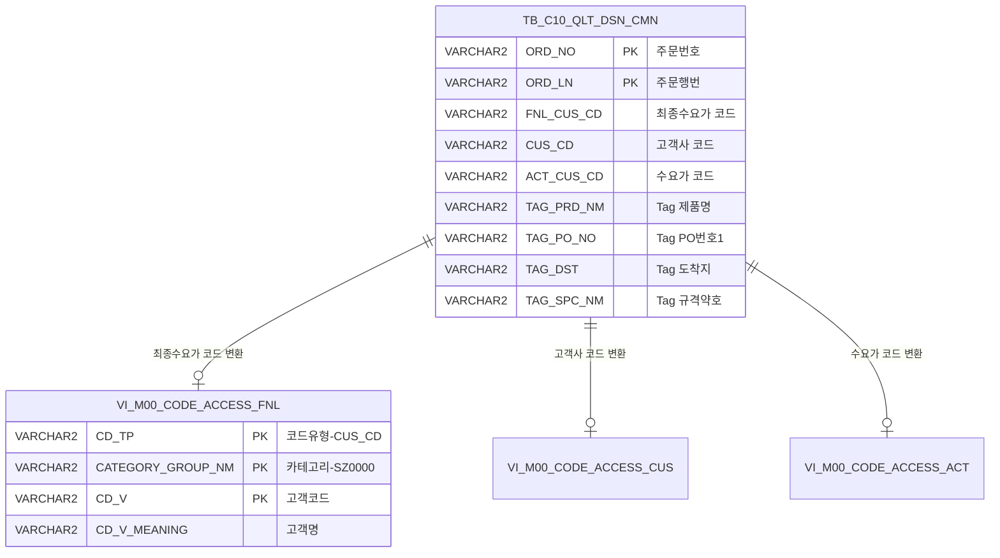

<h1 style="font-size: 40px; text-align: center; font-weight:
   bold; margin: 30px 0;">
  C104000020POP01 레거시 시스템 분석 종합 보고서
</h1>


# 1. 시스템 개요
- **서비스 ID**: C104000020POP01
- **업무명**: TAG 조회 팝업
- **분석 일시**: 2026-03-16 19:40 KST
- **전체 Activity 수**: 2개 (Built-in 2개, Custom 0개)
- **분석자**: Claude Opus 4.6 / Sonnet (UI) / Haiku (SQL Cache)
- **분석 도구**: /analyze-service C104000020POP01
- **문서 버전**: 1.0

# 📊 비즈니스 프로세스 분석

## 시스템 목적

C104000020POP01은 품질설계(QLT_DSN) 결과 확인용 TAG 조회 팝업 화면이다. 부모 화면에서 주문번호(ORD_NO)와 주문행번(ORD_LN)을 파라미터로 전달받아, 해당 주문의 TAG 정보(제품명, PO번호, 도착지, Size, 규격약호, 부착기호, 색상, 특수마킹, Part No 등)를 조회하여 읽기 전용으로 표시한다.

이 팝업은 CCL(Color Coating Line) 공정의 품질설계 공통 테이블(TB_C10_QLT_DSN_CMN)에서 고객사 정보와 TAG 관련 필드를 조회하며, 고객코드(FNL_CUS_CD, CUS_CD, ACT_CUS_CD)는 마스터 코드 뷰(VI_M00_CODE_ACCESS)를 통해 코드명으로 변환하여 표시한다. 단순 조회 전용 팝업으로 데이터 수정 기능은 없다.

## 주요 유즈케이스

### UC-01: TAG 정보 자동 조회 (팝업 진입 시)
- **Actor**: CCL 공정 오퍼레이터 / 품질설계 담당자
- **목적**: 부모 화면에서 선택한 주문의 TAG 정보를 팝업으로 즉시 확인

- **전제조건**:
  - 부모 화면에서 주문번호(ORD_NO), 주문행번(ORD_LN) 파라미터가 URL로 전달됨
  - TB_C10_QLT_DSN_CMN 테이블에 해당 주문의 품질설계 데이터가 존재함

- **주요 흐름**:
  1. 부모 화면에서 TAG 조회 팝업 호출 (ORD_NO, ORD_LN 파라미터 전달)
  2. Form_1 로드 시 URL 파라미터를 주문번호/행번 필드에 자동 세팅 (onFormLoad1)
  3. Form_2 로드 완료 시 자동으로 조회 실행 (onFormLoad2 → uiCommon.parameters6)
  4. C104000020POP01.select 쿼리 실행 → TB_C10_QLT_DSN_CMN에서 TAG 정보 조회
  5. 고객코드를 코드명으로 변환하여 Form_2에 17개 필드 표시
  6. 메시지박스에 "조회되었습니다" 표시

- **대체 흐름**:
  - 해당 주문 데이터 미존재: messageBox 필드 비어있음 → "0건 조회되었습니다." 메시지 표시
  - URL 파라미터 누락: 빈 폼 표시, 사용자가 직접 입력 후 조회 가능

- **후행조건**:
  - Form_2에 TAG 정보가 읽기 전용으로 표시됨
  - 사용자가 내용을 확인 후 닫기 버튼으로 팝업 종료

### UC-02: TAG 정보 수동 조회
- **Actor**: CCL 공정 오퍼레이터 / 품질설계 담당자
- **목적**: 다른 주문의 TAG 정보를 직접 입력하여 조회

- **전제조건**:
  - 팝업이 이미 열려 있는 상태

- **주요 흐름**:
  1. 사용자가 Form_1의 주문번호(ORD_NO) 필드에 값 입력
  2. 사용자가 주문행번(ORD_LN) 필드에 값 입력
  3. 입력 시 valueCheck 함수가 한글/특수문자 입력 방지, 대문자 자동 변환
  4. 조회 버튼 클릭
  5. 주문번호/행번 필수값 검증
  6. C104000020POP01.select 쿼리 실행
  7. Form_2에 결과 표시 또는 "0건 조회" 메시지 표시

- **대체 흐름**:
  - 주문번호 미입력: "주문번호를 입력하세요" 알림
  - 주문행번 미입력: "주문행번을 입력하세요" 알림
  - 한글/특수문자 입력 시도: "영문자나 숫자만 입력해 주세요" 알림 후 입력 차단

- **후행조건**:
  - 새로운 주문의 TAG 정보가 Form_2에 표시됨

### UC-03: 팝업 닫기
- **Actor**: CCL 공정 오퍼레이터 / 품질설계 담당자
- **목적**: TAG 정보 확인 완료 후 팝업 종료

- **전제조건**:
  - 팝업이 열려 있는 상태

- **주요 흐름**:
  1. 사용자가 닫기(winClose) 버튼 클릭
  2. 팝업 윈도우 종료
  3. 부모 화면으로 복귀

- **후행조건**:
  - 팝업이 닫힘
  - 부모 화면이 활성화됨

---
## 비즈니스 로직 상세

### 1. 고객코드 → 고객명 변환 (스칼라 서브쿼리)

- **목적**: 품질설계 테이블에 저장된 고객 코드값을 사람이 읽을 수 있는 고객명으로 변환하여 팝업에 표시
- **처리 케이스**:

  **[케이스 1: 최종수요가 코드 변환]**
  ```
    조건: FNL_CUS_CD (최종수요가 코드) 존재
    처리:
      1. VI_M00_CODE_ACCESS 뷰에서 CD_TP='CUS_CD', CATEGORY_GROUP_NM='SZ0000' 조건으로 조회
      2. CD_V = FNL_CUS_CD 매칭
      3. CD_V_MEANING(코드 의미명)을 FNL_CUS_CD 컬럼으로 반환
  ```

  **[케이스 2: 고객사 코드 변환]**
  ```
    조건: CUS_CD (고객사 코드) 존재
    처리:
      1. 동일한 VI_M00_CODE_ACCESS 뷰 조회
      2. CD_V = CUS_CD 매칭
      3. CD_V_MEANING을 CUS_CD 컬럼으로 반환
  ```

  **[케이스 3: 수요가 코드 변환]**
  ```
    조건: ACT_CUS_CD (수요가 코드) 존재
    처리:
      1. 동일한 VI_M00_CODE_ACCESS 뷰 조회
      2. CD_V = ACT_CUS_CD 매칭
      3. CD_V_MEANING을 ACT_CUS_CD 컬럼으로 반환
  ```

- **공통 변환 규칙**:
  ```
  코드명 = SELECT CD_V_MEANING
           FROM M00APUSER.VI_M00_CODE_ACCESS
           WHERE CD_TP = 'CUS_CD'
           AND CATEGORY_GROUP_NM = 'SZ0000'
           AND CD_V = [고객코드값]

  3개 고객 필드(FNL_CUS_CD, CUS_CD, ACT_CUS_CD) 모두 동일한 코드 테이블,
  동일한 카테고리 그룹(SZ0000)에서 변환
  코드가 없으면 NULL 반환 (NVL 처리 없음)
  ```

### 2. messageBox 필드를 활용한 조회 결과 판별

- **목적**: 조회 결과 존재 여부를 messageBox 숨김 필드로 판별하여 사용자에게 적절한 메시지 표시
- **처리 케이스**:

  **[케이스 1: 데이터 존재]**
  ```
    조건: ORD_NO 값이 messageBox alias로 반환됨 (SELECT ORD_NO messageBox)
    처리:
      1. messageBox 필드에 ORD_NO 값이 세팅됨 (비어있지 않음)
      2. findMessage 함수에서 "조회되었습니다." 메시지 표시
  ```

  **[케이스 2: 데이터 미존재]**
  ```
    조건: 조회 결과 0건 → messageBox 필드 비어있음
    처리:
      1. findMessage 함수에서 messageBox 값 확인
      2. 비어있으므로 "0건 조회되었습니다." 메시지 표시
  ```

---

# 💾 데이터 요구사항

## 핵심 테이블

### 1. TB_C10_QLT_DSN_CMN - (품질설계 공통 정보)
| 컬럼명 | 타입 | PK | 설명 |
|--------|------|----|-----|
| ORD_NO | VARCHAR2 | ✅ | 주문번호 |
| ORD_LN | VARCHAR2 | ✅ | 주문행번 |
| FNL_CUS_CD | VARCHAR2 | | 최종수요가 코드 |
| CUS_CD | VARCHAR2 | | 고객사 코드 |
| ACT_CUS_CD | VARCHAR2 | | 수요가 코드 |
| SPC_AVR | VARCHAR2 | | 규격약호 |
| SPC_NM | VARCHAR2 | | 규격명 |
| ORD_SZ | VARCHAR2 | | 주문생치수 |
| ORD_PAK_MTH | VARCHAR2 | | 포장방법 |
| TAG_PRD_NM | VARCHAR2 | | Tag 제품명 |
| TAG_PO_NO | VARCHAR2 | | Tag PO번호1 |
| TAG_PO_NO2 | VARCHAR2 | | Tag PO번호2 |
| TAG_DST | VARCHAR2 | | Tag 도착지 |
| TAG_SIZ | VARCHAR2 | | Tag Size |
| TAG_SPC_NM | VARCHAR2 | | Tag 규격약호 |
| TAG_GAA | VARCHAR2 | | Tag 부착기호 |
| TAG_HUE_FRN | VARCHAR2 | | Tag 색상전면 |
| TAG_HUE_BAK | VARCHAR2 | | Tag 색상후면 |
| TAG_SPC_MRK | VARCHAR2 | | Tag 특수마킹형태 |
| TAG_PART_NO | VARCHAR2 | | Part No |

### 2. M00APUSER.VI_M00_CODE_ACCESS - (마스터 코드 뷰)
| 컬럼명 | 타입 | PK | 설명 |
|--------|------|----|-----|
| CD_TP | VARCHAR2 | ✅ | 코드 유형 (이 서비스에서는 'CUS_CD') |
| CATEGORY_GROUP_NM | VARCHAR2 | ✅ | 카테고리 그룹명 (이 서비스에서는 'SZ0000') |
| CD_V | VARCHAR2 | ✅ | 코드값 (고객 코드) |
| CD_V_MEANING | VARCHAR2 | | 코드 의미명 (고객명) |

## 데이터 플로우

### 1. 조회

```
[TAG 정보 조회 - 팝업 진입 시 자동 실행]
팝업 진입 (URL 파라미터: ORD_NO, ORD_LN)
→ C104000020POP01.select
  FROM TB_C10_QLT_DSN_CMN
  WHERE ORD_NO = :ORD_NO
    AND ORD_LN = :ORD_LN
  + 스칼라 서브쿼리 3건 (FNL_CUS_CD, CUS_CD, ACT_CUS_CD → 고객명 변환)
    FROM M00APUSER.VI_M00_CODE_ACCESS
    WHERE CD_TP = 'CUS_CD'
      AND CATEGORY_GROUP_NM = 'SZ0000'
      AND CD_V = [각 고객코드]
→ Form_2에 TAG 정보 17개 필드 표시 (읽기 전용)
→ messageBox 값으로 조회 결과 유무 판별
```

## SQL 일람표
| SQL 이름 | 쿼리 ID | 타입 | 출처 | 테이블 |
|---------|---------|-----|-------|-------|
| TAG 정보 조회 | C104000020POP01.select | SELECT | Service | TB_C10_QLT_DSN_CMN, M00APUSER.VI_M00_CODE_ACCESS |

## ER 다이어그램 (핵심 관계)



관계 설명:
- TB_C10_QLT_DSN_CMN이 중심 테이블로 주문 기반 TAG 정보를 보유
- VI_M00_CODE_ACCESS는 3개 고객 코드 필드(FNL_CUS_CD, CUS_CD, ACT_CUS_CD)에 대해 스칼라 서브쿼리로 코드명 변환에 사용
- 모든 고객 코드 변환은 동일 조건(CD_TP='CUS_CD', CATEGORY_GROUP_NM='SZ0000')으로 조회

---

# 🖥️ 사용자 인터페이스 요구사항

## 화면 레이아웃 상세

### Layout 구조 (팝업)
```javascript
{
  type: "popup",
  title: "TAG 조회 POPUP",
  width: 600,
  components: [
    {
      id: "C104000020POP01_Form_1",
      type: "form",
      role: "search",
      position: { left: 0, top: 0, width: 600, height: 30 }
    },
    {
      id: "C104000020POP01_Form_2",
      type: "form",
      role: "result",
      position: { left: 0, top: 32, width: 600, height: 400 },
      backgroundColor: "255,128,128"  // 연분홍
    },
    {
      id: "C104000020POP01_messagebox",
      type: "messagebox",
      position: { left: 0, top: 433, width: 598, height: 23 }
    }
  ]
}
```

## 입출력 요소

### Form 컴포넌트

**C104000020POP01_Form_1 (검색 폼)**
- ORD_NO: input - 주문번호 (90px, 영숫자만 허용, 대문자 변환, 필수)
- ORD_LN: input - 주문행번 (40px, 영숫자만 허용, 대문자 변환, 필수)
- find: Button - 조회 → C104000020POP01.select 실행
- winClose: Button - 닫기 → 팝업 종료

**C104000020POP01_Form_2 (결과 표시 폼, 배경색: 연분홍 255,128,128)**
- FNL_CUS_CD: input - 최종수요가 (135px, labelWidth 70px, 읽기전용)
- CUS_CD: input - 고객사 (135px, 읽기전용)
- ACT_CUS_CD: input - 수요가 (132px, 읽기전용)
- SPC_AVR: input - 규격약호/명 (110px, 읽기전용)
- SPC_NM: input - 규격명 (395px, 라벨 없음, 읽기전용)
- ORD_SZ: input - 주문생치수 (222px, labelWidth 70px, 읽기전용)
- ORD_PAK_MTH: input - 포장방법 (222px, 읽기전용)
- TAG_PRD_NM: input - Tag 제품명 (507px, labelWidth 75px, 읽기전용)
- TAG_PO_NO: input - Tag PO번호1 (507px, labelWidth 75px, 읽기전용)
- TAG_PO_NO2: input - Tag PO번호2 (507px, labelWidth 75px, 읽기전용)
- TAG_DST: input - Tag 도착지 (507px, labelWidth 75px, 읽기전용)
- TAG_SIZ: input - Tag Size (507px, labelWidth 75px, 읽기전용)
- TAG_SPC_NM: input - Tag 규격약호 (507px, labelWidth 75px, 읽기전용)
- TAG_GAA: input - Tag 부착기호 (507px, labelWidth 75px, 읽기전용)
- TAG_HUE_FRN: input - Tag 색상전면 (507px, labelWidth 75px, 읽기전용)
- TAG_HUE_BAK: input - 색상후면 (507px, 읽기전용)
- TAG_SPC_MRK: input - Tag 특수마킹형태 (480px, 읽기전용)
- TAG_PART_NO: input - Part No (507px, labelWidth 75px, 읽기전용)
- messageBox: hidden - 조회 결과 유무 판별용 숨김 필드

## 화면 동작 흐름

### 1. 팝업 초기 로딩 (자동 조회)
```
1. 부모 화면에서 팝업 호출 (URL 파라미터: ORD_NO, ORD_LN)
2. Form_1 로드 완료 (onFormLoad1 → onXLEEvent)
   - request.parameter에서 ORD_NO, ORD_LN 추출
   - Form_1 필드에 값 세팅 (setItemValue)
   - 영숫자 입력 검증 이벤트 등록 (attachEvent → valueCheck)
   - onXLEEvent 해제 (detachEvent)
3. Form_2 로드 완료 (onFormLoad2 → onXLEEvent)
   - uiCommon.parameters6 호출하여 Form_1 파라미터 구성
   - C104000020POP01-service 자동 조회 실행
   - 콜백: findAfter → progress 종료 → findMessage
   - onXLEEvent 해제 (detachEvent)
4. 조회 결과에 따라 메시지박스 표시
```

### 2. 수동 조회 (주문번호 직접 입력)
```
1. 사용자가 ORD_NO 필드에 주문번호 입력
   - onkeyup 이벤트 → valueCheck 함수 실행
   - 한글/특수문자 입력 시 "영문자나 숫자만 입력해 주세요" 알림
   - 입력값 대문자 자동 변환 (toUpperCase)
2. ORD_LN 필드에 주문행번 입력 (동일 검증)
3. 조회(find) 버튼 클릭
4. 필수값 검증 (ORD_NO, ORD_LN)
5. uiCommon.parameters6으로 파라미터 구성
6. C104000020POP01-service 호출 (find)
7. findAfter 콜백 → progressOff → findMessage
8. Form_2에 결과 표시 또는 "0건 조회되었습니다." 메시지
```

### 3. 팝업 닫기
```
1. 닫기(winClose) 버튼 클릭
2. 팝업 윈도우 종료
3. 부모 화면 복귀
```

## JavaScript 모듈

**C104000020POP01.jsp (인라인 스크립트)**
- onFormLoad1(): Form_1 로드 시 URL 파라미터 세팅 및 입력 검증 이벤트 등록
- onFormLoad2(): Form_2 로드 시 자동 조회 실행 (uiCommon.parameters6 호출)
- find(): 조회 버튼 클릭 시 필수값 검증 후 Form_2 데이터 로드
- findAfter(): 조회 완료 콜백 - progress 종료 및 findMessage 호출
- findMessage(): messageBox 값 기반 조회 결과 메시지 표시
- valueCheck(ev): onkeyup 이벤트 - 영숫자만 허용, 대문자 변환
- save(): referenceItem 그리드 데이터 저장 전송 (부모 화면 연동)
- refresh(): referenceItem 초기화 후 재조회
- add(): referenceItem 그리드에 신규 행 추가
- remove(): referenceItem 그리드 선택 행 삭제
- copy(): referenceItem 그리드 행 복사
- undo(): 실행 취소
- redo(): 재실행
- onGridContextMenuClick(id): 그리드 컨텍스트 메뉴 처리 (열 이동, 필터, 편집, Excel)

## 주요 이벤트 핸들러

**find (조회 버튼 클릭)**
- 이벤트 타입: Button Click
- 처리 내용:
  1. ORD_NO 필수값 검증 → 미입력 시 "주문번호를 입력하세요" 알림
  2. ORD_LN 필수값 검증 → 미입력 시 "주문행번을 입력하세요" 알림
  3. uiCommon.parameters6으로 Form_1 파라미터 구성
  4. C104000020POP01_Form_2에 데이터 로드 요청
  5. findAfter 콜백 대기

**onFormLoad1 (Form_1 로드 완료)**
- 이벤트 타입: onXLEEvent
- 처리 내용:
  1. request.parameter.ORD_NO → Form_1.ORD_NO 필드에 세팅
  2. request.parameter.ORD_LN → Form_1.ORD_LN 필드에 세팅
  3. ORD_NO 필드에 onkeyup → valueCheck 이벤트 등록
  4. ORD_LN 필드에 onkeyup → valueCheck 이벤트 등록
  5. onXle1 이벤트 해제 (1회만 실행)

**onFormLoad2 (Form_2 로드 완료 → 자동 조회)**
- 이벤트 타입: onXLEEvent
- 처리 내용:
  1. uiCommon.parameters6으로 Form_1 파라미터 구성
  2. C104000020POP01_Form_2에 데이터 자동 로드
  3. findAfter 콜백 등록
  4. onXle2 이벤트 해제 (1회만 실행)

**valueCheck (입력값 검증)**
- 이벤트 타입: onkeyup
- 처리 내용:
  1. 입력값에서 한글, 특수문자 감지
  2. 비허용 문자 감지 시 "영문자나 숫자만 입력해 주세요" 알림
  3. 입력값 대문자 변환 (toUpperCase)

---

# 📌 특이사항 및 주의사항

## 1. messageBox 숨김 필드를 활용한 조회 결과 판별 패턴
- SQL에서 `ORD_NO messageBox`로 별칭 지정하여 조회 결과 존재 여부를 판별하는 비표준 패턴 사용
- 조회 결과가 있으면 messageBox에 ORD_NO 값이 세팅되고, 없으면 비어있음
- findMessage 함수에서 이 값의 유무로 "조회되었습니다" / "0건 조회되었습니다" 분기

## 2. 팝업 진입 시 자동 조회 (onXLEEvent 1회 실행 패턴)
- onFormLoad1, onFormLoad2 모두 onXLEEvent로 등록 후 detachEvent로 해제하여 1회만 실행
- Form_1 로드 → 파라미터 세팅 → Form_2 로드 → 자동 조회 순서로 체인 실행
- 로드 순서가 보장되지 않을 경우 Form_2가 먼저 로드되면 빈 파라미터로 조회될 수 있는 잠재적 타이밍 이슈 존재

## 3. 부모 화면 그리드 조작 함수 포함
- save, refresh, add, remove, copy, undo, redo, onGridContextMenuClick 등 그리드 조작 함수가 팝업에 포함됨
- 이 함수들은 `referenceItem` (부모 화면의 그리드)을 대상으로 동작
- TAG 조회 전용 팝업임에도 부모 그리드 CRUD 기능이 포함된 것은 공통 팝업 템플릿을 재사용한 것으로 추정

## 4. 입력값 검증 (영숫자 전용 + 대문자 변환)
- 주문번호/행번 필드에 한글, 특수문자 입력을 onkeyup 이벤트로 실시간 차단
- 소문자 입력 시 자동 대문자 변환 (toUpperCase)
- 서버 측 검증은 별도로 없으며 클라이언트 측 검증에만 의존

## 5. Form_2 배경색 하드코딩
- Form_2의 배경색이 `255,128,128` (연분홍색)으로 하드코딩되어 있음
- 읽기 전용 결과 표시 영역임을 시각적으로 구분하기 위한 것으로 판단

---

# 📚 참고 문서

- **Service XML**: `src/service/C104000020POP01-service.xml`
- **Query SQL**: `src/query/C104000020POP01-query.glue_sql`
- **JSP**: `WebContents/C104000020POP01.jsp`
- **Form XML**:
  - `WebContents/header/kr/C104000020POP01/C104000020POP01_Form_1.xml`
  - `WebContents/header/kr/C104000020POP01/C104000020POP01_Form_2.xml`
