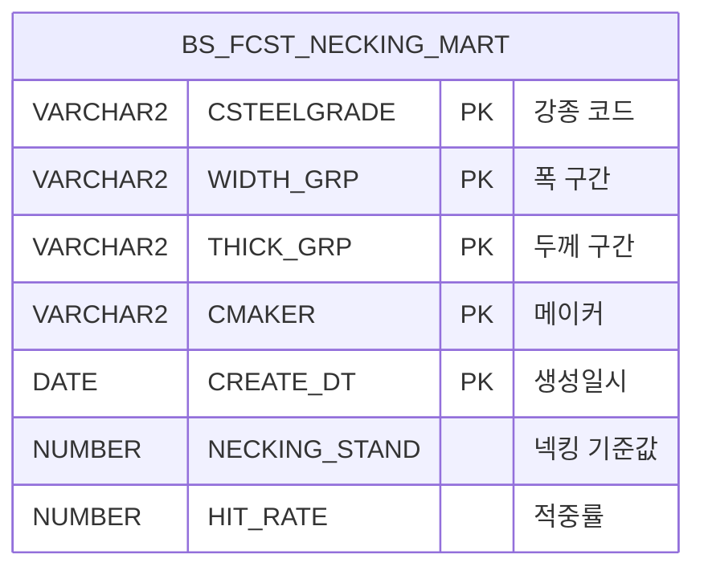

<h1 style="font-size: 40px; text-align: center; font-weight:
   bold; margin: 30px 0;">
  C104000020POP02 레거시 시스템 분석 종합 보고서
</h1>


# 1. 시스템 개요
- **서비스 ID**: C104000020POP02
- **업무명**: 폭수축 계산 및 시뮬레이션 팝업
- **분석 일시**: 2026-03-16 19:48 KST
- **전체 Activity 수**: 3개 (Built-in 3개, Custom 0개)
- **분석자**: Claude Opus 4.6 / Sonnet (UI) / Haiku+Sonnet (SQL Cache)
- **분석 도구**: /analyze-service C104000020POP02
- **문서 버전**: 1.0

# 📊 비즈니스 프로세스 분석

## 시스템 목적

C104000020POP02는 CCL 공정의 품질설계 화면에서 호출되는 **폭수축(Necking) 계산 및 시뮬레이션 팝업**이다. 부모 화면에서 강종(RMTL_KND), S/T폭(ST_WHT), 두께(PLTCM_THK) 파라미터를 전달받아 두 가지 기능을 제공한다.

**첫 번째 기능(폭수축 계산)**: 입력된 강종/폭/두께를 구간별로 그룹핑하여 넥킹 예측 마트 테이블(BS_FCST_NECKING_MART)에서 최신 데이터를 조회한다. 메이커별 폭수축 기준값(NECKING_STAND)과 적중률(HIT_RATE)을 Grid로 표시한다.

**두 번째 기능(폭수축 시뮬레이션)**: 코일의 물리적 특성(두께, 폭, 압하률)과 재질 특성(항복점 YP, 인장강도 TS, 연신율 EL) 및 화학성분(C, Si, Mn, P, S) 12개 파라미터를 입력받아 C10APUSER.FUNC_MES_NECKING_SIMULATION 함수를 호출하여 시뮬레이션 결과를 산출한다.

## 주요 유즈케이스

### UC-01: 폭수축 기준값 조회 (팝업 진입 시)
- **Actor**: CCL 공정 오퍼레이터 / 품질설계 담당자
- **목적**: 주문의 강종/폭/두께 조건에 맞는 넥킹 예측 기준값을 확인하여 품질설계에 반영

- **전제조건**:
  - 부모 화면에서 RMTL_KND, ST_WHT, PLTCM_THK 파라미터가 전달됨
  - BS_FCST_NECKING_MART 테이블에 해당 구간의 예측 데이터가 존재함

- **주요 흐름**:
  1. 부모 화면에서 팝업 호출 (RMTL_KND, ST_WHT, PLTCM_THK 파라미터 전달)
  2. Form_1 로드 시 onFormLoadEvent에서 파라미터를 폼 필드에 자동 세팅
  3. 사용자가 계산(find) 버튼 클릭
  4. C104000020POP02.select 쿼리 실행
     - 강종: RMTL_KND에서 앞 1자리 제거 후 3자리 코드 추출 (SUBSTR(:RMTL_KND,2,3))
     - 폭: 700/900/1100/1300 구간으로 분류
     - 두께: 0.3/0.4/0.6/0.8/1.2 구간으로 분류
  5. BS_FCST_NECKING_MART에서 최신 CREATE_DT 기준 메이커별 데이터 조회
  6. Grid_1에 메이커별 폭수축 기준값(NECKING_STAND), 적중률(HIT_RATE) 표시

- **대체 흐름**:
  - 해당 구간 데이터 미존재: Grid_1에 데이터 없음 표시
  - 강종 코드 형식 불일치: 조회 결과 0건

- **후행조건**:
  - Grid_1에 메이커별 폭수축 예측값이 표시됨
  - 오퍼레이터가 기준값을 참고하여 품질설계 수행

### UC-02: 폭수축 시뮬레이션 실행
- **Actor**: CCL 공정 오퍼레이터 / 품질설계 담당자
- **목적**: 특정 코일의 물리적/화학적 특성을 입력하여 폭수축량을 시뮬레이션으로 예측

- **전제조건**:
  - 팝업이 열려 있는 상태
  - 시뮬레이션에 필요한 12개 파라미터 값을 확보한 상태

- **주요 흐름**:
  1. Form_2에 12개 파라미터 입력
     - 입측폭(I_MTL_COIL_THK), 입측두께(I_MTL_COIL_WTH), S/T폭(I_ST_WISH_WTH), 압하률(I_COMPRESS_THK)
     - YP(항복점), TS(인장강도), EL(연신율)
     - C(탄소), SI(규소), MN(망간), P(인), S(황)
  2. 시뮬레이션 버튼 클릭
  3. 12개 필드 전체 필수값 검증 → 누락 시 "모든 항목은 필수 항목입니다." 알림
  4. C104000020POP02.simul 쿼리 실행 → FUNC_MES_NECKING_SIMULATION 함수 호출
  5. Grid_2에 시뮬레이션 결과(CAL) 표시

- **대체 흐름**:
  - 필수 항목 누락: "모든 항목은 필수 항목입니다." 알림 → 입력 화면 유지
  - 함수 실행 오류: DB 에러 메시지 반환

- **후행조건**:
  - Grid_2에 시뮬레이션 결과값이 표시됨
  - 오퍼레이터가 시뮬레이션 결과를 참고하여 품질설계 조건 조정

### UC-03: 팝업 닫기
- **Actor**: CCL 공정 오퍼레이터 / 품질설계 담당자
- **목적**: 폭수축 확인 완료 후 팝업 종료

- **전제조건**:
  - 팝업이 열려 있는 상태

- **주요 흐름**:
  1. 닫기(winClose) 버튼 클릭
  2. 팝업 윈도우 종료
  3. 부모 화면 복귀

- **후행조건**:
  - 팝업 닫힘, 부모 화면 활성화

---
## 비즈니스 로직 상세

### 1. 강종/폭/두께 구간 분류 로직 (CTE 기반)

- **목적**: 입력된 연속 수치값(폭, 두께)을 이산 구간으로 변환하여 넥킹 예측 마트 테이블의 그룹 키와 매칭
- **처리 케이스**:

  **[케이스 1: 강종 코드 변환]**
  ```
    조건: RMTL_KND 파라미터 입력
    처리:
      1. SUBSTR(:RMTL_KND, 2, 3)으로 앞 1자리(접두사) 제거
      2. 뒤 3자리 코드를 CSTEELGRADE 키로 사용
    예시: 'A270' → '270', 'B340' → '340'
  ```

  **[케이스 2: 폭(ST_WHT) 구간 분류]**
  ```
    조건: ST_WHT 수치값 입력
    처리:
      ≤ 700         → '700'
      700 < x ≤ 900  → '900'
      900 < x ≤ 1100 → '1100'
      1100 < x ≤ 1300 → '1300'
      > 1300         → '1300U'
    5개 구간으로 WIDTH_GRP 키 생성
  ```

  **[케이스 3: 두께(PLTCM_THK) 구간 분류]**
  ```
    조건: PLTCM_THK 수치값 입력
    처리:
      ≤ 0.3         → '0.3'
      0.3 < x ≤ 0.4 → '0.4'
      0.4 < x ≤ 0.6 → '0.6'
      0.6 < x ≤ 0.8 → '0.8'
      0.8 < x ≤ 1.2 → '1.2'
      > 1.2          → '1.2 U'
    6개 구간으로 THICK_GRP 키 생성
  ```

### 2. 최신 데이터 선택 로직

- **목적**: 동일 구간(강종+폭+두께)에 여러 일자 데이터가 있을 경우 가장 최근 데이터만 조회
- **처리 케이스**:

  **[케이스 1: 최신 CREATE_DT 필터링]**
  ```
    조건: 동일 구간에 복수 일자 데이터 존재
    처리:
      1. 서브쿼리로 해당 구간의 MAX(CREATE_DT) 산출
      2. 메인 쿼리에서 CREATE_DT = MAX(CREATE_DT) 조건으로 필터링
      3. 결과를 메이커별(CMAKER) 정렬 출력
    정렬: DECODE(CMAKER,'전체','A',CMAKER) — '전체' 행이 최상단
  ```

### 3. 폭수축 시뮬레이션 함수 호출

- **목적**: 12개 입력 파라미터를 기반으로 넥킹(폭수축) 시뮬레이션 결과 산출
- **처리 케이스**:

  **[케이스 1: FUNC_MES_NECKING_SIMULATION 호출]**
  ```
    조건: 12개 파라미터 모두 입력됨
    처리:
      1. C10APUSER.FUNC_MES_NECKING_SIMULATION 함수 호출
      2. 입력: 코일 두께/폭, S/T폭, 압하률, YP, TS, EL, C, Si, Mn, P, S
      3. 출력: CAL (시뮬레이션 계산 결과값)
  ```

  > **📎 호출 함수**: [`C10APUSER.FUNC_MES_NECKING_SIMULATION`](../../dbms/C10APUSER/function/FUNC_MES_NECKING_SIMULATION_analysis_report.md)
  > - **목적**: 12개 코일 특성 파라미터 기반 로그-선형 회귀 모델 폭수축 시뮬레이션
  > - **주요 테이블**: MESAPUSER.BS_FCST_SIMUL_REG_COEF (회귀 계수), MESAPUSER.BS_FCST_SIMUL_REG_PREPROCESS (전처리 임계값)
  > - **코드 규모**: 함수 1개, 총 106라인
  > - **알고리즘**: EXP(절편 + Σ계수×피처) - 0.5, K-Means 클러스터링 + Winsorization 전처리

---

# 💾 데이터 요구사항

## 핵심 테이블

### 1. MESAPUSER.BS_FCST_NECKING_MART - (넥킹 예측 마트)
| 컬럼명 | 타입 | PK | 설명 |
|--------|------|----|-----|
| CSTEELGRADE | VARCHAR2 | ✅ | 강종 코드 (3자리) |
| WIDTH_GRP | VARCHAR2 | ✅ | 폭 구간 그룹 (700/900/1100/1300/1300U) |
| THICK_GRP | VARCHAR2 | ✅ | 두께 구간 그룹 (0.3/0.4/0.6/0.8/1.2/1.2 U) |
| CMAKER | VARCHAR2 | ✅ | 메이커 코드 ('0'=전체) |
| CREATE_DT | DATE | ✅ | 생성 일시 |
| NECKING_STAND | NUMBER | | 넥킹 기준값 (폭수축 평균) |
| HIT_RATE | NUMBER | | 적중률 |

## 데이터 플로우

### 1. 폭수축 계산 조회

```
[폭수축 기준값 조회]
Form_1 계산 버튼 클릭
→ C104000020POP02.select
  CTE(CHG): 파라미터 구간 변환
    - RMTL_KND → SUBSTR(2,3) → CSTEELGRADE
    - ST_WHT → CASE WHEN 구간 분류 → WIDTH_GRP
    - PLTCM_THK → CASE WHEN 구간 분류 → THICK_GRP
  FROM MESAPUSER.BS_FCST_NECKING_MART, CHG
  WHERE CSTEELGRADE = CHG.RMTL_KND
    AND WIDTH_GRP = CHG.ST_WHT
    AND THICK_GRP = CHG.PLTCM_THK
    AND CREATE_DT = (MAX(CREATE_DT) 서브쿼리)
  ORDER BY DECODE(CMAKER,'전체','A',CMAKER)
→ Grid_1에 메이커별 폭수축 기준값/적중률 표시
```

### 2. 폭수축 시뮬레이션

```
[시뮬레이션 실행]
Form_2 시뮬레이션 버튼 클릭 (12개 필수값 검증)
→ C104000020POP02.simul
  SELECT C10APUSER.FUNC_MES_NECKING_SIMULATION(
    :I_MTL_COIL_THK, :I_MTL_COIL_WTH, :I_ST_WISH_WTH,
    :I_COMPRESS_THK, :I_YP, :I_TS, :I_EL,
    :I_C, :I_SI, :I_MN, :I_P, :I_S
  ) AS CAL FROM DUAL
→ Grid_2에 시뮬레이션 결과(CAL) 표시
```

## SQL 일람표
| SQL 이름 | 쿼리 ID | 타입 | 출처 | 테이블 |
|---------|---------|-----|-------|-------|
| 폭수축 기준값 조회 | C104000020POP02.select | SELECT | Service | MESAPUSER.BS_FCST_NECKING_MART |
| 폭수축 시뮬레이션 | C104000020POP02.simul | SELECT | Service | DUAL (FUNC_MES_NECKING_SIMULATION 함수 호출) |

## PL/SQL 함수/프로시저
| # | 호출명 | 유형 | 용도 |
|---|--------|------|------|
| 1 | FUNC_MES_NECKING_SIMULATION | Function | 12개 코일 특성 파라미터 기반 폭수축 시뮬레이션 계산 |

## ER 다이어그램 (핵심 관계)



관계 설명:
- BS_FCST_NECKING_MART가 유일한 실체 테이블로, 강종+폭구간+두께구간+메이커+생성일시 복합키로 데이터 관리
- FUNC_MES_NECKING_SIMULATION은 C10APUSER 스키마의 독립 함수로, 내부적으로 MESAPUSER.BS_FCST_SIMUL_REG_COEF (회귀 계수)와 MESAPUSER.BS_FCST_SIMUL_REG_PREPROCESS (전처리 임계값) 테이블을 YYYYMMDD 키로 조인하여 사용

---

# 🖥️ 사용자 인터페이스 요구사항

## 화면 레이아웃 상세

### Layout 구조 (팝업)
```javascript
{
  type: "popup",
  title: "폭수축 및 시뮬레이션",
  width: 550,
  components: [
    {
      id: "C104000020POP02_Form_1",
      type: "form",
      role: "search",
      position: { left: 0, top: 0, width: 550, height: 56 },
      title: "폭 수축"
    },
    {
      id: "C104000020POP02_Grid_1",
      type: "grid",
      role: "result",
      position: { left: 0, top: 56, width: 550, height: 120 }
    },
    {
      id: "C104000020POP02_Form_2",
      type: "form",
      role: "search",
      position: { left: 0, top: 174, width: 550, height: 112 },
      title: "폭수축 시뮬레이션"
    },
    {
      id: "C104000020POP02_Grid_2",
      type: "grid",
      role: "result",
      position: { left: 0, top: 286, width: 550, height: 48 }
    },
    {
      id: "C104000020POP02_messagebox",
      type: "messagebox",
      position: { left: -1, top: 334, width: 551, height: 19 }
    }
  ]
}
```

## 입출력 요소

### Form 컴포넌트

**C104000020POP02_Form_1 (폭수축 조건 입력)**
- RMTL_KND: input - 강종 (50px, labelWidth 50px)
- ST_WHT: input - S/T폭 (50px, labelWidth 50px)
- PLTCM_THK: input - 두께 (50px, labelWidth 50px)
- find: Button - 계산 → C104000020POP02.select 실행
- winClose: Button - 닫기 → 팝업 종료

**C104000020POP02_Form_2 (시뮬레이션 파라미터 입력)**
- I_MTL_COIL_THK: input - 입측폭 (50px, labelWidth 50px, 필수)
- I_MTL_COIL_WTH: input - 입측두께 (50px, labelWidth 50px, 필수)
- I_ST_WISH_WTH: input - S/T폭 (50px, labelWidth 50px, 필수)
- I_COMPRESS_THK: input - 압하률 (50px, labelWidth 50px, 필수)
- I_YP: input - YP 항복점 (50px, labelWidth 50px, 필수)
- I_TS: input - TS 인장강도 (50px, labelWidth 50px, 필수)
- I_EL: input - EL 연신율 (50px, labelWidth 50px, 필수)
- I_C: input - C 탄소 (50px, labelWidth 50px, 필수)
- I_SI: input - SI 규소 (50px, labelWidth 50px, 필수)
- I_MN: input - MN 망간 (50px, labelWidth 50px, 필수)
- I_P: input - P 인 (50px, labelWidth 50px, 필수)
- I_S: input - S 황 (50px, labelWidth 50px, 필수)
- simulrate: Button - 시뮬레이션 → C104000020POP02.simul 실행

### Grid 컴포넌트

**C104000020POP02_Grid_1 (폭수축 계산 결과)**
- 편집 가능 여부: 아니오 (읽기 전용)
- Split: 없음
- 주요 컬럼 (3개):

  **계산 결과**:
  - maker: ro - 폭 min (50px, 중앙정렬) — 실제 데이터: 메이커 코드 (전체/개별)
  - wht_avg: ro - 폭 avg (20px, 중앙정렬) — 실제 데이터: NECKING_STAND (넥킹 기준값)
  - hit_rate: ro - 적중률 (20px, 중앙정렬) — 실제 데이터: HIT_RATE

**C104000020POP02_Grid_2 (시뮬레이션 결과)**
- 편집 가능 여부: 아니오 (읽기 전용)
- Split: 없음
- 주요 컬럼 (1개):

  **시뮬레이션 결과**:
  - CAL: ro - 시뮬레이션결과 (80px, 중앙정렬)

## 화면 동작 흐름

### 1. 팝업 초기 로딩
```
1. 부모 화면에서 팝업 호출 (URL 파라미터: RMTL_KND, ST_WHT, PLTCM_THK)
2. Form_1 로드 완료 (onFormLoadEvent → onXLEEvent)
   - request.parameter에서 RMTL_KND, ST_WHT, PLTCM_THK 추출
   - Form_1 필드에 값 세팅 (setItemValue)
   - onXLEEvent 해제 (detachEvent, 1회만 실행)
3. Form_2, Grid_1, Grid_2 초기 상태 표시
4. messagebox 초기화
```

### 2. 폭수축 기준값 계산
```
1. 사용자가 Form_1의 강종/S/T폭/두께 확인 (또는 수정)
2. 계산(find) 버튼 클릭
3. uiCommon.parameters 호출하여 Form_1 파라미터 구성
4. C104000020POP02-service 호출 (폭수축계산 Activity)
5. C104000020POP02.select 쿼리 실행
   - CTE에서 파라미터 구간 변환
   - BS_FCST_NECKING_MART 최신 데이터 조회
6. Grid_1에 메이커별 결과 표시 (폭min, 폭avg, 적중률)
7. findMessage 콜백으로 메시지박스 업데이트
```

### 3. 폭수축 시뮬레이션
```
1. 사용자가 Form_2에 12개 파라미터 입력
   - 물리: 입측폭, 입측두께, S/T폭, 압하률
   - 재질: YP, TS, EL
   - 화학성분: C, SI, MN, P, S
2. 시뮬레이션(simulrate) 버튼 클릭
3. 12개 필드 전체 필수 검증
   - 누락 항목 존재 시 "모든 항목은 필수 항목입니다." 알림 → 중단
4. uiCommon.parameters 호출하여 Form_2 파라미터 구성
5. C104000020POP02-service 호출 (폭수축시뮬 Activity)
6. FUNC_MES_NECKING_SIMULATION 함수 호출
7. Grid_2에 시뮬레이션 결과(CAL) 표시
```

## JavaScript 모듈

**C104000020POP02.jsp (인라인 스크립트)**
- onFormLoadEvent(): Form_1 로드 시 부모 화면 파라미터(RMTL_KND, ST_WHT, PLTCM_THK) 세팅
- find(): 계산 버튼 → Form_1 파라미터로 Grid_1 폭수축 기준값 조회
- simulrate(): 시뮬레이션 버튼 → 12개 필수값 검증 후 Grid_2 시뮬레이션 실행
- findMessage(): 메시지박스에 조회 결과 메시지 표시
- onGridContextMenuClick(id): 그리드 컨텍스트 메뉴 처리 (열 이동, 필터, 편집, Excel)

## 주요 이벤트 핸들러

**find (계산 버튼 클릭)**
- 이벤트 타입: Button Click
- 처리 내용:
  1. Form_1 파라미터(RMTL_KND, ST_WHT, PLTCM_THK) 구성
  2. C104000020POP02-service 폭수축계산 Activity 호출
  3. Grid_1에 결과 바인딩
  4. findMessage 콜백으로 메시지 표시

**simulrate (시뮬레이션 버튼 클릭)**
- 이벤트 타입: Button Click
- 처리 내용:
  1. Form_2 12개 필드 전체 필수값 검증
  2. 누락 시 "모든 항목은 필수 항목입니다." 알림
  3. 통과 시 Form_2 파라미터로 C104000020POP02-service 폭수축시뮬 Activity 호출
  4. Grid_2에 시뮬레이션 결과(CAL) 바인딩

**onFormLoadEvent (Form_1 로드 완료)**
- 이벤트 타입: onXLEEvent
- 처리 내용:
  1. request.parameter에서 RMTL_KND, ST_WHT, PLTCM_THK 추출
  2. Form_1 각 필드에 setItemValue
  3. onXLEEvent 해제 (1회만 실행)

---

# 📌 특이사항 및 주의사항

## 1. Grid 컬럼 헤더와 실제 데이터 불일치
- Grid_1의 컬럼 헤더가 "폭 min / 폭 avg / 적중률"이지만, 실제 매핑 데이터는 "메이커(CMAKER) / 넥킹기준값(NECKING_STAND) / 적중률(HIT_RATE)"
- 특히 "폭 min" 헤더에 메이커 코드('전체', 개별 메이커)가 표시되는 것은 UI 혼동 소지
- clabel(내부 라벨)과 label(표시 라벨)도 일부 불일치: Grid_2의 clabel="주공정"이지만 label="시뮬레이션결과"

## 2. CTE 기반 파라미터 구간 변환 패턴
- 연속 수치값을 이산 구간으로 변환하는 로직이 SQL CTE(WITH절)에 구현됨
- 폭은 5개 구간(700/900/1100/1300/1300U), 두께는 6개 구간(0.3/0.4/0.6/0.8/1.2/1.2 U)
- 구간 경계값 변경 시 SQL 수정이 필요하며, 구간 범위가 하드코딩되어 있음
- 두께 구간 중 '1.2 U'에 공백이 포함된 것은 '1300U'(공백 없음)와 비일관적

## 3. 강종 코드 변환 규칙
- SUBSTR(:RMTL_KND, 2, 3)으로 첫 1자리를 제거하고 3자리만 사용
- 부모 화면에서 전달되는 RMTL_KND 형식이 4자리(접두사 1 + 코드 3)를 가정
- 코드 형식이 다를 경우 잘못된 매칭 발생 가능

## 4. 시뮬레이션 함수 외부 스키마 의존
- FUNC_MES_NECKING_SIMULATION은 C10APUSER 스키마에 정의된 독립 함수
- 함수 내부 로직(계산 알고리즘)은 이 서비스 분석 범위 외에 있음
- 함수 변경 시 이 팝업의 시뮬레이션 결과에 직접 영향

## 5. Form_2 필드명과 실제 의미 불일치 가능성
- I_MTL_COIL_THK 필드에 "입측폭" 라벨이 지정되어 있으나, 파라미터명의 THK는 Thickness(두께)를 의미
- I_MTL_COIL_WTH 필드에 "입측두께" 라벨이 지정되어 있으나, WTH는 Width(폭)를 의미
- 필드명과 라벨이 서로 뒤바뀌어 있을 가능성이 있음 (THK↔WTH)

---

# 📚 참고 문서

- **Service XML**: `src/service/C104000020POP02-service.xml`
- **Query SQL**: `src/query/C104000020POP02-query.glue_sql`
- **JSP**: `WebContents/C104000020POP02.jsp`
- **Form XML**:
  - `WebContents/header/kr/C104000020POP02/C104000020POP02_Form_1.xml`
  - `WebContents/header/kr/C104000020POP02/C104000020POP02_Form_2.xml`
- **Grid XML**:
  - `WebContents/header/kr/C104000020POP02/C104000020POP02_Grid_1.xml`
  - `WebContents/header/kr/C104000020POP02/C104000020POP02_Grid_2.xml`
- **PL/SQL 함수**: [`C10APUSER.FUNC_MES_NECKING_SIMULATION`](../../dbms/C10APUSER/function/FUNC_MES_NECKING_SIMULATION_analysis_report.md)
