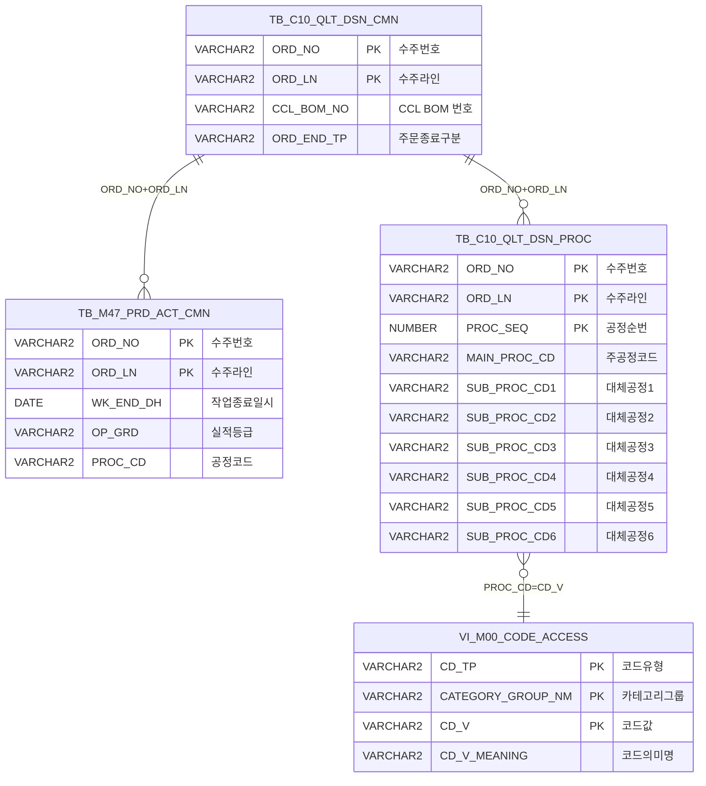

<h1 style="font-size: 40px; text-align: center; font-weight:
   bold; margin: 30px 0;">
  C104000020POP04 레거시 시스템 분석 종합 보고서
</h1>


# 1. 시스템 개요
- **서비스 ID**: C104000020POP04
- **업무명**: 프로젝트 주문 설계확정 팝업
- **분석 일시**: 2026-03-16 19:55 (KST)
- **분석 시간**: ~3분
- **전체 Activity 수**: 3개 (Built-in 3개, Custom 0개)
- **분석자**: Claude Opus 4.6 / Sonnet
- **분석 도구**: /analyze-service C104000020POP04
- **문서 버전**: 1.0

# 📊 비즈니스 프로세스 분석

## 시스템 목적

본 서비스는 **프로젝트 주문(Project Order)의 설계확정 처리를 위한 팝업 화면**이다. CCL(Color Coating Line) 공정에서 프로젝트 주문을 설계확정하기 전에, 해당 주문의 이전 생산이력(칼라공정)과 통과공정 정보를 확인하도록 강제하는 역할을 한다.

팝업은 부모 화면(C104000020 - 품질검사 설계 화면)에서 CCL BOM 번호를 전달받아, 해당 BOM과 연결된 주문의 최종 생산 실적(작업종료일시, 공정코드)을 조회하고, 주문의 통과공정(주공정 + 대체공정 1~6)을 표시한다. 오퍼레이터는 이 정보를 확인한 후 설계확정, 코드사용 화면 이동, 또는 통과공정 탭 활성화 중 하나를 선택할 수 있다.

프로젝트 주문은 일반 주문과 달리 별도의 확인 절차가 필요하며, 빨간색 경고 텍스트("※ [주의] Project 주문입니다.")로 오퍼레이터의 주의를 환기한다.

## 주요 유즈케이스

### UC-01: 프로젝트 주문 생산이력 확인

- **Actor**: CCL 공정 품질검사 담당자
- **목적**: 설계확정 전 해당 프로젝트 주문의 이전 생산이력(칼라공정)을 확인하여, 기존 생산 경험 유무와 최종 공정 정보를 파악

- **전제조건**:
  - 부모 화면(C104000020)에서 프로젝트 주문이 선택되어 있음
  - CCL_BOM_NO가 부모 폼(C104000020_Form_2)에 설정되어 있음
  - JSP 파라미터로 ORD_NO, ORD_LN이 전달됨

- **주요 흐름**:
  1. 팝업 로드 시 부모 폼(C104000020_Form_2)에서 CCL_BOM_NO를 자동 취득
  2. `find()` 함수가 호출되어 `C104000020POP04.select` 쿼리 실행 (CCL_BOM_NO 파라미터)
  3. 조회 결과에서 수주번호(ORD_NO), 수주라인(ORD_LN), 작업종료일시(WK_END_DH), 공정코드(PROC_CD) 추출
  4. ORDER_NO 필드에 "수주번호 : {ORD_NO}-{ORD_LN}" 형태로 표시
  5. HISTORY 필드에 "{WK_END_DH} {PROC_CD}에서 생산이력이 있습니다." 형태로 표시

- **대체 흐름**:
  - 생산이력 없음: HISTORY에 "해당 BOM의 생산이력이 없습니다." 표시
  - 주문종료구분(ORD_END_TP)이 'E'인 경우: 조회에서 제외 (종료된 주문 필터링)

- **후행조건**:
  - 생산이력 정보가 폼에 표시됨
  - 오퍼레이터가 설계확정/코드사용/통과공정 버튼 선택 가능

### UC-02: 프로젝트 주문 통과공정 확인

- **Actor**: CCL 공정 품질검사 담당자
- **목적**: 해당 주문의 통과공정(주공정 및 대체공정 1~6)을 확인하여 칼라공정 포함 여부 파악

- **전제조건**:
  - UC-01의 생산이력 조회가 완료됨
  - JSP 파라미터로 ORD_NO, ORD_LN이 설정되어 있음

- **주요 흐름**:
  1. `find()` 함수 내에서 2차 AJAX 호출 (`findProc=1` 파라미터)
  2. `C104000020POP04.selectProc` 쿼리 실행 (ORD_NO, ORD_LN 파라미터)
  3. 주공정(MAIN_PROC_CD) 및 대체공정 1~6(SUB_PROC_CD1~6)의 공정코드를 의미명으로 변환하여 조회
  4. PROC 필드에 "『 현재 주문의 통과공정 』" 헤더 표시
  5. MAIN_PROC, SUB_PROC1~6 필드에 "• 주공정 : {의미명}", "• 대체공정1 : {의미명}" 형태로 표시

- **대체 흐름**:
  - 통과공정 없음 또는 칼라공정('A' 시작) 없음: PROC에 "현재 주문의 통과공정에 칼라공정이 없습니다." 표시
  - 대체공정이 6개 미만인 경우: 해당 SUB_PROC 필드는 빈 값으로 유지

- **후행조건**:
  - 통과공정 정보가 폼에 표시됨

### UC-03: 설계확정 처리

- **Actor**: CCL 공정 품질검사 담당자
- **목적**: 생산이력 및 통과공정 확인 후 해당 주문의 설계를 확정 처리

- **전제조건**:
  - UC-01, UC-02가 완료되어 생산이력 및 통과공정이 표시됨
  - 부모 폼(C104000020_Form_1)에 ORD_NO, ORD_LN이 설정되어 있음

- **주요 흐름**:
  1. "설계확정" 버튼 클릭
  2. 부모 폼(C104000020_Form_1)에서 ORD_NO와 ORD_LN(콤보 값) 취득
  3. `handleDataProcess.do`로 save 처리 (C104000020_Form_1 폼 데이터 + ORD_NO/ORD_LN 파라미터)
  4. 팝업 닫기 (`winClose()`)

- **대체 흐름**:
  - 저장 실패 시: 에러 메시지 표시

- **후행조건**:
  - 해당 주문의 설계가 확정 상태로 변경됨
  - 팝업이 닫히고 부모 화면으로 복귀

### UC-04: 코드사용 화면 이동

- **Actor**: CCL 공정 품질검사 담당자
- **목적**: CCL BOM 코드 기반으로 코드사용 화면(C106000090)으로 이동하여 상세 코드 정보 확인

- **전제조건**:
  - CCL_BOM_NO가 설정되어 있음

- **주요 흐름**:
  1. "코드사용" 버튼 클릭
  2. 부모 폼(C104000020_Form_2)에서 CCL_BOM_NO 취득
  3. CCL_BOM_NO 앞 5자리를 파라미터로 추출
  4. `parent.parent.newRemoveOpenTab('C106000090', 파라미터)` 호출로 새 탭 오픈
  5. 팝업 닫기

- **대체 흐름**:
  - BOM 정보 없음: `dhtmlx.alert('BOM정보가 없습니다!')` 경고 표시

- **후행조건**:
  - C106000090 화면이 새 탭으로 열림
  - 팝업 닫힘

### UC-05: 통과공정 탭 활성화

- **Actor**: CCL 공정 품질검사 담당자
- **목적**: 부모 화면의 통과공정 탭(C104000020TAB08)으로 바로 이동

- **전제조건**:
  - 부모 화면에 C104000020_Tabbar_1이 존재

- **주요 흐름**:
  1. "통과공정" 버튼 클릭
  2. 부모 폼(C104000020_Form_1)에서 ORD_NO, ORD_LN 취득
  3. 부모 탭바(C104000020_Tabbar_1)에서 C104000020TAB08 탭 활성화
  4. 팝업 닫기

- **후행조건**:
  - 부모 화면에서 통과공정 탭이 활성화됨
  - 팝업 닫힘

---
## 비즈니스 로직 상세

### 1. 최종 생산이력 추출 로직 (C104000020POP04.select)

- **목적**: CCL BOM 번호로 연결된 주문들 중 가장 최근에 작업이 완료된 생산이력 1건을 추출하여, 해당 공정코드의 의미명과 함께 반환

- **처리 케이스**:

  **[케이스 1: 생산이력 존재]**
  ```
    조건: CCL_BOM_NO에 해당하는 주문이 TB_C10_QLT_DSN_CMN에 존재하고,
          해당 주문의 생산실적(TB_M47_PRD_ACT_CMN)에 작업종료일시가 있음
    처리:
      1. TB_C10_QLT_DSN_CMN에서 CCL_BOM_NO로 주문 목록 조회
      2. ORD_END_TP가 'E'(종료)가 아닌 주문만 필터링 (NVL 처리로 NULL도 포함)
      3. TB_M47_PRD_ACT_CMN에서 OP_GRD='1'(1급 실적) 조건으로 주문별 MAX(WK_END_DH) 집계
      4. 동일 주문/라인/작업종료일시로 DISTINCT 공정코드 추출
      5. WK_END_DH DESC 정렬 후 ROWNUM=1로 가장 최근 1건만 반환
      6. 공정코드를 VI_M00_CODE_ACCESS 뷰에서 CD_TP='PROC_CD', CATEGORY_GROUP_NM='SZ0000' 조건으로 의미명 변환
  ```

  **[케이스 2: 생산이력 없음]**
  ```
    조건: WK_END_DH IS NOT NULL 조건에 의해 생산실적이 없는 경우 결과 없음
    처리:
      1. 조회 결과 0건 반환
      2. JSP에서 "해당 BOM의 생산이력이 없습니다." 메시지 표시
  ```

- **핵심 SQL 패턴**:
  ```
  3단계 LEFT JOIN 구조:
    1차 JOIN: 주문(A) ↔ 주문별 최종 작업종료일시 집계(B)
    2차 JOIN: 주문(A) + 최종일시(B) ↔ 해당 시점의 공정코드(C)
  → ROWNUM = 1로 단일 최신 레코드 반환
  ```

### 2. 통과공정 코드→의미명 일괄 변환 (C104000020POP04.selectProc)

- **목적**: 주문의 통과공정(주공정 + 대체공정 1~6) 7개 공정코드를 모두 의미명으로 변환하여 한 번에 반환

- **처리 케이스**:

  **[케이스 1: 칼라공정('A' 시작) 존재]**
  ```
    조건: TB_C10_QLT_DSN_PROC에서 ORD_NO, ORD_LN으로 조회 시
          MAIN_PROC_CD가 'A'로 시작하는 레코드 존재
    처리:
      1. SUBSTR(MAIN_PROC_CD,0,1) = 'A' 조건으로 칼라공정만 필터링
      2. PROC_SEQ DESC 정렬 후 ROWNUM=1로 최신 1건 선택
      3. MAIN_PROC_CD, SUB_PROC_CD1~6 각각에 대해 스칼라 서브쿼리로 코드→의미명 변환
      4. 변환 조건: CD_TP='PROC_CD', CATEGORY_GROUP_NM='SZ0000'
  ```

  **[케이스 2: 칼라공정 없음]**
  ```
    조건: MAIN_PROC_CD가 'A'로 시작하는 레코드 없음
    처리:
      1. 조회 결과 0건 반환
      2. JSP에서 "현재 주문의 통과공정에 칼라공정이 없습니다." 메시지 표시
  ```

- **핵심 SQL 패턴**:
  ```
  7개 스칼라 서브쿼리 반복 패턴:
    (SELECT CD_V_MEANING
     FROM M00APUSER.VI_M00_CODE_ACCESS
     WHERE CD_TP='PROC_CD' AND CATEGORY_GROUP_NM='SZ0000'
     AND CD_V = [공정코드 컬럼]) AS [공정코드 컬럼]
  → MAIN_PROC_CD, SUB_PROC_CD1~6 총 7회 동일 패턴 반복
  ```

---

# 💾 데이터 요구사항

## 핵심 테이블

### 1. C10APUSER.TB_C10_QLT_DSN_CMN - (품질검사 설계 공통)
| 컬럼명 | 타입 | PK | 설명 |
|--------|------|----|------|
| ORD_NO | VARCHAR2 | ✅ | 수주번호 |
| ORD_LN | VARCHAR2 | ✅ | 수주라인 |
| CCL_BOM_NO | VARCHAR2 | | CCL BOM 번호 (조회 키) |
| ORD_END_TP | VARCHAR2 | | 주문종료구분 ('E'=종료, NULL/'N'=미종료) |

### 2. MESAPUSER.TB_M47_PRD_ACT_CMN - (생산실적 공통)
| 컬럼명 | 타입 | PK | 설명 |
|--------|------|----|------|
| ORD_NO | VARCHAR2 | ✅ | 수주번호 |
| ORD_LN | VARCHAR2 | ✅ | 수주라인 |
| WK_END_DH | DATE | | 작업종료일시 |
| PDN_PST_DD | DATE | | 생산실적일 |
| OP_GRD | VARCHAR2 | | 실적등급 ('1'=1급 실적) |
| PROC_CD | VARCHAR2 | | 공정코드 |

### 3. C10APUSER.TB_C10_QLT_DSN_PROC - (품질검사 설계 통과공정)
| 컬럼명 | 타입 | PK | 설명 |
|--------|------|----|------|
| ORD_NO | VARCHAR2 | ✅ | 수주번호 |
| ORD_LN | VARCHAR2 | ✅ | 수주라인 |
| PROC_SEQ | NUMBER | ✅ | 공정순번 |
| MAIN_PROC_CD | VARCHAR2 | | 주공정코드 |
| SUB_PROC_CD1 | VARCHAR2 | | 대체공정코드1 |
| SUB_PROC_CD2 | VARCHAR2 | | 대체공정코드2 |
| SUB_PROC_CD3 | VARCHAR2 | | 대체공정코드3 |
| SUB_PROC_CD4 | VARCHAR2 | | 대체공정코드4 |
| SUB_PROC_CD5 | VARCHAR2 | | 대체공정코드5 |
| SUB_PROC_CD6 | VARCHAR2 | | 대체공정코드6 |

### 4. M00APUSER.VI_M00_CODE_ACCESS - (공통코드 뷰)
| 컬럼명 | 타입 | PK | 설명 |
|--------|------|----|------|
| CD_TP | VARCHAR2 | ✅ | 코드유형 ('PROC_CD'=공정코드) |
| CATEGORY_GROUP_NM | VARCHAR2 | ✅ | 카테고리그룹명 ('SZ0000') |
| CD_V | VARCHAR2 | ✅ | 코드값 |
| CD_V_MEANING | VARCHAR2 | | 코드의미명 |

## 데이터 플로우

### 1. 생산이력 조회 (find)
```
팝업 로드 → CCL_BOM_NO 자동 취득 (부모 Form_2)
→ C104000020POP04.select (find=1)
  FROM C10APUSER.TB_C10_QLT_DSN_CMN A
  LEFT JOIN (SELECT MAX(WK_END_DH) FROM MESAPUSER.TB_M47_PRD_ACT_CMN WHERE OP_GRD='1' GROUP BY ORD_NO, ORD_LN) B
    ON A.ORD_NO = B.ORD_NO AND A.ORD_LN = B.ORD_LN
  LEFT JOIN (SELECT DISTINCT ORD_NO, ORD_LN, WK_END_DH, PROC_CD FROM MESAPUSER.TB_M47_PRD_ACT_CMN WHERE OP_GRD='1') C
    ON A.ORD_NO = C.ORD_NO AND A.ORD_LN = C.ORD_LN AND B.WK_END_DH = C.WK_END_DH
  WHERE A.CCL_BOM_NO = :CCL_BOM_NO
    AND NVL(A.ORD_END_TP,'N') <> 'E'
    AND B.WK_END_DH IS NOT NULL
  ORDER BY B.WK_END_DH DESC → ROWNUM = 1
  + 스칼라 서브쿼리: M00APUSER.VI_M00_CODE_ACCESS (PROC_CD → 의미명)
→ Form에 수주번호, 생산이력 메시지 표시
```

### 2. 통과공정 조회 (findProc)
```
생산이력 조회 완료 후 자동 호출
→ C104000020POP04.selectProc (findProc=1)
  FROM C10APUSER.TB_C10_QLT_DSN_PROC
  WHERE ORD_NO = :ORD_NO AND ORD_LN = :ORD_LN
    AND SUBSTR(MAIN_PROC_CD,0,1) = 'A'
  ORDER BY PROC_SEQ DESC → ROWNUM = 1
  + 스칼라 서브쿼리 7회: M00APUSER.VI_M00_CODE_ACCESS (주공정+대체공정1~6 → 의미명)
→ Form에 통과공정 정보 표시
```

## SQL 일람표
| SQL 이름 | 쿼리 ID | 타입 | 출처 | 테이블 |
|---------|---------|-----|------|--------|
| 생산이력 조회 | C104000020POP04.select | SELECT | Service | TB_C10_QLT_DSN_CMN, TB_M47_PRD_ACT_CMN, VI_M00_CODE_ACCESS |
| 통과공정 조회 | C104000020POP04.selectProc | SELECT | Service | TB_C10_QLT_DSN_PROC, VI_M00_CODE_ACCESS |

## ER 다이어그램 (핵심 관계)



관계 설명:
- **TB_C10_QLT_DSN_CMN**이 중심 테이블로, 주문(ORD_NO+ORD_LN) 기반 모든 관계의 허브 역할
- **TB_M47_PRD_ACT_CMN**: 품질설계 주문과 ORD_NO+ORD_LN으로 1:N 관계 (한 주문에 여러 생산실적)
- **TB_C10_QLT_DSN_PROC**: 품질설계 주문과 ORD_NO+ORD_LN으로 1:N 관계 (한 주문에 여러 통과공정 이력)
- **VI_M00_CODE_ACCESS**: 공정코드 마스터 뷰, PROC_CD를 의미명으로 변환하는 참조 관계

---

# 🖥️ 사용자 인터페이스 요구사항

## 화면 레이아웃 상세

### Layout 구조
```javascript
// 별도 initLayout 없음 - 단일 Form 컴포넌트 팝업
{
  type: "popup",
  size: { width: "582px", height: "357px" },
  title: "프로젝트 주문 설계확정",
  containerDiv: "C104000020POP04_Form_1",
  components: [
    {
      id: "C104000020POP04_Form_1",
      type: "form",
      xmlFile: "header/kr/C104000020POP04/C104000020POP04_Form_1.xml",
      service: "C104000020POP04-service"
    }
  ]
}
```

## 입출력 요소

### Form 컴포넌트

**C104000020POP04_Form_1** (프로젝트 주문 설계확정 폼)

**경고/안내 영역**:
- Wax (1): template - "※ [주의] Project 주문입니다." (빨간색 16px bold, 중앙 정렬)
- Wax (2): template - "이전 생산이력[칼라공정]을 확인하세요." (검정색 bold)

**생산이력 표시 영역**:
- ORDER_NO: template - 수주번호 표시 (파란색 #2381C5, 14px bold, 읽기전용)
- HISTORY: template - 생산이력 메시지 표시 (파란색 #2381C5, 14px bold, 읽기전용)

**통과공정 표시 영역**:
- PROC: template - 통과공정 섹션 헤더 (검정색 bold, 읽기전용)
- MAIN_PROC: template - 주공정 표시 (검정색 bold, 읽기전용)
- SUB_PROC1: template - 대체공정1 표시 (검정색 bold, 읽기전용)
- SUB_PROC2: template - 대체공정2 표시 (검정색 bold, 읽기전용)
- SUB_PROC3: template - 대체공정3 표시 (검정색 bold, 읽기전용)
- SUB_PROC4: template - 대체공정4 표시 (검정색 bold, 읽기전용)
- SUB_PROC5: template - 대체공정5 표시 (검정색 bold, 읽기전용)
- SUB_PROC6: template - 대체공정6 표시 (검정색 bold, 읽기전용)

**버튼 영역**:
- ok: button - "설계확정" (inputLeft:125, inputTop:5) → 부모 폼 save 후 팝업 닫기
- openCdUsg: button - "코드사용" (inputLeft:215, inputTop:5) → C106000090 탭 오픈
- cancel: button - "통과공정" (inputLeft:325, inputTop:5) → C104000020TAB08 탭 활성화

## 화면 동작 흐름

### 1. 팝업 초기 로딩
```
1. 팝업 오픈 (부모 화면 C104000020에서 호출)
2. JSP 파라미터 수신: ORD_NO, ORD_LN
3. C104000020POP04_Form_1 XML 기반 Form 렌더링
4. onXLEEvent 이벤트 바인딩
5. Form 로드 완료 시 onFormLoadEvent 발생
6. 부모 폼(C104000020_Form_2)에서 CCL_BOM_NO 취득
7. find(bom) 호출 → 생산이력 + 통과공정 자동 조회
8. onXleForm 이벤트 detach (1회성)
```

### 2. 데이터 조회 (find)
```
1. CCL_BOM_NO 파라미터로 c10AjaxData.do 호출
   - service: C104000020POP04-service, find=1
2. 응답 JSON 파싱
3. 생산이력 있는 경우:
   - ORDER_NO 필드: "수주번호 : {ORD_NO}-{ORD_LN}"
   - HISTORY 필드: "{WK_END_DH} {PROC_CD}에서 생산이력이 있습니다."
4. 생산이력 없는 경우:
   - HISTORY 필드: "해당 BOM의 생산이력이 없습니다."
5. 이어서 통과공정 조회 (c10AjaxData.do, findProc=1, ORD_NO/ORD_LN JSP 파라미터)
6. 통과공정 있는 경우:
   - PROC: "『 현재 주문의 통과공정 』"
   - MAIN_PROC: "• 주공정 : {MAIN_PROC_CD}"
   - SUB_PROC1~6: "• 대체공정N : {SUB_PROC_CDN}"
7. 통과공정 없는 경우:
   - PROC: "현재 주문의 통과공정에 칼라공정이 없습니다."
```

### 3. 설계확정 처리 (ok 버튼)
```
1. "설계확정" 버튼 클릭
2. parent.items['C104000020_Form_1']에서 ORD_NO 취득
3. parent.items['C104000020_Form_1']에서 ORD_LN (콤보값) 취득
4. parentForm.sendForm('handleDataProcess.do', 'C104000020_Form_1', 'save', ORD_NO+ORD_LN)
5. winClose() → 팝업 닫기
```

### 4. 코드사용 화면 이동 (openCdUsg 버튼)
```
1. "코드사용" 버튼 클릭
2. parent.items['C104000020_Form_2'].getItemValue('CCL_BOM_NO') 취득
3. BOM 없으면: dhtmlx.alert('BOM정보가 없습니다!') → 중단
4. BOM 있으면: substring(0,5)로 앞 5자리 추출
5. parent.parent.newRemoveOpenTab('C106000090', CCL_BOM_NO 파라미터)
6. winClose() → 팝업 닫기
```

### 5. 통과공정 탭 이동 (cancel 버튼)
```
1. "통과공정" 버튼 클릭
2. parent.items['C104000020_Form_1']에서 ORD_NO, ORD_LN 취득
3. parent.items['C104000020_Tabbar_1'].getDhxTabbar().setTabActive('C104000020TAB08')
4. winClose() → 팝업 닫기
```

## JavaScript 모듈

**C104000020POP04.jsp** (팝업 인라인 스크립트)
- onFormLoadEvent(): 폼 로드 완료 이벤트 핸들러 - 부모 폼에서 CCL_BOM_NO 취득 후 find() 호출
- find(bom): 생산이력 + 통과공정 2단계 AJAX 조회 (c10AjaxData.do 2회 호출)
- ok(): 설계확정 버튼 핸들러 - parentForm.sendForm()으로 save 처리 후 winClose()
- openCdUsg(): 코드사용 버튼 핸들러 - parent.parent.newRemoveOpenTab('C106000090') 호출
- cancel(): 통과공정 버튼 핸들러 - 부모 탭바에서 C104000020TAB08 활성화 후 winClose()
- winClose(): 팝업 닫기 유틸리티

## 주요 이벤트 핸들러

**onFormLoadEvent (폼 로드 완료)**
- 이벤트 타입: XLE Event (onXLEEvent)
- 처리 내용:
  1. 부모 폼(C104000020_Form_2)에서 CCL_BOM_NO 값 취득
  2. find(bom) 호출로 데이터 자동 조회
  3. onXleForm 이벤트 detach (1회성 실행 보장)

**ok (설계확정 버튼 클릭)**
- 이벤트 타입: Button Click (command: "ok")
- 처리 내용:
  1. 부모 폼(C104000020_Form_1)에서 ORD_NO 취득
  2. 부모 폼(C104000020_Form_1)에서 ORD_LN (콤보) 취득
  3. parentForm.sendForm() 호출로 handleDataProcess.do에 save 요청
  4. winClose()로 팝업 닫기

**openCdUsg (코드사용 버튼 클릭)**
- 이벤트 타입: Button Click (command: "openCdUsg")
- 처리 내용:
  1. 부모 폼(C104000020_Form_2)에서 CCL_BOM_NO 취득
  2. BOM 미존재 시 dhtmlx.alert('BOM정보가 없습니다!') 경고
  3. BOM 앞 5자리 추출하여 C106000090 탭 오픈
  4. winClose()로 팝업 닫기

**cancel (통과공정 버튼 클릭)**
- 이벤트 타입: Button Click (command: "cancel")
- 처리 내용:
  1. 부모 폼에서 ORD_NO, ORD_LN 취득
  2. 부모 탭바(C104000020_Tabbar_1)에서 C104000020TAB08 탭 활성화
  3. winClose()로 팝업 닫기

---

# 📌 특이사항 및 주의사항

## 1. 부모 화면 컴포넌트 직접 참조 (강결합)
- **parent.items 직접 접근**: 이 팝업은 부모 화면(C104000020)의 3개 컴포넌트(Form_1, Form_2, Tabbar_1)에 `parent.items['컴포넌트ID']` 형태로 직접 접근한다. 부모 화면의 컴포넌트 ID나 구조가 변경되면 이 팝업도 함께 수정해야 한다.
- **parent.parent 2단계 참조**: 코드사용 버튼에서 `parent.parent.newRemoveOpenTab()` 형태로 2단계 상위 객체에 접근하여 새 탭을 오픈한다. 화면 계층 구조가 변경되면 동작하지 않을 수 있다.

## 2. JSP 파라미터의 JavaScript 직접 삽입
- **보안 취약점**: JSP의 `request.getParameter("ORD_NO")`, `request.getParameter("ORD_LN")` 값이 JavaScript 변수에 직접 삽입된다. XSS(Cross-Site Scripting) 공격에 취약할 수 있으나, 내부 MES 시스템이므로 실질적 위험은 낮다.
- **인코딩 이슈**: JSP 파라미터가 null인 경우 JavaScript에 "null" 문자열이 삽입될 수 있어, 통과공정 조회 시 예상치 못한 결과가 나올 수 있다.

## 3. ROWNUM 기반 최신 1건 조회 패턴
- **Oracle 전용 구문**: 두 쿼리 모두 `ORDER BY ... DESC` + `ROWNUM = 1` 패턴으로 최신 1건을 추출한다. 이는 Oracle에서는 정상 동작하지만, 다른 DBMS로 마이그레이션 시 `ROW_NUMBER()` 또는 `FETCH FIRST` 구문으로 변환이 필요하다.
- **select 쿼리의 복잡한 3단 JOIN**: TB_M47_PRD_ACT_CMN을 2번 참조(집계용 B, 상세용 C)하면서 LEFT JOIN으로 연결하는 구조이며, 대량 데이터 시 성능 저하 가능성이 있다.

## 4. 스칼라 서브쿼리 7회 반복 (selectProc)
- **성능 고려**: 통과공정 조회 쿼리에서 VI_M00_CODE_ACCESS 뷰에 대한 동일 패턴의 스칼라 서브쿼리가 7회(주공정 1회 + 대체공정 6회) 반복된다. Oracle 스칼라 서브쿼리 캐싱으로 실제 성능 영향은 미미하나, 코드 중복이 많다.

## 5. 칼라공정 필터링 규칙
- **SUBSTR(MAIN_PROC_CD,0,1) = 'A'**: 주공정코드의 첫 글자가 'A'인 경우만 칼라공정으로 판별한다. Oracle의 SUBSTR은 0과 1 모두 첫 번째 문자를 반환하므로 동작하나, 표준적으로는 `SUBSTR(MAIN_PROC_CD,1,1)`이 올바른 사용법이다.

## 6. "통과공정" 버튼의 오해 소지 있는 command 값
- **cancel 명령어 사용**: "통과공정" 버튼의 command가 "cancel"로 설정되어 있다. 실제로는 취소 기능이 아니라 부모 탭바의 통과공정 탭을 활성화하는 기능이므로, 코드 유지보수 시 혼동의 소지가 있다.

---

# 📚 참고 문서

- **Query SQL**: `src/query/C104000020POP04-query.glue_sql`
- **Service XML**: `src/service/C104000020POP04-service.xml`
- **JSP**: `WebContents/C104000020POP04.jsp`
- **Form XML**: `WebContents/header/kr/C104000020POP04/C104000020POP04_Form_1.xml`
- **부모 화면**: C104000020 (품질검사 설계 화면)
- **연관 화면**: C106000090 (코드사용), C104000020TAB08 (통과공정 탭)
