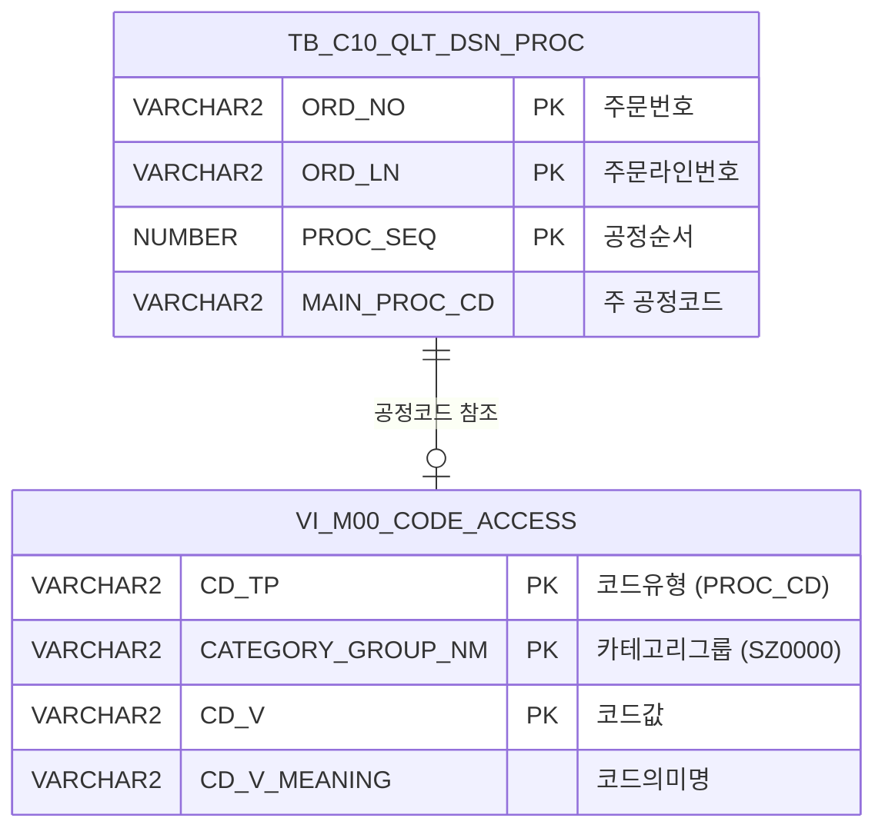

<h1 style="font-size: 40px; text-align: center; font-weight:
   bold; margin: 30px 0;">
  C104000020POP05 레거시 시스템 분석 종합 보고서
</h1>


# 1. 시스템 개요
- **서비스 ID**: C104000020POP05
- **업무명**: KISS CUTTING 통과공정 조회 팝업
- **분석 일시**: 2026-03-16 20:09 KST
- **분석 시간**: 약 3분
- **전체 Activity 수**: 2개 (Built-in 2개, Custom 0개)
- **분석자**: Claude Opus 4.6
- **분석 도구**: /analyze-service C104000020POP05
- **문서 버전**: 1.0

# 📊 비즈니스 프로세스 분석

## 시스템 목적

C104000020POP05는 KISS CUTTING 작업지시 화면(C104000020)의 팝업 서비스로, 특정 주문(ORD_NO, ORD_LN)에 설정된 **품질설계 통과공정 목록을 조회**하는 단순 조회 서비스이다.

품질설계 공정 테이블(`C10APUSER.TB_C10_QLT_DSN_PROC`)에 세로(행)로 저장된 공정 코드를 ROW_NUMBER()와 CASE WHEN + MAX 피벗 패턴으로 최대 12개의 가로(열) 컬럼으로 변환하여 반환한다. 각 공정 코드는 공통코드 뷰(`M00APUSER.VI_M00_CODE_ACCESS`)에서 의미명을 조회하여 "코드 - 명칭" 형태로 표시한다.

PosDefaultRouter에서 `findProc` 명령어로 분기하여 FormSearch Activity가 단일 SELECT 쿼리를 실행하는 매우 단순한 구조이다. Custom Activity가 없고, INSERT/UPDATE/DELETE 없이 SELECT 쿼리만 사용하므로 워크플로우 다이어그램은 생략한다.

## 주요 유즈케이스

### UC-01: 통과공정 조회
- **Actor**: KISS CUTTING 공정 오퍼레이터
- **목적**: 특정 주문/주문라인에 설정된 품질설계 통과공정을 한눈에 확인하여 작업 전 공정 경로를 파악

- **전제조건**:
  - KISS CUTTING 작업지시 화면(C104000020)이 열려 있음
  - 조회 대상 주문번호(ORD_NO)와 주문라인(ORD_LN)이 선택되어 있음
  - 해당 주문에 품질설계 공정 데이터가 등록되어 있음

- **주요 흐름**:
  1. 오퍼레이터가 작업지시 화면에서 통과공정 조회 팝업을 호출 (ORD_NO, ORD_LN 전달)
  2. PosDefaultRouter가 `findProc` 명령어를 수신하여 "통과공정 조회" Activity로 분기
  3. FormSearch Activity가 `C104000020POP05.selectProc` 쿼리 실행 (mesdao 사용)
  4. TB_C10_QLT_DSN_PROC에서 PROC_SEQ 순서로 통과공정 조회 후 피벗 변환
  5. 최대 12개 공정이 "코드 - 명칭" 형태로 가로 배치되어 Form에 표시

- **대체 흐름**:
  - 통과공정이 없는 경우: 모든 MAIN_PROC_CD1~12 컬럼이 NULL 반환
  - 12개 초과 공정이 있는 경우: 13번째 이후 공정은 표시되지 않음

- **후행조건**:
  - 오퍼레이터가 통과공정 경로를 확인하고 팝업을 닫음

---
## 비즈니스 로직 상세

### 1. 통과공정 피벗 변환 (SQL 기반)

- **목적**: 세로(행)로 저장된 공정 순서 데이터를 가로(열) 형태로 변환하여 한 행으로 표시
- **처리 케이스**:

  **[케이스 1: ROW_NUMBER 기반 피벗 변환]**
  ```
    조건: ORD_NO + ORD_LN으로 특정 주문의 공정 데이터가 존재
    처리:
      1. 서브쿼리에서 TB_C10_QLT_DSN_PROC 테이블 조회
      2. PROC_SEQ 순으로 ROW_NUMBER() 부여 (rn = 1, 2, ... 12)
      3. 외부 쿼리에서 CASE WHEN rn=N 패턴으로 각 행을 별도 컬럼으로 매핑
      4. MAX 집계함수로 GROUP 없이 단일 행 결과 생성
  ```

  **[케이스 2: 공정코드→명칭 변환]**
  ```
    조건: 각 MAIN_PROC_CD 값이 존재
    처리:
      1. 스칼라 서브쿼리로 VI_M00_CODE_ACCESS 뷰 조회
      2. CD_TP = 'PROC_CD', CATEGORY_GROUP_NM = 'SZ0000' 조건
      3. MAIN_PROC_CD와 CD_V 매칭하여 CD_V_MEANING(명칭) 조회
      4. "코드 - 명칭" 형태로 문자열 결합 (|| ' - ' ||)
  ```

- **계산 공식**:
  ```
  MAIN_PROC_CDn = MAX(CASE WHEN rn = n THEN MAIN_PROC_CD || ' - ' || CD_V_MEANING END)

  예시:
  공정 순서: 1=PCM, 2=EGL, 3=CCL
  결과: MAIN_PROC_CD1='PCM - 연속압연', MAIN_PROC_CD2='EGL - 전기도금', MAIN_PROC_CD3='CCL - 칼라코팅'
  MAIN_PROC_CD4~12 = NULL
  ```

---

# 💾 데이터 요구사항

## 핵심 테이블

### 1. C10APUSER.TB_C10_QLT_DSN_PROC - (품질설계 통과공정)
| 컬럼명 | 타입 | PK | 설명 |
|--------|------|----|-----|
| ORD_NO | VARCHAR2 | ✅ | 주문번호 |
| ORD_LN | VARCHAR2 | ✅ | 주문라인번호 |
| PROC_SEQ | NUMBER | ✅ | 공정 순서 |
| MAIN_PROC_CD | VARCHAR2 | | 주 공정 코드 |

### 2. M00APUSER.VI_M00_CODE_ACCESS - (공통코드 뷰)
| 컬럼명 | 타입 | PK | 설명 |
|--------|------|----|-----|
| CD_TP | VARCHAR2 | ✅ | 코드 유형 (본 서비스: 'PROC_CD') |
| CATEGORY_GROUP_NM | VARCHAR2 | ✅ | 카테고리 그룹명 (본 서비스: 'SZ0000') |
| CD_V | VARCHAR2 | ✅ | 코드 값 |
| CD_V_MEANING | VARCHAR2 | | 코드 의미명 |

## 데이터 플로우

### 1. 통과공정 조회
```
[팝업 호출 시 통과공정 조회]
팝업 진입 (ORD_NO, ORD_LN 파라미터 수신)
→ C104000020POP05.selectProc
  FROM C10APUSER.TB_C10_QLT_DSN_PROC
  WHERE ORD_NO = :ORD_NO AND ORD_LN = :ORD_LN
  + 스칼라 서브쿼리: M00APUSER.VI_M00_CODE_ACCESS
    WHERE CD_TP = 'PROC_CD' AND CATEGORY_GROUP_NM = 'SZ0000' AND CD_V = MAIN_PROC_CD
→ ROW_NUMBER() + CASE WHEN MAX 피벗 변환
→ Form에 MAIN_PROC_CD1~12 컬럼 표시
```

## SQL 일람표

| SQL 이름 | 쿼리 ID | 타입 | 출처 | 테이블 |
|---------|---------|-----|-------|-------|
| 통과공정 조회 | C104000020POP05.selectProc | SELECT | Service | C10APUSER.TB_C10_QLT_DSN_PROC, M00APUSER.VI_M00_CODE_ACCESS |

## ER 다이어그램 (핵심 관계)



관계 설명:
- TB_C10_QLT_DSN_PROC가 중심 테이블로, 주문별 품질설계 통과공정 순서를 저장
- VI_M00_CODE_ACCESS는 공통코드 뷰로, MAIN_PROC_CD → CD_V 매핑을 통해 공정코드의 의미명을 제공

---

# 🖥️ 사용자 인터페이스 요구사항

## 입력 파라미터 (Form 필드)

| 파라미터명 | 입력 유형 | 설명 | 전달 방식 |
|-----------|----------|------|----------|
| ORD_NO | hidden (바인드 변수) | 주문번호 | 부모 화면(C104000020)에서 URL 파라미터로 전달 |
| ORD_LN | hidden (바인드 변수) | 주문라인번호 | 부모 화면(C104000020)에서 URL 파라미터로 전달 |

> **참고**: 본 팝업은 PosDefaultRouter → FormSearch 구조의 단순 조회 서비스로, 사용자 입력 Form이 없습니다. 부모 화면에서 전달된 ORD_NO, ORD_LN이 바인드 변수로 직접 쿼리에 전달됩니다.

## 화면 동작 흐름

### 1. 통과공정 조회 (정상 케이스)
```
1. 부모 화면(C104000020)에서 팝업 호출 (ORD_NO, ORD_LN 파라미터 전달)
2. PosDefaultRouter가 findProc 명령 수신 → FormSearch Activity로 분기
3. C104000020POP05.selectProc 쿼리 실행
   - TB_C10_QLT_DSN_PROC에서 PROC_SEQ 순으로 ROW_NUMBER 부여
   - CASE WHEN rn=1~12 패턴으로 피벗 변환
   - 각 공정코드에 VI_M00_CODE_ACCESS 스칼라 서브쿼리로 명칭 매핑
4. Form에 MAIN_PROC_CD1~12 가로 배치 결과 표시
5. 오퍼레이터가 공정 경로 확인 후 팝업 닫기
```

### 2. 통과공정 미등록 (빈 결과 케이스)
```
1. 부모 화면에서 팝업 호출 (ORD_NO, ORD_LN 전달)
2. PosDefaultRouter → FormSearch 분기
3. C104000020POP05.selectProc 쿼리 실행
4. TB_C10_QLT_DSN_PROC에 해당 주문의 공정 데이터 미존재
5. MAX(CASE WHEN ...) 결과 모든 MAIN_PROC_CD1~12 = NULL 반환
6. Form에 빈 값으로 표시 → 통과공정 미설정 상태 확인
```

---

# 📌 특이사항 및 주의사항

## 1. SQL 힌트 주석의 POP04 참조
- **내용**: 쿼리 힌트에 `C104000020POP04.selectproc`으로 기재되어 있으나 실제 서비스 ID는 `C104000020POP05`
- **원인**: POP04에서 쿼리를 복사하여 POP05를 생성할 때 힌트 주석을 미수정한 것으로 추정
- **영향**: 기능에는 영향 없으나, 운영 시 쿼리 추적/튜닝 시 혼동 가능

## 2. 피벗 컬럼 12개 상한 하드코딩
- **내용**: CASE WHEN rn = 1 ~ 12까지만 피벗하여 최대 12개 공정만 표시
- **리스크**: 품질설계 공정이 13개 이상인 주문이 존재할 경우 일부 공정이 누락되어 표시됨
- **대응**: 현재 업무 기준상 12개 이하가 일반적이나, 향후 공정 수 증가 시 확인 필요

## 3. 스칼라 서브쿼리 12회 반복 실행
- **내용**: 피벗된 12개 컬럼 각각에 VI_M00_CODE_ACCESS 스칼라 서브쿼리가 포함되어 동일 뷰를 최대 12번 조회
- **성능**: 결과가 항상 단일 행이므로 성능 영향은 미미하나, Oracle 스칼라 서브쿼리 캐시가 동작하여 실제 실행은 최적화됨
- **대안**: WITH절(CTE)로 공통코드를 한 번 조회 후 JOIN하는 방식이 더 효율적일 수 있음

## 4. C10APUSER 스키마 직접 참조
- **내용**: 쿼리에서 `C10APUSER.TB_C10_QLT_DSN_PROC`으로 스키마를 명시적으로 지정하여 조회
- **주의**: DAO가 mesdao(MESAPUSER)이지만 C10APUSER 스키마 테이블을 직접 참조하므로, MESAPUSER에서 C10APUSER로의 SELECT 권한이 필요

## 5. NUI 서비스이나 UI 팝업 역할
- **내용**: 서비스 타입은 NUI(Non-UI)이지만, 서비스 ID의 POP05 접미사가 나타내듯 실제로는 C104000020 화면의 팝업으로 호출됨
- **특징**: FormSearch(Built-in)가 쿼리 결과를 직접 Form에 바인딩하므로 별도 JSP 없이 프레임워크 레벨에서 팝업 렌더링 처리

---

# 📚 참고 문서

- **Query SQL**: `src/query/C104000020POP05-query.glue_sql`
- **Service XML**: `src/service/C104000020POP05-service.xml`
