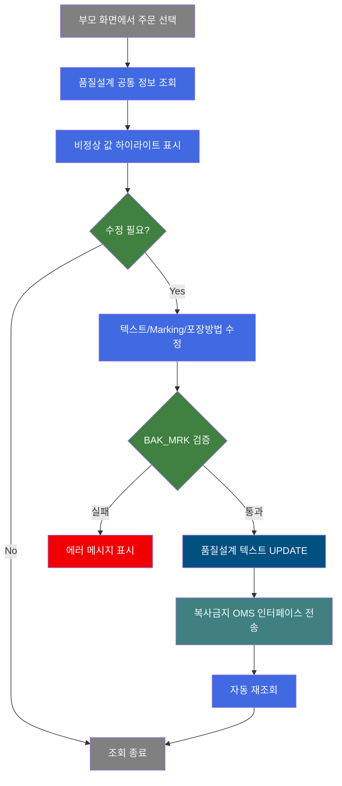
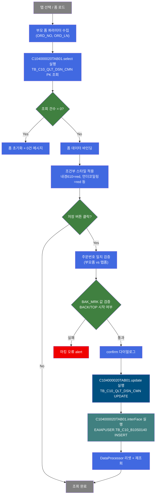
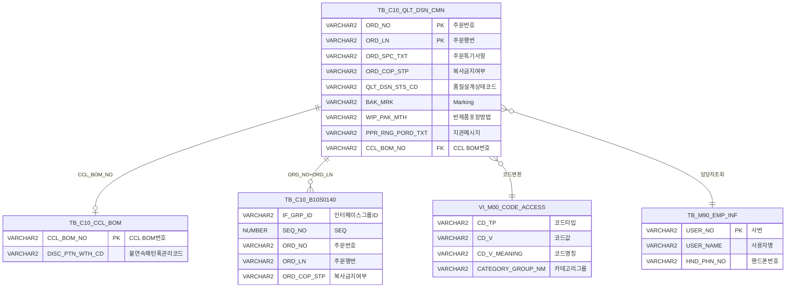

<h1 style="font-size: 40px; text-align: center; font-weight:
   bold; margin: 30px 0;">
  C104000020TAB01 레거시 시스템 분석 종합 보고서
</h1>


# 1. 시스템 개요
- **서비스 ID**: C104000020TAB01
- **업무명**: 품질설계결과-공통
- **분석 일시**: 2026-03-16 20:03 KST
- **분석 시간**: 약 10분
- **전체 Activity 수**: 4개 (Built-in 4개, Custom 0개)
- **분석자**: Claude Opus 4.6
- **분석 도구**: /analyze-service C104000020TAB01
- **문서 버전**: 1.0

# 📊 비즈니스 프로세스 분석

## 시스템 목적

C104000020TAB01은 품질설계결과 화면(C104000020)의 **공통 탭**으로, 특정 주문(ORD_NO + ORD_LN)에 대한 품질설계 공통 정보를 조회하고 일부 텍스트 필드를 수정할 수 있는 화면이다. 부모 화면(C104000020)에서 주문번호/행번을 선택하면 이 탭에서 해당 주문의 주문 사양, 품질설계 상태, 고객 정보, 포장 규격, 치수 허용치, 도금/코팅 사양 등 품질설계 전반에 걸친 상세 정보를 표시한다.

이 화면의 핵심 비즈니스는 **주문특기사항(ORD_SPC_TXT)**, **Marking(BAK_MRK)**, **반제품포장방법(WIP_PAK_MTH)**, **지관메시지(PPR_RNG_PORD_TXT)**, **복사금지(ORD_COP_STP)** 5개 필드의 수정이며, 수정 시 복사금지 정보를 EAI 인터페이스 테이블(EAIAPUSER.TB_C10_B10S0140)에 INSERT하여 OMS 외부 시스템과 동기화하는 기능을 수행한다.

또한 조회 결과에 대해 비정상 값(내경 610mm, 언더코일링, 특수슬리브 등)을 빨간색으로 하이라이트 표시하여 품질설계 담당자가 주의해야 할 항목을 시각적으로 강조한다.

## 핵심 워크플로우 다이어그램



### 상세 워크플로우 다이어그램



## 주요 유즈케이스

### UC-01: 품질설계 공통 정보 조회
- **Actor**: 품질설계 담당자
- **목적**: 특정 주문의 품질설계 공통 정보(주문 사양, 고객, 포장, 치수, 도금 등)를 한 화면에서 확인
- **전제조건**:
  - 부모 화면(C104000020)에서 주문번호(ORD_NO) 입력 완료
  - 주문행번(ORD_LN) 콤보박스에서 선택 완료
  - TB_C10_QLT_DSN_CMN 테이블에 해당 주문의 품질설계 데이터 존재

- **주요 흐름**:
  1. 사용자가 부모 화면에서 주문번호/행번 선택
  2. 공통 탭(C104000020TAB01) 선택 또는 자동 로드
  3. uiCommon.parameters3으로 부모 폼 파라미터 수집 → basicFormData.do 호출
  4. C104000020TAB01.select 쿼리 실행 → TB_C10_QLT_DSN_CMN 단일행 조회
  5. 80여 개 필드에 데이터 바인딩, 코드값은 공통코드 명칭과 함께 표시
  6. 비정상 값 필드에 빨간색 하이라이트 자동 적용

- **대체 흐름**:
  - 조회 결과 0건: 폼 초기화 후 "0건 조회되었습니다" 메시지 표시
  - 탭 전환 시: onSelectTab 이벤트로 자동 재조회

- **후행조건**:
  - 품질설계 공통 정보가 폼에 표시됨
  - 편집 가능 필드(5개)가 활성화되어 수정 가능 상태

### UC-02: 품질설계 텍스트 수정 및 복사금지 전송
- **Actor**: 품질설계 담당자
- **목적**: 주문특기사항, Marking, 반제품포장방법, 지관메시지, 복사금지 여부를 수정하고 OMS에 복사금지 정보를 전송
- **전제조건**:
  - UC-01 조회가 완료된 상태
  - 수정할 주문의 품질설계 데이터가 폼에 표시됨

- **주요 흐름**:
  1. 사용자가 편집 가능 필드(노란색 배경) 중 수정할 항목 입력
  2. 저장 버튼 클릭
  3. 주문번호(ORD_NO) null 검증 → 실패 시 "주문번호를 입력해주세요" alert
  4. 주문행번(ORD_LN) null 검증 → 실패 시 "주문행번을 선택해주세요" alert
  5. 부모 폼의 ORD_NO/ORD_LN과 탭 폼의 값 일치 검증
  6. BAK_MRK 값이 있으면 "BACK" 또는 "TOP" 시작 여부 검증
  7. confirm 다이얼로그 "수정하시겠습니까?" 표시
  8. 확인 시 handleDataProcess.do로 save 명령 전송
  9. "텍스트수정" Activity: TB_C10_QLT_DSN_CMN UPDATE (ORD_SPC_TXT, BAK_MRK, PPR_RNG_PORD_TXT, ORD_COP_STP, WIP_PAK_MTH)
  10. "복사금지전송" Activity: EAIAPUSER.TB_C10_B10S0140 INSERT (복사금지 정보 OMS 인터페이스)
  11. DataProcessor 리셋 후 자동 재조회

- **대체 흐름**:
  - 주문번호 불일치: "입력한 주문번호가 조회된 주문번호와 다릅니다" alert
  - BAK_MRK 검증 실패: "마킹이 TOP 또는 BACK인지 말머리에 입력해 주세요" alert
  - confirm에서 취소: 수정 작업 취소

- **후행조건**:
  - TB_C10_QLT_DSN_CMN 테이블에 수정된 데이터 반영
  - EAIAPUSER.TB_C10_B10S0140에 복사금지 인터페이스 레코드 생성
  - 화면 자동 재조회로 최신 데이터 표시

### UC-03: 비정상 값 시각적 경고 확인
- **Actor**: 품질설계 담당자 / 공정 오퍼레이터
- **목적**: 품질설계 공통 정보 중 주의가 필요한 비정상 값을 빨간색 하이라이트로 즉시 식별
- **전제조건**:
  - UC-01 조회가 완료된 상태

- **주요 흐름**:
  1. 조회 완료 콜백(findMessage)에서 각 필드별 조건 평가
  2. ORD_COIL_IDIA == "610" → 주문내경 빨간색 (비표준 내경)
  3. ORD_SHT_LOD_MTH 첫 글자 != "T" → Sheet적치방법 빨간색
  4. ORD_COILG_MTH 첫 글자 == "U" 또는 "S" → 권취방법 빨간색 (Under/Special)
  5. ORD_SLV_KND_TP 첫 글자 == "N" → 슬리브종류 빨간색 (N타입)
  6. ORD_WTH_MNG_CD 첫 글자 == "D" → 폭관리코드 빨간색
  7. ORD_PAK_UNT_WGT_ULV <= 2900 → 포장단중상한 빨간색
  8. KISS_CUT_YN == "Y" → KISS CUTTING 빨간색 볼드

- **대체 흐름**:
  - 모든 값이 정상: 기본 색상(검정) 유지
  - ORD_PAK_UNT_WGT_ULV > 2900: 명시적으로 검정색 복원

- **후행조건**:
  - 비정상 값 필드가 빨간색으로 표시되어 주의 환기

---
## 비즈니스 로직 상세

### 1. 코드값 → 명칭 변환 (스칼라 서브쿼리 패턴)

- **목적**: 품질설계 공통 테이블의 코드 컬럼을 사용자가 이해할 수 있는 "코드 : 명칭" 형태로 변환하여 표시
- **처리 케이스**:

  **[케이스 1: 일반 코드 변환 (CATEGORY_GROUP_NM = 'SZ0000')]**
  ```
    조건: 대부분의 코드 컬럼 (QLT_DSN_STS_CD, ORD_KND, FLOW_CHL, NAT_CD 등 20여 개)
    처리:
      1. 코드값에 ' : ' + 코드명칭을 문자열 연결
      2. VI_M00_CODE_ACCESS 뷰에서 CD_TP = 해당 코드타입, CD_V = 코드값, CATEGORY_GROUP_NM = 'SZ0000' 조건으로 조회
      3. 결과: "A : 내수" 형태로 표시
  ```

  **[케이스 2: 제품명코드 기반 동적 카테고리 변환]**
  ```
    조건: GW_ASG_CD(도금량코드), ORD_SPNL_TP(Spangle) 컬럼
    처리:
      1. PRD_NM_CD(제품명코드) 값에 따라 DECODE로 CATEGORY_GROUP_NM 동적 결정
      2. GW_ASG_CD: PRD_NM_CD '4','L' → 'SL0000', '2','E','8','N' → 'SE0000', 'V','6' → 'SV0000', 'W','9' → 'SW0000', 기타 → 'SG0000'
      3. ORD_SPNL_TP: PRD_NM_CD 'G','3','K','J' → 'SG0000', 'L','4' → 'SL0000', 'V','6' → 'SV0000', 'W','9' → 'SW0000', 기타 → 'SZ0000'
  ```

  **[케이스 3: CCL BOM 연계 조회]**
  ```
    조건: DISC_PTN_WTH_CD(불연속패턴폭관리코드) 컬럼
    처리:
      1. TB_C10_CCL_BOM 테이블에서 CCL_BOM_NO로 DISC_PTN_WTH_CD 값 조회
      2. 조회된 코드값으로 VI_M00_CODE_ACCESS에서 명칭 변환
      3. 이중 서브쿼리 구조
  ```

### 2. 담당자 ID → 이름 변환

- **목적**: 사번(USER_NO)을 실명(USER_NAME)으로 변환하여 표시
- **처리 케이스**:

  **[케이스 1: 품질설계자 표시 (재설계 우선)]**
  ```
    조건: QLT_DSN_PRS_ID 컬럼
    처리:
      1. QLT_RDSN_PRS_ID(재설계자) 존재 → 재설계자 이름 표시 (NVL 우선)
      2. 재설계자 없음 + QLT_DSN_PRS_ID = 'SYSTEM' → 'SYSTEM' 문자열 표시
      3. 재설계자 없음 + 일반 사번 → TB_M90_EMP_INF에서 이름 조회
  ```

  **[케이스 2: 설계완료일시 표시 (재설계일 우선)]**
  ```
    조건: QLT_DSN_END_DH 컬럼
    처리:
      1. NVL(QLT_RDSN_DH, QLT_DSN_END_DH) → 재설계일시 우선, 없으면 원래 설계완료일시
      2. TO_CHAR(..., 'YYYY-MM-DD HH24:MI:SS') 형태로 포맷
  ```

### 3. 복사금지 값 변환

- **목적**: 체크박스 UI(1/0)와 DB 저장값(Y/N) 간 양방향 변환
- **처리 케이스**:

  **[케이스 1: 조회 시 (DB→UI)]**
  ```
    처리: DECODE(ORD_COP_STP, 'Y', '1', '0') → 체크박스 체크(1)/미체크(0)
  ```

  **[케이스 2: 저장 시 (UI→DB)]**
  ```
    처리: DECODE(:ORD_COP_STP, 1, 'Y', NULL) → 체크 시 'Y', 미체크 시 NULL
  ```

  **[케이스 3: EAI 인터페이스 전송 시]**
  ```
    처리: DECODE(:ORD_COP_STP, '1', 'Y', 'N') → OMS에는 'Y'/'N'으로 전송
  ```

### 4. BAK_MRK Marking 검증

- **목적**: Marking 값의 유효성을 프론트엔드에서 사전 검증하여 잘못된 데이터 저장 방지
- **처리 케이스**:

  **[케이스 1: Marking 값이 있는 경우]**
  ```
    조건: BAK_MRK가 null이 아님
    처리:
      1. 앞 4글자가 "BACK"인지 확인
      2. 또는 앞 3글자가 "TOP"인지 확인
      3. 둘 다 아니면 "마킹이 TOP 또는 BACK인지 말머리에 입력해 주세요" alert
  ```

---

# 💾 데이터 요구사항

## 핵심 테이블

### 1. TB_C10_QLT_DSN_CMN (C10APUSER) - 품질설계 공통 마스터

| 컬럼명 | 타입 | PK | 설명 |
|--------|------|----|-----|
| ORD_NO | VARCHAR2 | ✅ | 주문번호 |
| ORD_LN | VARCHAR2 | ✅ | 주문행번 |
| ORD_SPC_TXT | VARCHAR2 | | 주문특기사항 (편집 가능, 최대 1000자) |
| ORD_COP_STP | VARCHAR2 | | 복사금지여부 (Y/NULL) |
| QLT_DSN_STS_CD | VARCHAR2 | | 품질설계상태코드 |
| QLT_HLD_YN | VARCHAR2 | | 품질보류여부 (Y일 때 '보류' 표시) |
| ORD_KND | VARCHAR2 | | 주문유형 |
| FLOW_CHL | VARCHAR2 | | 유통경로 |
| NAT_CD | VARCHAR2 | | 국가코드 |
| PRD_SHP | VARCHAR2 | | 제품형태 |
| PRD_NM_CD | VARCHAR2 | | 제품명코드 (도금량/Spangle 카테고리 결정용) |
| SPC_NM | VARCHAR2 | | 규격명 |
| ACPT_RT_SPC | VARCHAR2 | | 인수도규격 |
| SPC_YR | VARCHAR2 | | 규격년도 |
| CUS_CD | VARCHAR2 | | 고객사코드 |
| ACT_CUS_CD | VARCHAR2 | | 수요가코드 |
| FNL_CUS_CD | VARCHAR2 | | 최종수요가코드 |
| ORD_SZ | VARCHAR2 | | 주문 Actual Size |
| ORD_LN_WGT | NUMBER | | 주문량 |
| ORD_UNT_WGT | NUMBER | | 단위중량 |
| ORD_DLV_ALW_DIF_LLV | NUMBER | | 인도허용차 하한 |
| ORD_DLV_ALW_DIF_ULV | NUMBER | | 인도허용차 상한 |
| GW_ASG_CD | VARCHAR2 | | 도금량코드 |
| ORD_ROU_CD | VARCHAR2 | | 조도코드 |
| ORD_SPNL_TP | VARCHAR2 | | Spangle 타입 |
| ORD_SKP_DEG | VARCHAR2 | | 조질도 |
| ORD_SUR_HND_CD | VARCHAR2 | | 표면처리코드 |
| ORD_PAK_UNT_WGT_LLV | NUMBER | | 포장단중 하한 |
| ORD_PAK_UNT_WGT_ULV | NUMBER | | 포장단중 상한 (≤2900 경고) |
| ORD_THK_MNG_CD | VARCHAR2 | | 두께관리코드 |
| ORD_WTH_MNG_CD | VARCHAR2 | | 폭관리코드 ('D'시작 경고) |
| ORD_LTH_MNG_CD | VARCHAR2 | | 길이관리코드 |
| ORD_THK_TLN_LLV | NUMBER | | 두께허용치 하한 |
| ORD_THK_TLN_ULV | NUMBER | | 두께허용치 상한 |
| ORD_WTH_TLN_LLV | NUMBER | | 폭허용치 하한 |
| ORD_WTH_TLN_ULV | NUMBER | | 폭허용치 상한 |
| ORD_LTH_TLN_LLV | NUMBER | | 길이허용치 하한 |
| ORD_LTH_TLN_ULV | NUMBER | | 길이허용치 상한 |
| CUS_REQ_ROL_THK | NUMBER | | 압연목표두께 |
| THK_COR_UNT | VARCHAR2 | | 두께보정단위 |
| ORD_COIL_IDIA | NUMBER | | 주문내경 (610 경고) |
| ORD_SLV_KND_TP | VARCHAR2 | | 슬리브종류 ('N'시작 경고) |
| ORD_COIL_ODIA | NUMBER | | 주문외경 |
| LTH_MNG_YN | VARCHAR2 | | 길이관리여부 |
| HUE_CD_FRN | VARCHAR2 | | 색상코드(Top) |
| HUE_CD_BAK | VARCHAR2 | | 색상코드(Bottom) |
| EMBS_CD | VARCHAR2 | | EMBOSS무늬코드 |
| ORD_PTT_FLM_DTL_CD | VARCHAR2 | | 보호필름상세코드 |
| RSN_TP_FRN | VARCHAR2 | | 수지구분(Top) |
| RSN_TP_BAK | VARCHAR2 | | 수지구분(Bottom) |
| PNT_FLM_THK_FRN_TOT | NUMBER | | 도막두께(Top) |
| PNT_FLM_THK_BAK_TOT | NUMBER | | 도막두께(Bottom) |
| LUS_RT_CD_FRN | VARCHAR2 | | 광택도(Top) |
| LUS_RT_CD_BAK | VARCHAR2 | | 광택도(Bottom) |
| ORD_SHT_LOD_MTH | VARCHAR2 | | Sheet적치방법 (첫글자 T 아니면 경고) |
| ORD_PAK_MTH | VARCHAR2 | | 포장방법 |
| WIP_PAK_MTH | VARCHAR2 | | 반제품포장방법 (편집 가능) |
| ORD_COILG_MTH | VARCHAR2 | | 권취방법 ('U','S'시작 경고) |
| BAK_MRK | VARCHAR2 | | Marking (편집 가능, BACK/TOP 시작 검증) |
| PPR_RNG_PORD_TXT | VARCHAR2 | | 지관메시지 (편집 가능, 최대 500자) |
| KISS_CUT_YN | VARCHAR2 | | KISS CUTTING 여부 ('Y' 시 빨간색 볼드) |
| CCL_BOM_NO | VARCHAR2 | | CCL BOM 번호 (DISC_PTN_WTH_CD 조회용) |
| ORD_RGS_PRS_ID | VARCHAR2 | | 주문등록자 사번 |
| QLT_DSN_PRS_ID | VARCHAR2 | | 품질설계자 사번 |
| QLT_RDSN_PRS_ID | VARCHAR2 | | 재설계자 사번 |
| QLT_DSN_CFM_PRS_ID | VARCHAR2 | | 설계확정자 사번 |
| QLT_DSN_END_DH | DATE | | 설계완료일시 |
| QLT_RDSN_DH | DATE | | 재설계일시 |
| QLT_DSN_CFM_DH | DATE | | 설계확정일시 |
| ORD_END_DD | DATE | | 주문종결일시 |
| ORD_END_PRS_ID | VARCHAR2 | | 주문종결자 사번 |
| ORD_END_TP | VARCHAR2 | | 주문종결구분 |

### 2. TB_C10_CCL_BOM (MESAPUSER) - CCL BOM 마스터

| 컬럼명 | 타입 | PK | 설명 |
|--------|------|----|-----|
| CCL_BOM_NO | VARCHAR2 | ✅ | CCL BOM 번호 |
| DISC_PTN_WTH_CD | VARCHAR2 | | 불연속패턴폭관리코드 |

### 3. EAIAPUSER.TB_C10_B10S0140 - 복사금지 OMS 인터페이스

| 컬럼명 | 타입 | PK | 설명 |
|--------|------|----|-----|
| IF_GRP_ID | VARCHAR2 | | 인터페이스그룹ID (SYSDATE 포맷) |
| SEQ_NO | NUMBER | | 인터페이스 SEQ (시퀀스) |
| XSEQ | VARCHAR2 | | PI Sequence Key ('1') |
| XCRUD | VARCHAR2 | | PI Data 유형 ('C') |
| XSTAT | VARCHAR2 | | 처리상태 ('R') |
| ORD_NO | VARCHAR2 | | 주문번호 |
| ORD_LN | VARCHAR2 | | 주문행번 |
| ORD_COP_STP | VARCHAR2 | | 복사금지여부 (Y/N) |

### 4. M00APUSER.VI_M00_CODE_ACCESS - 공통코드 뷰

| 컬럼명 | 타입 | PK | 설명 |
|--------|------|----|-----|
| CD_TP | VARCHAR2 | | 코드타입 |
| CATEGORY_GROUP_NM | VARCHAR2 | | 카테고리그룹명 |
| CD_V | VARCHAR2 | | 코드값 |
| CD_V_MEANING | VARCHAR2 | | 코드명칭 |

### 5. M90APUSER.TB_M90_EMP_INF - 직원 정보

| 컬럼명 | 타입 | PK | 설명 |
|--------|------|----|-----|
| USER_NO | VARCHAR2 | ✅ | 사번 |
| EMP_ID | VARCHAR2 | | 사번(EMP용) |
| USER_NAME | VARCHAR2 | | 사용자명 |
| HND_PHN_NO | VARCHAR2 | | 핸드폰번호 |

## 데이터 플로우

### 1. 조회

```
[품질설계 공통 정보 조회]
탭 선택 / 폼 로드
→ C104000020TAB01.select
  FROM C10APUSER.TB_C10_QLT_DSN_CMN A
  스칼라 서브쿼리 FROM M00APUSER.VI_M00_CODE_ACCESS (20여 개 코드 변환)
  스칼라 서브쿼리 FROM M90APUSER.TB_M90_EMP_INF (담당자 4명 이름 변환)
  스칼라 서브쿼리 FROM TB_C10_CCL_BOM (불연속패턴폭관리코드)
  WHERE ORD_NO = :ORD_NO AND ORD_LN = :ORD_LN
→ Form에 단일행 데이터 바인딩 + 조건부 스타일 적용
```

### 2. 텍스트 수정 + 복사금지 전송

```
[품질설계 텍스트 수정]
저장 버튼 클릭 → 검증 통과 → confirm 확인
→ C104000020TAB01.update
  UPDATE TB_C10_QLT_DSN_CMN
  SET ORD_SPC_TXT, BAK_MRK, PPR_RNG_PORD_TXT,
      ORD_COP_STP = DECODE(:ORD_COP_STP,1,'Y',NULL),
      WIP_PAK_MTH = SUBSTR(:WIP_PAK_MTH,1,6),
      감사 컬럼(ObjectType, ObjectId, ProgramId, Timestamp) 갱신
  WHERE ORD_NO = :ORD_NO AND ORD_LN = :ORD_LN

[복사금지 OMS 인터페이스 전송]
텍스트수정 success 후 자동 실행
→ C104000020TAB01.interFace
  INSERT INTO EAIAPUSER.TB_C10_B10S0140
  VALUES (SYSDATE 기반 IF_GRP_ID, 시퀀스, ORD_NO, ORD_LN,
          DECODE(:ORD_COP_STP,'1','Y','N'), 감사 컬럼)
→ 저장 완료 → DataProcessor 리셋 → 자동 재조회
```

## SQL 일람표

| SQL 이름 | 쿼리 ID | 타입 | 출처 | 테이블 |
|---------|---------|-----|-------|-------|
| 품질설계 공통 조회 | C104000020TAB01.select | SELECT | Service | C10APUSER.TB_C10_QLT_DSN_CMN, M00APUSER.VI_M00_CODE_ACCESS, M90APUSER.TB_M90_EMP_INF, TB_C10_CCL_BOM |
| 품질설계 텍스트 수정 | C104000020TAB01.update | UPDATE | Service | TB_C10_QLT_DSN_CMN |
| 복사금지 OMS 인터페이스 | C104000020TAB01.interFace | INSERT | Service | EAIAPUSER.TB_C10_B10S0140 |
| 반복주문금지용 조회 | C104000020TAB01.select2 | SELECT | (미사용) | C10APUSER.TB_C10_QLT_DSN_CMN |

## ER 다이어그램 (핵심 관계)



관계 설명:
- TB_C10_QLT_DSN_CMN이 중심 테이블로 모든 관계의 허브 역할
- TB_C10_CCL_BOM: CCL_BOM_NO를 통한 1:1 조회 관계 (불연속패턴폭관리 조회)
- TB_C10_B10S0140: 복사금지 변경 시 1:N으로 인터페이스 레코드 생성
- VI_M00_CODE_ACCESS: 20여 개 코드 컬럼에 대한 N:1 코드명칭 조회
- TB_M90_EMP_INF: 담당자 사번에 대한 N:1 이름 변환

---

# 🖥️ 사용자 인터페이스 요구사항

## 화면 레이아웃 상세

### Layout 구조 (initLayout)
```javascript
{
  // 탭 콘텐츠 화면 (부모 C104000020의 탭바 내부)
  // absolute positioning, 스크롤 가능
  components: [
    {
      id: "C104000020TAB01_Form_1",
      type: "form",
      position: "absolute",
      height: "429px",
      width: "973px",
      left: "0px",
      top: "0px",
      overflow: "scroll-y"
    },
    {
      id: "messagebox",
      type: "messagebox",
      height: "19px",
      width: "973px",
      left: "1px",
      top: "429px"
    }
  ]
}
```

## 입출력 요소

### Form 컴포넌트
**C104000020TAB01_Form_1** (품질설계결과 공통 정보 폼)
- XML 파일: `C104000020TAB01_Form_1.xml`
- 데이터 URL: `basicFormData.do` (조회), `handleDataProcess.do` (저장)
- 서비스: `C104000020TAB01-service`
- 배경색: #FFFFFF

**숨김 필드**:
- ORD_NO: hidden - 주문번호
- ORD_LN: hidden - 주문행번
- messageBox: hidden - 조회 건수 메시지

**편집 가능 필드** (배경: #FFFFC0 노란색):
- ORD_SPC_TXT: input - 주문특기사항 (maxLength: 1000)
- ORD_COP_STP: checkbox - 복사금지
- BAK_MRK: input - Marking (BACK/TOP 시작 검증)
- WIP_PAK_MTH: input - 반제품포장방법
- PPR_RNG_PORD_TXT: input - 지관메시지 (maxLength: 500)

**읽기 전용 필드** (주요 항목):
- QLT_DSN_STS_CD: input - 품질설계상태
- QLT_HLD_YN: input - 품질보류 (red bold 스타일)
- QLT_DSN_STS_CD_CHG: input - 품질설계상태변경
- ORD_KND: input - 주문유형
- FLOW_CHL / NAT_CD: input - 유통경로 / 국가코드
- PRD_SHP / ORD_EDG_ASG_TP: input - 제품형태 / EDGE
- SPC_NM: input - 규격명
- ACPT_RT_SPC / SPC_YR: input - 인수도규격 / 규격년도
- CUS_CD: input - 고객사
- ACT_CUS_CD: input - 수요가
- ORD_SZ: input - 주문 Actual Size
- ORD_SHT_CNT / ORD_WGT_UNT: input - 주문요청량 / 단위 (우측정렬)
- ORD_DLV_ALW_DIF_LLV / ULV: input - 인도허용차 (하/상, 우측정렬)
- ORD_LN_WGT / ORD_UNT_WGT: input - 주문량 / 단위중량 (우측정렬)
- WGT_DCS_MTH_TP: input - 중량결정
- CUS_REQ_DLV_DD / ORD_PTL_END_DD: input - 주문납기 (고객/확정)
- GW_ASG_CD: input - 도금량코드
- ORD_ROU_CD / ORD_SPNL_TP / ORD_SKP_DEG: input - 조도 / Spangle / 조질도
- ORD_SUR_HND_CD: input - 표면처리코드
- ORD_PAK_UNT_WGT_LLV / ULV: input - 포장단중 (하/상, 우측정렬, ULV ≤ 2900 빨간색)
- ORD_PAK_LTH_LLV / ULV: input - 포장길이 (하/상)
- ORD_PAK_SHT_CNT / ORD_PAK_UNT_WGT: input - Sheet 포장매수/중량
- ORD_STDP_LLV / ULV: input - 정포장중량 (하/상)
- ORD_STDP_CNT_LLV / ULV: input - 정포장매수 (하/상)
- ORD_PTT_FLM_WTH: input - 보호필름 폭
- ORD_SML_PAK_WGT / ORD_SML_PAK_MIR: input - 소포장 (중량/혼입율)
- ORD_THK_TP: input - 주문두께구분
- PTT_FLM_NOT_ADH_WS / DS: input - 미부착폭 (W/S / D/S)
- ORD_THK_MNG_CD: input - 두께관리코드
- ORD_WTH_MNG_CD: input - 폭관리코드 ('D'시작 빨간색)
- ORD_LTH_MNG_CD: input - 길이관리코드
- CUS_REQ_ROL_THK / THK_COR_UNT: input - 압연목표두께 / 단위
- ORD_COIL_IDIA / ORD_SLV_KND_TP: input - 주문내경(610 빨간색) / 종류('N'시작 빨간색)
- ORD_COIL_ODIA / LTH_MNG_YN: input - 주문외경 / 길이관리
- HUE_CD_FRN / HUE_CD_BAK: input - 색상코드 (T/B)
- EMBS_CD: input - EMBOSS무늬
- ORD_PTT_FLM_DTL_CD: input - 보호필름상세
- RSN_TP_FRN / RSN_TP_BAK: input - 수지구분 (T/B)
- PNT_FLM_THK_FRN_TOT / BAK_TOT: input - 도막두께 (T/B)
- LUS_RT_CD_FRN / LUS_RT_CD_BAK: input - 광택도 (T/B)
- ORD_SHT_LOD_MTH: input - Sheet적치방법 (첫글자 T 아니면 빨간색)
- ORD_PAK_MTH: input - 포장방법
- ORD_COILG_MTH: input - 권취방법 ('U','S'시작 빨간색)
- MTL_CD / CLS_CD / SUB_CLS_CD: input - Material Code / Class / SubClass
- CUS_REQ_CLR_NM: input - 고객정의색상
- ORD_PAK_MTL_WGT: input - 포장재중량
- ORD_SLIT_GRP_CNT: input - 조합수
- ORD_MIX_WTH1~10: input - 조합폭 1~10 (우측정렬)
- ORD_CFM_DD: input - 주문등록확정일
- ORD_RGS_PRS_ID / ORD_TEM_CD: input - 주문등록자 / 부서
- QLT_DSN_PRS_ID / QLT_DSN_END_DH: input - 품질설계자 / 일시
- ORD_END_PRS_ID / ORD_END_DD: input - 주문종결자 / 일시
- ORD_END_TP: input - 주문종결구분
- QLT_DSN_CFM_PRS_ID / QLT_DSN_CFM_DH: input - 설계확정자 / 일시
- ORD_REP_NO / ORD_REP_LN: input - 반복주문번호
- TRST_PROC_YN: input - 위탁임가공여부
- KISS_CUT_YN: input - KISS CUTTING ('Y' 빨간색 볼드)
- PE_FOAM_TXT: input - PE-FOAM
- HND_PHN_NO: input - 설계확정자연락
- DEF_RED_TXT: input - 부적합 감량메세지
- save: button - 저장 (초기 disabled)

## 화면 동작 흐름

### 1. 화면 초기 로딩 (탭 최초 진입)
```
1. 부모 화면(C104000020)에서 C104000020TAB01 탭 콘텐츠 로드
2. ui.initializeDHTMLX() 호출 → DHTMLX Form 초기화
3. Form 배경색 #FFFFFF 설정
4. XLE 이벤트(onFormLoad) 등록
5. 부모 탭바(C104000020_Tabbar_1)에 onSelect 이벤트 등록
6. Form 로드 완료 시 onFormLoad 실행:
   - uiCommon.parameters3('C104000020_Form_1', 'C104000020TAB01_Form_1', 'find') 호출
   - basicFormData.do로 조회 요청
   - findMessage 콜백으로 결과 처리
7. backspaceOff 처리 (Backspace/F5 키 기본 동작 차단)
8. onAfterUpdateFinishEvent 등록 (저장 완료 후 재조회)
9. XLE 이벤트 detach (중복 실행 방지)
```

### 2. 탭 전환 시 자동 조회
```
1. 부모 탭바에서 다른 탭 → C104000020TAB01 탭 선택
2. onSelectTab(id, lastId) 이벤트 발생
3. id == "C104000020TAB01" 확인
4. uiCommon.parameters3로 부모 폼 파라미터 수집
5. basicFormData.do 호출 → C104000020TAB01.select 실행
6. findMessage 콜백 → 데이터 바인딩 + 조건부 스타일
```

### 3. 저장 처리 (텍스트 수정 + 복사금지 전송)
```
1. 사용자가 편집 가능 필드 수정 후 저장 버튼 클릭
2. save(eventName, formDivObj, referenceItem) 실행
3. 부모 폼에서 ORD_NO, ORD_LN(combo 선택값) 추출
4. null 검증: ORD_NO 없으면 "주문번호를 입력해주세요" alert
5. null 검증: ORD_LN 없으면 "주문행번을 선택해주세요" alert
6. 일치 검증: 부모 폼 값 != 탭 폼 값이면 "입력한 주문번호가 조회된 주문번호와 다릅니다" alert
7. BAK_MRK 검증: 값이 있으면 BACK(4글자) 또는 TOP(3글자)으로 시작해야 함
8. dhtmlx.confirm "수정하시겠습니까?" 다이얼로그 표시
9. 확인 시 customParam {ORD_NO, ORD_LN, ORD_SPC_TXT, BAK_MRK} 구성
10. handleDataProcess.do로 save 명령 전송
11. 서비스 체인: 텍스트수정(UPDATE) → 복사금지전송(INSERT)
12. onAfterUpdateFinishEvent: DataProcessor 리셋 + 자동 재조회
```

## JavaScript 모듈

**C104000020TAB01.jsp** (탭 콘텐츠 스크립트)
- find(eventName): 조회 (uiCommon.parameters3으로 부모 폼 파라미터 수집 → basicFormData.do 호출)
- save(eventName, formDivObj, referenceItem): 저장 (주문번호/행번/BAK_MRK 검증 → confirm → handleDataProcess.do 전송)
- findMessage(referenceItem): 조회 완료 콜백 (0건 처리, 조건부 빨간색 스타일 적용)
- onFormLoad(): 폼 로드 완료 (자동 조회, backspaceOff, onAfterUpdateFinishEvent 등록, XLE detach)
- onSelectTab(id, lastId): 탭 선택 이벤트 (C104000020TAB01 선택 시 재조회)
- onAfterUpdateFinishEvent(): 저장 완료 후 (DataProcessor 리셋, 재조회)
- backSpaceNotEvent(e): Backspace(8)/F5(116) 키 기본 동작 차단
- refresh(referenceItem): 선택 초기화
- add(referenceItem): 행 추가
- modify(referenceItem) / remove(referenceItem): 행 삭제
- copy(referenceItem) / paste(referenceItem): 클립보드 복사/붙여넣기
- undo(referenceItem) / redo(referenceItem): 실행 취소/재실행

## 주요 이벤트 핸들러

**find (조회)**
- 이벤트 타입: Form find button / 탭 활성화
- 처리 내용:
  1. uiCommon.parameters3('C104000020_Form_1', 'C104000020TAB01_Form_1', eventName) 호출
  2. 부모 폼(C104000020_Form_1)의 ORD_NO, ORD_LN 파라미터 수집
  3. items['C104000020TAB01_Form_1'].loadData(findUrl, findMessage) 실행
  4. basicFormData.do → C104000020TAB01.select 쿼리 실행

**save (저장)**
- 이벤트 타입: 저장 버튼 클릭 (command: save)
- 처리 내용:
  1. parent.items['C104000020_Form_1']에서 ORD_NO 추출
  2. parentForm.getDhxForm().getCombo("ORD_LN").getSelectedValue()로 행번 추출
  3. ORD_NO null 검증 → alert + 포커스
  4. ORD_LN null 검증 → alert + 콤보 포커스
  5. 부모 폼 값과 탭 폼 값 일치 검증
  6. BAK_MRK 'BACK'/'TOP' 시작 검증
  7. dhtmlx.confirm 다이얼로그
  8. uiFormObj.sendForm("handleDataProcess.do", 'C104000020TAB01_Form_1', 'save', customParam)

**findMessage (조회 결과 후처리)**
- 이벤트 타입: 조회 완료 콜백
- 처리 내용:
  1. messageBox == "0" → 폼 초기화 + "0건 조회되었습니다" 메시지
  2. 데이터 있음 → 건수 메시지 표시
  3. ORD_COIL_IDIA == "610" → red
  4. ORD_SHT_LOD_MTH 첫 글자 != "T" → red
  5. ORD_COILG_MTH 첫 글자 == "U" or "S" → red
  6. ORD_SLV_KND_TP 첫 글자 == "N" → red
  7. ORD_WTH_MNG_CD 첫 글자 == "D" → red
  8. ORD_PAK_UNT_WGT_ULV <= 2900 → red, else black
  9. KISS_CUT_YN == "Y" → red bold, else black normal

**onFormLoad (폼 최초 로드)**
- 이벤트 타입: XLE (Form XML Load End) 이벤트
- 처리 내용:
  1. uiCommon.parameters3으로 자동 조회 실행
  2. backspaceOff("C104000020TAB01_Form_1") 호출
  3. onAfterUpdateFinishEvent 이벤트 핸들러 등록
  4. XLE 이벤트 detach (중복 방지)

**onSelectTab (탭 전환)**
- 이벤트 타입: 부모 탭바 onSelect
- 처리 내용:
  1. 선택된 탭 ID == "C104000020TAB01" 확인
  2. uiCommon.parameters3으로 부모 폼 파라미터 수집
  3. 자동 재조회 실행


# 📌 특이사항 및 주의사항

## 1. 대량 스칼라 서브쿼리로 인한 성능 리스크
- SELECT 쿼리에서 **20개 이상의 스칼라 서브쿼리**를 VI_M00_CODE_ACCESS 뷰에 대해 실행한다. 단일 행 조회이므로 현재는 문제없으나, 만약 다중 행 조회로 변경 시 N+1 문제가 발생할 수 있다.
- GW_ASG_CD, ORD_SPNL_TP는 PRD_NM_CD 값에 따라 DECODE로 CATEGORY_GROUP_NM을 동적 결정하는 복잡한 분기 구조를 가진다.

## 2. 부모-자식 화면 간 강결합
- 이 탭 화면은 부모 화면(C104000020)의 `C104000020_Form_1`과 `C104000020_Tabbar_1`에 **직접 참조(`parent.items`)로 강결합**되어 있다. 부모 화면의 컴포넌트 ID나 구조가 변경되면 이 탭도 동작하지 않는다.
- 특히 저장 시 부모 폼의 콤보박스(`ORD_LN`)에서 `getSelectedValue()`를 직접 호출하므로, 부모 폼의 UI 타입 변경 시 즉시 오류 발생.

## 3. 복사금지 값의 3단계 변환 복잡성
- ORD_COP_STP가 DB(Y/NULL) → 조회(1/0) → 저장(Y/NULL) → EAI(Y/N)로 4가지 서로 다른 값 체계를 사용한다. 특히 DB에서 NULL, EAI에서 'N'으로 서로 다른 "미설정" 표현을 사용하므로, 시스템 간 데이터 정합성에 주의가 필요하다.

## 4. WIP_PAK_MTH 저장 시 6자리 절삭
- UPDATE 시 `SUBSTR(:WIP_PAK_MTH, 1, 6)`으로 강제 절삭한다. 화면에는 코드+명칭 형태("A : 포장방법명")로 표시되지만, 저장 시 앞 6자리(코드부분)만 저장하는 암묵적 규칙이 있다. 사용자가 코드만 입력할 경우 문제없으나, 전체 문자열을 입력하면 코드 이후 텍스트가 잘린다.

## 5. 미사용 쿼리 존재
- `C104000020TAB01.select2` (반복주문금지용 select 쿼리)가 쿼리 파일에 정의되어 있으나, 서비스 XML에서 참조되지 않는다. 과거 사용 후 제거된 것으로 보이며, 데드 코드에 해당한다.

## 6. 주석 처리된 KISS CUTTING 팝업 알림
- JSP 코드에 `kis_cut_popup()` 함수가 주석 처리(`// function kis_cut_popup()`)되어 있다. 원래 KISS_CUT_YN = 'Y'일 때 팝업 alert를 표시하도록 설계되었으나 비활성화됨. 현재는 빨간색 볼드 표시로 대체되어 있다.

## 7. Audit Trail 컬럼 자동 갱신
- UPDATE 쿼리에서 `LAST_UPDATED_OBJECT_TYPE`, `LAST_UPDATED_OBJECT_ID`, `LAST_UPDATE_PROGRAM_ID`, `LAST_UPDATE_TIMESTAMP` 4개 감사 컬럼이 자동으로 갱신된다. 이 값은 GridSave Activity의 `isAudit="true"` 속성에 의해 프레임워크가 자동 주입한다.

# 📚 참고 문서

- **Query SQL**: `src/query/C104000020TAB01-query.glue_sql`
- **Service XML**: `src/service/C104000020TAB01-service.xml`
- **JSP**: `WebContents/C104000020TAB01.jsp`
- **Form XML**: `WebContents/header/kr/C104000020TAB01/C104000020TAB01_Form_1.xml`
- **JS 공통**: `WebContents/js/c10.ui.js`
