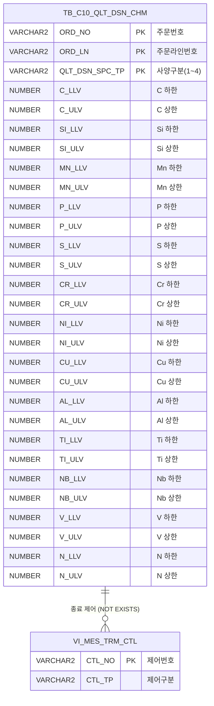

<h1 style="font-size: 40px; text-align: center; font-weight:
   bold; margin: 30px 0;">
  C104000020TAB02 레거시 시스템 분석 종합 보고서
</h1>


# 1. 시스템 개요
- **서비스 ID**: C104000020TAB02
- **업무명**: 품질설계결과 - 성분 탭
- **분석 일시**: 2026-03-16 (KST)
- **전체 Activity 수**: 2개 (Built-in: 2개, Custom: 0개)
- **분석자**: Claude Opus 4.6 / Claude Sonnet 4.6
- **분석 도구**: /analyze-service C104000020TAB02
- **문서 버전**: 1.0

# 📊 비즈니스 프로세스 분석

## 시스템 목적

C104000020TAB02는 품질설계결과 화면(C104000020)의 **성분(Chemistry)** 탭으로, 특정 주문(ORD_NO, ORD_LN)에 대한 화학 성분별 품질설계 기준값을 사양 유형별로 조회하는 읽기 전용 화면이다.

철강 제품의 품질설계 시 각 화학 원소(C, Si, Mn, P, S, Cr, Ni, Cu, Al, Ti, Nb, V, N)의 허용 범위(하한값/상한값)를 고객사양, 규격사양, 사내사양, 보증사양의 4가지 사양 유형별로 표시한다. 이를 통해 품질 담당자는 특정 주문에 적용되는 성분 기준을 한눈에 확인하고, 실제 생산 시 성분 목표값 설정 및 품질 판정의 근거로 활용할 수 있다.

본 서비스는 부모 화면(C104000020)의 조회 폼(C104000020_Form_1)에서 전달받은 주문번호와 주문라인을 파라미터로 사용하며, 별도의 입력/수정 기능 없이 순수 조회 목적으로만 사용된다. 두 개의 그리드로 분리하여 주요 성분(7종)과 미량 성분(6종)을 각각 표시하며, 두 그리드 간 행 선택이 동기화되어 동일 사양 유형을 동시에 확인할 수 있다.

<!-- 워크플로우 다이어그램 생략: Custom Activity 0개, SELECT 쿼리만 사용, Router → 단일 조회 Activity 구조 -->

## 주요 유즈케이스

### UC-01: 주문별 성분 설계 기준 조회
- **Actor**: 품질설계 담당자 / 오퍼레이터
- **목적**: 특정 주문의 화학 성분별 품질설계 하한/상한 기준값을 사양 유형별로 확인하여, 생산 시 성분 목표값 설정 및 품질 판정 근거를 확보

- **전제조건**:
  - 부모 화면(C104000020)이 열려 있고 주문번호가 선택되어 있음
  - 해당 주문에 대한 품질설계 성분 데이터(TB_C10_QLT_DSN_CHM)가 존재함
  - 해당 주문이 종료 처리(VI_MES_TRM_CTL의 CTL_TP='O')되지 않은 상태

- **주요 흐름**:
  1. 부모 화면에서 주문번호/주문라인 선택 후 조회 버튼 클릭
  2. C104000020_Form_1의 파라미터(ORD_NO, ORD_LN)로 C104000020TAB02.select 쿼리 실행
  3. Grid_2(주요 성분)에 고객/규격/사내/보증사양별 C, Si, Mn, P, S, Cr, Ni 하한/상한 표시
  4. Grid_2 로드 완료 콜백에서 Grid_1(미량 성분) 조회 자동 실행
  5. Grid_1에 Cu, Al, Ti, Nb, V, N 하한/상한 표시

- **대체 흐름**:
  - 해당 주문에 성분 설계 데이터가 없는 경우: DUAL 기반 초기행으로 4개 사양 유형 행이 NULL 값으로 표시됨
  - 종료 처리된 주문(CTL_TP='O'): NOT EXISTS 조건으로 해당 데이터 제외, NULL 행만 표시
  - 특정 사양 유형만 등록된 경우: 미등록 사양은 DUAL 초기행의 NULL 값 유지, 등록된 사양만 실제값 표시

- **후행조건**:
  - 두 그리드에 4행(고객/규격/보증/사내사양)이 표시됨
  - 그리드 행 선택 시 두 그리드 간 동기화 동작

### UC-02: 사양 유형별 성분 기준 비교
- **Actor**: 품질설계 담당자
- **목적**: 고객사양, 규격사양, 사내사양, 보증사양 간 성분 기준값 차이를 비교하여 가장 엄격한 기준 확인

- **전제조건**:
  - UC-01에 의해 성분 데이터가 조회되어 그리드에 표시된 상태

- **주요 흐름**:
  1. Grid_2에서 특정 사양 유형 행 클릭 (예: 고객사양)
  2. Grid_1에서 동일 행이 자동 선택됨 (doOnRowSelectedGrid2 → Grid_1 동기화)
  3. 주요 성분(Grid_2)과 미량 성분(Grid_1)을 동시에 확인
  4. 다른 사양 유형 행 클릭 시 동일한 동기화 반복

- **대체 흐름**:
  - Grid_1에서 먼저 행 선택 시: doOnRowSelectedGrid1 → Grid_2 동기화

- **후행조건**:
  - 두 그리드에서 동일 사양 유형 행이 선택된 상태

### UC-03: 성분 데이터 Excel 내보내기
- **Actor**: 품질설계 담당자
- **목적**: 조회된 성분 기준값을 Excel 파일로 내보내 외부 보고서 작성에 활용

- **전제조건**:
  - 성분 데이터가 그리드에 표시된 상태

- **주요 흐름**:
  1. 그리드 영역에서 마우스 우클릭
  2. 컨텍스트 메뉴에서 "엑셀 출력" (excel_grid) 선택
  3. 해당 그리드 데이터가 Excel 파일로 다운로드

- **대체 흐름**:
  - 컨텍스트 메뉴의 "행 복사" (copy_row) 선택 시: 선택 셀 데이터를 클립보드에 복사

- **후행조건**:
  - Excel 파일이 사용자 PC에 다운로드됨

---
## 비즈니스 로직 상세

### 1. 사양 유형별 성분 데이터 피벗 조회 패턴

- **목적**: 4가지 사양 유형(고객/규격/사내/보증)에 대해 데이터 유무와 관계없이 항상 4행을 반환하여 그리드에 고정 행 표시
- **처리 케이스**:

  **[케이스 1: DUAL 초기행 생성]**
  ```
    조건: 데이터 존재 여부와 무관하게 항상 실행
    처리:
      1. DUAL 테이블에서 사양 유형 코드 '1'~'4'에 대해 각각 NULL 값 행 4개 생성
      2. 실제 데이터(TB_C10_QLT_DSN_CHM)와 UNION ALL로 합산
      3. GROUP BY + MAX 집계로 각 사양 유형별 실제값/NULL 병합
      4. NULL과 실제값이 공존하면 MAX로 실제값이 우선 선택됨
  ```

  **[케이스 2: 사양 유형 코드 → 한글명 변환]**
  ```
    조건: 모든 조회 결과에 적용
    처리:
      1. DECODE 함수로 사양 유형 코드를 한글명으로 변환
         - '1' → '고객사양'
         - '2' → '규격사양'
         - '3' → '사내사양'
         - '4' → '보증사양'
      2. 원본 코드값은 QLT_DSN_SPC_TP_CD로 별도 보존 (정렬용)
  ```

  **[케이스 3: 종료 주문 제외 필터링]**
  ```
    조건: 실제 데이터 조회 시 적용 (DUAL 초기행에는 미적용)
    처리:
      1. VI_MES_TRM_CTL 뷰에서 CTL_NO = ORD_NO AND CTL_TP = 'O' 조건 확인
      2. NOT EXISTS로 종료 처리된 주문의 성분 데이터 제외
      3. 종료 주문이면 DUAL 초기행(NULL)만 반환됨
  ```

### 2. 성분 원소 분류 및 표시 체계

- **목적**: 13종 화학 원소를 주요 성분과 미량 성분으로 분류하여 2단 그리드로 표시
- **처리 케이스**:

  **[주요 성분 (Grid_2) - 7종]**
  ```
    원소: C(탄소), Si(규소), Mn(망간), P(인), S(황), Cr(크롬), Ni(니켈)
    표시: 각 원소별 하한(LLV)/상한(ULV) 쌍, 소수점 4자리(0.0000)
    단위: 중량 백분율(%)
  ```

  **[미량 성분 (Grid_1) - 6종]**
  ```
    원소: Cu(구리), Al(알루미늄), Ti(티타늄), Nb(니오브), V(바나듐), N(질소)
    표시: 각 원소별 하한(LLV)/상한(ULV) 쌍, 소수점 4자리(0.0000)
    단위: 중량 백분율(%)
  ```

---

# 💾 데이터 요구사항

## 핵심 테이블

### 1. C10APUSER.TB_C10_QLT_DSN_CHM - 품질설계 성분 기준 테이블
| 컬럼명 | 타입 | PK | 설명 |
|--------|------|----|-----|
| ORD_NO | VARCHAR2 | ✅ | 주문번호 |
| ORD_LN | VARCHAR2 | ✅ | 주문라인번호 |
| QLT_DSN_SPC_TP | VARCHAR2 | ✅ | 품질설계사양구분 (1:고객, 2:규격, 3:사내, 4:보증) |
| C_LLV | NUMBER | | 탄소(C) 하한값 |
| C_ULV | NUMBER | | 탄소(C) 상한값 |
| SI_LLV | NUMBER | | 규소(Si) 하한값 |
| SI_ULV | NUMBER | | 규소(Si) 상한값 |
| MN_LLV | NUMBER | | 망간(Mn) 하한값 |
| MN_ULV | NUMBER | | 망간(Mn) 상한값 |
| P_LLV | NUMBER | | 인(P) 하한값 |
| P_ULV | NUMBER | | 인(P) 상한값 |
| S_LLV | NUMBER | | 황(S) 하한값 |
| S_ULV | NUMBER | | 황(S) 상한값 |
| CR_LLV | NUMBER | | 크롬(Cr) 하한값 |
| CR_ULV | NUMBER | | 크롬(Cr) 상한값 |
| NI_LLV | NUMBER | | 니켈(Ni) 하한값 |
| NI_ULV | NUMBER | | 니켈(Ni) 상한값 |
| CU_LLV | NUMBER | | 구리(Cu) 하한값 |
| CU_ULV | NUMBER | | 구리(Cu) 상한값 |
| AL_LLV | NUMBER | | 알루미늄(Al) 하한값 |
| AL_ULV | NUMBER | | 알루미늄(Al) 상한값 |
| TI_LLV | NUMBER | | 티타늄(Ti) 하한값 |
| TI_ULV | NUMBER | | 티타늄(Ti) 상한값 |
| NB_LLV | NUMBER | | 니오브(Nb) 하한값 |
| NB_ULV | NUMBER | | 니오브(Nb) 상한값 |
| V_LLV | NUMBER | | 바나듐(V) 하한값 |
| V_ULV | NUMBER | | 바나듐(V) 상한값 |
| N_LLV | NUMBER | | 질소(N) 하한값 |
| N_ULV | NUMBER | | 질소(N) 상한값 |

### 2. MESAPUSER.VI_MES_TRM_CTL - 종료 제어 뷰
| 컬럼명 | 타입 | PK | 설명 |
|--------|------|----|-----|
| CTL_NO | VARCHAR2 | ✅ | 제어번호 (주문번호와 매핑) |
| CTL_TP | VARCHAR2 | | 제어구분 ('O': 주문 종료) |

## 데이터 플로우

### 1. 조회

```
[부모 화면에서 주문 선택 후 성분 탭 조회]
부모 화면(C104000020) → C104000020_Form_1 파라미터 전달 (ORD_NO, ORD_LN)
→ C104000020TAB02.select
  FROM DUAL (초기행 4개: 사양유형 '1'~'4' NULL 값)
  UNION ALL
  FROM C10APUSER.TB_C10_QLT_DSN_CHM A
  WHERE ORD_NO = :ORD_NO AND ORD_LN = :ORD_LN
    AND NOT EXISTS (MESAPUSER.VI_MES_TRM_CTL: CTL_NO = A.ORD_NO, CTL_TP = 'O')
  GROUP BY QLT_DSN_SPC_TP (MAX 집계로 피벗)
  ORDER BY QLT_DSN_SPC_TP_CD
→ Grid_2에 주요 성분(C, Si, Mn, P, S, Cr, Ni) 하한/상한 표시
→ Grid_1에 미량 성분(Cu, Al, Ti, Nb, V, N) 하한/상한 표시
```

## SQL 일람표
| SQL 이름 | 쿼리 ID | 타입 | 출처 | 테이블 |
|---------|---------|-----|-------|-------|
| 성분 설계 기준 조회 | C104000020TAB02.select | SELECT | Service | C10APUSER.TB_C10_QLT_DSN_CHM, MESAPUSER.VI_MES_TRM_CTL, DUAL |

## ER 다이어그램 (핵심 관계)



관계 설명:
- **TB_C10_QLT_DSN_CHM**이 중심 테이블로 주문별/사양유형별 성분 기준값 보유
- **VI_MES_TRM_CTL**: ORD_NO = CTL_NO 매핑으로 종료 주문 필터링 (NOT EXISTS 패턴)

---

# 🖥️ 사용자 인터페이스 요구사항

## 화면 레이아웃 상세

### Layout 구조 (Absolute Positioning)
```javascript
// initLayout 미사용 - 절대 위치 기반 div 배치
// 전체 크기: 970 x 448px
{
  type: "absolute",
  totalWidth: "970px",
  totalHeight: "448px",
  components: [
    {
      id: "C104000020TAB02_Grid_2",
      type: "grid",
      top: "5px", left: "1px",
      width: "968px", height: "140px",
      description: "주요 성분 그리드 (C, Si, Mn, P, S, Cr, Ni)"
    },
    {
      id: "C104000020TAB02_Grid_1",
      type: "grid",
      top: "190px", left: "1px",
      width: "968px", height: "140px",
      description: "미량 성분 그리드 (Cu, Al, Ti, Nb, V, N)"
    },
    {
      id: "messagebox",
      type: "messagebox",
      top: "429px", left: "1px",
      width: "968px", height: "19px",
      description: "상태 메시지 영역"
    }
  ]
}
```

## 입출력 요소

### Grid 컴포넌트

**C104000020TAB02_Grid_2 (주요 성분 사양)**
- 편집 가능 여부: 아니오 (읽기 전용)
- Split: 없음 (0)
- 2단 헤더: 원소명(#cspan 병합) + 하한/상한
- 고정 행: 4행 (고객사양, 규격사양, 보증사양, 사내사양)
- 주요 컬럼 (15개):

  **기본 정보**:
  - QLT_DSN_SPC_TP: ro - 사양구분 (16%, 중앙정렬)

  **C(탄소)**:
  - C_LLV: ron - C 하한값 (6%, 중앙정렬, 0.0000 포맷)
  - C_ULV: ron - C 상한값 (6%, 중앙정렬, 0.0000 포맷)

  **Si(규소)**:
  - SI_LLV: ron - Si 하한값 (6%, 중앙정렬, 0.0000 포맷)
  - SI_ULV: ron - Si 상한값 (6%, 중앙정렬, 0.0000 포맷)

  **Mn(망간)**:
  - MN_LLV: ron - Mn 하한값 (6%, 중앙정렬, 0.0000 포맷)
  - MN_ULV: ron - Mn 상한값 (6%, 중앙정렬, 0.0000 포맷)

  **P(인)**:
  - P_LLV: ron - P 하한값 (6%, 중앙정렬, 0.0000 포맷)
  - P_ULV: ron - P 상한값 (6%, 중앙정렬, 0.0000 포맷)

  **S(황)**:
  - S_LLV: ron - S 하한값 (6%, 중앙정렬, 0.0000 포맷)
  - S_ULV: ron - S 상한값 (6%, 중앙정렬, 0.0000 포맷)

  **Cr(크롬)**:
  - CR_LLV: ron - Cr 하한값 (6%, 중앙정렬, 0.0000 포맷)
  - CR_ULV: ron - Cr 상한값 (6%, 중앙정렬, 0.0000 포맷)

  **Ni(니켈)**:
  - NI_LLV: ron - Ni 하한값 (6%, 중앙정렬, 0.0000 포맷)
  - NI_ULV: ron - Ni 상한값 (*, 중앙정렬, 0.0000 포맷)

**C104000020TAB02_Grid_1 (미량 성분 사양)**
- 편집 가능 여부: 아니오 (읽기 전용)
- Split: 없음 (0)
- 2단 헤더: 원소명(#cspan 병합) + 하한/상한
- 고정 행: 4행 (고객사양, 규격사양, 보증사양, 사내사양)
- 주요 컬럼 (13개):

  **기본 정보**:
  - QLT_DSN_SPC_TP: ro - 사양구분 (16%, 중앙정렬)

  **Cu(구리)**:
  - CU_LLV: ron - Cu 하한값 (6%, 중앙정렬, 0.0000 포맷)
  - CU_ULV: ron - Cu 상한값 (6%, 중앙정렬, 0.0000 포맷)

  **Al(알루미늄)**:
  - AL_LLV: ron - Al 하한값 (6%, 중앙정렬, 0.0000 포맷)
  - AL_ULV: ron - Al 상한값 (6%, 중앙정렬, 0.0000 포맷)

  **Ti(티타늄)**:
  - TI_LLV: ron - Ti 하한값 (6%, 중앙정렬, 0.0000 포맷)
  - TI_ULV: ron - Ti 상한값 (6%, 중앙정렬, 0.0000 포맷)

  **Nb(니오브)**:
  - NB_LLV: ron - Nb 하한값 (6%, 중앙정렬, 0.0000 포맷)
  - NB_ULV: ron - Nb 상한값 (6%, 중앙정렬, 0.0000 포맷)

  **V(바나듐)**:
  - V_LLV: ron - V 하한값 (6%, 중앙정렬, 0.0000 포맷)
  - V_ULV: ron - V 상한값 (6%, 중앙정렬, 0.0000 포맷)

  **N(질소)**:
  - N_LLV: ron - N 하한값 (6%, 중앙정렬, 0.0000 포맷)
  - N_ULV: ron - N 상한값 (6%, 중앙정렬, 0.0000 포맷)

## 화면 동작 흐름

### 1. 화면 초기 로딩 (탭 진입)
```
1. 부모 화면(C104000020)에서 성분 탭 클릭
2. C104000020TAB02.jsp 로드
3. Grid_2 XML 설정 파일 로드 (C104000020TAB02_Grid_2.xml)
4. Grid_2 onXLE 이벤트 발생 → onGridLoadEvent2 실행
   - C104000020_Form_1 파라미터로 Grid_2 조회 URL 생성
   - Grid_2 데이터 로드
   - onXLE 이벤트 해제 (최초 1회만)
5. Grid_1 XML 설정 파일 로드 (C104000020TAB02_Grid_1.xml)
6. Grid_1 onXLE 이벤트 발생 → onGridLoadEvent1 실행
   - C104000020_Form_1 파라미터로 Grid_1 조회 URL 생성
   - Grid_1 데이터 로드
   - onXLE 이벤트 해제 (최초 1회만)
7. 상태바(messagebox) 초기화
```

### 2. 주문 변경 후 재조회 (find)
```
1. 부모 화면에서 다른 주문번호/주문라인 선택
2. find 함수 호출
3. C104000020_Form_1 파라미터로 Grid_2 조회 URL 생성
4. Grid_2 데이터 로드 (basicGridData.do → C104000020TAB02-service → C104000020TAB02.select)
5. Grid_2 로드 완료 콜백에서 Grid_1 조회 URL 생성 및 로드
6. 두 그리드 모두 갱신 완료
```

### 3. 그리드 간 행 선택 동기화
```
1. Grid_2에서 특정 행 클릭 (예: "규격사양" 행)
2. doOnRowSelectedGrid2 이벤트 핸들러 실행
3. 선택된 rowId로 Grid_1에서 동일 행 자동 선택
4. (역방향) Grid_1에서 행 클릭 시 doOnRowSelectedGrid1 → Grid_2 동기화
```

### 4. 컨텍스트 메뉴 (우클릭)
```
1. 그리드 영역에서 마우스 우클릭
2. 컨텍스트 메뉴 표시
3. onGridContextMenuClick 핸들러로 메뉴 항목 처리:
   - copy_row: 선택 셀 데이터를 클립보드에 복사
   - excel_grid: 그리드 데이터를 Excel 파일로 내보내기
```

## JavaScript 모듈

**C104000020TAB02.jsp** (인라인 스크립트)
- find(): 부모 폼 파라미터 기반 두 그리드 데이터 조회 (C104000020_Form_1 참조)
- onGridLoadEvent1(): Grid_1 초기 XML 로드 완료 시 자동 데이터 조회 (onXLE 이벤트, 1회성)
- onGridLoadEvent2(): Grid_2 초기 XML 로드 완료 시 자동 데이터 조회 (onXLE 이벤트, 1회성)
- doOnRowSelectedGrid2(): Grid_2 행 선택 → Grid_1 동기화 (onRowSelect)
- doOnRowSelectedGrid1(): Grid_1 행 선택 → Grid_2 동기화 (onRowSelect)
- save(): referenceItem 그리드 데이터 서버 저장
- refresh(): referenceItem 그리드 선택 초기화
- add(): referenceItem 그리드 신규 행 추가
- remove(): referenceItem 그리드 행 삭제
- copy(): 선택 행 클립보드 복사 (탭 구분자)
- paste(): 클립보드 데이터 그리드 행 추가
- undo(): 그리드 이전 상태 되돌리기
- redo(): 그리드 다시 실행
- onGridContextMenuClick(id, zoneId, cas): 컨텍스트 메뉴 처리 (copy_row, excel_grid)

## 주요 이벤트 핸들러

**find (외부 폼 조회)**
- 이벤트 타입: 부모 화면 조회 버튼 클릭
- 처리 내용:
  1. C104000020_Form_1 폼에서 ORD_NO, ORD_LN 파라미터 추출
  2. Grid_2 조회 URL 생성 및 데이터 로드
  3. Grid_2 로드 완료 콜백에서 Grid_1 조회 URL 생성 및 로드
  4. 두 그리드 모두 C104000020TAB02.select 쿼리 결과 표시

**doOnRowSelectedGrid2 (Grid_2 행 선택)**
- 이벤트 타입: Grid Row Select
- 처리 내용:
  1. 선택된 rowId 추출
  2. Grid_1에서 동일 rowId 행 선택 (selectRowById)

**doOnRowSelectedGrid1 (Grid_1 행 선택)**
- 이벤트 타입: Grid Row Select
- 처리 내용:
  1. 선택된 rowId 추출
  2. Grid_2에서 동일 rowId 행 선택 (selectRowById)

---

# 📌 특이사항 및 주의사항

## 1. DUAL 기반 고정 행 보장 패턴
- **초기행 생성**: 데이터 유무와 관계없이 항상 4행(고객/규격/사내/보증사양)을 반환하기 위해 DUAL에서 NULL 초기행 4개를 생성하고 UNION ALL + GROUP BY MAX 패턴을 사용. 이 패턴은 그리드의 staticRows 설정과 연동되어 데이터가 없어도 사양 구분명이 표시됨.

## 2. GROUP BY DECODE 불일치
- **잠재적 버그**: SQL의 GROUP BY 절에서 `DECODE(QLT_DSN_SPC_TP,'1','고객사양','2','규격사양','3','사내사양','보증사양')`로 되어 있어, '4' 코드의 DECODE에 첫번째 인자('4')가 누락됨. SELECT 절에서는 `'4','보증사양'`으로 올바르게 매핑하나, GROUP BY에서는 default 값으로 '보증사양'이 적용됨. 현재 동작에는 영향 없으나 코드 정합성 관점에서 주의 필요.

## 3. 두 그리드 동일 쿼리 이중 호출
- **성능 고려사항**: Grid_2와 Grid_1이 동일한 C104000020TAB02.select 쿼리를 각각 호출하여 동일 데이터를 2회 조회함. 두 그리드는 동일 데이터의 서로 다른 컬럼을 표시하므로, 클라이언트 측 데이터 분리로 1회 조회로 최적화 가능한 구조.

## 4. 읽기 전용 화면에 편집 관련 함수 존재
- **미사용 코드**: 화면은 읽기 전용(ro/ron 타입)이나 save(), add(), remove(), copy(), paste(), undo(), redo() 등 편집 관련 JavaScript 함수가 정의되어 있음. 이는 GLUE Framework의 공통 템플릿에서 자동 생성된 것으로, 실제 사용되지 않는 코드.

## 5. 부모 화면 의존성
- **파라미터 의존**: 조회 파라미터(ORD_NO, ORD_LN)를 부모 화면(C104000020)의 Form_1에서 가져오므로, 이 탭은 독립적으로 사용 불가. 부모 화면의 폼 구조 변경 시 본 탭의 조회 기능에 직접 영향.

---

# 📚 참고 문서

- **Service XML**: `src/service/C104000020TAB02-service.xml`
- **Query SQL**: `src/query/C104000020TAB02-query.glue_sql`
- **JSP**: `WebContents/C104000020TAB02.jsp`
- **Grid XML**:
  - `WebContents/header/kr/C104000020TAB02/C104000020TAB02_Grid_1.xml`
  - `WebContents/header/kr/C104000020TAB02/C104000020TAB02_Grid_2.xml`
